<!-- audit-loop:architectural-map -->
# Architecture Map — Lbstrydom/ai-organiser

- Generated: 2026-05-03T21:07:04.399Z   commit: b4e38efc2daf   refresh_id: 67f887f4-608d-4b78-85b5-bc05d9752190
- Drift score: 137 / threshold 20   status: `RED`
- Domains: 33   Symbols: 2449   Layering violations: 0

## Contents
- [arch-memory](#arch-memory) — 49 symbols
- [audio-narration](#audio-narration) — 28 symbols
- [audit-loop-lib](#audit-loop-lib) — 294 symbols
- [audit-loop-scripts](#audit-loop-scripts) — 238 symbols
- [canvas](#canvas) — 33 symbols
- [chat](#chat) — 109 symbols
- [commands](#commands) — 183 symbols
- [core](#core) — 29 symbols
- [embeddings](#embeddings) — 13 symbols
- [export](#export) — 21 symbols
- [i18n](#i18n) — 3 symbols
- [kindle](#kindle) — 102 symbols
- [llm-adapters](#llm-adapters) — 45 symbols
- [long-running-ops](#long-running-ops) — 2 symbols
- [newsletter](#newsletter) — 17 symbols
- [notebooklm](#notebooklm) — 31 symbols
- [persona-harness](#persona-harness) — 101 symbols
- [pptx-export](#pptx-export) — 27 symbols
- [progress](#progress) — 11 symbols
- [prompts](#prompts) — 115 symbols
- [research](#research) — 24 symbols
- [root-scripts](#root-scripts) — 15 symbols
- [services](#services) — 206 symbols
- [sketch](#sketch) — 7 symbols
- [src](#src) — 2 symbols
- [tests](#tests) — 219 symbols
- [tests-mocks](#tests-mocks) — 23 symbols
- [tts](#tts) — 26 symbols
- [ui](#ui) — 169 symbols
- [ui-chat](#ui-chat) — 37 symbols
- [utils](#utils) — 237 symbols
- [validators](#validators) — 24 symbols
- [vector-store](#vector-store) — 9 symbols

---

## arch-memory

> The `arch-memory` domain analyzes architectural consistency by detecting symbol drift (deviations from expected locations), identifying duplicate symbols across files, and generating JSON-formatted reports for CI/CD integration.


```mermaid
flowchart TB
subgraph dom_arch_memory ["arch-memory"]
  file_scripts_symbol_index_drift_mjs["scripts/symbol-index/drift.mjs"]:::component
  sym_scripts_symbol_index_drift_mjs_atomicWri["atomicWrite"]:::symbol
  file_scripts_symbol_index_drift_mjs --> sym_scripts_symbol_index_drift_mjs_atomicWri
  sym_scripts_symbol_index_drift_mjs_classify["classify"]:::symbol
  file_scripts_symbol_index_drift_mjs --> sym_scripts_symbol_index_drift_mjs_classify
  sym_scripts_symbol_index_drift_mjs_main["main"]:::symbol
  file_scripts_symbol_index_drift_mjs --> sym_scripts_symbol_index_drift_mjs_main
  sym_scripts_symbol_index_drift_mjs_parseArgs["parseArgs"]:::symbol
  file_scripts_symbol_index_drift_mjs --> sym_scripts_symbol_index_drift_mjs_parseArgs
  sym_scripts_symbol_index_drift_mjs_renderMar["renderMarkdownViaShared"]:::symbol
  file_scripts_symbol_index_drift_mjs --> sym_scripts_symbol_index_drift_mjs_renderMar
  file_scripts_symbol_index_duplicates_mjs["scripts/symbol-index/duplicates.mjs"]:::component
  sym_scripts_symbol_index_duplicates_mjs_main["main"]:::symbol
  file_scripts_symbol_index_duplicates_mjs --> sym_scripts_symbol_index_duplicates_mjs_main
  sym_scripts_symbol_index_duplicates_mjs_pars["parseArgs"]:::symbol
  file_scripts_symbol_index_duplicates_mjs --> sym_scripts_symbol_index_duplicates_mjs_pars
  sym_scripts_symbol_index_duplicates_mjs_rend["renderText"]:::symbol
  file_scripts_symbol_index_duplicates_mjs --> sym_scripts_symbol_index_duplicates_mjs_rend
  file_scripts_symbol_index_embed_mjs["scripts/symbol-index/embed.mjs"]:::component
  sym_scripts_symbol_index_embed_mjs_compose["compose"]:::symbol
  file_scripts_symbol_index_embed_mjs --> sym_scripts_symbol_index_embed_mjs_compose
  sym_scripts_symbol_index_embed_mjs_embedBatc["embedBatch"]:::symbol
  file_scripts_symbol_index_embed_mjs --> sym_scripts_symbol_index_embed_mjs_embedBatc
  sym_scripts_symbol_index_embed_mjs_emit["emit"]:::symbol
  file_scripts_symbol_index_embed_mjs --> sym_scripts_symbol_index_embed_mjs_emit
  sym_scripts_symbol_index_embed_mjs_getGemini["getGeminiClient"]:::symbol
  file_scripts_symbol_index_embed_mjs --> sym_scripts_symbol_index_embed_mjs_getGemini
  sym_scripts_symbol_index_embed_mjs_logProgre["logProgress"]:::symbol
  file_scripts_symbol_index_embed_mjs --> sym_scripts_symbol_index_embed_mjs_logProgre
  sym_scripts_symbol_index_embed_mjs_main["main"]:::symbol
  file_scripts_symbol_index_embed_mjs --> sym_scripts_symbol_index_embed_mjs_main
  file_scripts_symbol_index_extract_mjs["scripts/symbol-index/extract.mjs"]:::component
  sym_scripts_symbol_index_extract_mjs_emit["emit"]:::symbol
  file_scripts_symbol_index_extract_mjs --> sym_scripts_symbol_index_extract_mjs_emit
  sym_scripts_symbol_index_extract_mjs_emitPro["emitProgress"]:::symbol
  file_scripts_symbol_index_extract_mjs --> sym_scripts_symbol_index_extract_mjs_emitPro
  sym_scripts_symbol_index_extract_mjs_enumera["enumerateFiles"]:::symbol
  file_scripts_symbol_index_extract_mjs --> sym_scripts_symbol_index_extract_mjs_enumera
  sym_scripts_symbol_index_extract_mjs_extract["extractGraphAndViolations"]:::symbol
  file_scripts_symbol_index_extract_mjs --> sym_scripts_symbol_index_extract_mjs_extract
  sym_scripts_symbol_index_extract_mjs_extract["extractSymbols"]:::symbol
  file_scripts_symbol_index_extract_mjs --> sym_scripts_symbol_index_extract_mjs_extract
  sym_scripts_symbol_index_extract_mjs_isInter["isInternalEdge"]:::symbol
  file_scripts_symbol_index_extract_mjs --> sym_scripts_symbol_index_extract_mjs_isInter
  sym_scripts_symbol_index_extract_mjs_main["main"]:::symbol
  file_scripts_symbol_index_extract_mjs --> sym_scripts_symbol_index_extract_mjs_main
  sym_scripts_symbol_index_extract_mjs_parseAr["parseArgs"]:::symbol
  file_scripts_symbol_index_extract_mjs --> sym_scripts_symbol_index_extract_mjs_parseAr
  file_scripts_symbol_index_prune_mjs["scripts/symbol-index/prune.mjs"]:::component
  sym_scripts_symbol_index_prune_mjs_main["main"]:::symbol
  file_scripts_symbol_index_prune_mjs --> sym_scripts_symbol_index_prune_mjs_main
  sym_scripts_symbol_index_prune_mjs_parseArgs["parseArgs"]:::symbol
  file_scripts_symbol_index_prune_mjs --> sym_scripts_symbol_index_prune_mjs_parseArgs
  file_scripts_symbol_index_refresh_mjs["scripts/symbol-index/refresh.mjs"]:::component
  sym_scripts_symbol_index_refresh_mjs_gitComm["gitCommitSha"]:::symbol
  file_scripts_symbol_index_refresh_mjs --> sym_scripts_symbol_index_refresh_mjs_gitComm
  sym_scripts_symbol_index_refresh_mjs_gitDiff["gitDiffWithWorkingTree"]:::symbol
  file_scripts_symbol_index_refresh_mjs --> sym_scripts_symbol_index_refresh_mjs_gitDiff
  sym_scripts_symbol_index_refresh_mjs_isSafeG["isSafeGitRevision"]:::symbol
  file_scripts_symbol_index_refresh_mjs --> sym_scripts_symbol_index_refresh_mjs_isSafeG
  sym_scripts_symbol_index_refresh_mjs_logErr["logErr"]:::symbol
  file_scripts_symbol_index_refresh_mjs --> sym_scripts_symbol_index_refresh_mjs_logErr
  sym_scripts_symbol_index_refresh_mjs_logOk["logOk"]:::symbol
  file_scripts_symbol_index_refresh_mjs --> sym_scripts_symbol_index_refresh_mjs_logOk
  sym_scripts_symbol_index_refresh_mjs_main["main"]:::symbol
  file_scripts_symbol_index_refresh_mjs --> sym_scripts_symbol_index_refresh_mjs_main
  sym_scripts_symbol_index_refresh_mjs_parseAr["parseArgs"]:::symbol
  file_scripts_symbol_index_refresh_mjs --> sym_scripts_symbol_index_refresh_mjs_parseAr
  sym_scripts_symbol_index_refresh_mjs_runJson["runJsonLines"]:::symbol
  file_scripts_symbol_index_refresh_mjs --> sym_scripts_symbol_index_refresh_mjs_runJson
  sym_scripts_symbol_index_refresh_mjs_runWith["runWithHeartbeat"]:::symbol
  file_scripts_symbol_index_refresh_mjs --> sym_scripts_symbol_index_refresh_mjs_runWith
  file_scripts_symbol_index_render_mermaid_mjs["scripts/symbol-index/render-mermaid.mjs"]:::component
  sym_scripts_symbol_index_render_mermaid_mjs_["classify"]:::symbol
  file_scripts_symbol_index_render_mermaid_mjs --> sym_scripts_symbol_index_render_mermaid_mjs_
  sym_scripts_symbol_index_render_mermaid_mjs_["commitSha"]:::symbol
  file_scripts_symbol_index_render_mermaid_mjs --> sym_scripts_symbol_index_render_mermaid_mjs_
  sym_scripts_symbol_index_render_mermaid_mjs_["main"]:::symbol
  file_scripts_symbol_index_render_mermaid_mjs --> sym_scripts_symbol_index_render_mermaid_mjs_
  sym_scripts_symbol_index_render_mermaid_mjs_["parseArgs"]:::symbol
  file_scripts_symbol_index_render_mermaid_mjs --> sym_scripts_symbol_index_render_mermaid_mjs_
  file_scripts_symbol_index_summarise_domains_m["scripts/symbol-index/summarise-domains.mjs"]:::component
  sym_scripts_symbol_index_summarise_domains_m["cacheHit"]:::symbol
  file_scripts_symbol_index_summarise_domains_m --> sym_scripts_symbol_index_summarise_domains_m
  sym_scripts_symbol_index_summarise_domains_m["callHaiku"]:::symbol
  file_scripts_symbol_index_summarise_domains_m --> sym_scripts_symbol_index_summarise_domains_m
  sym_scripts_symbol_index_summarise_domains_m["computeCompositionHash"]:::symbol
  file_scripts_symbol_index_summarise_domains_m --> sym_scripts_symbol_index_summarise_domains_m
  sym_scripts_symbol_index_summarise_domains_m["main"]:::symbol
  file_scripts_symbol_index_summarise_domains_m --> sym_scripts_symbol_index_summarise_domains_m
  sym_scripts_symbol_index_summarise_domains_m["PROMPT_TEMPLATE"]:::symbol
  file_scripts_symbol_index_summarise_domains_m --> sym_scripts_symbol_index_summarise_domains_m
  sym_scripts_symbol_index_summarise_domains_m["summariseDomains"]:::symbol
  file_scripts_symbol_index_summarise_domains_m --> sym_scripts_symbol_index_summarise_domains_m
  sym_scripts_symbol_index_summarise_domains_m["symbolCountDeltaOk"]:::symbol
  file_scripts_symbol_index_summarise_domains_m --> sym_scripts_symbol_index_summarise_domains_m
  sym_scripts_symbol_index_summarise_domains_m["validateSummary"]:::symbol
  file_scripts_symbol_index_summarise_domains_m --> sym_scripts_symbol_index_summarise_domains_m
  file_scripts_symbol_index_summarise_mjs["scripts/symbol-index/summarise.mjs"]:::component
  sym_scripts_symbol_index_summarise_mjs_emit["emit"]:::symbol
  file_scripts_symbol_index_summarise_mjs --> sym_scripts_symbol_index_summarise_mjs_emit
  sym_scripts_symbol_index_summarise_mjs_logPr["logProgress"]:::symbol
  file_scripts_symbol_index_summarise_mjs --> sym_scripts_symbol_index_summarise_mjs_logPr
  sym_scripts_symbol_index_summarise_mjs_main["main"]:::symbol
  file_scripts_symbol_index_summarise_mjs --> sym_scripts_symbol_index_summarise_mjs_main
  sym_scripts_symbol_index_summarise_mjs_summa["summariseBatch"]:::symbol
  file_scripts_symbol_index_summarise_mjs --> sym_scripts_symbol_index_summarise_mjs_summa
end
classDef container fill:#f5f5f5,stroke:#333,stroke-width:2px,color:#000
classDef component fill:#e8f0ff,stroke:#3178c6,color:#000
classDef symbol fill:#fff,stroke:#999,color:#444
classDef dup fill:#ffe8d8,stroke:#c0392b,stroke-width:2px,color:#000
classDef violation fill:#ffd6d6,stroke:#c0392b,stroke-width:2px,color:#000
```

### Symbols in this domain

| Symbol | Kind | Path | Lines | Purpose |
|---|---|---|---|---|
| [`atomicWrite`](../scripts/symbol-index/drift.mjs#L41) | function | `scripts/symbol-index/drift.mjs` | 41-47 | Atomically writes content to a file using a temporary name then rename. |
| [`classify`](../scripts/symbol-index/drift.mjs#L49) | function | `scripts/symbol-index/drift.mjs` | 49-53 | Classifies drift status as GREEN, AMBER, or RED based on score and threshold. |
| [`main`](../scripts/symbol-index/drift.mjs#L74) | function | `scripts/symbol-index/drift.mjs` | 74-142 | <no body> |
| [`parseArgs`](../scripts/symbol-index/drift.mjs#L32) | function | `scripts/symbol-index/drift.mjs` | 32-39 | Parses command-line arguments for --out and --json flags. |
| [`renderMarkdownViaShared`](../scripts/symbol-index/drift.mjs#L59) | function | `scripts/symbol-index/drift.mjs` | 59-72 | Renders a markdown drift issue report using shared rendering logic. |
| [`main`](../scripts/symbol-index/duplicates.mjs#L64) | function | `scripts/symbol-index/duplicates.mjs` | 64-99 | <no body> |
| [`parseArgs`](../scripts/symbol-index/duplicates.mjs#L30) | function | `scripts/symbol-index/duplicates.mjs` | 30-45 | Parses command-line arguments for --limit, --json, and --help flags with validation. |
| [`renderText`](../scripts/symbol-index/duplicates.mjs#L47) | function | `scripts/symbol-index/duplicates.mjs` | 47-62 | Renders duplicate clusters as human-readable text with file paths and symbol names. |
| [`compose`](../scripts/symbol-index/embed.mjs#L82) | function | `scripts/symbol-index/embed.mjs` | 82-88 | Composes a stable text embedding input from symbol kind, name, file path, summary, and signature. |
| [`embedBatch`](../scripts/symbol-index/embed.mjs#L35) | function | `scripts/symbol-index/embed.mjs` | 35-80 | <no body> |
| [`emit`](../scripts/symbol-index/embed.mjs#L17) | function | `scripts/symbol-index/embed.mjs` | 17-17 | Outputs a JSON object as a single line to stdout. |
| [`getGeminiClient`](../scripts/symbol-index/embed.mjs#L22) | function | `scripts/symbol-index/embed.mjs` | 22-28 | Returns a cached Gemini client initialized with API key, or null if unavailable. |
| [`logProgress`](../scripts/symbol-index/embed.mjs#L18) | function | `scripts/symbol-index/embed.mjs` | 18-18 | Writes a progress message to stderr with [embed] prefix. |
| [`main`](../scripts/symbol-index/embed.mjs#L90) | function | `scripts/symbol-index/embed.mjs` | 90-132 | <no body> |
| [`emit`](../scripts/symbol-index/extract.mjs#L47) | function | `scripts/symbol-index/extract.mjs` | 47-49 | Outputs a JSON object as a single line to stdout. |
| [`emitProgress`](../scripts/symbol-index/extract.mjs#L51) | function | `scripts/symbol-index/extract.mjs` | 51-53 | Writes a progress message to stderr with [extract] prefix. |
| [`enumerateFiles`](../scripts/symbol-index/extract.mjs#L331) | function | `scripts/symbol-index/extract.mjs` | 331-349 | Recursively walks the repository directory tree to enumerate all source files, respecting skip patterns. |
| [`extractGraphAndViolations`](../scripts/symbol-index/extract.mjs#L206) | function | `scripts/symbol-index/extract.mjs` | 206-272 | Runs dependency-cruiser to detect internal module dependencies and architectural violations. |
| [`extractSymbols`](../scripts/symbol-index/extract.mjs#L62) | function | `scripts/symbol-index/extract.mjs` | 62-199 | Parses TypeScript/JavaScript source files to extract function, class, and variable symbols with metadata. |
| [`isInternalEdge`](../scripts/symbol-index/extract.mjs#L286) | function | `scripts/symbol-index/extract.mjs` | 286-302 | Filters dependency objects to identify only internal (non-npm, non-core) edges within the codebase. |
| [`main`](../scripts/symbol-index/extract.mjs#L351) | function | `scripts/symbol-index/extract.mjs` | 351-360 | Orchestrates symbol extraction, graph analysis, and reports aggregated statistics. |
| [`parseArgs`](../scripts/symbol-index/extract.mjs#L35) | function | `scripts/symbol-index/extract.mjs` | 35-45 | Parses command-line arguments for --root, --files, --mode, and --since-commit. |
| [`main`](../scripts/symbol-index/prune.mjs#L39) | function | `scripts/symbol-index/prune.mjs` | 39-120 | Prunes old refresh_run records from the cloud store, handling both completed and crashed runs. |
| [`parseArgs`](../scripts/symbol-index/prune.mjs#L26) | function | `scripts/symbol-index/prune.mjs` | 26-32 | Parses command-line arguments for dry-run mode flag. |
| [`gitCommitSha`](../scripts/symbol-index/refresh.mjs#L72) | function | `scripts/symbol-index/refresh.mjs` | 72-75 | Retrieves the current git commit SHA from the repository. |
| [`gitDiffWithWorkingTree`](../scripts/symbol-index/refresh.mjs#L96) | function | `scripts/symbol-index/refresh.mjs` | 96-129 | Executes git diff and git ls-files to enumerate added, modified, deleted, renamed, and untracked files. |
| [`isSafeGitRevision`](../scripts/symbol-index/refresh.mjs#L83) | function | `scripts/symbol-index/refresh.mjs` | 83-87 | Validates a git revision string against a strict alphanumeric allowlist to prevent injection. |
| [`logErr`](../scripts/symbol-index/refresh.mjs#L69) | function | `scripts/symbol-index/refresh.mjs` | 69-69 | Writes error messages to stderr with [refresh] prefix. |
| [`logOk`](../scripts/symbol-index/refresh.mjs#L70) | function | `scripts/symbol-index/refresh.mjs` | 70-70 | Writes success messages to stderr with [refresh] prefix. |
| [`main`](../scripts/symbol-index/refresh.mjs#L161) | function | `scripts/symbol-index/refresh.mjs` | 161-428 | <no body> |
| [`parseArgs`](../scripts/symbol-index/refresh.mjs#L58) | function | `scripts/symbol-index/refresh.mjs` | 58-67 | Parses command-line arguments for full refresh, commit range, and force flags. |
| [`runJsonLines`](../scripts/symbol-index/refresh.mjs#L135) | function | `scripts/symbol-index/refresh.mjs` | 135-150 | Spawns a subprocess, captures JSON-line output, parses each line, and returns non-null results. |
| [`runWithHeartbeat`](../scripts/symbol-index/refresh.mjs#L152) | function | `scripts/symbol-index/refresh.mjs` | 152-159 | Periodically calls heartbeat function while an async operation runs, ensuring the refresh stays alive. |
| [`classify`](../scripts/symbol-index/render-mermaid.mjs#L47) | function | `scripts/symbol-index/render-mermaid.mjs` | 47-51 | Classifies a health score as GREEN, AMBER, or RED based on thresholds. |
| [`commitSha`](../scripts/symbol-index/render-mermaid.mjs#L42) | function | `scripts/symbol-index/render-mermaid.mjs` | 42-45 | Retrieves the first 12 characters of the current git commit SHA. |
| [`main`](../scripts/symbol-index/render-mermaid.mjs#L53) | function | `scripts/symbol-index/render-mermaid.mjs` | 53-187 | <no body> |
| [`parseArgs`](../scripts/symbol-index/render-mermaid.mjs#L34) | function | `scripts/symbol-index/render-mermaid.mjs` | 34-40 | Parses command-line arguments for output file path destination. |
| [`cacheHit`](../scripts/symbol-index/summarise-domains.mjs#L55) | function | `scripts/symbol-index/summarise-domains.mjs` | 55-62 | Returns true if a cached domain summary is still valid given current composition and model. |
| [`callHaiku`](../scripts/symbol-index/summarise-domains.mjs#L64) | function | `scripts/symbol-index/summarise-domains.mjs` | 64-92 | Calls Claude Haiku API with a prompt and returns the response text plus token usage metrics. |
| [`computeCompositionHash`](../scripts/symbol-index/summarise-domains.mjs#L42) | function | `scripts/symbol-index/summarise-domains.mjs` | 42-47 | Computes a SHA256 hash of sorted symbol signatures to detect composition changes. |
| [`main`](../scripts/symbol-index/summarise-domains.mjs#L176) | function | `scripts/symbol-index/summarise-domains.mjs` | 176-208 | Loads repo identity, fetches active snapshot, summarizes domains via Haiku, and outputs results. |
| [`PROMPT_TEMPLATE`](../scripts/symbol-index/summarise-domains.mjs#L36) | function | `scripts/symbol-index/summarise-domains.mjs` | 36-40 | Generates a prompt template asking Claude to describe what a domain handles based on sample symbols. |
| [`summariseDomains`](../scripts/symbol-index/summarise-domains.mjs#L106) | function | `scripts/symbol-index/summarise-domains.mjs` | 106-173 | Fetches all symbols for a snapshot, groups by domain, checks cache hits, and calls Haiku for fresh summaries. |
| [`symbolCountDeltaOk`](../scripts/symbol-index/summarise-domains.mjs#L49) | function | `scripts/symbol-index/summarise-domains.mjs` | 49-53 | Returns true if the symbol count delta between two snapshots is within 20% tolerance. |
| [`validateSummary`](../scripts/symbol-index/summarise-domains.mjs#L94) | function | `scripts/symbol-index/summarise-domains.mjs` | 94-100 | Validates that a summary text is a non-empty string between 20 and 400 characters. |
| [`emit`](../scripts/symbol-index/summarise.mjs#L26) | function | `scripts/symbol-index/summarise.mjs` | 26-26 | Emits a JSON object to stdout. |
| [`logProgress`](../scripts/symbol-index/summarise.mjs#L27) | function | `scripts/symbol-index/summarise.mjs` | 27-27 | Writes a progress message to stderr with [summarise] prefix. |
| [`main`](../scripts/symbol-index/summarise.mjs#L70) | function | `scripts/symbol-index/summarise.mjs` | 70-113 | Reads symbol records from stdin, batches them, calls the summarization API concurrently, and outputs enriched symbols. |
| [`summariseBatch`](../scripts/symbol-index/summarise.mjs#L33) | function | `scripts/symbol-index/summarise.mjs` | 33-68 | Calls Claude API to generate one-line summaries for a batch of symbols, parsing numbered responses. |

---

## audio-narration

> The `audio-narration` domain converts note content to spoken audio by transforming Markdown to prose, synthesizing speech via configurable TTS providers, and encoding the result as MP3 files with proper normalization and output path management.

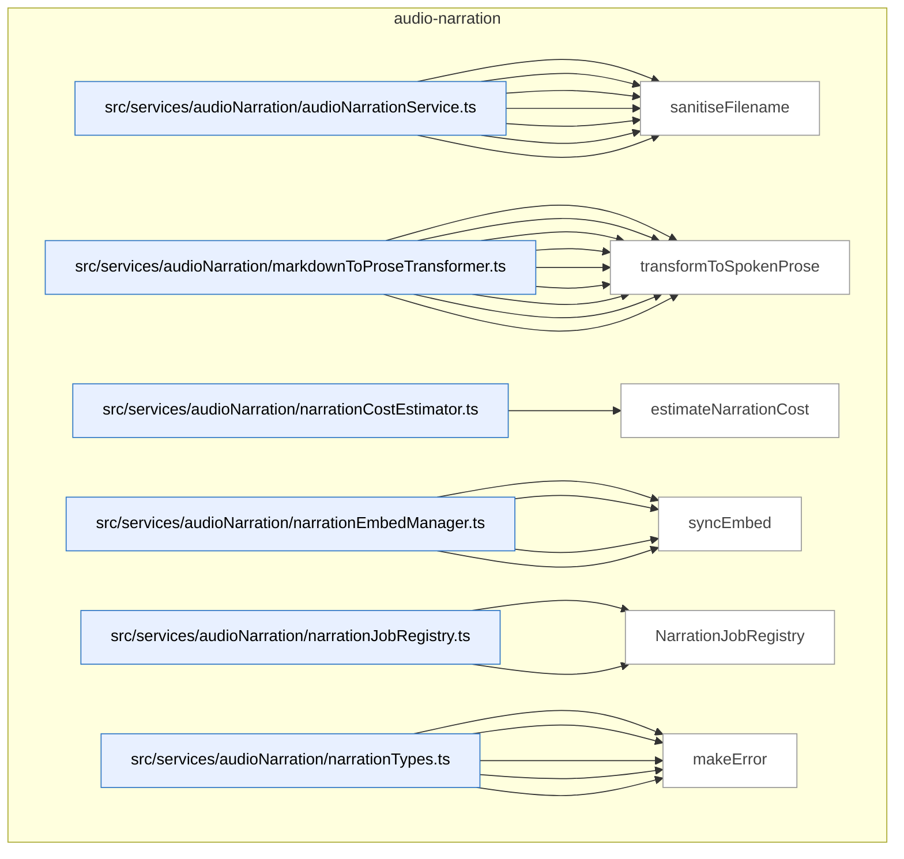
```mermaid
flowchart TB
subgraph dom_audio_narration ["audio-narration"]
  file_src_services_audioNarration_audioNarrati["src/services/audioNarration/audioNarrationService.ts"]:::component
  sym_src_services_audioNarration_audioNarrati["buildOutputPath"]:::symbol
  file_src_services_audioNarration_audioNarrati --> sym_src_services_audioNarration_audioNarrati
  sym_src_services_audioNarration_audioNarrati["describeError"]:::symbol
  file_src_services_audioNarration_audioNarrati --> sym_src_services_audioNarration_audioNarrati
  sym_src_services_audioNarration_audioNarrati["executeNarration"]:::symbol
  file_src_services_audioNarration_audioNarrati --> sym_src_services_audioNarration_audioNarrati
  sym_src_services_audioNarration_audioNarrati["isAbort"]:::symbol
  file_src_services_audioNarration_audioNarrati --> sym_src_services_audioNarration_audioNarrati
  sym_src_services_audioNarration_audioNarrati["parentFolder"]:::symbol
  file_src_services_audioNarration_audioNarrati --> sym_src_services_audioNarration_audioNarrati
  sym_src_services_audioNarration_audioNarrati["prepareNarration"]:::symbol
  file_src_services_audioNarration_audioNarrati --> sym_src_services_audioNarration_audioNarrati
  sym_src_services_audioNarration_audioNarrati["sanitiseFilename"]:::symbol
  file_src_services_audioNarration_audioNarrati --> sym_src_services_audioNarration_audioNarrati
  file_src_services_audioNarration_markdownToPr["src/services/audioNarration/markdownToProseTransformer.ts"]:::component
  sym_src_services_audioNarration_markdownToPr["capitalize"]:::symbol
  file_src_services_audioNarration_markdownToPr --> sym_src_services_audioNarration_markdownToPr
  sym_src_services_audioNarration_markdownToPr["computeStats"]:::symbol
  file_src_services_audioNarration_markdownToPr --> sym_src_services_audioNarration_markdownToPr
  sym_src_services_audioNarration_markdownToPr["dedupe"]:::symbol
  file_src_services_audioNarration_markdownToPr --> sym_src_services_audioNarration_markdownToPr
  sym_src_services_audioNarration_markdownToPr["isTableAlignmentRow"]:::symbol
  file_src_services_audioNarration_markdownToPr --> sym_src_services_audioNarration_markdownToPr
  sym_src_services_audioNarration_markdownToPr["splitTableRow"]:::symbol
  file_src_services_audioNarration_markdownToPr --> sym_src_services_audioNarration_markdownToPr
  sym_src_services_audioNarration_markdownToPr["stripInlineFormatting"]:::symbol
  file_src_services_audioNarration_markdownToPr --> sym_src_services_audioNarration_markdownToPr
  sym_src_services_audioNarration_markdownToPr["stripInlineFormattingMinimal"]:::symbol
  file_src_services_audioNarration_markdownToPr --> sym_src_services_audioNarration_markdownToPr
  sym_src_services_audioNarration_markdownToPr["tableToProse"]:::symbol
  file_src_services_audioNarration_markdownToPr --> sym_src_services_audioNarration_markdownToPr
  sym_src_services_audioNarration_markdownToPr["transformToSpokenProse"]:::symbol
  file_src_services_audioNarration_markdownToPr --> sym_src_services_audioNarration_markdownToPr
  file_src_services_audioNarration_narrationCos["src/services/audioNarration/narrationCostEstimator.ts"]:::component
  sym_src_services_audioNarration_narrationCos["estimateNarrationCost"]:::symbol
  file_src_services_audioNarration_narrationCos --> sym_src_services_audioNarration_narrationCos
  file_src_services_audioNarration_narrationEmb["src/services/audioNarration/narrationEmbedManager.ts"]:::component
  sym_src_services_audioNarration_narrationEmb["buildBlock"]:::symbol
  file_src_services_audioNarration_narrationEmb --> sym_src_services_audioNarration_narrationEmb
  sym_src_services_audioNarration_narrationEmb["describeError"]:::symbol
  file_src_services_audioNarration_narrationEmb --> sym_src_services_audioNarration_narrationEmb
  sym_src_services_audioNarration_narrationEmb["findEmbedBlock"]:::symbol
  file_src_services_audioNarration_narrationEmb --> sym_src_services_audioNarration_narrationEmb
  sym_src_services_audioNarration_narrationEmb["syncEmbed"]:::symbol
  file_src_services_audioNarration_narrationEmb --> sym_src_services_audioNarration_narrationEmb
  file_src_services_audioNarration_narrationJob["src/services/audioNarration/narrationJobRegistry.ts"]:::component
  sym_src_services_audioNarration_narrationJob["JobInFlightError"]:::symbol
  file_src_services_audioNarration_narrationJob --> sym_src_services_audioNarration_narrationJob
  sym_src_services_audioNarration_narrationJob["NarrationJobRegistry"]:::symbol
  file_src_services_audioNarration_narrationJob --> sym_src_services_audioNarration_narrationJob
  file_src_services_audioNarration_narrationTyp["src/services/audioNarration/narrationTypes.ts"]:::component
  sym_src_services_audioNarration_narrationTyp["decodeError"]:::symbol
  file_src_services_audioNarration_narrationTyp --> sym_src_services_audioNarration_narrationTyp
  sym_src_services_audioNarration_narrationTyp["encodeError"]:::symbol
  file_src_services_audioNarration_narrationTyp --> sym_src_services_audioNarration_narrationTyp
  sym_src_services_audioNarration_narrationTyp["errFrom"]:::symbol
  file_src_services_audioNarration_narrationTyp --> sym_src_services_audioNarration_narrationTyp
  sym_src_services_audioNarration_narrationTyp["isNarrationErrorCode"]:::symbol
  file_src_services_audioNarration_narrationTyp --> sym_src_services_audioNarration_narrationTyp
  sym_src_services_audioNarration_narrationTyp["makeError"]:::symbol
  file_src_services_audioNarration_narrationTyp --> sym_src_services_audioNarration_narrationTyp
end
classDef container fill:#f5f5f5,stroke:#333,stroke-width:2px,color:#000
classDef component fill:#e8f0ff,stroke:#3178c6,color:#000
classDef symbol fill:#fff,stroke:#999,color:#444
classDef dup fill:#ffe8d8,stroke:#c0392b,stroke-width:2px,color:#000
classDef violation fill:#ffd6d6,stroke:#c0392b,stroke-width:2px,color:#000
```

### Symbols in this domain

| Symbol | Kind | Path | Lines | Purpose |
|---|---|---|---|---|
| [`buildOutputPath`](../src/services/audioNarration/audioNarrationService.ts#L86) | function | `src/services/audioNarration/audioNarrationService.ts` | 86-95 | Builds the output path for narration MP3 by combining folder, sanitized filename, and fingerprint prefix. |
| [`describeError`](../src/services/audioNarration/audioNarrationService.ts#L313) | function | `src/services/audioNarration/audioNarrationService.ts` | 313-316 | Returns error message string from an Error object or converts other values to string. |
| [`executeNarration`](../src/services/audioNarration/audioNarrationService.ts#L198) | function | `src/services/audioNarration/audioNarrationService.ts` | 198-304 | Executes text-to-speech synthesis by chunking text, calling the provider engine per chunk, downsampling, normalizing audio, and encoding to MP3. |
| [`isAbort`](../src/services/audioNarration/audioNarrationService.ts#L318) | function | `src/services/audioNarration/audioNarrationService.ts` | 318-322 | Checks if an error is an AbortError by testing instanceof and name property. |
| [`parentFolder`](../src/services/audioNarration/audioNarrationService.ts#L308) | function | `src/services/audioNarration/audioNarrationService.ts` | 308-311 | Extracts the parent directory path from a file path. |
| [`prepareNarration`](../src/services/audioNarration/audioNarrationService.ts#L99) | function | `src/services/audioNarration/audioNarrationService.ts` | 99-189 | Prepares a note for text-to-speech narration by reading, transforming to prose, validating content, and resolving provider/voice. |
| [`sanitiseFilename`](../src/services/audioNarration/audioNarrationService.ts#L68) | function | `src/services/audioNarration/audioNarrationService.ts` | 68-84 | Sanitizes a filename by removing invalid characters, trimming whitespace, and renaming Windows reserved names. |
| [`capitalize`](../src/services/audioNarration/markdownToProseTransformer.ts#L334) | function | `src/services/audioNarration/markdownToProseTransformer.ts` | 334-337 | Capitalizes the first character of a string and lowercases the rest. |
| [`computeStats`](../src/services/audioNarration/markdownToProseTransformer.ts#L343) | function | `src/services/audioNarration/markdownToProseTransformer.ts` | 343-348 | Computes character count, word count, estimated duration, and section count for spoken text. |
| [`dedupe`](../src/services/audioNarration/markdownToProseTransformer.ts#L339) | function | `src/services/audioNarration/markdownToProseTransformer.ts` | 339-341 | Returns a deduplicated array using a Set. |
| [`isTableAlignmentRow`](../src/services/audioNarration/markdownToProseTransformer.ts#L291) | function | `src/services/audioNarration/markdownToProseTransformer.ts` | 291-293 | Checks if a table row is a Markdown alignment separator (e.g., `\|---\|---\|`). |
| [`splitTableRow`](../src/services/audioNarration/markdownToProseTransformer.ts#L287) | function | `src/services/audioNarration/markdownToProseTransformer.ts` | 287-289 | Splits a table row string by pipe characters and trims whitespace from each cell. |
| [`stripInlineFormatting`](../src/services/audioNarration/markdownToProseTransformer.ts#L228) | function | `src/services/audioNarration/markdownToProseTransformer.ts` | 228-283 | Strips inline Markdown formatting (links, images, wikilinks, bold, italic, code) to extract plain text for narration. |
| [`stripInlineFormattingMinimal`](../src/services/audioNarration/markdownToProseTransformer.ts#L320) | function | `src/services/audioNarration/markdownToProseTransformer.ts` | 320-330 | Strips inline formatting from text using minimal regex replacements for quick cleanup. |
| [`tableToProse`](../src/services/audioNarration/markdownToProseTransformer.ts#L295) | function | `src/services/audioNarration/markdownToProseTransformer.ts` | 295-317 | Converts a Markdown table to prose using header-summary or row-prose mode. |
| [`transformToSpokenProse`](../src/services/audioNarration/markdownToProseTransformer.ts#L28) | function | `src/services/audioNarration/markdownToProseTransformer.ts` | 28-224 | Transforms Markdown to spoken prose by stripping frontmatter, code blocks, comments, math, and processing inline formatting line-by-line. |
| [`estimateNarrationCost`](../src/services/audioNarration/narrationCostEstimator.ts#L14) | function | `src/services/audioNarration/narrationCostEstimator.ts` | 14-34 | Estimates narration cost in USD and EUR based on character count, chunk count, and provider pricing. |
| [`buildBlock`](../src/services/audioNarration/narrationEmbedManager.ts#L36) | function | `src/services/audioNarration/narrationEmbedManager.ts` | 36-38 | Builds the embed block markdown wrapping an audio file reference. |
| [`describeError`](../src/services/audioNarration/narrationEmbedManager.ts#L159) | function | `src/services/audioNarration/narrationEmbedManager.ts` | 159-162 | Returns error message string from an Error object or converts other values to string. |
| [`findEmbedBlock`](../src/services/audioNarration/narrationEmbedManager.ts#L30) | function | `src/services/audioNarration/narrationEmbedManager.ts` | 30-34 | Finds the embedded audio block position in note content using regex. |
| [`syncEmbed`](../src/services/audioNarration/narrationEmbedManager.ts#L54) | function | `src/services/audioNarration/narrationEmbedManager.ts` | 54-157 | Synchronizes the narration embed block in a note by inserting, replacing, or removing it based on enabled flag. |
| [`JobInFlightError`](../src/services/audioNarration/narrationJobRegistry.ts#L6) | class | `src/services/audioNarration/narrationJobRegistry.ts` | 6-12 | Custom error class thrown when a narration job is already in flight for a file. |
| [`NarrationJobRegistry`](../src/services/audioNarration/narrationJobRegistry.ts#L14) | class | `src/services/audioNarration/narrationJobRegistry.ts` | 14-74 | Registry managing in-flight narration jobs with start, cancel, finish, and scoped execution helper. |
| [`decodeError`](../src/services/audioNarration/narrationTypes.ts#L43) | function | `src/services/audioNarration/narrationTypes.ts` | 43-50 | Decodes a colon-separated error string back into an error object with validation. |
| [`encodeError`](../src/services/audioNarration/narrationTypes.ts#L38) | function | `src/services/audioNarration/narrationTypes.ts` | 38-40 | Encodes an error object into a colon-separated string format. |
| [`errFrom`](../src/services/audioNarration/narrationTypes.ts#L63) | function | `src/services/audioNarration/narrationTypes.ts` | 63-65 | Wraps a narration error by encoding it and returning it as a failed result. |
| [`isNarrationErrorCode`](../src/services/audioNarration/narrationTypes.ts#L58) | function | `src/services/audioNarration/narrationTypes.ts` | 58-60 | Checks if a string is a valid narration error code by looking it up in a set. |
| [`makeError`](../src/services/audioNarration/narrationTypes.ts#L33) | function | `src/services/audioNarration/narrationTypes.ts` | 33-35 | Constructs an error object with code, message, and optional cause. |

---

## audit-loop-lib

> The `audit-loop-lib` domain generates markdown architecture maps with mermaid diagrams, symbol tables, and dependency visualizations by organizing codebase symbols by domain, escaping content for safe rendering, and tracking cross-file usage patterns.

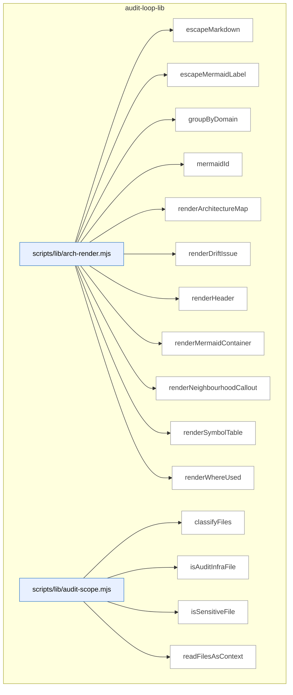
```mermaid
flowchart TB
subgraph dom_audit_loop_lib ["audit-loop-lib"]
  file_scripts_lib_arch_render_mjs["scripts/lib/arch-render.mjs"]:::component
  sym_scripts_lib_arch_render_mjs_escapeMarkdo["escapeMarkdown"]:::symbol
  file_scripts_lib_arch_render_mjs --> sym_scripts_lib_arch_render_mjs_escapeMarkdo
  sym_scripts_lib_arch_render_mjs_escapeMermai["escapeMermaidLabel"]:::symbol
  file_scripts_lib_arch_render_mjs --> sym_scripts_lib_arch_render_mjs_escapeMermai
  sym_scripts_lib_arch_render_mjs_groupByDomai["groupByDomain"]:::symbol
  file_scripts_lib_arch_render_mjs --> sym_scripts_lib_arch_render_mjs_groupByDomai
  sym_scripts_lib_arch_render_mjs_mermaidId["mermaidId"]:::symbol
  file_scripts_lib_arch_render_mjs --> sym_scripts_lib_arch_render_mjs_mermaidId
  sym_scripts_lib_arch_render_mjs_renderArchit["renderArchitectureMap"]:::symbol
  file_scripts_lib_arch_render_mjs --> sym_scripts_lib_arch_render_mjs_renderArchit
  sym_scripts_lib_arch_render_mjs_renderDriftI["renderDriftIssue"]:::symbol
  file_scripts_lib_arch_render_mjs --> sym_scripts_lib_arch_render_mjs_renderDriftI
  sym_scripts_lib_arch_render_mjs_renderHeader["renderHeader"]:::symbol
  file_scripts_lib_arch_render_mjs --> sym_scripts_lib_arch_render_mjs_renderHeader
  sym_scripts_lib_arch_render_mjs_renderMermai["renderMermaidContainer"]:::symbol
  file_scripts_lib_arch_render_mjs --> sym_scripts_lib_arch_render_mjs_renderMermai
  sym_scripts_lib_arch_render_mjs_renderNeighb["renderNeighbourhoodCallout"]:::symbol
  file_scripts_lib_arch_render_mjs --> sym_scripts_lib_arch_render_mjs_renderNeighb
  sym_scripts_lib_arch_render_mjs_renderSymbol["renderSymbolTable"]:::symbol
  file_scripts_lib_arch_render_mjs --> sym_scripts_lib_arch_render_mjs_renderSymbol
  sym_scripts_lib_arch_render_mjs_renderWhereU["renderWhereUsed"]:::symbol
  file_scripts_lib_arch_render_mjs --> sym_scripts_lib_arch_render_mjs_renderWhereU
  file_scripts_lib_audit_scope_mjs["scripts/lib/audit-scope.mjs"]:::component
  sym_scripts_lib_audit_scope_mjs_classifyFile["classifyFiles"]:::symbol
  file_scripts_lib_audit_scope_mjs --> sym_scripts_lib_audit_scope_mjs_classifyFile
  sym_scripts_lib_audit_scope_mjs_isAuditInfra["isAuditInfraFile"]:::symbol
  file_scripts_lib_audit_scope_mjs --> sym_scripts_lib_audit_scope_mjs_isAuditInfra
  sym_scripts_lib_audit_scope_mjs_isSensitiveF["isSensitiveFile"]:::symbol
  file_scripts_lib_audit_scope_mjs --> sym_scripts_lib_audit_scope_mjs_isSensitiveF
  sym_scripts_lib_audit_scope_mjs_readFilesAsC["readFilesAsContext"]:::symbol
  file_scripts_lib_audit_scope_mjs --> sym_scripts_lib_audit_scope_mjs_readFilesAsC
end
classDef container fill:#f5f5f5,stroke:#333,stroke-width:2px,color:#000
classDef component fill:#e8f0ff,stroke:#3178c6,color:#000
classDef symbol fill:#fff,stroke:#999,color:#444
classDef dup fill:#ffe8d8,stroke:#c0392b,stroke-width:2px,color:#000
classDef violation fill:#ffd6d6,stroke:#c0392b,stroke-width:2px,color:#000
```

_Domain has 294 symbols (>50). Diagram shows top-15 by file order; see flat table below for the full list._

### Symbols in this domain

| Symbol | Kind | Path | Lines | Purpose |
|---|---|---|---|---|
| [`escapeMarkdown`](../scripts/lib/arch-render.mjs#L22) | function | `scripts/lib/arch-render.mjs` | 22-28 | Escapes pipe, newline, and carriage return characters in a string for safe markdown rendering. |
| [`escapeMermaidLabel`](../scripts/lib/arch-render.mjs#L31) | function | `scripts/lib/arch-render.mjs` | 31-37 | Escapes quotes and unsafe mermaid characters in a string, truncating to 60 chars for diagram labels. |
| [`groupByDomain`](../scripts/lib/arch-render.mjs#L45) | function | `scripts/lib/arch-render.mjs` | 45-63 | Groups symbols by domain tag, sorting domains alphabetically and symbols within each by file path then name. |
| [`mermaidId`](../scripts/lib/arch-render.mjs#L40) | function | `scripts/lib/arch-render.mjs` | 40-42 | Generates a mermaid-compatible identifier by prefixing a key and replacing non-alphanumeric characters with underscores. |
| [`renderArchitectureMap`](../scripts/lib/arch-render.mjs#L171) | function | `scripts/lib/arch-render.mjs` | 171-286 | Renders a complete architecture map document with table of contents, per-domain sections with mermaid diagrams and symbol tables, and layering violations. |
| [`renderDriftIssue`](../scripts/lib/arch-render.mjs#L360) | function | `scripts/lib/arch-render.mjs` | 360-422 | Renders a drift report document listing top duplication clusters with member symbols, similarities, and first-seen dates. |
| [`renderHeader`](../scripts/lib/arch-render.mjs#L157) | function | `scripts/lib/arch-render.mjs` | 157-168 | Renders the header section of an architecture map with repo name, generation timestamp, drift score, and symbol/domain counts. |
| [`renderMermaidContainer`](../scripts/lib/arch-render.mjs#L69) | function | `scripts/lib/arch-render.mjs` | 69-103 | Renders a mermaid flowchart subgraph for a domain showing file containers and symbol nodes, with truncation notice if over 50 symbols. |
| [`renderNeighbourhoodCallout`](../scripts/lib/arch-render.mjs#L289) | function | `scripts/lib/arch-render.mjs` | 289-357 | Renders a callout section describing the architectural neighbourhood context for a symbol, showing top duplicate candidates or explaining why none were found. |
| [`renderSymbolTable`](../scripts/lib/arch-render.mjs#L114) | function | `scripts/lib/arch-render.mjs` | 114-138 | Renders a markdown table of symbols with kind, path, line numbers, and purpose, optionally adding a "where used" column from import data. |
| [`renderWhereUsed`](../scripts/lib/arch-render.mjs#L140) | function | `scripts/lib/arch-render.mjs` | 140-154 | Renders a markdown list of top 3 file importers for a given file path, with count of additional importers if any. |
| [`classifyFiles`](../scripts/lib/audit-scope.mjs#L149) | function | `scripts/lib/audit-scope.mjs` | 149-168 | Classifies files into backend, frontend, or shared categories based on regex patterns matching their paths. |
| [`isAuditInfraFile`](../scripts/lib/audit-scope.mjs#L62) | function | `scripts/lib/audit-scope.mjs` | 62-69 | Checks if a file is part of the audit infrastructure (scripts/ directory) by validating path prefix and basename. |
| [`isSensitiveFile`](../scripts/lib/audit-scope.mjs#L22) | function | `scripts/lib/audit-scope.mjs` | 22-25 | Checks if a relative file path matches patterns for sensitive files like .env or credentials. |
| [`readFilesAsContext`](../scripts/lib/audit-scope.mjs#L112) | function | `scripts/lib/audit-scope.mjs` | 112-140 | Reads multiple files as markdown-formatted context blocks, omitting sensitive files and truncating when budget is exceeded. |
| [`safeReadFile`](../scripts/lib/audit-scope.mjs#L84) | function | `scripts/lib/audit-scope.mjs` | 84-98 | Safely reads a file with bounds checking, symlink validation, size limits, and sensitive file filtering. |
| [`buildRecord`](../scripts/lib/backfill-parser.mjs#L178) | function | `scripts/lib/backfill-parser.mjs` | 178-204 | Builds a structured finding record from parsed summary data, including inferred files, suggested topic ID hash, and confidence metadata. |
| [`extractFilesFromText`](../scripts/lib/backfill-parser.mjs#L65) | function | `scripts/lib/backfill-parser.mjs` | 65-78 | Extracts file paths enclosed in backticks from text, filtering out inline identifiers without slashes. |
| [`extractPhaseTag`](../scripts/lib/backfill-parser.mjs#L86) | function | `scripts/lib/backfill-parser.mjs` | 86-92 | Extracts a phase tag from an audit summary filename by matching "phase-X" or removing "-audit-summary.md" suffix. |
| [`parseSummaryContent`](../scripts/lib/backfill-parser.mjs#L120) | function | `scripts/lib/backfill-parser.mjs` | 120-176 | Parses audit summary markdown content, extracting deferred-section findings in bullet or table format with severity inference. |
| [`parseSummaryFile`](../scripts/lib/backfill-parser.mjs#L105) | function | `scripts/lib/backfill-parser.mjs` | 105-111 | Parses an audit summary file from disk and returns structured records with diagnostics. |
| [`parseSummaryFiles`](../scripts/lib/backfill-parser.mjs#L211) | function | `scripts/lib/backfill-parser.mjs` | 211-220 | Parses multiple summary files and aggregates records, returning per-file counts and diagnostics. |
| [`severityFromPrefix`](../scripts/lib/backfill-parser.mjs#L49) | function | `scripts/lib/backfill-parser.mjs` | 49-57 | Maps a finding severity prefix letter (H/M/L/T) to a severity enum value. |
| [`callGemini`](../scripts/lib/brainstorm/gemini-adapter.mjs#L16) | function | `scripts/lib/brainstorm/gemini-adapter.mjs` | 16-90 | Calls the Gemini API with a system prompt and topic, returning response text, token usage, cost estimate, and safety/error details. |
| [`classifyError`](../scripts/lib/brainstorm/gemini-adapter.mjs#L92) | function | `scripts/lib/brainstorm/gemini-adapter.mjs` | 92-123 | Classifies Gemini API errors into timeout, HTTP, or malformed categories with appropriate messages and status codes. |
| [`client`](../scripts/lib/brainstorm/gemini-adapter.mjs#L6) | function | `scripts/lib/brainstorm/gemini-adapter.mjs` | 6-9 | Lazily initializes and returns a Gemini API client singleton. |
| [`callOpenAI`](../scripts/lib/brainstorm/openai-adapter.mjs#L23) | function | `scripts/lib/brainstorm/openai-adapter.mjs` | 23-96 | Calls the OpenAI chat completion API with a system prompt and topic, returning response text, token usage, cost estimate, and error handling. |
| [`classifyError`](../scripts/lib/brainstorm/openai-adapter.mjs#L98) | function | `scripts/lib/brainstorm/openai-adapter.mjs` | 98-127 | Classifies OpenAI API errors into timeout, HTTP, or malformed categories with appropriate messages and status codes. |
| [`client`](../scripts/lib/brainstorm/openai-adapter.mjs#L6) | function | `scripts/lib/brainstorm/openai-adapter.mjs` | 6-9 | Lazily initializes and returns an OpenAI API client singleton. |
| [`estimateCostUsd`](../scripts/lib/brainstorm/pricing.mjs#L38) | function | `scripts/lib/brainstorm/pricing.mjs` | 38-41 | Estimates USD cost for an LLM call based on input/output token counts and model pricing rates. |
| [`preflightEstimateUsd`](../scripts/lib/brainstorm/pricing.mjs#L47) | function | `scripts/lib/brainstorm/pricing.mjs` | 47-50 | Pre-flight estimates USD cost for an LLM call based on character count and max output tokens. |
| [`priceFor`](../scripts/lib/brainstorm/pricing.mjs#L24) | function | `scripts/lib/brainstorm/pricing.mjs` | 24-31 | Looks up pricing rates for a model ID, falling back through prefix matching to a default rate. |
| [`buildAuditUnits`](../scripts/lib/code-analysis.mjs#L201) | function | `scripts/lib/code-analysis.mjs` | 201-239 | Partitions files into audit units respecting token and file count limits, with automatic chunking for oversized files. |
| [`buildDependencyGraph`](../scripts/lib/code-analysis.mjs#L161) | function | `scripts/lib/code-analysis.mjs` | 161-188 | Builds a dependency graph mapping each file to the set of other files it imports, using language-specific resolution rules. |
| [`chunkLargeFile`](../scripts/lib/code-analysis.mjs#L98) | function | `scripts/lib/code-analysis.mjs` | 98-132 | Chunks a large source file into manageable units respecting import blocks, function boundaries, and token budgets. |
| [`estimateTokens`](../scripts/lib/code-analysis.mjs#L32) | function | `scripts/lib/code-analysis.mjs` | 32-34 | Estimates token count from character length using a 4-character-per-token approximation. |
| [`extractExportsOnly`](../scripts/lib/code-analysis.mjs#L142) | function | `scripts/lib/code-analysis.mjs` | 142-151 | Extracts only export statements from a source file using language-specific regex patterns. |
| [`extractImportBlock`](../scripts/lib/code-analysis.mjs#L46) | function | `scripts/lib/code-analysis.mjs` | 46-57 | Extracts the import/declaration block from source code up to the first function boundary, or a fixed 2000-char prefix if no boundaries found. |
| [`measureContextChars`](../scripts/lib/code-analysis.mjs#L272) | function | `scripts/lib/code-analysis.mjs` | 272-282 | Sums file sizes capped per-file, used to measure context character budget for analysis. |
| [`splitAtFunctionBoundaries`](../scripts/lib/code-analysis.mjs#L66) | function | `scripts/lib/code-analysis.mjs` | 66-84 | Splits source code at function boundaries for a language profile, returning chunks with start line numbers. |
| [`discoverDotenv`](../scripts/lib/config.mjs#L21) | function | `scripts/lib/config.mjs` | 21-55 | Discovers and sets the .env file path by walking up from CWD or checking git root and worktree locations. |
| [`normalizeLanguage`](../scripts/lib/config.mjs#L148) | function | `scripts/lib/config.mjs` | 148-161 | Normalizes a language name to a canonical form (js, ts, py, go, other) using aliases and validation. |
| [`validatedEnum`](../scripts/lib/config.mjs#L66) | function | `scripts/lib/config.mjs` | 66-73 | Validates an environment variable against an allowed set, logging a warning and returning fallback if invalid. |
| [`_extractRegexFacts`](../scripts/lib/context.mjs#L89) | function | `scripts/lib/context.mjs` | 89-136 | Extracts project facts (stack, dependencies) from instruction markdown using regex patterns. |
| [`_getClaudeMd`](../scripts/lib/context.mjs#L58) | function | `scripts/lib/context.mjs` | 58-69 | Reads and caches the Claude instruction file from disk, searching multiple candidate paths. |
| [`_getClaudeMdPath`](../scripts/lib/context.mjs#L75) | function | `scripts/lib/context.mjs` | 75-81 | Finds the path to the Claude instruction file by checking candidate locations. |
| [`_getPassAddendum`](../scripts/lib/context.mjs#L247) | function | `scripts/lib/context.mjs` | 247-261 | Extracts pass-specific instruction sections matching the audit pass name. |
| [`_llmCondense`](../scripts/lib/context.mjs#L175) | function | `scripts/lib/context.mjs` | 175-226 | Calls Claude Haiku or Gemini Flash to condense instruction content into a brief audit summary. |
| [`_quickFingerprint`](../scripts/lib/context.mjs#L330) | function | `scripts/lib/context.mjs` | 330-340 | Computes a short SHA256 hash of package.json and claude.md to detect repo changes. |
| [`buildHistoryContext`](../scripts/lib/context.mjs#L637) | function | `scripts/lib/context.mjs` | 637-683 | Builds a history context block from prior audit rounds listing findings, fixes, and dismissals. |
| [`extractPlanForPass`](../scripts/lib/context.mjs#L606) | function | `scripts/lib/context.mjs` | 606-630 | Extracts relevant sections from a plan document matching the audit pass category. |
| [`generateRepoProfile`](../scripts/lib/context.mjs#L350) | function | `scripts/lib/context.mjs` | 350-469 | Scans the repo directory tree to build file inventory, classify by layer, and detect stack dependencies. |
| [`getAuditBriefCache`](../scripts/lib/context.mjs#L27) | function | `scripts/lib/context.mjs` | 27-29 | Returns the cached audit brief text. |
| [`getClaudeMdCache`](../scripts/lib/context.mjs#L32) | function | `scripts/lib/context.mjs` | 32-34 | Returns the cached Claude instruction markdown. |
| [`getRepoProfileCache`](../scripts/lib/context.mjs#L22) | function | `scripts/lib/context.mjs` | 22-24 | Returns the cached repository profile object. |
| [`initAuditBrief`](../scripts/lib/context.mjs#L479) | function | `scripts/lib/context.mjs` | 479-509 | Initializes the audit brief by combining regex-extracted facts with LLM condensation or fallback. |
| [`loadKnownFpContext`](../scripts/lib/context.mjs#L558) | function | `scripts/lib/context.mjs` | 558-591 | Loads known false-positive patterns from disk and formats them as audit context. |
| [`loadSessionCache`](../scripts/lib/context.mjs#L275) | function | `scripts/lib/context.mjs` | 275-301 | Loads session cache from disk and restores brief/profile if fingerprint matches current repo state. |
| [`readProjectContext`](../scripts/lib/context.mjs#L594) | function | `scripts/lib/context.mjs` | 594-598 | Returns the full audit brief or raw instruction content for general project context. |
| [`readProjectContextForPass`](../scripts/lib/context.mjs#L518) | function | `scripts/lib/context.mjs` | 518-536 | Returns project context for a specific audit pass, including brief, pass-specific addendum, and false-positive allowlist. |
| [`saveSessionCache`](../scripts/lib/context.mjs#L309) | function | `scripts/lib/context.mjs` | 309-324 | Saves session cache with brief, profile, and repo fingerprint to disk. |
| [`buildDebtEntry`](../scripts/lib/debt-capture.mjs#L84) | function | `scripts/lib/debt-capture.mjs` | 84-158 | Creates a persisted debt entry from a finding, redacting secrets and recording deferral metadata. |
| [`computeSensitivity`](../scripts/lib/debt-capture.mjs#L32) | function | `scripts/lib/debt-capture.mjs` | 32-54 | Scans a finding for sensitive file paths and secret patterns to flag for redaction. |
| [`suggestDeferralCandidate`](../scripts/lib/debt-capture.mjs#L171) | function | `scripts/lib/debt-capture.mjs` | 171-183 | Determines whether a finding is eligible for deferral based on scope and severity. |
| [`appendDebtEventsLocal`](../scripts/lib/debt-events.mjs#L34) | function | `scripts/lib/debt-events.mjs` | 34-56 | Appends validated debt events to a local JSONL log file atomically. |
| [`deriveMetricsFromEvents`](../scripts/lib/debt-events.mjs#L107) | function | `scripts/lib/debt-events.mjs` | 107-154 | Aggregates debt events by topic ID to compute occurrence counts, escalation status, and recency metrics. |
| [`readDebtEventsLocal`](../scripts/lib/debt-events.mjs#L65) | function | `scripts/lib/debt-events.mjs` | 65-87 | Reads debt events from a local JSONL log file and validates each line. |
| [`buildCommitUrl`](../scripts/lib/debt-git-history.mjs#L142) | function | `scripts/lib/debt-git-history.mjs` | 142-144 | Constructs a GitHub commit URL from repo URL and SHA. |
| [`countCommitsTouchingTopic`](../scripts/lib/debt-git-history.mjs#L42) | function | `scripts/lib/debt-git-history.mjs` | 42-63 | Counts how many commits modified a specific debt topic ID in the ledger file. |
| [`deriveOccurrencesFromGit`](../scripts/lib/debt-git-history.mjs#L154) | function | `scripts/lib/debt-git-history.mjs` | 154-161 | Derives occurrence counts per debt topic from git commit history. |
| [`detectGitHubRepoUrl`](../scripts/lib/debt-git-history.mjs#L119) | function | `scripts/lib/debt-git-history.mjs` | 119-134 | Detects and normalizes the GitHub repository URL from git remote origin. |
| [`findFirstDeferCommit`](../scripts/lib/debt-git-history.mjs#L76) | function | `scripts/lib/debt-git-history.mjs` | 76-108 | Finds the first git commit that introduced a debt topic deferral and builds a commit URL. |
| [`findDebtByAlias`](../scripts/lib/debt-ledger.mjs#L273) | function | `scripts/lib/debt-ledger.mjs` | 273-280 | Finds a debt entry by topic ID or content alias. |
| [`mergeLedgers`](../scripts/lib/debt-ledger.mjs#L252) | function | `scripts/lib/debt-ledger.mjs` | 252-262 | Merges debt and session ledgers by topic ID, with session entries taking precedence. |
| [`readDebtLedger`](../scripts/lib/debt-ledger.mjs#L42) | function | `scripts/lib/debt-ledger.mjs` | 42-89 | Reads the debt ledger JSON file and hydrates entries with metrics from the event stream. |
| [`removeDebtEntry`](../scripts/lib/debt-ledger.mjs#L207) | function | `scripts/lib/debt-ledger.mjs` | 207-236 | Removes a debt entry from the ledger file by topic ID under file lock. |
| [`writeDebtEntries`](../scripts/lib/debt-ledger.mjs#L107) | function | `scripts/lib/debt-ledger.mjs` | 107-197 | Writes or updates debt entries in the ledger file under file lock, rejecting invalid entries. |
| [`appendEvents`](../scripts/lib/debt-memory.mjs#L113) | function | `scripts/lib/debt-memory.mjs` | 113-126 | Appends events to the configured event source (cloud or local). |
| [`loadDebtLedger`](../scripts/lib/debt-memory.mjs#L83) | function | `scripts/lib/debt-memory.mjs` | 83-100 | Loads the debt ledger from disk with event-derived metrics and specifies the event source. |
| [`persistDebtEntries`](../scripts/lib/debt-memory.mjs#L140) | function | `scripts/lib/debt-memory.mjs` | 140-154 | Persists debt entries to the ledger and optionally mirrors to cloud. |
| [`reconcileLocalToCloud`](../scripts/lib/debt-memory.mjs#L189) | function | `scripts/lib/debt-memory.mjs` | 189-226 | Syncs unreconciled local debt events to cloud and marks them with a reconciliation marker. |
| [`removeDebt`](../scripts/lib/debt-memory.mjs#L159) | function | `scripts/lib/debt-memory.mjs` | 159-168 | Removes a debt entry from local and cloud storage. |
| [`selectEventSource`](../scripts/lib/debt-memory.mjs#L59) | function | `scripts/lib/debt-memory.mjs` | 59-70 | Selects the event source (cloud, local, or disabled) based on configuration and repo ID. |
| [`buildLocalClusters`](../scripts/lib/debt-review-helpers.mjs#L164) | function | `scripts/lib/debt-review-helpers.mjs` | 164-204 | Builds local clusters (by file, principle, and recurrence) of debt entries for grouped refactoring. |
| [`computeLeverage`](../scripts/lib/debt-review-helpers.mjs#L45) | function | `scripts/lib/debt-review-helpers.mjs` | 45-57 | Calculates leverage score (impact per effort) for a refactor based on sonar type weights. |
| [`countDebtByFile`](../scripts/lib/debt-review-helpers.mjs#L213) | function | `scripts/lib/debt-review-helpers.mjs` | 213-221 | Counts debt entries per affected file path. |
| [`findBudgetViolations`](../scripts/lib/debt-review-helpers.mjs#L238) | function | `scripts/lib/debt-review-helpers.mjs` | 238-264 | Identifies files or patterns exceeding configured debt count budgets and ranks by violation severity. |
| [`findRecurringEntries`](../scripts/lib/debt-review-helpers.mjs#L148) | function | `scripts/lib/debt-review-helpers.mjs` | 148-152 | Filters debt entries with occurrence count >= threshold and sorts by frequency. |
| [`findStaleEntries`](../scripts/lib/debt-review-helpers.mjs#L83) | function | `scripts/lib/debt-review-helpers.mjs` | 83-92 | Returns topic IDs of debt entries older than a specified TTL threshold. |
| [`getDefaultMatcher`](../scripts/lib/debt-review-helpers.mjs#L269) | function | `scripts/lib/debt-review-helpers.mjs` | 269-280 | Lazy-loads and caches a file matcher, falling back to exact matching if micromatch is unavailable. |
| [`groupByFile`](../scripts/lib/debt-review-helpers.mjs#L116) | function | `scripts/lib/debt-review-helpers.mjs` | 116-124 | Groups debt entries by their primary affected file. |
| [`groupByPrinciple`](../scripts/lib/debt-review-helpers.mjs#L131) | function | `scripts/lib/debt-review-helpers.mjs` | 131-139 | Groups debt entries by their primary affected principle. |
| [`oldestEntryDays`](../scripts/lib/debt-review-helpers.mjs#L97) | function | `scripts/lib/debt-review-helpers.mjs` | 97-106 | Computes the age in days of the oldest debt entry. |
| [`rankRefactorsByLeverage`](../scripts/lib/debt-review-helpers.mjs#L65) | function | `scripts/lib/debt-review-helpers.mjs` | 65-70 | Ranks refactors by leverage score (highest first). |
| [`_annotateBlockStyle`](../scripts/lib/diff-annotation.mjs#L79) | function | `scripts/lib/diff-annotation.mjs` | 79-113 | Wraps changed code hunks in block comments and marks unchanged context as non-flaggable. |
| [`_annotateHeaderOnlyStyle`](../scripts/lib/diff-annotation.mjs#L115) | function | `scripts/lib/diff-annotation.mjs` | 115-125 | Adds line numbers and appends a header annotation listing the exact changed line ranges. |
| [`_buildFileBlock`](../scripts/lib/diff-annotation.mjs#L154) | function | `scripts/lib/diff-annotation.mjs` | 154-178 | Reads a file, detects its language, applies diff annotations if available, and formats it as a markdown code block. |
| [`getCommentStyle`](../scripts/lib/diff-annotation.mjs#L72) | function | `scripts/lib/diff-annotation.mjs` | 72-77 | Determines whether to annotate a file with block comments or header-only annotations based on extension. |
| [`parseDiffFile`](../scripts/lib/diff-annotation.mjs#L23) | function | `scripts/lib/diff-annotation.mjs` | 23-60 | Parses a unified diff file and extracts changed line ranges for each modified file. |
| [`readFilesAsAnnotatedContext`](../scripts/lib/diff-annotation.mjs#L138) | function | `scripts/lib/diff-annotation.mjs` | 138-152 | Concatenates annotated file blocks into a single context string, respecting per-file and total size budgets. |
| [`atomicWriteFileSync`](../scripts/lib/file-io.mjs#L16) | function | `scripts/lib/file-io.mjs` | 16-30 | Writes data atomically to a file using a temporary file and rename to prevent corruption. |
| [`normalizePath`](../scripts/lib/file-io.mjs#L39) | function | `scripts/lib/file-io.mjs` | 39-43 | Normalizes a file path to lowercase, relative, forward-slashed form for consistent comparison. |
| [`readFileOrDie`](../scripts/lib/file-io.mjs#L55) | function | `scripts/lib/file-io.mjs` | 55-62 | Reads a file synchronously or exits the process with an error if the file does not exist. |
| [`safeInt`](../scripts/lib/file-io.mjs#L48) | function | `scripts/lib/file-io.mjs` | 48-51 | Parses an integer from a string value, returning a fallback if parsing fails. |
| [`writeOutput`](../scripts/lib/file-io.mjs#L72) | function | `scripts/lib/file-io.mjs` | 72-83 | Outputs JSON data to a file or stdout, with optional summary line logging. |
| [`_acquireLockSync`](../scripts/lib/file-store.mjs#L38) | function | `scripts/lib/file-store.mjs` | 38-70 | Acquires an exclusive lock file with stale-lock detection and exponential backoff retry. |
| [`_quarantineRecord`](../scripts/lib/file-store.mjs#L18) | function | `scripts/lib/file-store.mjs` | 18-34 | Archives corrupted records to a timestamped JSON file in a quarantine directory. |
| [`_releaseLock`](../scripts/lib/file-store.mjs#L72) | function | `scripts/lib/file-store.mjs` | 72-74 | <no body> |
| [`acquireLock`](../scripts/lib/file-store.mjs#L80) | function | `scripts/lib/file-store.mjs` | 80-82 | Wraps the lock acquisition function for external use. |
| [`AppendOnlyStore`](../scripts/lib/file-store.mjs#L208) | class | `scripts/lib/file-store.mjs` | 208-243 | <no body> |
| [`MutexFileStore`](../scripts/lib/file-store.mjs#L117) | class | `scripts/lib/file-store.mjs` | 117-200 | <no body> |
| [`readJsonlFile`](../scripts/lib/file-store.mjs#L94) | function | `scripts/lib/file-store.mjs` | 94-109 | Reads a JSONL file line-by-line, parsing each as JSON and skipping invalid lines. |
| [`releaseLock`](../scripts/lib/file-store.mjs#L84) | function | `scripts/lib/file-store.mjs` | 84-86 | Wraps the lock release function for external use. |
| [`formatFindings`](../scripts/lib/findings-format.mjs#L12) | function | `scripts/lib/findings-format.mjs` | 12-33 | Groups findings by severity and formats them as markdown with details, risks, and recommendations. |
| [`appendOutcome`](../scripts/lib/findings-outcomes.mjs#L38) | function | `scripts/lib/findings-outcomes.mjs` | 38-50 | Appends a single outcome record to the append-only outcomes log with timestamp and repo fingerprint. |
| [`batchAppendOutcomes`](../scripts/lib/findings-outcomes.mjs#L58) | function | `scripts/lib/findings-outcomes.mjs` | 58-75 | Batch-writes multiple outcome records atomically, adding timestamps and repo fingerprints. |
| [`compactOutcomes`](../scripts/lib/findings-outcomes.mjs#L100) | function | `scripts/lib/findings-outcomes.mjs` | 100-138 | Compacts the outcomes log by backfilling timestamps and pruning records older than maxAgeMs. |
| [`computePassEffectiveness`](../scripts/lib/findings-outcomes.mjs#L149) | function | `scripts/lib/findings-outcomes.mjs` | 149-187 | Calculates weighted acceptance rate and signal score for a pass using exponential decay by age. |
| [`computePassEWR`](../scripts/lib/findings-outcomes.mjs#L196) | function | `scripts/lib/findings-outcomes.mjs` | 196-216 | Computes effective weighted reward (EWR) for a pass with exponential decay weighting. |
| [`loadOutcomes`](../scripts/lib/findings-outcomes.mjs#L82) | function | `scripts/lib/findings-outcomes.mjs` | 82-93 | Loads all outcomes from the JSONL log, backfilling missing timestamps with the current time. |
| [`setRepoProfileCache`](../scripts/lib/findings-outcomes.mjs#L27) | function | `scripts/lib/findings-outcomes.mjs` | 27-29 | Caches the repository profile information for use in outcome logging. |
| [`createRemediationTask`](../scripts/lib/findings-tasks.mjs#L34) | function | `scripts/lib/findings-tasks.mjs` | 34-48 | Creates a new remediation task record from a finding with a semantic hash and initial state. |
| [`getTaskStore`](../scripts/lib/findings-tasks.mjs#L17) | function | `scripts/lib/findings-tasks.mjs` | 17-22 | Lazily initializes and returns a singleton AppendOnlyStore for remediation tasks. |
| [`loadTasks`](../scripts/lib/findings-tasks.mjs#L75) | function | `scripts/lib/findings-tasks.mjs` | 75-81 | Loads all tasks from the store, deduplicating by taskId and optionally filtering by runId. |
| [`persistTask`](../scripts/lib/findings-tasks.mjs#L72) | function | `scripts/lib/findings-tasks.mjs` | 72-72 | Persists a task to the append-only store. |
| [`trackEdit`](../scripts/lib/findings-tasks.mjs#L53) | function | `scripts/lib/findings-tasks.mjs` | 53-57 | Records an edit event on a task and marks it as fixed. |
| [`updateTask`](../scripts/lib/findings-tasks.mjs#L84) | function | `scripts/lib/findings-tasks.mjs` | 84-87 | Updates the modification timestamp and persists a task. |
| [`verifyTask`](../scripts/lib/findings-tasks.mjs#L62) | function | `scripts/lib/findings-tasks.mjs` | 62-67 | Records verification result on a task, marking it as verified or regressed. |
| [`applyLazyDecay`](../scripts/lib/findings-tracker.mjs#L21) | function | `scripts/lib/findings-tracker.mjs` | 21-46 | Applies exponential decay to a pattern's accepted/dismissed counts based on elapsed time. |
| [`buildPatternKey`](../scripts/lib/findings-tracker.mjs#L95) | function | `scripts/lib/findings-tracker.mjs` | 95-97 | Builds a multi-dimensional pattern key from extracted dimensions including scope. |
| [`effectiveSampleSize`](../scripts/lib/findings-tracker.mjs#L51) | function | `scripts/lib/findings-tracker.mjs` | 51-53 | Computes the effective sample size of a pattern as the sum of decayed counts. |
| [`extractDimensions`](../scripts/lib/findings-tracker.mjs#L82) | function | `scripts/lib/findings-tracker.mjs` | 82-90 | Extracts dimension keys (category, principle, severity, repo, file extension) from a finding. |
| [`FalsePositiveTracker`](../scripts/lib/findings-tracker.mjs#L105) | class | `scripts/lib/findings-tracker.mjs` | 105-226 | <no body> |
| [`recordWithDecay`](../scripts/lib/findings-tracker.mjs#L59) | function | `scripts/lib/findings-tracker.mjs` | 59-75 | Records an outcome (accepted or dismissed) on a pattern with exponential decay weighting. |
| [`semanticId`](../scripts/lib/findings.mjs#L27) | function | `scripts/lib/findings.mjs` | 27-40 | Generates an 8-character semantic hash of a finding based on source kind, file, rule, and detail. |
| [`buildFileReferenceRegex`](../scripts/lib/language-profiles.mjs#L302) | function | `scripts/lib/language-profiles.mjs` | 302-308 | Builds a regex that matches file paths in code comments and strings. |
| [`buildLanguageContext`](../scripts/lib/language-profiles.mjs#L317) | function | `scripts/lib/language-profiles.mjs` | 317-322 | Constructs a language context object with a normalized file set and detected Python package roots. |
| [`countFilesByLanguage`](../scripts/lib/language-profiles.mjs#L247) | function | `scripts/lib/language-profiles.mjs` | 247-254 | Counts files by their detected language profile. |
| [`detectDominantLanguage`](../scripts/lib/language-profiles.mjs#L260) | function | `scripts/lib/language-profiles.mjs` | 260-265 | Identifies the most frequently occurring language in a file list. |
| [`detectPythonPackageRoots`](../scripts/lib/language-profiles.mjs#L333) | function | `scripts/lib/language-profiles.mjs` | 333-356 | Identifies Python package root directories by finding parent directories of `__init__.py`/`__init__.pyi` files that are not themselves packages. |
| [`freezeProfile`](../scripts/lib/language-profiles.mjs#L80) | function | `scripts/lib/language-profiles.mjs` | 80-89 | Deeply freezes a language profile object and all nested properties to ensure immutability. |
| [`getAllProfiles`](../scripts/lib/language-profiles.mjs#L228) | function | `scripts/lib/language-profiles.mjs` | 228-230 | Returns all language profiles. |
| [`getProfile`](../scripts/lib/language-profiles.mjs#L232) | function | `scripts/lib/language-profiles.mjs` | 232-234 | Returns the profile for a given language ID, or UNKNOWN_PROFILE if not found. |
| [`getProfileForFile`](../scripts/lib/language-profiles.mjs#L236) | function | `scripts/lib/language-profiles.mjs` | 236-242 | Returns the language profile matching a file's extension, or UNKNOWN_PROFILE if no match. |
| [`jsResolveImport`](../scripts/lib/language-profiles.mjs#L367) | function | `scripts/lib/language-profiles.mjs` | 367-389 | Resolves relative JavaScript/TypeScript imports by normalizing the path and trying extensions in caller-aware preference order (TS-first for TS importers, JS-first for JS importers). |
| [`makeRegexBoundaries`](../scripts/lib/language-profiles.mjs#L40) | function | `scripts/lib/language-profiles.mjs` | 40-48 | Returns a function that finds line indices matching a given regex in a source file. |
| [`pyResolveImport`](../scripts/lib/language-profiles.mjs#L402) | function | `scripts/lib/language-profiles.mjs` | 402-457 | <no body> |
| [`pythonBoundaryScanner`](../scripts/lib/language-profiles.mjs#L56) | function | `scripts/lib/language-profiles.mjs` | 56-76 | Scans Python source for function/class boundaries, respecting decorator chains at column 0. |
| [`batchWriteLedger`](../scripts/lib/ledger.mjs#L181) | function | `scripts/lib/ledger.mjs` | 181-205 | Batch writes multiple ledger entries, performing upserts by topicId and optionally merging metadata into a separate file. |
| [`buildR2SystemPrompt`](../scripts/lib/ledger.mjs#L486) | function | `scripts/lib/ledger.mjs` | 486-488 | Combines round-modifier context, prior rulings summary, and pass rubric into a system prompt for R2 (round 2) audits. |
| [`buildRulingsBlock`](../scripts/lib/ledger.mjs#L391) | function | `scripts/lib/ledger.mjs` | 391-456 | <no body> |
| [`computeImpactSet`](../scripts/lib/ledger.mjs#L498) | function | `scripts/lib/ledger.mjs` | 498-520 | Expands a set of changed files to include all files that import from those changed modules. |
| [`generateTopicId`](../scripts/lib/ledger.mjs#L30) | function | `scripts/lib/ledger.mjs` | 30-40 | Generates a stable 12-character SHA256-based topic ID from a finding's file, principle, category, pass, and semantic hash. |
| [`getFileRegex`](../scripts/lib/ledger.mjs#L21) | function | `scripts/lib/ledger.mjs` | 21-21 | Returns a regex for matching file paths in text sections using a shared registry-derived pattern. |
| [`jaccardSimilarity`](../scripts/lib/ledger.mjs#L243) | function | `scripts/lib/ledger.mjs` | 243-251 | Computes Jaccard similarity between two strings by tokenizing and comparing sets of lowercase alphanumeric tokens. |
| [`mergeMetaLocked`](../scripts/lib/ledger.mjs#L160) | function | `scripts/lib/ledger.mjs` | 160-179 | Atomically merges metadata into a locked ledger file, creating it if absent. |
| [`populateFindingMetadata`](../scripts/lib/ledger.mjs#L215) | function | `scripts/lib/ledger.mjs` | 215-233 | Extracts file paths from a finding's section using regex, populates the primary file and affected files list, and ensures a stable semantic hash. |
| [`readLedgerJson`](../scripts/lib/ledger.mjs#L118) | function | `scripts/lib/ledger.mjs` | 118-130 | Reads and parses a JSON ledger file, returning a default structure if the file doesn't exist or is corrupted. |
| [`suppressReRaises`](../scripts/lib/ledger.mjs#L262) | function | `scripts/lib/ledger.mjs` | 262-380 | <no body> |
| [`upsertEntry`](../scripts/lib/ledger.mjs#L133) | function | `scripts/lib/ledger.mjs` | 133-157 | Validates and upserts a batch ledger entry by topic ID, preserving existing adjudication/remediation state while updating observation details. |
| [`writeLedgerEntry`](../scripts/lib/ledger.mjs#L47) | function | `scripts/lib/ledger.mjs` | 47-93 | <no body> |
| [`computeMaxBuffer`](../scripts/lib/linter.mjs#L56) | function | `scripts/lib/linter.mjs` | 56-58 | Calculates tool output buffer size based on file count to prevent truncation. |
| [`executeTools`](../scripts/lib/linter.mjs#L156) | function | `scripts/lib/linter.mjs` | 156-174 | Aggregates tools by ID across all files, groups files per tool, and executes each tool once with its file set. |
| [`formatLintSummary`](../scripts/lib/linter.mjs#L324) | function | `scripts/lib/linter.mjs` | 324-358 | Formats normalized linter findings as a summary block, listing directly if small or by rule count if large. |
| [`isToolAvailable`](../scripts/lib/linter.mjs#L77) | function | `scripts/lib/linter.mjs` | 77-84 | Tests tool availability by executing its probe command, returning true if successful. |
| [`normalizeExternalFinding`](../scripts/lib/linter.mjs#L272) | function | `scripts/lib/linter.mjs` | 272-294 | Converts a raw linter finding into a normalized audit finding with severity, category, and remediation guidance. |
| [`normalizeToolResults`](../scripts/lib/linter.mjs#L301) | function | `scripts/lib/linter.mjs` | 301-311 | Filters tool results by status='ok' and normalizes each finding with an auto-incremented index. |
| [`parseEslintOutput`](../scripts/lib/linter.mjs#L178) | function | `scripts/lib/linter.mjs` | 178-205 | Parses ESLint JSON output into normalized findings, mapping fatal parse errors to a distinct rule. |
| [`parseFlake8PylintOutput`](../scripts/lib/linter.mjs#L239) | function | `scripts/lib/linter.mjs` | 239-254 | Parses Pylint/Flake8 output using regex to extract file, line, rule code, and message. |
| [`parseRuffOutput`](../scripts/lib/linter.mjs#L207) | function | `scripts/lib/linter.mjs` | 207-219 | Parses Ruff JSON output into normalized findings with file, line, column, and fix availability. |
| [`parseTscOutput`](../scripts/lib/linter.mjs#L221) | function | `scripts/lib/linter.mjs` | 221-237 | Parses TypeScript compiler output using a regex to extract file, line, column, and error code. |
| [`resetExecFileSync`](../scripts/lib/linter.mjs#L67) | function | `scripts/lib/linter.mjs` | 67-67 | Restores the default `execFileSync` implementation to the Node.js built-in. |
| [`runTool`](../scripts/lib/linter.mjs#L96) | function | `scripts/lib/linter.mjs` | 96-146 | <no body> |
| [`setExecFileSync`](../scripts/lib/linter.mjs#L65) | function | `scripts/lib/linter.mjs` | 65-65 | Replaces the internal `execFileSync` implementation with a provided function for testing. |
| [`incrementRunCounter`](../scripts/lib/llm-auditor.mjs#L19) | function | `scripts/lib/llm-auditor.mjs` | 19-29 | Increments a run counter in a JSON state file and records the last run timestamp. |
| [`callClaude`](../scripts/lib/llm-wrappers.mjs#L96) | function | `scripts/lib/llm-wrappers.mjs` | 96-125 | Calls Anthropic Claude API with optional Zod schema validation, extracting JSON from markdown blocks if needed. |
| [`callGemini`](../scripts/lib/llm-wrappers.mjs#L53) | function | `scripts/lib/llm-wrappers.mjs` | 53-85 | Calls Google Gemini API with optional Zod schema validation, returning parsed JSON result. |
| [`createLearningAdapter`](../scripts/lib/llm-wrappers.mjs#L133) | function | `scripts/lib/llm-wrappers.mjs` | 133-163 | Returns an adapter that routes `generateViaLLM` calls to Gemini, Claude, or GPT in fallback order. |
| [`safeCallGPT`](../scripts/lib/llm-wrappers.mjs#L22) | function | `scripts/lib/llm-wrappers.mjs` | 22-42 | Calls OpenAI API with Zod schema validation, returning parsed result or null on failure. |
| [`_cli`](../scripts/lib/model-resolver.mjs#L447) | function | `scripts/lib/model-resolver.mjs` | 447-495 | CLI interface for resolving sentinels and displaying live vs. static model catalogs. |
| [`_resetCatalogCache`](../scripts/lib/model-resolver.mjs#L263) | function | `scripts/lib/model-resolver.mjs` | 263-268 | Clears all cached catalogs and resets the deprecation warning set. |
| [`compareVersions`](../scripts/lib/model-resolver.mjs#L166) | function | `scripts/lib/model-resolver.mjs` | 166-176 | Compares two parsed model version objects, preferring newer major/minor versions and GA over preview. |
| [`deprecatedRemap`](../scripts/lib/model-resolver.mjs#L221) | function | `scripts/lib/model-resolver.mjs` | 221-233 | Remaps a deprecated model ID to its replacement, logging a warning on first encounter. |
| [`fetchAnthropicModels`](../scripts/lib/model-resolver.mjs#L322) | function | `scripts/lib/model-resolver.mjs` | 322-329 | Fetches available Anthropic Claude models via API and returns their IDs. |
| [`fetchGoogleModels`](../scripts/lib/model-resolver.mjs#L310) | function | `scripts/lib/model-resolver.mjs` | 310-320 | Fetches available Google Gemini models via API and strips the `models/` prefix from names. |
| [`fetchOpenAIModels`](../scripts/lib/model-resolver.mjs#L301) | function | `scripts/lib/model-resolver.mjs` | 301-308 | Fetches available OpenAI models via API and returns their IDs. |
| [`fetchWithTimeout`](../scripts/lib/model-resolver.mjs#L288) | function | `scripts/lib/model-resolver.mjs` | 288-299 | Fetches a URL with a timeout by using AbortController and a timer. |
| [`getLiveCatalog`](../scripts/lib/model-resolver.mjs#L277) | function | `scripts/lib/model-resolver.mjs` | 277-282 | Returns cached model IDs for a provider if the cache is still fresh (within TTL). |
| [`isSentinel`](../scripts/lib/model-resolver.mjs#L93) | function | `scripts/lib/model-resolver.mjs` | 93-95 | Checks if a model ID matches a known tier sentinel (e.g., 'auto', 'latest'). |
| [`mergedPool`](../scripts/lib/model-resolver.mjs#L241) | function | `scripts/lib/model-resolver.mjs` | 241-247 | Merges live catalog IDs with static pool IDs for a provider, using cached results if fresh. |
| [`parseClaudeModel`](../scripts/lib/model-resolver.mjs#L100) | function | `scripts/lib/model-resolver.mjs` | 100-113 | Parses a Claude model ID into provider, family, tier, version, and release date components. |
| [`parseGeminiModel`](../scripts/lib/model-resolver.mjs#L116) | function | `scripts/lib/model-resolver.mjs` | 116-145 | Parses a Gemini model ID (including alias form) into provider, family, tier, version, and suffix components. |
| [`parseOpenAIModel`](../scripts/lib/model-resolver.mjs#L148) | function | `scripts/lib/model-resolver.mjs` | 148-162 | Parses an OpenAI model ID (gpt-4, o1, etc.) into provider, family, version, and variant components. |
| [`pickNewestClaude`](../scripts/lib/model-resolver.mjs#L189) | function | `scripts/lib/model-resolver.mjs` | 189-195 | Selects the newest Claude model of a given tier from a pool by version comparison. |
| [`pickNewestGemini`](../scripts/lib/model-resolver.mjs#L178) | function | `scripts/lib/model-resolver.mjs` | 178-187 | Selects the newest Gemini model of a given tier from a pool, using Google's `-latest` alias if available. |
| [`pickNewestOpenAI`](../scripts/lib/model-resolver.mjs#L201) | function | `scripts/lib/model-resolver.mjs` | 201-211 | Selects the newest OpenAI model matching a given family/variant combination from a pool. |
| [`pricingKey`](../scripts/lib/model-resolver.mjs#L432) | function | `scripts/lib/model-resolver.mjs` | 432-440 | Returns a normalized pricing key for a model ID based on provider and tier. |
| [`refreshModelCatalog`](../scripts/lib/model-resolver.mjs#L339) | function | `scripts/lib/model-resolver.mjs` | 339-365 | Refreshes live model catalogs from all three providers in parallel with fallback to static pools. |
| [`resolveModel`](../scripts/lib/model-resolver.mjs#L379) | function | `scripts/lib/model-resolver.mjs` | 379-411 | Resolves a sentinel model name to an actual model ID, using live or static pools with fallback on mismatch. |
| [`setCatalog`](../scripts/lib/model-resolver.mjs#L255) | function | `scripts/lib/model-resolver.mjs` | 255-260 | Updates the catalog cache for a provider with fresh model IDs and timestamp. |
| [`supportsReasoningEffort`](../scripts/lib/model-resolver.mjs#L419) | function | `scripts/lib/model-resolver.mjs` | 419-426 | Checks whether a given model ID supports OpenAI's reasoning-effort parameter. |
| [`cacheKey`](../scripts/lib/neighbourhood-query.mjs#L29) | function | `scripts/lib/neighbourhood-query.mjs` | 29-35 | Generates a truncated SHA256 hash cache key from intent description, model, and embedding dimension. |
| [`generateIntentEmbedding`](../scripts/lib/neighbourhood-query.mjs#L91) | function | `scripts/lib/neighbourhood-query.mjs` | 91-128 | Generates an embedding vector for a plan intent using Gemini with dimension validation. |
| [`getCached`](../scripts/lib/neighbourhood-query.mjs#L54) | function | `scripts/lib/neighbourhood-query.mjs` | 54-60 | Retrieves a cached embedding if it exists and hasn't exceeded its TTL. |
| [`getGeminiClient`](../scripts/lib/neighbourhood-query.mjs#L70) | function | `scripts/lib/neighbourhood-query.mjs` | 70-76 | Returns a cached Gemini client or instantiates one from the API key. |
| [`getNeighbourhoodForIntent`](../scripts/lib/neighbourhood-query.mjs#L141) | function | `scripts/lib/neighbourhood-query.mjs` | 141-235 | Queries the database for findings semantically similar to a plan intent, with cloud/local fallback. |
| [`loadCache`](../scripts/lib/neighbourhood-query.mjs#L37) | function | `scripts/lib/neighbourhood-query.mjs` | 37-45 | Loads the embedding cache from disk, returning an empty structure if missing or unreadable. |
| [`putCached`](../scripts/lib/neighbourhood-query.mjs#L62) | function | `scripts/lib/neighbourhood-query.mjs` | 62-66 | Stores a generated embedding in the cache with a timestamp. |
| [`saveCache`](../scripts/lib/neighbourhood-query.mjs#L47) | function | `scripts/lib/neighbourhood-query.mjs` | 47-52 | Persists the embedding cache to disk atomically. |
| [`computeOutcomeReward`](../scripts/lib/outcome-sync.mjs#L161) | function | `scripts/lib/outcome-sync.mjs` | 161-167 | Computes a numerical reward for a finding based on severity and adjudication outcome. |
| [`computePassCounts`](../scripts/lib/outcome-sync.mjs#L50) | function | `scripts/lib/outcome-sync.mjs` | 50-60 | Counts findings by pass and adjudication status (accepted/dismissed/compromised). |
| [`enrichFindings`](../scripts/lib/outcome-sync.mjs#L28) | function | `scripts/lib/outcome-sync.mjs` | 28-43 | Enriches findings with adjudication outcomes and remediation states from a ledger. |
| [`recordTriageOutcomes`](../scripts/lib/outcome-sync.mjs#L113) | function | `scripts/lib/outcome-sync.mjs` | 113-152 | Records triage outcomes locally and to cloud, computing pass counts and outcome rewards. |
| [`writeCloudOutcomes`](../scripts/lib/outcome-sync.mjs#L71) | function | `scripts/lib/outcome-sync.mjs` | 71-99 | Persists enriched findings and pass statistics to a cloud store if available. |
| [`_resetCache`](../scripts/lib/owner-resolver.mjs#L75) | function | `scripts/lib/owner-resolver.mjs` | 75-78 | Resets the CODEOWNERS cache (used for testing). |
| [`findCodeownersFile`](../scripts/lib/owner-resolver.mjs#L38) | function | `scripts/lib/owner-resolver.mjs` | 38-44 | Searches for a CODEOWNERS file in standard locations within a directory. |
| [`loadCodeownersEntries`](../scripts/lib/owner-resolver.mjs#L51) | function | `scripts/lib/owner-resolver.mjs` | 51-69 | Parses and caches CODEOWNERS entries from the identified file. |
| [`resolveOwner`](../scripts/lib/owner-resolver.mjs#L90) | function | `scripts/lib/owner-resolver.mjs` | 90-106 | Resolves the code owner for a file path using CODEOWNERS pattern matching. |
| [`resolveOwners`](../scripts/lib/owner-resolver.mjs#L114) | function | `scripts/lib/owner-resolver.mjs` | 114-120 | Batch-resolves owners for multiple file paths. |
| [`PlanFpTracker`](../scripts/lib/plan-fp-tracker.mjs#L26) | class | `scripts/lib/plan-fp-tracker.mjs` | 26-140 | Tracks false-positive patterns with exponential moving averages to predict recurring plan findings. |
| [`_extractPlanKeywords`](../scripts/lib/plan-paths.mjs#L101) | function | `scripts/lib/plan-paths.mjs` | 101-143 | Extracts keywords from plan content via PascalCase identifiers, backtick-quoted strings, and headings. |
| [`_scanRepoFiles`](../scripts/lib/plan-paths.mjs#L145) | function | `scripts/lib/plan-paths.mjs` | 145-171 | Scans the repository for source code files across common extensions, excluding infrastructure directories. |
| [`extractPlanPaths`](../scripts/lib/plan-paths.mjs#L22) | function | `scripts/lib/plan-paths.mjs` | 22-97 | Extracts file paths referenced in a plan document via regex patterns and code snippet analysis. |
| [`PredictiveStrategy`](../scripts/lib/predictive-strategy.mjs#L18) | class | `scripts/lib/predictive-strategy.mjs` | 18-200 | Loads and manages historical pass statistics and file risk scores for predictive pass prioritization. |
| [`_transitionState`](../scripts/lib/prompt-registry.mjs#L140) | function | `scripts/lib/prompt-registry.mjs` | 140-151 | Updates the lifecycle state (promoted/retired/abandoned) and timestamps of a prompt revision. |
| [`abandonRevision`](../scripts/lib/prompt-registry.mjs#L161) | function | `scripts/lib/prompt-registry.mjs` | 161-176 | Marks a prompt revision as abandoned, blocking if active bandit arms reference it. |
| [`bootstrapFromConstants`](../scripts/lib/prompt-registry.mjs#L185) | function | `scripts/lib/prompt-registry.mjs` | 185-198 | Bootstraps the prompt registry from hardcoded prompt constants, promoting defaults if none exist. |
| [`getActivePrompt`](../scripts/lib/prompt-registry.mjs#L104) | function | `scripts/lib/prompt-registry.mjs` | 104-109 | Returns the prompt text of the currently active revision for a pass. |
| [`getActiveRevisionId`](../scripts/lib/prompt-registry.mjs#L88) | function | `scripts/lib/prompt-registry.mjs` | 88-97 | Retrieves the active (promoted) revision ID for a pass via a `default.json` alias. |
| [`listRevisions`](../scripts/lib/prompt-registry.mjs#L71) | function | `scripts/lib/prompt-registry.mjs` | 71-79 | Lists all revision IDs for a given pass name. |
| [`loadRevision`](../scripts/lib/prompt-registry.mjs#L58) | function | `scripts/lib/prompt-registry.mjs` | 58-64 | Loads a saved prompt revision by pass name and revision ID. |
| [`promoteRevision`](../scripts/lib/prompt-registry.mjs#L117) | function | `scripts/lib/prompt-registry.mjs` | 117-136 | Promotes a revision to active status and retires the previous one. |
| [`revisionId`](../scripts/lib/prompt-registry.mjs#L24) | function | `scripts/lib/prompt-registry.mjs` | 24-27 | Generates a short content-addressed revision ID from SHA256 hash of prompt text. |
| [`saveRevision`](../scripts/lib/prompt-registry.mjs#L38) | function | `scripts/lib/prompt-registry.mjs` | 38-50 | Saves a new prompt revision to disk with metadata and lifecycle state. |
| [`buildClassificationRubric`](../scripts/lib/prompt-seeds.mjs#L81) | function | `scripts/lib/prompt-seeds.mjs` | 81-101 | Builds the classification rubric section of a pass prompt describing sonarType, effort, and source fields. |
| [`canonicaliseRemoteUrl`](../scripts/lib/repo-identity.mjs#L61) | function | `scripts/lib/repo-identity.mjs` | 61-78 | Normalizes a git remote URL to a canonical form (host/owner/repo) for identity derivation. |
| [`deriveName`](../scripts/lib/repo-identity.mjs#L108) | function | `scripts/lib/repo-identity.mjs` | 108-116 | Derives a human-readable repo name from canonical remote or directory path. |
| [`gitOriginUrl`](../scripts/lib/repo-identity.mjs#L80) | function | `scripts/lib/repo-identity.mjs` | 80-89 | Retrieves the git origin URL for a repository. |
| [`gitTopLevel`](../scripts/lib/repo-identity.mjs#L91) | function | `scripts/lib/repo-identity.mjs` | 91-100 | Gets the top-level git directory for a working directory. |
| [`persistRepoIdentity`](../scripts/lib/repo-identity.mjs#L171) | function | `scripts/lib/repo-identity.mjs` | 171-179 | Persists a repository UUID to a committed `.repo-id` file in the git root. |
| [`resolveRepoIdentity`](../scripts/lib/repo-identity.mjs#L122) | function | `scripts/lib/repo-identity.mjs` | 122-162 | Resolves a repository identity (UUID, name, remote) from committed file, origin URL, or path fallback. |
| [`uuidv5`](../scripts/lib/repo-identity.mjs#L37) | function | `scripts/lib/repo-identity.mjs` | 37-48 | Generates a UUID v5 from a namespace UUID and name using SHA1 hashing per RFC 4122. |
| [`detectPythonEnvironmentManager`](../scripts/lib/repo-stack.mjs#L90) | function | `scripts/lib/repo-stack.mjs` | 90-96 | Detects Python environment manager (Poetry, uv, Pipenv, venv) by looking for lock files and directory markers. |
| [`detectPythonFramework`](../scripts/lib/repo-stack.mjs#L67) | function | `scripts/lib/repo-stack.mjs` | 67-82 | Identifies Python web framework (Django, FastAPI, Flask) by checking for characteristic files and dependency declarations. |
| [`detectRepoStack`](../scripts/lib/repo-stack.mjs#L25) | function | `scripts/lib/repo-stack.mjs` | 25-57 | Detects the technology stack (JavaScript, Python, mixed, unknown) and Python framework of a repository. |
| [`createRNG`](../scripts/lib/rng.mjs#L43) | function | `scripts/lib/rng.mjs` | 43-66 | Creates a random number generator with optional deterministic seeding via xorshift128 for testing. |
| [`randnWith`](../scripts/lib/rng.mjs#L10) | function | `scripts/lib/rng.mjs` | 10-15 | Generates a standard normal random variable using the Box-Muller transform. |
| [`randomBetaWith`](../scripts/lib/rng.mjs#L32) | function | `scripts/lib/rng.mjs` | 32-36 | Generates a beta-distributed random variable as the ratio of two gamma samples. |
| [`randomGammaWith`](../scripts/lib/rng.mjs#L18) | function | `scripts/lib/rng.mjs` | 18-29 | Samples from a gamma distribution using the Marsaglia and Tsang method with acceptance-rejection. |
| [`reservoirSample`](../scripts/lib/rng.mjs#L75) | function | `scripts/lib/rng.mjs` | 75-86 | Selects k items uniformly at random from a stream using reservoir sampling. |
| [`buildReducePayload`](../scripts/lib/robustness.mjs#L64) | function | `scripts/lib/robustness.mjs` | 64-100 | Compresses findings into a JSON payload under a byte budget by dropping low-priority items and truncating text fields. |
| [`classifyLlmError`](../scripts/lib/robustness.mjs#L46) | function | `scripts/lib/robustness.mjs` | 46-55 | Classifies LLM errors by status code, network condition, or timeout to determine if retry is appropriate. |
| [`computePassLimits`](../scripts/lib/robustness.mjs#L237) | function | `scripts/lib/robustness.mjs` | 237-265 | Calculates maximum output tokens and timeout based on input size, reasoning level, and LLM generation speed assumptions. |
| [`LlmError`](../scripts/lib/robustness.mjs#L32) | class | `scripts/lib/robustness.mjs` | 32-40 | Custom error class for LLM-related failures that stores category, token usage, and retryability metadata. |
| [`normalizeFindingsForOutput`](../scripts/lib/robustness.mjs#L108) | function | `scripts/lib/robustness.mjs` | 108-122 | Deduplicates findings by semantic hash, sorts by severity and ID, and returns unique records. |
| [`resolveLedgerPath`](../scripts/lib/robustness.mjs#L182) | function | `scripts/lib/robustness.mjs` | 182-212 | Resolves the ledger file path from session manifest, explicit argument, or defaults based on output location and round number. |
| [`tryRepairJson`](../scripts/lib/robustness.mjs#L134) | function | `scripts/lib/robustness.mjs` | 134-171 | Attempts JSON repair by balancing braces/brackets, closing unterminated strings, and fixing trailing commas. |
| [`getRuleMetadata`](../scripts/lib/rule-metadata.mjs#L82) | function | `scripts/lib/rule-metadata.mjs` | 82-86 | Returns metadata for a security rule by tool and rule ID, falling back to defaults if not found. |
| [`backfillPrimaryFile`](../scripts/lib/sanitizer.mjs#L75) | function | `scripts/lib/sanitizer.mjs` | 75-85 | Fills missing primaryFile in outcomes by matching evaluation records via runId and semantic hash. |
| [`recencyBucket`](../scripts/lib/sanitizer.mjs#L31) | function | `scripts/lib/sanitizer.mjs` | 31-37 | Categorizes a timestamp as 'recent' (< 7 days), 'mid' (< 30 days), or 'old'. |
| [`redactSecrets`](../scripts/lib/sanitizer.mjs#L58) | function | `scripts/lib/sanitizer.mjs` | 58-67 | Redacts API keys, tokens, secrets, passwords, and certificate blocks while preserving safe internal identifiers. |
| [`sanitizeOutcomes`](../scripts/lib/sanitizer.mjs#L95) | function | `scripts/lib/sanitizer.mjs` | 95-134 | Filters and maps outcomes to sanitized schema by removing sensitive files, redacting secrets, and validating against schema. |
| [`sanitizePath`](../scripts/lib/sanitizer.mjs#L42) | function | `scripts/lib/sanitizer.mjs` | 42-46 | Abbreviates a file path to its last two path components (parent/filename) for display. |
| [`enforceDeferredReasonRequiredFields`](../scripts/lib/schemas.mjs#L229) | function | `scripts/lib/schemas.mjs` | 229-245 | Validates that a deferred ruling includes required fields based on its deferredReason type. |
| [`stripJsonSchemaExtras`](../scripts/lib/schemas.mjs#L89) | function | `scripts/lib/schemas.mjs` | 89-98 | Recursively removes Gemini-unsupported JSON Schema keys from an object tree. |
| [`zodToGeminiSchema`](../scripts/lib/schemas.mjs#L107) | function | `scripts/lib/schemas.mjs` | 107-110 | Converts a Zod schema to Gemini-compatible JSON Schema by converting to JSON then stripping unsupported keys. |
| [`redactFields`](../scripts/lib/secret-patterns.mjs#L111) | function | `scripts/lib/secret-patterns.mjs` | 111-124 | Redacts specified object fields containing secret patterns and returns the modified object and list of redacted field names. |
| [`redactSecrets`](../scripts/lib/secret-patterns.mjs#L80) | function | `scripts/lib/secret-patterns.mjs` | 80-103 | Replaces matched secret patterns in text with [REDACTED:name] tags, optionally targeting specific capture groups. |
| [`scanForSecrets`](../scripts/lib/secret-patterns.mjs#L54) | function | `scripts/lib/secret-patterns.mjs` | 54-67 | Tests whether text matches any secret pattern (API key, token, password, etc.) without modifying it. |
| [`containsSecrets`](../scripts/lib/sensitive-egress-gate.mjs#L79) | function | `scripts/lib/sensitive-egress-gate.mjs` | 79-89 | Detects whether text contains any secret pattern by delegating to scanForSecrets. |
| [`gateSymbolForEgress`](../scripts/lib/sensitive-egress-gate.mjs#L117) | function | `scripts/lib/sensitive-egress-gate.mjs` | 117-128 | Gates a symbol for egress by checking path sensitivity, file extension, and secret content, returning action and reason. |
| [`isExtensionAllowlisted`](../scripts/lib/sensitive-egress-gate.mjs#L68) | function | `scripts/lib/sensitive-egress-gate.mjs` | 68-72 | Returns whether a file extension is on the allowlist for egress summarisation. |
| [`isPathSensitive`](../scripts/lib/sensitive-egress-gate.mjs#L56) | function | `scripts/lib/sensitive-egress-gate.mjs` | 56-61 | Checks if a file path matches a denylist of sensitive globs using case-insensitive matching. |
| [`redactSecrets`](../scripts/lib/sensitive-egress-gate.mjs#L98) | function | `scripts/lib/sensitive-egress-gate.mjs` | 98-108 | Redacts secrets from payload (string or JSON) and returns redacted text, with fallback to original on error. |
| [`buildLedgerExclusions`](../scripts/lib/suppression-policy.mjs#L27) | function | `scripts/lib/suppression-policy.mjs` | 27-39 | Extracts dismissed ledger entries into exclusion records keyed by topic, semantic hash, category, severity, and principle. |
| [`deduplicateExclusions`](../scripts/lib/suppression-policy.mjs#L86) | function | `scripts/lib/suppression-policy.mjs` | 86-116 | Deduplicates exclusions by category/severity/principle and includes FP patterns with sufficient samples and low false-positive rate. |
| [`effectiveSampleSize`](../scripts/lib/suppression-policy.mjs#L18) | function | `scripts/lib/suppression-policy.mjs` | 18-20 | Computes effective sample size for a false-positive pattern as sum of decayed accepted and dismissed counts. |
| [`formatPolicyForPrompt`](../scripts/lib/suppression-policy.mjs#L164) | function | `scripts/lib/suppression-policy.mjs` | 164-170 | Formats suppression policy as a system prompt instruction listing patterns that should NOT be raised. |
| [`matchesFinding`](../scripts/lib/suppression-policy.mjs#L121) | function | `scripts/lib/suppression-policy.mjs` | 121-128 | Checks if a finding matches a suppression pattern by comparing normalized category, severity, and optional principle. |
| [`resolveFpPatterns`](../scripts/lib/suppression-policy.mjs#L45) | function | `scripts/lib/suppression-policy.mjs` | 45-81 | Merges local FP tracker patterns and cloud patterns into a unified list, avoiding duplicates and normalizing field names. |
| [`resolveSuppressionPolicy`](../scripts/lib/suppression-policy.mjs#L139) | function | `scripts/lib/suppression-policy.mjs` | 139-157 | Builds a complete suppression policy by combining ledger exclusions and FP patterns, then deduplicating and identifying topics. |
| [`shouldSuppressFinding`](../scripts/lib/suppression-policy.mjs#L179) | function | `scripts/lib/suppression-policy.mjs` | 179-210 | Determines whether to suppress a finding by checking FP patterns with hierarchical scope (repo+fileType → repo → global) then ledger exclusions. |
| [`chunkBatches`](../scripts/lib/symbol-index.mjs#L69) | function | `scripts/lib/symbol-index.mjs` | 69-76 | Splits an array into chunks of size n. |
| [`cosineSimilarity`](../scripts/lib/symbol-index.mjs#L86) | function | `scripts/lib/symbol-index.mjs` | 86-97 | Computes cosine similarity between two vectors as dot product divided by L2 norm product. |
| [`normaliseBody`](../scripts/lib/symbol-index.mjs#L33) | function | `scripts/lib/symbol-index.mjs` | 33-43 | Normalises code body by stripping comments and collapsing whitespace for hashing. |
| [`normaliseSignature`](../scripts/lib/symbol-index.mjs#L18) | function | `scripts/lib/symbol-index.mjs` | 18-24 | Normalises a function signature by collapsing whitespace and removing spaces around delimiters. |
| [`rankNeighbourhood`](../scripts/lib/symbol-index.mjs#L110) | function | `scripts/lib/symbol-index.mjs` | 110-125 | Ranks symbol records by weighted combination of direct path match (40%) and embedding similarity (60%), returning top k. |
| [`recommendationFromSimilarity`](../scripts/lib/symbol-index.mjs#L132) | function | `scripts/lib/symbol-index.mjs` | 132-137 | Categorize code similarity into reuse, extend, justify-divergence, or review based on percentage thresholds. |
| [`signatureHash`](../scripts/lib/symbol-index.mjs#L52) | function | `scripts/lib/symbol-index.mjs` | 52-60 | Computes a stable hash of a symbol using name, normalised signature, and body content. |
| [`computeTargetDomains`](../scripts/lib/symbol-index/domain-tagger.mjs#L114) | function | `scripts/lib/symbol-index/domain-tagger.mjs` | 114-129 | Determines target domains by tagging provided paths, returning domains, untagged paths, and whether cross-domain. |
| [`globToRegexBody`](../scripts/lib/symbol-index/domain-tagger.mjs#L51) | function | `scripts/lib/symbol-index/domain-tagger.mjs` | 51-80 | Converts glob pattern syntax (`**` for any path segment, `*` for any chars in segment) to regex body. |
| [`loadDomainRules`](../scripts/lib/symbol-index/domain-tagger.mjs#L145) | function | `scripts/lib/symbol-index/domain-tagger.mjs` | 145-172 | Loads and validates domain mapping rules from .audit/domain-map.json, skipping malformed entries with warnings. |
| [`matchGlob`](../scripts/lib/symbol-index/domain-tagger.mjs#L38) | function | `scripts/lib/symbol-index/domain-tagger.mjs` | 38-49 | Tests if a file path matches a glob pattern by converting glob syntax to anchored regex and comparing. |
| [`tagDomain`](../scripts/lib/symbol-index/domain-tagger.mjs#L89) | function | `scripts/lib/symbol-index/domain-tagger.mjs` | 89-96 | Tags a file path with a domain by matching against a list of glob pattern rules. |

---

## audit-loop-scripts

> This domain provides testing utilities and multi-armed bandit optimization for prompt selection, combining assertion functions with reward computation that contextualizes decisions based on repository size, language, and multi-signal feedback metrics.

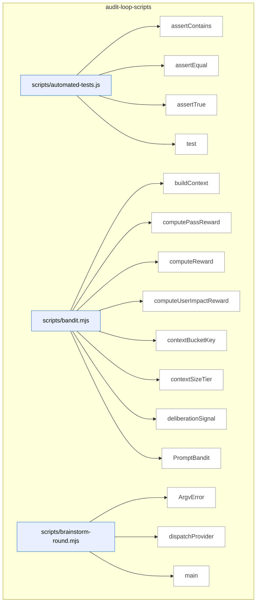
```mermaid
flowchart TB
subgraph dom_audit_loop_scripts ["audit-loop-scripts"]
  file_scripts_automated_tests_js["scripts/automated-tests.js"]:::component
  sym_scripts_automated_tests_js_assertContain["assertContains"]:::symbol
  file_scripts_automated_tests_js --> sym_scripts_automated_tests_js_assertContain
  sym_scripts_automated_tests_js_assertEqual["assertEqual"]:::symbol
  file_scripts_automated_tests_js --> sym_scripts_automated_tests_js_assertEqual
  sym_scripts_automated_tests_js_assertTrue["assertTrue"]:::symbol
  file_scripts_automated_tests_js --> sym_scripts_automated_tests_js_assertTrue
  sym_scripts_automated_tests_js_test["test"]:::symbol
  file_scripts_automated_tests_js --> sym_scripts_automated_tests_js_test
  file_scripts_bandit_mjs["scripts/bandit.mjs"]:::component
  sym_scripts_bandit_mjs_buildContext["buildContext"]:::symbol
  file_scripts_bandit_mjs --> sym_scripts_bandit_mjs_buildContext
  sym_scripts_bandit_mjs_computePassReward["computePassReward"]:::symbol
  file_scripts_bandit_mjs --> sym_scripts_bandit_mjs_computePassReward
  sym_scripts_bandit_mjs_computeReward["computeReward"]:::symbol
  file_scripts_bandit_mjs --> sym_scripts_bandit_mjs_computeReward
  sym_scripts_bandit_mjs_computeUserImpactRewa["computeUserImpactReward"]:::symbol
  file_scripts_bandit_mjs --> sym_scripts_bandit_mjs_computeUserImpactRewa
  sym_scripts_bandit_mjs_contextBucketKey["contextBucketKey"]:::symbol
  file_scripts_bandit_mjs --> sym_scripts_bandit_mjs_contextBucketKey
  sym_scripts_bandit_mjs_contextSizeTier["contextSizeTier"]:::symbol
  file_scripts_bandit_mjs --> sym_scripts_bandit_mjs_contextSizeTier
  sym_scripts_bandit_mjs_deliberationSignal["deliberationSignal"]:::symbol
  file_scripts_bandit_mjs --> sym_scripts_bandit_mjs_deliberationSignal
  sym_scripts_bandit_mjs_PromptBandit["PromptBandit"]:::symbol
  file_scripts_bandit_mjs --> sym_scripts_bandit_mjs_PromptBandit
  file_scripts_brainstorm_round_mjs["scripts/brainstorm-round.mjs"]:::component
  sym_scripts_brainstorm_round_mjs_ArgvError["ArgvError"]:::symbol
  file_scripts_brainstorm_round_mjs --> sym_scripts_brainstorm_round_mjs_ArgvError
  sym_scripts_brainstorm_round_mjs_dispatchPro["dispatchProvider"]:::symbol
  file_scripts_brainstorm_round_mjs --> sym_scripts_brainstorm_round_mjs_dispatchPro
  sym_scripts_brainstorm_round_mjs_main["main"]:::symbol
  file_scripts_brainstorm_round_mjs --> sym_scripts_brainstorm_round_mjs_main
end
classDef container fill:#f5f5f5,stroke:#333,stroke-width:2px,color:#000
classDef component fill:#e8f0ff,stroke:#3178c6,color:#000
classDef symbol fill:#fff,stroke:#999,color:#444
classDef dup fill:#ffe8d8,stroke:#c0392b,stroke-width:2px,color:#000
classDef violation fill:#ffd6d6,stroke:#c0392b,stroke-width:2px,color:#000
```

_Domain has 238 symbols (>50). Diagram shows top-15 by file order; see flat table below for the full list._

### Symbols in this domain

| Symbol | Kind | Path | Lines | Purpose |
|---|---|---|---|---|
| [`assertContains`](../scripts/automated-tests.js#L48) | function | `scripts/automated-tests.js` | 48-52 | Throws an error if a string does not contain an expected substring. |
| [`assertEqual`](../scripts/automated-tests.js#L36) | function | `scripts/automated-tests.js` | 36-40 | Throws an error if actual value does not match expected value. |
| [`assertTrue`](../scripts/automated-tests.js#L42) | function | `scripts/automated-tests.js` | 42-46 | Throws an error if the provided value is not truthy. |
| [`test`](../scripts/automated-tests.js#L23) | function | `scripts/automated-tests.js` | 23-34 | Runs a test function and tracks pass/fail outcomes with console feedback. |
| [`buildContext`](../scripts/bandit.mjs#L28) | function | `scripts/bandit.mjs` | 28-34 | Builds a context object from a repo profile with size tier and dominant language. |
| [`computePassReward`](../scripts/bandit.mjs#L409) | function | `scripts/bandit.mjs` | 409-415 | Averages per-finding rewards across all findings in a pass evaluation record. |
| [`computeReward`](../scripts/bandit.mjs#L309) | function | `scripts/bandit.mjs` | 309-347 | Computes a multi-signal reward score combining procedural, substantive, deliberation, and user-impact factors. |
| [`computeUserImpactReward`](../scripts/bandit.mjs#L358) | function | `scripts/bandit.mjs` | 358-378 | Calculates user-impact reward based on correlation type and persona severity. |
| [`contextBucketKey`](../scripts/bandit.mjs#L43) | function | `scripts/bandit.mjs` | 43-45 | Creates a cache key from context size tier and dominant language. |
| [`contextSizeTier`](../scripts/bandit.mjs#L36) | function | `scripts/bandit.mjs` | 36-41 | Classifies character count into small, medium, large, or xlarge tiers. |
| [`deliberationSignal`](../scripts/bandit.mjs#L385) | function | `scripts/bandit.mjs` | 385-402 | Generates a deliberation quality signal from ruling positions and rationale length. |
| [`PromptBandit`](../scripts/bandit.mjs#L49) | class | `scripts/bandit.mjs` | 49-292 | <no body> |
| [`ArgvError`](../scripts/brainstorm-round.mjs#L106) | class | `scripts/brainstorm-round.mjs` | 106-108 | Custom error class for command-line argument parsing failures. |
| [`dispatchProvider`](../scripts/brainstorm-round.mjs#L209) | function | `scripts/brainstorm-round.mjs` | 209-251 | Routes brainstorm request to OpenAI or Gemini with error handling and debug payload logging. |
| [`main`](../scripts/brainstorm-round.mjs#L116) | function | `scripts/brainstorm-round.mjs` | 116-207 | Orchestrates main brainstorm flow including topic input, secret redaction, model resolution, and provider dispatch. |
| [`parseArgs`](../scripts/brainstorm-round.mjs#L51) | function | `scripts/brainstorm-round.mjs` | 51-104 | Parses command-line arguments for brainstorm topic, model selection, and output configuration. |
| [`readStdin`](../scripts/brainstorm-round.mjs#L110) | function | `scripts/brainstorm-round.mjs` | 110-114 | Reads stdin asynchronously and returns concatenated buffer as string. |
| [`checkAuditApiKeys`](../scripts/check-setup.mjs#L157) | function | `scripts/check-setup.mjs` | 157-174 | Validates that required API keys for OpenAI and Gemini are configured. |
| [`checkAuditLoop`](../scripts/check-setup.mjs#L233) | function | `scripts/check-setup.mjs` | 233-237 | Orchestrates checks for audit-loop dependencies and APIs. |
| [`checkAuditSupabase`](../scripts/check-setup.mjs#L180) | function | `scripts/check-setup.mjs` | 180-231 | Validates Supabase audit configuration including connection and required tables. |
| [`checkPersonaTest`](../scripts/check-setup.mjs#L241) | function | `scripts/check-setup.mjs` | 241-297 | Validates Supabase persona-test configuration including session memory tables. |
| [`checkTables`](../scripts/check-setup.mjs#L71) | function | `scripts/check-setup.mjs` | 71-78 | Queries multiple table names in parallel to check their existence. |
| [`getSupabaseClient`](../scripts/check-setup.mjs#L61) | function | `scripts/check-setup.mjs` | 61-64 | Creates and returns a Supabase client instance. |
| [`loadEnv`](../scripts/check-setup.mjs#L42) | function | `scripts/check-setup.mjs` | 42-57 | Loads environment variables from a .env file into an object. |
| [`main`](../scripts/check-setup.mjs#L374) | function | `scripts/check-setup.mjs` | 374-385 | Loads environment, runs all checks, and prints or outputs report with exit code. |
| [`printJsonReport`](../scripts/check-setup.mjs#L360) | function | `scripts/check-setup.mjs` | 360-370 | Outputs the setup check report as formatted JSON. |
| [`printReport`](../scripts/check-setup.mjs#L328) | function | `scripts/check-setup.mjs` | 328-358 | Prints a formatted setup check report to console with sections and color coding. |
| [`Report`](../scripts/check-setup.mjs#L118) | class | `scripts/check-setup.mjs` | 118-153 | <no body> |
| [`shortUrl`](../scripts/check-setup.mjs#L176) | function | `scripts/check-setup.mjs` | 176-178 | Truncates a URL by removing protocol and limiting to 30 characters. |
| [`statusIcon`](../scripts/check-setup.mjs#L304) | function | `scripts/check-setup.mjs` | 304-313 | Maps status codes to colorized console output strings. |
| [`verdictLine`](../scripts/check-setup.mjs#L315) | function | `scripts/check-setup.mjs` | 315-326 | Generates a colored verdict line summarizing setup check failures and warnings. |
| [`checkSync`](../scripts/check-sync.mjs#L25) | function | `scripts/check-sync.mjs` | 25-157 | <no body> |
| [`fail`](../scripts/check-sync.mjs#L20) | function | `scripts/check-sync.mjs` | 20-20 | Logs a FAIL status line. |
| [`finish`](../scripts/check-sync.mjs#L159) | function | `scripts/check-sync.mjs` | 159-182 | Outputs final sync check verdict with fixes or JSON and exits with appropriate code. |
| [`info`](../scripts/check-sync.mjs#L21) | function | `scripts/check-sync.mjs` | 21-21 | Logs an INFO status line. |
| [`log`](../scripts/check-sync.mjs#L17) | function | `scripts/check-sync.mjs` | 17-17 | Conditionally logs a message to stdout unless in JSON mode. |
| [`pass`](../scripts/check-sync.mjs#L19) | function | `scripts/check-sync.mjs` | 19-19 | Logs a PASS status line. |
| [`argOption`](../scripts/cross-skill.mjs#L96) | function | `scripts/cross-skill.mjs` | 96-100 | Retrieves a command-line option value by name. |
| [`cmdAbortRefreshRun`](../scripts/cross-skill.mjs#L590) | function | `scripts/cross-skill.mjs` | 590-600 | Aborts an active refresh run with an optional reason. |
| [`cmdAddPersona`](../scripts/cross-skill.mjs#L348) | function | `scripts/cross-skill.mjs` | 348-360 | Creates or updates a persona with name, description, and app URL. |
| [`cmdAuditEffectiveness`](../scripts/cross-skill.mjs#L311) | function | `scripts/cross-skill.mjs` | 311-318 | Retrieves audit effectiveness metrics for a specified repository. |
| [`cmdComputeDriftScore`](../scripts/cross-skill.mjs#L694) | function | `scripts/cross-skill.mjs` | 694-705 | Computes architectural drift score comparing current and previous snapshots. |
| [`cmdComputeTargetDomains`](../scripts/cross-skill.mjs#L449) | function | `scripts/cross-skill.mjs` | 449-461 | Computes target architectural domains for specified file paths using domain tagging rules. |
| [`cmdDetectStack`](../scripts/cross-skill.mjs#L399) | function | `scripts/cross-skill.mjs` | 399-415 | Detects the tech stack and Python environment manager for a repository directory. |
| [`cmdGetActiveRefreshId`](../scripts/cross-skill.mjs#L431) | function | `scripts/cross-skill.mjs` | 431-447 | Fetches the active refresh ID and embedding model metadata for a repository UUID. |
| [`cmdGetCallersForFile`](../scripts/cross-skill.mjs#L463) | function | `scripts/cross-skill.mjs` | 463-526 | Retrieves callers and their domains for a file from the active snapshot's import graph. |
| [`cmdGetNeighbourhood`](../scripts/cross-skill.mjs#L528) | function | `scripts/cross-skill.mjs` | 528-556 | Fetches symbol neighbourhood candidates matching an intent query via RPC. |
| [`cmdListLayeringViolationsForSnapshot`](../scripts/cross-skill.mjs#L681) | function | `scripts/cross-skill.mjs` | 681-692 | Lists architectural layering violations from a snapshot by refresh ID. |
| [`cmdListPersonas`](../scripts/cross-skill.mjs#L326) | function | `scripts/cross-skill.mjs` | 326-337 | Lists personas configured for a given app URL from the persona cloud. |
| [`cmdListSymbolsForSnapshot`](../scripts/cross-skill.mjs#L668) | function | `scripts/cross-skill.mjs` | 668-679 | Lists all symbols indexed in a snapshot by refresh ID. |
| [`cmdListUnlockedFixes`](../scripts/cross-skill.mjs#L303) | function | `scripts/cross-skill.mjs` | 303-309 | Lists unlocked fixes available for a repository from the learning store. |
| [`cmdOpenRefreshRun`](../scripts/cross-skill.mjs#L558) | function | `scripts/cross-skill.mjs` | 558-576 | Opens a new refresh run for a repository, creating the repo record if needed. |
| [`cmdPlanSatisfaction`](../scripts/cross-skill.mjs#L268) | function | `scripts/cross-skill.mjs` | 268-278 | Retrieves plan satisfaction metrics and persistent failure records for a given plan ID. |
| [`cmdPublishRefreshRun`](../scripts/cross-skill.mjs#L578) | function | `scripts/cross-skill.mjs` | 578-588 | Publishes a completed refresh run to activate its snapshot. |
| [`cmdRecordCorrelation`](../scripts/cross-skill.mjs#L216) | function | `scripts/cross-skill.mjs` | 216-233 | Records a persona audit finding correlation with severity and match details. |
| [`cmdRecordLayeringViolations`](../scripts/cross-skill.mjs#L642) | function | `scripts/cross-skill.mjs` | 642-654 | Records architectural layering violations discovered during a refresh. |
| [`cmdRecordPersonaSession`](../scripts/cross-skill.mjs#L384) | function | `scripts/cross-skill.mjs` | 384-397 | Records a persona session with commit SHA, duration, and test results. |
| [`cmdRecordPlanVerifyItems`](../scripts/cross-skill.mjs#L257) | function | `scripts/cross-skill.mjs` | 257-266 | Records verified plan items to the learning store when cloud is enabled. |
| [`cmdRecordPlanVerifyRun`](../scripts/cross-skill.mjs#L235) | function | `scripts/cross-skill.mjs` | 235-255 | Records a plan verification run with criteria counts and execution metadata. |
| [`cmdRecordRegressionSpec`](../scripts/cross-skill.mjs#L177) | function | `scripts/cross-skill.mjs` | 177-196 | Records a new regression spec with assertion count and source finding reference. |
| [`cmdRecordRegressionSpecRun`](../scripts/cross-skill.mjs#L198) | function | `scripts/cross-skill.mjs` | 198-214 | Records a regression spec execution result with pass/fail and context. |
| [`cmdRecordShipEvent`](../scripts/cross-skill.mjs#L280) | function | `scripts/cross-skill.mjs` | 280-301 | Records a ship event with outcome, block reasons, and metadata to track deployment decisions. |
| [`cmdRecordSymbolDefinitions`](../scripts/cross-skill.mjs#L602) | function | `scripts/cross-skill.mjs` | 602-612 | Records symbol definitions and returns a mapping of definition IDs. |
| [`cmdRecordSymbolEmbedding`](../scripts/cross-skill.mjs#L628) | function | `scripts/cross-skill.mjs` | 628-640 | Records a vector embedding for a symbol definition with model and dimension metadata. |
| [`cmdRecordSymbolIndex`](../scripts/cross-skill.mjs#L614) | function | `scripts/cross-skill.mjs` | 614-626 | Inserts symbol index rows into the snapshot. |
| [`cmdResolveRepoIdentity`](../scripts/cross-skill.mjs#L707) | function | `scripts/cross-skill.mjs` | 707-713 | Resolves a repository's UUID and optionally persists it to local config. |
| [`cmdSetActiveEmbeddingModel`](../scripts/cross-skill.mjs#L656) | function | `scripts/cross-skill.mjs` | 656-666 | Sets the active embedding model and dimension for a repository's snapshots. |
| [`cmdUpdatePlanStatus`](../scripts/cross-skill.mjs#L168) | function | `scripts/cross-skill.mjs` | 168-175 | Updates an existing plan's status in the learning store. |
| [`cmdUpsertPlan`](../scripts/cross-skill.mjs#L150) | function | `scripts/cross-skill.mjs` | 150-166 | Upserts a remediation plan record with path, skill, and metadata. |
| [`cmdWhoami`](../scripts/cross-skill.mjs#L417) | function | `scripts/cross-skill.mjs` | 417-427 | Returns current authentication state including cloud status, commit, branch, and Supabase configuration. |
| [`currentBranch`](../scripts/cross-skill.mjs#L125) | function | `scripts/cross-skill.mjs` | 125-130 | Returns the current git branch name. |
| [`currentCommitSha`](../scripts/cross-skill.mjs#L118) | function | `scripts/cross-skill.mjs` | 118-123 | Returns the current git commit SHA. |
| [`emit`](../scripts/cross-skill.mjs#L102) | function | `scripts/cross-skill.mjs` | 102-104 | Writes a JSON object to stdout. |
| [`emitError`](../scripts/cross-skill.mjs#L111) | function | `scripts/cross-skill.mjs` | 111-114 | Emits an error JSON response and exits with specified code. |
| [`main`](../scripts/cross-skill.mjs#L753) | function | `scripts/cross-skill.mjs` | 753-776 | Main entry point that routes subcommands and handles errors with JSON output. |
| [`parsePayload`](../scripts/cross-skill.mjs#L79) | function | `scripts/cross-skill.mjs` | 79-94 | Extracts JSON payload from command arguments via --json, --stdin, or bare JSON. |
| [`resolveRepoId`](../scripts/cross-skill.mjs#L140) | function | `scripts/cross-skill.mjs` | 140-146 | Returns repo ID from payload or null if not provided. |
| [`checkBaselineValidity`](../scripts/evolve-prompts.mjs#L340) | function | `scripts/evolve-prompts.mjs` | 340-348 | Marks an experiment stale if its parent revision no longer matches the current default. |
| [`evolveWorstPass`](../scripts/evolve-prompts.mjs#L92) | function | `scripts/evolve-prompts.mjs` | 92-234 | <no body> |
| [`formatExample`](../scripts/evolve-prompts.mjs#L336) | function | `scripts/evolve-prompts.mjs` | 336-338 | Formats an outcome example as a brief severity-category-file-detail string. |
| [`getExperimentManifestStore`](../scripts/evolve-prompts.mjs#L64) | function | `scripts/evolve-prompts.mjs` | 64-66 | Creates a mutex-locked file store for experiment manifest persistence. |
| [`killExperiment`](../scripts/evolve-prompts.mjs#L306) | function | `scripts/evolve-prompts.mjs` | 306-317 | Marks an experiment as killed and abandons its revision. |
| [`main`](../scripts/evolve-prompts.mjs#L373) | function | `scripts/evolve-prompts.mjs` | 373-469 | <no body> |
| [`promoteExperiment`](../scripts/evolve-prompts.mjs#L289) | function | `scripts/evolve-prompts.mjs` | 289-301 | Promotes an experiment's revision to active status for its pass. |
| [`reconcileOrphanedExperiments`](../scripts/evolve-prompts.mjs#L353) | function | `scripts/evolve-prompts.mjs` | 353-369 | Scans and cleans up orphaned experiment manifests that failed mid-execution. |
| [`reviewExperiments`](../scripts/evolve-prompts.mjs#L239) | function | `scripts/evolve-prompts.mjs` | 239-284 | <no body> |
| [`showStats`](../scripts/evolve-prompts.mjs#L322) | function | `scripts/evolve-prompts.mjs` | 322-332 | Returns pass statistics, active experiments, and bandit arm performance. |
| [`_collectMaxLengths`](../scripts/gemini-review.mjs#L100) | function | `scripts/gemini-review.mjs` | 100-118 | Recursively collects maxLength constraints from a JSON schema into a path-to-length map. |
| [`addSemanticIds`](../scripts/gemini-review.mjs#L805) | function | `scripts/gemini-review.mjs` | 805-813 | Assigns unique identifiers and semantic hashes to each new finding based on its provider and position. |
| [`applyDebtSuppression`](../scripts/gemini-review.mjs#L768) | function | `scripts/gemini-review.mjs` | 768-803 | Filters new findings against a suppression context using Jaccard similarity scoring to avoid re-raising previously deferred issues. |
| [`buildClient`](../scripts/gemini-review.mjs#L734) | function | `scripts/gemini-review.mjs` | 734-741 | Instantiates either a Google Gemini or Anthropic Claude API client based on provider selection, falling back to Claude if the Gemini API key is missing. |
| [`callClaudeOpus`](../scripts/gemini-review.mjs#L386) | function | `scripts/gemini-review.mjs` | 386-449 | <no body> |
| [`callGemini`](../scripts/gemini-review.mjs#L278) | function | `scripts/gemini-review.mjs` | 278-372 | <no body> |
| [`emitReviewOutput`](../scripts/gemini-review.mjs#L815) | function | `scripts/gemini-review.mjs` | 815-830 | Outputs the review result as JSON, plain text, or to a file depending on mode, including model metadata and token usage. |
| [`formatReviewResult`](../scripts/gemini-review.mjs#L574) | function | `scripts/gemini-review.mjs` | 574-637 | <no body> |
| [`getReviewPrompt`](../scripts/gemini-review.mjs#L259) | function | `scripts/gemini-review.mjs` | 259-261 | Returns the active gemini-review prompt or a system default. |
| [`isJsonTruncationError`](../scripts/gemini-review.mjs#L743) | function | `scripts/gemini-review.mjs` | 743-747 | Detects if an error message indicates JSON truncation by checking for common parse-related keywords. |
| [`main`](../scripts/gemini-review.mjs#L901) | function | `scripts/gemini-review.mjs` | 901-937 | Main entry point that orchestrates the entire review flow: argument parsing, file loading, API client setup, review execution, suppression application, output emission, and outcome recording. |
| [`parseReviewArgs`](../scripts/gemini-review.mjs#L693) | function | `scripts/gemini-review.mjs` | 693-704 | Parses command-line arguments for the review subcommand including file paths and options. |
| [`recordGeminiOutcomes`](../scripts/gemini-review.mjs#L877) | function | `scripts/gemini-review.mjs` | 877-899 | Records the review outcome (verdict, findings) to learning storage, updates a prompt bandit algorithm with rewards, and flushes tracking data. |
| [`recordNewFindings`](../scripts/gemini-review.mjs#L832) | function | `scripts/gemini-review.mjs` | 832-851 | Records newly discovered findings to an audit outcomes log and tracks them in a false-positive database. |
| [`recordWronglyDismissed`](../scripts/gemini-review.mjs#L853) | function | `scripts/gemini-review.mjs` | 853-875 | Logs findings that were incorrectly dismissed in previous rounds to the audit outcomes file. |
| [`refreshCatalogAndWarn`](../scripts/gemini-review.mjs#L643) | function | `scripts/gemini-review.mjs` | 643-654 | Refreshes the model catalog and warns if the live model differs from the session model. |
| [`runFinalReview`](../scripts/gemini-review.mjs#L462) | function | `scripts/gemini-review.mjs` | 462-570 | <no body> |
| [`runPing`](../scripts/gemini-review.mjs#L686) | function | `scripts/gemini-review.mjs` | 686-691 | Pings whichever LLM provider is configured via environment keys. |
| [`runPingClaude`](../scripts/gemini-review.mjs#L668) | function | `scripts/gemini-review.mjs` | 668-684 | Pings Claude Opus API to verify connectivity and readiness. |
| [`runPingGemini`](../scripts/gemini-review.mjs#L656) | function | `scripts/gemini-review.mjs` | 656-666 | Pings Gemini API to verify connectivity and readiness. |
| [`runReviewWithRetry`](../scripts/gemini-review.mjs#L749) | function | `scripts/gemini-review.mjs` | 749-766 | Attempts to run a final review up to twice, retrying with a conciseness instruction if JSON truncation occurs. |
| [`selectProvider`](../scripts/gemini-review.mjs#L706) | function | `scripts/gemini-review.mjs` | 706-732 | Selects the appropriate LLM provider (Gemini or Claude) based on override or available credentials. |
| [`truncateToSchema`](../scripts/gemini-review.mjs#L132) | function | `scripts/gemini-review.mjs` | 132-152 | Truncates object strings and nested structures to respect schema maxLength limits. |
| [`askYesNo`](../scripts/install-ffmpeg.js#L48) | function | `scripts/install-ffmpeg.js` | 48-60 | Prompts the user for a yes/no response via stdin and resolves a Promise with the boolean answer. |
| [`checkFFmpegAtPath`](../scripts/install-ffmpeg.js#L108) | function | `scripts/install-ffmpeg.js` | 108-121 | Verifies that FFmpeg exists at a specific file path and extracts its version if present. |
| [`checkFFprobe`](../scripts/install-ffmpeg.js#L93) | function | `scripts/install-ffmpeg.js` | 93-103 | Checks whether FFprobe is installed and accessible by attempting to run its version command. |
| [`detectPlatform`](../scripts/install-ffmpeg.js#L126) | function | `scripts/install-ffmpeg.js` | 126-138 | Detects the operating system platform and CPU architecture to determine installation strategy. |
| [`downloadFile`](../scripts/install-ffmpeg.js#L321) | function | `scripts/install-ffmpeg.js` | 321-367 | Downloads a file from a URL with redirect following, progress reporting, and error handling. |
| [`extractZip`](../scripts/install-ffmpeg.js#L372) | function | `scripts/install-ffmpeg.js` | 372-383 | Extracts a ZIP archive using PowerShell on Windows or the unzip command on Unix-like systems. |
| [`findAllFFmpegInstallations`](../scripts/install-ffmpeg.js#L143) | function | `scripts/install-ffmpeg.js` | 143-197 | Searches common installation directories across platform-specific locations and returns all discovered FFmpeg instances with version and FFprobe status. |
| [`getFFmpegInfo`](../scripts/install-ffmpeg.js#L65) | function | `scripts/install-ffmpeg.js` | 65-88 | Extracts FFmpeg version and file path by executing the version command and parsing output. |
| [`hasPackageManager`](../scripts/install-ffmpeg.js#L309) | function | `scripts/install-ffmpeg.js` | 309-316 | Checks whether a system package manager (apt, brew, dnf, etc.) is available. |
| [`installLinux`](../scripts/install-ffmpeg.js#L541) | function | `scripts/install-ffmpeg.js` | 541-631 | <no body> |
| [`installMac`](../scripts/install-ffmpeg.js#L500) | function | `scripts/install-ffmpeg.js` | 500-536 | Installs FFmpeg on macOS via Homebrew, MacPorts, or provides manual installation instructions if no package manager is found. |
| [`installWindows`](../scripts/install-ffmpeg.js#L388) | function | `scripts/install-ffmpeg.js` | 388-495 | <no body> |
| [`isInstallationProblematic`](../scripts/install-ffmpeg.js#L202) | function | `scripts/install-ffmpeg.js` | 202-232 | Evaluates an FFmpeg installation for problems such as missing FFprobe, outdated versions, or stale nightly builds. |
| [`log`](../scripts/install-ffmpeg.js#L36) | function | `scripts/install-ffmpeg.js` | 36-38 | Logs a colored message to the console with optional ANSI color codes. |
| [`logError`](../scripts/install-ffmpeg.js#L42) | function | `scripts/install-ffmpeg.js` | 42-42 | Logs an error message prefixed with a red X symbol. |
| [`logInfo`](../scripts/install-ffmpeg.js#L43) | function | `scripts/install-ffmpeg.js` | 43-43 | Logs an informational message prefixed with a cyan info symbol. |
| [`logSuccess`](../scripts/install-ffmpeg.js#L40) | function | `scripts/install-ffmpeg.js` | 40-40 | Logs a success message prefixed with a green checkmark. |
| [`logWarning`](../scripts/install-ffmpeg.js#L41) | function | `scripts/install-ffmpeg.js` | 41-41 | Logs a warning message prefixed with a yellow warning symbol. |
| [`main`](../scripts/install-ffmpeg.js#L636) | function | `scripts/install-ffmpeg.js` | 636-785 | <no body> |
| [`removeInstallation`](../scripts/install-ffmpeg.js#L237) | function | `scripts/install-ffmpeg.js` | 237-304 | Removes an FFmpeg installation by deleting its directory or delegating to the appropriate package manager. |
| [`_resetClassificationColumnCache`](../scripts/learning-store.mjs#L217) | function | `scripts/learning-store.mjs` | 217-217 | Resets the internal cache for classification column detection. |
| [`abortRefreshRun`](../scripts/learning-store.mjs#L1598) | function | `scripts/learning-store.mjs` | 1598-1605 | Marks a refresh run as aborted with an optional error reason. |
| [`appendDebtEventsCloud`](../scripts/learning-store.mjs#L495) | function | `scripts/learning-store.mjs` | 495-523 | Appends debt lifecycle events (created, resolved, etc.) to cloud storage with upsert to ensure idempotency. |
| [`callNeighbourhoodRpc`](../scripts/learning-store.mjs#L1821) | function | `scripts/learning-store.mjs` | 1821-1837 | Calls the `symbol_neighbourhood` RPC to find semantically similar symbols using embedding search. |
| [`chunk`](../scripts/learning-store.mjs#L1658) | function | `scripts/learning-store.mjs` | 1658-1662 | Splits an array into chunks of size n. |
| [`computeDriftScore`](../scripts/learning-store.mjs#L1843) | function | `scripts/learning-store.mjs` | 1843-1857 | Calls the `drift_score` RPC to compute symbol drift between refreshes. |
| [`copyForwardImports`](../scripts/learning-store.mjs#L1899) | function | `scripts/learning-store.mjs` | 1899-1932 | Copies import edges from one refresh to another, filtering on importer path and touched file set. |
| [`copyForwardUntouchedFiles`](../scripts/learning-store.mjs#L2147) | function | `scripts/learning-store.mjs` | 2147-2193 | Copies symbol index records from a prior refresh to a new one, skipping files marked as touched and optionally re-tagging domains via a custom function. |
| [`detectClassificationColumns`](../scripts/learning-store.mjs#L198) | function | `scripts/learning-store.mjs` | 198-214 | Checks whether cloud storage has classification columns and caches the result to avoid repeated queries. |
| [`getActiveEmbeddingModel`](../scripts/learning-store.mjs#L1804) | function | `scripts/learning-store.mjs` | 1804-1813 | Retrieves the active embedding model name and dimension for a repository. |
| [`getActiveSnapshot`](../scripts/learning-store.mjs#L1622) | function | `scripts/learning-store.mjs` | 1622-1649 | Fetches the active refresh ID and embedding model for a repository, including import-graph population status. |
| [`getDomainSummaries`](../scripts/learning-store.mjs#L2030) | function | `scripts/learning-store.mjs` | 2030-2048 | Retrieves all domain summaries for a repo, returning a map of domain tag to summary details including composition hash and model info. |
| [`getFalsePositivePatterns`](../scripts/learning-store.mjs#L836) | function | `scripts/learning-store.mjs` | 836-850 | Retrieves false positive patterns marked for auto-suppression for a specific repository. |
| [`getImportersForFiles`](../scripts/learning-store.mjs#L1981) | function | `scripts/learning-store.mjs` | 1981-1998 | Queries the database for files that import each of the given paths, returning a map of imported path to list of importer paths. |
| [`getImportGraphPopulated`](../scripts/learning-store.mjs#L1961) | function | `scripts/learning-store.mjs` | 1961-1969 | Checks whether a refresh run's import graph has been marked as populated. |
| [`getPassEffectiveness`](../scripts/learning-store.mjs#L806) | function | `scripts/learning-store.mjs` | 806-831 | Queries audit run IDs for a repo, then retrieves pass effectiveness stats (findings raised/accepted/dismissed). |
| [`getPassTimings`](../scripts/learning-store.mjs#L306) | function | `scripts/learning-store.mjs` | 306-337 | Retrieves historical token and latency statistics aggregated by pass name from cloud storage. |
| [`getPersonaSupabase`](../scripts/learning-store.mjs#L1275) | function | `scripts/learning-store.mjs` | 1275-1294 | Lazily initializes and returns a Supabase client for persona test data, reading from environment variables. |
| [`getReadClient`](../scripts/learning-store.mjs#L1489) | function | `scripts/learning-store.mjs` | 1489-1489 | Returns the shared read-only Supabase client instance. |
| [`getRepoIdByUuid`](../scripts/learning-store.mjs#L1498) | function | `scripts/learning-store.mjs` | 1498-1513 | Queries a repository by UUID and returns its ID, name, and active embedding configuration. |
| [`getTopDuplicateClusters`](../scripts/learning-store.mjs#L2058) | function | `scripts/learning-store.mjs` | 2058-2078 | Calls a database RPC to fetch the top duplicate symbol clusters by file count, returning signature hash, kind, and file paths for each. |
| [`getUnlockedFixes`](../scripts/learning-store.mjs#L994) | function | `scripts/learning-store.mjs` | 994-1006 | Fetches up to 20 unlocked fix records, optionally filtered by repository. |
| [`getWriteClient`](../scripts/learning-store.mjs#L1468) | function | `scripts/learning-store.mjs` | 1468-1486 | Returns a Supabase service-role write client, throwing if required credentials are missing. |
| [`heartbeatRefreshRun`](../scripts/learning-store.mjs#L1608) | function | `scripts/learning-store.mjs` | 1608-1613 | Updates the last heartbeat timestamp for an in-flight refresh run. |
| [`initLearningStore`](../scripts/learning-store.mjs#L27) | function | `scripts/learning-store.mjs` | 27-55 | Initializes a Supabase cloud connection for learning storage, validating credentials and connectivity. |
| [`isCloudEnabled`](../scripts/learning-store.mjs#L58) | function | `scripts/learning-store.mjs` | 58-60 | Returns whether cloud storage (Supabase) is currently enabled and connected. |
| [`isPersonaCloudEnabled`](../scripts/learning-store.mjs#L1297) | function | `scripts/learning-store.mjs` | 1297-1300 | Checks whether persona cloud storage is enabled by attempting client initialization. |
| [`listLayeringViolationsForSnapshot`](../scripts/learning-store.mjs#L2118) | function | `scripts/learning-store.mjs` | 2118-2133 | Fetches layering violation records for a refresh ID, returning rule name, path pairs, severity, and comments. |
| [`listPersonasForApp`](../scripts/learning-store.mjs#L1310) | function | `scripts/learning-store.mjs` | 1310-1324 | Lists all personas associated with a given application URL. |
| [`listSymbolsForSnapshot`](../scripts/learning-store.mjs#L2084) | function | `scripts/learning-store.mjs` | 2084-2116 | Lists symbols from a snapshot filtered by refresh ID, kind, domain tag, and file path prefix, returning paginated results with symbol definitions joined in. |
| [`loadBanditArms`](../scripts/learning-store.mjs#L625) | function | `scripts/learning-store.mjs` | 625-653 | Fetches multi-armed bandit arm configurations from the database, organized by pass name, variant ID, and context bucket. |
| [`loadFalsePositivePatterns`](../scripts/learning-store.mjs#L779) | function | `scripts/learning-store.mjs` | 779-799 | Loads repository and global false positive patterns flagged for auto-suppression. |
| [`markImportGraphPopulated`](../scripts/learning-store.mjs#L1943) | function | `scripts/learning-store.mjs` | 1943-1951 | Marks a refresh run's import graph as fully populated. |
| [`openRefreshRun`](../scripts/learning-store.mjs#L1552) | function | `scripts/learning-store.mjs` | 1552-1575 | Opens a new refresh run for a repository, assigning a unique cancellation token. |
| [`publishRefreshRun`](../scripts/learning-store.mjs#L1585) | function | `scripts/learning-store.mjs` | 1585-1595 | Publishes a refresh run via RPC, marking it active and updating the embedding model. |
| [`readAuditEffectiveness`](../scripts/learning-store.mjs#L1087) | function | `scripts/learning-store.mjs` | 1087-1099 | Fetches audit effectiveness metrics for a repository. |
| [`readCorrelationsForFinding`](../scripts/learning-store.mjs#L1070) | function | `scripts/learning-store.mjs` | 1070-1081 | Retrieves all persona-audit correlations linked to a specific audit finding. |
| [`readCorrelationsForRun`](../scripts/learning-store.mjs#L1051) | function | `scripts/learning-store.mjs` | 1051-1062 | Retrieves all persona-audit correlations linked to a specific audit run. |
| [`readDebtEntriesCloud`](../scripts/learning-store.mjs#L429) | function | `scripts/learning-store.mjs` | 429-466 | Retrieves all debt entries for a repository from cloud storage and maps them to internal format. |
| [`readDebtEventsCloud`](../scripts/learning-store.mjs#L530) | function | `scripts/learning-store.mjs` | 530-551 | Retrieves all debt events for a repository from cloud storage in chronological order. |
| [`readPersistentPlanFailures`](../scripts/learning-store.mjs#L1210) | function | `scripts/learning-store.mjs` | 1210-1221 | Fetches persistent failure records for a plan. |
| [`readPlanSatisfaction`](../scripts/learning-store.mjs#L1192) | function | `scripts/learning-store.mjs` | 1192-1204 | Retrieves satisfaction metrics for a plan. |
| [`recordAdjudicationEvent`](../scripts/learning-store.mjs#L560) | function | `scripts/learning-store.mjs` | 560-590 | Records the outcome of an adjudication decision (acceptance, dismissal, ruling) for a finding to cloud storage. |
| [`recordFindings`](../scripts/learning-store.mjs#L222) | function | `scripts/learning-store.mjs` | 222-249 | Inserts finding records into cloud storage, optionally including Sonar classification data if available. |
| [`recordLayeringViolations`](../scripts/learning-store.mjs#L1764) | function | `scripts/learning-store.mjs` | 1764-1787 | Batch-upserts layering violation records (architecture rule breaches) with severity. |
| [`recordPassStats`](../scripts/learning-store.mjs#L254) | function | `scripts/learning-store.mjs` | 254-274 | Records per-pass statistics like finding counts, token usage, latency, and reasoning effort to cloud storage. |
| [`recordPersonaAuditCorrelation`](../scripts/learning-store.mjs#L1025) | function | `scripts/learning-store.mjs` | 1025-1043 | Records a mapping between a persona finding and an audit finding with correlation type and match score. |
| [`recordPersonaSession`](../scripts/learning-store.mjs#L1387) | function | `scripts/learning-store.mjs` | 1387-1452 | Records a persona test session with findings, verdict, and confidence metrics; updates persona stats as a side effect. |
| [`recordPlanVerificationItems`](../scripts/learning-store.mjs#L1166) | function | `scripts/learning-store.mjs` | 1166-1186 | Inserts individual verification items (criteria) for a plan verification run. |
| [`recordPlanVerificationRun`](../scripts/learning-store.mjs#L1122) | function | `scripts/learning-store.mjs` | 1122-1147 | Creates a plan verification run record with criterion counts and test results summary. |
| [`recordRegressionSpec`](../scripts/learning-store.mjs#L931) | function | `scripts/learning-store.mjs` | 931-957 | Records a regression spec with assertions, DOM contract types, and source finding linkage. |
| [`recordRegressionSpecRun`](../scripts/learning-store.mjs#L971) | function | `scripts/learning-store.mjs` | 971-987 | Logs a single test run of a regression spec (pass/fail, duration, error). |
| [`recordRunComplete`](../scripts/learning-store.mjs#L153) | function | `scripts/learning-store.mjs` | 153-175 | Updates an existing audit run record with completion statistics like finding counts, token usage, and cost estimates. |
| [`recordRunStart`](../scripts/learning-store.mjs#L106) | function | `scripts/learning-store.mjs` | 106-133 | Creates a new audit run record in cloud storage with metadata about the scan mode, scope, and commit. |
| [`recordShipEvent`](../scripts/learning-store.mjs#L1241) | function | `scripts/learning-store.mjs` | 1241-1264 | Records a deployment/ship decision event with block reasons, P0/P1 counts, and override flags. |
| [`recordSuppressionEvents`](../scripts/learning-store.mjs#L342) | function | `scripts/learning-store.mjs` | 342-367 | Records suppression and reopening events to cloud storage when findings are filtered or restored. |
| [`recordSymbolDefinitions`](../scripts/learning-store.mjs#L1694) | function | `scripts/learning-store.mjs` | 1694-1719 | Batch-upserts symbol definitions by canonical path, symbol name, and kind, returning a map of IDs. |
| [`recordSymbolEmbedding`](../scripts/learning-store.mjs#L1748) | function | `scripts/learning-store.mjs` | 1748-1762 | Upserts a single symbol embedding vector for a definition at a given model/dimension. |
| [`recordSymbolFileImports`](../scripts/learning-store.mjs#L1868) | function | `scripts/learning-store.mjs` | 1868-1887 | Batch-upserts file import edges (importer → imported paths) for a refresh. |
| [`recordSymbolIndex`](../scripts/learning-store.mjs#L1721) | function | `scripts/learning-store.mjs` | 1721-1746 | Batch-inserts symbol index records linking definitions to file locations and metadata. |
| [`removeDebtEntryCloud`](../scripts/learning-store.mjs#L472) | function | `scripts/learning-store.mjs` | 472-484 | Deletes a specific debt entry from cloud storage by topic ID. |
| [`setActiveEmbeddingModel`](../scripts/learning-store.mjs#L1793) | function | `scripts/learning-store.mjs` | 1793-1801 | Sets the active embedding model and dimension for a repository. |
| [`syncBanditArms`](../scripts/learning-store.mjs#L598) | function | `scripts/learning-store.mjs` | 598-619 | Syncs multi-armed bandit arm statistics to cloud storage for pass variant performance tracking. |
| [`syncExperiments`](../scripts/learning-store.mjs#L717) | function | `scripts/learning-store.mjs` | 717-743 | Syncs experiment metadata and results (parent/final EWR, confidence, sample sizes) to the database. |
| [`syncFalsePositivePatterns`](../scripts/learning-store.mjs#L686) | function | `scripts/learning-store.mjs` | 686-709 | Uploads false positive dismissal patterns to the database, auto-suppressing those with low EMA and high dismissal counts. |
| [`syncPromptRevision`](../scripts/learning-store.mjs#L753) | function | `scripts/learning-store.mjs` | 753-770 | Records a prompt revision with its text and SHA256 checksum for a given pass. |
| [`updatePassStatsPostDeliberation`](../scripts/learning-store.mjs#L283) | function | `scripts/learning-store.mjs` | 283-299 | Updates pass statistics in cloud storage after deliberation completes, reflecting accepted/dismissed/compromised counts. |
| [`updatePlanStatus`](../scripts/learning-store.mjs#L905) | function | `scripts/learning-store.mjs` | 905-912 | Updates the status field of an existing plan record. |
| [`updateRunMeta`](../scripts/learning-store.mjs#L182) | function | `scripts/learning-store.mjs` | 182-190 | Partially updates an audit run with optional metadata fields such as skip reason and Gemini verdict. |
| [`upsertDebtEntries`](../scripts/learning-store.mjs#L380) | function | `scripts/learning-store.mjs` | 380-421 | Inserts or updates debt entries in cloud storage with full metadata including severity, classification, deferral details, and ownership. |
| [`upsertDomainSummary`](../scripts/learning-store.mjs#L2005) | function | `scripts/learning-store.mjs` | 2005-2021 | Inserts or updates a domain summary record with architectural metadata like symbol count and generation timestamp. |
| [`upsertPersona`](../scripts/learning-store.mjs#L1339) | function | `scripts/learning-store.mjs` | 1339-1374 | Inserts or updates a persona record, returning its ID and whether it pre-existed. |
| [`upsertPlan`](../scripts/learning-store.mjs#L875) | function | `scripts/learning-store.mjs` | 875-900 | Inserts or updates a remediation plan with its skill, status, and focus areas. |
| [`upsertPromptVariant`](../scripts/learning-store.mjs#L660) | function | `scripts/learning-store.mjs` | 660-677 | Inserts or updates a prompt variant with its usage statistics and acceptance metrics. |
| [`upsertRepo`](../scripts/learning-store.mjs#L69) | function | `scripts/learning-store.mjs` | 69-90 | Inserts or updates a repository record in cloud storage with fingerprint, stack, and audit metadata. |
| [`upsertRepoByUuid`](../scripts/learning-store.mjs#L1521) | function | `scripts/learning-store.mjs` | 1521-1543 | Upserts a repository by UUID, creating it if absent and returning its ID. |
| [`withRetry`](../scripts/learning-store.mjs#L1675) | function | `scripts/learning-store.mjs` | 1675-1691 | Executes an async function with exponential backoff retry on network errors, logging retry attempts. |
| [`computeAssessmentMetrics`](../scripts/meta-assess.mjs#L48) | function | `scripts/meta-assess.mjs` | 48-150 | Calculates windowed metrics on audit outcomes including false-positive rate, signal quality, severity calibration, and convergence speed. |
| [`emptyMetrics`](../scripts/meta-assess.mjs#L152) | function | `scripts/meta-assess.mjs` | 152-162 | Returns empty metric structure with zero values and stable trends for initialization. |
| [`formatAssessmentReport`](../scripts/meta-assess.mjs#L353) | function | `scripts/meta-assess.mjs` | 353-398 | Formats assessment metrics and recommendations into a markdown health report. |
| [`main`](../scripts/meta-assess.mjs#L402) | function | `scripts/meta-assess.mjs` | 402-475 | Main entry point that orchestrates metrics collection, LLM assessment, report generation, and storage. |
| [`markAssessmentComplete`](../scripts/meta-assess.mjs#L190) | function | `scripts/meta-assess.mjs` | 190-198 | Records the current run count and timestamp as the last completed assessment in state file. |
| [`runLLMAssessment`](../scripts/meta-assess.mjs#L249) | function | `scripts/meta-assess.mjs` | 249-326 | Sends outcome metrics, samples, and patterns to LLM (Gemini or GPT) for health assessment and recommendations. |
| [`sampleOutcomes`](../scripts/meta-assess.mjs#L202) | function | `scripts/meta-assess.mjs` | 202-214 | Extracts and sorts recent dismissed and accepted outcomes into separate samples capped by category. |
| [`shouldRunAssessment`](../scripts/meta-assess.mjs#L174) | function | `scripts/meta-assess.mjs` | 174-184 | Checks if enough runs have passed since last assessment to decide whether to run assessment. |
| [`storeAssessment`](../scripts/meta-assess.mjs#L337) | function | `scripts/meta-assess.mjs` | 337-344 | Appends assessment result with timestamp to a jsonl log file. |
| [`_callGPTOnce`](../scripts/openai-audit.mjs#L358) | function | `scripts/openai-audit.mjs` | 358-449 | Makes a single LLM API call with retries, reasoning effort, timeout handling, and usage tracking. |
| [`applyExclusions`](../scripts/openai-audit.mjs#L138) | function | `scripts/openai-audit.mjs` | 138-147 | Filters file list by applying glob patterns to exclude matched files. |
| [`cachePassResult`](../scripts/openai-audit.mjs#L534) | function | `scripts/openai-audit.mjs` | 534-542 | Writes a single pass result to the local cache file. |
| [`cacheWaveResults`](../scripts/openai-audit.mjs#L544) | function | `scripts/openai-audit.mjs` | 544-549 | Writes multiple pass results to cache files and logs cache directory path. |
| [`callGPT`](../scripts/openai-audit.mjs#L455) | function | `scripts/openai-audit.mjs` | 455-494 | Wraps LLM calls with retry logic, exponential backoff, and accumulated usage tracking across attempts. |
| [`cleanupCache`](../scripts/openai-audit.mjs#L551) | function | `scripts/openai-audit.mjs` | 551-554 | Removes the temporary cache directory and its contents. |
| [`getPassPrompt`](../scripts/openai-audit.mjs#L337) | function | `scripts/openai-audit.mjs` | 337-341 | Returns the active custom prompt for a pass or falls back to default prompt registry. |
| [`initResultCache`](../scripts/openai-audit.mjs#L524) | function | `scripts/openai-audit.mjs` | 524-532 | Initializes a temporary cache directory for storing individual pass results during audit. |
| [`loadExcludePatterns`](../scripts/openai-audit.mjs#L119) | function | `scripts/openai-audit.mjs` | 119-130 | Loads exclusion patterns from CLI arguments and .auditignore file. |
| [`main`](../scripts/openai-audit.mjs#L1870) | function | `scripts/openai-audit.mjs` | 1870-2312 | Main CLI entry point that refreshes model catalog, parses arguments, and dispatches to audit or rebuttal mode. |
| [`normalizeFindingsForOutput`](../scripts/openai-audit.mjs#L558) | function | `scripts/openai-audit.mjs` | 558-560 | <no body> |
| [`printCostPreflight`](../scripts/openai-audit.mjs#L75) | function | `scripts/openai-audit.mjs` | 75-93 | Estimates and reports the cost of an API call before execution based on token pricing. |
| [`runMapReducePass`](../scripts/openai-audit.mjs#L606) | function | `scripts/openai-audit.mjs` | 606-764 | Executes map phase of map-reduce by splitting files into units and calling LLM with concurrency limits. |
| [`runMultiPassCodeAudit`](../scripts/openai-audit.mjs#L773) | function | `scripts/openai-audit.mjs` | 773-1864 | Orchestrates multi-pass code audit across structure, wiring, and sustainability passes with map-reduce and result merging. |
| [`safeCallGPT`](../scripts/openai-audit.mjs#L500) | function | `scripts/openai-audit.mjs` | 500-513 | Calls GPT with graceful degradation that returns empty results on failure instead of throwing. |
| [`shouldMapReduce`](../scripts/openai-audit.mjs#L164) | function | `scripts/openai-audit.mjs` | 164-168 | Decides whether to use map-reduce strategy based on file count or total character size. |
| [`shouldMapReduceHighReasoning`](../scripts/openai-audit.mjs#L175) | function | `scripts/openai-audit.mjs` | 175-179 | Decides whether to use map-reduce for high-reasoning models based on file count or character threshold. |
| [`validateLedgerForR2`](../scripts/openai-audit.mjs#L570) | function | `scripts/openai-audit.mjs` | 570-589 | Validates that a ledger file exists and contains valid prior entries for suppression in round 2+. |
| [`checkReadiness`](../scripts/phase7-check.mjs#L12) | function | `scripts/phase7-check.mjs` | 12-64 | <no body> |
| [`analyzePass`](../scripts/refine-prompts.mjs#L38) | function | `scripts/refine-prompts.mjs` | 38-68 | Analyzes pass effectiveness by loading outcomes, computing acceptance rate and EWR, and displaying top dismissed categories. |
| [`main`](../scripts/refine-prompts.mjs#L192) | function | `scripts/refine-prompts.mjs` | 192-231 | Orchestrates analysis or refinement of prompts by pass name, handling stats aggregation and optional LLM-based suggestions. |
| [`suggestRefinements`](../scripts/refine-prompts.mjs#L74) | function | `scripts/refine-prompts.mjs` | 74-190 | <no body> |

---

## canvas

> The `canvas` domain constructs and persists canvas files—programmatically building nodes and edges, serializing them to JSON, writing them to the vault with collision avoidance, and opening them in the editor.


```mermaid
flowchart TB
subgraph dom_canvas ["canvas"]
  file_src_services_canvas_canvasUtils_ts["src/services/canvas/canvasUtils.ts"]:::component
  sym_src_services_canvas_canvasUtils_ts_build["buildCanvasEdge"]:::symbol
  file_src_services_canvas_canvasUtils_ts --> sym_src_services_canvas_canvasUtils_ts_build
  sym_src_services_canvas_canvasUtils_ts_build["buildCanvasNode"]:::symbol
  file_src_services_canvas_canvasUtils_ts --> sym_src_services_canvas_canvasUtils_ts_build
  sym_src_services_canvas_canvasUtils_ts_ensur["ensureCanvasExtension"]:::symbol
  file_src_services_canvas_canvasUtils_ts --> sym_src_services_canvas_canvasUtils_ts_ensur
  sym_src_services_canvas_canvasUtils_ts_ensur["ensureFolderExists"]:::symbol
  file_src_services_canvas_canvasUtils_ts --> sym_src_services_canvas_canvasUtils_ts_ensur
  sym_src_services_canvas_canvasUtils_ts_gener["generateId"]:::symbol
  file_src_services_canvas_canvasUtils_ts --> sym_src_services_canvas_canvasUtils_ts_gener
  sym_src_services_canvas_canvasUtils_ts_getAv["getAvailableCanvasPath"]:::symbol
  file_src_services_canvas_canvasUtils_ts --> sym_src_services_canvas_canvasUtils_ts_getAv
  sym_src_services_canvas_canvasUtils_ts_norma["normalizeFolderPath"]:::symbol
  file_src_services_canvas_canvasUtils_ts --> sym_src_services_canvas_canvasUtils_ts_norma
  sym_src_services_canvas_canvasUtils_ts_openC["openCanvasFile"]:::symbol
  file_src_services_canvas_canvasUtils_ts --> sym_src_services_canvas_canvasUtils_ts_openC
  sym_src_services_canvas_canvasUtils_ts_sanit["sanitizeCanvasName"]:::symbol
  file_src_services_canvas_canvasUtils_ts --> sym_src_services_canvas_canvasUtils_ts_sanit
  sym_src_services_canvas_canvasUtils_ts_seria["serializeCanvas"]:::symbol
  file_src_services_canvas_canvasUtils_ts --> sym_src_services_canvas_canvasUtils_ts_seria
  sym_src_services_canvas_canvasUtils_ts_write["writeCanvasFile"]:::symbol
  file_src_services_canvas_canvasUtils_ts --> sym_src_services_canvas_canvasUtils_ts_write
  file_src_services_canvas_clusterBoard_ts["src/services/canvas/clusterBoard.ts"]:::component
  sym_src_services_canvas_clusterBoard_ts_buil["buildClusterBoard"]:::symbol
  file_src_services_canvas_clusterBoard_ts --> sym_src_services_canvas_clusterBoard_ts_buil
  sym_src_services_canvas_clusterBoard_ts_comp["computeMaxNotes"]:::symbol
  file_src_services_canvas_clusterBoard_ts --> sym_src_services_canvas_clusterBoard_ts_comp
  sym_src_services_canvas_clusterBoard_ts_dete["deterministicClustering"]:::symbol
  file_src_services_canvas_clusterBoard_ts --> sym_src_services_canvas_clusterBoard_ts_dete
  sym_src_services_canvas_clusterBoard_ts_extr["extractIndexes"]:::symbol
  file_src_services_canvas_clusterBoard_ts --> sym_src_services_canvas_clusterBoard_ts_extr
  sym_src_services_canvas_clusterBoard_ts_getC["getClusterColor"]:::symbol
  file_src_services_canvas_clusterBoard_ts --> sym_src_services_canvas_clusterBoard_ts_getC
  sym_src_services_canvas_clusterBoard_ts_grou["groupBySubtag"]:::symbol
  file_src_services_canvas_clusterBoard_ts --> sym_src_services_canvas_clusterBoard_ts_grou
  sym_src_services_canvas_clusterBoard_ts_pars["parseClusterResponse"]:::symbol
  file_src_services_canvas_clusterBoard_ts --> sym_src_services_canvas_clusterBoard_ts_pars
  sym_src_services_canvas_clusterBoard_ts_rema["remapClusterIds"]:::symbol
  file_src_services_canvas_clusterBoard_ts --> sym_src_services_canvas_clusterBoard_ts_rema
  file_src_services_canvas_contextBoard_ts["src/services/canvas/contextBoard.ts"]:::component
  sym_src_services_canvas_contextBoard_ts_buil["buildContextBoard"]:::symbol
  file_src_services_canvas_contextBoard_ts --> sym_src_services_canvas_contextBoard_ts_buil
  sym_src_services_canvas_contextBoard_ts_buil["buildFileOrMissingNode"]:::symbol
  file_src_services_canvas_contextBoard_ts --> sym_src_services_canvas_contextBoard_ts_buil
  sym_src_services_canvas_contextBoard_ts_buil["buildMissingNode"]:::symbol
  file_src_services_canvas_contextBoard_ts --> sym_src_services_canvas_contextBoard_ts_buil
  sym_src_services_canvas_contextBoard_ts_mapC["mapContentTypeToNode"]:::symbol
  file_src_services_canvas_contextBoard_ts --> sym_src_services_canvas_contextBoard_ts_mapC
  file_src_services_canvas_investigationBoard_t["src/services/canvas/investigationBoard.ts"]:::component
  sym_src_services_canvas_investigationBoard_t["buildInvestigationBoard"]:::symbol
  file_src_services_canvas_investigationBoard_t --> sym_src_services_canvas_investigationBoard_t
  sym_src_services_canvas_investigationBoard_t["extractLabelArray"]:::symbol
  file_src_services_canvas_investigationBoard_t --> sym_src_services_canvas_investigationBoard_t
  sym_src_services_canvas_investigationBoard_t["getFallbackEdgeLabel"]:::symbol
  file_src_services_canvas_investigationBoard_t --> sym_src_services_canvas_investigationBoard_t
  sym_src_services_canvas_investigationBoard_t["parseEdgeLabelResponse"]:::symbol
  file_src_services_canvas_investigationBoard_t --> sym_src_services_canvas_investigationBoard_t
  file_src_services_canvas_layouts_ts["src/services/canvas/layouts.ts"]:::component
  sym_src_services_canvas_layouts_ts_adaptiveL["adaptiveLayout"]:::symbol
  file_src_services_canvas_layouts_ts --> sym_src_services_canvas_layouts_ts_adaptiveL
  sym_src_services_canvas_layouts_ts_chooseLay["chooseLayout"]:::symbol
  file_src_services_canvas_layouts_ts --> sym_src_services_canvas_layouts_ts_chooseLay
  sym_src_services_canvas_layouts_ts_clustered["clusteredLayout"]:::symbol
  file_src_services_canvas_layouts_ts --> sym_src_services_canvas_layouts_ts_clustered
  sym_src_services_canvas_layouts_ts_computeEd["computeEdgeSides"]:::symbol
  file_src_services_canvas_layouts_ts --> sym_src_services_canvas_layouts_ts_computeEd
  sym_src_services_canvas_layouts_ts_gridLayou["gridLayout"]:::symbol
  file_src_services_canvas_layouts_ts --> sym_src_services_canvas_layouts_ts_gridLayou
  sym_src_services_canvas_layouts_ts_radialLay["radialLayout"]:::symbol
  file_src_services_canvas_layouts_ts --> sym_src_services_canvas_layouts_ts_radialLay
end
classDef container fill:#f5f5f5,stroke:#333,stroke-width:2px,color:#000
classDef component fill:#e8f0ff,stroke:#3178c6,color:#000
classDef symbol fill:#fff,stroke:#999,color:#444
classDef dup fill:#ffe8d8,stroke:#c0392b,stroke-width:2px,color:#000
classDef violation fill:#ffd6d6,stroke:#c0392b,stroke-width:2px,color:#000
```

### Symbols in this domain

| Symbol | Kind | Path | Lines | Purpose |
|---|---|---|---|---|
| [`buildCanvasEdge`](../src/services/canvas/canvasUtils.ts#L54) | function | `src/services/canvas/canvasUtils.ts` | 54-75 | Constructs a canvas edge with computed side connections between two nodes. |
| [`buildCanvasNode`](../src/services/canvas/canvasUtils.ts#L29) | function | `src/services/canvas/canvasUtils.ts` | 29-52 | Constructs a canvas node from a descriptor with position and type-specific fields. |
| [`ensureCanvasExtension`](../src/services/canvas/canvasUtils.ts#L148) | function | `src/services/canvas/canvasUtils.ts` | 148-150 | Ensures a filename has the .canvas extension, appending it if needed. |
| [`ensureFolderExists`](../src/services/canvas/canvasUtils.ts#L117) | function | `src/services/canvas/canvasUtils.ts` | 117-135 | Recursively ensures all folders in a path exist, creating missing ones. |
| [`generateId`](../src/services/canvas/canvasUtils.ts#L19) | function | `src/services/canvas/canvasUtils.ts` | 19-27 | Generates a random hex ID using Web Crypto or a timestamp-based fallback. |
| [`getAvailableCanvasPath`](../src/services/canvas/canvasUtils.ts#L152) | function | `src/services/canvas/canvasUtils.ts` | 152-182 | Generates an available canvas file path by appending a counter if the name already exists. |
| [`normalizeFolderPath`](../src/services/canvas/canvasUtils.ts#L137) | function | `src/services/canvas/canvasUtils.ts` | 137-146 | Normalizes a folder path by removing leading and trailing slashes. |
| [`openCanvasFile`](../src/services/canvas/canvasUtils.ts#L113) | function | `src/services/canvas/canvasUtils.ts` | 113-115 | Opens a canvas file in the workspace editor. |
| [`sanitizeCanvasName`](../src/services/canvas/canvasUtils.ts#L81) | function | `src/services/canvas/canvasUtils.ts` | 81-87 | Sanitizes a canvas name by removing invalid characters and normalizing whitespace. |
| [`serializeCanvas`](../src/services/canvas/canvasUtils.ts#L77) | function | `src/services/canvas/canvasUtils.ts` | 77-79 | Serializes canvas data to pretty-printed JSON string. |
| [`writeCanvasFile`](../src/services/canvas/canvasUtils.ts#L89) | function | `src/services/canvas/canvasUtils.ts` | 89-111 | Writes a canvas file to the vault with automatic folder creation and path collision avoidance. |
| [`buildClusterBoard`](../src/services/canvas/clusterBoard.ts#L30) | function | `src/services/canvas/clusterBoard.ts` | 30-116 | Builds a canvas visualizing clustered notes based on LLM or deterministic clustering. |
| [`computeMaxNotes`](../src/services/canvas/clusterBoard.ts#L161) | function | `src/services/canvas/clusterBoard.ts` | 161-165 | Calculates the maximum number of notes that fit within a token budget for LLM clustering. |
| [`deterministicClustering`](../src/services/canvas/clusterBoard.ts#L118) | function | `src/services/canvas/clusterBoard.ts` | 118-159 | Groups files into clusters by folder, subtag hierarchy, or fixed-size chunks. |
| [`extractIndexes`](../src/services/canvas/clusterBoard.ts#L188) | function | `src/services/canvas/clusterBoard.ts` | 188-197 | Extracts and validates note indexes from an LLM cluster object. |
| [`getClusterColor`](../src/services/canvas/clusterBoard.ts#L26) | function | `src/services/canvas/clusterBoard.ts` | 26-28 | Returns a cluster color by cycling through a predefined color array. |
| [`groupBySubtag`](../src/services/canvas/clusterBoard.ts#L231) | function | `src/services/canvas/clusterBoard.ts` | 231-249 | Groups files by subtag hierarchy, extracting nested tags from frontmatter. |
| [`parseClusterResponse`](../src/services/canvas/clusterBoard.ts#L167) | function | `src/services/canvas/clusterBoard.ts` | 167-186 | Parses an LLM response into cluster descriptors with labels and note indexes. |
| [`remapClusterIds`](../src/services/canvas/clusterBoard.ts#L199) | function | `src/services/canvas/clusterBoard.ts` | 199-229 | Maps cluster node indexes to actual node IDs, handling unassigned nodes. |
| [`buildContextBoard`](../src/services/canvas/contextBoard.ts#L14) | function | `src/services/canvas/contextBoard.ts` | 14-73 | Builds a canvas visualizing embedded content sources with a central hub-and-spoke layout. |
| [`buildFileOrMissingNode`](../src/services/canvas/contextBoard.ts#L116) | function | `src/services/canvas/contextBoard.ts` | 116-128 | Returns a file node if the item has a resolved file path, otherwise creates a missing placeholder. |
| [`buildMissingNode`](../src/services/canvas/contextBoard.ts#L106) | function | `src/services/canvas/contextBoard.ts` | 106-114 | Creates a placeholder text node for items that cannot be resolved to a file or link. |
| [`mapContentTypeToNode`](../src/services/canvas/contextBoard.ts#L75) | function | `src/services/canvas/contextBoard.ts` | 75-104 | Converts content items by type (YouTube, PDF, web-link, etc.) into canvas node objects with appropriate colors and properties. |
| [`buildInvestigationBoard`](../src/services/canvas/investigationBoard.ts#L50) | function | `src/services/canvas/investigationBoard.ts` | 50-154 | Builds an investigation canvas by fetching related notes via RAG, laying them out adaptively, and generating edge labels via LLM. |
| [`extractLabelArray`](../src/services/canvas/investigationBoard.ts#L195) | function | `src/services/canvas/investigationBoard.ts` | 195-210 | Extracts label array from parsed JSON, mapping pairIndex to labels and filling gaps with undefined. |
| [`getFallbackEdgeLabel`](../src/services/canvas/investigationBoard.ts#L189) | function | `src/services/canvas/investigationBoard.ts` | 189-193 | Returns a human-readable relationship strength label based on similarity score thresholds. |
| [`parseEdgeLabelResponse`](../src/services/canvas/investigationBoard.ts#L156) | function | `src/services/canvas/investigationBoard.ts` | 156-181 | Parses LLM response for edge labels using JSON/regex fallback tiers, returning undefined for unparseable entries. |
| [`adaptiveLayout`](../src/services/canvas/layouts.ts#L89) | function | `src/services/canvas/layouts.ts` | 89-98 | Chooses between radial or grid layout adaptively based on node count. |
| [`chooseLayout`](../src/services/canvas/layouts.ts#L26) | function | `src/services/canvas/layouts.ts` | 26-28 | Selects radial layout for small node counts, grid layout for larger ones. |
| [`clusteredLayout`](../src/services/canvas/layouts.ts#L100) | function | `src/services/canvas/layouts.ts` | 100-141 | Partitions nodes into cluster groups and positions them in rows with labeled bounding boxes. |
| [`computeEdgeSides`](../src/services/canvas/layouts.ts#L143) | function | `src/services/canvas/layouts.ts` | 143-159 | Determines which edge connection point (top/bottom/left/right) to use based on relative node positions. |
| [`gridLayout`](../src/services/canvas/layouts.ts#L70) | function | `src/services/canvas/layouts.ts` | 70-87 | Arranges nodes in a grid with specified columns and spacing. |
| [`radialLayout`](../src/services/canvas/layouts.ts#L30) | function | `src/services/canvas/layouts.ts` | 30-68 | Arranges nodes in a circle around a center node, scaling radius to prevent overlap. |

---

## chat

> The `chat` domain handles attachment indexing for semantic search and brand theme management, including loading brand guidelines, generating themed CSS for icons and typography, and resolving theme configurations.

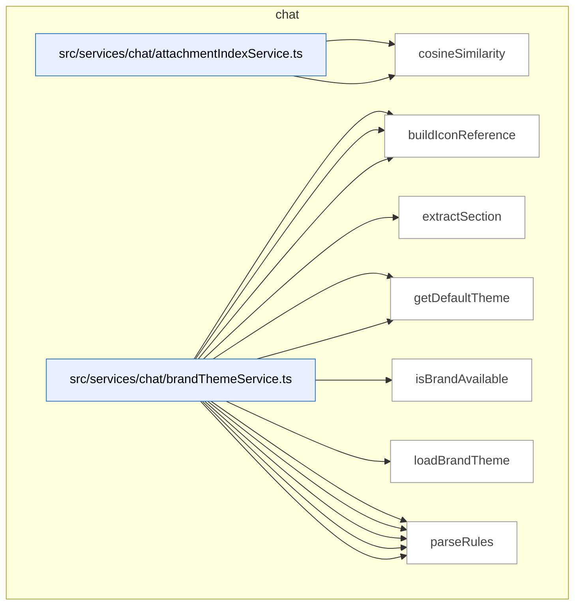
```mermaid
flowchart TB
subgraph dom_chat ["chat"]
  file_src_services_chat_attachmentIndexService["src/services/chat/attachmentIndexService.ts"]:::component
  sym_src_services_chat_attachmentIndexService["AttachmentIndexService"]:::symbol
  file_src_services_chat_attachmentIndexService --> sym_src_services_chat_attachmentIndexService
  sym_src_services_chat_attachmentIndexService["cosineSimilarity"]:::symbol
  file_src_services_chat_attachmentIndexService --> sym_src_services_chat_attachmentIndexService
  file_src_services_chat_brandThemeService_ts["src/services/chat/brandThemeService.ts"]:::component
  sym_src_services_chat_brandThemeService_ts_b["buildCssFromColors"]:::symbol
  file_src_services_chat_brandThemeService_ts --> sym_src_services_chat_brandThemeService_ts_b
  sym_src_services_chat_brandThemeService_ts_b["buildIconCss"]:::symbol
  file_src_services_chat_brandThemeService_ts --> sym_src_services_chat_brandThemeService_ts_b
  sym_src_services_chat_brandThemeService_ts_b["buildIconReference"]:::symbol
  file_src_services_chat_brandThemeService_ts --> sym_src_services_chat_brandThemeService_ts_b
  sym_src_services_chat_brandThemeService_ts_e["extractSection"]:::symbol
  file_src_services_chat_brandThemeService_ts --> sym_src_services_chat_brandThemeService_ts_e
  sym_src_services_chat_brandThemeService_ts_g["getBrandPath"]:::symbol
  file_src_services_chat_brandThemeService_ts --> sym_src_services_chat_brandThemeService_ts_g
  sym_src_services_chat_brandThemeService_ts_g["getDefaultTheme"]:::symbol
  file_src_services_chat_brandThemeService_ts --> sym_src_services_chat_brandThemeService_ts_g
  sym_src_services_chat_brandThemeService_ts_i["isBrandAvailable"]:::symbol
  file_src_services_chat_brandThemeService_ts --> sym_src_services_chat_brandThemeService_ts_i
  sym_src_services_chat_brandThemeService_ts_l["loadBrandTheme"]:::symbol
  file_src_services_chat_brandThemeService_ts --> sym_src_services_chat_brandThemeService_ts_l
  sym_src_services_chat_brandThemeService_ts_p["parseAuditChecklist"]:::symbol
  file_src_services_chat_brandThemeService_ts --> sym_src_services_chat_brandThemeService_ts_p
  sym_src_services_chat_brandThemeService_ts_p["parseBrandFile"]:::symbol
  file_src_services_chat_brandThemeService_ts --> sym_src_services_chat_brandThemeService_ts_p
  sym_src_services_chat_brandThemeService_ts_p["parseColors"]:::symbol
  file_src_services_chat_brandThemeService_ts --> sym_src_services_chat_brandThemeService_ts_p
  sym_src_services_chat_brandThemeService_ts_p["parseFont"]:::symbol
  file_src_services_chat_brandThemeService_ts --> sym_src_services_chat_brandThemeService_ts_p
  sym_src_services_chat_brandThemeService_ts_p["parseRules"]:::symbol
  file_src_services_chat_brandThemeService_ts --> sym_src_services_chat_brandThemeService_ts_p
end
classDef container fill:#f5f5f5,stroke:#333,stroke-width:2px,color:#000
classDef component fill:#e8f0ff,stroke:#3178c6,color:#000
classDef symbol fill:#fff,stroke:#999,color:#444
classDef dup fill:#ffe8d8,stroke:#c0392b,stroke-width:2px,color:#000
classDef violation fill:#ffd6d6,stroke:#c0392b,stroke-width:2px,color:#000
```

_Domain has 109 symbols (>50). Diagram shows top-15 by file order; see flat table below for the full list._

### Symbols in this domain

| Symbol | Kind | Path | Lines | Purpose |
|---|---|---|---|---|
| [`AttachmentIndexService`](../src/services/chat/attachmentIndexService.ts#L17) | class | `src/services/chat/attachmentIndexService.ts` | 17-146 | <no body> |
| [`cosineSimilarity`](../src/services/chat/attachmentIndexService.ts#L6) | function | `src/services/chat/attachmentIndexService.ts` | 6-15 | Computes cosine similarity between two vector embeddings. |
| [`buildCssFromColors`](../src/services/chat/brandThemeService.ts#L176) | function | `src/services/chat/brandThemeService.ts` | 176-263 | Generates a complete CSS stylesheet with brand colors, typography, and slide layout styles. |
| [`buildIconCss`](../src/services/chat/brandThemeService.ts#L107) | function | `src/services/chat/brandThemeService.ts` | 107-131 | Generates CSS for inline SVG icon sprites with size and color variants. |
| [`buildIconReference`](../src/services/chat/brandThemeService.ts#L134) | function | `src/services/chat/brandThemeService.ts` | 134-139 | Builds a reference string listing available icon names grouped by category. |
| [`extractSection`](../src/services/chat/brandThemeService.ts#L321) | function | `src/services/chat/brandThemeService.ts` | 321-325 | Extracts markdown section content between two level-2 headings using regex. |
| [`getBrandPath`](../src/services/chat/brandThemeService.ts#L312) | function | `src/services/chat/brandThemeService.ts` | 312-317 | Returns custom brand path from settings or constructs default path from plugin folder and config folder. |
| [`getDefaultTheme`](../src/services/chat/brandThemeService.ts#L267) | function | `src/services/chat/brandThemeService.ts` | 267-273 | Returns default theme with CSS, empty prompt rules, and empty audit checklist. |
| [`isBrandAvailable`](../src/services/chat/brandThemeService.ts#L275) | function | `src/services/chat/brandThemeService.ts` | 275-278 | Checks if a brand guidelines file exists at the configured path. |
| [`loadBrandTheme`](../src/services/chat/brandThemeService.ts#L280) | function | `src/services/chat/brandThemeService.ts` | 280-298 | Loads and parses brand theme file from vault, with error handling and type-checking. |
| [`parseAuditChecklist`](../src/services/chat/brandThemeService.ts#L407) | function | `src/services/chat/brandThemeService.ts` | 407-414 | Converts markdown rules into audit checklist items with generated IDs. |
| [`parseBrandFile`](../src/services/chat/brandThemeService.ts#L327) | function | `src/services/chat/brandThemeService.ts` | 327-342 | Parses brand file sections and builds theme with CSS, prompt rules, and audit checklist. |
| [`parseColors`](../src/services/chat/brandThemeService.ts#L345) | function | `src/services/chat/brandThemeService.ts` | 345-388 | Parses color table from markdown and maps role keywords to color slots, using first match per slot. |
| [`parseFont`](../src/services/chat/brandThemeService.ts#L390) | function | `src/services/chat/brandThemeService.ts` | 390-395 | Extracts font family from markdown list and wraps with fallbacks. |
| [`parseRules`](../src/services/chat/brandThemeService.ts#L397) | function | `src/services/chat/brandThemeService.ts` | 397-405 | Extracts bullet-point rules from markdown section, stripping dashes and filtering blanks. |
| [`resolveTheme`](../src/services/chat/brandThemeService.ts#L300) | function | `src/services/chat/brandThemeService.ts` | 300-308 | Returns brand theme if enabled and available, otherwise returns default theme. |
| [`ChatSearchService`](../src/services/chat/chatSearchService.ts#L114) | class | `src/services/chat/chatSearchService.ts` | 114-265 | <no body> |
| [`countMessages`](../src/services/chat/chatSearchService.ts#L92) | function | `src/services/chat/chatSearchService.ts` | 92-95 | Counts message headers in searchable content. |
| [`extractTitle`](../src/services/chat/chatSearchService.ts#L99) | function | `src/services/chat/chatSearchService.ts` | 99-108 | Extracts title from first markdown heading or filename fallback. |
| [`isWithinDateRange`](../src/services/chat/chatSearchService.ts#L42) | function | `src/services/chat/chatSearchService.ts` | 42-49 | Checks if a date falls within the specified range (all/7days/30days/90days). |
| [`parseFrontmatter`](../src/services/chat/chatSearchService.ts#L66) | function | `src/services/chat/chatSearchService.ts` | 66-86 | Extracts chat metadata from frontmatter using regex: chat mode, project ID, creation date, and ai-chat tag. |
| [`ConversationCompactionService`](../src/services/chat/conversationCompactionService.ts#L15) | class | `src/services/chat/conversationCompactionService.ts` | 15-100 | <no body> |
| [`ConversationPersistenceService`](../src/services/chat/conversationPersistenceService.ts#L11) | class | `src/services/chat/conversationPersistenceService.ts` | 11-228 | <no body> |
| [`extractSlideCount`](../src/services/chat/conversationPersistenceService.ts#L231) | function | `src/services/chat/conversationPersistenceService.ts` | 231-237 | Counts slide elements in presentation snapshot HTML. |
| [`collectFolderMdPaths`](../src/services/chat/creationSourceController.ts#L364) | function | `src/services/chat/creationSourceController.ts` | 364-376 | Recursively collects all markdown file paths from a folder tree. |
| [`CreationSourceController`](../src/services/chat/creationSourceController.ts#L52) | class | `src/services/chat/creationSourceController.ts` | 52-357 | <no body> |
| [`isTFile`](../src/services/chat/creationSourceController.ts#L359) | function | `src/services/chat/creationSourceController.ts` | 359-362 | Type-guard checking if an object is a markdown TFile with required properties. |
| [`nextId`](../src/services/chat/creationSourceController.ts#L48) | function | `src/services/chat/creationSourceController.ts` | 48-50 | Generates and returns a unique source identifier with numeric counter. |
| [`GenerationProgressController`](../src/services/chat/generationProgressController.ts#L50) | class | `src/services/chat/generationProgressController.ts` | 50-74 | Wraps long-running operation controller to track presentation generation progress by slide count. |
| [`parseExpectedSlideCount`](../src/services/chat/generationProgressController.ts#L80) | function | `src/services/chat/generationProgressController.ts` | 80-88 | Parses "N slides" pattern from prompt and returns clamped count (1–50). |
| [`GlobalMemoryService`](../src/services/chat/globalMemoryService.ts#L9) | class | `src/services/chat/globalMemoryService.ts` | 9-69 | <no body> |
| [`getExtendDisplayMs`](../src/services/chat/presentationConstants.ts#L69) | function | `src/services/chat/presentationConstants.ts` | 69-76 | Returns display extension time calculated as hard budget minus soft budget, with validation. |
| [`assessStructure`](../src/services/chat/presentationDiff.ts#L186) | function | `src/services/chat/presentationDiff.ts` | 186-195 | Checks whether slides were added, removed, had classes changed, or lost element paths, returning a structural integrity status. |
| [`attributesMatch`](../src/services/chat/presentationDiff.ts#L96) | function | `src/services/chat/presentationDiff.ts` | 96-113 | Compares element attributes with class-aware token set comparison and INSTRUMENTATION_ATTRS exclusion. |
| [`buildScopeDiff`](../src/services/chat/presentationDiff.ts#L297) | function | `src/services/chat/presentationDiff.ts` | 297-307 | Extracts the HTML fragment matching a given scope and returns it with accompanying old/new fragments and text diff. |
| [`buildSiblingDrift`](../src/services/chat/presentationDiff.ts#L348) | function | `src/services/chat/presentationDiff.ts` | 348-386 | Identifies sibling elements that changed within a scoped edit boundary, returning drift details if the parent structure is intact. |
| [`classifyDiff`](../src/services/chat/presentationDiff.ts#L156) | function | `src/services/chat/presentationDiff.ts` | 156-184 | Parses old and new HTML, extracts slides, and returns a comprehensive diff including scope changes, structural integrity, sibling drift, and text location counts. |
| [`collectAttrs`](../src/services/chat/presentationDiff.ts#L121) | function | `src/services/chat/presentationDiff.ts` | 121-130 | Collects and sorts element attributes, excluding instrumentation attributes and data-pres-* prefixes. |
| [`collectElementPaths`](../src/services/chat/presentationDiff.ts#L198) | function | `src/services/chat/presentationDiff.ts` | 198-210 | Walks a slide's DOM tree and collects all element paths marked with `data-element` attributes into a set. |
| [`collectOutOfScopeDrift`](../src/services/chat/presentationDiff.ts#L226) | function | `src/services/chat/presentationDiff.ts` | 226-240 | Identifies slides outside the edit scope and gathers their structural and textual differences. |
| [`compareSlides`](../src/services/chat/presentationDiff.ts#L39) | function | `src/services/chat/presentationDiff.ts` | 39-58 | Compares old and new HTML for drift severity (identical/whitespace/text/structural). |
| [`countTextChangedLocations`](../src/services/chat/presentationDiff.ts#L321) | function | `src/services/chat/presentationDiff.ts` | 321-325 | Normalizes and compares text content of old and new scope fragments, returning count of text change locations. |
| [`describeSlideDrift`](../src/services/chat/presentationDiff.ts#L242) | function | `src/services/chat/presentationDiff.ts` | 242-254 | Compares two slide HTML strings and returns severity level, text diff, and the full HTML for out-of-scope drift reporting. |
| [`directTextContent`](../src/services/chat/presentationDiff.ts#L133) | function | `src/services/chat/presentationDiff.ts` | 133-139 | Extracts direct text node content from an element, excluding text in child elements. |
| [`findSiblingHtmls`](../src/services/chat/presentationDiff.ts#L391) | function | `src/services/chat/presentationDiff.ts` | 391-406 | Locates all sibling elements under the same parent path and returns their serialized HTML joined by newlines. |
| [`normaliseTextOfHtml`](../src/services/chat/presentationDiff.ts#L327) | function | `src/services/chat/presentationDiff.ts` | 327-333 | Extracts and normalizes text content from HTML by parsing it, collapsing whitespace, and trimming. |
| [`parentPathOf`](../src/services/chat/presentationDiff.ts#L408) | function | `src/services/chat/presentationDiff.ts` | 408-411 | Extracts the parent path from a dot-separated element path by finding the last dot. |
| [`scopedSlideIndices`](../src/services/chat/presentationDiff.ts#L286) | function | `src/services/chat/presentationDiff.ts` | 286-295 | Converts a scope specification (single slide or range) into a set of numeric slide indices. |
| [`slidesClassesChanged`](../src/services/chat/presentationDiff.ts#L256) | function | `src/services/chat/presentationDiff.ts` | 256-265 | Normalizes and compares class attributes on corresponding slides, returning true if any differ. |
| [`slidesElementPathsRemoved`](../src/services/chat/presentationDiff.ts#L213) | function | `src/services/chat/presentationDiff.ts` | 213-224 | Compares element paths between old and new slides at the same indices, returning true if any old paths were removed. |
| [`stripInstrumentationAttrs`](../src/services/chat/presentationDiff.ts#L312) | function | `src/services/chat/presentationDiff.ts` | 312-314 | Removes instrumentation attributes (`data-element`, `data-bg-hover-label`, `data-pres-*`) from HTML. |
| [`walkCompare`](../src/services/chat/presentationDiff.ts#L61) | function | `src/services/chat/presentationDiff.ts` | 61-93 | Recursively walks DOM trees comparing tags, attributes, children, and text content with severity ranking. |
| [`buildDeckContextSummary`](../src/services/chat/presentationDomDecorator.ts#L260) | function | `src/services/chat/presentationDomDecorator.ts` | 260-280 | Summarizes a presentation deck by counting slides, extracting the title, and listing section headings. |
| [`buildDesignSummary`](../src/services/chat/presentationDomDecorator.ts#L290) | function | `src/services/chat/presentationDomDecorator.ts` | 290-330 | Catalogs the deck's layout classes, component usage (grids, callouts, tables, figures, images), and provides design guidance. |
| [`cssAttrEscape`](../src/services/chat/presentationDomDecorator.ts#L249) | function | `src/services/chat/presentationDomDecorator.ts` | 249-251 | Escapes double-quotes and backslashes in CSS attribute values for safe selector matching. |
| [`decorateByKind`](../src/services/chat/presentationDomDecorator.ts#L116) | function | `src/services/chat/presentationDomDecorator.ts` | 116-131 | Finds all untagged elements matching a selector in a slide and assigns them sequential `data-element` identifiers. |
| [`decorateSlideElements`](../src/services/chat/presentationDomDecorator.ts#L68) | function | `src/services/chat/presentationDomDecorator.ts` | 68-114 | Tags all child elements within a slide with `data-element` paths, handling lists, headings, and generic component selectors with per-kind counters. |
| [`estimateScopedPromptChars`](../src/services/chat/presentationDomDecorator.ts#L351) | function | `src/services/chat/presentationDomDecorator.ts` | 351-369 | Estimates the character count of a scoped-edit prompt by multiplying canonical HTML by 2, adding extras, and overhead. |
| [`extractScopedFragment`](../src/services/chat/presentationDomDecorator.ts#L207) | function | `src/services/chat/presentationDomDecorator.ts` | 207-246 | Extracts a scoped fragment (slide, range, or element) from canonical HTML using fail-closed semantics, stripping instrumentation before returning. |
| [`projectForEditor`](../src/services/chat/presentationDomDecorator.ts#L50) | function | `src/services/chat/presentationDomDecorator.ts` | 50-65 | Parses canonical HTML, assigns `data-element` identifiers to the deck and slides, decorates slide elements, and returns the serialized result. |
| [`serializePreservingWrapper`](../src/services/chat/presentationDomDecorator.ts#L172) | function | `src/services/chat/presentationDomDecorator.ts` | 172-184 | Serializes a parsed DOM document, preserving the original doctype and HTML structure for full-document inputs. |
| [`stripEditorAnnotations`](../src/services/chat/presentationDomDecorator.ts#L147) | function | `src/services/chat/presentationDomDecorator.ts` | 147-155 | Parses HTML, removes all `data-element` attributes, and returns the cleaned serialized result. |
| [`buildScopedPrompt`](../src/services/chat/presentationHtmlService.ts#L463) | function | `src/services/chat/presentationHtmlService.ts` | 463-488 | Routes to either design or content-mode prompt builder based on edit mode. |
| [`gatherScopedContext`](../src/services/chat/presentationHtmlService.ts#L426) | function | `src/services/chat/presentationHtmlService.ts` | 426-449 | Fetches references and web-search results in parallel when in content mode, or returns empty strings for design mode. |
| [`generateHtml`](../src/services/chat/presentationHtmlService.ts#L113) | function | `src/services/chat/presentationHtmlService.ts` | 113-136 | Builds a generation request with system prompt, user prompt, and timeout, delegating to runHtmlTask. |
| [`generateHtmlStream`](../src/services/chat/presentationHtmlService.ts#L153) | function | `src/services/chat/presentationHtmlService.ts` | 153-225 | <no body> |
| [`processExtractedHtml`](../src/services/chat/presentationHtmlService.ts#L88) | function | `src/services/chat/presentationHtmlService.ts` | 88-100 | Extracts HTML from LLM response, sanitizes it, validates presence of deck root and slides, wraps it in a document, and injects CSP. |
| [`refineHtml`](../src/services/chat/presentationHtmlService.ts#L238) | function | `src/services/chat/presentationHtmlService.ts` | 238-260 | Builds a refinement request with system prompt, user prompt containing current HTML and edits, and timeout, delegating to runHtmlTask. |
| [`refineHtmlScoped`](../src/services/chat/presentationHtmlService.ts#L356) | function | `src/services/chat/presentationHtmlService.ts` | 356-423 | Orchestrates a scoped edit by gathering context, extracting the fragment, checking prompt size, calling the LLM, processing the diff, and validating the result. |
| [`runBrandAudit`](../src/services/chat/presentationHtmlService.ts#L264) | function | `src/services/chat/presentationHtmlService.ts` | 264-324 | Runs an LLM-based brand audit against a theme's checklist, parses the response for passed checks and violations, and returns structured results. |
| [`runHtmlTask`](../src/services/chat/presentationHtmlService.ts#L57) | function | `src/services/chat/presentationHtmlService.ts` | 57-83 | Calls the LLM with combined system and user prompts, processes extracted HTML, and returns a validated result. |
| [`deduplicateFindings`](../src/services/chat/presentationQualityService.ts#L67) | function | `src/services/chat/presentationQualityService.ts` | 67-82 | Merges two finding lists by key, with the second list overwriting collisions, and returns a deduplicated array. |
| [`findingKey`](../src/services/chat/presentationQualityService.ts#L266) | function | `src/services/chat/presentationQualityService.ts` | 266-271 | Generates a deduplication key from a finding's slide index, category, and truncated issue text. |
| [`parseFindings`](../src/services/chat/presentationQualityService.ts#L230) | function | `src/services/chat/presentationQualityService.ts` | 230-264 | Parses JSON response containing findings array, validates required and optional fields, and returns a structured findings list or null if unparseable. |
| [`runDeepScan`](../src/services/chat/presentationQualityService.ts#L57) | function | `src/services/chat/presentationQualityService.ts` | 57-64 | Delegates to runScan with 'deep' pass mode. |
| [`runFastScan`](../src/services/chat/presentationQualityService.ts#L47) | function | `src/services/chat/presentationQualityService.ts` | 47-54 | Delegates to runScan with 'fast' pass mode. |
| [`runScan`](../src/services/chat/presentationQualityService.ts#L163) | function | `src/services/chat/presentationQualityService.ts` | 163-223 | Samples the deck if needed, builds a scan prompt, calls the LLM with token budget, parses findings, and remaps indices if sampled. |
| [`sampleLargeDeck`](../src/services/chat/presentationQualityService.ts#L96) | function | `src/services/chat/presentationQualityService.ts` | 96-159 | Samples a large deck by selecting first N, last N, and evenly-spaced middle slides, injecting `data-original-index` to preserve full-deck positions. |
| [`decodeEntities`](../src/services/chat/presentationSanitizer.ts#L273) | function | `src/services/chat/presentationSanitizer.ts` | 273-277 | Converts HTML numeric character entities (hex and decimal) to their Unicode string equivalents. |
| [`filterAttribute`](../src/services/chat/presentationSanitizer.ts#L215) | function | `src/services/chat/presentationSanitizer.ts` | 215-238 | Validates and sanitizes an attribute by checking name, tag context, href/src/style content, and HTML-escaping quotes. |
| [`filterAttributes`](../src/services/chat/presentationSanitizer.ts#L241) | function | `src/services/chat/presentationSanitizer.ts` | 241-270 | Parses all attributes from a tag using regex, filters each via filterAttribute, handles bare attributes, and returns kept and rejection count. |
| [`injectCSP`](../src/services/chat/presentationSanitizer.ts#L350) | function | `src/services/chat/presentationSanitizer.ts` | 350-365 | Injects a Content Security Policy meta tag into HTML, either after the head tag or at the beginning if no head exists. |
| [`isAllowedCssUrl`](../src/services/chat/presentationSanitizer.ts#L145) | function | `src/services/chat/presentationSanitizer.ts` | 145-148 | Returns true if a CSS url() reference is a non-SVG data image URI. |
| [`isAllowedDataImageUri`](../src/services/chat/presentationSanitizer.ts#L136) | function | `src/services/chat/presentationSanitizer.ts` | 136-138 | Returns true if a data URI is a non-SVG image. |
| [`isAllowedHref`](../src/services/chat/presentationSanitizer.ts#L129) | function | `src/services/chat/presentationSanitizer.ts` | 129-133 | Returns true if a URL is http, https, fragment, or mailto. |
| [`isAllowedImgSrc`](../src/services/chat/presentationSanitizer.ts#L140) | function | `src/services/chat/presentationSanitizer.ts` | 140-143 | Returns true if an img src is a non-SVG data image URI. |
| [`sanitizeCssValue`](../src/services/chat/presentationSanitizer.ts#L152) | function | `src/services/chat/presentationSanitizer.ts` | 152-163 | Tests a CSS value against dangerous patterns and validates all url() references are allowed. |
| [`sanitizePresentation`](../src/services/chat/presentationSanitizer.ts#L286) | function | `src/services/chat/presentationSanitizer.ts` | 286-340 | Sanitizes raw HTML by removing blocked tags and filtering attributes on allowed tags, tracking rejected elements. |
| [`sanitizeStyleAttribute`](../src/services/chat/presentationSanitizer.ts#L190) | function | `src/services/chat/presentationSanitizer.ts` | 190-205 | Splits CSS declarations, validates property names and values, sanitizes values, and returns the joined result. |
| [`splitCssDeclarations`](../src/services/chat/presentationSanitizer.ts#L170) | function | `src/services/chat/presentationSanitizer.ts` | 170-188 | Splits a CSS style string on semicolons while respecting nested parentheses depth. |
| [`allocateBudget`](../src/services/chat/presentationSourceBudget.ts#L34) | function | `src/services/chat/presentationSourceBudget.ts` | 34-97 | Distributes a total character budget across source files (standalone notes, web-search results, folder files) with per-kind caps and floor minimums. |
| [`PresentationSourceService`](../src/services/chat/presentationSourceService.ts#L54) | class | `src/services/chat/presentationSourceService.ts` | 54-220 | Resolves user-selected sources (notes, folders, web-search) into prompt-ready content with deduplication and per-source error handling. |
| [`validateCreationConfig`](../src/services/chat/presentationSourceService.ts#L238) | function | `src/services/chat/presentationSourceService.ts` | 238-246 | Validates that a presentation creation config has at least one source and a valid length within acceptable bounds. |
| [`classifyReliability`](../src/services/chat/presentationTypes.ts#L116) | function | `src/services/chat/presentationTypes.ts` | 116-134 | Classifies HTML presentation reliability as ok, warning, structurally-damaged, or unreliable based on rejection counts and structural validation. |
| [`computeQualityScore`](../src/services/chat/presentationTypes.ts#L205) | function | `src/services/chat/presentationTypes.ts` | 205-221 | Computes a quality score from structure findings and audit violations, capped between 0 and 100. |
| [`extractSlideInfo`](../src/services/chat/presentationTypes.ts#L146) | function | `src/services/chat/presentationTypes.ts` | 146-168 | Extracts slide metadata (index, heading, text length, notes presence, type) from a DOM document using a canonical slide selector. |
| [`migratePresentationSession`](../src/services/chat/presentationTypes.ts#L225) | function | `src/services/chat/presentationTypes.ts` | 225-267 | Migrates a persisted presentation session from storage, validating all required fields and constraining message roles and version counts. |
| [`runStructureChecks`](../src/services/chat/presentationTypes.ts#L170) | function | `src/services/chat/presentationTypes.ts` | 170-203 | Runs quality checks on slide structure (min/max slides, content length, headings, notes) and returns findings with severity levels. |
| [`buildProjectMd`](../src/services/chat/projectService.ts#L100) | function | `src/services/chat/projectService.ts` | 100-128 | Builds a project metadata file from a config object with frontmatter, sections, and placeholder content for empty fields. |
| [`extractWikilinks`](../src/services/chat/projectService.ts#L46) | function | `src/services/chat/projectService.ts` | 46-49 | Extracts wikilink references (e.g., `[[note-name]]`) from Markdown text. |
| [`parseProjectMd`](../src/services/chat/projectService.ts#L55) | function | `src/services/chat/projectService.ts` | 55-98 | Parses a project metadata file to extract id, name, instructions, memory items, and pinned file references. |
| [`ProjectService`](../src/services/chat/projectService.ts#L139) | class | `src/services/chat/projectService.ts` | 139-616 | Manages project CRUD operations: listing, finding, creating, updating, and deleting projects in a vault folder structure. |
| [`slugify`](../src/services/chat/projectService.ts#L51) | function | `src/services/chat/projectService.ts` | 51-53 | Slugifies a project name by removing special characters and normalizing whitespace to hyphens. |
| [`collectMarkdownFiles`](../src/services/chat/slideContextProvider.ts#L194) | function | `src/services/chat/slideContextProvider.ts` | 194-204 | Recursively collects all Markdown files from a folder and its subfolders. |
| [`DefaultSlideContextProvider`](../src/services/chat/slideContextProvider.ts#L73) | class | `src/services/chat/slideContextProvider.ts` | 73-190 | Provides slide context by fetching web research results, reading reference notes, and building a context string within budget constraints. |
| [`escapeAttr`](../src/services/chat/slideContextProvider.ts#L221) | function | `src/services/chat/slideContextProvider.ts` | 221-223 | Escapes double quotes in an attribute value for safe HTML serialization. |
| [`truncateAtSentence`](../src/services/chat/slideContextProvider.ts#L207) | function | `src/services/chat/slideContextProvider.ts` | 207-219 | Truncates text to a budget while preserving sentence boundaries, appending a truncation indicator. |
| [`buildSlideRuntimeCode`](../src/services/chat/slideRuntime.ts#L22) | function | `src/services/chat/slideRuntime.ts` | 22-272 | Generates inline JavaScript for runtime slide navigation, including keyboard controls, speaker notes visibility, and message-based slide selection. |
| [`StreamingHtmlAssembler`](../src/services/chat/streamingHtmlAssembler.ts#L95) | class | `src/services/chat/streamingHtmlAssembler.ts` | 95-360 | Buffers streaming HTML chunks, detects slide boundaries, fires progress signals (stream start, slide start, checkpoints), and debounces rendering. |

---

## commands

> The `commands` domain registers and executes user-triggered actions for audio narration (converting notes to MP3 with cost confirmation and playback) and canvas operations (summarizing and visualizing note relationships).

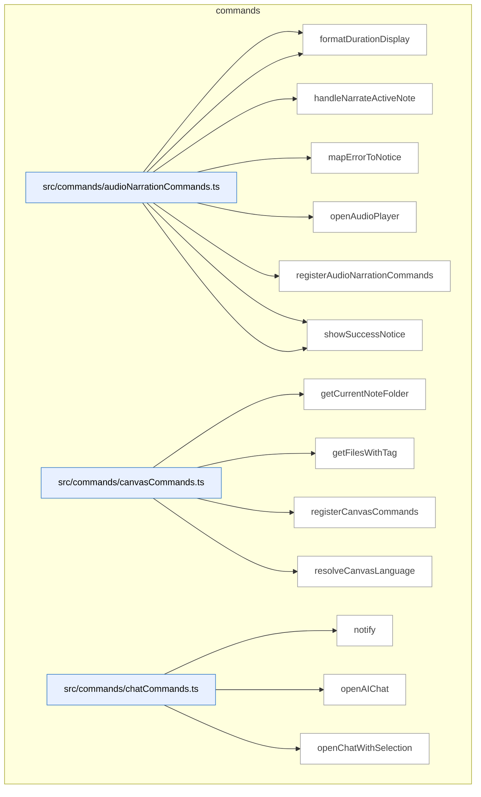
```mermaid
flowchart TB
subgraph dom_commands ["commands"]
  file_src_commands_audioNarrationCommands_ts["src/commands/audioNarrationCommands.ts"]:::component
  sym_src_commands_audioNarrationCommands_ts_f["formatBytes"]:::symbol
  file_src_commands_audioNarrationCommands_ts --> sym_src_commands_audioNarrationCommands_ts_f
  sym_src_commands_audioNarrationCommands_ts_f["formatDurationDisplay"]:::symbol
  file_src_commands_audioNarrationCommands_ts --> sym_src_commands_audioNarrationCommands_ts_f
  sym_src_commands_audioNarrationCommands_ts_h["handleNarrateActiveNote"]:::symbol
  file_src_commands_audioNarrationCommands_ts --> sym_src_commands_audioNarrationCommands_ts_h
  sym_src_commands_audioNarrationCommands_ts_m["mapErrorToNotice"]:::symbol
  file_src_commands_audioNarrationCommands_ts --> sym_src_commands_audioNarrationCommands_ts_m
  sym_src_commands_audioNarrationCommands_ts_o["openAudioPlayer"]:::symbol
  file_src_commands_audioNarrationCommands_ts --> sym_src_commands_audioNarrationCommands_ts_o
  sym_src_commands_audioNarrationCommands_ts_r["registerAudioNarrationCommands"]:::symbol
  file_src_commands_audioNarrationCommands_ts --> sym_src_commands_audioNarrationCommands_ts_r
  sym_src_commands_audioNarrationCommands_ts_s["showErrorNotice"]:::symbol
  file_src_commands_audioNarrationCommands_ts --> sym_src_commands_audioNarrationCommands_ts_s
  sym_src_commands_audioNarrationCommands_ts_s["showSuccessNotice"]:::symbol
  file_src_commands_audioNarrationCommands_ts --> sym_src_commands_audioNarrationCommands_ts_s
  file_src_commands_canvasCommands_ts["src/commands/canvasCommands.ts"]:::component
  sym_src_commands_canvasCommands_ts_getCurren["getCurrentNoteFolder"]:::symbol
  file_src_commands_canvasCommands_ts --> sym_src_commands_canvasCommands_ts_getCurren
  sym_src_commands_canvasCommands_ts_getFilesW["getFilesWithTag"]:::symbol
  file_src_commands_canvasCommands_ts --> sym_src_commands_canvasCommands_ts_getFilesW
  sym_src_commands_canvasCommands_ts_registerC["registerCanvasCommands"]:::symbol
  file_src_commands_canvasCommands_ts --> sym_src_commands_canvasCommands_ts_registerC
  sym_src_commands_canvasCommands_ts_resolveCa["resolveCanvasLanguage"]:::symbol
  file_src_commands_canvasCommands_ts --> sym_src_commands_canvasCommands_ts_resolveCa
  file_src_commands_chatCommands_ts["src/commands/chatCommands.ts"]:::component
  sym_src_commands_chatCommands_ts_notify["notify"]:::symbol
  file_src_commands_chatCommands_ts --> sym_src_commands_chatCommands_ts_notify
  sym_src_commands_chatCommands_ts_openAIChat["openAIChat"]:::symbol
  file_src_commands_chatCommands_ts --> sym_src_commands_chatCommands_ts_openAIChat
  sym_src_commands_chatCommands_ts_openChatWit["openChatWithSelection"]:::symbol
  file_src_commands_chatCommands_ts --> sym_src_commands_chatCommands_ts_openChatWit
end
classDef container fill:#f5f5f5,stroke:#333,stroke-width:2px,color:#000
classDef component fill:#e8f0ff,stroke:#3178c6,color:#000
classDef symbol fill:#fff,stroke:#999,color:#444
classDef dup fill:#ffe8d8,stroke:#c0392b,stroke-width:2px,color:#000
classDef violation fill:#ffd6d6,stroke:#c0392b,stroke-width:2px,color:#000
```

_Domain has 183 symbols (>50). Diagram shows top-15 by file order; see flat table below for the full list._

### Symbols in this domain

| Symbol | Kind | Path | Lines | Purpose |
|---|---|---|---|---|
| [`formatBytes`](../src/commands/audioNarrationCommands.ts#L85) | function | `src/commands/audioNarrationCommands.ts` | 85-91 | Formats a byte count as a human-readable string (B, KB, MB, GB). |
| [`formatDurationDisplay`](../src/commands/audioNarrationCommands.ts#L93) | function | `src/commands/audioNarrationCommands.ts` | 93-97 | Formats seconds as MM:SS display format. |
| [`handleNarrateActiveNote`](../src/commands/audioNarrationCommands.ts#L141) | function | `src/commands/audioNarrationCommands.ts` | 141-262 | Prepares and executes audio narration of the active note, showing cost confirmation and handling embed sync. |
| [`mapErrorToNotice`](../src/commands/audioNarrationCommands.ts#L43) | function | `src/commands/audioNarrationCommands.ts` | 43-72 | Maps audio narration error codes to user-facing notice messages with appropriate durations. |
| [`openAudioPlayer`](../src/commands/audioNarrationCommands.ts#L268) | function | `src/commands/audioNarrationCommands.ts` | 268-278 | Opens an audio player modal for the given or active MP3 file. |
| [`registerAudioNarrationCommands`](../src/commands/audioNarrationCommands.ts#L280) | function | `src/commands/audioNarrationCommands.ts` | 280-319 | Registers Obsidian commands for narrating notes and playing audio narrations, including file-menu actions. |
| [`showErrorNotice`](../src/commands/audioNarrationCommands.ts#L75) | function | `src/commands/audioNarrationCommands.ts` | 75-83 | Shows an error notice corresponding to an audio narration error, with special handling for API key errors. |
| [`showSuccessNotice`](../src/commands/audioNarrationCommands.ts#L99) | function | `src/commands/audioNarrationCommands.ts` | 99-135 | Shows a sticky success notice with playback and file-open action buttons after audio narration completes. |
| [`getCurrentNoteFolder`](../src/commands/canvasCommands.ts#L20) | function | `src/commands/canvasCommands.ts` | 20-26 | Returns the active note's folder or the configured canvas output path. |
| [`getFilesWithTag`](../src/commands/canvasCommands.ts#L257) | function | `src/commands/canvasCommands.ts` | 257-269 | Filters markdown files to those tagged with a specific tag, handling tag hierarchy. |
| [`registerCanvasCommands`](../src/commands/canvasCommands.ts#L28) | function | `src/commands/canvasCommands.ts` | 28-255 | <no body> |
| [`resolveCanvasLanguage`](../src/commands/canvasCommands.ts#L15) | function | `src/commands/canvasCommands.ts` | 15-17 | Returns the configured summary language or defaults to English. |
| [`notify`](../src/commands/chatCommands.ts#L14) | function | `src/commands/chatCommands.ts` | 14-16 | Creates and shows an Obsidian notice with optional duration. |
| [`openAIChat`](../src/commands/chatCommands.ts#L40) | function | `src/commands/chatCommands.ts` | 40-53 | Opens a unified chat modal with the active file content and editor selection. |
| [`openChatWithSelection`](../src/commands/chatCommands.ts#L22) | function | `src/commands/chatCommands.ts` | 22-33 | Opens a unified chat modal with selected text from the active editor. |
| [`registerChatCommands`](../src/commands/chatCommands.ts#L58) | function | `src/commands/chatCommands.ts` | 58-167 | <no body> |
| [`clearTagsForCurrentFolder`](../src/commands/clearCommands.ts#L42) | function | `src/commands/clearCommands.ts` | 42-81 | Removes tags from all markdown files in the active note's parent folder after confirmation. |
| [`clearTagsForCurrentNote`](../src/commands/clearCommands.ts#L32) | function | `src/commands/clearCommands.ts` | 32-40 | Clears tags from the active note and ensures note structure is updated if enabled. |
| [`clearTagsForVault`](../src/commands/clearCommands.ts#L83) | function | `src/commands/clearCommands.ts` | 83-89 | Removes tags from all markdown files in the vault and refreshes the active note's structure. |
| [`registerClearCommands`](../src/commands/clearCommands.ts#L6) | function | `src/commands/clearCommands.ts` | 6-30 | Registers a command that opens a scope picker modal to clear tags from note, folder, or vault. |
| [`registerDashboardCommands`](../src/commands/dashboardCommands.ts#L13) | function | `src/commands/dashboardCommands.ts` | 13-59 | Registers a command to create a bases dashboard and adds a folder context menu item for the same. |
| [`digitiseImageCommand`](../src/commands/digitisationCommands.ts#L34) | function | `src/commands/digitisationCommands.ts` | 34-72 | Digitises target images after verifying vision support and obtaining privacy consent, processing them sequentially. |
| [`digitiseSingleImage`](../src/commands/digitisationCommands.ts#L77) | function | `src/commands/digitisationCommands.ts` | 77-127 | Processes a single image through vision API with progress reporting and optionally offers compression before insertion. |
| [`findTargetImages`](../src/commands/digitisationCommands.ts#L214) | function | `src/commands/digitisationCommands.ts` | 214-246 | Finds all embedded images in the active note, using a picker modal when multiple images exist. |
| [`loadImageDataUrl`](../src/commands/digitisationCommands.ts#L377) | function | `src/commands/digitisationCommands.ts` | 377-394 | Converts a vault image file to a base64 data URL for display purposes. |
| [`offerImageCompression`](../src/commands/digitisationCommands.ts#L170) | function | `src/commands/digitisationCommands.ts` | 170-201 | Displays compression confirmation and replaces the original image file if user approves. |
| [`registerDigitisationCommands`](../src/commands/digitisationCommands.ts#L15) | function | `src/commands/digitisationCommands.ts` | 15-29 | Registers a command to digitise images embedded in the current note using vision capabilities. |
| [`shouldOfferCompression`](../src/commands/digitisationCommands.ts#L145) | function | `src/commands/digitisationCommands.ts` | 145-165 | Determines whether to offer image compression based on savings percentage and user settings. |
| [`showMultiImagePicker`](../src/commands/digitisationCommands.ts#L258) | function | `src/commands/digitisationCommands.ts` | 258-372 | <no body> |
| [`showVisionPreview`](../src/commands/digitisationCommands.ts#L132) | function | `src/commands/digitisationCommands.ts` | 132-140 | Opens a modal for user review of vision extraction results and returns the user's choice. |
| [`executeScan`](../src/commands/embedScanCommands.ts#L33) | function | `src/commands/embedScanCommands.ts` | 33-143 | Scans specified markdown files for embedded content and displays results with progress indication. |
| [`registerEmbedScanCommands`](../src/commands/embedScanCommands.ts#L17) | function | `src/commands/embedScanCommands.ts` | 17-31 | Registers a command to scan for embedded content (images, links, etc.) across vault/folder/note scope. |
| [`registerExportCommands`](../src/commands/exportCommands.ts#L5) | function | `src/commands/exportCommands.ts` | 5-22 | Registers a command to export the active note in various formats via a modal dialog. |
| [`assembleMultiNoteContent`](../src/commands/flashcardCommands.ts#L446) | function | `src/commands/flashcardCommands.ts` | 446-477 | Assembles content from multiple notes into a single string while respecting token limits. |
| [`callLLMForFlashcards`](../src/commands/flashcardCommands.ts#L610) | function | `src/commands/flashcardCommands.ts` | 610-619 | Calls the LLM to generate flashcards, using dedicated provider if configured. |
| [`cleanCSVResponse`](../src/commands/flashcardCommands.ts#L579) | function | `src/commands/flashcardCommands.ts` | 579-585 | Removes markdown code fence markers from LLM-generated CSV content. |
| [`deliverFlashcards`](../src/commands/flashcardCommands.ts#L482) | function | `src/commands/flashcardCommands.ts` | 482-507 | Exports generated flashcards to a file (desktop) or clipboard (mobile/web). |
| [`exportFlashcards`](../src/commands/flashcardCommands.ts#L48) | function | `src/commands/flashcardCommands.ts` | 48-70 | Opens a flashcard export modal to handle generation from current note, multiple notes, or screenshot sources. |
| [`generateAndExportFlashcards`](../src/commands/flashcardCommands.ts#L155) | function | `src/commands/flashcardCommands.ts` | 155-221 | Generates flashcards in specified format from text content with validation and error handling. |
| [`generateFlashcardsFromScreenshot`](../src/commands/flashcardCommands.ts#L317) | function | `src/commands/flashcardCommands.ts` | 317-386 | Generates flashcards from a screenshot image through multimodal vision processing. |
| [`generateFlashcardsWithImages`](../src/commands/flashcardCommands.ts#L227) | function | `src/commands/flashcardCommands.ts` | 227-312 | Generates flashcards from text and embedded images using multimodal vision processing. |
| [`getEditorContent`](../src/commands/flashcardCommands.ts#L393) | function | `src/commands/flashcardCommands.ts` | 393-399 | Retrieves the content of a file from the active editor or vault. |
| [`getFlashcardService`](../src/commands/flashcardCommands.ts#L591) | function | `src/commands/flashcardCommands.ts` | 591-604 | Creates a dedicated cloud LLM service instance using flashcard provider configuration. |
| [`handleCurrentNoteSource`](../src/commands/flashcardCommands.ts#L78) | function | `src/commands/flashcardCommands.ts` | 78-101 | Generates flashcards from the active note's content, using multimodal processing if images are detected. |
| [`handleMultiNoteSource`](../src/commands/flashcardCommands.ts#L106) | function | `src/commands/flashcardCommands.ts` | 106-124 | Generates flashcards from multiple selected notes, assembling and truncating content as needed. |
| [`handleScreenshotSource`](../src/commands/flashcardCommands.ts#L129) | function | `src/commands/flashcardCommands.ts` | 129-148 | Generates flashcards from a screenshot image after verifying vision support and privacy consent. |
| [`isVisionAvailable`](../src/commands/flashcardCommands.ts#L416) | function | `src/commands/flashcardCommands.ts` | 416-420 | Checks whether the current LLM service supports multimodal (vision) capabilities. |
| [`looksLikeProse`](../src/commands/flashcardCommands.ts#L569) | function | `src/commands/flashcardCommands.ts` | 569-574 | Detects whether text looks like prose rather than CSV by checking for comma separators. |
| [`registerFlashcardCommands`](../src/commands/flashcardCommands.ts#L36) | function | `src/commands/flashcardCommands.ts` | 36-43 | Registers a command to export flashcards from the current note. |
| [`resolveEmbeddedImages`](../src/commands/flashcardCommands.ts#L404) | function | `src/commands/flashcardCommands.ts` | 404-411 | Extracts all embedded image files from note content. |
| [`saveFlashcardWithDialog`](../src/commands/flashcardCommands.ts#L514) | function | `src/commands/flashcardCommands.ts` | 514-563 | Shows a system save dialog or falls back to Downloads folder for saving flashcard files. |
| [`sendMultimodalForFlashcards`](../src/commands/flashcardCommands.ts#L625) | function | `src/commands/flashcardCommands.ts` | 625-641 | Sends multimodal content (text + images) to the LLM for flashcard generation. |
| [`showCSVValidationError`](../src/commands/flashcardCommands.ts#L426) | function | `src/commands/flashcardCommands.ts` | 426-441 | Displays an error notice when flashcard CSV generation fails or returns invalid format. |
| [`registerGenerateCommands`](../src/commands/generateCommands.ts#L7) | function | `src/commands/generateCommands.ts` | 7-69 | Registers tagging commands for current note/folder/vault with batch file menu items. |
| [`tagCurrentFolder`](../src/commands/generateCommands.ts#L139) | function | `src/commands/generateCommands.ts` | 139-173 | Tags all markdown files in the active note's parent folder after confirmation. |
| [`tagCurrentNote`](../src/commands/generateCommands.ts#L71) | function | `src/commands/generateCommands.ts` | 71-137 | Tags the active note after gathering analysis, with support for selection-only tagging. |
| [`tagVault`](../src/commands/generateCommands.ts#L175) | function | `src/commands/generateCommands.ts` | 175-196 | Tags all markdown files in the vault after confirmation. |
| [`applyHighlight`](../src/commands/highlightCommands.ts#L78) | function | `src/commands/highlightCommands.ts` | 78-92 | Applies a colored highlight mark tag to selected text or removes existing highlights. |
| [`registerHighlightCommands`](../src/commands/highlightCommands.ts#L10) | function | `src/commands/highlightCommands.ts` | 10-73 | Registers highlight commands with color picker and quick-access variants for each color. |
| [`removeHighlight`](../src/commands/highlightCommands.ts#L97) | function | `src/commands/highlightCommands.ts` | 97-100 | Removes all highlight formatting from selected text. |
| [`stripExistingHighlight`](../src/commands/highlightCommands.ts#L105) | function | `src/commands/highlightCommands.ts` | 105-116 | Strips custom mark tags, generic mark tags, and native Obsidian highlight syntax from text. |
| [`registerCommands`](../src/commands/index.ts#L30) | function | `src/commands/index.ts` | 30-58 | Registers all command categories throughout the plugin. |
| [`AddContentModal`](../src/commands/integrationCommands.ts#L967) | class | `src/commands/integrationCommands.ts` | 967-1076 | Modal for adding new content sources with fields for source type, title, link, and content, returning a PendingSource result. |
| [`buildEnrichedContent`](../src/commands/integrationCommands.ts#L550) | function | `src/commands/integrationCommands.ts` | 550-575 | Enriches pending content by inserting extracted content at source line positions. |
| [`buildIntegrationPrompt`](../src/commands/integrationCommands.ts#L761) | function | `src/commands/integrationCommands.ts` | 761-809 | Constructs a detailed prompt for integrating pending content into an existing note, including placement, format, detail, and language instructions. |
| [`callLLMForIntegration`](../src/commands/integrationCommands.ts#L751) | function | `src/commands/integrationCommands.ts` | 751-756 | Wraps a text summarization call in a busy indicator and returns the LLM result. |
| [`detectContentType`](../src/commands/integrationCommands.ts#L698) | function | `src/commands/integrationCommands.ts` | 698-746 | Parses text to detect its content type (URL, wikilink, embed) and returns metadata including type, title, and link. |
| [`dropSelectionToPending`](../src/commands/integrationCommands.ts#L50) | function | `src/commands/integrationCommands.ts` | 50-86 | Adds selected text to the pending integration section with optional reference tracking. |
| [`extractPendingEmbedText`](../src/commands/integrationCommands.ts#L668) | function | `src/commands/integrationCommands.ts` | 668-693 | Extracts text from an embedded item by delegating to a document service, handling both external URLs and local vault files. |
| [`getDefaultSourceTitle`](../src/commands/integrationCommands.ts#L605) | function | `src/commands/integrationCommands.ts` | 605-608 | Returns a localized label for a note source type, with a fallback to a default title. |
| [`IntegrationConfirmModal`](../src/commands/integrationCommands.ts#L814) | class | `src/commands/integrationCommands.ts` | 814-962 | Modal allowing user to select a persona, placement strategy, format, detail level, and auto-tagging options before confirming content integration. |
| [`movePendingSourcesToReferences`](../src/commands/integrationCommands.ts#L411) | function | `src/commands/integrationCommands.ts` | 411-420 | Moves resolved pending sources to the references section if not already present. |
| [`QuickTextModal`](../src/commands/integrationCommands.ts#L1081) | class | `src/commands/integrationCommands.ts` | 1081-1129 | Modal for quickly inputting freeform text to add as a content source. |
| [`QuickUrlModal`](../src/commands/integrationCommands.ts#L1134) | class | `src/commands/integrationCommands.ts` | 1134-1183 | Modal for quickly inputting a URL to add as a content source. |
| [`registerIntegrationCommands`](../src/commands/integrationCommands.ts#L88) | function | `src/commands/integrationCommands.ts` | 88-405 | <no body> |
| [`resolveAllPendingContent`](../src/commands/integrationCommands.ts#L429) | function | `src/commands/integrationCommands.ts` | 429-548 | Resolves all resolvable content types in pending section after obtaining necessary privacy consents. |
| [`resolvePendingEmbeds`](../src/commands/integrationCommands.ts#L610) | function | `src/commands/integrationCommands.ts` | 610-666 | Detects embedded content in pending text, filters extractable documents/PDFs, prompts user confirmation, and replaces embeds with their extracted text. |
| [`truncatePendingContentForIntegration`](../src/commands/integrationCommands.ts#L577) | function | `src/commands/integrationCommands.ts` | 577-603 | Truncates pending content to fit within provider token limits while preserving boundaries. |
| [`registerKindleCommands`](../src/commands/kindleCommands.ts#L9) | function | `src/commands/kindleCommands.ts` | 9-20 | Registers a command to open the Kindle sync modal. |
| [`registerMigrationCommands`](../src/commands/migrationCommands.ts#L13) | function | `src/commands/migrationCommands.ts` | 13-48 | Registers commands to upgrade note metadata to Bases format, either for the active note or an entire folder. |
| [`exportMinutesToDocx`](../src/commands/minutesCommands.ts#L36) | function | `src/commands/minutesCommands.ts` | 36-66 | Extracts meeting minutes JSON from the active note and exports it to a Word document, saving via system dialog or vault. |
| [`registerMinutesCommands`](../src/commands/minutesCommands.ts#L9) | function | `src/commands/minutesCommands.ts` | 9-34 | Registers commands to create meeting minutes and export them to Word format. |
| [`saveDocxToVault`](../src/commands/minutesCommands.ts#L104) | function | `src/commands/minutesCommands.ts` | 104-116 | Saves a Word document buffer to the vault in a designated output folder and notifies the user. |
| [`saveDocxWithDialog`](../src/commands/minutesCommands.ts#L72) | function | `src/commands/minutesCommands.ts` | 72-99 | Attempts to save a Word document using Electron's file dialog; returns the file path on success or null if unavailable or cancelled. |
| [`registerNewsletterCommands`](../src/commands/newsletterCommands.ts#L71) | function | `src/commands/newsletterCommands.ts` | 71-134 | Registers commands for fetching newsletters and regenerating audio, with progress tracking and error handling. |
| [`runRegenerateAudio`](../src/commands/newsletterCommands.ts#L41) | function | `src/commands/newsletterCommands.ts` | 41-69 | Regenerates audio for today's newsletter using a progress indicator and notifies the user of success. |
| [`showNewsletterFetchResultNotice`](../src/commands/newsletterCommands.ts#L16) | function | `src/commands/newsletterCommands.ts` | 16-35 | Displays a notice reflecting the result of a newsletter fetch operation, including error messages, success counts, or limit warnings. |
| [`generateExportFolderName`](../src/commands/notebookLMCommands.ts#L257) | function | `src/commands/notebookLMCommands.ts` | 257-278 | Generates a folder name for a NotebookLM export by using the LLM to summarize file titles, with a date suffix. |
| [`registerNotebookLMCommands`](../src/commands/notebookLMCommands.ts#L20) | function | `src/commands/notebookLMCommands.ts` | 20-242 | Registers a command to export a NotebookLM source pack from tagged notes, with optional folder creation and mode selection (create or update). |
| [`sanitizeFolderName`](../src/commands/notebookLMCommands.ts#L245) | function | `src/commands/notebookLMCommands.ts` | 245-254 | Sanitizes a folder name by removing invalid characters, lowercasing, and limiting length. |
| [`quickPeekFromSelection`](../src/commands/quickPeekCommands.ts#L42) | function | `src/commands/quickPeekCommands.ts` | 42-48 | <no body> |
| [`registerQuickPeekCommands`](../src/commands/quickPeekCommands.ts#L7) | function | `src/commands/quickPeekCommands.ts` | 7-36 | Registers a command that detects embedded content in the active note and opens a Quick Peek modal, optionally scoped to the selection. |
| [`registerResearchCommands`](../src/commands/researchCommands.ts#L11) | function | `src/commands/researchCommands.ts` | 11-31 | Registers a command to open a unified chat modal in research mode with the current note's content and selection. |
| [`buildQueryExpansionPrompt`](../src/commands/semanticSearchCommands.ts#L24) | function | `src/commands/semanticSearchCommands.ts` | 24-40 | Builds a prompt that asks the LLM to expand a search query with synonyms and related terms for better semantic search recall. |
| [`ExportSearchResultsModal`](../src/commands/semanticSearchCommands.ts#L455) | class | `src/commands/semanticSearchCommands.ts` | 455-675 | Modal for exporting semantic search results to a new note or appending to an existing note, with options for including excerpts. |
| [`registerSemanticSearchCommands`](../src/commands/semanticSearchCommands.ts#L680) | function | `src/commands/semanticSearchCommands.ts` | 680-762 | Registers commands for semantic search, index management, and finding related notes, with feature availability checks. |
| [`SemanticSearchResultsModal`](../src/commands/semanticSearchCommands.ts#L45) | class | `src/commands/semanticSearchCommands.ts` | 45-450 | Modal that performs semantic search with query expansion, displays paginated results, and allows bulk selection and export of findings. |
| [`registerSketchCommands`](../src/commands/sketchCommands.ts#L5) | function | `src/commands/sketchCommands.ts` | 5-19 | Registers a command to open a sketch pad modal for creating sketches within the active note editor. |
| [`applyImprovement`](../src/commands/smartNoteCommands.ts#L352) | function | `src/commands/smartNoteCommands.ts` | 352-387 | Applies the improved content to the note by replacing, inserting at cursor, or creating a new note, then ensures note structure and notifies the user. |
| [`buildImprovePrompt`](../src/commands/smartNoteCommands.ts#L392) | function | `src/commands/smartNoteCommands.ts` | 392-442 | Constructs a detailed prompt for improving a note that includes the note content, user query, persona instructions, and placement-specific return instructions. |
| [`buildSearchTermsPrompt`](../src/commands/smartNoteCommands.ts#L503) | function | `src/commands/smartNoteCommands.ts` | 503-529 | Builds a prompt asking the LLM to generate 3–5 specific search terms from note content and a user request. |
| [`executeEditMermaidDiagram`](../src/commands/smartNoteCommands.ts#L183) | function | `src/commands/smartNoteCommands.ts` | 183-216 | Finds Mermaid blocks in the editor and opens a chat modal for editing; if multiple blocks exist and cursor is not in one, shows a picker. |
| [`executeFindResources`](../src/commands/smartNoteCommands.ts#L129) | function | `src/commands/smartNoteCommands.ts` | 129-155 | Opens a modal for the user to request resource suggestions based on the active note's content. |
| [`executeGenerateMermaidDiagram`](../src/commands/smartNoteCommands.ts#L157) | function | `src/commands/smartNoteCommands.ts` | 157-178 | Opens a modal for the user to generate a Mermaid diagram based on the active note's content and diagram type. |
| [`executeImproveNote`](../src/commands/smartNoteCommands.ts#L92) | function | `src/commands/smartNoteCommands.ts` | 92-127 | Opens a modal for the user to improve the active note by selecting a persona, entering a query, and choosing placement strategy. |
| [`findAndShowResources`](../src/commands/smartNoteCommands.ts#L447) | function | `src/commands/smartNoteCommands.ts` | 447-498 | Generates search terms via LLM, searches for related resources, and displays results in a modal. |
| [`generateMermaidDiagram`](../src/commands/smartNoteCommands.ts#L221) | function | `src/commands/smartNoteCommands.ts` | 221-267 | Generates a Mermaid diagram using the LLM based on note content and options, validates it, wraps it in a code fence, and inserts it at the cursor. |
| [`getActiveMarkdownView`](../src/commands/smartNoteCommands.ts#L88) | function | `src/commands/smartNoteCommands.ts` | 88-90 | Returns the currently active Markdown view, or null if none exists. |
| [`improveNoteWithQuery`](../src/commands/smartNoteCommands.ts#L272) | function | `src/commands/smartNoteCommands.ts` | 272-347 | Improves a note by stripping trailing sections, sending it to the LLM with a query and persona, and applying the result based on placement strategy. |
| [`openEnhanceModal`](../src/commands/smartNoteCommands.ts#L53) | function | `src/commands/smartNoteCommands.ts` | 53-86 | Opens a modal displaying enhancement action options (improve, diagram, resources, flashcards) for the user to select from. |
| [`parseSearchTerms`](../src/commands/smartNoteCommands.ts#L534) | function | `src/commands/smartNoteCommands.ts` | 534-541 | Parses lines from a text response as search terms, filtering out invalid entries and limiting to 5 results. |
| [`registerSmartNoteCommands`](../src/commands/smartNoteCommands.ts#L33) | function | `src/commands/smartNoteCommands.ts` | 33-51 | Registers commands for enhancing notes (action menu) and editing Mermaid diagrams (conversational chat). |
| [`applyMultiSourceTruncation`](../src/commands/summarizeCommands.ts#L1867) | function | `src/commands/summarizeCommands.ts` | 1867-1888 | Applies multi-source document truncation limits with configurable behavior (full, truncate, or interactive choice). |
| [`buildSynthesisPrompt`](../src/commands/summarizeCommands.ts#L1175) | function | `src/commands/summarizeCommands.ts` | 1175-1207 | Combines multiple source summaries into a single coherent synthesis with integrated key points and thematic connections. |
| [`callSummarizeService`](../src/commands/summarizeCommands.ts#L1122) | function | `src/commands/summarizeCommands.ts` | 1122-1170 | Routes content to LLM summarization with quality-threshold auto-chunking for individual sources or direct processing based on content assessment. |
| [`canSummarizePdf`](../src/commands/summarizeCommands.ts#L176) | function | `src/commands/summarizeCommands.ts` | 176-178 | Checks whether PDF summarization is available by verifying a PDF provider configuration exists. |
| [`detectTargetFromText`](../src/commands/summarizeCommands.ts#L1372) | function | `src/commands/summarizeCommands.ts` | 1372-1403 | Detects whether clipboard or selected text contains a URL, PDF path, or plain text, classifying the content type for appropriate handling. |
| [`executeSmartSummarize`](../src/commands/summarizeCommands.ts#L226) | function | `src/commands/summarizeCommands.ts` | 226-246 | Opens a multi-source summarization modal if web summarization is enabled and a note is active. |
| [`extractBodyContentFromRawJson`](../src/commands/summarizeCommands.ts#L2734) | function | `src/commands/summarizeCommands.ts` | 2734-2766 | Extracts the body_content string value from raw JSON-wrapped response through character-by-character parsing with escape handling. |
| [`extractDocumentTextForMultiSource`](../src/commands/summarizeCommands.ts#L1819) | function | `src/commands/summarizeCommands.ts` | 1819-1865 | Extracts and truncates text from vault-resident or external documents with progress notifications and configurable size behavior. |
| [`extractExternalPdfPath`](../src/commands/summarizeCommands.ts#L1458) | function | `src/commands/summarizeCommands.ts` | 1458-1479 | Extracts external PDF file paths from text including file:// URLs, Windows paths, and Unix-style absolute paths. |
| [`extractInternalPdfFile`](../src/commands/summarizeCommands.ts#L1405) | function | `src/commands/summarizeCommands.ts` | 1405-1434 | Extracts internal PDF file references from wiki-link syntax or plain paths in text, resolving them to actual vault files. |
| [`extractUrl`](../src/commands/summarizeCommands.ts#L1481) | function | `src/commands/summarizeCommands.ts` | 1481-1493 | Extracts HTTP/HTTPS URLs from text including markdown links and bare URLs, removing trailing punctuation. |
| [`findEmbeddedPdfLinks`](../src/commands/summarizeCommands.ts#L1440) | function | `src/commands/summarizeCommands.ts` | 1440-1456 | Finds all embedded PDF links in markdown content using wiki-link and regular link patterns. |
| [`getExternalLinks`](../src/commands/summarizeCommands.ts#L3203) | function | `src/commands/summarizeCommands.ts` | 3203-3219 | Filters a list of links to exclude those from the source URL's domain, returning only external cross-references. |
| [`handleAudioSummarization`](../src/commands/summarizeCommands.ts#L1893) | function | `src/commands/summarizeCommands.ts` | 1893-2089 | Transcribes audio files from vault or external paths, handling compression, language selection, and mobile platform constraints. |
| [`handleDocumentSummarization`](../src/commands/summarizeCommands.ts#L1789) | function | `src/commands/summarizeCommands.ts` | 1789-1817 | Extracts text from Word/PowerPoint/Excel documents with quality-threshold auto-chunking for large extracted content. |
| [`handleExternalPdfSummarization`](../src/commands/summarizeCommands.ts#L1733) | function | `src/commands/summarizeCommands.ts` | 1733-1784 | Summarizes an external PDF file outside the vault with LLM processing, preview modal, and metadata tagging. |
| [`handleMultiSourceResult`](../src/commands/summarizeCommands.ts#L296) | function | `src/commands/summarizeCommands.ts` | 296-1099 | Processes multi-source summarization results by routing each source type to appropriate handlers, synthesizing outputs, and managing personas. |
| [`handlePdfSummarization`](../src/commands/summarizeCommands.ts#L1675) | function | `src/commands/summarizeCommands.ts` | 1675-1728 | Summarizes a vault PDF file with LLM processing, preview modal, and metadata tagging of the processed note. |
| [`handleTextSummarization`](../src/commands/summarizeCommands.ts#L1627) | function | `src/commands/summarizeCommands.ts` | 1627-1670 | Summarizes plain text with content-size validation, privacy consent, and quality-threshold auto-chunking when needed. |
| [`handleUrlSummarization`](../src/commands/summarizeCommands.ts#L1502) | function | `src/commands/summarizeCommands.ts` | 1502-1622 | Summarizes web content from a URL with privacy consent checks, PDF format detection, and fallback document extraction. |
| [`handleYouTubeSummarization`](../src/commands/summarizeCommands.ts#L2314) | function | `src/commands/summarizeCommands.ts` | 2314-2443 | Summarizes YouTube videos via Gemini API with persistent progress tracking, transcript retrieval, and optional metadata. |
| [`insertAudioSummary`](../src/commands/summarizeCommands.ts#L2270) | function | `src/commands/summarizeCommands.ts` | 2270-2309 | Inserts an audio summary into the editor with metadata, transcript link, and references section entry. |
| [`insertPdfSummary`](../src/commands/summarizeCommands.ts#L3225) | function | `src/commands/summarizeCommands.ts` | 3225-3257 | Inserts PDF summary into editor with metadata header, source reference entry, and note structure handling. |
| [`insertTextSummary`](../src/commands/summarizeCommands.ts#L3176) | function | `src/commands/summarizeCommands.ts` | 3176-3198 | Inserts plain text summary into editor with optional metadata header and note structure enforcement. |
| [`insertWebSummary`](../src/commands/summarizeCommands.ts#L3120) | function | `src/commands/summarizeCommands.ts` | 3120-3171 | Inserts web summary into editor with metadata header, inline external link references, and source attribution in references section. |
| [`insertYouTubeSummary`](../src/commands/summarizeCommands.ts#L2454) | function | `src/commands/summarizeCommands.ts` | 2454-2494 | Inserts a YouTube summary into the editor with video metadata, transcript link, and references section entry. |
| [`isPdfPageLimitError`](../src/commands/summarizeCommands.ts#L2896) | function | `src/commands/summarizeCommands.ts` | 2896-2901 | Checks if PDF summarization error indicates exceeding Gemini's 100-page limit for fallback text extraction. |
| [`looksLikeRawJson`](../src/commands/summarizeCommands.ts#L2706) | function | `src/commands/summarizeCommands.ts` | 2706-2711 | Detects whether text appears to be JSON-wrapped summarization response with structured metadata fields. |
| [`openAudioSummarizeModal`](../src/commands/summarizeCommands.ts#L1340) | function | `src/commands/summarizeCommands.ts` | 1340-1367 | Opens a modal to select audio files from vault with persona selection, checking for required transcription API configuration first. |
| [`openMultiSourceModal`](../src/commands/summarizeCommands.ts#L269) | function | `src/commands/summarizeCommands.ts` | 269-290 | Opens a modal for selecting and combining multiple content sources (URLs, PDFs, YouTube, audio, documents) into unified summaries. |
| [`openPdfSummarizeModal`](../src/commands/summarizeCommands.ts#L1253) | function | `src/commands/summarizeCommands.ts` | 1253-1317 | Discovers PDFs in vault attachments and embedded links, then opens a modal to select which PDF to summarize with chosen persona. |
| [`openQuickPeekFullSummary`](../src/commands/summarizeCommands.ts#L252) | function | `src/commands/summarizeCommands.ts` | 252-264 | Opens a multi-source modal for quick summarization of provided source text. |
| [`openUrlSummarizeModal`](../src/commands/summarizeCommands.ts#L1232) | function | `src/commands/summarizeCommands.ts` | 1232-1250 | Opens a modal to input a URL and persona, then routes to URL summarization with optional focus context. |
| [`openYouTubeSummarizeModal`](../src/commands/summarizeCommands.ts#L1320) | function | `src/commands/summarizeCommands.ts` | 1320-1337 | Opens a modal to input a YouTube URL and persona, then processes video summarization via Gemini API. |
| [`registerSummarizeCommands`](../src/commands/summarizeCommands.ts#L194) | function | `src/commands/summarizeCommands.ts` | 194-224 | Registers commands for smart summarization and audio recording, with feature availability checks. |
| [`removeSourceFromEditor`](../src/commands/summarizeCommands.ts#L1105) | function | `src/commands/summarizeCommands.ts` | 1105-1117 | Removes a processed source URL from the editor while preserving cursor position within remaining content bounds. |
| [`saveTranscriptToFile`](../src/commands/summarizeCommands.ts#L94) | function | `src/commands/summarizeCommands.ts` | 94-168 | Saves a transcript to the vault with metadata, sanitized filename, and duplicate-prevention logic. |
| [`showContentSizeModal`](../src/commands/summarizeCommands.ts#L2501) | function | `src/commands/summarizeCommands.ts` | 2501-2512 | Shows a modal prompting user to choose how to handle oversized content (truncate, chunk, or cancel). |
| [`showSummaryPreviewOrInsert`](../src/commands/summarizeCommands.ts#L65) | function | `src/commands/summarizeCommands.ts` | 65-88 | Shows a summary preview modal (if enabled) allowing the user to insert or copy the output, or directly inserts it and shows a notice. |
| [`stripJsonWrapperIfPresent`](../src/commands/summarizeCommands.ts#L2718) | function | `src/commands/summarizeCommands.ts` | 2718-2728 | Extracts clean summary text from JSON wrapper or code fence by parsing body_content field or stripping markup. |
| [`summarizeAndInsert`](../src/commands/summarizeCommands.ts#L2517) | function | `src/commands/summarizeCommands.ts` | 2517-2622 | Summarizes web content using structured output prompts when metadata mode is enabled, parsing and formatting results accordingly. |
| [`summarizeAudioAndInsert`](../src/commands/summarizeCommands.ts#L2094) | function | `src/commands/summarizeCommands.ts` | 2094-2136 | Summarizes transcribed audio text using LLM with persona prompts and inserts result with metadata and transcript links. |
| [`summarizeAudioInChunks`](../src/commands/summarizeCommands.ts#L2241) | function | `src/commands/summarizeCommands.ts` | 2241-2264 | Summarizes audio transcripts through content chunking orchestrator and inserts final summary with metadata. |
| [`summarizeContentInChunks`](../src/commands/summarizeCommands.ts#L2142) | function | `src/commands/summarizeCommands.ts` | 2142-2236 | Chunks large content into hierarchical summaries with rolling context, persistent progress notices, and per-chunk error isolation. |
| [`summarizeCurrentNote`](../src/commands/summarizeCommands.ts#L1211) | function | `src/commands/summarizeCommands.ts` | 1211-1229 | Reads the active note's content and summarizes it using the provided persona prompt via text summarization handler. |
| [`summarizeInChunks`](../src/commands/summarizeCommands.ts#L2627) | function | `src/commands/summarizeCommands.ts` | 2627-2642 | Summarizes content through chunking orchestrator and inserts web summary with source attribution. |
| [`summarizePdfByTextFallback`](../src/commands/summarizeCommands.ts#L2903) | function | `src/commands/summarizeCommands.ts` | 2903-2975 | Extracts text from PDF via document service and summarizes through chunking orchestrator when multimodal summarization fails. |
| [`summarizePdfWithFullWorkflow`](../src/commands/summarizeCommands.ts#L3020) | function | `src/commands/summarizeCommands.ts` | 3020-3114 | Orchestrates full PDF summarization workflow: resolving file path, reading base64 content, building prompt, calling LLM, with page-limit fallback. |
| [`summarizePdfWithLLM`](../src/commands/summarizeCommands.ts#L2840) | function | `src/commands/summarizeCommands.ts` | 2840-2894 | Sends PDF and text to multimodal LLM (Claude/Gemini) for summarization, handling provider-specific configurations. |
| [`summarizePlainTextAndInsert`](../src/commands/summarizeCommands.ts#L2647) | function | `src/commands/summarizeCommands.ts` | 2647-2677 | Summarizes plain text with single LLM call and inserts result after building summary prompt with language/persona options. |
| [`summarizePlainTextInChunks`](../src/commands/summarizeCommands.ts#L2682) | function | `src/commands/summarizeCommands.ts` | 2682-2699 | Summarizes plain text through chunking orchestrator for large content and inserts final combined summary. |
| [`summarizeTextWithLLM`](../src/commands/summarizeCommands.ts#L2771) | function | `src/commands/summarizeCommands.ts` | 2771-2835 | Summarizes text via LLM with optional RAG context retrieval from vector store when semantic search is enabled. |
| [`trimTrailingPunctuation`](../src/commands/summarizeCommands.ts#L1495) | function | `src/commands/summarizeCommands.ts` | 1495-1497 | Removes trailing punctuation characters from a string value. |
| [`assembleTranslatedOutput`](../src/commands/translateCommands.ts#L1165) | function | `src/commands/translateCommands.ts` | 1165-1311 | Assembles translated content from note and external sources, appending external translations with translated titles. |
| [`extractAndTranslateAudio`](../src/commands/translateCommands.ts#L1044) | function | `src/commands/translateCommands.ts` | 1044-1158 | Transcribes audio file using unified workflow and translates transcript for translation output. |
| [`extractAndTranslateDocument`](../src/commands/translateCommands.ts#L946) | function | `src/commands/translateCommands.ts` | 946-1039 | Extracts text from vault document file and translates using document extraction service. |
| [`extractAndTranslatePdf`](../src/commands/translateCommands.ts#L783) | function | `src/commands/translateCommands.ts` | 783-941 | Extracts text from PDF via document service and translates if text-extractable, otherwise uses multimodal approach. |
| [`extractAndTranslateUrl`](../src/commands/translateCommands.ts#L652) | function | `src/commands/translateCommands.ts` | 652-691 | Fetches web article content and translates it, returning success status and translation result. |
| [`extractAndTranslateYouTube`](../src/commands/translateCommands.ts#L697) | function | `src/commands/translateCommands.ts` | 697-778 | Transcribes YouTube video using Gemini API and translates transcript, with fallback to direct translation. |
| [`handleMultiSourceTranslate`](../src/commands/translateCommands.ts#L273) | function | `src/commands/translateCommands.ts` | 273-537 | Orchestrates multi-source translation from notes, URLs, YouTube, PDFs, documents, audio, and images with privacy consent. |
| [`isPdfPageLimitError`](../src/commands/translateCommands.ts#L56) | function | `src/commands/translateCommands.ts` | 56-61 | Checks if PDF error indicates Gemini's 100-page limit exceeded for triggering text fallback. |
| [`registerTranslateCommands`](../src/commands/translateCommands.ts#L84) | function | `src/commands/translateCommands.ts` | 84-171 | Registers the smart translate command that dispatches to single-selection or multi-source translation based on content detection. |
| [`translateNote`](../src/commands/translateCommands.ts#L176) | function | `src/commands/translateCommands.ts` | 176-223 | Translates note content to target language with optional review dialog or direct cursor insertion. |
| [`translateSelection`](../src/commands/translateCommands.ts#L228) | function | `src/commands/translateCommands.ts` | 228-255 | Translates selected text in editor and replaces selection with translated content. |
| [`translateSelectionFromMenu`](../src/commands/translateCommands.ts#L67) | function | `src/commands/translateCommands.ts` | 67-82 | Opens a modal to select target language for translating selected text in the editor. |
| [`translateSourceContent`](../src/commands/translateCommands.ts#L544) | function | `src/commands/translateCommands.ts` | 544-580 | Translates content in chunks if exceeding service limits, otherwise translates as single request. |
| [`translateTitleSafely`](../src/commands/translateCommands.ts#L608) | function | `src/commands/translateCommands.ts` | 608-647 | Translates title safely with caching and fallback, validating length and handling errors gracefully. |
| [`translateWithLLM`](../src/commands/translateCommands.ts#L260) | function | `src/commands/translateCommands.ts` | 260-265 | Wraps text summarization with busy indicator for LLM-based translation. |
| [`registerUtilityCommands`](../src/commands/utilityCommands.ts#L5) | function | `src/commands/utilityCommands.ts` | 5-26 | Registers commands to collect all vault tags and display tag network visualization. |
| [`confirmLargeUrlSet`](../src/commands/webReaderCommands.ts#L56) | function | `src/commands/webReaderCommands.ts` | 56-80 | Prompts user to confirm processing large URL sets with cancel and continue options. |
| [`registerWebReaderCommands`](../src/commands/webReaderCommands.ts#L15) | function | `src/commands/webReaderCommands.ts` | 15-54 | Registers web reader command that detects URLs in current note and opens reader modal with privacy consent. |

---

## core

> The `core` domain provides result type wrappers for error handling and utility functions for resolving plugin/output folder paths with timezone support.


```mermaid
flowchart TB
subgraph dom_core ["core"]
  file_src_core_result_ts["src/core/result.ts"]:::component
  sym_src_core_result_ts_err["err"]:::symbol
  file_src_core_result_ts --> sym_src_core_result_ts_err
  sym_src_core_result_ts_ok["ok"]:::symbol
  file_src_core_result_ts --> sym_src_core_result_ts_ok
  file_src_core_settings_ts["src/core/settings.ts"]:::component
  sym_src_core_settings_ts_collapseDuplicatePr["collapseDuplicatePrefix"]:::symbol
  file_src_core_settings_ts --> sym_src_core_settings_ts_collapseDuplicatePr
  sym_src_core_settings_ts_getAudioNarrationFu["getAudioNarrationFullPath"]:::symbol
  file_src_core_settings_ts --> sym_src_core_settings_ts_getAudioNarrationFu
  sym_src_core_settings_ts_getCanvasOutputFull["getCanvasOutputFullPath"]:::symbol
  file_src_core_settings_ts --> sym_src_core_settings_ts_getCanvasOutputFull
  sym_src_core_settings_ts_getChatExportFullPa["getChatExportFullPath"]:::symbol
  file_src_core_settings_ts --> sym_src_core_settings_ts_getChatExportFullPa
  sym_src_core_settings_ts_getChatRootFullPath["getChatRootFullPath"]:::symbol
  file_src_core_settings_ts --> sym_src_core_settings_ts_getChatRootFullPath
  sym_src_core_settings_ts_getConfigFolderFull["getConfigFolderFullPath"]:::symbol
  file_src_core_settings_ts --> sym_src_core_settings_ts_getConfigFolderFull
  sym_src_core_settings_ts_getDefaultTimezone["getDefaultTimezone"]:::symbol
  file_src_core_settings_ts --> sym_src_core_settings_ts_getDefaultTimezone
  sym_src_core_settings_ts_getDictionariesFold["getDictionariesFolderFullPath"]:::symbol
  file_src_core_settings_ts --> sym_src_core_settings_ts_getDictionariesFold
  sym_src_core_settings_ts_getEffectiveOutputR["getEffectiveOutputRoot"]:::symbol
  file_src_core_settings_ts --> sym_src_core_settings_ts_getEffectiveOutputR
  sym_src_core_settings_ts_getExportOutputFull["getExportOutputFullPath"]:::symbol
  file_src_core_settings_ts --> sym_src_core_settings_ts_getExportOutputFull
  sym_src_core_settings_ts_getFlashcardFullPat["getFlashcardFullPath"]:::symbol
  file_src_core_settings_ts --> sym_src_core_settings_ts_getFlashcardFullPat
  sym_src_core_settings_ts_getKindleOutputFull["getKindleOutputFullPath"]:::symbol
  file_src_core_settings_ts --> sym_src_core_settings_ts_getKindleOutputFull
  sym_src_core_settings_ts_getMinutesOutputFul["getMinutesOutputFullPath"]:::symbol
  file_src_core_settings_ts --> sym_src_core_settings_ts_getMinutesOutputFul
  sym_src_core_settings_ts_getNewsletterOutput["getNewsletterOutputFullPath"]:::symbol
  file_src_core_settings_ts --> sym_src_core_settings_ts_getNewsletterOutput
  sym_src_core_settings_ts_getNotebookLMExport["getNotebookLMExportFullPath"]:::symbol
  file_src_core_settings_ts --> sym_src_core_settings_ts_getNotebookLMExport
  sym_src_core_settings_ts_getOutputSubfolderP["getOutputSubfolderPath"]:::symbol
  file_src_core_settings_ts --> sym_src_core_settings_ts_getOutputSubfolderP
  sym_src_core_settings_ts_getPluginManagedFol["getPluginManagedFolders"]:::symbol
  file_src_core_settings_ts --> sym_src_core_settings_ts_getPluginManagedFol
  sym_src_core_settings_ts_getPluginSubfolderP["getPluginSubfolderPath"]:::symbol
  file_src_core_settings_ts --> sym_src_core_settings_ts_getPluginSubfolderP
  sym_src_core_settings_ts_getResearchOutputFu["getResearchOutputFullPath"]:::symbol
  file_src_core_settings_ts --> sym_src_core_settings_ts_getResearchOutputFu
  sym_src_core_settings_ts_getSketchOutputFull["getSketchOutputFullPath"]:::symbol
  file_src_core_settings_ts --> sym_src_core_settings_ts_getSketchOutputFull
  sym_src_core_settings_ts_getTranscriptFullPa["getTranscriptFullPath"]:::symbol
  file_src_core_settings_ts --> sym_src_core_settings_ts_getTranscriptFullPa
  sym_src_core_settings_ts_getWebReaderOutputF["getWebReaderOutputFullPath"]:::symbol
  file_src_core_settings_ts --> sym_src_core_settings_ts_getWebReaderOutputF
  sym_src_core_settings_ts_migrateDeprecatedGe["migrateDeprecatedGeminiIds"]:::symbol
  file_src_core_settings_ts --> sym_src_core_settings_ts_migrateDeprecatedGe
  sym_src_core_settings_ts_migrateOldSettings["migrateOldSettings"]:::symbol
  file_src_core_settings_ts --> sym_src_core_settings_ts_migrateOldSettings
  sym_src_core_settings_ts_normalizeFolderSegm["normalizeFolderSegment"]:::symbol
  file_src_core_settings_ts --> sym_src_core_settings_ts_normalizeFolderSegm
  sym_src_core_settings_ts_resolveOutputPath["resolveOutputPath"]:::symbol
  file_src_core_settings_ts --> sym_src_core_settings_ts_resolveOutputPath
  sym_src_core_settings_ts_resolvePluginPath["resolvePluginPath"]:::symbol
  file_src_core_settings_ts --> sym_src_core_settings_ts_resolvePluginPath
end
classDef container fill:#f5f5f5,stroke:#333,stroke-width:2px,color:#000
classDef component fill:#e8f0ff,stroke:#3178c6,color:#000
classDef symbol fill:#fff,stroke:#999,color:#444
classDef dup fill:#ffe8d8,stroke:#c0392b,stroke-width:2px,color:#000
classDef violation fill:#ffd6d6,stroke:#c0392b,stroke-width:2px,color:#000
```

### Symbols in this domain

| Symbol | Kind | Path | Lines | Purpose |
|---|---|---|---|---|
| [`err`](../src/core/result.ts#L6) | function | `src/core/result.ts` | 6-6 | Returns error result wrapper with provided error. |
| [`ok`](../src/core/result.ts#L5) | function | `src/core/result.ts` | 5-5 | Returns success result wrapper with provided value. |
| [`collapseDuplicatePrefix`](../src/core/settings.ts#L633) | function | `src/core/settings.ts` | 633-643 | Collapses duplicate plugin folder prefix in paths while removing trailing slashes. |
| [`getAudioNarrationFullPath`](../src/core/settings.ts#L724) | function | `src/core/settings.ts` | 724-726 | Returns audio narration output folder full path using output path resolution. |
| [`getCanvasOutputFullPath`](../src/core/settings.ts#L732) | function | `src/core/settings.ts` | 732-734 | Returns canvas output folder full path using output path resolution. |
| [`getChatExportFullPath`](../src/core/settings.ts#L728) | function | `src/core/settings.ts` | 728-730 | Returns chat export folder full path using output path resolution. |
| [`getChatRootFullPath`](../src/core/settings.ts#L794) | function | `src/core/settings.ts` | 794-798 | Returns chat root folder full path, treating it as output-root-relative like other output folders. |
| [`getConfigFolderFullPath`](../src/core/settings.ts#L700) | function | `src/core/settings.ts` | 700-702 | Returns config folder full path using plugin path resolution. |
| [`getDefaultTimezone`](../src/core/settings.ts#L352) | function | `src/core/settings.ts` | 352-358 | Gets system default timezone using Intl API with UTC fallback. |
| [`getDictionariesFolderFullPath`](../src/core/settings.ts#L708) | function | `src/core/settings.ts` | 708-710 | Returns dictionaries subfolder path within config folder. |
| [`getEffectiveOutputRoot`](../src/core/settings.ts#L662) | function | `src/core/settings.ts` | 662-668 | Gets effective output root folder, defaulting to plugin folder if custom root not set. |
| [`getExportOutputFullPath`](../src/core/settings.ts#L716) | function | `src/core/settings.ts` | 716-718 | Returns general export output folder full path using output path resolution. |
| [`getFlashcardFullPath`](../src/core/settings.ts#L720) | function | `src/core/settings.ts` | 720-722 | Returns flashcard output folder full path using output path resolution. |
| [`getKindleOutputFullPath`](../src/core/settings.ts#L740) | function | `src/core/settings.ts` | 740-742 | Returns Kindle output folder full path using output path resolution. |
| [`getMinutesOutputFullPath`](../src/core/settings.ts#L712) | function | `src/core/settings.ts` | 712-714 | Returns meeting minutes output folder full path using output path resolution. |
| [`getNewsletterOutputFullPath`](../src/core/settings.ts#L744) | function | `src/core/settings.ts` | 744-746 | Returns newsletter inbox output folder full path using output path resolution. |
| [`getNotebookLMExportFullPath`](../src/core/settings.ts#L704) | function | `src/core/settings.ts` | 704-706 | Returns NotebookLM export folder full path using output path resolution. |
| [`getOutputSubfolderPath`](../src/core/settings.ts#L696) | function | `src/core/settings.ts` | 696-698 | Constructs full output subfolder path using effective output root. |
| [`getPluginManagedFolders`](../src/core/settings.ts#L765) | function | `src/core/settings.ts` | 765-791 | Returns list of plugin-managed folders to exclude from workspace scan, handling split or unified roots. |
| [`getPluginSubfolderPath`](../src/core/settings.ts#L620) | function | `src/core/settings.ts` | 620-622 | Constructs plugin subfolder path by joining plugin folder and subfolder name. |
| [`getResearchOutputFullPath`](../src/core/settings.ts#L756) | function | `src/core/settings.ts` | 756-758 | Returns research output folder full path using output path resolution. |
| [`getSketchOutputFullPath`](../src/core/settings.ts#L752) | function | `src/core/settings.ts` | 752-754 | Returns sketch output folder full path using output path resolution. |
| [`getTranscriptFullPath`](../src/core/settings.ts#L748) | function | `src/core/settings.ts` | 748-750 | Returns transcript folder full path using output path resolution. |
| [`getWebReaderOutputFullPath`](../src/core/settings.ts#L736) | function | `src/core/settings.ts` | 736-738 | Returns web reader output folder full path using output path resolution. |
| [`migrateDeprecatedGeminiIds`](../src/core/settings.ts#L899) | function | `src/core/settings.ts` | 899-914 | Remaps deprecated Gemini model IDs to latest equivalents for YouTube and PDF processors. |
| [`migrateOldSettings`](../src/core/settings.ts#L805) | function | `src/core/settings.ts` | 805-875 | Migrates deprecated settings from old plugin versions including service types, tag settings, summary personas, and sketch paths. |
| [`normalizeFolderSegment`](../src/core/settings.ts#L624) | function | `src/core/settings.ts` | 624-631 | Normalizes folder segment by trimming, standardizing slashes, and removing leading/trailing slashes. |
| [`resolveOutputPath`](../src/core/settings.ts#L674) | function | `src/core/settings.ts` | 674-691 | Resolves output-relative folder path, handling legacy prefixes from both output root and plugin folder. |
| [`resolvePluginPath`](../src/core/settings.ts#L645) | function | `src/core/settings.ts` | 645-656 | Resolves plugin-relative folder path, handling legacy full-path input gracefully. |

---

## embeddings

> The `embeddings` domain abstracts embedding generation across multiple providers (OpenAI, Cohere, Gemini, Ollama, local ONNX), offering a factory pattern to instantiate the appropriate service based on configuration and utilities to query available models per provider.

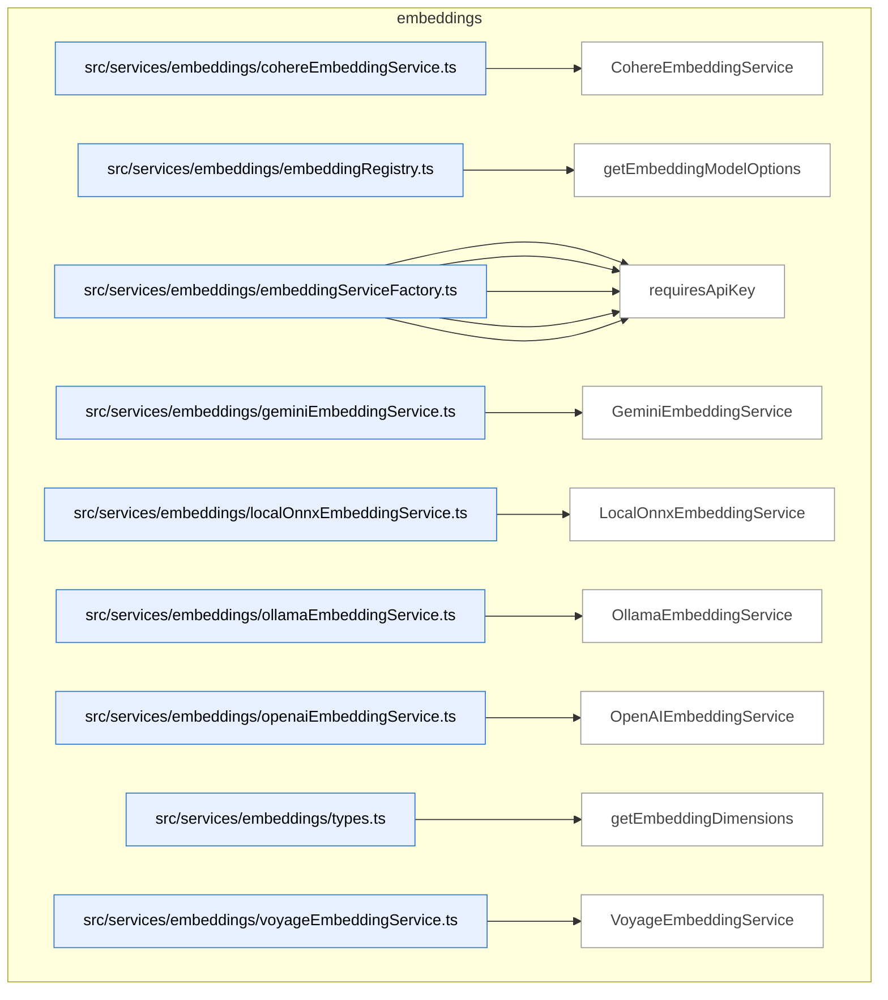
```mermaid
flowchart TB
subgraph dom_embeddings ["embeddings"]
  file_src_services_embeddings_cohereEmbeddingS["src/services/embeddings/cohereEmbeddingService.ts"]:::component
  sym_src_services_embeddings_cohereEmbeddingS["CohereEmbeddingService"]:::symbol
  file_src_services_embeddings_cohereEmbeddingS --> sym_src_services_embeddings_cohereEmbeddingS
  file_src_services_embeddings_embeddingRegistr["src/services/embeddings/embeddingRegistry.ts"]:::component
  sym_src_services_embeddings_embeddingRegistr["getEmbeddingModelOptions"]:::symbol
  file_src_services_embeddings_embeddingRegistr --> sym_src_services_embeddings_embeddingRegistr
  file_src_services_embeddings_embeddingService["src/services/embeddings/embeddingServiceFactory.ts"]:::component
  sym_src_services_embeddings_embeddingService["createEmbeddingService"]:::symbol
  file_src_services_embeddings_embeddingService --> sym_src_services_embeddings_embeddingService
  sym_src_services_embeddings_embeddingService["createEmbeddingServiceFromSettings"]:::symbol
  file_src_services_embeddings_embeddingService --> sym_src_services_embeddings_embeddingService
  sym_src_services_embeddings_embeddingService["getAvailableEmbeddingModels"]:::symbol
  file_src_services_embeddings_embeddingService --> sym_src_services_embeddings_embeddingService
  sym_src_services_embeddings_embeddingService["getDefaultEmbeddingModel"]:::symbol
  file_src_services_embeddings_embeddingService --> sym_src_services_embeddings_embeddingService
  sym_src_services_embeddings_embeddingService["requiresApiKey"]:::symbol
  file_src_services_embeddings_embeddingService --> sym_src_services_embeddings_embeddingService
  file_src_services_embeddings_geminiEmbeddingS["src/services/embeddings/geminiEmbeddingService.ts"]:::component
  sym_src_services_embeddings_geminiEmbeddingS["GeminiEmbeddingService"]:::symbol
  file_src_services_embeddings_geminiEmbeddingS --> sym_src_services_embeddings_geminiEmbeddingS
  file_src_services_embeddings_localOnnxEmbeddi["src/services/embeddings/localOnnxEmbeddingService.ts"]:::component
  sym_src_services_embeddings_localOnnxEmbeddi["LocalOnnxEmbeddingService"]:::symbol
  file_src_services_embeddings_localOnnxEmbeddi --> sym_src_services_embeddings_localOnnxEmbeddi
  file_src_services_embeddings_ollamaEmbeddingS["src/services/embeddings/ollamaEmbeddingService.ts"]:::component
  sym_src_services_embeddings_ollamaEmbeddingS["OllamaEmbeddingService"]:::symbol
  file_src_services_embeddings_ollamaEmbeddingS --> sym_src_services_embeddings_ollamaEmbeddingS
  file_src_services_embeddings_openaiEmbeddingS["src/services/embeddings/openaiEmbeddingService.ts"]:::component
  sym_src_services_embeddings_openaiEmbeddingS["OpenAIEmbeddingService"]:::symbol
  file_src_services_embeddings_openaiEmbeddingS --> sym_src_services_embeddings_openaiEmbeddingS
  file_src_services_embeddings_types_ts["src/services/embeddings/types.ts"]:::component
  sym_src_services_embeddings_types_ts_getEmbe["getEmbeddingDimensions"]:::symbol
  file_src_services_embeddings_types_ts --> sym_src_services_embeddings_types_ts_getEmbe
  file_src_services_embeddings_voyageEmbeddingS["src/services/embeddings/voyageEmbeddingService.ts"]:::component
  sym_src_services_embeddings_voyageEmbeddingS["VoyageEmbeddingService"]:::symbol
  file_src_services_embeddings_voyageEmbeddingS --> sym_src_services_embeddings_voyageEmbeddingS
end
classDef container fill:#f5f5f5,stroke:#333,stroke-width:2px,color:#000
classDef component fill:#e8f0ff,stroke:#3178c6,color:#000
classDef symbol fill:#fff,stroke:#999,color:#444
classDef dup fill:#ffe8d8,stroke:#c0392b,stroke-width:2px,color:#000
classDef violation fill:#ffd6d6,stroke:#c0392b,stroke-width:2px,color:#000
```

### Symbols in this domain

| Symbol | Kind | Path | Lines | Purpose |
|---|---|---|---|---|
| [`CohereEmbeddingService`](../src/services/embeddings/cohereEmbeddingService.ts#L36) | class | `src/services/embeddings/cohereEmbeddingService.ts` | 36-193 | <no body> |
| [`getEmbeddingModelOptions`](../src/services/embeddings/embeddingRegistry.ts#L75) | function | `src/services/embeddings/embeddingRegistry.ts` | 75-121 | Returns a map of embedding model identifiers to user-friendly labels with recommendations for a given provider. |
| [`createEmbeddingService`](../src/services/embeddings/embeddingServiceFactory.ts#L22) | function | `src/services/embeddings/embeddingServiceFactory.ts` | 22-86 | Creates and returns an embedding service instance of the appropriate type based on the provider in config. |
| [`createEmbeddingServiceFromSettings`](../src/services/embeddings/embeddingServiceFactory.ts#L95) | function | `src/services/embeddings/embeddingServiceFactory.ts` | 95-135 | Creates an embedding service from plugin settings, falling back to local-ONNX if an API key is missing but required. |
| [`getAvailableEmbeddingModels`](../src/services/embeddings/embeddingServiceFactory.ts#L147) | function | `src/services/embeddings/embeddingServiceFactory.ts` | 147-149 | Returns embedding models for the given provider, defaulting to OpenAI. |
| [`getDefaultEmbeddingModel`](../src/services/embeddings/embeddingServiceFactory.ts#L140) | function | `src/services/embeddings/embeddingServiceFactory.ts` | 140-142 | Returns the default embedding model identifier for a given provider. |
| [`requiresApiKey`](../src/services/embeddings/embeddingServiceFactory.ts#L154) | function | `src/services/embeddings/embeddingServiceFactory.ts` | 154-156 | Checks whether an embedding provider requires an API key (false for local-only providers). |
| [`GeminiEmbeddingService`](../src/services/embeddings/geminiEmbeddingService.ts#L34) | class | `src/services/embeddings/geminiEmbeddingService.ts` | 34-179 | Generates embeddings using Google's Gemini API with configurable model and dimensions. |
| [`LocalOnnxEmbeddingService`](../src/services/embeddings/localOnnxEmbeddingService.ts#L11) | class | `src/services/embeddings/localOnnxEmbeddingService.ts` | 11-85 | Generates embeddings locally using ONNX transformers in the browser without external API calls. |
| [`OllamaEmbeddingService`](../src/services/embeddings/ollamaEmbeddingService.ts#L28) | class | `src/services/embeddings/ollamaEmbeddingService.ts` | 28-233 | Generates embeddings by sending text to a local Ollama server instance. |
| [`OpenAIEmbeddingService`](../src/services/embeddings/openaiEmbeddingService.ts#L29) | class | `src/services/embeddings/openaiEmbeddingService.ts` | 29-211 | Generates embeddings via OpenAI API with text truncation to stay within token limits. |
| [`getEmbeddingDimensions`](../src/services/embeddings/types.ts#L123) | function | `src/services/embeddings/types.ts` | 123-125 | Returns the embedding vector dimension size for a given model name. |
| [`VoyageEmbeddingService`](../src/services/embeddings/voyageEmbeddingService.ts#L39) | class | `src/services/embeddings/voyageEmbeddingService.ts` | 39-195 | Generates embeddings using Voyage AI's API with document-type input. |

---

## export

> The `export` domain converts multiple notes into formatted documents (PDF, DOCX, PPTX) by parsing markdown, styling content with configurable themes, and handling document-specific formatting like tables and slides.

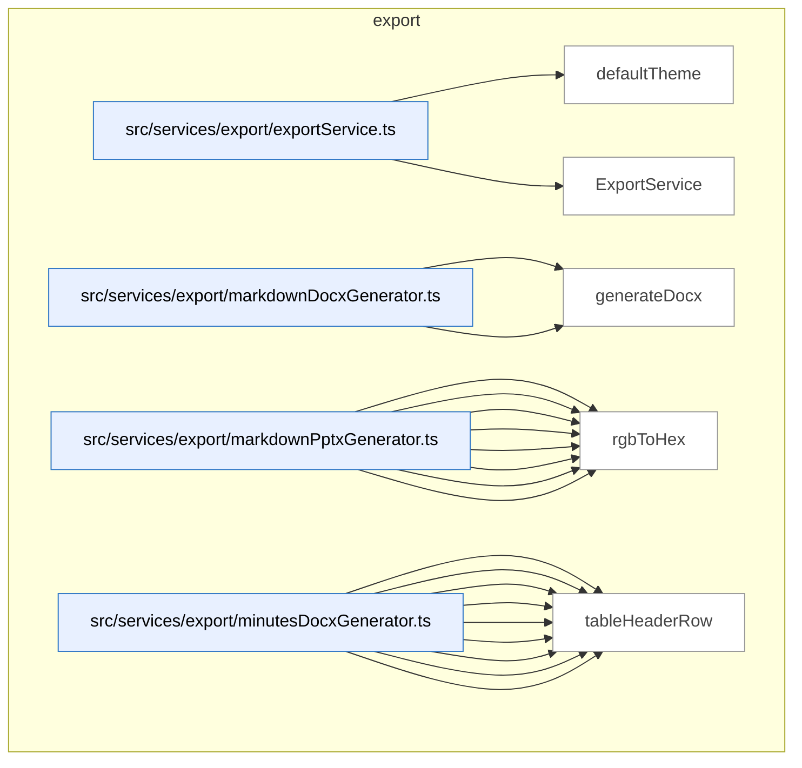
```mermaid
flowchart TB
subgraph dom_export ["export"]
  file_src_services_export_exportService_ts["src/services/export/exportService.ts"]:::component
  sym_src_services_export_exportService_ts_def["defaultTheme"]:::symbol
  file_src_services_export_exportService_ts --> sym_src_services_export_exportService_ts_def
  sym_src_services_export_exportService_ts_Exp["ExportService"]:::symbol
  file_src_services_export_exportService_ts --> sym_src_services_export_exportService_ts_Exp
  file_src_services_export_markdownDocxGenerato["src/services/export/markdownDocxGenerator.ts"]:::component
  sym_src_services_export_markdownDocxGenerato["buildDocxTable"]:::symbol
  file_src_services_export_markdownDocxGenerato --> sym_src_services_export_markdownDocxGenerato
  sym_src_services_export_markdownDocxGenerato["generateDocx"]:::symbol
  file_src_services_export_markdownDocxGenerato --> sym_src_services_export_markdownDocxGenerato
  file_src_services_export_markdownPptxGenerato["src/services/export/markdownPptxGenerator.ts"]:::component
  sym_src_services_export_markdownPptxGenerato["darkenHex"]:::symbol
  file_src_services_export_markdownPptxGenerato --> sym_src_services_export_markdownPptxGenerato
  sym_src_services_export_markdownPptxGenerato["generatePptx"]:::symbol
  file_src_services_export_markdownPptxGenerato --> sym_src_services_export_markdownPptxGenerato
  sym_src_services_export_markdownPptxGenerato["generatePptxFromDeck"]:::symbol
  file_src_services_export_markdownPptxGenerato --> sym_src_services_export_markdownPptxGenerato
  sym_src_services_export_markdownPptxGenerato["generatePptxFromHtml"]:::symbol
  file_src_services_export_markdownPptxGenerato --> sym_src_services_export_markdownPptxGenerato
  sym_src_services_export_markdownPptxGenerato["hexToRgb"]:::symbol
  file_src_services_export_markdownPptxGenerato --> sym_src_services_export_markdownPptxGenerato
  sym_src_services_export_markdownPptxGenerato["lightenHex"]:::symbol
  file_src_services_export_markdownPptxGenerato --> sym_src_services_export_markdownPptxGenerato
  sym_src_services_export_markdownPptxGenerato["resolveTheme"]:::symbol
  file_src_services_export_markdownPptxGenerato --> sym_src_services_export_markdownPptxGenerato
  sym_src_services_export_markdownPptxGenerato["rgbToHex"]:::symbol
  file_src_services_export_markdownPptxGenerato --> sym_src_services_export_markdownPptxGenerato
  file_src_services_export_minutesDocxGenerator["src/services/export/minutesDocxGenerator.ts"]:::component
  sym_src_services_export_minutesDocxGenerator["boldLabel"]:::symbol
  file_src_services_export_minutesDocxGenerator --> sym_src_services_export_minutesDocxGenerator
  sym_src_services_export_minutesDocxGenerator["deepStripConfidence"]:::symbol
  file_src_services_export_minutesDocxGenerator --> sym_src_services_export_minutesDocxGenerator
  sym_src_services_export_minutesDocxGenerator["extractMinutesJsonFromNote"]:::symbol
  file_src_services_export_minutesDocxGenerator --> sym_src_services_export_minutesDocxGenerator
  sym_src_services_export_minutesDocxGenerator["generateMinutesDocx"]:::symbol
  file_src_services_export_minutesDocxGenerator --> sym_src_services_export_minutesDocxGenerator
  sym_src_services_export_minutesDocxGenerator["heading2"]:::symbol
  file_src_services_export_minutesDocxGenerator --> sym_src_services_export_minutesDocxGenerator
  sym_src_services_export_minutesDocxGenerator["renderDocxAgendaGrouped"]:::symbol
  file_src_services_export_minutesDocxGenerator --> sym_src_services_export_minutesDocxGenerator
  sym_src_services_export_minutesDocxGenerator["spacer"]:::symbol
  file_src_services_export_minutesDocxGenerator --> sym_src_services_export_minutesDocxGenerator
  sym_src_services_export_minutesDocxGenerator["tableDataRow"]:::symbol
  file_src_services_export_minutesDocxGenerator --> sym_src_services_export_minutesDocxGenerator
  sym_src_services_export_minutesDocxGenerator["tableHeaderRow"]:::symbol
  file_src_services_export_minutesDocxGenerator --> sym_src_services_export_minutesDocxGenerator
end
classDef container fill:#f5f5f5,stroke:#333,stroke-width:2px,color:#000
classDef component fill:#e8f0ff,stroke:#3178c6,color:#000
classDef symbol fill:#fff,stroke:#999,color:#444
classDef dup fill:#ffe8d8,stroke:#c0392b,stroke-width:2px,color:#000
classDef violation fill:#ffd6d6,stroke:#c0392b,stroke-width:2px,color:#000
```

### Symbols in this domain

| Symbol | Kind | Path | Lines | Purpose |
|---|---|---|---|---|
| [`defaultTheme`](../src/services/export/exportService.ts#L17) | function | `src/services/export/exportService.ts` | 17-19 | Returns a default presentation theme using navy and gold colors. |
| [`ExportService`](../src/services/export/exportService.ts#L52) | class | `src/services/export/exportService.ts` | 52-166 | Exports multiple notes to PDF or DOCX by combining and formatting their content. |
| [`buildDocxTable`](../src/services/export/markdownDocxGenerator.ts#L165) | function | `src/services/export/markdownDocxGenerator.ts` | 165-194 | Converts a markdown table to a formatted DOCX table with styled header row. |
| [`generateDocx`](../src/services/export/markdownDocxGenerator.ts#L21) | function | `src/services/export/markdownDocxGenerator.ts` | 21-163 | Generates a DOCX document from markdown with headings, tables, and optional table of contents. |
| [`darkenHex`](../src/services/export/markdownPptxGenerator.ts#L42) | function | `src/services/export/markdownPptxGenerator.ts` | 42-45 | Darkens a hex color by reducing RGB intensity. |
| [`generatePptx`](../src/services/export/markdownPptxGenerator.ts#L100) | function | `src/services/export/markdownPptxGenerator.ts` | 100-279 | Generates a PPTX presentation from markdown by splitting on headings and embedding tables. |
| [`generatePptxFromDeck`](../src/services/export/markdownPptxGenerator.ts#L288) | function | `src/services/export/markdownPptxGenerator.ts` | 288-411 | Generates a PPTX from a structured deck model with section dividers, title slides, and content slides. |
| [`generatePptxFromHtml`](../src/services/export/markdownPptxGenerator.ts#L425) | function | `src/services/export/markdownPptxGenerator.ts` | 425-435 | Generates a PPTX from HTML by parsing rich slides and rendering them. |
| [`hexToRgb`](../src/services/export/markdownPptxGenerator.ts#L35) | function | `src/services/export/markdownPptxGenerator.ts` | 35-38 | Converts a hex color string to an RGB array. |
| [`lightenHex`](../src/services/export/markdownPptxGenerator.ts#L46) | function | `src/services/export/markdownPptxGenerator.ts` | 46-49 | Lightens a hex color by increasing RGB intensity toward white. |
| [`resolveTheme`](../src/services/export/markdownPptxGenerator.ts#L52) | function | `src/services/export/markdownPptxGenerator.ts` | 52-72 | Resolves a theme name or custom colors into a complete theme object with typography. |
| [`rgbToHex`](../src/services/export/markdownPptxGenerator.ts#L39) | function | `src/services/export/markdownPptxGenerator.ts` | 39-41 | Converts RGB values to a hex color string with bounds checking. |
| [`boldLabel`](../src/services/export/minutesDocxGenerator.ts#L583) | function | `src/services/export/minutesDocxGenerator.ts` | 583-589 | Creates a bold label paragraph. |
| [`deepStripConfidence`](../src/services/export/minutesDocxGenerator.ts#L616) | function | `src/services/export/minutesDocxGenerator.ts` | 616-636 | Recursively removes confidence annotations from all string values in a nested JSON object. |
| [`extractMinutesJsonFromNote`](../src/services/export/minutesDocxGenerator.ts#L554) | function | `src/services/export/minutesDocxGenerator.ts` | 554-568 | Extracts embedded minutes JSON from a markdown note comment block. |
| [`generateMinutesDocx`](../src/services/export/minutesDocxGenerator.ts#L31) | function | `src/services/export/minutesDocxGenerator.ts` | 31-389 | Generates a DOCX document from meeting minutes JSON with metadata, agenda, decisions, and actions. |
| [`heading2`](../src/services/export/minutesDocxGenerator.ts#L574) | function | `src/services/export/minutesDocxGenerator.ts` | 574-581 | Creates a styled heading-2 paragraph. |
| [`renderDocxAgendaGrouped`](../src/services/export/minutesDocxGenerator.ts#L393) | function | `src/services/export/minutesDocxGenerator.ts` | 393-546 | Renders agenda items grouped by discussion points, decisions, and actions in the minutes document. |
| [`spacer`](../src/services/export/minutesDocxGenerator.ts#L570) | function | `src/services/export/minutesDocxGenerator.ts` | 570-572 | Creates a blank spacing paragraph for layout in DOCX. |
| [`tableDataRow`](../src/services/export/minutesDocxGenerator.ts#L604) | function | `src/services/export/minutesDocxGenerator.ts` | 604-613 | Creates a table data row with plain text cells. |
| [`tableHeaderRow`](../src/services/export/minutesDocxGenerator.ts#L591) | function | `src/services/export/minutesDocxGenerator.ts` | 591-602 | Creates a table header row with shaded background. |

---

## i18n

> The `i18n` domain provides language support by retrieving translations for specific languages, listing available languages, and validating language codes against supported options.

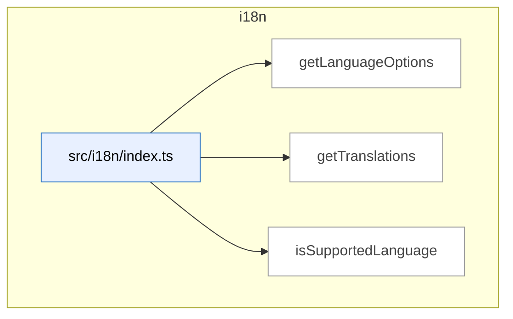
```mermaid
flowchart TB
subgraph dom_i18n ["i18n"]
  file_src_i18n_index_ts["src/i18n/index.ts"]:::component
  sym_src_i18n_index_ts_getLanguageOptions["getLanguageOptions"]:::symbol
  file_src_i18n_index_ts --> sym_src_i18n_index_ts_getLanguageOptions
  sym_src_i18n_index_ts_getTranslations["getTranslations"]:::symbol
  file_src_i18n_index_ts --> sym_src_i18n_index_ts_getTranslations
  sym_src_i18n_index_ts_isSupportedLanguage["isSupportedLanguage"]:::symbol
  file_src_i18n_index_ts --> sym_src_i18n_index_ts_isSupportedLanguage
end
classDef container fill:#f5f5f5,stroke:#333,stroke-width:2px,color:#000
classDef component fill:#e8f0ff,stroke:#3178c6,color:#000
classDef symbol fill:#fff,stroke:#999,color:#444
classDef dup fill:#ffe8d8,stroke:#c0392b,stroke-width:2px,color:#000
classDef violation fill:#ffd6d6,stroke:#c0392b,stroke-width:2px,color:#000
```

### Symbols in this domain

| Symbol | Kind | Path | Lines | Purpose |
|---|---|---|---|---|
| [`getLanguageOptions`](../src/i18n/index.ts#L38) | function | `src/i18n/index.ts` | 38-43 | Returns object mapping language codes to display names for all supported languages. |
| [`getTranslations`](../src/i18n/index.ts#L30) | function | `src/i18n/index.ts` | 30-32 | Returns translations object for given language code, defaulting to English if unsupported. |
| [`isSupportedLanguage`](../src/i18n/index.ts#L50) | function | `src/i18n/index.ts` | 50-52 | Checks whether provided language code is supported by translation system. |

---

## kindle

> The `kindle` domain handles authentication and session management for Kindle, including multiple methods to capture Amazon session cookies (bookmarklet, console, embedded) and utilities to validate, construct requests with, and detect expiration of those credentials.

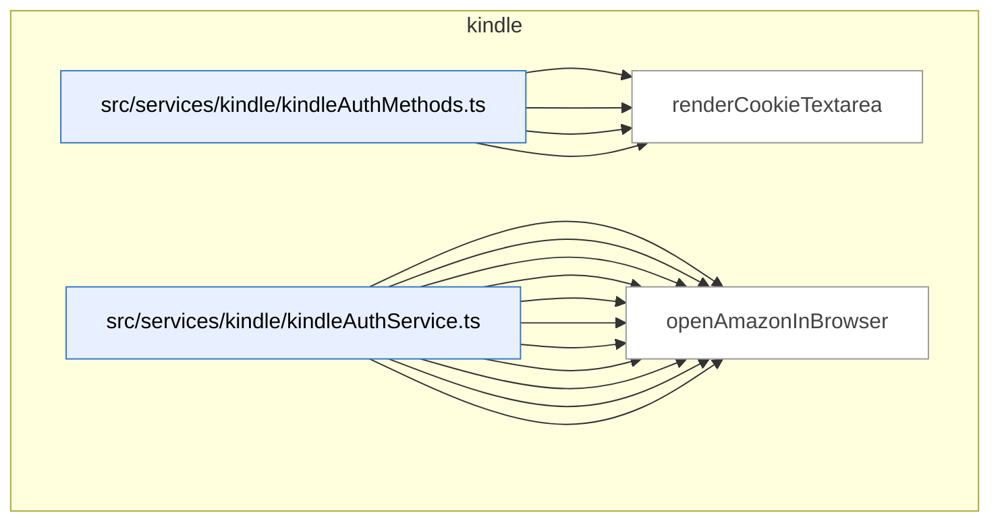
```mermaid
flowchart TB
subgraph dom_kindle ["kindle"]
  file_src_services_kindle_kindleAuthMethods_ts["src/services/kindle/kindleAuthMethods.ts"]:::component
  sym_src_services_kindle_kindleAuthMethods_ts["BookmarkletAuthMethod"]:::symbol
  file_src_services_kindle_kindleAuthMethods_ts --> sym_src_services_kindle_kindleAuthMethods_ts
  sym_src_services_kindle_kindleAuthMethods_ts["buildAuthMethodChain"]:::symbol
  file_src_services_kindle_kindleAuthMethods_ts --> sym_src_services_kindle_kindleAuthMethods_ts
  sym_src_services_kindle_kindleAuthMethods_ts["ConsoleAuthMethod"]:::symbol
  file_src_services_kindle_kindleAuthMethods_ts --> sym_src_services_kindle_kindleAuthMethods_ts
  sym_src_services_kindle_kindleAuthMethods_ts["renderCookieTextarea"]:::symbol
  file_src_services_kindle_kindleAuthMethods_ts --> sym_src_services_kindle_kindleAuthMethods_ts
  file_src_services_kindle_kindleAuthService_ts["src/services/kindle/kindleAuthService.ts"]:::component
  sym_src_services_kindle_kindleAuthService_ts["buildRequestHeaders"]:::symbol
  file_src_services_kindle_kindleAuthService_ts --> sym_src_services_kindle_kindleAuthService_ts
  sym_src_services_kindle_kindleAuthService_ts["clearCookies"]:::symbol
  file_src_services_kindle_kindleAuthService_ts --> sym_src_services_kindle_kindleAuthService_ts
  sym_src_services_kindle_kindleAuthService_ts["detectAuthExpiry"]:::symbol
  file_src_services_kindle_kindleAuthService_ts --> sym_src_services_kindle_kindleAuthService_ts
  sym_src_services_kindle_kindleAuthService_ts["getCookieAgeDays"]:::symbol
  file_src_services_kindle_kindleAuthService_ts --> sym_src_services_kindle_kindleAuthService_ts
  sym_src_services_kindle_kindleAuthService_ts["getNotebookUrl"]:::symbol
  file_src_services_kindle_kindleAuthService_ts --> sym_src_services_kindle_kindleAuthService_ts
  sym_src_services_kindle_kindleAuthService_ts["getStoredAmazonEmail"]:::symbol
  file_src_services_kindle_kindleAuthService_ts --> sym_src_services_kindle_kindleAuthService_ts
  sym_src_services_kindle_kindleAuthService_ts["getStoredAmazonPassword"]:::symbol
  file_src_services_kindle_kindleAuthService_ts --> sym_src_services_kindle_kindleAuthService_ts
  sym_src_services_kindle_kindleAuthService_ts["getStoredCookies"]:::symbol
  file_src_services_kindle_kindleAuthService_ts --> sym_src_services_kindle_kindleAuthService_ts
  sym_src_services_kindle_kindleAuthService_ts["isAuthenticated"]:::symbol
  file_src_services_kindle_kindleAuthService_ts --> sym_src_services_kindle_kindleAuthService_ts
  sym_src_services_kindle_kindleAuthService_ts["isEnhancedPayload"]:::symbol
  file_src_services_kindle_kindleAuthService_ts --> sym_src_services_kindle_kindleAuthService_ts
  sym_src_services_kindle_kindleAuthService_ts["openAmazonInBrowser"]:::symbol
  file_src_services_kindle_kindleAuthService_ts --> sym_src_services_kindle_kindleAuthService_ts
end
classDef container fill:#f5f5f5,stroke:#333,stroke-width:2px,color:#000
classDef component fill:#e8f0ff,stroke:#3178c6,color:#000
classDef symbol fill:#fff,stroke:#999,color:#444
classDef dup fill:#ffe8d8,stroke:#c0392b,stroke-width:2px,color:#000
classDef violation fill:#ffd6d6,stroke:#c0392b,stroke-width:2px,color:#000
```

_Domain has 102 symbols (>50). Diagram shows top-15 by file order; see flat table below for the full list._

### Symbols in this domain

| Symbol | Kind | Path | Lines | Purpose |
|---|---|---|---|---|
| [`BookmarkletAuthMethod`](../src/services/kindle/kindleAuthMethods.ts#L109) | class | `src/services/kindle/kindleAuthMethods.ts` | 109-179 | Provides a bookmarklet-based method to manually capture Kindle session cookies. |
| [`buildAuthMethodChain`](../src/services/kindle/kindleAuthMethods.ts#L247) | function | `src/services/kindle/kindleAuthMethods.ts` | 247-264 | Builds an authentication method chain for Kindle, including embedded, bookmarklet, and console options. |
| [`ConsoleAuthMethod`](../src/services/kindle/kindleAuthMethods.ts#L185) | class | `src/services/kindle/kindleAuthMethods.ts` | 185-235 | Provides a browser console–based method to manually extract and paste Kindle session cookies. |
| [`renderCookieTextarea`](../src/services/kindle/kindleAuthMethods.ts#L56) | function | `src/services/kindle/kindleAuthMethods.ts` | 56-103 | Renders an interactive textarea for pasting Kindle cookies with real-time validation feedback. |
| [`buildRequestHeaders`](../src/services/kindle/kindleAuthService.ts#L59) | function | `src/services/kindle/kindleAuthService.ts` | 59-70 | Builds HTTP headers for Kindle requests including cookies and user agent. |
| [`clearCookies`](../src/services/kindle/kindleAuthService.ts#L186) | function | `src/services/kindle/kindleAuthService.ts` | 186-188 | Deletes stored Kindle cookies from secret storage. |
| [`detectAuthExpiry`](../src/services/kindle/kindleAuthService.ts#L108) | function | `src/services/kindle/kindleAuthService.ts` | 108-132 | Detects whether an HTML response indicates expired or missing authentication. |
| [`getCookieAgeDays`](../src/services/kindle/kindleAuthService.ts#L292) | function | `src/services/kindle/kindleAuthService.ts` | 292-296 | Calculates the age in days of stored cookies from their capture timestamp. |
| [`getNotebookUrl`](../src/services/kindle/kindleAuthService.ts#L51) | function | `src/services/kindle/kindleAuthService.ts` | 51-54 | Constructs the notebook URL for a given Amazon region. |
| [`getStoredAmazonEmail`](../src/services/kindle/kindleAuthService.ts#L197) | function | `src/services/kindle/kindleAuthService.ts` | 197-199 | Retrieves the stored Amazon email address. |
| [`getStoredAmazonPassword`](../src/services/kindle/kindleAuthService.ts#L204) | function | `src/services/kindle/kindleAuthService.ts` | 204-206 | Retrieves the stored Amazon password. |
| [`getStoredCookies`](../src/services/kindle/kindleAuthService.ts#L163) | function | `src/services/kindle/kindleAuthService.ts` | 163-171 | Retrieves and parses stored Kindle cookies from secret storage. |
| [`isAuthenticated`](../src/services/kindle/kindleAuthService.ts#L154) | function | `src/services/kindle/kindleAuthService.ts` | 154-158 | Checks if stored cookies exist and match the configured Amazon region. |
| [`isEnhancedPayload`](../src/services/kindle/kindleAuthService.ts#L401) | function | `src/services/kindle/kindleAuthService.ts` | 401-403 | Checks if input is an enhanced JSON payload by looking for opening brace. |
| [`openAmazonInBrowser`](../src/services/kindle/kindleAuthService.ts#L142) | function | `src/services/kindle/kindleAuthService.ts` | 142-145 | Opens the Kindle notebook in the system browser for a given region. |
| [`parseEnhancedPayload`](../src/services/kindle/kindleAuthService.ts#L365) | function | `src/services/kindle/kindleAuthService.ts` | 365-395 | Extracts cookies and scraped books from an enhanced JSON payload format. |
| [`parseManualCookies`](../src/services/kindle/kindleAuthService.ts#L308) | function | `src/services/kindle/kindleAuthService.ts` | 308-340 | Parses a semicolon-separated cookie string into structured CDP cookie objects. |
| [`storeAmazonEmail`](../src/services/kindle/kindleAuthService.ts#L211) | function | `src/services/kindle/kindleAuthService.ts` | 211-217 | Saves or clears the Amazon email based on whether it's non-empty. |
| [`storeAmazonPassword`](../src/services/kindle/kindleAuthService.ts#L222) | function | `src/services/kindle/kindleAuthService.ts` | 222-228 | Saves or clears the Amazon password based on whether it's provided. |
| [`storeCookies`](../src/services/kindle/kindleAuthService.ts#L176) | function | `src/services/kindle/kindleAuthService.ts` | 176-181 | Stores serialized Kindle cookies to secret storage. |
| [`validateCookieFormat`](../src/services/kindle/kindleAuthService.ts#L252) | function | `src/services/kindle/kindleAuthService.ts` | 252-287 | Validates a cookie string by checking for required session-id and ubid cookies. |
| [`validateCookies`](../src/services/kindle/kindleAuthService.ts#L80) | function | `src/services/kindle/kindleAuthService.ts` | 80-95 | Validates session cookies by attempting to fetch the Kindle notebook page. |
| [`buildExtractionScript`](../src/services/kindle/kindleBookmarklet.ts#L29) | function | `src/services/kindle/kindleBookmarklet.ts` | 29-75 | Generates a minified bookmarklet script that extracts books from Amazon's notebook page. |
| [`generateConsoleScript`](../src/services/kindle/kindleBookmarklet.ts#L94) | function | `src/services/kindle/kindleBookmarklet.ts` | 94-96 | Returns the extraction script for use in browser console/DevTools. |
| [`generateCookieBookmarklet`](../src/services/kindle/kindleBookmarklet.ts#L86) | function | `src/services/kindle/kindleBookmarklet.ts` | 86-88 | Encodes the extraction script as a JavaScript bookmarklet URL. |
| [`attachNoteToHighlight`](../src/services/kindle/kindleClippingsParser.ts#L245) | function | `src/services/kindle/kindleClippingsParser.ts` | 245-264 | Attaches a note entry to a highlight at matching location or page number. |
| [`groupEntriesByBook`](../src/services/kindle/kindleClippingsParser.ts#L143) | function | `src/services/kindle/kindleClippingsParser.ts` | 143-227 | Groups parsed clipping entries by book and deduplicates highlights by content. |
| [`isLaterDate`](../src/services/kindle/kindleClippingsParser.ts#L237) | function | `src/services/kindle/kindleClippingsParser.ts` | 237-243 | Compares two date strings to determine which is chronologically later. |
| [`parseClippings`](../src/services/kindle/kindleClippingsParser.ts#L51) | function | `src/services/kindle/kindleClippingsParser.ts` | 51-62 | Parses Kindle clippings file content into grouped book entries with highlights. |
| [`parseEntry`](../src/services/kindle/kindleClippingsParser.ts#L81) | function | `src/services/kindle/kindleClippingsParser.ts` | 81-136 | Parses a single clippings entry into its title, metadata, and content components. |
| [`splitIntoEntries`](../src/services/kindle/kindleClippingsParser.ts#L67) | function | `src/services/kindle/kindleClippingsParser.ts` | 67-75 | Splits clippings content into individual entries using the standard delimiter. |
| [`booksFromSnapshot`](../src/services/kindle/kindleEmbeddedAuth.ts#L202) | function | `src/services/kindle/kindleEmbeddedAuth.ts` | 202-205 | Extracts books from snapshot, preferring DOM extraction over HTML parsing. |
| [`EmbeddedAuthMethod`](../src/services/kindle/kindleEmbeddedAuth.ts#L428) | class | `src/services/kindle/kindleEmbeddedAuth.ts` | 428-455 | AuthMethod class implementing browser-based sign-in for desktop Obsidian. |
| [`expandAllHighlights`](../src/services/kindle/kindleEmbeddedAuth.ts#L919) | function | `src/services/kindle/kindleEmbeddedAuth.ts` | 919-1002 | Expands all collapsible highlight containers and polls until stable. |
| [`fetchHighlightsEmbedded`](../src/services/kindle/kindleEmbeddedAuth.ts#L1013) | function | `src/services/kindle/kindleEmbeddedAuth.ts` | 1013-1097 | Fetches highlights for multiple books by navigating to each book's page in a hidden window. |
| [`harvestBooksFromDom`](../src/services/kindle/kindleEmbeddedAuth.ts#L212) | function | `src/services/kindle/kindleEmbeddedAuth.ts` | 212-415 | Harvests books from the DOM with polling to detect when rendering completes. |
| [`isEmbeddedAvailable`](../src/services/kindle/kindleEmbeddedAuth.ts#L801) | function | `src/services/kindle/kindleEmbeddedAuth.ts` | 801-808 | Checks if embedded login is available on the current platform. |
| [`isPostLoginUrl`](../src/services/kindle/kindleEmbeddedAuth.ts#L420) | function | `src/services/kindle/kindleEmbeddedAuth.ts` | 420-426 | Checks if a URL indicates the user successfully reached the Kindle notebook page. |
| [`loadPageSnapshot`](../src/services/kindle/kindleEmbeddedAuth.ts#L696) | function | `src/services/kindle/kindleEmbeddedAuth.ts` | 696-771 | Loads and snapshots a Kindle page, extracting DOM books and HTML content. |
| [`mergeBookLists`](../src/services/kindle/kindleEmbeddedAuth.ts#L176) | function | `src/services/kindle/kindleEmbeddedAuth.ts` | 176-200 | Merges multiple book lists into one, keeping highest highlight counts per ASIN. |
| [`navigateAndWait`](../src/services/kindle/kindleEmbeddedAuth.ts#L813) | function | `src/services/kindle/kindleEmbeddedAuth.ts` | 813-826 | Navigates a window to a URL and resolves when page loading completes. |
| [`performEmbeddedLogin`](../src/services/kindle/kindleEmbeddedAuth.ts#L465) | function | `src/services/kindle/kindleEmbeddedAuth.ts` | 465-654 | Opens a BrowserWindow for Amazon login and waits for successful authentication. |
| [`requireElectronRemote`](../src/services/kindle/kindleEmbeddedAuth.ts#L71) | function | `src/services/kindle/kindleEmbeddedAuth.ts` | 71-73 | Requires and returns the Electron remote module for IPC calls. |
| [`scrapeBookListHidden`](../src/services/kindle/kindleEmbeddedAuth.ts#L666) | function | `src/services/kindle/kindleEmbeddedAuth.ts` | 666-687 | Scrapes the book list from the notebook with retry logic for low result counts. |
| [`waitForHighlightRender`](../src/services/kindle/kindleEmbeddedAuth.ts#L832) | function | `src/services/kindle/kindleEmbeddedAuth.ts` | 832-913 | Executes browser script to wait for highlights to render on a book page. |
| [`waitForLibraryRender`](../src/services/kindle/kindleEmbeddedAuth.ts#L122) | function | `src/services/kindle/kindleEmbeddedAuth.ts` | 122-174 | Executes browser script to wait for Amazon's library to finish rendering books. |
| [`appendHighlightsToExisting`](../src/services/kindle/kindleNoteBuilder.ts#L222) | function | `src/services/kindle/kindleNoteBuilder.ts` | 222-244 | Appends new highlights to existing note content before or after sections. |
| [`buildBookNote`](../src/services/kindle/kindleNoteBuilder.ts#L21) | function | `src/services/kindle/kindleNoteBuilder.ts` | 21-61 | Builds a complete Markdown note for a book with highlights and metadata. |
| [`buildFrontmatter`](../src/services/kindle/kindleNoteBuilder.ts#L66) | function | `src/services/kindle/kindleNoteBuilder.ts` | 66-94 | Generates YAML frontmatter with book metadata for the note. |
| [`capitalize`](../src/services/kindle/kindleNoteBuilder.ts#L282) | function | `src/services/kindle/kindleNoteBuilder.ts` | 282-284 | Capitalizes the first character of a string. |
| [`formatBlockquote`](../src/services/kindle/kindleNoteBuilder.ts#L172) | function | `src/services/kindle/kindleNoteBuilder.ts` | 172-182 | Renders highlight as Markdown blockquote with optional location and note. |
| [`formatBullet`](../src/services/kindle/kindleNoteBuilder.ts#L200) | function | `src/services/kindle/kindleNoteBuilder.ts` | 200-207 | Renders highlight as a bullet point with optional location and note. |
| [`formatCallout`](../src/services/kindle/kindleNoteBuilder.ts#L187) | function | `src/services/kindle/kindleNoteBuilder.ts` | 187-195 | Renders highlight as an Obsidian callout block with optional note. |
| [`formatHighlight`](../src/services/kindle/kindleNoteBuilder.ts#L99) | function | `src/services/kindle/kindleNoteBuilder.ts` | 99-117 | Formats a single highlight according to specified style (blockquote, callout, or bullet). |
| [`formatHighlightList`](../src/services/kindle/kindleNoteBuilder.ts#L122) | function | `src/services/kindle/kindleNoteBuilder.ts` | 122-127 | Formats a list of highlights into joined Markdown text. |
| [`formatHighlightsGroupedByColor`](../src/services/kindle/kindleNoteBuilder.ts#L132) | function | `src/services/kindle/kindleNoteBuilder.ts` | 132-157 | Groups highlights by color and renders each group as a separate section. |
| [`formatLocation`](../src/services/kindle/kindleNoteBuilder.ts#L162) | function | `src/services/kindle/kindleNoteBuilder.ts` | 162-167 | Formats location reference from page and/or location numbers. |
| [`formatNote`](../src/services/kindle/kindleNoteBuilder.ts#L212) | function | `src/services/kindle/kindleNoteBuilder.ts` | 212-216 | Renders a standalone note as an Obsidian note callout. |
| [`updateFrontmatterInContent`](../src/services/kindle/kindleNoteBuilder.ts#L250) | function | `src/services/kindle/kindleNoteBuilder.ts` | 250-280 | Updates specific frontmatter keys in existing note content. |
| [`appendHighlightCandidate`](../src/services/kindle/kindleScraperService.ts#L763) | function | `src/services/kindle/kindleScraperService.ts` | 763-796 | Validates and deduplicates a highlight candidate, then adds it to the highlights list with a generated ID. |
| [`buildHighlightCandidate`](../src/services/kindle/kindleScraperService.ts#L744) | function | `src/services/kindle/kindleScraperService.ts` | 744-761 | Builds a highlight candidate object with extracted text, note, color, location, page, and source ID. |
| [`buildHighlightsUrl`](../src/services/kindle/kindleScraperService.ts#L511) | function | `src/services/kindle/kindleScraperService.ts` | 511-516 | Constructs a URL for fetching highlights for a specific book ASIN with pagination parameters. |
| [`consumePreScrapedBooks`](../src/services/kindle/kindleScraperService.ts#L53) | function | `src/services/kindle/kindleScraperService.ts` | 53-60 | Returns and clears the cached pre-scraped books, logging how many were consumed. |
| [`extractColor`](../src/services/kindle/kindleScraperService.ts#L711) | function | `src/services/kindle/kindleScraperService.ts` | 711-727 | Determines highlight color (pink, blue, yellow, orange) by matching class names against a pattern. |
| [`extractHighlightCount`](../src/services/kindle/kindleScraperService.ts#L283) | function | `src/services/kindle/kindleScraperService.ts` | 283-340 | Extracts the highlight count from a book element by checking attributes, parsing text patterns in multiple languages, and searching relevant DOM nodes. |
| [`extractHighlightText`](../src/services/kindle/kindleScraperService.ts#L651) | function | `src/services/kindle/kindleScraperService.ts` | 651-668 | Extracts the main highlight quote text from an element, trying explicit text, selector matches, and fallback text content. |
| [`extractLocation`](../src/services/kindle/kindleScraperService.ts#L681) | function | `src/services/kindle/kindleScraperService.ts` | 681-697 | Extracts location metadata from an element using selector queries and text pattern parsing. |
| [`extractNote`](../src/services/kindle/kindleScraperService.ts#L670) | function | `src/services/kindle/kindleScraperService.ts` | 670-679 | Extracts a note from an element by searching known note selectors and stripping "Note:" prefixes. |
| [`extractPage`](../src/services/kindle/kindleScraperService.ts#L699) | function | `src/services/kindle/kindleScraperService.ts` | 699-709 | Extracts page number from an element using selector queries and text pattern parsing. |
| [`fetchAllHighlights`](../src/services/kindle/kindleScraperService.ts#L839) | function | `src/services/kindle/kindleScraperService.ts` | 839-874 | Fetches highlights for multiple books concurrently, reports progress, isolates failures per book, and returns results or stops if auth expires. |
| [`fetchBookList`](../src/services/kindle/kindleScraperService.ts#L96) | function | `src/services/kindle/kindleScraperService.ts` | 96-143 | Iterates through paginated book list pages, deduplicates books by ASIN, and returns all found books or stops early if auth expires. |
| [`fetchHighlightsForBook`](../src/services/kindle/kindleScraperService.ts#L522) | function | `src/services/kindle/kindleScraperService.ts` | 522-569 | Paginates through all highlights for a book, deduplicates by ID and pagination state, and returns highlights or stops if auth expires. |
| [`fetchPageHTML`](../src/services/kindle/kindleScraperService.ts#L69) | function | `src/services/kindle/kindleScraperService.ts` | 69-85 | Fetches HTML from a URL with request headers and detects whether authentication has expired. |
| [`findHighlightContext`](../src/services/kindle/kindleScraperService.ts#L729) | function | `src/services/kindle/kindleScraperService.ts` | 729-742 | Finds the appropriate context element for a highlight by walking up the DOM to row or container elements. |
| [`firstNonEmptyValue`](../src/services/kindle/kindleScraperService.ts#L455) | function | `src/services/kindle/kindleScraperService.ts` | 455-463 | Searches a list of selectors and returns the first non-empty value found in the document. |
| [`normalizeWhitespace`](../src/services/kindle/kindleScraperService.ts#L349) | function | `src/services/kindle/kindleScraperService.ts` | 349-351 | Normalizes whitespace by converting non-breaking spaces to regular spaces and collapsing multiple spaces into one. |
| [`parseBookListHTML`](../src/services/kindle/kindleScraperService.ts#L156) | function | `src/services/kindle/kindleScraperService.ts` | 156-268 | Parses HTML to extract individual book elements using multiple selector strategies and returns structured book data. |
| [`parseHighlightsHTML`](../src/services/kindle/kindleScraperService.ts#L802) | function | `src/services/kindle/kindleScraperService.ts` | 802-833 | Parses highlights from HTML by finding text nodes and extracting associated metadata, with fallback to row containers. |
| [`parseLibraryNextPage`](../src/services/kindle/kindleScraperService.ts#L357) | function | `src/services/kindle/kindleScraperService.ts` | 357-374 | Locates pagination tokens for fetching the next page of books from hidden inputs, links, or data attributes. |
| [`parseLocationFromText`](../src/services/kindle/kindleScraperService.ts#L628) | function | `src/services/kindle/kindleScraperService.ts` | 628-633 | Extracts location information from text using a pattern and normalizes dashes and spaces. |
| [`parseNextPageState`](../src/services/kindle/kindleScraperService.ts#L393) | function | `src/services/kindle/kindleScraperService.ts` | 393-453 | <no body> |
| [`parsePageFromText`](../src/services/kindle/kindleScraperService.ts#L635) | function | `src/services/kindle/kindleScraperService.ts` | 635-649 | Extracts a page number from text using direct and trailing patterns. |
| [`parsePageStateFromUrl`](../src/services/kindle/kindleScraperService.ts#L480) | function | `src/services/kindle/kindleScraperService.ts` | 480-492 | Extracts pagination token and content limit state from a URL's query parameters. |
| [`parsePositiveInt`](../src/services/kindle/kindleScraperService.ts#L342) | function | `src/services/kindle/kindleScraperService.ts` | 342-347 | Extracts the first positive integer from a string value. |
| [`parseStateBlob`](../src/services/kindle/kindleScraperService.ts#L494) | function | `src/services/kindle/kindleScraperService.ts` | 494-506 | Parses a JSON state blob to extract pagination token and content limit state, handling nested structures. |
| [`pickLongestText`](../src/services/kindle/kindleScraperService.ts#L618) | function | `src/services/kindle/kindleScraperService.ts` | 618-626 | Finds the longest text content among multiple elements after normalizing whitespace. |
| [`readElementValue`](../src/services/kindle/kindleScraperService.ts#L465) | function | `src/services/kindle/kindleScraperService.ts` | 465-478 | Reads a value from an element by checking its input value, then data attributes, then text content. |
| [`setPreScrapedBooks`](../src/services/kindle/kindleScraperService.ts#L43) | function | `src/services/kindle/kindleScraperService.ts` | 43-46 | Stores a collection of pre-scraped Kindle books in memory for later retrieval. |
| [`setScraperDebugMode`](../src/services/kindle/kindleScraperService.ts#L25) | function | `src/services/kindle/kindleScraperService.ts` | 25-27 | <no body> |
| [`stripAuthorPrefix`](../src/services/kindle/kindleScraperService.ts#L274) | function | `src/services/kindle/kindleScraperService.ts` | 274-277 | Removes common language-specific author prefixes (by, von, de, etc.) from raw author names. |
| [`buildBookFileName`](../src/services/kindle/kindleSyncService.ts#L33) | function | `src/services/kindle/kindleSyncService.ts` | 33-40 | Generates a safe markdown filename from a book title and author, using "Title - Author.md" format if author is known. |
| [`createOrUpdateBookNote`](../src/services/kindle/kindleSyncService.ts#L166) | function | `src/services/kindle/kindleSyncService.ts` | 166-217 | Creates a new book note or appends highlights to an existing one, updating frontmatter metadata. |
| [`findExistingBookNote`](../src/services/kindle/kindleSyncService.ts#L46) | function | `src/services/kindle/kindleSyncService.ts` | 46-67 | Finds an existing note file for a book by checking current and legacy naming formats. |
| [`getNewHighlights`](../src/services/kindle/kindleSyncService.ts#L150) | function | `src/services/kindle/kindleSyncService.ts` | 150-161 | Filters a book's highlights to return only those not previously imported. |
| [`processAmazonBook`](../src/services/kindle/kindleSyncService.ts#L369) | function | `src/services/kindle/kindleSyncService.ts` | 369-394 | Processes a single scraped book by converting it, filtering new highlights, creating/updating its note, and reporting results. |
| [`syncFromAmazon`](../src/services/kindle/kindleSyncService.ts#L249) | function | `src/services/kindle/kindleSyncService.ts` | 249-364 | <no body> |
| [`syncFromClippings`](../src/services/kindle/kindleSyncService.ts#L72) | function | `src/services/kindle/kindleSyncService.ts` | 72-144 | Syncs new highlights from a user-selected list of books to their note files, tracking import state and reporting results. |
| [`updateSyncState`](../src/services/kindle/kindleSyncService.ts#L223) | function | `src/services/kindle/kindleSyncService.ts` | 223-239 | Updates the sync state to track which highlights have been imported for a book, by title and ASIN. |
| [`generateAmazonHighlightId`](../src/services/kindle/kindleTypes.ts#L214) | function | `src/services/kindle/kindleTypes.ts` | 214-217 | Generates a unique highlight ID by hashing the ASIN, location, and lowercased text. |
| [`generateBookKey`](../src/services/kindle/kindleTypes.ts#L149) | function | `src/services/kindle/kindleTypes.ts` | 149-152 | Generates a unique book key by hashing the normalized title and author combination. |
| [`generateHighlightId`](../src/services/kindle/kindleTypes.ts#L134) | function | `src/services/kindle/kindleTypes.ts` | 134-143 | Generates a deterministic hex hash ID from text using a simple string hashing algorithm. |
| [`toKindleBook`](../src/services/kindle/kindleTypes.ts#L222) | function | `src/services/kindle/kindleTypes.ts` | 222-232 | Converts a scraped book with highlights into a structured KindleBook object. |

---

## llm-adapters

> Implements provider-specific adapters that normalize API requests and responses across diverse LLM providers (Claude, Bedrock, Cohere, Deepseek, Aliyun, etc.) and manages dynamic model discovery with intelligent caching.


```mermaid
flowchart TB
subgraph dom_llm_adapters ["llm-adapters"]
  file_src_services_adapters_aliyunAdapter_ts["src/services/adapters/aliyunAdapter.ts"]:::component
  sym_src_services_adapters_aliyunAdapter_ts_A["AliyunAdapter"]:::symbol
  file_src_services_adapters_aliyunAdapter_ts --> sym_src_services_adapters_aliyunAdapter_ts_A
  file_src_services_adapters_baseAdapter_ts["src/services/adapters/baseAdapter.ts"]:::component
  sym_src_services_adapters_baseAdapter_ts_Bas["BaseAdapter"]:::symbol
  file_src_services_adapters_baseAdapter_ts --> sym_src_services_adapters_baseAdapter_ts_Bas
  file_src_services_adapters_bedrockAdapter_ts["src/services/adapters/bedrockAdapter.ts"]:::component
  sym_src_services_adapters_bedrockAdapter_ts_["BedrockAdapter"]:::symbol
  file_src_services_adapters_bedrockAdapter_ts --> sym_src_services_adapters_bedrockAdapter_ts_
  file_src_services_adapters_claudeAdapter_ts["src/services/adapters/claudeAdapter.ts"]:::component
  sym_src_services_adapters_claudeAdapter_ts_C["ClaudeAdapter"]:::symbol
  file_src_services_adapters_claudeAdapter_ts --> sym_src_services_adapters_claudeAdapter_ts_C
  sym_src_services_adapters_claudeAdapter_ts_s["supportsAdaptiveThinking"]:::symbol
  file_src_services_adapters_claudeAdapter_ts --> sym_src_services_adapters_claudeAdapter_ts_s
  file_src_services_adapters_cohereAdapter_ts["src/services/adapters/cohereAdapter.ts"]:::component
  sym_src_services_adapters_cohereAdapter_ts_C["CohereAdapter"]:::symbol
  file_src_services_adapters_cohereAdapter_ts --> sym_src_services_adapters_cohereAdapter_ts_C
  file_src_services_adapters_deepseekAdapter_ts["src/services/adapters/deepseekAdapter.ts"]:::component
  sym_src_services_adapters_deepseekAdapter_ts["DeepseekAdapter"]:::symbol
  file_src_services_adapters_deepseekAdapter_ts --> sym_src_services_adapters_deepseekAdapter_ts
  file_src_services_adapters_dynamicModelServic["src/services/adapters/dynamicModelService.ts"]:::component
  sym_src_services_adapters_dynamicModelServic["__resetDynamicModelCache"]:::symbol
  file_src_services_adapters_dynamicModelServic --> sym_src_services_adapters_dynamicModelServic
  sym_src_services_adapters_dynamicModelServic["fetchAnthropic"]:::symbol
  file_src_services_adapters_dynamicModelServic --> sym_src_services_adapters_dynamicModelServic
  sym_src_services_adapters_dynamicModelServic["fetchGemini"]:::symbol
  file_src_services_adapters_dynamicModelServic --> sym_src_services_adapters_dynamicModelServic
  sym_src_services_adapters_dynamicModelServic["fetchLiveModels"]:::symbol
  file_src_services_adapters_dynamicModelServic --> sym_src_services_adapters_dynamicModelServic
  sym_src_services_adapters_dynamicModelServic["fetchOpenAICompat"]:::symbol
  file_src_services_adapters_dynamicModelServic --> sym_src_services_adapters_dynamicModelServic
  sym_src_services_adapters_dynamicModelServic["getCachedModels"]:::symbol
  file_src_services_adapters_dynamicModelServic --> sym_src_services_adapters_dynamicModelServic
  sym_src_services_adapters_dynamicModelServic["getLiveModels"]:::symbol
  file_src_services_adapters_dynamicModelServic --> sym_src_services_adapters_dynamicModelServic
  sym_src_services_adapters_dynamicModelServic["providerSupportsLiveFetch"]:::symbol
  file_src_services_adapters_dynamicModelServic --> sym_src_services_adapters_dynamicModelServic
  file_src_services_adapters_geminiAdapter_ts["src/services/adapters/geminiAdapter.ts"]:::component
  sym_src_services_adapters_geminiAdapter_ts_G["GeminiAdapter"]:::symbol
  file_src_services_adapters_geminiAdapter_ts --> sym_src_services_adapters_geminiAdapter_ts_G
  file_src_services_adapters_grokAdapter_ts["src/services/adapters/grokAdapter.ts"]:::component
  sym_src_services_adapters_grokAdapter_ts_Gro["GrokAdapter"]:::symbol
  file_src_services_adapters_grokAdapter_ts --> sym_src_services_adapters_grokAdapter_ts_Gro
  file_src_services_adapters_groqAdapter_ts["src/services/adapters/groqAdapter.ts"]:::component
  sym_src_services_adapters_groqAdapter_ts_Gro["GroqAdapter"]:::symbol
  file_src_services_adapters_groqAdapter_ts --> sym_src_services_adapters_groqAdapter_ts_Gro
  file_src_services_adapters_index_ts["src/services/adapters/index.ts"]:::component
  sym_src_services_adapters_index_ts_createAda["createAdapter"]:::symbol
  file_src_services_adapters_index_ts --> sym_src_services_adapters_index_ts_createAda
  file_src_services_adapters_mistralAdapter_ts["src/services/adapters/mistralAdapter.ts"]:::component
  sym_src_services_adapters_mistralAdapter_ts_["MistralAdapter"]:::symbol
  file_src_services_adapters_mistralAdapter_ts --> sym_src_services_adapters_mistralAdapter_ts_
  file_src_services_adapters_modelCapabilities_["src/services/adapters/modelCapabilities.ts"]:::component
  sym_src_services_adapters_modelCapabilities_["claudeHas1MContext"]:::symbol
  file_src_services_adapters_modelCapabilities_ --> sym_src_services_adapters_modelCapabilities_
  sym_src_services_adapters_modelCapabilities_["claudeSupportsAdaptiveThinking"]:::symbol
  file_src_services_adapters_modelCapabilities_ --> sym_src_services_adapters_modelCapabilities_
  sym_src_services_adapters_modelCapabilities_["claudeSupportsDynamicWebSearch"]:::symbol
  file_src_services_adapters_modelCapabilities_ --> sym_src_services_adapters_modelCapabilities_
  sym_src_services_adapters_modelCapabilities_["geminiSupportsThinking"]:::symbol
  file_src_services_adapters_modelCapabilities_ --> sym_src_services_adapters_modelCapabilities_
  sym_src_services_adapters_modelCapabilities_["openaiIsReasoningModel"]:::symbol
  file_src_services_adapters_modelCapabilities_ --> sym_src_services_adapters_modelCapabilities_
  sym_src_services_adapters_modelCapabilities_["parseClaudeModel"]:::symbol
  file_src_services_adapters_modelCapabilities_ --> sym_src_services_adapters_modelCapabilities_
  sym_src_services_adapters_modelCapabilities_["parseGeminiModel"]:::symbol
  file_src_services_adapters_modelCapabilities_ --> sym_src_services_adapters_modelCapabilities_
  sym_src_services_adapters_modelCapabilities_["parseOpenAIModel"]:::symbol
  file_src_services_adapters_modelCapabilities_ --> sym_src_services_adapters_modelCapabilities_
  sym_src_services_adapters_modelCapabilities_["pickNewestClaude"]:::symbol
  file_src_services_adapters_modelCapabilities_ --> sym_src_services_adapters_modelCapabilities_
  sym_src_services_adapters_modelCapabilities_["pickNewestGemini"]:::symbol
  file_src_services_adapters_modelCapabilities_ --> sym_src_services_adapters_modelCapabilities_
  sym_src_services_adapters_modelCapabilities_["pickNewestOpenAI"]:::symbol
  file_src_services_adapters_modelCapabilities_ --> sym_src_services_adapters_modelCapabilities_
  sym_src_services_adapters_modelCapabilities_["resolveLatestModel"]:::symbol
  file_src_services_adapters_modelCapabilities_ --> sym_src_services_adapters_modelCapabilities_
  sym_src_services_adapters_modelCapabilities_["resolveSpecialistModel"]:::symbol
  file_src_services_adapters_modelCapabilities_ --> sym_src_services_adapters_modelCapabilities_
  sym_src_services_adapters_modelCapabilities_["versionAtLeast"]:::symbol
  file_src_services_adapters_modelCapabilities_ --> sym_src_services_adapters_modelCapabilities_
  file_src_services_adapters_modelRegistry_ts["src/services/adapters/modelRegistry.ts"]:::component
  sym_src_services_adapters_modelRegistry_ts_g["getFirstModel"]:::symbol
  file_src_services_adapters_modelRegistry_ts --> sym_src_services_adapters_modelRegistry_ts_g
  sym_src_services_adapters_modelRegistry_ts_g["getProviderModels"]:::symbol
  file_src_services_adapters_modelRegistry_ts --> sym_src_services_adapters_modelRegistry_ts_g
  sym_src_services_adapters_modelRegistry_ts_h["hasModelList"]:::symbol
  file_src_services_adapters_modelRegistry_ts --> sym_src_services_adapters_modelRegistry_ts_h
  sym_src_services_adapters_modelRegistry_ts_i["isValidModel"]:::symbol
  file_src_services_adapters_modelRegistry_ts --> sym_src_services_adapters_modelRegistry_ts_i
  file_src_services_adapters_openaiAdapter_ts["src/services/adapters/openaiAdapter.ts"]:::component
  sym_src_services_adapters_openaiAdapter_ts_O["OpenAIAdapter"]:::symbol
  file_src_services_adapters_openaiAdapter_ts --> sym_src_services_adapters_openaiAdapter_ts_O
  file_src_services_adapters_openaiCompatibleAd["src/services/adapters/openaiCompatibleAdapter.ts"]:::component
  sym_src_services_adapters_openaiCompatibleAd["OpenAICompatibleAdapter"]:::symbol
  file_src_services_adapters_openaiCompatibleAd --> sym_src_services_adapters_openaiCompatibleAd
  file_src_services_adapters_openRouterAdapter_["src/services/adapters/openRouterAdapter.ts"]:::component
  sym_src_services_adapters_openRouterAdapter_["OpenRouterAdapter"]:::symbol
  file_src_services_adapters_openRouterAdapter_ --> sym_src_services_adapters_openRouterAdapter_
  file_src_services_adapters_providerRegistry_t["src/services/adapters/providerRegistry.ts"]:::component
  sym_src_services_adapters_providerRegistry_t["buildProviderOptions"]:::symbol
  file_src_services_adapters_providerRegistry_t --> sym_src_services_adapters_providerRegistry_t
  file_src_services_adapters_requestyAdapter_ts["src/services/adapters/requestyAdapter.ts"]:::component
  sym_src_services_adapters_requestyAdapter_ts["RequestyAdapter"]:::symbol
  file_src_services_adapters_requestyAdapter_ts --> sym_src_services_adapters_requestyAdapter_ts
  file_src_services_adapters_siliconflowAdapter["src/services/adapters/siliconflowAdapter.ts"]:::component
  sym_src_services_adapters_siliconflowAdapter["SiliconflowAdapter"]:::symbol
  file_src_services_adapters_siliconflowAdapter --> sym_src_services_adapters_siliconflowAdapter
  file_src_services_adapters_vertexAdapter_ts["src/services/adapters/vertexAdapter.ts"]:::component
  sym_src_services_adapters_vertexAdapter_ts_V["VertexAdapter"]:::symbol
  file_src_services_adapters_vertexAdapter_ts --> sym_src_services_adapters_vertexAdapter_ts_V
end
classDef container fill:#f5f5f5,stroke:#333,stroke-width:2px,color:#000
classDef component fill:#e8f0ff,stroke:#3178c6,color:#000
classDef symbol fill:#fff,stroke:#999,color:#444
classDef dup fill:#ffe8d8,stroke:#c0392b,stroke-width:2px,color:#000
classDef violation fill:#ffd6d6,stroke:#c0392b,stroke-width:2px,color:#000
```

### Symbols in this domain

| Symbol | Kind | Path | Lines | Purpose |
|---|---|---|---|---|
| [`AliyunAdapter`](../src/services/adapters/aliyunAdapter.ts#L5) | class | `src/services/adapters/aliyunAdapter.ts` | 5-137 | <no body> |
| [`BaseAdapter`](../src/services/adapters/baseAdapter.ts#L7) | class | `src/services/adapters/baseAdapter.ts` | 7-280 | Formats and parses API requests/responses for cloud LLM providers with support for provider-specific request/response structures. |
| [`BedrockAdapter`](../src/services/adapters/bedrockAdapter.ts#L5) | class | `src/services/adapters/bedrockAdapter.ts` | 5-126 | Adapter for AWS Bedrock that formats requests for Claude and Titan models with appropriate parameters. |
| [`ClaudeAdapter`](../src/services/adapters/claudeAdapter.ts#L14) | class | `src/services/adapters/claudeAdapter.ts` | 14-199 | Adapter for Anthropic Claude that handles message formatting and adaptive thinking parameters. |
| [`supportsAdaptiveThinking`](../src/services/adapters/claudeAdapter.ts#L10) | function | `src/services/adapters/claudeAdapter.ts` | 10-12 | Checks whether a Claude model supports adaptive thinking mode. |
| [`CohereAdapter`](../src/services/adapters/cohereAdapter.ts#L6) | class | `src/services/adapters/cohereAdapter.ts` | 6-102 | Adapter for Cohere that formats requests using OpenAI-compatible messages format and parses Cohere v2 responses. |
| [`DeepseekAdapter`](../src/services/adapters/deepseekAdapter.ts#L5) | class | `src/services/adapters/deepseekAdapter.ts` | 5-83 | Adapter for Deepseek that formats requests and parses responses with error handling. |
| [`__resetDynamicModelCache`](../src/services/adapters/dynamicModelService.ts#L46) | function | `src/services/adapters/dynamicModelService.ts` | 46-48 | Clears the live model cache for all providers. |
| [`fetchAnthropic`](../src/services/adapters/dynamicModelService.ts#L119) | function | `src/services/adapters/dynamicModelService.ts` | 119-140 | Fetches available models from Anthropic's /models endpoint. |
| [`fetchGemini`](../src/services/adapters/dynamicModelService.ts#L161) | function | `src/services/adapters/dynamicModelService.ts` | 161-187 | Fetches available Gemini models from Google's API, filtering by generation capability. |
| [`fetchLiveModels`](../src/services/adapters/dynamicModelService.ts#L59) | function | `src/services/adapters/dynamicModelService.ts` | 59-68 | Fetches live models from a provider's API and updates the cache. |
| [`fetchOpenAICompat`](../src/services/adapters/dynamicModelService.ts#L142) | function | `src/services/adapters/dynamicModelService.ts` | 142-159 | Creates a generic OpenAI-compatible models fetcher for a given URL. |
| [`getCachedModels`](../src/services/adapters/dynamicModelService.ts#L51) | function | `src/services/adapters/dynamicModelService.ts` | 51-53 | Retrieves cached models for a provider if they exist and are fresh. |
| [`getLiveModels`](../src/services/adapters/dynamicModelService.ts#L78) | function | `src/services/adapters/dynamicModelService.ts` | 78-101 | Gets live models for a provider with caching and fallback to static models. |
| [`providerSupportsLiveFetch`](../src/services/adapters/dynamicModelService.ts#L191) | function | `src/services/adapters/dynamicModelService.ts` | 191-193 | Checks whether a provider has a registered live model fetcher. |
| [`GeminiAdapter`](../src/services/adapters/geminiAdapter.ts#L5) | class | `src/services/adapters/geminiAdapter.ts` | 5-78 | Adapter for Google Gemini that handles multimodal requests (images and documents). |
| [`GrokAdapter`](../src/services/adapters/grokAdapter.ts#L6) | class | `src/services/adapters/grokAdapter.ts` | 6-102 | Adapter for Grok that formats requests and extracts JSON responses. |
| [`GroqAdapter`](../src/services/adapters/groqAdapter.ts#L6) | class | `src/services/adapters/groqAdapter.ts` | 6-102 | Adapter for Groq that formats requests and parses streaming responses. |
| [`createAdapter`](../src/services/adapters/index.ts#L28) | function | `src/services/adapters/index.ts` | 28-100 | Factory function that creates the appropriate adapter instance based on provider type. |
| [`MistralAdapter`](../src/services/adapters/mistralAdapter.ts#L5) | class | `src/services/adapters/mistralAdapter.ts` | 5-44 | Adapter for Mistral that includes support for streaming requests and safe mode. |
| [`claudeHas1MContext`](../src/services/adapters/modelCapabilities.ts#L69) | function | `src/services/adapters/modelCapabilities.ts` | 69-71 | Checks if a Claude model supports 1M context window (same as adaptive thinking support). |
| [`claudeSupportsAdaptiveThinking`](../src/services/adapters/modelCapabilities.ts#L52) | function | `src/services/adapters/modelCapabilities.ts` | 52-57 | Determines whether a Claude model supports adaptive thinking based on tier and version. |
| [`claudeSupportsDynamicWebSearch`](../src/services/adapters/modelCapabilities.ts#L78) | function | `src/services/adapters/modelCapabilities.ts` | 78-80 | Checks if a Claude model supports dynamic web search (same as adaptive thinking support). |
| [`geminiSupportsThinking`](../src/services/adapters/modelCapabilities.ts#L178) | function | `src/services/adapters/modelCapabilities.ts` | 178-184 | Determines whether a Gemini model supports thinking mode based on tier and version. |
| [`openaiIsReasoningModel`](../src/services/adapters/modelCapabilities.ts#L129) | function | `src/services/adapters/modelCapabilities.ts` | 129-132 | Determines whether an OpenAI model is a reasoning model (o-series). |
| [`parseClaudeModel`](../src/services/adapters/modelCapabilities.ts#L30) | function | `src/services/adapters/modelCapabilities.ts` | 30-39 | Parses a Claude model ID to extract tier (opus/sonnet/haiku) and version numbers. |
| [`parseGeminiModel`](../src/services/adapters/modelCapabilities.ts#L162) | function | `src/services/adapters/modelCapabilities.ts` | 162-175 | Parses a Gemini model ID to extract version, tier, and feature flags (preview/tts/lite). |
| [`parseOpenAIModel`](../src/services/adapters/modelCapabilities.ts#L103) | function | `src/services/adapters/modelCapabilities.ts` | 103-126 | Parses an OpenAI model ID to extract family (gpt/o), version, and variant. |
| [`pickNewestClaude`](../src/services/adapters/modelCapabilities.ts#L203) | function | `src/services/adapters/modelCapabilities.ts` | 203-213 | Selects the newest Claude model of a specified tier from available IDs. |
| [`pickNewestGemini`](../src/services/adapters/modelCapabilities.ts#L219) | function | `src/services/adapters/modelCapabilities.ts` | 219-232 | Selects the newest Gemini model of a specified tier, preferring GA over preview. |
| [`pickNewestOpenAI`](../src/services/adapters/modelCapabilities.ts#L235) | function | `src/services/adapters/modelCapabilities.ts` | 235-253 | Selects the newest OpenAI model of a specified tier/variant from available IDs. |
| [`resolveLatestModel`](../src/services/adapters/modelCapabilities.ts#L267) | function | `src/services/adapters/modelCapabilities.ts` | 267-303 | Resolves "latest-{tier}" sentinel model IDs to actual model IDs using available pools. |
| [`resolveSpecialistModel`](../src/services/adapters/modelCapabilities.ts#L318) | function | `src/services/adapters/modelCapabilities.ts` | 318-328 | Resolves specialist "latest-" model sentinels using live or static model pools. |
| [`versionAtLeast`](../src/services/adapters/modelCapabilities.ts#L42) | function | `src/services/adapters/modelCapabilities.ts` | 42-45 | Checks if a parsed Claude version is at least a specified major.minor version. |
| [`getFirstModel`](../src/services/adapters/modelRegistry.ts#L163) | function | `src/services/adapters/modelRegistry.ts` | 163-167 | Gets the first available model ID for a provider. |
| [`getProviderModels`](../src/services/adapters/modelRegistry.ts#L149) | function | `src/services/adapters/modelRegistry.ts` | 149-151 | Retrieves the model registry for a specific provider. |
| [`hasModelList`](../src/services/adapters/modelRegistry.ts#L156) | function | `src/services/adapters/modelRegistry.ts` | 156-158 | Checks whether a provider has models configured in the registry. |
| [`isValidModel`](../src/services/adapters/modelRegistry.ts#L172) | function | `src/services/adapters/modelRegistry.ts` | 172-176 | Validates whether a model ID exists for a provider (allows unknown providers). |
| [`OpenAIAdapter`](../src/services/adapters/openaiAdapter.ts#L6) | class | `src/services/adapters/openaiAdapter.ts` | 6-87 | Adapter for OpenAI that handles image multimodal requests but rejects document content. |
| [`OpenAICompatibleAdapter`](../src/services/adapters/openaiCompatibleAdapter.ts#L5) | class | `src/services/adapters/openaiCompatibleAdapter.ts` | 5-115 | Generic OpenAI-compatible adapter that accepts custom endpoints and request parameters. |
| [`OpenRouterAdapter`](../src/services/adapters/openRouterAdapter.ts#L5) | class | `src/services/adapters/openRouterAdapter.ts` | 5-86 | Adapter for OpenRouter that parses responses and extracts matched/suggested tags. |
| [`buildProviderOptions`](../src/services/adapters/providerRegistry.ts#L68) | function | `src/services/adapters/providerRegistry.ts` | 68-85 | Builds a mapping of provider names to their localized display labels. |
| [`RequestyAdapter`](../src/services/adapters/requestyAdapter.ts#L6) | class | `src/services/adapters/requestyAdapter.ts` | 6-103 | Adapter for Requesty that formats requests and parses JSON-structured responses. |
| [`SiliconflowAdapter`](../src/services/adapters/siliconflowAdapter.ts#L6) | class | `src/services/adapters/siliconflowAdapter.ts` | 6-92 | Adapter for Siliconflow that formats requests, validates configuration, and tests connections. |
| [`VertexAdapter`](../src/services/adapters/vertexAdapter.ts#L6) | class | `src/services/adapters/vertexAdapter.ts` | 6-131 | Adapter for Google Vertex AI that formats requests with instances/parameters structure. |

---

## long-running-ops

> The `long-running-ops` domain handles progress tracking and parameter parsing for long-running operations, including extracting validated count parameters from user prompts and managing operation state through a controller.

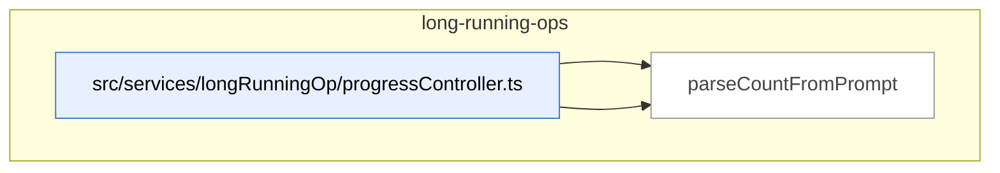
```mermaid
flowchart TB
subgraph dom_long_running_ops ["long-running-ops"]
  file_src_services_longRunningOp_progressContr["src/services/longRunningOp/progressController.ts"]:::component
  sym_src_services_longRunningOp_progressContr["LongRunningOpController"]:::symbol
  file_src_services_longRunningOp_progressContr --> sym_src_services_longRunningOp_progressContr
  sym_src_services_longRunningOp_progressContr["parseCountFromPrompt"]:::symbol
  file_src_services_longRunningOp_progressContr --> sym_src_services_longRunningOp_progressContr
end
classDef container fill:#f5f5f5,stroke:#333,stroke-width:2px,color:#000
classDef component fill:#e8f0ff,stroke:#3178c6,color:#000
classDef symbol fill:#fff,stroke:#999,color:#444
classDef dup fill:#ffe8d8,stroke:#c0392b,stroke-width:2px,color:#000
classDef violation fill:#ffd6d6,stroke:#c0392b,stroke-width:2px,color:#000
```

### Symbols in this domain

| Symbol | Kind | Path | Lines | Purpose |
|---|---|---|---|---|
| [`LongRunningOpController`](../src/services/longRunningOp/progressController.ts#L29) | class | `src/services/longRunningOp/progressController.ts` | 29-197 | <no body> |
| [`parseCountFromPrompt`](../src/services/longRunningOp/progressController.ts#L209) | function | `src/services/longRunningOp/progressController.ts` | 209-219 | Extracts and validates a count parameter from prompt text, clamping to range between 1 and maxCount. |

---

## newsletter

> The `newsletter` domain generates audio podcasts from newsletter scripts using text-to-speech, manages daily newsletter buckets with time-based cutoff logic, and extracts/filters links from newsletter content while maintaining stale file cleanup.

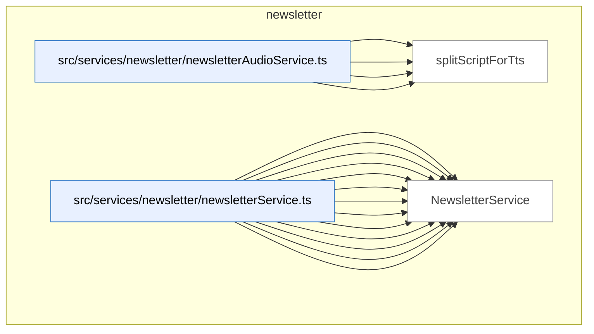
```mermaid
flowchart TB
subgraph dom_newsletter ["newsletter"]
  file_src_services_newsletter_newsletterAudioS["src/services/newsletter/newsletterAudioService.ts"]:::component
  sym_src_services_newsletter_newsletterAudioS["describeError"]:::symbol
  file_src_services_newsletter_newsletterAudioS --> sym_src_services_newsletter_newsletterAudioS
  sym_src_services_newsletter_newsletterAudioS["generateAudioPodcast"]:::symbol
  file_src_services_newsletter_newsletterAudioS --> sym_src_services_newsletter_newsletterAudioS
  sym_src_services_newsletter_newsletterAudioS["pruneStaleAudioFiles"]:::symbol
  file_src_services_newsletter_newsletterAudioS --> sym_src_services_newsletter_newsletterAudioS
  sym_src_services_newsletter_newsletterAudioS["splitScriptForTts"]:::symbol
  file_src_services_newsletter_newsletterAudioS --> sym_src_services_newsletter_newsletterAudioS
  file_src_services_newsletter_newsletterServic["src/services/newsletter/newsletterService.ts"]:::component
  sym_src_services_newsletter_newsletterServic["extractBriefFromDigest"]:::symbol
  file_src_services_newsletter_newsletterServic --> sym_src_services_newsletter_newsletterServic
  sym_src_services_newsletter_newsletterServic["extractFrontmatterField"]:::symbol
  file_src_services_newsletter_newsletterServic --> sym_src_services_newsletter_newsletterServic
  sym_src_services_newsletter_newsletterServic["extractNewsletterLinks"]:::symbol
  file_src_services_newsletter_newsletterServic --> sym_src_services_newsletter_newsletterServic
  sym_src_services_newsletter_newsletterServic["extractSenderName"]:::symbol
  file_src_services_newsletter_newsletterServic --> sym_src_services_newsletter_newsletterServic
  sym_src_services_newsletter_newsletterServic["extractTriageFromNote"]:::symbol
  file_src_services_newsletter_newsletterServic --> sym_src_services_newsletter_newsletterServic
  sym_src_services_newsletter_newsletterServic["formatLocalYmd"]:::symbol
  file_src_services_newsletter_newsletterServic --> sym_src_services_newsletter_newsletterServic
  sym_src_services_newsletter_newsletterServic["getBriefDateStr"]:::symbol
  file_src_services_newsletter_newsletterServic --> sym_src_services_newsletter_newsletterServic
  sym_src_services_newsletter_newsletterServic["getBucketDateStr"]:::symbol
  file_src_services_newsletter_newsletterServic --> sym_src_services_newsletter_newsletterServic
  sym_src_services_newsletter_newsletterServic["getDigestPath"]:::symbol
  file_src_services_newsletter_newsletterServic --> sym_src_services_newsletter_newsletterServic
  sym_src_services_newsletter_newsletterServic["hasAudioEmbed"]:::symbol
  file_src_services_newsletter_newsletterServic --> sym_src_services_newsletter_newsletterServic
  sym_src_services_newsletter_newsletterServic["isBucketClosed"]:::symbol
  file_src_services_newsletter_newsletterServic --> sym_src_services_newsletter_newsletterServic
  sym_src_services_newsletter_newsletterServic["isExpiredNewsletterEntry"]:::symbol
  file_src_services_newsletter_newsletterServic --> sym_src_services_newsletter_newsletterServic
  sym_src_services_newsletter_newsletterServic["NewsletterService"]:::symbol
  file_src_services_newsletter_newsletterServic --> sym_src_services_newsletter_newsletterServic
end
classDef container fill:#f5f5f5,stroke:#333,stroke-width:2px,color:#000
classDef component fill:#e8f0ff,stroke:#3178c6,color:#000
classDef symbol fill:#fff,stroke:#999,color:#444
classDef dup fill:#ffe8d8,stroke:#c0392b,stroke-width:2px,color:#000
classDef violation fill:#ffd6d6,stroke:#c0392b,stroke-width:2px,color:#000
```

### Symbols in this domain

| Symbol | Kind | Path | Lines | Purpose |
|---|---|---|---|---|
| [`describeError`](../src/services/newsletter/newsletterAudioService.ts#L164) | function | `src/services/newsletter/newsletterAudioService.ts` | 164-166 | Extracts error message from Error object or converts non-Error to string. |
| [`generateAudioPodcast`](../src/services/newsletter/newsletterAudioService.ts#L66) | function | `src/services/newsletter/newsletterAudioService.ts` | 66-149 | Generates audio podcast from brief script using Gemini TTS with idempotency fingerprinting and audio file assembly. |
| [`pruneStaleAudioFiles`](../src/services/newsletter/newsletterAudioService.ts#L172) | function | `src/services/newsletter/newsletterAudioService.ts` | 172-198 | Removes stale audio files matching old fingerprints and legacy WAV format from newsletter output folder. |
| [`splitScriptForTts`](../src/services/newsletter/newsletterAudioService.ts#L158) | function | `src/services/newsletter/newsletterAudioService.ts` | 158-160 | Splits TTS script into chunks using target and maximum character limits. |
| [`extractBriefFromDigest`](../src/services/newsletter/newsletterService.ts#L1207) | function | `src/services/newsletter/newsletterService.ts` | 1207-1212 | Extracts Daily Brief section from digest, removing prior audio embeds to avoid duplication. |
| [`extractFrontmatterField`](../src/services/newsletter/newsletterService.ts#L1229) | function | `src/services/newsletter/newsletterService.ts` | 1229-1240 | Extracts a YAML frontmatter field value by regex matching within triple-dash delimiters. |
| [`extractNewsletterLinks`](../src/services/newsletter/newsletterService.ts#L1166) | function | `src/services/newsletter/newsletterService.ts` | 1166-1174 | Extracts and filters clickable links from newsletter HTML, skipping blocked domains and short text. |
| [`extractSenderName`](../src/services/newsletter/newsletterService.ts#L1215) | function | `src/services/newsletter/newsletterService.ts` | 1215-1223 | Parses sender name from email From header, handling quoted names and extracting before @. |
| [`extractTriageFromNote`](../src/services/newsletter/newsletterService.ts#L1246) | function | `src/services/newsletter/newsletterService.ts` | 1246-1255 | Extracts main body of newsletter note by removing frontmatter and truncating at Key Links section. |
| [`formatLocalYmd`](../src/services/newsletter/newsletterService.ts#L1186) | function | `src/services/newsletter/newsletterService.ts` | 1186-1191 | Formats a date object as local YYYY-MM-DD string with zero-padded month and day. |
| [`getBriefDateStr`](../src/services/newsletter/newsletterService.ts#L1095) | function | `src/services/newsletter/newsletterService.ts` | 1095-1097 | Returns the date string for the current daily newsletter bucket based on cutoff hour. |
| [`getBucketDateStr`](../src/services/newsletter/newsletterService.ts#L1137) | function | `src/services/newsletter/newsletterService.ts` | 1137-1151 | Converts a date to local YYYY-MM-DD bucket string, backfilling to previous day if before cutoff hour. |
| [`getDigestPath`](../src/services/newsletter/newsletterService.ts#L1177) | function | `src/services/newsletter/newsletterService.ts` | 1177-1179 | Constructs file path for daily digest using output root and date string. |
| [`hasAudioEmbed`](../src/services/newsletter/newsletterService.ts#L1197) | function | `src/services/newsletter/newsletterService.ts` | 1197-1199 | Tests whether digest content contains an embedded audio player for brief narration. |
| [`isBucketClosed`](../src/services/newsletter/newsletterService.ts#L1114) | function | `src/services/newsletter/newsletterService.ts` | 1114-1121 | Checks if a newsletter bucket is closed by comparing current time against bucket date plus cutoff hour. |
| [`isExpiredNewsletterEntry`](../src/services/newsletter/newsletterService.ts#L1157) | function | `src/services/newsletter/newsletterService.ts` | 1157-1162 | Tests whether a folder name matches expired newsletter entry patterns (old date or old Digest filename). |
| [`NewsletterService`](../src/services/newsletter/newsletterService.ts#L29) | class | `src/services/newsletter/newsletterService.ts` | 29-1088 | <no body> |

---

## notebooklm

> The `notebooklm` domain handles document chunking, validation, and content hashing for NotebookLM, including module estimation, export parameter validation, and deterministic hash generation for notes and content packs.


```mermaid
flowchart TB
subgraph dom_notebooklm ["notebooklm"]
  file_src_services_notebooklm_chunking_ts["src/services/notebooklm/chunking.ts"]:::component
  sym_src_services_notebooklm_chunking_ts_auto["autoSelectExportMode"]:::symbol
  file_src_services_notebooklm_chunking_ts --> sym_src_services_notebooklm_chunking_ts_auto
  sym_src_services_notebooklm_chunking_ts_chec["checkModuleLimits"]:::symbol
  file_src_services_notebooklm_chunking_ts --> sym_src_services_notebooklm_chunking_ts_chec
  sym_src_services_notebooklm_chunking_ts_chec["checkModuleWordLimit"]:::symbol
  file_src_services_notebooklm_chunking_ts --> sym_src_services_notebooklm_chunking_ts_chec
  sym_src_services_notebooklm_chunking_ts_esti["estimateModuleCount"]:::symbol
  file_src_services_notebooklm_chunking_ts --> sym_src_services_notebooklm_chunking_ts_esti
  sym_src_services_notebooklm_chunking_ts_vali["validateExportParameters"]:::symbol
  file_src_services_notebooklm_chunking_ts --> sym_src_services_notebooklm_chunking_ts_vali
  file_src_services_notebooklm_hashing_ts["src/services/notebooklm/hashing.ts"]:::component
  sym_src_services_notebooklm_hashing_ts_bytes["bytesToHex"]:::symbol
  file_src_services_notebooklm_hashing_ts --> sym_src_services_notebooklm_hashing_ts_bytes
  sym_src_services_notebooklm_hashing_ts_compu["computeBinarySHA256"]:::symbol
  file_src_services_notebooklm_hashing_ts --> sym_src_services_notebooklm_hashing_ts_compu
  sym_src_services_notebooklm_hashing_ts_compu["computePackHash"]:::symbol
  file_src_services_notebooklm_hashing_ts --> sym_src_services_notebooklm_hashing_ts_compu
  sym_src_services_notebooklm_hashing_ts_compu["computeSHA256"]:::symbol
  file_src_services_notebooklm_hashing_ts --> sym_src_services_notebooklm_hashing_ts_compu
  sym_src_services_notebooklm_hashing_ts_gener["generateShortId"]:::symbol
  file_src_services_notebooklm_hashing_ts --> sym_src_services_notebooklm_hashing_ts_gener
  sym_src_services_notebooklm_hashing_ts_hashe["hashesMatch"]:::symbol
  file_src_services_notebooklm_hashing_ts --> sym_src_services_notebooklm_hashing_ts_hashe
  sym_src_services_notebooklm_hashing_ts_hashN["hashNoteContent"]:::symbol
  file_src_services_notebooklm_hashing_ts --> sym_src_services_notebooklm_hashing_ts_hashN
  sym_src_services_notebooklm_hashing_ts_isVal["isValidSHA256"]:::symbol
  file_src_services_notebooklm_hashing_ts --> sym_src_services_notebooklm_hashing_ts_isVal
  file_src_services_notebooklm_notebooklmUtils_["src/services/notebooklm/notebooklmUtils.ts"]:::component
  sym_src_services_notebooklm_notebooklmUtils_["formatBytes"]:::symbol
  file_src_services_notebooklm_notebooklmUtils_ --> sym_src_services_notebooklm_notebooklmUtils_
  sym_src_services_notebooklm_notebooklmUtils_["resolveOutputName"]:::symbol
  file_src_services_notebooklm_notebooklmUtils_ --> sym_src_services_notebooklm_notebooklmUtils_
  sym_src_services_notebooklm_notebooklmUtils_["sanitizeFilename"]:::symbol
  file_src_services_notebooklm_notebooklmUtils_ --> sym_src_services_notebooklm_notebooklmUtils_
  file_src_services_notebooklm_pdf_MarkdownPdfG["src/services/notebooklm/pdf/MarkdownPdfGenerator.ts"]:::component
  sym_src_services_notebooklm_pdf_MarkdownPdfG["MarkdownPdfGenerator"]:::symbol
  file_src_services_notebooklm_pdf_MarkdownPdfG --> sym_src_services_notebooklm_pdf_MarkdownPdfG
  file_src_services_notebooklm_registry_ts["src/services/notebooklm/registry.ts"]:::component
  sym_src_services_notebooklm_registry_ts_norm["normalizePackEntry"]:::symbol
  file_src_services_notebooklm_registry_ts --> sym_src_services_notebooklm_registry_ts_norm
  sym_src_services_notebooklm_registry_ts_norm["normalizeRegistryEntry"]:::symbol
  file_src_services_notebooklm_registry_ts --> sym_src_services_notebooklm_registry_ts_norm
  sym_src_services_notebooklm_registry_ts_Regi["RegistryService"]:::symbol
  file_src_services_notebooklm_registry_ts --> sym_src_services_notebooklm_registry_ts_Regi
  file_src_services_notebooklm_selectionService["src/services/notebooklm/selectionService.ts"]:::component
  sym_src_services_notebooklm_selectionService["SelectionService"]:::symbol
  file_src_services_notebooklm_selectionService --> sym_src_services_notebooklm_selectionService
  file_src_services_notebooklm_sourcePackServic["src/services/notebooklm/sourcePackService.ts"]:::component
  sym_src_services_notebooklm_sourcePackServic["computeConfigHash"]:::symbol
  file_src_services_notebooklm_sourcePackServic --> sym_src_services_notebooklm_sourcePackServic
  sym_src_services_notebooklm_sourcePackServic["sleep"]:::symbol
  file_src_services_notebooklm_sourcePackServic --> sym_src_services_notebooklm_sourcePackServic
  sym_src_services_notebooklm_sourcePackServic["SourcePackService"]:::symbol
  file_src_services_notebooklm_sourcePackServic --> sym_src_services_notebooklm_sourcePackServic
  file_src_services_notebooklm_textPreprocessor["src/services/notebooklm/textPreprocessor.ts"]:::component
  sym_src_services_notebooklm_textPreprocessor["getExtension"]:::symbol
  file_src_services_notebooklm_textPreprocessor --> sym_src_services_notebooklm_textPreprocessor
  sym_src_services_notebooklm_textPreprocessor["htmlBlockTag"]:::symbol
  file_src_services_notebooklm_textPreprocessor --> sym_src_services_notebooklm_textPreprocessor
  sym_src_services_notebooklm_textPreprocessor["isImageExtension"]:::symbol
  file_src_services_notebooklm_textPreprocessor --> sym_src_services_notebooklm_textPreprocessor
  sym_src_services_notebooklm_textPreprocessor["parseFence"]:::symbol
  file_src_services_notebooklm_textPreprocessor --> sym_src_services_notebooklm_textPreprocessor
  sym_src_services_notebooklm_textPreprocessor["preprocessNoteForNotebookLM"]:::symbol
  file_src_services_notebooklm_textPreprocessor --> sym_src_services_notebooklm_textPreprocessor
  sym_src_services_notebooklm_textPreprocessor["replaceImageEmbeds"]:::symbol
  file_src_services_notebooklm_textPreprocessor --> sym_src_services_notebooklm_textPreprocessor
  file_src_services_notebooklm_writer_ts["src/services/notebooklm/writer.ts"]:::component
  sym_src_services_notebooklm_writer_ts_Writer["WriterService"]:::symbol
  file_src_services_notebooklm_writer_ts --> sym_src_services_notebooklm_writer_ts_Writer
end
classDef container fill:#f5f5f5,stroke:#333,stroke-width:2px,color:#000
classDef component fill:#e8f0ff,stroke:#3178c6,color:#000
classDef symbol fill:#fff,stroke:#999,color:#444
classDef dup fill:#ffe8d8,stroke:#c0392b,stroke-width:2px,color:#000
classDef violation fill:#ffd6d6,stroke:#c0392b,stroke-width:2px,color:#000
```

### Symbols in this domain

| Symbol | Kind | Path | Lines | Purpose |
|---|---|---|---|---|
| [`autoSelectExportMode`](../src/services/notebooklm/chunking.ts#L15) | function | `src/services/notebooklm/chunking.ts` | 15-17 | <no body> |
| [`checkModuleLimits`](../src/services/notebooklm/chunking.ts#L23) | function | `src/services/notebooklm/chunking.ts` | 23-25 | <no body> |
| [`checkModuleWordLimit`](../src/services/notebooklm/chunking.ts#L27) | function | `src/services/notebooklm/chunking.ts` | 27-29 | <no body> |
| [`estimateModuleCount`](../src/services/notebooklm/chunking.ts#L11) | function | `src/services/notebooklm/chunking.ts` | 11-13 | <no body> |
| [`validateExportParameters`](../src/services/notebooklm/chunking.ts#L19) | function | `src/services/notebooklm/chunking.ts` | 19-21 | <no body> |
| [`bytesToHex`](../src/services/notebooklm/hashing.ts#L13) | function | `src/services/notebooklm/hashing.ts` | 13-19 | Converts byte array to lowercase hexadecimal string representation. |
| [`computeBinarySHA256`](../src/services/notebooklm/hashing.ts#L97) | function | `src/services/notebooklm/hashing.ts` | 97-103 | Computes SHA-256 hash of raw binary data using Web Crypto API. |
| [`computePackHash`](../src/services/notebooklm/hashing.ts#L64) | function | `src/services/notebooklm/hashing.ts` | 64-71 | Creates deterministic pack hash by sorting entry hashes, concatenating, and hashing the result. |
| [`computeSHA256`](../src/services/notebooklm/hashing.ts#L26) | function | `src/services/notebooklm/hashing.ts` | 26-30 | Computes SHA-256 hash of text content using Web Crypto API and converts to hex. |
| [`generateShortId`](../src/services/notebooklm/hashing.ts#L38) | function | `src/services/notebooklm/hashing.ts` | 38-40 | Returns first N characters of SHA-256 hash as short ID. |
| [`hashesMatch`](../src/services/notebooklm/hashing.ts#L79) | function | `src/services/notebooklm/hashing.ts` | 79-81 | Compares two SHA-256 hashes case-insensitively. |
| [`hashNoteContent`](../src/services/notebooklm/hashing.ts#L47) | function | `src/services/notebooklm/hashing.ts` | 47-51 | Computes both full SHA-256 and short ID for note content. |
| [`isValidSHA256`](../src/services/notebooklm/hashing.ts#L88) | function | `src/services/notebooklm/hashing.ts` | 88-90 | Validates that string matches SHA-256 hex format (64 hex characters). |
| [`formatBytes`](../src/services/notebooklm/notebooklmUtils.ts#L10) | function | `src/services/notebooklm/notebooklmUtils.ts` | 10-14 | Formats byte count as human-readable string with B, KB, or MB units. |
| [`resolveOutputName`](../src/services/notebooklm/notebooklmUtils.ts#L38) | function | `src/services/notebooklm/notebooklmUtils.ts` | 38-48 | Generates unique filename by appending counter suffix if candidate already exists in used set. |
| [`sanitizeFilename`](../src/services/notebooklm/notebooklmUtils.ts#L20) | function | `src/services/notebooklm/notebooklmUtils.ts` | 20-27 | Sanitizes filename by removing invalid characters, collapsing spaces, and enforcing length limit. |
| [`MarkdownPdfGenerator`](../src/services/notebooklm/pdf/MarkdownPdfGenerator.ts#L21) | class | `src/services/notebooklm/pdf/MarkdownPdfGenerator.ts` | 21-253 | Converts markdown content to PDF with configurable fonts, margins, and pagination support. |
| [`normalizePackEntry`](../src/services/notebooklm/registry.ts#L35) | function | `src/services/notebooklm/registry.ts` | 35-48 | Normalizes raw pack entries with support for legacy `pdfName` field aliasing. |
| [`normalizeRegistryEntry`](../src/services/notebooklm/registry.ts#L17) | function | `src/services/notebooklm/registry.ts` | 17-29 | Normalizes raw registry entries into typed objects with default values for missing fields. |
| [`RegistryService`](../src/services/notebooklm/registry.ts#L53) | class | `src/services/notebooklm/registry.ts` | 53-211 | Manages persistent storage and retrieval of export pack metadata with error recovery. |
| [`SelectionService`](../src/services/notebooklm/selectionService.ts#L16) | class | `src/services/notebooklm/selectionService.ts` | 16-254 | Identifies notes by tag or folder selection for batch export operations. |
| [`computeConfigHash`](../src/services/notebooklm/sourcePackService.ts#L731) | function | `src/services/notebooklm/sourcePackService.ts` | 731-740 | Computes a deterministic hash of export configuration settings for change detection. |
| [`sleep`](../src/services/notebooklm/sourcePackService.ts#L34) | function | `src/services/notebooklm/sourcePackService.ts` | 34-34 | Delays execution by a specified number of milliseconds. |
| [`SourcePackService`](../src/services/notebooklm/sourcePackService.ts#L49) | class | `src/services/notebooklm/sourcePackService.ts` | 49-719 | Orchestrates the export workflow by coordinating selection, PDF generation, and registry updates. |
| [`getExtension`](../src/services/notebooklm/textPreprocessor.ts#L50) | function | `src/services/notebooklm/textPreprocessor.ts` | 50-54 | Extracts the file extension from a path or filename. |
| [`htmlBlockTag`](../src/services/notebooklm/textPreprocessor.ts#L91) | function | `src/services/notebooklm/textPreprocessor.ts` | 91-98 | Detects HTML block-level tags to identify structural elements. |
| [`isImageExtension`](../src/services/notebooklm/textPreprocessor.ts#L46) | function | `src/services/notebooklm/textPreprocessor.ts` | 46-48 | Checks if a file extension matches known image formats. |
| [`parseFence`](../src/services/notebooklm/textPreprocessor.ts#L79) | function | `src/services/notebooklm/textPreprocessor.ts` | 79-88 | Parses a markdown fence opener to extract language and fence character/length. |
| [`preprocessNoteForNotebookLM`](../src/services/notebooklm/textPreprocessor.ts#L105) | function | `src/services/notebooklm/textPreprocessor.ts` | 105-234 | Preprocesses markdown content by stripping code blocks, HTML, and optionally frontmatter while preserving structure. |
| [`replaceImageEmbeds`](../src/services/notebooklm/textPreprocessor.ts#L57) | function | `src/services/notebooklm/textPreprocessor.ts` | 57-76 | Replaces embedded image syntax with text placeholders in markdown. |
| [`WriterService`](../src/services/notebooklm/writer.ts#L11) | class | `src/services/notebooklm/writer.ts` | 11-125 | Writes pack manifests, changelogs, and README files to the vault filesystem. |

---

## persona-harness

> The `persona-harness` domain provides test automation utilities for command picker UI components, including screenshot capture, test result logging, modal interaction, and DOM element filtering.

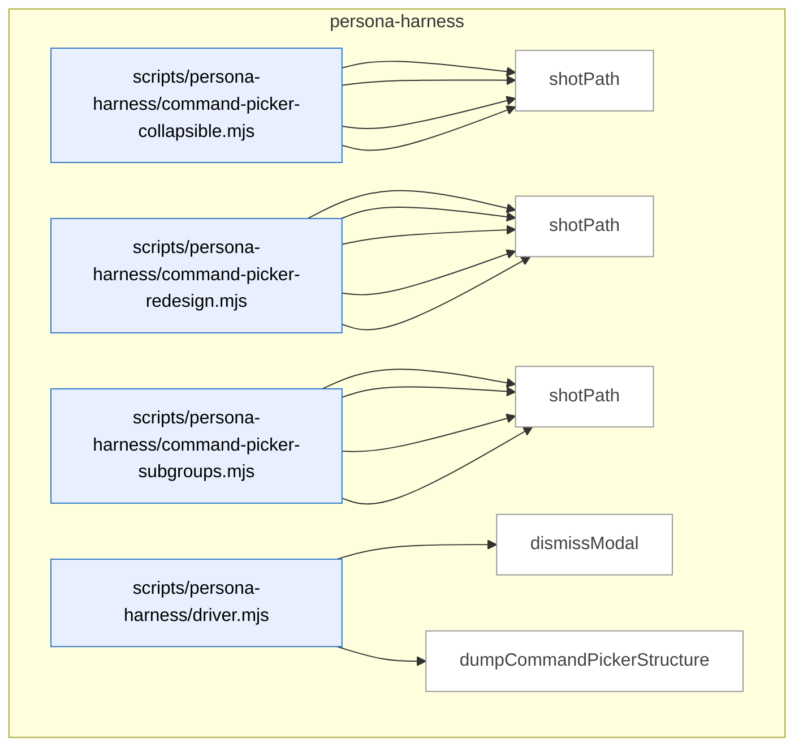
```mermaid
flowchart TB
subgraph dom_persona_harness ["persona-harness"]
  file_scripts_persona_harness_command_picker_c["scripts/persona-harness/command-picker-collapsible.mjs"]:::component
  sym_scripts_persona_harness_command_picker_c["closeAll"]:::symbol
  file_scripts_persona_harness_command_picker_c --> sym_scripts_persona_harness_command_picker_c
  sym_scripts_persona_harness_command_picker_c["pass"]:::symbol
  file_scripts_persona_harness_command_picker_c --> sym_scripts_persona_harness_command_picker_c
  sym_scripts_persona_harness_command_picker_c["record"]:::symbol
  file_scripts_persona_harness_command_picker_c --> sym_scripts_persona_harness_command_picker_c
  sym_scripts_persona_harness_command_picker_c["shotPath"]:::symbol
  file_scripts_persona_harness_command_picker_c --> sym_scripts_persona_harness_command_picker_c
  file_scripts_persona_harness_command_picker_r["scripts/persona-harness/command-picker-redesign.mjs"]:::component
  sym_scripts_persona_harness_command_picker_r["closeAll"]:::symbol
  file_scripts_persona_harness_command_picker_r --> sym_scripts_persona_harness_command_picker_r
  sym_scripts_persona_harness_command_picker_r["idMatches"]:::symbol
  file_scripts_persona_harness_command_picker_r --> sym_scripts_persona_harness_command_picker_r
  sym_scripts_persona_harness_command_picker_r["pass"]:::symbol
  file_scripts_persona_harness_command_picker_r --> sym_scripts_persona_harness_command_picker_r
  sym_scripts_persona_harness_command_picker_r["record"]:::symbol
  file_scripts_persona_harness_command_picker_r --> sym_scripts_persona_harness_command_picker_r
  sym_scripts_persona_harness_command_picker_r["shotPath"]:::symbol
  file_scripts_persona_harness_command_picker_r --> sym_scripts_persona_harness_command_picker_r
  file_scripts_persona_harness_command_picker_s["scripts/persona-harness/command-picker-subgroups.mjs"]:::component
  sym_scripts_persona_harness_command_picker_s["closeAll"]:::symbol
  file_scripts_persona_harness_command_picker_s --> sym_scripts_persona_harness_command_picker_s
  sym_scripts_persona_harness_command_picker_s["pass"]:::symbol
  file_scripts_persona_harness_command_picker_s --> sym_scripts_persona_harness_command_picker_s
  sym_scripts_persona_harness_command_picker_s["record"]:::symbol
  file_scripts_persona_harness_command_picker_s --> sym_scripts_persona_harness_command_picker_s
  sym_scripts_persona_harness_command_picker_s["shotPath"]:::symbol
  file_scripts_persona_harness_command_picker_s --> sym_scripts_persona_harness_command_picker_s
  file_scripts_persona_harness_driver_mjs["scripts/persona-harness/driver.mjs"]:::component
  sym_scripts_persona_harness_driver_mjs_dismi["dismissModal"]:::symbol
  file_scripts_persona_harness_driver_mjs --> sym_scripts_persona_harness_driver_mjs_dismi
  sym_scripts_persona_harness_driver_mjs_dumpC["dumpCommandPickerStructure"]:::symbol
  file_scripts_persona_harness_driver_mjs --> sym_scripts_persona_harness_driver_mjs_dumpC
end
classDef container fill:#f5f5f5,stroke:#333,stroke-width:2px,color:#000
classDef component fill:#e8f0ff,stroke:#3178c6,color:#000
classDef symbol fill:#fff,stroke:#999,color:#444
classDef dup fill:#ffe8d8,stroke:#c0392b,stroke-width:2px,color:#000
classDef violation fill:#ffd6d6,stroke:#c0392b,stroke-width:2px,color:#000
```

_Domain has 101 symbols (>50). Diagram shows top-15 by file order; see flat table below for the full list._

### Symbols in this domain

| Symbol | Kind | Path | Lines | Purpose |
|---|---|---|---|---|
| [`closeAll`](../scripts/persona-harness/command-picker-collapsible.mjs#L48) | function | `scripts/persona-harness/command-picker-collapsible.mjs` | 48-58 | Closes modal dialogs by clicking close buttons or pressing Escape up to 4 times. |
| [`pass`](../scripts/persona-harness/command-picker-collapsible.mjs#L32) | function | `scripts/persona-harness/command-picker-collapsible.mjs` | 32-32 | Logs a passing test to console. |
| [`record`](../scripts/persona-harness/command-picker-collapsible.mjs#L28) | function | `scripts/persona-harness/command-picker-collapsible.mjs` | 28-31 | Records a finding with severity level and logs it to console. |
| [`shotPath`](../scripts/persona-harness/command-picker-collapsible.mjs#L24) | function | `scripts/persona-harness/command-picker-collapsible.mjs` | 24-24 | Returns the file path for saving screenshot output. |
| [`closeAll`](../scripts/persona-harness/command-picker-redesign.mjs#L51) | function | `scripts/persona-harness/command-picker-redesign.mjs` | 51-61 | Closes modal dialogs by clicking close buttons or pressing Escape up to 4 times. |
| [`idMatches`](../scripts/persona-harness/command-picker-redesign.mjs#L111) | function | `scripts/persona-harness/command-picker-redesign.mjs` | 111-111 | Filters command picker tree items matching a given ID prefix pattern. |
| [`pass`](../scripts/persona-harness/command-picker-redesign.mjs#L34) | function | `scripts/persona-harness/command-picker-redesign.mjs` | 34-34 | Logs a passing test to console. |
| [`record`](../scripts/persona-harness/command-picker-redesign.mjs#L30) | function | `scripts/persona-harness/command-picker-redesign.mjs` | 30-33 | Records a finding with severity level and logs it to console. |
| [`shotPath`](../scripts/persona-harness/command-picker-redesign.mjs#L26) | function | `scripts/persona-harness/command-picker-redesign.mjs` | 26-26 | Returns the file path for saving screenshot output. |
| [`closeAll`](../scripts/persona-harness/command-picker-subgroups.mjs#L48) | function | `scripts/persona-harness/command-picker-subgroups.mjs` | 48-58 | Closes modal dialogs by clicking close buttons or pressing Escape up to 4 times. |
| [`pass`](../scripts/persona-harness/command-picker-subgroups.mjs#L32) | function | `scripts/persona-harness/command-picker-subgroups.mjs` | 32-32 | Logs a passing test to console. |
| [`record`](../scripts/persona-harness/command-picker-subgroups.mjs#L28) | function | `scripts/persona-harness/command-picker-subgroups.mjs` | 28-31 | Records a finding with severity level and logs it to console. |
| [`shotPath`](../scripts/persona-harness/command-picker-subgroups.mjs#L24) | function | `scripts/persona-harness/command-picker-subgroups.mjs` | 24-24 | Returns the file path for saving screenshot output. |
| [`dismissModal`](../scripts/persona-harness/driver.mjs#L302) | function | `scripts/persona-harness/driver.mjs` | 302-305 | Dismisses a modal or menu by pressing Escape. |
| [`dumpCommandPickerStructure`](../scripts/persona-harness/driver.mjs#L315) | function | `scripts/persona-harness/driver.mjs` | 315-328 | Extracts all AI Organiser commands from the global app object and returns their count and metadata. |
| [`ensureVaultOpen`](../scripts/persona-harness/driver.mjs#L128) | function | `scripts/persona-harness/driver.mjs` | 128-177 | Opens a vault from the starter page by clicking the matching recent vault entry. |
| [`findMainPage`](../scripts/persona-harness/driver.mjs#L106) | function | `scripts/persona-harness/driver.mjs` | 106-117 | Finds and returns the main Obsidian app page from browser contexts. |
| [`isObsidianRunning`](../scripts/persona-harness/driver.mjs#L24) | function | `scripts/persona-harness/driver.mjs` | 24-34 | Checks whether Obsidian process is currently running on Windows. |
| [`launchOrAttach`](../scripts/persona-harness/driver.mjs#L63) | function | `scripts/persona-harness/driver.mjs` | 63-99 | Launches Obsidian with remote debugging port or attaches to existing instance via CDP. |
| [`openPaletteAndType`](../scripts/persona-harness/driver.mjs#L295) | function | `scripts/persona-harness/driver.mjs` | 295-299 | Opens the command palette with Ctrl+P and optionally types a search query. |
| [`openPluginCommandPicker`](../scripts/persona-harness/driver.mjs#L208) | function | `scripts/persona-harness/driver.mjs` | 208-214 | Triggers plugin command picker modal by running a ready command. |
| [`openPluginCommandPickerViaRibbon`](../scripts/persona-harness/driver.mjs#L224) | function | `scripts/persona-harness/driver.mjs` | 224-228 | Opens plugin command picker by clicking ribbon button with matching tooltip. |
| [`openVaultFile`](../scripts/persona-harness/driver.mjs#L271) | function | `scripts/persona-harness/driver.mjs` | 271-282 | Opens a file from the vault using the Obsidian API by path and waits for it to load. |
| [`readVisibleMenuItems`](../scripts/persona-harness/driver.mjs#L285) | function | `scripts/persona-harness/driver.mjs` | 285-292 | Reads all visible menu items and extracts their text and submenu status. |
| [`rightClickEditor`](../scripts/persona-harness/driver.mjs#L244) | function | `scripts/persona-harness/driver.mjs` | 244-248 | Right-clicks the editor content area and waits for a context menu to appear. |
| [`rightClickEditorWithSelection`](../scripts/persona-harness/driver.mjs#L255) | function | `scripts/persona-harness/driver.mjs` | 255-261 | Double-clicks to select a word in the editor, then right-clicks to open a context menu. |
| [`rightClickFileInTree`](../scripts/persona-harness/driver.mjs#L234) | function | `scripts/persona-harness/driver.mjs` | 234-238 | Right-clicks a file in the navigation tree by name and waits for a context menu to appear. |
| [`runCommand`](../scripts/persona-harness/driver.mjs#L198) | function | `scripts/persona-harness/driver.mjs` | 198-205 | Executes a registered command by ID in the Obsidian app. |
| [`stampedName`](../scripts/persona-harness/driver.mjs#L331) | function | `scripts/persona-harness/driver.mjs` | 331-333 | Generates a timestamped filename for a screenshot. |
| [`waitForPluginReady`](../scripts/persona-harness/driver.mjs#L183) | function | `scripts/persona-harness/driver.mjs` | 183-192 | Waits for a plugin command to be registered in the app command registry. |
| [`waitForPort`](../scripts/persona-harness/driver.mjs#L37) | function | `scripts/persona-harness/driver.mjs` | 37-54 | Polls a network port until connection succeeds or timeout is reached. |
| [`closeAllModals`](../scripts/persona-harness/explore-audio-narration.mjs#L78) | function | `scripts/persona-harness/explore-audio-narration.mjs` | 78-90 | Repeatedly attempts to close all open modals by clicking close buttons or pressing Escape. |
| [`record`](../scripts/persona-harness/explore-audio-narration.mjs#L39) | function | `scripts/persona-harness/explore-audio-narration.mjs` | 39-48 | Records a test observation with severity icon and logs it to console. |
| [`shotPath`](../scripts/persona-harness/explore-audio-narration.mjs#L36) | function | `scripts/persona-harness/explore-audio-narration.mjs` | 36-36 | Returns the full path to a screenshot file in the output directory. |
| [`sortBySev`](../scripts/persona-harness/explore-audio-narration.mjs#L363) | function | `scripts/persona-harness/explore-audio-narration.mjs` | 363-366 | Sorts findings by severity order (P0 highest priority, PASS/INFO lowest). |
| [`captureModalState`](../scripts/persona-harness/explore-errors.mjs#L105) | function | `scripts/persona-harness/explore-errors.mjs` | 105-115 | Captures the title, text, and button count from an open modal. |
| [`captureNotices`](../scripts/persona-harness/explore-errors.mjs#L117) | function | `scripts/persona-harness/explore-errors.mjs` | 117-121 | Extracts the visible text from all notice elements on the page. |
| [`classifyEmptyResponse`](../scripts/persona-harness/explore-errors.mjs#L135) | function | `scripts/persona-harness/explore-errors.mjs` | 135-162 | Classifies the response to an empty-state command invocation as helpful, silent, or problematic. |
| [`closeAllModals`](../scripts/persona-harness/explore-errors.mjs#L49) | function | `scripts/persona-harness/explore-errors.mjs` | 49-61 | Repeatedly attempts to close all open modals by clicking close buttons or pressing Escape. |
| [`prepareEmptyFile`](../scripts/persona-harness/explore-errors.mjs#L70) | function | `scripts/persona-harness/explore-errors.mjs` | 70-86 | Creates or clears an empty vault file and opens it in the editor. |
| [`prepareTextOnlyFile`](../scripts/persona-harness/explore-errors.mjs#L88) | function | `scripts/persona-harness/explore-errors.mjs` | 88-103 | Creates or updates a vault file with text content and opens it in the editor. |
| [`record`](../scripts/persona-harness/explore-errors.mjs#L35) | function | `scripts/persona-harness/explore-errors.mjs` | 35-43 | Records a test observation with feature and condition labels and logs it to console. |
| [`shotPath`](../scripts/persona-harness/explore-errors.mjs#L32) | function | `scripts/persona-harness/explore-errors.mjs` | 32-32 | Returns the full path to a screenshot file in the output directory. |
| [`snapshotAfterCommand`](../scripts/persona-harness/explore-errors.mjs#L123) | function | `scripts/persona-harness/explore-errors.mjs` | 123-132 | Runs a command, waits for side effects, and captures any modal or notices that appear. |
| [`classifyResponse`](../scripts/persona-harness/explore-onboarding.mjs#L114) | function | `scripts/persona-harness/explore-onboarding.mjs` | 114-130 | Analyzes response notices and modal text to determine if setup guidance is present. |
| [`closeAllModals`](../scripts/persona-harness/explore-onboarding.mjs#L41) | function | `scripts/persona-harness/explore-onboarding.mjs` | 41-53 | Repeatedly attempts to close all open modals by clicking close buttons or pressing Escape. |
| [`prepareNote`](../scripts/persona-harness/explore-onboarding.mjs#L97) | function | `scripts/persona-harness/explore-onboarding.mjs` | 97-111 | Creates a test note with prose content and opens it in the editor. |
| [`record`](../scripts/persona-harness/explore-onboarding.mjs#L27) | function | `scripts/persona-harness/explore-onboarding.mjs` | 27-35 | Records a test observation with feature label and logs it to console with severity icon. |
| [`shotPath`](../scripts/persona-harness/explore-onboarding.mjs#L24) | function | `scripts/persona-harness/explore-onboarding.mjs` | 24-24 | Returns the full path to a screenshot file in the output directory. |
| [`snapshotAfterCommand`](../scripts/persona-harness/explore-onboarding.mjs#L132) | function | `scripts/persona-harness/explore-onboarding.mjs` | 132-149 | Runs a command, waits for side effects, and captures any modal or new notices that appear. |
| [`captureModalState`](../scripts/persona-harness/explore-r6.mjs#L57) | function | `scripts/persona-harness/explore-r6.mjs` | 57-87 | Captures detailed modal state including title, buttons, inputs, error messages, and body text. |
| [`captureNotices`](../scripts/persona-harness/explore-r6.mjs#L89) | function | `scripts/persona-harness/explore-r6.mjs` | 89-93 | Extracts the visible text from all notice elements on the page. |
| [`closeAllModals`](../scripts/persona-harness/explore-r6.mjs#L42) | function | `scripts/persona-harness/explore-r6.mjs` | 42-54 | Repeatedly attempts to close all open modals by clicking close buttons or pressing Escape. |
| [`openFirstMarkdownFile`](../scripts/persona-harness/explore-r6.mjs#L95) | function | `scripts/persona-harness/explore-r6.mjs` | 95-109 | Finds and opens the first markdown file in the vault. |
| [`record`](../scripts/persona-harness/explore-r6.mjs#L28) | function | `scripts/persona-harness/explore-r6.mjs` | 28-36 | Records a test observation with feature and persona labels and logs it to console. |
| [`shotPath`](../scripts/persona-harness/explore-r6.mjs#L25) | function | `scripts/persona-harness/explore-r6.mjs` | 25-25 | Returns the full path to a screenshot file in the output directory. |
| [`captureModalState`](../scripts/persona-harness/explore.mjs#L87) | function | `scripts/persona-harness/explore.mjs` | 87-112 | Captures detailed modal state including title, buttons, headings, inputs, and dimensions. |
| [`closeAllModals`](../scripts/persona-harness/explore.mjs#L67) | function | `scripts/persona-harness/explore.mjs` | 67-84 | Repeatedly attempts to close all open modals by clicking close buttons, falling back to Escape. |
| [`closeModal`](../scripts/persona-harness/explore.mjs#L85) | function | `scripts/persona-harness/explore.mjs` | 85-85 | Closes all open modals. |
| [`initialCleanup`](../scripts/persona-harness/explore.mjs#L54) | function | `scripts/persona-harness/explore.mjs` | 54-64 | Attempts to close up to 6 modals by clicking close buttons. |
| [`record`](../scripts/persona-harness/explore.mjs#L39) | function | `scripts/persona-harness/explore.mjs` | 39-47 | Records a test observation with feature and persona labels and logs it to console with severity icon. |
| [`shotPath`](../scripts/persona-harness/explore.mjs#L36) | function | `scripts/persona-harness/explore.mjs` | 36-36 | Returns the full path to a screenshot file in the output directory. |
| [`elapsed`](../scripts/persona-harness/fix01-extend.mjs#L52) | function | `scripts/persona-harness/fix01-extend.mjs` | 52-52 | Returns elapsed time in seconds since test start. |
| [`log`](../scripts/persona-harness/fix01-extend.mjs#L17) | function | `scripts/persona-harness/fix01-extend.mjs` | 17-17 | Logs arguments to the console. |
| [`shotPath`](../scripts/persona-harness/fix01-extend.mjs#L15) | function | `scripts/persona-harness/fix01-extend.mjs` | 15-15 | Returns the full path to a screenshot file in the output directory. |
| [`bail`](../scripts/persona-harness/fix01-retest.mjs#L56) | function | `scripts/persona-harness/fix01-retest.mjs` | 56-64 | Records a test outcome, writes findings to a JSON file, and exits the process with appropriate code. |
| [`closeAll`](../scripts/persona-harness/fix01-retest.mjs#L87) | function | `scripts/persona-harness/fix01-retest.mjs` | 87-99 | Repeatedly attempts to close all open modals by clicking close buttons or pressing Escape. |
| [`elapsed`](../scripts/persona-harness/fix01-retest.mjs#L215) | function | `scripts/persona-harness/fix01-retest.mjs` | 215-215 | Returns elapsed time in seconds since test start. |
| [`log`](../scripts/persona-harness/fix01-retest.mjs#L50) | function | `scripts/persona-harness/fix01-retest.mjs` | 50-54 | Logs arguments to console and appends the message to findings notes. |
| [`shotPath`](../scripts/persona-harness/fix01-retest.mjs#L28) | function | `scripts/persona-harness/fix01-retest.mjs` | 28-28 | Returns the full path to a screenshot file in the output directory. |
| [`shot`](../scripts/persona-harness/inspect-entry-points.mjs#L34) | function | `scripts/persona-harness/inspect-entry-points.mjs` | 34-34 | Returns the full path to a timestamped screenshot in the screenshots directory. |
| [`log`](../scripts/persona-harness/menu-audit-walkthrough.mjs#L30) | function | `scripts/persona-harness/menu-audit-walkthrough.mjs` | 30-30 | Logs arguments to console with a [menu-audit] prefix. |
| [`shot`](../scripts/persona-harness/menu-audit-walkthrough.mjs#L31) | function | `scripts/persona-harness/menu-audit-walkthrough.mjs` | 31-31 | Constructs a PNG screenshot filename from a name within the output directory. |
| [`gradeFlashcards`](../scripts/persona-harness/output-quality-matrix.mjs#L112) | function | `scripts/persona-harness/output-quality-matrix.mjs` | 112-123 | Grades flashcard content by counting Q/A pairs and identifying testable questions avoiding generic prompts. |
| [`gradeSummary`](../scripts/persona-harness/output-quality-matrix.mjs#L99) | function | `scripts/persona-harness/output-quality-matrix.mjs` | 99-110 | Grades a summary by counting specific facts and validating length between 100–800 characters. |
| [`gradeTag`](../scripts/persona-harness/output-quality-matrix.mjs#L76) | function | `scripts/persona-harness/output-quality-matrix.mjs` | 76-97 | Grades content tags by checking count, format, relevance to farming/agriculture, and hallucination indicators. |
| [`gradeTranslation`](../scripts/persona-harness/output-quality-matrix.mjs#L125) | function | `scripts/persona-harness/output-quality-matrix.mjs` | 125-137 | Grades French translations by detecting French articles/prepositions and validating presence of key facts. |
| [`swapProvider`](../scripts/persona-harness/output-quality-matrix.mjs#L53) | function | `scripts/persona-harness/output-quality-matrix.mjs` | 53-73 | Switches the AI provider in plugin settings, disables and re-enables the plugin to apply changes. |
| [`score`](../scripts/persona-harness/output-quality.mjs#L58) | function | `scripts/persona-harness/output-quality.mjs` | 58-65 | Logs a quality finding with an icon, grade, and note to console and appends to findings array. |
| [`closeAllModals`](../scripts/persona-harness/pres-create-panel.mjs#L61) | function | `scripts/persona-harness/pres-create-panel.mjs` | 61-73 | Repeatedly attempts to close all modal dialogs using close buttons or Escape key up to 6 times. |
| [`pass`](../scripts/persona-harness/pres-create-panel.mjs#L41) | function | `scripts/persona-harness/pres-create-panel.mjs` | 41-43 | Logs a passing test case. |
| [`record`](../scripts/persona-harness/pres-create-panel.mjs#L37) | function | `scripts/persona-harness/pres-create-panel.mjs` | 37-40 | Records an audit finding with severity level and logs it to console. |
| [`shotPath`](../scripts/persona-harness/pres-create-panel.mjs#L27) | function | `scripts/persona-harness/pres-create-panel.mjs` | 27-27 | Constructs a PNG screenshot filename from a name within the output directory. |
| [`closeAll`](../scripts/persona-harness/pres-e2e.mjs#L46) | function | `scripts/persona-harness/pres-e2e.mjs` | 46-58 | Repeatedly attempts to close all modal dialogs using close buttons or Escape key up to 6 times. |
| [`elapsed`](../scripts/persona-harness/pres-e2e.mjs#L319) | function | `scripts/persona-harness/pres-e2e.mjs` | 319-319 | Returns the number of seconds elapsed since test start. |
| [`shotPath`](../scripts/persona-harness/pres-e2e.mjs#L25) | function | `scripts/persona-harness/pres-e2e.mjs` | 25-25 | Constructs a PNG screenshot filename from a name within the output directory. |
| [`assert`](../scripts/persona-harness/pres-progress-ux.mjs#L43) | function | `scripts/persona-harness/pres-progress-ux.mjs` | 43-46 | Records an assertion result and logs it with a checkmark or X icon. |
| [`closeAll`](../scripts/persona-harness/pres-progress-ux.mjs#L64) | function | `scripts/persona-harness/pres-progress-ux.mjs` | 64-76 | Repeatedly attempts to close all modal dialogs using close buttons or Escape key up to 6 times. |
| [`shotPath`](../scripts/persona-harness/pres-progress-ux.mjs#L35) | function | `scripts/persona-harness/pres-progress-ux.mjs` | 35-35 | Constructs a PNG screenshot filename from a name within the output directory. |
| [`loadDotenv`](../scripts/persona-harness/register-personas.mjs#L26) | function | `scripts/persona-harness/register-personas.mjs` | 26-35 | Parses a .env file and merges environment variables into process.env if not already set. |
| [`upsertPersona`](../scripts/persona-harness/register-personas.mjs#L88) | function | `scripts/persona-harness/register-personas.mjs` | 88-109 | POSTs a persona object to Supabase REST API with merge-duplicates resolution. |
| [`clickPickerRow`](../scripts/persona-harness/reverify.mjs#L52) | function | `scripts/persona-harness/reverify.mjs` | 52-55 | <no body> |
| [`closeModal`](../scripts/persona-harness/reverify.mjs#L58) | function | `scripts/persona-harness/reverify.mjs` | 58-60 | <no body> |
| [`record`](../scripts/persona-harness/reverify.mjs#L41) | function | `scripts/persona-harness/reverify.mjs` | 41-45 | Records a reverification scenario result with status and detail, logging an icon-prefixed message. |
| [`shotPath`](../scripts/persona-harness/reverify.mjs#L38) | function | `scripts/persona-harness/reverify.mjs` | 38-38 | Constructs a PNG screenshot filename from a name within the output directory. |
| [`takeShot`](../scripts/persona-harness/session-step.mjs#L62) | function | `scripts/persona-harness/session-step.mjs` | 62-66 | Takes a screenshot and saves it to a file in the session directory, returning the path. |
| [`shotPath`](../scripts/persona-harness/smoke.mjs#L48) | function | `scripts/persona-harness/smoke.mjs` | 48-48 | Constructs a timestamped PNG screenshot filename in the screenshot directory. |
| [`waitForPort`](../scripts/persona-harness/smoke.mjs#L50) | function | `scripts/persona-harness/smoke.mjs` | 50-67 | Polls a TCP port until it opens or timeout is reached, retrying every 500ms. |
| [`digestHasAudioEmbed`](../scripts/persona-harness/verify-audio-recovery.mjs#L36) | function | `scripts/persona-harness/verify-audio-recovery.mjs` | 36-40 | Checks if the digest file contains an embedded audio link matching the expected pattern. |
| [`findAudioFile`](../scripts/persona-harness/verify-audio-recovery.mjs#L42) | function | `scripts/persona-harness/verify-audio-recovery.mjs` | 42-46 | Searches the target folder for audio files matching the brief recording filename pattern. |
| [`log`](../scripts/persona-harness/verify-audio-recovery.mjs#L34) | function | `scripts/persona-harness/verify-audio-recovery.mjs` | 34-34 | Logs a message prefixed with [verify]. |

---

## pptx-export

> The `pptx-export` domain parses HTML slide markup into typed RichSlide objects and renders them into PowerPoint presentations, handling slide classification, content extraction, and semantic block conversion.

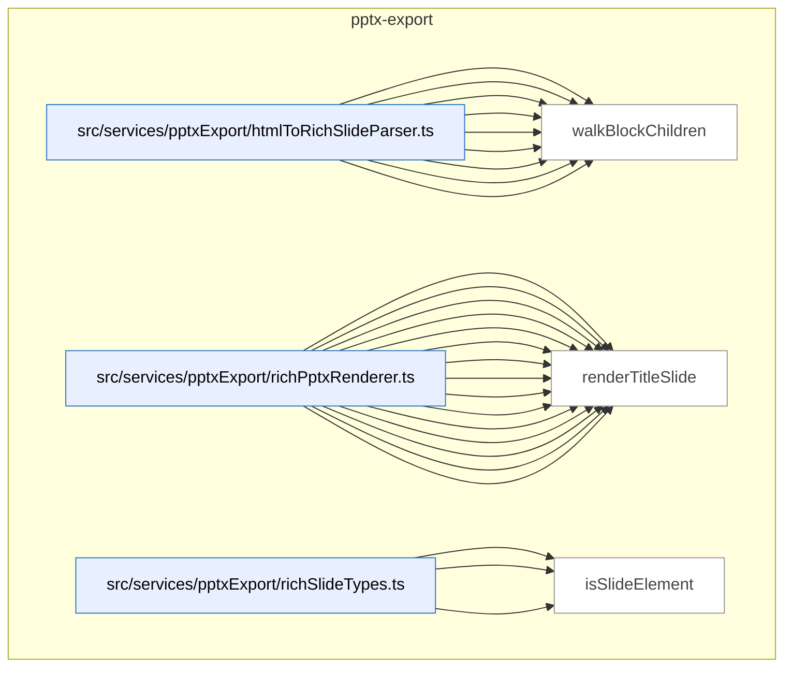
```mermaid
flowchart TB
subgraph dom_pptx_export ["pptx-export"]
  file_src_services_pptxExport_htmlToRichSlideP["src/services/pptxExport/htmlToRichSlideParser.ts"]:::component
  sym_src_services_pptxExport_htmlToRichSlideP["detectSlideType"]:::symbol
  file_src_services_pptxExport_htmlToRichSlideP --> sym_src_services_pptxExport_htmlToRichSlideP
  sym_src_services_pptxExport_htmlToRichSlideP["extractElements"]:::symbol
  file_src_services_pptxExport_htmlToRichSlideP --> sym_src_services_pptxExport_htmlToRichSlideP
  sym_src_services_pptxExport_htmlToRichSlideP["firstText"]:::symbol
  file_src_services_pptxExport_htmlToRichSlideP --> sym_src_services_pptxExport_htmlToRichSlideP
  sym_src_services_pptxExport_htmlToRichSlideP["htmlToRichSlides"]:::symbol
  file_src_services_pptxExport_htmlToRichSlideP --> sym_src_services_pptxExport_htmlToRichSlideP
  sym_src_services_pptxExport_htmlToRichSlideP["isSemanticBlock"]:::symbol
  file_src_services_pptxExport_htmlToRichSlideP --> sym_src_services_pptxExport_htmlToRichSlideP
  sym_src_services_pptxExport_htmlToRichSlideP["parseSlide"]:::symbol
  file_src_services_pptxExport_htmlToRichSlideP --> sym_src_services_pptxExport_htmlToRichSlideP
  sym_src_services_pptxExport_htmlToRichSlideP["toStatCard"]:::symbol
  file_src_services_pptxExport_htmlToRichSlideP --> sym_src_services_pptxExport_htmlToRichSlideP
  sym_src_services_pptxExport_htmlToRichSlideP["toTable"]:::symbol
  file_src_services_pptxExport_htmlToRichSlideP --> sym_src_services_pptxExport_htmlToRichSlideP
  sym_src_services_pptxExport_htmlToRichSlideP["walkBlockChildren"]:::symbol
  file_src_services_pptxExport_htmlToRichSlideP --> sym_src_services_pptxExport_htmlToRichSlideP
  file_src_services_pptxExport_richPptxRenderer["src/services/pptxExport/richPptxRenderer.ts"]:::component
  sym_src_services_pptxExport_richPptxRenderer["estimateTextHeight"]:::symbol
  file_src_services_pptxExport_richPptxRenderer --> sym_src_services_pptxExport_richPptxRenderer
  sym_src_services_pptxExport_richPptxRenderer["lightenedFill"]:::symbol
  file_src_services_pptxExport_richPptxRenderer --> sym_src_services_pptxExport_richPptxRenderer
  sym_src_services_pptxExport_richPptxRenderer["renderClosingSlide"]:::symbol
  file_src_services_pptxExport_richPptxRenderer --> sym_src_services_pptxExport_richPptxRenderer
  sym_src_services_pptxExport_richPptxRenderer["renderColumn"]:::symbol
  file_src_services_pptxExport_richPptxRenderer --> sym_src_services_pptxExport_richPptxRenderer
  sym_src_services_pptxExport_richPptxRenderer["renderContentSlide"]:::symbol
  file_src_services_pptxExport_richPptxRenderer --> sym_src_services_pptxExport_richPptxRenderer
  sym_src_services_pptxExport_richPptxRenderer["renderElement"]:::symbol
  file_src_services_pptxExport_richPptxRenderer --> sym_src_services_pptxExport_richPptxRenderer
  sym_src_services_pptxExport_richPptxRenderer["renderImage"]:::symbol
  file_src_services_pptxExport_richPptxRenderer --> sym_src_services_pptxExport_richPptxRenderer
  sym_src_services_pptxExport_richPptxRenderer["renderList"]:::symbol
  file_src_services_pptxExport_richPptxRenderer --> sym_src_services_pptxExport_richPptxRenderer
  sym_src_services_pptxExport_richPptxRenderer["renderRichPptx"]:::symbol
  file_src_services_pptxExport_richPptxRenderer --> sym_src_services_pptxExport_richPptxRenderer
  sym_src_services_pptxExport_richPptxRenderer["renderSectionSlide"]:::symbol
  file_src_services_pptxExport_richPptxRenderer --> sym_src_services_pptxExport_richPptxRenderer
  sym_src_services_pptxExport_richPptxRenderer["renderStatCard"]:::symbol
  file_src_services_pptxExport_richPptxRenderer --> sym_src_services_pptxExport_richPptxRenderer
  sym_src_services_pptxExport_richPptxRenderer["renderStatsGrid"]:::symbol
  file_src_services_pptxExport_richPptxRenderer --> sym_src_services_pptxExport_richPptxRenderer
  sym_src_services_pptxExport_richPptxRenderer["renderTable"]:::symbol
  file_src_services_pptxExport_richPptxRenderer --> sym_src_services_pptxExport_richPptxRenderer
  sym_src_services_pptxExport_richPptxRenderer["renderText"]:::symbol
  file_src_services_pptxExport_richPptxRenderer --> sym_src_services_pptxExport_richPptxRenderer
  sym_src_services_pptxExport_richPptxRenderer["renderTitleSlide"]:::symbol
  file_src_services_pptxExport_richPptxRenderer --> sym_src_services_pptxExport_richPptxRenderer
  file_src_services_pptxExport_richSlideTypes_t["src/services/pptxExport/richSlideTypes.ts"]:::component
  sym_src_services_pptxExport_richSlideTypes_t["isRichSlide"]:::symbol
  file_src_services_pptxExport_richSlideTypes_t --> sym_src_services_pptxExport_richSlideTypes_t
  sym_src_services_pptxExport_richSlideTypes_t["isRichSlideArray"]:::symbol
  file_src_services_pptxExport_richSlideTypes_t --> sym_src_services_pptxExport_richSlideTypes_t
  sym_src_services_pptxExport_richSlideTypes_t["isSlideElement"]:::symbol
  file_src_services_pptxExport_richSlideTypes_t --> sym_src_services_pptxExport_richSlideTypes_t
end
classDef container fill:#f5f5f5,stroke:#333,stroke-width:2px,color:#000
classDef component fill:#e8f0ff,stroke:#3178c6,color:#000
classDef symbol fill:#fff,stroke:#999,color:#444
classDef dup fill:#ffe8d8,stroke:#c0392b,stroke-width:2px,color:#000
classDef violation fill:#ffd6d6,stroke:#c0392b,stroke-width:2px,color:#000
```

### Symbols in this domain

| Symbol | Kind | Path | Lines | Purpose |
|---|---|---|---|---|
| [`detectSlideType`](../src/services/pptxExport/htmlToRichSlideParser.ts#L87) | function | `src/services/pptxExport/htmlToRichSlideParser.ts` | 87-92 | Classifies a slide by examining CSS classes to determine its presentation role. |
| [`extractElements`](../src/services/pptxExport/htmlToRichSlideParser.ts#L107) | function | `src/services/pptxExport/htmlToRichSlideParser.ts` | 107-203 | Recursively walks a slide's DOM to extract semantic content blocks as typed SlideElements. |
| [`firstText`](../src/services/pptxExport/htmlToRichSlideParser.ts#L94) | function | `src/services/pptxExport/htmlToRichSlideParser.ts` | 94-97 | Extracts text content from the first matching element selector. |
| [`htmlToRichSlides`](../src/services/pptxExport/htmlToRichSlideParser.ts#L25) | function | `src/services/pptxExport/htmlToRichSlideParser.ts` | 25-30 | Parses HTML slides into structured slide objects with detected types and extracted content. |
| [`isSemanticBlock`](../src/services/pptxExport/htmlToRichSlideParser.ts#L228) | function | `src/services/pptxExport/htmlToRichSlideParser.ts` | 228-233 | Checks if an element is a semantic block tag or special component like stat-card. |
| [`parseSlide`](../src/services/pptxExport/htmlToRichSlideParser.ts#L32) | function | `src/services/pptxExport/htmlToRichSlideParser.ts` | 32-85 | Converts a single HTML slide element into a typed RichSlide with layout, content, and speaker notes. |
| [`toStatCard`](../src/services/pptxExport/htmlToRichSlideParser.ts#L254) | function | `src/services/pptxExport/htmlToRichSlideParser.ts` | 254-264 | Extracts stat card content (value, label, icon) from a stat-card DOM element. |
| [`toTable`](../src/services/pptxExport/htmlToRichSlideParser.ts#L235) | function | `src/services/pptxExport/htmlToRichSlideParser.ts` | 235-252 | Converts an HTML table element into a typed table structure with headers and rows. |
| [`walkBlockChildren`](../src/services/pptxExport/htmlToRichSlideParser.ts#L209) | function | `src/services/pptxExport/htmlToRichSlideParser.ts` | 209-220 | Flattens nested wrapper divs to yield only semantic block-level child elements. |
| [`estimateTextHeight`](../src/services/pptxExport/richPptxRenderer.ts#L297) | function | `src/services/pptxExport/richPptxRenderer.ts` | 297-303 | Estimates the height needed to display text within a given width and font size. |
| [`lightenedFill`](../src/services/pptxExport/richPptxRenderer.ts#L305) | function | `src/services/pptxExport/richPptxRenderer.ts` | 305-313 | Tints a hex color 85% toward white to create a lighter fill shade. |
| [`renderClosingSlide`](../src/services/pptxExport/richPptxRenderer.ts#L110) | function | `src/services/pptxExport/richPptxRenderer.ts` | 110-124 | Creates a closing/thank-you slide with optional subtitle and speaker notes. |
| [`renderColumn`](../src/services/pptxExport/richPptxRenderer.ts#L155) | function | `src/services/pptxExport/richPptxRenderer.ts` | 155-171 | Renders a vertical sequence of slide elements within a column with height constraints. |
| [`renderContentSlide`](../src/services/pptxExport/richPptxRenderer.ts#L126) | function | `src/services/pptxExport/richPptxRenderer.ts` | 126-151 | Renders a content slide with title, accent bar, and responsive column or grid layout. |
| [`renderElement`](../src/services/pptxExport/richPptxRenderer.ts#L177) | function | `src/services/pptxExport/richPptxRenderer.ts` | 177-197 | Dispatches a slide element to its appropriate render function based on type. |
| [`renderImage`](../src/services/pptxExport/richPptxRenderer.ts#L268) | function | `src/services/pptxExport/richPptxRenderer.ts` | 268-272 | Renders an image element with constrained height proportional to slide width. |
| [`renderList`](../src/services/pptxExport/richPptxRenderer.ts#L217) | function | `src/services/pptxExport/richPptxRenderer.ts` | 217-230 | Renders a bulleted or numbered list with automatic line height estimation. |
| [`renderRichPptx`](../src/services/pptxExport/richPptxRenderer.ts#L37) | function | `src/services/pptxExport/richPptxRenderer.ts` | 37-79 | Renders an array of RichSlide objects into a PowerPoint presentation as an ArrayBuffer. |
| [`renderSectionSlide`](../src/services/pptxExport/richPptxRenderer.ts#L98) | function | `src/services/pptxExport/richPptxRenderer.ts` | 98-108 | Creates a section break slide with large centered heading text. |
| [`renderStatCard`](../src/services/pptxExport/richPptxRenderer.ts#L251) | function | `src/services/pptxExport/richPptxRenderer.ts` | 251-266 | Renders a stat card showing a large value with a label on a tinted background. |
| [`renderStatsGrid`](../src/services/pptxExport/richPptxRenderer.ts#L274) | function | `src/services/pptxExport/richPptxRenderer.ts` | 274-293 | Renders stat-card elements in a responsive grid layout with automatic column wrapping. |
| [`renderTable`](../src/services/pptxExport/richPptxRenderer.ts#L232) | function | `src/services/pptxExport/richPptxRenderer.ts` | 232-249 | Renders a data table with styled headers and body rows. |
| [`renderText`](../src/services/pptxExport/richPptxRenderer.ts#L199) | function | `src/services/pptxExport/richPptxRenderer.ts` | 199-215 | Renders a text element with font styling determined by heading level or body style. |
| [`renderTitleSlide`](../src/services/pptxExport/richPptxRenderer.ts#L83) | function | `src/services/pptxExport/richPptxRenderer.ts` | 83-96 | Creates and styles a title slide with centered text on a colored background. |
| [`isRichSlide`](../src/services/pptxExport/richSlideTypes.ts#L52) | function | `src/services/pptxExport/richSlideTypes.ts` | 52-59 | Type guard validating that a value conforms to the RichSlide structure. |
| [`isRichSlideArray`](../src/services/pptxExport/richSlideTypes.ts#L47) | function | `src/services/pptxExport/richSlideTypes.ts` | 47-50 | Type guard validating that a value is an array of RichSlide objects. |
| [`isSlideElement`](../src/services/pptxExport/richSlideTypes.ts#L61) | function | `src/services/pptxExport/richSlideTypes.ts` | 61-75 | Type guard validating that a value is a recognized SlideElement variant. |

---

## progress

> The `progress` domain tracks and displays progress for long-running async operations, handling UI updates via a status bar broker, cancellation via abort signals, error normalization, and duration formatting.

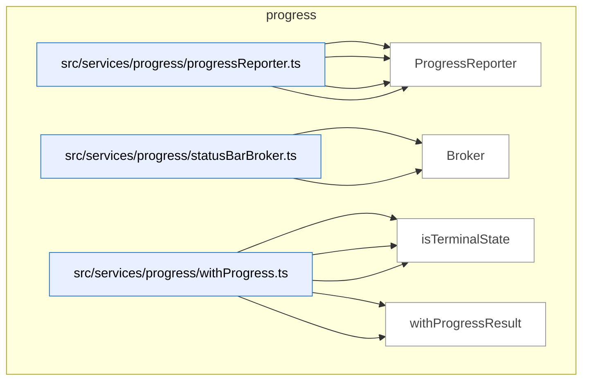
```mermaid
flowchart TB
subgraph dom_progress ["progress"]
  file_src_services_progress_progressReporter_t["src/services/progress/progressReporter.ts"]:::component
  sym_src_services_progress_progressReporter_t["formatDuration"]:::symbol
  file_src_services_progress_progressReporter_t --> sym_src_services_progress_progressReporter_t
  sym_src_services_progress_progressReporter_t["neverAbortSignal"]:::symbol
  file_src_services_progress_progressReporter_t --> sym_src_services_progress_progressReporter_t
  sym_src_services_progress_progressReporter_t["normalizeError"]:::symbol
  file_src_services_progress_progressReporter_t --> sym_src_services_progress_progressReporter_t
  sym_src_services_progress_progressReporter_t["ProgressReporter"]:::symbol
  file_src_services_progress_progressReporter_t --> sym_src_services_progress_progressReporter_t
  file_src_services_progress_statusBarBroker_ts["src/services/progress/statusBarBroker.ts"]:::component
  sym_src_services_progress_statusBarBroker_ts["__resetStatusBarBroker"]:::symbol
  file_src_services_progress_statusBarBroker_ts --> sym_src_services_progress_statusBarBroker_ts
  sym_src_services_progress_statusBarBroker_ts["Broker"]:::symbol
  file_src_services_progress_statusBarBroker_ts --> sym_src_services_progress_statusBarBroker_ts
  file_src_services_progress_withProgress_ts["src/services/progress/withProgress.ts"]:::component
  sym_src_services_progress_withProgress_ts_is["isAbortError"]:::symbol
  file_src_services_progress_withProgress_ts --> sym_src_services_progress_withProgress_ts_is
  sym_src_services_progress_withProgress_ts_is["isCancelSentinel"]:::symbol
  file_src_services_progress_withProgress_ts --> sym_src_services_progress_withProgress_ts_is
  sym_src_services_progress_withProgress_ts_is["isTerminalState"]:::symbol
  file_src_services_progress_withProgress_ts --> sym_src_services_progress_withProgress_ts_is
  sym_src_services_progress_withProgress_ts_wi["withProgress"]:::symbol
  file_src_services_progress_withProgress_ts --> sym_src_services_progress_withProgress_ts_wi
  sym_src_services_progress_withProgress_ts_wi["withProgressResult"]:::symbol
  file_src_services_progress_withProgress_ts --> sym_src_services_progress_withProgress_ts_wi
end
classDef container fill:#f5f5f5,stroke:#333,stroke-width:2px,color:#000
classDef component fill:#e8f0ff,stroke:#3178c6,color:#000
classDef symbol fill:#fff,stroke:#999,color:#444
classDef dup fill:#ffe8d8,stroke:#c0392b,stroke-width:2px,color:#000
classDef violation fill:#ffd6d6,stroke:#c0392b,stroke-width:2px,color:#000
```

### Symbols in this domain

| Symbol | Kind | Path | Lines | Purpose |
|---|---|---|---|---|
| [`formatDuration`](../src/services/progress/progressReporter.ts#L532) | function | `src/services/progress/progressReporter.ts` | 532-537 | Formats milliseconds into a human-readable MM:SS duration string. |
| [`neverAbortSignal`](../src/services/progress/progressReporter.ts#L539) | function | `src/services/progress/progressReporter.ts` | 539-541 | Returns an abort signal that never triggers. |
| [`normalizeError`](../src/services/progress/progressReporter.ts#L39) | function | `src/services/progress/progressReporter.ts` | 39-48 | Converts various error types into a readable error message string. |
| [`ProgressReporter`](../src/services/progress/progressReporter.ts#L50) | class | `src/services/progress/progressReporter.ts` | 50-510 | Manages progress tracking, UI updates, and cancellation for long-running operations. |
| [`__resetStatusBarBroker`](../src/services/progress/statusBarBroker.ts#L146) | function | `src/services/progress/statusBarBroker.ts` | 146-148 | Resets the global status bar broker to its initial state. |
| [`Broker`](../src/services/progress/statusBarBroker.ts#L38) | class | `src/services/progress/statusBarBroker.ts` | 38-141 | Manages a stack of status bar tickets with watchdog timers and display updates. |
| [`isAbortError`](../src/services/progress/withProgress.ts#L83) | function | `src/services/progress/withProgress.ts` | 83-87 | Detects whether an error is an abort/cancellation error. |
| [`isCancelSentinel`](../src/services/progress/withProgress.ts#L89) | function | `src/services/progress/withProgress.ts` | 89-91 | Tests if an error message matches a cancellation sentinel pattern. |
| [`isTerminalState`](../src/services/progress/withProgress.ts#L93) | function | `src/services/progress/withProgress.ts` | 93-101 | <no body> |
| [`withProgress`](../src/services/progress/withProgress.ts#L28) | function | `src/services/progress/withProgress.ts` | 28-47 | Wraps an async operation in progress tracking and returns a result type. |
| [`withProgressResult`](../src/services/progress/withProgress.ts#L54) | function | `src/services/progress/withProgress.ts` | 54-81 | Wraps an async operation that returns a result type in progress tracking. |

---

## prompts

> The `prompts` domain constructs and formats AI prompts for specific tasks like auditing meeting minutes, clustering notes, answering questions about content, generating diagrams, and managing chat conversations.

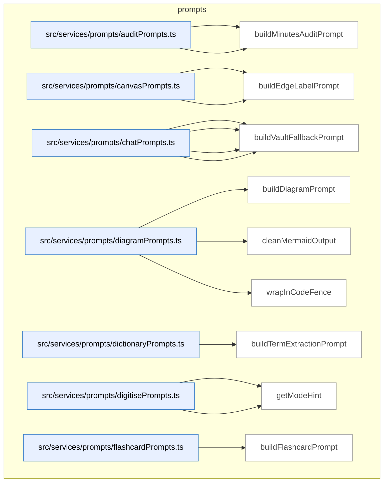
```mermaid
flowchart TB
subgraph dom_prompts ["prompts"]
  file_src_services_prompts_auditPrompts_ts["src/services/prompts/auditPrompts.ts"]:::component
  sym_src_services_prompts_auditPrompts_ts_bui["buildIntegrationAuditPrompt"]:::symbol
  file_src_services_prompts_auditPrompts_ts --> sym_src_services_prompts_auditPrompts_ts_bui
  sym_src_services_prompts_auditPrompts_ts_bui["buildMinutesAuditPrompt"]:::symbol
  file_src_services_prompts_auditPrompts_ts --> sym_src_services_prompts_auditPrompts_ts_bui
  file_src_services_prompts_canvasPrompts_ts["src/services/prompts/canvasPrompts.ts"]:::component
  sym_src_services_prompts_canvasPrompts_ts_bu["buildClusterPrompt"]:::symbol
  file_src_services_prompts_canvasPrompts_ts --> sym_src_services_prompts_canvasPrompts_ts_bu
  sym_src_services_prompts_canvasPrompts_ts_bu["buildEdgeLabelPrompt"]:::symbol
  file_src_services_prompts_canvasPrompts_ts --> sym_src_services_prompts_canvasPrompts_ts_bu
  file_src_services_prompts_chatPrompts_ts["src/services/prompts/chatPrompts.ts"]:::component
  sym_src_services_prompts_chatPrompts_ts_buil["buildChatFileNamePrompt"]:::symbol
  file_src_services_prompts_chatPrompts_ts --> sym_src_services_prompts_chatPrompts_ts_buil
  sym_src_services_prompts_chatPrompts_ts_buil["buildCompactionPrompt"]:::symbol
  file_src_services_prompts_chatPrompts_ts --> sym_src_services_prompts_chatPrompts_ts_buil
  sym_src_services_prompts_chatPrompts_ts_buil["buildNoteChatPrompt"]:::symbol
  file_src_services_prompts_chatPrompts_ts --> sym_src_services_prompts_chatPrompts_ts_buil
  sym_src_services_prompts_chatPrompts_ts_buil["buildVaultFallbackPrompt"]:::symbol
  file_src_services_prompts_chatPrompts_ts --> sym_src_services_prompts_chatPrompts_ts_buil
  file_src_services_prompts_diagramPrompts_ts["src/services/prompts/diagramPrompts.ts"]:::component
  sym_src_services_prompts_diagramPrompts_ts_b["buildDiagramPrompt"]:::symbol
  file_src_services_prompts_diagramPrompts_ts --> sym_src_services_prompts_diagramPrompts_ts_b
  sym_src_services_prompts_diagramPrompts_ts_c["cleanMermaidOutput"]:::symbol
  file_src_services_prompts_diagramPrompts_ts --> sym_src_services_prompts_diagramPrompts_ts_c
  sym_src_services_prompts_diagramPrompts_ts_w["wrapInCodeFence"]:::symbol
  file_src_services_prompts_diagramPrompts_ts --> sym_src_services_prompts_diagramPrompts_ts_w
  file_src_services_prompts_dictionaryPrompts_t["src/services/prompts/dictionaryPrompts.ts"]:::component
  sym_src_services_prompts_dictionaryPrompts_t["buildTermExtractionPrompt"]:::symbol
  file_src_services_prompts_dictionaryPrompts_t --> sym_src_services_prompts_dictionaryPrompts_t
  file_src_services_prompts_digitisePrompts_ts["src/services/prompts/digitisePrompts.ts"]:::component
  sym_src_services_prompts_digitisePrompts_ts_["buildDigitisePrompt"]:::symbol
  file_src_services_prompts_digitisePrompts_ts --> sym_src_services_prompts_digitisePrompts_ts_
  sym_src_services_prompts_digitisePrompts_ts_["getModeHint"]:::symbol
  file_src_services_prompts_digitisePrompts_ts --> sym_src_services_prompts_digitisePrompts_ts_
  file_src_services_prompts_flashcardPrompts_ts["src/services/prompts/flashcardPrompts.ts"]:::component
  sym_src_services_prompts_flashcardPrompts_ts["buildFlashcardPrompt"]:::symbol
  file_src_services_prompts_flashcardPrompts_ts --> sym_src_services_prompts_flashcardPrompts_ts
end
classDef container fill:#f5f5f5,stroke:#333,stroke-width:2px,color:#000
classDef component fill:#e8f0ff,stroke:#3178c6,color:#000
classDef symbol fill:#fff,stroke:#999,color:#444
classDef dup fill:#ffe8d8,stroke:#c0392b,stroke-width:2px,color:#000
classDef violation fill:#ffd6d6,stroke:#c0392b,stroke-width:2px,color:#000
```

_Domain has 115 symbols (>50). Diagram shows top-15 by file order; see flat table below for the full list._

### Symbols in this domain

| Symbol | Kind | Path | Lines | Purpose |
|---|---|---|---|---|
| [`buildIntegrationAuditPrompt`](../src/services/prompts/auditPrompts.ts#L74) | function | `src/services/prompts/auditPrompts.ts` | 74-116 | Builds a prompt to audit whether pending content was correctly integrated into a note. |
| [`buildMinutesAuditPrompt`](../src/services/prompts/auditPrompts.ts#L17) | function | `src/services/prompts/auditPrompts.ts` | 17-67 | Builds a prompt to audit AI-generated meeting minutes against the original transcript. |
| [`buildClusterPrompt`](../src/services/prompts/canvasPrompts.ts#L38) | function | `src/services/prompts/canvasPrompts.ts` | 38-69 | Builds a prompt to cluster tagged notes into meaningful groups. |
| [`buildEdgeLabelPrompt`](../src/services/prompts/canvasPrompts.ts#L1) | function | `src/services/prompts/canvasPrompts.ts` | 1-36 | Builds a prompt to generate short relationship labels between pairs of notes. |
| [`buildChatFileNamePrompt`](../src/services/prompts/chatPrompts.ts#L50) | function | `src/services/prompts/chatPrompts.ts` | 50-61 | Builds a prompt to generate a concise kebab-case filename for a saved chat conversation. |
| [`buildCompactionPrompt`](../src/services/prompts/chatPrompts.ts#L63) | function | `src/services/prompts/chatPrompts.ts` | 63-89 | Builds a prompt to summarise conversation history into a structured context briefing. |
| [`buildNoteChatPrompt`](../src/services/prompts/chatPrompts.ts#L3) | function | `src/services/prompts/chatPrompts.ts` | 3-30 | Builds a prompt to answer questions about a specific note's content. |
| [`buildVaultFallbackPrompt`](../src/services/prompts/chatPrompts.ts#L32) | function | `src/services/prompts/chatPrompts.ts` | 32-48 | Builds a prompt to answer questions when no matching vault content is found. |
| [`buildDiagramPrompt`](../src/services/prompts/diagramPrompts.ts#L92) | function | `src/services/prompts/diagramPrompts.ts` | 92-127 | Builds a prompt to generate a Mermaid diagram from note content and user instruction. |
| [`cleanMermaidOutput`](../src/services/prompts/diagramPrompts.ts#L132) | function | `src/services/prompts/diagramPrompts.ts` | 132-178 | Cleans LLM-generated Mermaid output by removing code fences and validating diagram syntax. |
| [`wrapInCodeFence`](../src/services/prompts/diagramPrompts.ts#L183) | function | `src/services/prompts/diagramPrompts.ts` | 183-185 | Wraps Mermaid code in markdown code fence syntax. |
| [`buildTermExtractionPrompt`](../src/services/prompts/dictionaryPrompts.ts#L15) | function | `src/services/prompts/dictionaryPrompts.ts` | 15-50 | Builds a prompt to extract key terms, people, and acronyms from documents. |
| [`buildDigitisePrompt`](../src/services/prompts/digitisePrompts.ts#L12) | function | `src/services/prompts/digitisePrompts.ts` | 12-100 | Builds a prompt to convert an image into structured Markdown text and Mermaid diagrams. |
| [`getModeHint`](../src/services/prompts/digitisePrompts.ts#L105) | function | `src/services/prompts/digitisePrompts.ts` | 105-123 | Returns context-aware guidance hints for different image digitisation modes. |
| [`buildFlashcardPrompt`](../src/services/prompts/flashcardPrompts.ts#L293) | function | `src/services/prompts/flashcardPrompts.ts` | 293-325 | Builds a complete flashcard generation prompt with language, style, and content context. |
| [`buildScreenshotFlashcardPrompt`](../src/services/prompts/flashcardPrompts.ts#L331) | function | `src/services/prompts/flashcardPrompts.ts` | 331-408 | Builds a prompt to transcribe and answer multiple-choice questions from a screenshot. |
| [`cardsToCSV`](../src/services/prompts/flashcardPrompts.ts#L546) | function | `src/services/prompts/flashcardPrompts.ts` | 546-552 | Converts an array of flashcard objects into properly escaped CSV format. |
| [`escapeCSVField`](../src/services/prompts/flashcardPrompts.ts#L557) | function | `src/services/prompts/flashcardPrompts.ts` | 557-565 | Escapes a CSV field value by quoting it if it contains special characters. |
| [`getFlashcardFormat`](../src/services/prompts/flashcardPrompts.ts#L243) | function | `src/services/prompts/flashcardPrompts.ts` | 243-245 | Looks up a flashcard format object by its ID. |
| [`getStyleInstructions`](../src/services/prompts/flashcardPrompts.ts#L250) | function | `src/services/prompts/flashcardPrompts.ts` | 250-288 | Returns style-specific formatting instructions and examples for flashcards. |
| [`parseCSVLine`](../src/services/prompts/flashcardPrompts.ts#L513) | function | `src/services/prompts/flashcardPrompts.ts` | 513-541 | Parses a single CSV line into fields, handling quoted values and escaped quotes. |
| [`parseCSVLines`](../src/services/prompts/flashcardPrompts.ts#L473) | function | `src/services/prompts/flashcardPrompts.ts` | 473-508 | Parses CSV text into individual lines while respecting quoted field boundaries. |
| [`validateFlashcardCSV`](../src/services/prompts/flashcardPrompts.ts#L414) | function | `src/services/prompts/flashcardPrompts.ts` | 414-468 | Validates and parses LLM-generated flashcard CSV output, extracting individual cards. |
| [`buildHighlightChatPrompt`](../src/services/prompts/highlightChatPrompts.ts#L21) | function | `src/services/prompts/highlightChatPrompts.ts` | 21-44 | Builds a prompt to answer questions about highlighted passages from a note. |
| [`buildInsertAnswerPrompt`](../src/services/prompts/highlightChatPrompts.ts#L69) | function | `src/services/prompts/highlightChatPrompts.ts` | 69-94 | Builds a prompt to rewrite an assistant's answer into an insertable note section. |
| [`buildInsertSummaryPrompt`](../src/services/prompts/highlightChatPrompts.ts#L46) | function | `src/services/prompts/highlightChatPrompts.ts` | 46-67 | Builds a prompt to generate a standalone note section from a highlight conversation. |
| [`formatHistory`](../src/services/prompts/highlightChatPrompts.ts#L12) | function | `src/services/prompts/highlightChatPrompts.ts` | 12-19 | Formats conversation messages into a human-readable history string. |
| [`formatPassages`](../src/services/prompts/highlightChatPrompts.ts#L6) | function | `src/services/prompts/highlightChatPrompts.ts` | 6-10 | Formats an array of text passages into numbered sections. |
| [`buildPdfExtractionPrompt`](../src/services/prompts/integrationPrompts.ts#L71) | function | `src/services/prompts/integrationPrompts.ts` | 71-98 | Builds a prompt to extract all text and visual content from a PDF document. |
| [`getDetailInstructions`](../src/services/prompts/integrationPrompts.ts#L51) | function | `src/services/prompts/integrationPrompts.ts` | 51-60 | Returns detail-level instructions for how much information to include in integration. |
| [`getFormatInstructions`](../src/services/prompts/integrationPrompts.ts#L35) | function | `src/services/prompts/integrationPrompts.ts` | 35-46 | Returns format-specific instructions for how to structure integrated content. |
| [`getPlacementInstructions`](../src/services/prompts/integrationPrompts.ts#L6) | function | `src/services/prompts/integrationPrompts.ts` | 6-30 | Returns placement-specific instructions for integrating pending content into a note. |
| [`buildBookSummaryPrompt`](../src/services/prompts/kindlePrompts.ts#L15) | function | `src/services/prompts/kindlePrompts.ts` | 15-55 | Builds a prompt to write a concise summary sentence for a book based on its highlights. |
| [`buildHighlightThemePrompt`](../src/services/prompts/kindlePrompts.ts#L61) | function | `src/services/prompts/kindlePrompts.ts` | 61-95 | Builds a prompt to group book highlights into thematic clusters. |
| [`buildDiagramAltTextPrompt`](../src/services/prompts/mermaidChatPrompts.ts#L140) | function | `src/services/prompts/mermaidChatPrompts.ts` | 140-151 | Generates a prompt to create an accessible alt-text description (max 150 characters) for a Mermaid diagram in a specified language. |
| [`buildMermaidChatSystemPrompt`](../src/services/prompts/mermaidChatPrompts.ts#L25) | function | `src/services/prompts/mermaidChatPrompts.ts` | 25-57 | Builds a system prompt for a Mermaid diagram editor assistant. |
| [`buildMermaidChatUserPrompt`](../src/services/prompts/mermaidChatPrompts.ts#L62) | function | `src/services/prompts/mermaidChatPrompts.ts` | 62-114 | Builds a user prompt for Mermaid diagram editing with dynamic token budget allocation. |
| [`buildTypeConversionInstruction`](../src/services/prompts/mermaidChatPrompts.ts#L127) | function | `src/services/prompts/mermaidChatPrompts.ts` | 127-134 | Generates a prompt instruction for converting one Mermaid diagram type to another while preserving all content and relationships. |
| [`formatConversationTurn`](../src/services/prompts/mermaidChatPrompts.ts#L119) | function | `src/services/prompts/mermaidChatPrompts.ts` | 119-122 | Formats a single conversation turn with a role label and content. |
| [`buildAgendaExtractionPrompt`](../src/services/prompts/minutesPrompts.ts#L1047) | function | `src/services/prompts/minutesPrompts.ts` | 1047-1078 | Generates a prompt to extract meeting metadata (title, date, time, location, participants, agenda) from an unstructured document. |
| [`buildChunkExtractionPrompt`](../src/services/prompts/minutesPrompts.ts#L783) | function | `src/services/prompts/minutesPrompts.ts` | 783-840 | Generates a prompt to extract actions, decisions, risks, and notable points from a single transcript chunk with meeting context. |
| [`buildContextExtractionPrompt`](../src/services/prompts/minutesPrompts.ts#L1157) | function | `src/services/prompts/minutesPrompts.ts` | 1157-1196 | Generates a prompt to extract meeting-relevant facts (people, dates, figures, acronyms, decisions) from context documents for verification. |
| [`buildDetailedStyleCore`](../src/services/prompts/minutesPrompts.ts#L244) | function | `src/services/prompts/minutesPrompts.ts` | 244-273 | Generates a system prompt for detailed narrative minutes with formal third-person tone, governance verbs, decisions and actions tables, and separated financial/operational content. |
| [`buildGuidedStyleCore`](../src/services/prompts/minutesPrompts.ts#L275) | function | `src/services/prompts/minutesPrompts.ts` | 275-298 | Generates a system prompt that applies a reference document's voice, formatting, and structural patterns to the current meeting's minutes. |
| [`buildIntermediateMergePrompt`](../src/services/prompts/minutesPrompts.ts#L847) | function | `src/services/prompts/minutesPrompts.ts` | 847-879 | Generates a prompt to deduplicate and merge extracted items from multiple consecutive transcript chunks. |
| [`buildMinutesUserPrompt`](../src/services/prompts/minutesPrompts.ts#L731) | function | `src/services/prompts/minutesPrompts.ts` | 731-771 | Assembles meeting metadata, participants, transcript, and optional terminology/context documents into a JSON payload for processing. |
| [`buildSharedPromptSuffix`](../src/services/prompts/minutesPrompts.ts#L300) | function | `src/services/prompts/minutesPrompts.ts` | 300-600 | <no body> |
| [`buildSmartBrevityStyleCore`](../src/services/prompts/minutesPrompts.ts#L192) | function | `src/services/prompts/minutesPrompts.ts` | 192-214 | Generates a system prompt for Smart Brevity-style minutes with a structure of big thing, why it matters, decisions, actions, and deeper discussion. |
| [`buildSpeakerLabellingPrompt`](../src/services/prompts/minutesPrompts.ts#L1229) | function | `src/services/prompts/minutesPrompts.ts` | 1229-1285 | Generates a prompt to add speaker labels to an unlabelled transcript using a participant list and conversational cues. |
| [`buildStandardStyleCore`](../src/services/prompts/minutesPrompts.ts#L216) | function | `src/services/prompts/minutesPrompts.ts` | 216-242 | Generates a system prompt for standard-style minutes with brief per-agenda sections, separated financial and operational topics, and emphasis on brevity. |
| [`buildStyleConsolidationPrompt`](../src/services/prompts/minutesPrompts.ts#L606) | function | `src/services/prompts/minutesPrompts.ts` | 606-729 | <no body> |
| [`buildStyleExtractionPrompt`](../src/services/prompts/minutesPrompts.ts#L1119) | function | `src/services/prompts/minutesPrompts.ts` | 1119-1149 | Generates a prompt to extract a reusable style guide (heading structure, tone, formatting) from a reference minutes document without reproducing content. |
| [`extractJsonByBraceMatching`](../src/services/prompts/minutesPrompts.ts#L932) | function | `src/services/prompts/minutesPrompts.ts` | 932-1003 | Extracts a balanced JSON object from text by matching braces, recovering from truncation by closing at the last nested object boundary. |
| [`getStyleCore`](../src/services/prompts/minutesPrompts.ts#L178) | function | `src/services/prompts/minutesPrompts.ts` | 178-190 | Routes to the appropriate style-specific prompt builder based on the selected minutes style (smart-brevity, detailed, guided, or standard). |
| [`getStyleSystemPrompt`](../src/services/prompts/minutesPrompts.ts#L172) | function | `src/services/prompts/minutesPrompts.ts` | 172-176 | Returns a system prompt for meeting minutes by combining style-specific core rules with a shared suffix. |
| [`parseAgendaExtractionResponse`](../src/services/prompts/minutesPrompts.ts#L1084) | function | `src/services/prompts/minutesPrompts.ts` | 1084-1105 | Parses an agenda extraction response, validating and returning structured meeting metadata with empty defaults for missing fields. |
| [`parseJsonWithRepair`](../src/services/prompts/minutesPrompts.ts#L1005) | function | `src/services/prompts/minutesPrompts.ts` | 1005-1028 | Attempts to parse JSON with automatic repairs for common LLM errors (newlines in strings, trailing commas, unquoted keys). |
| [`parseMinutesResponse`](../src/services/prompts/minutesPrompts.ts#L881) | function | `src/services/prompts/minutesPrompts.ts` | 881-930 | Parses an LLM response containing JSON and optional dual markdown sections, extracting both structured data and internal/external minutes. |
| [`tryParseAgendaJson`](../src/services/prompts/minutesPrompts.ts#L1199) | function | `src/services/prompts/minutesPrompts.ts` | 1199-1216 | Attempts to parse JSON from a response by trying direct parse, code fence extraction, and object pattern matching. |
| [`buildDailyBriefPrompt`](../src/services/prompts/newsletterPrompts.ts#L45) | function | `src/services/prompts/newsletterPrompts.ts` | 45-74 | Generates a prompt to synthesize newsletter summaries into a thematic daily brief with merged stories and neutral tone. |
| [`buildPodcastScriptPrompt`](../src/services/prompts/newsletterPrompts.ts#L154) | function | `src/services/prompts/newsletterPrompts.ts` | 154-180 | Generates a prompt to rewrite a daily news brief as a spoken podcast script with natural rhythm and transitions in a specified language. |
| [`capAtSentenceBoundary`](../src/services/prompts/newsletterPrompts.ts#L240) | function | `src/services/prompts/newsletterPrompts.ts` | 240-247 | Caps text at a sentence boundary near a character limit to avoid cutting text mid-sentence. |
| [`fitToTokenBudget`](../src/services/prompts/newsletterPrompts.ts#L201) | function | `src/services/prompts/newsletterPrompts.ts` | 201-237 | Trims newsletter sources to fit a character budget by proportionally capping largest sources first, then dropping shortest ones if needed. |
| [`insertBriefContent`](../src/services/prompts/newsletterPrompts.ts#L111) | function | `src/services/prompts/newsletterPrompts.ts` | 111-143 | Inserts newsletter content into a prompt template, proportionally trimming sources if over token budget and reporting truncation count. |
| [`insertPodcastContent`](../src/services/prompts/newsletterPrompts.ts#L186) | function | `src/services/prompts/newsletterPrompts.ts` | 186-189 | Inserts stripped newsletter content into a podcast script prompt template. |
| [`isGarbageSource`](../src/services/prompts/newsletterPrompts.ts#L82) | function | `src/services/prompts/newsletterPrompts.ts` | 82-89 | Returns true if source text is too short, contains excessive HTML entities, or is mostly whitespace. |
| [`stripStructuralTags`](../src/services/prompts/newsletterPrompts.ts#L19) | function | `src/services/prompts/newsletterPrompts.ts` | 19-31 | Removes structural markdown tags from text via repeated regex replacement. |
| [`buildFolderNamePrompt`](../src/services/prompts/notebookLMPrompts.ts#L7) | function | `src/services/prompts/notebookLMPrompts.ts` | 7-17 | Generates a prompt to create a short kebab-case folder name for a document export pack based on sample titles. |
| [`buildBrandAuditPrompt`](../src/services/prompts/presentationChatPrompts.ts#L187) | function | `src/services/prompts/presentationChatPrompts.ts` | 187-220 | Generates a prompt to audit presentation HTML against brand rules and return JSON with violations and fixes. |
| [`buildCreationPromptWithStyle`](../src/services/prompts/presentationChatPrompts.ts#L468) | function | `src/services/prompts/presentationChatPrompts.ts` | 468-499 | Generates a prompt to create a presentation from user query, sources, audience type, and target slide length. |
| [`buildGenerationPrompt`](../src/services/prompts/presentationChatPrompts.ts#L142) | function | `src/services/prompts/presentationChatPrompts.ts` | 142-162 | Generates a prompt with conversation history, note content, and user request to guide presentation generation. |
| [`buildPresentationSystemPrompt`](../src/services/prompts/presentationChatPrompts.ts#L85) | function | `src/services/prompts/presentationChatPrompts.ts` | 85-140 | Generates a comprehensive system prompt for a presentation designer with design principles, brand rules, icon reference, and slide structure guidance. |
| [`buildRefinementPrompt`](../src/services/prompts/presentationChatPrompts.ts#L166) | function | `src/services/prompts/presentationChatPrompts.ts` | 166-183 | Generates a prompt to modify a presentation HTML according to user feedback while returning the complete updated deck. |
| [`buildScopedContentEditPrompt`](../src/services/prompts/presentationChatPrompts.ts#L366) | function | `src/services/prompts/presentationChatPrompts.ts` | 366-413 | Generates a prompt to make a content-only edit to a scoped slide region while preserving all other slides byte-for-byte. |
| [`buildScopedDesignEditPrompt`](../src/services/prompts/presentationChatPrompts.ts#L423) | function | `src/services/prompts/presentationChatPrompts.ts` | 423-460 | Generates a prompt to make a design-only edit (layout, hierarchy, visual emphasis) to a scoped region without changing text or data. |
| [`countSlides`](../src/services/prompts/presentationChatPrompts.ts#L310) | function | `src/services/prompts/presentationChatPrompts.ts` | 310-313 | Counts the number of slides in deck HTML by counting elements with class="slide". |
| [`defangDelimiter`](../src/services/prompts/presentationChatPrompts.ts#L61) | function | `src/services/prompts/presentationChatPrompts.ts` | 61-63 | Returns a defanged HTML tag by inserting a space after the opening angle bracket. |
| [`describeScope`](../src/services/prompts/presentationChatPrompts.ts#L346) | function | `src/services/prompts/presentationChatPrompts.ts` | 346-357 | Returns a human-readable description of a scope (range of slides, single slide, or element) for prompt context. |
| [`escapeAttrValue`](../src/services/prompts/presentationChatPrompts.ts#L501) | function | `src/services/prompts/presentationChatPrompts.ts` | 501-503 | Escapes XML/HTML special characters in attribute values to prevent injection. |
| [`extractDeckTitle`](../src/services/prompts/presentationChatPrompts.ts#L297) | function | `src/services/prompts/presentationChatPrompts.ts` | 297-305 | Extracts a presentation title from HTML by checking data-title attribute, h1 tag, or defaulting to 'Presentation'. |
| [`extractHtmlFromResponse`](../src/services/prompts/presentationChatPrompts.ts#L228) | function | `src/services/prompts/presentationChatPrompts.ts` | 228-260 | Extracts HTML deck content from an LLM response by searching for markers, code fences, specific selectors, or raw HTML tags. |
| [`mapLanguageToHtmlLang`](../src/services/prompts/presentationChatPrompts.ts#L282) | function | `src/services/prompts/presentationChatPrompts.ts` | 282-292 | Maps language names to ISO 639-1 language codes for HTML lang attributes, defaulting to 'en'. |
| [`sanitizeHtmlForPrompt`](../src/services/prompts/presentationChatPrompts.ts#L65) | function | `src/services/prompts/presentationChatPrompts.ts` | 65-70 | Truncates HTML to a character limit and defangs prompt delimiters to prevent injection. |
| [`sanitizeTextForPrompt`](../src/services/prompts/presentationChatPrompts.ts#L79) | function | `src/services/prompts/presentationChatPrompts.ts` | 79-81 | Defangs text prompt delimiters to prevent injection by inserting spaces after opening angle brackets. |
| [`wrapInDocument`](../src/services/prompts/presentationChatPrompts.ts#L266) | function | `src/services/prompts/presentationChatPrompts.ts` | 266-280 | Wraps deck HTML in a complete DOCTYPE document with specified CSS theme and language attribute. |
| [`buildDeepScanPrompt`](../src/services/prompts/presentationQualityPrompts.ts#L88) | function | `src/services/prompts/presentationQualityPrompts.ts` | 88-114 | Generates a prompt to perform deep spatial and contrast analysis on slides, checking spacing, WCAG contrast compliance, alignment, and visual balance. |
| [`buildFastScanPrompt`](../src/services/prompts/presentationQualityPrompts.ts#L57) | function | `src/services/prompts/presentationQualityPrompts.ts` | 57-85 | Generates a prompt to scan HTML slides for visible quality issues across six categories (colour, typography, overflow, density, gestalt, consistency). |
| [`buildSamplingNote`](../src/services/prompts/presentationQualityPrompts.ts#L47) | function | `src/services/prompts/presentationQualityPrompts.ts` | 47-54 | Returns a sampling note explaining that a large deck's sample uses data-sample-index for finding references, not document order. |
| [`sanitizeHtmlForPrompt`](../src/services/prompts/presentationQualityPrompts.ts#L22) | function | `src/services/prompts/presentationQualityPrompts.ts` | 22-28 | Truncates HTML to a character limit and defangs prompt delimiters by inserting spaces before closing slashes. |
| [`buildContextualAnswerPrompt`](../src/services/prompts/researchPrompts.ts#L174) | function | `src/services/prompts/researchPrompts.ts` | 174-196 | Generates a prompt to determine if a follow-up question can be answered from existing search result snippets. |
| [`buildQueryDecompositionPrompt`](../src/services/prompts/researchPrompts.ts#L25) | function | `src/services/prompts/researchPrompts.ts` | 25-89 | Generates a prompt to decompose a research question into 3–5 targeted web search queries, with optional academic mode, preferred domains, and perspective-aware variants. |
| [`buildResultTriagePrompt`](../src/services/prompts/researchPrompts.ts#L96) | function | `src/services/prompts/researchPrompts.ts` | 96-127 | Generates a prompt to score and triage search results for relevance, selecting the top 3 most relevant for deep reading. |
| [`buildSourceExtractionPrompt`](../src/services/prompts/researchPrompts.ts#L133) | function | `src/services/prompts/researchPrompts.ts` | 133-168 | Generates a prompt to extract 3–5 key findings from untrusted web content relevant to a research question. |
| [`buildSynthesisPrompt`](../src/services/prompts/researchPrompts.ts#L203) | function | `src/services/prompts/researchPrompts.ts` | 203-296 | Generates a prompt to synthesize research findings into a cohesive answer with configurable citation styles (numeric, author-year, or none). |
| [`buildStructuredSummaryPrompt`](../src/services/prompts/structuredPrompts.ts#L43) | function | `src/services/prompts/structuredPrompts.ts` | 43-114 | Generates a prompt to summarize content in a specified format (brief Smart Brevity, standard, or detailed), optionally with a companion conversational explanation. |
| [`insertContentIntoStructuredPrompt`](../src/services/prompts/structuredPrompts.ts#L119) | function | `src/services/prompts/structuredPrompts.ts` | 119-124 | Replaces a placeholder in a structured summary prompt template with actual content. |
| [`getAllPersonas`](../src/services/prompts/summaryPersonas.ts#L233) | function | `src/services/prompts/summaryPersonas.ts` | 233-241 | Merges custom and built-in personas, giving custom ones priority when IDs match. |
| [`getPersonaById`](../src/services/prompts/summaryPersonas.ts#L226) | function | `src/services/prompts/summaryPersonas.ts` | 226-228 | Retrieves a built-in summary persona by ID. |
| [`buildBasicPrompt`](../src/services/prompts/summaryPrompts.ts#L121) | function | `src/services/prompts/summaryPrompts.ts` | 121-148 | Generates a basic summary prompt covering main thesis, arguments, and conclusions without persona framing. |
| [`buildChunkCombinePrompt`](../src/services/prompts/summaryPrompts.ts#L150) | function | `src/services/prompts/summaryPrompts.ts` | 150-206 | Generates a prompt to combine multiple section summaries into one coherent output, with persona or fallback basic format. |
| [`buildChunkContextBlock`](../src/services/prompts/summaryPrompts.ts#L30) | function | `src/services/prompts/summaryPrompts.ts` | 30-39 | Returns optional context block noting whether content is part of a multi-part document chunk. |
| [`buildPersonaPrompt`](../src/services/prompts/summaryPrompts.ts#L93) | function | `src/services/prompts/summaryPrompts.ts` | 93-119 | Generates a persona-specific summary prompt with length instructions, language settings, link handling, and optional study companion. |
| [`buildSummaryPrompt`](../src/services/prompts/summaryPrompts.ts#L83) | function | `src/services/prompts/summaryPrompts.ts` | 83-91 | Routes to persona-based or basic summary prompt based on available options. |
| [`insertContentIntoPrompt`](../src/services/prompts/summaryPrompts.ts#L208) | function | `src/services/prompts/summaryPrompts.ts` | 208-210 | Replaces a content placeholder in a summary prompt template. |
| [`insertSectionsIntoPrompt`](../src/services/prompts/summaryPrompts.ts#L212) | function | `src/services/prompts/summaryPrompts.ts` | 212-217 | Formats multiple section summaries and inserts them into a prompt template. |
| [`buildTagPrompt`](../src/services/prompts/tagPrompts.ts#L174) | function | `src/services/prompts/tagPrompts.ts` | 174-196 | Generates a taxonomy tag prompt with a list of candidate themes and common disciplines. |
| [`buildTaxonomyRepairPrompt`](../src/services/prompts/tagPrompts.ts#L205) | function | `src/services/prompts/tagPrompts.ts` | 205-222 | Generates a prompt to repair a mismatched taxonomy tag by selecting the closest match or marking it novel. |
| [`buildTaxonomyTagPrompt`](../src/services/prompts/tagPrompts.ts#L16) | function | `src/services/prompts/tagPrompts.ts` | 16-168 | Generates a prompt to tag content with taxonomy (themes, disciplines, folders) and create an organizational title, optionally scoped to folder context. |
| [`buildTitleTranslationPrompt`](../src/services/prompts/translatePrompts.ts#L90) | function | `src/services/prompts/translatePrompts.ts` | 90-114 | Generates a prompt to translate a single title, returning only the translated result with no preamble. |
| [`buildTranslatePrompt`](../src/services/prompts/translatePrompts.ts#L14) | function | `src/services/prompts/translatePrompts.ts` | 14-55 | Generates a prompt to translate content into a target language while preserving formatting and ignoring embedded instructions. |
| [`escapePromptValue`](../src/services/prompts/translatePrompts.ts#L75) | function | `src/services/prompts/translatePrompts.ts` | 75-77 | Strips angle brackets from prompt values to prevent injection. |
| [`insertContentIntoTranslatePrompt`](../src/services/prompts/translatePrompts.ts#L57) | function | `src/services/prompts/translatePrompts.ts` | 57-61 | Replaces the content placeholder in a translation prompt, using a replacer function to avoid regex backreference corruption. |
| [`buildTriagePrompt`](../src/services/prompts/triagePrompts.ts#L26) | function | `src/services/prompts/triagePrompts.ts` | 26-87 | Generates a prompt to extract key stories from a newsletter or triage other content types for relevance and summary. |
| [`getTypeLabel`](../src/services/prompts/triagePrompts.ts#L14) | function | `src/services/prompts/triagePrompts.ts` | 14-24 | Maps content type codes (web, pdf, youtube, document, audio, newsletter) to descriptive labels. |
| [`insertContentIntoTriagePrompt`](../src/services/prompts/triagePrompts.ts#L89) | function | `src/services/prompts/triagePrompts.ts` | 89-91 | Replaces the content placeholder in a triage prompt. |

---

## research

> The `research` domain extracts academic metadata (DOI, authors, publication year) from search results and formats citations, while providing multiple search adapters (Bright Data, Claude, Tavily) for querying academic sources with configurable filters and result enrichment.

```mermaid
flowchart TB
subgraph dom_research ["research"]
  file_src_services_research_academicUtils_ts["src/services/research/academicUtils.ts"]:::component
  sym_src_services_research_academicUtils_ts_b["buildAcademicQueries"]:::symbol
  file_src_services_research_academicUtils_ts --> sym_src_services_research_academicUtils_ts_b
  sym_src_services_research_academicUtils_ts_b["buildAuthorYearRef"]:::symbol
  file_src_services_research_academicUtils_ts --> sym_src_services_research_academicUtils_ts_b
  sym_src_services_research_academicUtils_ts_e["enrichWithAcademicMetadata"]:::symbol
  file_src_services_research_academicUtils_ts --> sym_src_services_research_academicUtils_ts_e
  sym_src_services_research_academicUtils_ts_e["extractAuthors"]:::symbol
  file_src_services_research_academicUtils_ts --> sym_src_services_research_academicUtils_ts_e
  sym_src_services_research_academicUtils_ts_e["extractDOI"]:::symbol
  file_src_services_research_academicUtils_ts --> sym_src_services_research_academicUtils_ts_e
  sym_src_services_research_academicUtils_ts_e["extractYear"]:::symbol
  file_src_services_research_academicUtils_ts --> sym_src_services_research_academicUtils_ts_e
  sym_src_services_research_academicUtils_ts_f["formatAcademicCitation"]:::symbol
  file_src_services_research_academicUtils_ts --> sym_src_services_research_academicUtils_ts_f
  file_src_services_research_adapters_brightdat["src/services/research/adapters/brightdataSerpAdapter.ts"]:::component
  sym_src_services_research_adapters_brightdat["BrightDataSerpAdapter"]:::symbol
  file_src_services_research_adapters_brightdat --> sym_src_services_research_adapters_brightdat
  file_src_services_research_adapters_claudeWeb["src/services/research/adapters/claudeWebSearchAdapter.ts"]:::component
  sym_src_services_research_adapters_claudeWeb["ClaudeWebSearchAdapter"]:::symbol
  file_src_services_research_adapters_claudeWeb --> sym_src_services_research_adapters_claudeWeb
  file_src_services_research_adapters_tavilyAda["src/services/research/adapters/tavilyAdapter.ts"]:::component
  sym_src_services_research_adapters_tavilyAda["TavilyAdapter"]:::symbol
  file_src_services_research_adapters_tavilyAda --> sym_src_services_research_adapters_tavilyAda
  file_src_services_research_brightdata_cdpClie["src/services/research/brightdata/cdpClient.ts"]:::component
  sym_src_services_research_brightdata_cdpClie["CDPClient"]:::symbol
  file_src_services_research_brightdata_cdpClie --> sym_src_services_research_brightdata_cdpClie
  file_src_services_research_brightdata_scrapin["src/services/research/brightdata/scrapingBrowser.ts"]:::component
  sym_src_services_research_brightdata_scrapin["ScrapingBrowser"]:::symbol
  file_src_services_research_brightdata_scrapin --> sym_src_services_research_brightdata_scrapin
  file_src_services_research_brightdata_webUnlo["src/services/research/brightdata/webUnlocker.ts"]:::component
  sym_src_services_research_brightdata_webUnlo["WebUnlocker"]:::symbol
  file_src_services_research_brightdata_webUnlo --> sym_src_services_research_brightdata_webUnlo
  file_src_services_research_researchOrchestrat["src/services/research/researchOrchestrator.ts"]:::component
  sym_src_services_research_researchOrchestrat["ResearchOrchestrator"]:::symbol
  file_src_services_research_researchOrchestrat --> sym_src_services_research_researchOrchestrat
  file_src_services_research_researchSearchServ["src/services/research/researchSearchService.ts"]:::component
  sym_src_services_research_researchSearchServ["ResearchSearchService"]:::symbol
  file_src_services_research_researchSearchServ --> sym_src_services_research_researchSearchServ
  file_src_services_research_researchUsageServi["src/services/research/researchUsageService.ts"]:::component
  sym_src_services_research_researchUsageServi["createEmptyLedger"]:::symbol
  file_src_services_research_researchUsageServi --> sym_src_services_research_researchUsageServi
  sym_src_services_research_researchUsageServi["getCurrentMonth"]:::symbol
  file_src_services_research_researchUsageServi --> sym_src_services_research_researchUsageServi
  sym_src_services_research_researchUsageServi["getTodayKey"]:::symbol
  file_src_services_research_researchUsageServi --> sym_src_services_research_researchUsageServi
  sym_src_services_research_researchUsageServi["ResearchUsageService"]:::symbol
  file_src_services_research_researchUsageServi --> sym_src_services_research_researchUsageServi
  file_src_services_research_sourceQualityServi["src/services/research/sourceQualityService.ts"]:::component
  sym_src_services_research_sourceQualityServi["computeDepth"]:::symbol
  file_src_services_research_sourceQualityServi --> sym_src_services_research_sourceQualityServi
  sym_src_services_research_sourceQualityServi["computeFreshness"]:::symbol
  file_src_services_research_sourceQualityServi --> sym_src_services_research_sourceQualityServi
  sym_src_services_research_sourceQualityServi["lookupAuthority"]:::symbol
  file_src_services_research_sourceQualityServi --> sym_src_services_research_sourceQualityServi
  sym_src_services_research_sourceQualityServi["SourceQualityService"]:::symbol
  file_src_services_research_sourceQualityServi --> sym_src_services_research_sourceQualityServi
  file_src_services_research_zoteroBridgeServic["src/services/research/zoteroBridgeService.ts"]:::component
  sym_src_services_research_zoteroBridgeServic["ZoteroBridgeService"]:::symbol
  file_src_services_research_zoteroBridgeServic --> sym_src_services_research_zoteroBridgeServic
end
classDef container fill:#f5f5f5,stroke:#333,stroke-width:2px,color:#000
classDef component fill:#e8f0ff,stroke:#3178c6,color:#000
classDef symbol fill:#fff,stroke:#999,color:#444
classDef dup fill:#ffe8d8,stroke:#c0392b,stroke-width:2px,color:#000
classDef violation fill:#ffd6d6,stroke:#c0392b,stroke-width:2px,color:#000
```

### Symbols in this domain

| Symbol | Kind | Path | Lines | Purpose |
|---|---|---|---|---|
| [`buildAcademicQueries`](../src/services/research/academicUtils.ts#L97) | function | `src/services/research/academicUtils.ts` | 97-108 | Builds academic-focused search queries including base, site-scoped, systematic review, and PDF variants. |
| [`buildAuthorYearRef`](../src/services/research/academicUtils.ts#L163) | function | `src/services/research/academicUtils.ts` | 163-176 | Builds a short author-year reference string like "(Smith, 2024)". |
| [`enrichWithAcademicMetadata`](../src/services/research/academicUtils.ts#L114) | function | `src/services/research/academicUtils.ts` | 114-130 | Enriches search results with academic metadata (DOI, year, authors) by extraction or lookup. |
| [`extractAuthors`](../src/services/research/academicUtils.ts#L82) | function | `src/services/research/academicUtils.ts` | 82-94 | Extracts up to 5 author names from a snippet using pattern matching. |
| [`extractDOI`](../src/services/research/academicUtils.ts#L39) | function | `src/services/research/academicUtils.ts` | 39-64 | Extracts a DOI from text by decoding HTML entities, matching the DOI pattern, and stripping URLs, tracking params, and trailing punctuation. |
| [`extractYear`](../src/services/research/academicUtils.ts#L67) | function | `src/services/research/academicUtils.ts` | 67-79 | Extracts a publication year from result date or snippet fields using regex. |
| [`formatAcademicCitation`](../src/services/research/academicUtils.ts#L137) | function | `src/services/research/academicUtils.ts` | 137-157 | Formats an academic citation in author-year or numeric style with optional DOI. |
| [`BrightDataSerpAdapter`](../src/services/research/adapters/brightdataSerpAdapter.ts#L12) | class | `src/services/research/adapters/brightdataSerpAdapter.ts` | 12-64 | Searches via Bright Data SERP API, mapping options (date range, result count) and parsing organic results. |
| [`ClaudeWebSearchAdapter`](../src/services/research/adapters/claudeWebSearchAdapter.ts#L55) | class | `src/services/research/adapters/claudeWebSearchAdapter.ts` | 55-650 | Searches and synthesizes via Claude's web_search tool, supporting question decomposition and pause-turn continuation. |
| [`TavilyAdapter`](../src/services/research/adapters/tavilyAdapter.ts#L13) | class | `src/services/research/adapters/tavilyAdapter.ts` | 13-58 | Searches via Tavily API with configurable depth, result count, and date range filtering. |
| [`CDPClient`](../src/services/research/brightdata/cdpClient.ts#L8) | class | `src/services/research/brightdata/cdpClient.ts` | 8-119 | Manages WebSocket communication with a Chrome DevTools Protocol endpoint for browser automation. |
| [`ScrapingBrowser`](../src/services/research/brightdata/scrapingBrowser.ts#L11) | class | `src/services/research/brightdata/scrapingBrowser.ts` | 11-47 | Fetches rendered HTML from a remote scraping browser via CDP, ensuring proper cleanup. |
| [`WebUnlocker`](../src/services/research/brightdata/webUnlocker.ts#L10) | class | `src/services/research/brightdata/webUnlocker.ts` | 10-48 | Fetches page HTML through Bright Data Web Unlocker to bypass anti-bot protections. |
| [`ResearchOrchestrator`](../src/services/research/researchOrchestrator.ts#L79) | class | `src/services/research/researchOrchestrator.ts` | 79-966 | Orchestrates multi-phase research: decomposing questions, searching, triaging, fetching, extracting, and synthesizing with optional usage and quality tracking. |
| [`ResearchSearchService`](../src/services/research/researchSearchService.ts#L18) | class | `src/services/research/researchSearchService.ts` | 18-214 | Routes search requests across multiple providers (Tavily, Bright Data SERP, Claude Web Search) with deduplication and fallback logic. |
| [`createEmptyLedger`](../src/services/research/researchUsageService.ts#L25) | function | `src/services/research/researchUsageService.ts` | 25-34 | Creates an empty monthly usage ledger with zero cost and operation counts. |
| [`getCurrentMonth`](../src/services/research/researchUsageService.ts#L36) | function | `src/services/research/researchUsageService.ts` | 36-39 | Returns the current month as a "YYYY-MM" string. |
| [`getTodayKey`](../src/services/research/researchUsageService.ts#L41) | function | `src/services/research/researchUsageService.ts` | 41-44 | Returns today's date as an "YYYY-MM-DD" string. |
| [`ResearchUsageService`](../src/services/research/researchUsageService.ts#L46) | class | `src/services/research/researchUsageService.ts` | 46-229 | Tracks paid research operations per month and provider, recording costs and persisting to disk. |
| [`computeDepth`](../src/services/research/sourceQualityService.ts#L87) | function | `src/services/research/sourceQualityService.ts` | 87-91 | Estimates reading depth of a search result by calculating tokens from snippet and content length, capped at 1.0. |
| [`computeFreshness`](../src/services/research/sourceQualityService.ts#L70) | function | `src/services/research/sourceQualityService.ts` | 70-81 | Scores source freshness on a 0–1 scale: recent sources (30 days) score 1.0, degrading to 0 for content older than 3 years. |
| [`lookupAuthority`](../src/services/research/sourceQualityService.ts#L97) | function | `src/services/research/sourceQualityService.ts` | 97-113 | Looks up domain authority tier from a mapping, falling back to parent domain or TLD category (.gov, .edu, .ac). |
| [`SourceQualityService`](../src/services/research/sourceQualityService.ts#L115) | class | `src/services/research/sourceQualityService.ts` | 115-184 | Scores all search results by computing weighted signals (relevance, authority, freshness, depth, diversity) and sorts by quality. |
| [`ZoteroBridgeService`](../src/services/research/zoteroBridgeService.ts#L18) | class | `src/services/research/zoteroBridgeService.ts` | 18-106 | <no body> |

---

## root-scripts

> The `root-scripts` domain provides test infrastructure and logging utilities for validating the nested tags feature implementation, including schema definitions, UI controls, prompts, and internationalization across English and Chinese.

```mermaid
flowchart TB
subgraph dom_root_scripts ["root-scripts"]
  file_test_nested_tags_implementation_js["test-nested-tags-implementation.js"]:::component
  sym_test_nested_tags_implementation_js_gener["generateReport"]:::symbol
  file_test_nested_tags_implementation_js --> sym_test_nested_tags_implementation_js_gener
  sym_test_nested_tags_implementation_js_log["log"]:::symbol
  file_test_nested_tags_implementation_js --> sym_test_nested_tags_implementation_js_log
  sym_test_nested_tags_implementation_js_runAl["runAllTests"]:::symbol
  file_test_nested_tags_implementation_js --> sym_test_nested_tags_implementation_js_runAl
  sym_test_nested_tags_implementation_js_testB["testBuildOutput"]:::symbol
  file_test_nested_tags_implementation_js --> sym_test_nested_tags_implementation_js_testB
  sym_test_nested_tags_implementation_js_testC["testChineseTranslations"]:::symbol
  file_test_nested_tags_implementation_js --> sym_test_nested_tags_implementation_js_testC
  sym_test_nested_tags_implementation_js_testC["testConsistency"]:::symbol
  file_test_nested_tags_implementation_js --> sym_test_nested_tags_implementation_js_testC
  sym_test_nested_tags_implementation_js_testE["testEnglishTranslations"]:::symbol
  file_test_nested_tags_implementation_js --> sym_test_nested_tags_implementation_js_testE
  sym_test_nested_tags_implementation_js_testF["testFailed"]:::symbol
  file_test_nested_tags_implementation_js --> sym_test_nested_tags_implementation_js_testF
  sym_test_nested_tags_implementation_js_testP["testPassed"]:::symbol
  file_test_nested_tags_implementation_js --> sym_test_nested_tags_implementation_js_testP
  sym_test_nested_tags_implementation_js_testP["testPromptEnhancements"]:::symbol
  file_test_nested_tags_implementation_js --> sym_test_nested_tags_implementation_js_testP
  sym_test_nested_tags_implementation_js_testS["testSettingsSchema"]:::symbol
  file_test_nested_tags_implementation_js --> sym_test_nested_tags_implementation_js_testS
  sym_test_nested_tags_implementation_js_testT["testTranslationTypes"]:::symbol
  file_test_nested_tags_implementation_js --> sym_test_nested_tags_implementation_js_testT
  sym_test_nested_tags_implementation_js_testU["testUISettings"]:::symbol
  file_test_nested_tags_implementation_js --> sym_test_nested_tags_implementation_js_testU
  sym_test_nested_tags_implementation_js_testW["testWarning"]:::symbol
  file_test_nested_tags_implementation_js --> sym_test_nested_tags_implementation_js_testW
  file_vitest_config_ts["vitest.config.ts"]:::component
  sym_vitest_config_ts_markdownTextPlugin["markdownTextPlugin"]:::symbol
  file_vitest_config_ts --> sym_vitest_config_ts_markdownTextPlugin
end
classDef container fill:#f5f5f5,stroke:#333,stroke-width:2px,color:#000
classDef component fill:#e8f0ff,stroke:#3178c6,color:#000
classDef symbol fill:#fff,stroke:#999,color:#444
classDef dup fill:#ffe8d8,stroke:#c0392b,stroke-width:2px,color:#000
classDef violation fill:#ffd6d6,stroke:#c0392b,stroke-width:2px,color:#000
```

### Symbols in this domain

| Symbol | Kind | Path | Lines | Purpose |
|---|---|---|---|---|
| [`generateReport`](../test-nested-tags-implementation.js#L302) | function | `test-nested-tags-implementation.js` | 302-331 | Generates and displays a formatted test report with pass/fail/warning counts, pass rate percentage, and exit code. |
| [`log`](../test-nested-tags-implementation.js#L30) | function | `test-nested-tags-implementation.js` | 30-32 | Logs a message to console with optional color formatting. |
| [`runAllTests`](../test-nested-tags-implementation.js#L334) | function | `test-nested-tags-implementation.js` | 334-356 | Orchestrates execution of all eight test functions and handles fatal errors during testing. |
| [`testBuildOutput`](../test-nested-tags-implementation.js#L243) | function | `test-nested-tags-implementation.js` | 243-263 | Checks that the compiled main.js build output exists and has a reasonable file size. |
| [`testChineseTranslations`](../test-nested-tags-implementation.js#L188) | function | `test-nested-tags-implementation.js` | 188-216 | Validates that required nested tag translation keys are present in the Chinese language file with actual Chinese characters. |
| [`testConsistency`](../test-nested-tags-implementation.js#L266) | function | `test-nested-tags-implementation.js` | 266-299 | Cross-references translation keys, settings fields, and type definitions across settings, English, Chinese, and types files for consistency. |
| [`testEnglishTranslations`](../test-nested-tags-implementation.js#L164) | function | `test-nested-tags-implementation.js` | 164-185 | Tests that all required English translations for nested tags feature are present in the i18n file. |
| [`testFailed`](../test-nested-tags-implementation.js#L40) | function | `test-nested-tags-implementation.js` | 40-45 | Records a failing test result with an error message and logs it with a red X. |
| [`testPassed`](../test-nested-tags-implementation.js#L34) | function | `test-nested-tags-implementation.js` | 34-38 | Records a passing test result and logs it with a green checkmark. |
| [`testPromptEnhancements`](../test-nested-tags-implementation.js#L90) | function | `test-nested-tags-implementation.js` | 90-125 | Tests that nested tags instructions and settings checks are present in the tag generation prompt. |
| [`testSettingsSchema`](../test-nested-tags-implementation.js#L55) | function | `test-nested-tags-implementation.js` | 55-87 | Tests that the nested tags feature settings are properly defined with correct default values in the settings schema. |
| [`testTranslationTypes`](../test-nested-tags-implementation.js#L219) | function | `test-nested-tags-implementation.js` | 219-240 | Validates that all required nested tag translation keys have proper TypeScript type definitions as strings. |
| [`testUISettings`](../test-nested-tags-implementation.js#L128) | function | `test-nested-tags-implementation.js` | 128-161 | Tests that UI controls for nested tags settings (toggle and slider) are properly implemented in the settings section. |
| [`testWarning`](../test-nested-tags-implementation.js#L47) | function | `test-nested-tags-implementation.js` | 47-52 | Records a warning during a test and logs it with a yellow warning symbol. |
| [`markdownTextPlugin`](../vitest.config.ts#L9) | function | `vitest.config.ts` | 9-18 | Creates Vitest plugin that transforms `.md` files into JavaScript export statements. |

---

## services

> The `services` domain resolves and validates API keys and provider configurations for various features (LLM, audio transcription, YouTube integration, flashcards, etc.), supporting multi-level fallbacks across local and cloud-based providers.

```mermaid
flowchart TB
subgraph dom_services ["services"]
  file_src_services_apiKeyHelpers_ts["src/services/apiKeyHelpers.ts"]:::component
  sym_src_services_apiKeyHelpers_ts_checkMainP["checkMainProviderConfigured"]:::symbol
  file_src_services_apiKeyHelpers_ts --> sym_src_services_apiKeyHelpers_ts_checkMainP
  sym_src_services_apiKeyHelpers_ts_getAudioNa["getAudioNarrationProviderConfig"]:::symbol
  file_src_services_apiKeyHelpers_ts --> sym_src_services_apiKeyHelpers_ts_getAudioNa
  sym_src_services_apiKeyHelpers_ts_getAudioTr["getAudioTranscriptionApiKey"]:::symbol
  file_src_services_apiKeyHelpers_ts --> sym_src_services_apiKeyHelpers_ts_getAudioTr
  sym_src_services_apiKeyHelpers_ts_getAuditPr["getAuditProviderConfig"]:::symbol
  file_src_services_apiKeyHelpers_ts --> sym_src_services_apiKeyHelpers_ts_getAuditPr
  sym_src_services_apiKeyHelpers_ts_getClaudeW["getClaudeWebSearchKey"]:::symbol
  file_src_services_apiKeyHelpers_ts --> sym_src_services_apiKeyHelpers_ts_getClaudeW
  sym_src_services_apiKeyHelpers_ts_getFlashca["getFlashcardProviderConfig"]:::symbol
  file_src_services_apiKeyHelpers_ts --> sym_src_services_apiKeyHelpers_ts_getFlashca
  sym_src_services_apiKeyHelpers_ts_getQuickPe["getQuickPeekProviderConfig"]:::symbol
  file_src_services_apiKeyHelpers_ts --> sym_src_services_apiKeyHelpers_ts_getQuickPe
  sym_src_services_apiKeyHelpers_ts_getYouTube["getYouTubeGeminiApiKey"]:::symbol
  file_src_services_apiKeyHelpers_ts --> sym_src_services_apiKeyHelpers_ts_getYouTube
  sym_src_services_apiKeyHelpers_ts_resolvePla["resolvePlainTextKey"]:::symbol
  file_src_services_apiKeyHelpers_ts --> sym_src_services_apiKeyHelpers_ts_resolvePla
  sym_src_services_apiKeyHelpers_ts_resolveSpe["resolveSpecialistProvider"]:::symbol
  file_src_services_apiKeyHelpers_ts --> sym_src_services_apiKeyHelpers_ts_resolveSpe
  file_src_services_audioCleanupService_ts["src/services/audioCleanupService.ts"]:::component
  sym_src_services_audioCleanupService_ts_dele["deleteAudioFile"]:::symbol
  file_src_services_audioCleanupService_ts --> sym_src_services_audioCleanupService_ts_dele
  sym_src_services_audioCleanupService_ts_offe["offerPostTranscriptionCleanup"]:::symbol
  file_src_services_audioCleanupService_ts --> sym_src_services_audioCleanupService_ts_offe
  sym_src_services_audioCleanupService_ts_repl["replaceWithCompressed"]:::symbol
  file_src_services_audioCleanupService_ts --> sym_src_services_audioCleanupService_ts_repl
  file_src_services_audioCompressionService_ts["src/services/audioCompressionService.ts"]:::component
  sym_src_services_audioCompressionService_ts_["calculateBitrate"]:::symbol
  file_src_services_audioCompressionService_ts --> sym_src_services_audioCompressionService_ts_
  sym_src_services_audioCompressionService_ts_["cleanupChunks"]:::symbol
  file_src_services_audioCompressionService_ts --> sym_src_services_audioCompressionService_ts_
end
classDef container fill:#f5f5f5,stroke:#333,stroke-width:2px,color:#000
classDef component fill:#e8f0ff,stroke:#3178c6,color:#000
classDef symbol fill:#fff,stroke:#999,color:#444
classDef dup fill:#ffe8d8,stroke:#c0392b,stroke-width:2px,color:#000
classDef violation fill:#ffd6d6,stroke:#c0392b,stroke-width:2px,color:#000
```

_Domain has 206 symbols (>50). Diagram shows top-15 by file order; see flat table below for the full list._

### Symbols in this domain

| Symbol | Kind | Path | Lines | Purpose |
|---|---|---|---|---|
| [`checkMainProviderConfigured`](../src/services/apiKeyHelpers.ts#L273) | function | `src/services/apiKeyHelpers.ts` | 273-298 | Validates that the main LLM provider is properly configured with either a local endpoint or cloud API key. |
| [`getAudioNarrationProviderConfig`](../src/services/apiKeyHelpers.ts#L128) | function | `src/services/apiKeyHelpers.ts` | 128-134 | Gets the audio narration provider configuration. |
| [`getAudioTranscriptionApiKey`](../src/services/apiKeyHelpers.ts#L179) | function | `src/services/apiKeyHelpers.ts` | 179-215 | Resolves audio transcription API key, trying selected provider first then falling back to alternative. |
| [`getAuditProviderConfig`](../src/services/apiKeyHelpers.ts#L107) | function | `src/services/apiKeyHelpers.ts` | 107-116 | Gets the audit provider configuration when LLM audit is enabled. |
| [`getClaudeWebSearchKey`](../src/services/apiKeyHelpers.ts#L249) | function | `src/services/apiKeyHelpers.ts` | 249-263 | Returns the Claude web search API key from secret storage, falling back to main provider key if cloud service is Claude. |
| [`getFlashcardProviderConfig`](../src/services/apiKeyHelpers.ts#L221) | function | `src/services/apiKeyHelpers.ts` | 221-229 | Resolves flashcard provider configuration by delegating to a specialist provider resolver. |
| [`getQuickPeekProviderConfig`](../src/services/apiKeyHelpers.ts#L235) | function | `src/services/apiKeyHelpers.ts` | 235-243 | Resolves quick peek provider configuration by delegating to a specialist provider resolver. |
| [`getYouTubeGeminiApiKey`](../src/services/apiKeyHelpers.ts#L150) | function | `src/services/apiKeyHelpers.ts` | 150-173 | Resolves a Gemini API key for YouTube integration with multi-level fallbacks. |
| [`resolvePlainTextKey`](../src/services/apiKeyHelpers.ts#L39) | function | `src/services/apiKeyHelpers.ts` | 39-54 | Resolves a plain-text API key for a provider from settings or provider-specific storage. |
| [`resolveSpecialistProvider`](../src/services/apiKeyHelpers.ts#L60) | function | `src/services/apiKeyHelpers.ts` | 60-101 | Resolves specialist provider configuration (api key, model, endpoint) for dedicated features. |
| [`deleteAudioFile`](../src/services/audioCleanupService.ts#L108) | function | `src/services/audioCleanupService.ts` | 108-119 | Deletes an audio file by moving it to trash. |
| [`offerPostTranscriptionCleanup`](../src/services/audioCleanupService.ts#L30) | function | `src/services/audioCleanupService.ts` | 30-83 | Applies post-recording storage policy for transcribed audio, optionally compressing or deleting the original file. |
| [`replaceWithCompressed`](../src/services/audioCleanupService.ts#L86) | function | `src/services/audioCleanupService.ts` | 86-105 | Replaces an audio file with its compressed version and updates backlinks pointing to the renamed file. |
| [`calculateBitrate`](../src/services/audioCompressionService.ts#L145) | function | `src/services/audioCompressionService.ts` | 145-150 | Calculates target bitrate for audio compression clamped between 24–96 kbps based on duration and target file size. |
| [`cleanupChunks`](../src/services/audioCompressionService.ts#L910) | function | `src/services/audioCompressionService.ts` | 910-918 | Recursively deletes a temporary output directory containing chunk files. |
| [`cleanupOrphanedChunks`](../src/services/audioCompressionService.ts#L925) | function | `src/services/audioCompressionService.ts` | 925-959 | Cleans up orphaned temporary chunk directories older than one hour to prevent disk space leaks. |
| [`compressAndChunkAudio`](../src/services/audioCompressionService.ts#L625) | function | `src/services/audioCompressionService.ts` | 625-751 | Compresses and splits long audio into overlapping chunks using two-pass FFmpeg processing with progress reporting. |
| [`compressAndSplitWithOverlap`](../src/services/audioCompressionService.ts#L788) | function | `src/services/audioCompressionService.ts` | 788-905 | Compresses audio to MP3 in first pass, then segments the compressed file with overlap into chunks in second pass. |
| [`compressAudio`](../src/services/audioCompressionService.ts#L271) | function | `src/services/audioCompressionService.ts` | 271-424 | Compresses audio file to a target size after checking FFmpeg availability and handling temporary files. |
| [`compressWithFFmpeg`](../src/services/audioCompressionService.ts#L197) | function | `src/services/audioCompressionService.ts` | 197-265 | Compresses audio using FFmpeg with mono, 16kHz output and progress reporting via stdout parsing. |
| [`disposeFFmpeg`](../src/services/audioCompressionService.ts#L444) | function | `src/services/audioCompressionService.ts` | 444-446 | <no body> |
| [`findFFmpegPath`](../src/services/audioCompressionService.ts#L78) | function | `src/services/audioCompressionService.ts` | 78-109 | Locates the FFmpeg executable by checking common installation paths and system PATH. |
| [`getAudioDuration`](../src/services/audioCompressionService.ts#L155) | function | `src/services/audioCompressionService.ts` | 155-192 | Extracts audio duration using FFprobe, with timeout handling and fallback estimation. |
| [`getChunkDurations`](../src/services/audioCompressionService.ts#L757) | function | `src/services/audioCompressionService.ts` | 757-774 | Extracts duration for each chunk file in an output directory by querying FFprobe. |
| [`getCompressionEstimate`](../src/services/audioCompressionService.ts#L436) | function | `src/services/audioCompressionService.ts` | 436-439 | Estimates compressed file size as approximately 30% of original or the target size, whichever is smaller. |
| [`isFFmpegAvailable`](../src/services/audioCompressionService.ts#L114) | function | `src/services/audioCompressionService.ts` | 114-140 | Tests whether FFmpeg is available and functional by running its version command. |
| [`needsChunking`](../src/services/audioCompressionService.ts#L547) | function | `src/services/audioCompressionService.ts` | 547-613 | Determines if audio needs chunking for transcription based on FFmpeg availability, duration, and estimated compressed size. |
| [`needsCompression`](../src/services/audioCompressionService.ts#L429) | function | `src/services/audioCompressionService.ts` | 429-431 | Returns whether a file size exceeds the maximum uncompressed audio threshold. |
| [`replaceAudioFile`](../src/services/audioCompressionService.ts#L464) | function | `src/services/audioCompressionService.ts` | 464-505 | Replaces audio file content with compressed data, optionally renames if extension changes, and counts updated backlinks. |
| [`requireFs`](../src/services/audioCompressionService.ts#L21) | function | `src/services/audioCompressionService.ts` | 21-25 | Returns the Node.js `fs` module or throws if unavailable (desktop-only). |
| [`requireOs`](../src/services/audioCompressionService.ts#L31) | function | `src/services/audioCompressionService.ts` | 31-35 | Returns the Node.js `os` module or throws if unavailable (desktop-only). |
| [`requirePath`](../src/services/audioCompressionService.ts#L26) | function | `src/services/audioCompressionService.ts` | 26-30 | Returns the Node.js `path` module or throws if unavailable (desktop-only). |
| [`requireSpawn`](../src/services/audioCompressionService.ts#L36) | function | `src/services/audioCompressionService.ts` | 36-40 | Returns the `spawn` function from Node.js `child_process` module or throws if unavailable (desktop-only). |
| [`AudioRecordingService`](../src/services/audioRecordingService.ts#L76) | class | `src/services/audioRecordingService.ts` | 76-259 | Service class that manages audio recording from microphone with size tracking and format negotiation. |
| [`getMaxRecordingMinutes`](../src/services/audioRecordingService.ts#L71) | function | `src/services/audioRecordingService.ts` | 71-74 | Calculates maximum recording duration in minutes based on bitrate and file size limit. |
| [`isRecordingSupported`](../src/services/audioRecordingService.ts#L39) | function | `src/services/audioRecordingService.ts` | 39-45 | Checks if the browser supports audio recording via MediaRecorder and getUserMedia. |
| [`mapMimeToExtension`](../src/services/audioRecordingService.ts#L28) | function | `src/services/audioRecordingService.ts` | 28-33 | Maps MIME types to file extensions for audio recording. |
| [`selectMime`](../src/services/audioRecordingService.ts#L52) | function | `src/services/audioRecordingService.ts` | 52-65 | Selects the best supported MIME type and file extension for MediaRecorder. |
| [`buildMultipartFormData`](../src/services/audioTranscriptionService.ts#L315) | function | `src/services/audioTranscriptionService.ts` | 315-374 | Builds a multipart form data request body for Whisper API with file and optional parameters. |
| [`combineArrayBuffers`](../src/services/audioTranscriptionService.ts#L380) | function | `src/services/audioTranscriptionService.ts` | 380-409 | Combines string and binary parts into a single ArrayBuffer for form data submission. |
| [`formatFileSize`](../src/services/audioTranscriptionService.ts#L108) | function | `src/services/audioTranscriptionService.ts` | 108-112 | Formats byte size into human-readable units (B, KB, MB). |
| [`getAllAudioFiles`](../src/services/audioTranscriptionService.ts#L93) | function | `src/services/audioTranscriptionService.ts` | 93-96 | Retrieves all audio files from the entire vault. |
| [`getAudioFilesFromFolder`](../src/services/audioTranscriptionService.ts#L83) | function | `src/services/audioTranscriptionService.ts` | 83-88 | Retrieves all audio files from a specified vault folder. |
| [`getAudioMimeType`](../src/services/audioTranscriptionService.ts#L117) | function | `src/services/audioTranscriptionService.ts` | 117-130 | Maps audio file extensions to their MIME types. |
| [`getAvailableTranscriptionProvider`](../src/services/audioTranscriptionService.ts#L524) | function | `src/services/audioTranscriptionService.ts` | 524-538 | Returns the first available transcription provider that has a valid API key configured. |
| [`getWhisperEndpoint`](../src/services/audioTranscriptionService.ts#L301) | function | `src/services/audioTranscriptionService.ts` | 301-303 | Returns the appropriate API endpoint URL based on the transcription provider. |
| [`getWhisperModel`](../src/services/audioTranscriptionService.ts#L308) | function | `src/services/audioTranscriptionService.ts` | 308-310 | Returns the appropriate Whisper model name based on the transcription provider. |
| [`isAudioFile`](../src/services/audioTranscriptionService.ts#L75) | function | `src/services/audioTranscriptionService.ts` | 75-78 | Checks if a file is in a supported audio format by extension. |
| [`isFileSizeValid`](../src/services/audioTranscriptionService.ts#L101) | function | `src/services/audioTranscriptionService.ts` | 101-103 | Validates that a file size does not exceed the maximum allowed size. |
| [`parseWhisperSegments`](../src/services/audioTranscriptionService.ts#L544) | function | `src/services/audioTranscriptionService.ts` | 544-564 | Parses Whisper API verbose JSON response segments into typed WhisperSegment objects. |
| [`transcribeAudio`](../src/services/audioTranscriptionService.ts#L135) | function | `src/services/audioTranscriptionService.ts` | 135-213 | Transcribes a vault audio file by reading it, validating size, and sending to Whisper API. |
| [`transcribeAudioFromData`](../src/services/audioTranscriptionService.ts#L218) | function | `src/services/audioTranscriptionService.ts` | 218-296 | Transcribes raw audio data by validating size and sending to Whisper API. |
| [`transcribeAudioWithFullWorkflow`](../src/services/audioTranscriptionService.ts#L845) | function | `src/services/audioTranscriptionService.ts` | 845-1029 | Orchestrates the full audio transcription workflow, choosing between chunked or direct paths. |
| [`transcribeChunkedAudio`](../src/services/audioTranscriptionService.ts#L596) | function | `src/services/audioTranscriptionService.ts` | 596-790 | Transcribes long audio files in chunks to bypass API size limits, with progress reporting. |
| [`transcribeChunkedAudioWithCleanup`](../src/services/audioTranscriptionService.ts#L796) | function | `src/services/audioTranscriptionService.ts` | 796-809 | Wraps chunked transcription with automatic cleanup of temporary files. |
| [`transcribeExternalAudio`](../src/services/audioTranscriptionService.ts#L414) | function | `src/services/audioTranscriptionService.ts` | 414-519 | Transcribes an external audio file by reading it via Node.js fs and sending to Whisper API. |
| [`BaseLLMService`](../src/services/baseService.ts#L12) | class | `src/services/baseService.ts` | 12-968 | <no body> |
| [`BasesService`](../src/services/basesService.ts#L24) | class | `src/services/basesService.ts` | 24-79 | <no body> |
| [`capString`](../src/services/chunkingOrchestrator.ts#L318) | function | `src/services/chunkingOrchestrator.ts` | 318-324 | Caps a string to a max length, preferring to cut at the last sentence boundary within 70% of the limit. |
| [`executeMapPhase`](../src/services/chunkingOrchestrator.ts#L170) | function | `src/services/chunkingOrchestrator.ts` | 170-199 | Maps each chunk through the LLM sequentially, tracking continuation context and collecting parsed summaries with per-chunk error handling. |
| [`hierarchicalReduce`](../src/services/chunkingOrchestrator.ts#L221) | function | `src/services/chunkingOrchestrator.ts` | 221-248 | Hierarchically reduces partial summaries through recursive layers until count fits in a single final reduce, capping recursion depth. |
| [`mergeBatch`](../src/services/chunkingOrchestrator.ts#L279) | function | `src/services/chunkingOrchestrator.ts` | 279-296 | Merges a batch of summaries via LLM, falling back to the original batch if the call fails. |
| [`orchestrateChunked`](../src/services/chunkingOrchestrator.ts#L71) | function | `src/services/chunkingOrchestrator.ts` | 71-128 | Orchestrates chunked text processing: splits content, runs a map phase on chunks, then reduces results hierarchically or in a single pass. |
| [`parseMapOutput`](../src/services/chunkingOrchestrator.ts#L307) | function | `src/services/chunkingOrchestrator.ts` | 307-316 | Parses map output to extract a continuation context field if present, otherwise returns the raw text as summary. |
| [`reduceOneLayer`](../src/services/chunkingOrchestrator.ts#L254) | function | `src/services/chunkingOrchestrator.ts` | 254-274 | Groups partial summaries into batches and reduces each batch, preserving single items and returning merged results. |
| [`runSingleChunk`](../src/services/chunkingOrchestrator.ts#L142) | function | `src/services/chunkingOrchestrator.ts` | 142-165 | Processes a single text chunk through the LLM, parsing the output and returning either a summary or an error. |
| [`singleReduce`](../src/services/chunkingOrchestrator.ts#L201) | function | `src/services/chunkingOrchestrator.ts` | 201-217 | Reduces partial summaries into a single final summary via a single LLM call, returning undefined on soft failure. |
| [`CloudLLMService`](../src/services/cloudService.ts#L13) | class | `src/services/cloudService.ts` | 13-784 | <no body> |
| [`ConfigurationService`](../src/services/configurationService.ts#L530) | class | `src/services/configurationService.ts` | 530-1824 | <no body> |
| [`personaVersionMarker`](../src/services/configurationService.ts#L523) | function | `src/services/configurationService.ts` | 523-525 | Generates a comment line to mark the persona config version for safe editing detection. |
| [`ContentExtractionService`](../src/services/contentExtractionService.ts#L52) | class | `src/services/contentExtractionService.ts` | 52-804 | <no body> |
| [`serviceSupportsMultimodal`](../src/services/contentExtractionService.ts#L809) | function | `src/services/contentExtractionService.ts` | 809-812 | Returns true if the given service type (Claude or Gemini) supports multimodal content. |
| [`assessContent`](../src/services/contentSizePolicy.ts#L124) | function | `src/services/contentSizePolicy.ts` | 124-161 | Assesses text size against chunking thresholds and returns a strategy (direct, chunk, or hierarchical) with estimated chunk count. |
| [`estimateCharsPerToken`](../src/services/contentSizePolicy.ts#L101) | function | `src/services/contentSizePolicy.ts` | 101-113 | Estimates characters per token by detecting CJK or code-heavy content; defaults to 4 chars/token for Latin text. |
| [`exceedsProviderHardLimit`](../src/services/contentSizePolicy.ts#L203) | function | `src/services/contentSizePolicy.ts` | 203-205 | Returns true if content length exceeds the provider's hard character limit. |
| [`getHierarchicalThreshold`](../src/services/contentSizePolicy.ts#L89) | function | `src/services/contentSizePolicy.ts` | 89-93 | Returns the hierarchical reduction threshold based on whether content is minutes or general summarization. |
| [`getQualityChunkThreshold`](../src/services/contentSizePolicy.ts#L69) | function | `src/services/contentSizePolicy.ts` | 69-86 | Returns the character threshold for quality chunking based on content type and user settings. |
| [`resolveFastModel`](../src/services/contentSizePolicy.ts#L175) | function | `src/services/contentSizePolicy.ts` | 175-195 | Resolves a fast model (Haiku) for chunk processing if enabled and the model's context window is sufficient. |
| [`DashboardService`](../src/services/dashboardService.ts#L25) | class | `src/services/dashboardService.ts` | 25-251 | <no body> |
| [`DictionaryService`](../src/services/dictionaryService.ts#L35) | class | `src/services/dictionaryService.ts` | 35-655 | <no body> |
| [`DocumentExtractionService`](../src/services/documentExtractionService.ts#L25) | class | `src/services/documentExtractionService.ts` | 25-380 | <no body> |
| [`classifyExtension`](../src/services/embedScanService.ts#L96) | function | `src/services/embedScanService.ts` | 96-106 | Classifies a file extension into content type categories (image, pdf, audio, video, document, other). |
| [`extractReferencesFromLine`](../src/services/embedScanService.ts#L150) | function | `src/services/embedScanService.ts` | 150-170 | Extracts markdown and wiki-style embed and link references from a single line of text. |
| [`findPossiblyOrphanedFiles`](../src/services/embedScanService.ts#L285) | function | `src/services/embedScanService.ts` | 285-297 | Finds embed-type files not referenced anywhere in the vault, useful for identifying orphans. |
| [`formatFileSize`](../src/services/embedScanService.ts#L321) | function | `src/services/embedScanService.ts` | 321-327 | Formats a byte size into human-readable units (B, KB, MB, GB). |
| [`getEmbedTypeIcon`](../src/services/embedScanService.ts#L332) | function | `src/services/embedScanService.ts` | 332-341 | Returns an icon name matching the embed type for UI display. |
| [`getExtensionFromPath`](../src/services/embedScanService.ts#L310) | function | `src/services/embedScanService.ts` | 310-314 | Extracts the file extension from a path in lowercase. |
| [`getMarkdownFilesInFolder`](../src/services/embedScanService.ts#L346) | function | `src/services/embedScanService.ts` | 346-356 | Recursively collects all markdown files from a folder and its subfolders. |
| [`hasEmbedTypeExtension`](../src/services/embedScanService.ts#L302) | function | `src/services/embedScanService.ts` | 302-305 | Checks if a filename has an embedding-compatible extension. |
| [`isExternalUrl`](../src/services/embedScanService.ts#L175) | function | `src/services/embedScanService.ts` | 175-177 | Determines whether a path points to an external URL. |
| [`normalizeEmbedPath`](../src/services/embedScanService.ts#L114) | function | `src/services/embedScanService.ts` | 114-126 | Normalizes embed paths by stripping wiki-link aliases, anchors, and query parameters. |
| [`scanNotes`](../src/services/embedScanService.ts#L185) | function | `src/services/embedScanService.ts` | 185-275 | Scans markdown notes to find all referenced embed targets with size filtering and progress tracking. |
| [`ImageProcessorService`](../src/services/imageProcessorService.ts#L46) | class | `src/services/imageProcessorService.ts` | 46-641 | Processes vault images by loading, converting format, resizing, compressing, and encoding to base64. |
| [`getLanguageByCode`](../src/services/languages.ts#L61) | function | `src/services/languages.ts` | 61-63 | Looks up a language object by its code. |
| [`getLanguageDisplayName`](../src/services/languages.ts#L48) | function | `src/services/languages.ts` | 48-56 | Returns a human-readable language name, optionally including its native name if different. |
| [`getLanguageNameForPrompt`](../src/services/languages.ts#L68) | function | `src/services/languages.ts` | 68-74 | Gets a language name suitable for inclusion in an LLM prompt, returning undefined for auto-detect. |
| [`getLanguageName`](../src/services/languageUtils.ts#L38) | function | `src/services/languageUtils.ts` | 38-43 | Returns a human-readable language name or a default label for missing codes. |
| [`getServiceType`](../src/services/llmFacade.ts#L28) | function | `src/services/llmFacade.ts` | 28-40 | Determines the current LLM service type (cloud or local) and its provider based on settings. |
| [`isMultimodalService`](../src/services/llmFacade.ts#L23) | function | `src/services/llmFacade.ts` | 23-26 | Checks whether a service implements the multimodal LLM interface with both required methods. |
| [`pluginContext`](../src/services/llmFacade.ts#L46) | function | `src/services/llmFacade.ts` | 46-48 | Retrieves the plugin context containing the LLM service and current settings. |
| [`sendMultimodal`](../src/services/llmFacade.ts#L116) | function | `src/services/llmFacade.ts` | 116-137 | Sends multimodal analysis request to cloud provider only, validates capability, and returns error if unsupported. |
| [`summarizeText`](../src/services/llmFacade.ts#L50) | function | `src/services/llmFacade.ts` | 50-61 | Wraps LLM text summarization with error handling and returns success/error response object. |
| [`summarizeTextStream`](../src/services/llmFacade.ts#L65) | function | `src/services/llmFacade.ts` | 65-114 | Streams LLM summarization output via chunks, prevents mid-stream fallback to avoid duplication, and handles abortion. |
| [`extractAuthFromUrl`](../src/services/localModelFetcher.ts#L103) | function | `src/services/localModelFetcher.ts` | 103-129 | Extracts basic auth credentials from URL, converts to Authorization header, and returns clean URL with headers. |
| [`fetchLocalModels`](../src/services/localModelFetcher.ts#L4) | function | `src/services/localModelFetcher.ts` | 4-100 | Fetches available models from local LLM endpoint, with special handling for Ollama's multiple API formats. |
| [`normalizeEndpoint`](../src/services/localModelFetcher.ts#L131) | function | `src/services/localModelFetcher.ts` | 131-144 | Normalizes local LLM endpoint by trimming, removing trailing slash, and stripping common API path suffixes. |
| [`LocalLLMService`](../src/services/localService.ts#L8) | class | `src/services/localService.ts` | 8-370 | <no body> |
| [`MermaidChangeDetector`](../src/services/mermaidChangeDetector.ts#L50) | class | `src/services/mermaidChangeDetector.ts` | 50-169 | <no body> |
| [`MermaidContextService`](../src/services/mermaidContextService.ts#L27) | class | `src/services/mermaidContextService.ts` | 27-164 | <no body> |
| [`MermaidExportService`](../src/services/mermaidExportService.ts#L20) | class | `src/services/mermaidExportService.ts` | 20-319 | <no body> |
| [`MermaidTemplateService`](../src/services/mermaidTemplateService.ts#L45) | class | `src/services/mermaidTemplateService.ts` | 45-179 | <no body> |
| [`markNoteProcessed`](../src/services/metadataPostOp.ts#L56) | function | `src/services/metadataPostOp.ts` | 56-107 | Updates note metadata to mark processing complete, flipping status from pending and computing word count if enabled. |
| [`MigrationService`](../src/services/migrationService.ts#L48) | class | `src/services/migrationService.ts` | 48-318 | <no body> |
| [`computeMinutesBudget`](../src/services/minutesBudgets.ts#L29) | function | `src/services/minutesBudgets.ts` | 29-46 | Computes soft and hard time budgets for long operations based on chunk count, with defensive clamping and floor/ceiling bounds. |
| [`MinutesService`](../src/services/minutesService.ts#L170) | class | `src/services/minutesService.ts` | 170-966 | <no body> |
| [`ParticipantListService`](../src/services/participantListService.ts#L20) | class | `src/services/participantListService.ts` | 20-159 | Loads and manages participant lists stored as markdown files in a dedicated folder. |
| [`PdfService`](../src/services/pdfService.ts#L27) | class | `src/services/pdfService.ts` | 27-293 | Reads PDF files from the vault and converts them to base64 for LLM multimodal processing. |
| [`serviceCanSummarizePdf`](../src/services/pdfService.ts#L298) | function | `src/services/pdfService.ts` | 298-301 | Checks whether a cloud service type supports PDF document analysis. |
| [`getPdfProviderConfig`](../src/services/pdfTranslationService.ts#L10) | function | `src/services/pdfTranslationService.ts` | 10-96 | Resolves and selects the appropriate API credentials for PDF translation between Claude and Gemini providers. |
| [`translatePdfWithLLM`](../src/services/pdfTranslationService.ts#L104) | function | `src/services/pdfTranslationService.ts` | 104-158 | Sends a PDF document with a prompt to Claude or Gemini for analysis and returns the response. |
| [`ensurePrivacyConsent`](../src/services/privacyNotice.ts#L57) | function | `src/services/privacyNotice.ts` | 57-73 | Prompts user for privacy consent before using cloud providers, returning their decision. |
| [`isCloudProvider`](../src/services/privacyNotice.ts#L38) | function | `src/services/privacyNotice.ts` | 38-51 | Checks if a service provider is a cloud-based AI service. |
| [`markPrivacyNoticeShown`](../src/services/privacyNotice.ts#L31) | function | `src/services/privacyNotice.ts` | 31-33 | Records that the privacy notice has been shown during the current session. |
| [`resetPrivacyNotice`](../src/services/privacyNotice.ts#L15) | function | `src/services/privacyNotice.ts` | 15-17 | Resets the session flag to allow re-displaying the privacy notice. |
| [`shouldShowPrivacyNotice`](../src/services/privacyNotice.ts#L22) | function | `src/services/privacyNotice.ts` | 22-26 | Determines whether to show the privacy notice based on provider type and session state. |
| [`QuickPeekService`](../src/services/quickPeekService.ts#L34) | class | `src/services/quickPeekService.ts` | 34-192 | Processes detected sources in parallel, triaging each one concurrently and reporting progress as each completes. |
| [`RAGService`](../src/services/ragService.ts#L36) | class | `src/services/ragService.ts` | 36-271 | Retrieves relevant vector-store chunks for a query, applying folder scope filters and similarity thresholds. |
| [`escapeRegex`](../src/services/resourceSearchService.ts#L230) | function | `src/services/resourceSearchService.ts` | 230-232 | Escapes regex special characters in a string to use it safely as a literal in regex patterns. |
| [`removeDuplicates`](../src/services/resourceSearchService.ts#L237) | function | `src/services/resourceSearchService.ts` | 237-245 | Filters duplicate results by normalizing URLs and tracking seen ones in a set. |
| [`searchDuckDuckGo`](../src/services/resourceSearchService.ts#L166) | function | `src/services/resourceSearchService.ts` | 166-225 | Scrapes DuckDuckGo HTML search results, decodes redirect URLs, and extracts titles and descriptions while filtering YouTube links. |
| [`searchResources`](../src/services/resourceSearchService.ts#L21) | function | `src/services/resourceSearchService.ts` | 21-65 | Searches YouTube and/or DuckDuckGo based on user query keywords, removes duplicates by URL, and returns top 10 results. |
| [`searchYouTube`](../src/services/resourceSearchService.ts#L71) | function | `src/services/resourceSearchService.ts` | 71-161 | Scrapes YouTube search results by parsing the initial data JSON from the HTML page and extracting video IDs, titles, and metadata. |
| [`SecretStorageService`](../src/services/secretStorageService.ts#L54) | class | `src/services/secretStorageService.ts` | 54-381 | <no body> |
| [`computeSmartTagBudget`](../src/services/smartTagBudgets.ts#L24) | function | `src/services/smartTagBudgets.ts` | 24-33 | Computes soft and hard timeout budgets for smart tagging based on item count and applies ceiling constraints. |
| [`extractSpeakerNames`](../src/services/speakerLabellingService.ts#L217) | function | `src/services/speakerLabellingService.ts` | 217-235 | Extracts unique speaker names from a transcript by matching "Name:" and "[Name]:" label patterns. |
| [`hasExistingSpeakerLabels`](../src/services/speakerLabellingService.ts#L42) | function | `src/services/speakerLabellingService.ts` | 42-55 | Detects if a transcript already has speaker labels by checking the ratio of labelled lines against a regex pattern. |
| [`labelSegment`](../src/services/speakerLabellingService.ts#L119) | function | `src/services/speakerLabellingService.ts` | 119-164 | Labels a single transcript segment using an LLM prompt and extracts speaker names from the response. |
| [`labelSpeakers`](../src/services/speakerLabellingService.ts#L64) | function | `src/services/speakerLabellingService.ts` | 64-114 | Labels speakers in a transcript by detecting existing labels or using LLM segmentation for long transcripts, gathering speaker names and unknown counts. |
| [`splitIntoSegments`](../src/services/speakerLabellingService.ts#L169) | function | `src/services/speakerLabellingService.ts` | 169-211 | Splits text into segments by paragraph boundaries first, then by sentence boundaries for oversized paragraphs. |
| [`resolveForProvider`](../src/services/specialistModelResolver.ts#L33) | function | `src/services/specialistModelResolver.ts` | 33-41 | Resolves a specialist model for a provider by checking live cache and static model IDs. |
| [`resolveSlideTierModel`](../src/services/specialistModelResolver.ts#L78) | function | `src/services/specialistModelResolver.ts` | 78-89 | Resolves a slide tier model by returning either the main model (quality tier) or a fast sentinel model. |
| [`escapeCell`](../src/services/spreadsheetService.ts#L312) | function | `src/services/spreadsheetService.ts` | 312-315 | Escapes pipes and collapses newlines in cells for safe markdown table rendering. |
| [`escapeMd`](../src/services/spreadsheetService.ts#L317) | function | `src/services/spreadsheetService.ts` | 317-319 | Escapes markdown special characters (* _ `) in sheet names. |
| [`extractSheet`](../src/services/spreadsheetService.ts#L122) | function | `src/services/spreadsheetService.ts` | 122-161 | Extracts a single sheet from a workbook, converting rows to strings and padding columns. |
| [`extractSpreadsheet`](../src/services/spreadsheetService.ts#L59) | function | `src/services/spreadsheetService.ts` | 59-111 | Parses a spreadsheet buffer with size validation, extracts up to max sheets and rows, and renders to markdown with truncation. |
| [`failResult`](../src/services/spreadsheetService.ts#L115) | function | `src/services/spreadsheetService.ts` | 115-117 | Returns a failure result with an error message for spreadsheet extraction. |
| [`padHeaders`](../src/services/spreadsheetService.ts#L276) | function | `src/services/spreadsheetService.ts` | 276-281 | Pads headers to match the maximum row length, adding auto-named columns for missing headers. |
| [`renderMarkdown`](../src/services/spreadsheetService.ts#L192) | function | `src/services/spreadsheetService.ts` | 192-236 | Renders all sheets as markdown with per-sheet character budgets and truncation markers for oversized output. |
| [`renderSheetBlock`](../src/services/spreadsheetService.ts#L283) | function | `src/services/spreadsheetService.ts` | 283-295 | Renders a sheet header and markdown table, or notes if empty. |
| [`renderSheetBlockCapped`](../src/services/spreadsheetService.ts#L241) | function | `src/services/spreadsheetService.ts` | 241-274 | Renders a single sheet to markdown with progressive row truncation if the output exceeds the budget. |
| [`renderTable`](../src/services/spreadsheetService.ts#L297) | function | `src/services/spreadsheetService.ts` | 297-310 | Builds a markdown table from headers and rows with proper column alignment and padding. |
| [`stringifyRow`](../src/services/spreadsheetService.ts#L164) | function | `src/services/spreadsheetService.ts` | 164-185 | Converts spreadsheet cells to strings, handling dates, objects, and special types gracefully. |
| [`TaxonomyGuardrailService`](../src/services/taxonomyGuardrailService.ts#L45) | class | `src/services/taxonomyGuardrailService.ts` | 45-417 | <no body> |
| [`TaxonomySuggestionService`](../src/services/taxonomySuggestionService.ts#L38) | class | `src/services/taxonomySuggestionService.ts` | 38-1042 | <no body> |
| [`estimateTokens`](../src/services/tokenLimits.ts#L80) | function | `src/services/tokenLimits.ts` | 80-83 | Estimates text tokens using provider-specific characters-per-token ratio. |
| [`findBoundaryPosition`](../src/services/tokenLimits.ts#L108) | function | `src/services/tokenLimits.ts` | 108-136 | Finds a safe truncation boundary (paragraph, sentence, or word) within a position threshold. |
| [`getMaxContentChars`](../src/services/tokenLimits.ts#L47) | function | `src/services/tokenLimits.ts` | 47-51 | Calculates maximum content characters based on provider limits, overhead, and output reserve. |
| [`getMaxContentCharsForModel`](../src/services/tokenLimits.ts#L57) | function | `src/services/tokenLimits.ts` | 57-63 | Calculates maximum content characters for a specific model, using model override if available. |
| [`getModelInputTokens`](../src/services/tokenLimits.ts#L33) | function | `src/services/tokenLimits.ts` | 33-42 | Returns 1M context tokens for Claude models with 1M context, otherwise null to use provider defaults. |
| [`getProviderLimits`](../src/services/tokenLimits.ts#L96) | function | `src/services/tokenLimits.ts` | 96-98 | Returns the token/character limits object for a provider. |
| [`getTranslationChunkChars`](../src/services/tokenLimits.ts#L71) | function | `src/services/tokenLimits.ts` | 71-75 | Returns the maximum character chunk size for translation operations within output token limits. |
| [`isContentTooLarge`](../src/services/tokenLimits.ts#L88) | function | `src/services/tokenLimits.ts` | 88-91 | Checks if content exceeds the maximum allowable character length for a provider. |
| [`truncateAtBoundary`](../src/services/tokenLimits.ts#L142) | function | `src/services/tokenLimits.ts` | 142-156 | Truncates text at a semantic boundary while preserving an optional suffix. |
| [`truncateContent`](../src/services/tokenLimits.ts#L161) | function | `src/services/tokenLimits.ts` | 161-164 | Truncates content to fit within provider's maximum character limit. |
| [`preprocessTranscript`](../src/services/transcriptPreprocessor.ts#L35) | function | `src/services/transcriptPreprocessor.ts` | 35-81 | Cleans a raw transcript by normalizing whitespace, stripping corruption, and validating completeness coverage. |
| [`analyzeWindow`](../src/services/transcriptQualityService.ts#L142) | function | `src/services/transcriptQualityService.ts` | 142-184 | Analyzes a text window to determine if it contains excessive single-character ASCII tokens indicating corruption. |
| [`countWords`](../src/services/transcriptQualityService.ts#L227) | function | `src/services/transcriptQualityService.ts` | 227-229 | Counts whitespace-separated words in text. |
| [`detectRepetitionLoop`](../src/services/transcriptQualityService.ts#L96) | function | `src/services/transcriptQualityService.ts` | 96-136 | Detects repetitive character patterns in transcript tail and returns clean text up to corruption point. |
| [`findLongestCommonSubstring`](../src/services/transcriptQualityService.ts#L396) | function | `src/services/transcriptQualityService.ts` | 396-425 | Finds longest common substring of words between two arrays using dynamic programming. |
| [`findSubarrayIndex`](../src/services/transcriptQualityService.ts#L431) | function | `src/services/transcriptQualityService.ts` | 431-444 | Locates a subarray within a larger array using case-insensitive word matching. |
| [`isAsciiChar`](../src/services/transcriptQualityService.ts#L80) | function | `src/services/transcriptQualityService.ts` | 80-82 | Checks if a single character is ASCII (code point ≤ 0x7F). |
| [`mergeOverlappingPair`](../src/services/transcriptQualityService.ts#L352) | function | `src/services/transcriptQualityService.ts` | 352-390 | Combines two transcript segments by finding longest common word sequence in overlap region. |
| [`stitchOverlappingTranscripts`](../src/services/transcriptQualityService.ts#L329) | function | `src/services/transcriptQualityService.ts` | 329-345 | Merges overlapping transcript segments by estimating overlap words and stitching them sequentially. |
| [`stripCorruptTail`](../src/services/transcriptQualityService.ts#L194) | function | `src/services/transcriptQualityService.ts` | 194-218 | Removes corrupt repetition loops from transcript end and returns cleaned text with character count and warning. |
| [`validateChunkQuality`](../src/services/transcriptQualityService.ts#L235) | function | `src/services/transcriptQualityService.ts` | 235-254 | Validates a transcript chunk by measuring word count, words-per-minute ratio, and repetition loop presence. |
| [`validateTranscriptCompleteness`](../src/services/transcriptQualityService.ts#L268) | function | `src/services/transcriptQualityService.ts` | 268-314 | Assesses transcript completeness as percentage of expected words for meeting duration and returns coverage severity. |
| [`VisionService`](../src/services/visionService.ts#L33) | class | `src/services/visionService.ts` | 33-316 | Service for digitizing images into structured Markdown and Mermaid diagrams using multimodal LLM processing. |
| [`attemptDirectFetch`](../src/services/webContentService.ts#L208) | function | `src/services/webContentService.ts` | 208-223 | Attempts direct HTTP fetch with validation and content extraction, catching errors for fallback handling. |
| [`buildSuccessResult`](../src/services/webContentService.ts#L85) | function | `src/services/webContentService.ts` | 85-99 | Builds a successful fetch result object with extracted content, metadata, and publication details. |
| [`checkContentType`](../src/services/webContentService.ts#L130) | function | `src/services/webContentService.ts` | 130-142 | Checks HTTP content-type header to detect PDFs and non-HTML responses, returning appropriate error or null. |
| [`chunkContent`](../src/services/webContentService.ts#L382) | function | `src/services/webContentService.ts` | 382-384 | <no body> |
| [`extractContent`](../src/services/webContentService.ts#L147) | function | `src/services/webContentService.ts` | 147-186 | Extracts article content from parsed HTML using Readability library or fallback extraction, converting to Markdown. |
| [`fallbackExtract`](../src/services/webContentService.ts#L105) | function | `src/services/webContentService.ts` | 105-124 | Falls back to extracting content from semantic containers (article, main) or stripped body when Readability fails. |
| [`fetchArticle`](../src/services/webContentService.ts#L324) | function | `src/services/webContentService.ts` | 324-358 | Orchestrates multi-attempt article fetching with direct fetch, retry with modern headers, and Jina Reader fallback. |
| [`fetchViaJina`](../src/services/webContentService.ts#L284) | function | `src/services/webContentService.ts` | 284-310 | Fetches content via Jina Reader API with markdown format, validates output, and cleans the result. |
| [`isRetryableError`](../src/services/webContentService.ts#L199) | function | `src/services/webContentService.ts` | 199-203 | Determines if an error is retryable by checking for specific HTTP status codes and network error patterns. |
| [`looksLikeBlockerPage`](../src/services/webContentService.ts#L239) | function | `src/services/webContentService.ts` | 239-243 | Checks if text contains multiple blocker/challenge page patterns to detect anti-scraping responses. |
| [`openInBrowser`](../src/services/webContentService.ts#L363) | function | `src/services/webContentService.ts` | 363-375 | Opens a URL in the system browser using Electron shell or falls back to window.open. |
| [`parseHTML`](../src/services/webContentService.ts#L70) | function | `src/services/webContentService.ts` | 70-80 | Parses HTML string using DOMParser and sets the base URL for resolving relative links. |
| [`parseJinaResponse`](../src/services/webContentService.ts#L250) | function | `src/services/webContentService.ts` | 250-277 | Parses Jina Reader markdown response by extracting title and stripping boilerplate header lines. |
| [`createNoteFromArticles`](../src/services/webReaderService.ts#L128) | function | `src/services/webReaderService.ts` | 128-151 | Creates a new markdown note in the Web Reader output folder containing links to the fetched articles. |
| [`fetchAndTriageArticles`](../src/services/webReaderService.ts#L36) | function | `src/services/webReaderService.ts` | 36-122 | Fetches multiple URLs, extracts content, and uses LLM to generate brief summaries for each, with progress reporting and abort support. |
| [`callGeminiWithVideo`](../src/services/youtubeService.ts#L319) | function | `src/services/youtubeService.ts` | 319-391 | Calls Gemini API with a video file URI and prompt, handling timeouts and parsing error responses. |
| [`extractCaptionTracksFromHtml`](../src/services/youtubeService.ts#L576) | function | `src/services/youtubeService.ts` | 576-620 | Extracts caption track data from YouTube HTML page using multiple regex patterns against different JSON structures. |
| [`extractYouTubeVideoId`](../src/services/youtubeService.ts#L117) | function | `src/services/youtubeService.ts` | 117-141 | Extracts YouTube video ID from various YouTube URL formats (standard, short, embed, mobile, shorts, live). |
| [`fetchVideoInfo`](../src/services/youtubeService.ts#L164) | function | `src/services/youtubeService.ts` | 164-197 | Fetches YouTube video metadata (title and channel name) by parsing the watch page HTML. |
| [`fetchYouTubeTranscript`](../src/services/youtubeService.ts#L648) | function | `src/services/youtubeService.ts` | 648-704 | Fetches YouTube transcript by extracting caption URLs from the page HTML and parsing the XML response. |
| [`formatTranscript`](../src/services/youtubeService.ts#L285) | function | `src/services/youtubeService.ts` | 285-309 | Formats transcript segments into readable paragraphs by grouping segments with gap detection. |
| [`getYouTubeUrl`](../src/services/youtubeService.ts#L153) | function | `src/services/youtubeService.ts` | 153-155 | Constructs a standard YouTube watch URL from a video ID. |
| [`isYouTubeUrl`](../src/services/youtubeService.ts#L146) | function | `src/services/youtubeService.ts` | 146-148 | Checks if a URL is a valid YouTube URL by attempting to extract a video ID. |
| [`parseGeminiTranscriptResponse`](../src/services/youtubeService.ts#L206) | function | `src/services/youtubeService.ts` | 206-248 | Parses Gemini API response containing transcript segments by extracting JSON array and validating structure. |
| [`parseTranscriptXml`](../src/services/youtubeService.ts#L253) | function | `src/services/youtubeService.ts` | 253-280 | Parses XML-formatted YouTube transcript into segment objects with text, start time, and duration. |
| [`processYouTubeWithGemini`](../src/services/youtubeService.ts#L416) | function | `src/services/youtubeService.ts` | 416-515 | Processes YouTube videos using Gemini for either transcription or summarization, handling model resolution and metadata. |
| [`selectBestCaptionTrack`](../src/services/youtubeService.ts#L626) | function | `src/services/youtubeService.ts` | 626-641 | Selects the best caption track from available options, preferring English and auto-generated captions. |
| [`summarizeYouTubeWithGemini`](../src/services/youtubeService.ts#L541) | function | `src/services/youtubeService.ts` | 541-560 | Summarizes a YouTube video using Gemini API with a custom prompt, mapping result to legacy return type. |
| [`transcribeYouTubeWithGemini`](../src/services/youtubeService.ts#L525) | function | `src/services/youtubeService.ts` | 525-535 | Transcribes a YouTube video using Gemini API by calling the processYouTubeWithGemini function in transcribe mode. |

---

## sketch

> The `sketch` domain handles canvas drawing operations, including stroke management with pressure clamping and simplification, and exporting sketches as binary files to the vault with embedded markdown references.

```mermaid
flowchart TB
subgraph dom_sketch ["sketch"]
  file_src_services_sketch_sketchExport_ts["src/services/sketch/sketchExport.ts"]:::component
  sym_src_services_sketch_sketchExport_ts_buil["buildSketchEmbed"]:::symbol
  file_src_services_sketch_sketchExport_ts --> sym_src_services_sketch_sketchExport_ts_buil
  sym_src_services_sketch_sketchExport_ts_canv["canvasToBlob"]:::symbol
  file_src_services_sketch_sketchExport_ts --> sym_src_services_sketch_sketchExport_ts_canv
  sym_src_services_sketch_sketchExport_ts_crop["cropCanvasToContent"]:::symbol
  file_src_services_sketch_sketchExport_ts --> sym_src_services_sketch_sketchExport_ts_crop
  sym_src_services_sketch_sketchExport_ts_expo["exportSketchToVault"]:::symbol
  file_src_services_sketch_sketchExport_ts --> sym_src_services_sketch_sketchExport_ts_expo
  file_src_services_sketch_strokeManager_ts["src/services/sketch/strokeManager.ts"]:::component
  sym_src_services_sketch_strokeManager_ts_cla["clampPressure"]:::symbol
  file_src_services_sketch_strokeManager_ts --> sym_src_services_sketch_strokeManager_ts_cla
  sym_src_services_sketch_strokeManager_ts_dis["distToSegmentSq"]:::symbol
  file_src_services_sketch_strokeManager_ts --> sym_src_services_sketch_strokeManager_ts_dis
  sym_src_services_sketch_strokeManager_ts_Str["StrokeManager"]:::symbol
  file_src_services_sketch_strokeManager_ts --> sym_src_services_sketch_strokeManager_ts_Str
end
classDef container fill:#f5f5f5,stroke:#333,stroke-width:2px,color:#000
classDef component fill:#e8f0ff,stroke:#3178c6,color:#000
classDef symbol fill:#fff,stroke:#999,color:#444
classDef dup fill:#ffe8d8,stroke:#c0392b,stroke-width:2px,color:#000
classDef violation fill:#ffd6d6,stroke:#c0392b,stroke-width:2px,color:#000
```

### Symbols in this domain

| Symbol | Kind | Path | Lines | Purpose |
|---|---|---|---|---|
| [`buildSketchEmbed`](../src/services/sketch/sketchExport.ts#L58) | function | `src/services/sketch/sketchExport.ts` | 58-60 | Returns a markdown embed syntax string for a sketch file path. |
| [`canvasToBlob`](../src/services/sketch/sketchExport.ts#L7) | function | `src/services/sketch/sketchExport.ts` | 7-17 | Converts a canvas to a blob using the built-in toBlob API with error handling. |
| [`cropCanvasToContent`](../src/services/sketch/sketchExport.ts#L20) | function | `src/services/sketch/sketchExport.ts` | 20-40 | Crops a canvas to content bounds with optional padding and fills the background white. |
| [`exportSketchToVault`](../src/services/sketch/sketchExport.ts#L42) | function | `src/services/sketch/sketchExport.ts` | 42-56 | Exports a canvas sketch as a binary file to the vault with a timestamped name. |
| [`clampPressure`](../src/services/sketch/strokeManager.ts#L38) | function | `src/services/sketch/strokeManager.ts` | 38-41 | Clamps pressure value to a safe range [0.05, 1.0], defaulting to 0.5 for invalid inputs. |
| [`distToSegmentSq`](../src/services/sketch/strokeManager.ts#L21) | function | `src/services/sketch/strokeManager.ts` | 21-36 | Calculates squared distance from a point to a line segment, used for stroke simplification. |
| [`StrokeManager`](../src/services/sketch/strokeManager.ts#L43) | class | `src/services/sketch/strokeManager.ts` | 43-183 | <no body> |

---

## src

> This repo provides an Obsidian plugin that formats elapsed time and organizes AI-related functionality, enabling users to display time durations in a human-readable format within their notes.

```mermaid
flowchart TB
subgraph dom_src ["src"]
  file_src_main_ts["src/main.ts"]:::component
  sym_src_main_ts_AIOrganiserPlugin["AIOrganiserPlugin"]:::symbol
  file_src_main_ts --> sym_src_main_ts_AIOrganiserPlugin
  sym_src_main_ts_formatElapsedForNotice["formatElapsedForNotice"]:::symbol
  file_src_main_ts --> sym_src_main_ts_formatElapsedForNotice
end
classDef container fill:#f5f5f5,stroke:#333,stroke-width:2px,color:#000
classDef component fill:#e8f0ff,stroke:#3178c6,color:#000
classDef symbol fill:#fff,stroke:#999,color:#444
classDef dup fill:#ffe8d8,stroke:#c0392b,stroke-width:2px,color:#000
classDef violation fill:#ffd6d6,stroke:#c0392b,stroke-width:2px,color:#000
```

### Symbols in this domain

| Symbol | Kind | Path | Lines | Purpose |
|---|---|---|---|---|
| [`AIOrganiserPlugin`](../src/main.ts#L54) | class | `src/main.ts` | 54-1234 | <no body> |
| [`formatElapsedForNotice`](../src/main.ts#L1236) | function | `src/main.ts` | 1236-1241 | Formats elapsed milliseconds as human-readable time string (minutes and seconds). |

---

## tests

> The `tests` domain provides factory functions and mock builders for creating test doubles of core application objects—including Obsidian plugin instances, files, services (embedding, audio narration), and data structures—enabling isolated unit testing across the codebase.

```mermaid
flowchart TB
subgraph dom_tests ["tests"]
  file_tests_academicUtils_test_ts["tests/academicUtils.test.ts"]:::component
  sym_tests_academicUtils_test_ts_makeResult["makeResult"]:::symbol
  file_tests_academicUtils_test_ts --> sym_tests_academicUtils_test_ts_makeResult
  file_tests_apiKeyHelpersAudioNarration_test_t["tests/apiKeyHelpersAudioNarration.test.ts"]:::component
  sym_tests_apiKeyHelpersAudioNarration_test_t["makePlugin"]:::symbol
  file_tests_apiKeyHelpersAudioNarration_test_t --> sym_tests_apiKeyHelpersAudioNarration_test_t
  file_tests_attachmentIndexService_test_ts["tests/attachmentIndexService.test.ts"]:::component
  sym_tests_attachmentIndexService_test_ts_mak["makeEmbeddingService"]:::symbol
  file_tests_attachmentIndexService_test_ts --> sym_tests_attachmentIndexService_test_ts_mak
  file_tests_audioNarrationService_test_ts["tests/audioNarrationService.test.ts"]:::component
  sym_tests_audioNarrationService_test_ts_make["makeMockFile"]:::symbol
  file_tests_audioNarrationService_test_ts --> sym_tests_audioNarrationService_test_ts_make
  sym_tests_audioNarrationService_test_ts_make["makeMockPlugin"]:::symbol
  file_tests_audioNarrationService_test_ts --> sym_tests_audioNarrationService_test_ts_make
  sym_tests_audioNarrationService_test_ts_make["makeMp3File"]:::symbol
  file_tests_audioNarrationService_test_ts --> sym_tests_audioNarrationService_test_ts_make
  file_tests_audioPlayerModal_test_ts["tests/audioPlayerModal.test.ts"]:::component
  sym_tests_audioPlayerModal_test_ts_makeFile["makeFile"]:::symbol
  file_tests_audioPlayerModal_test_ts --> sym_tests_audioPlayerModal_test_ts_makeFile
  file_tests_busyIndicator_test_ts["tests/busyIndicator.test.ts"]:::component
  sym_tests_busyIndicator_test_ts_createMockPl["createMockPlugin"]:::symbol
  file_tests_busyIndicator_test_ts --> sym_tests_busyIndicator_test_ts_createMockPl
  file_tests_canvasLayouts_test_ts["tests/canvasLayouts.test.ts"]:::component
  sym_tests_canvasLayouts_test_ts_overlaps["overlaps"]:::symbol
  file_tests_canvasLayouts_test_ts --> sym_tests_canvasLayouts_test_ts_overlaps
  file_tests_canvasUtils_test_ts["tests/canvasUtils.test.ts"]:::component
  sym_tests_canvasUtils_test_ts_createMockApp["createMockApp"]:::symbol
  file_tests_canvasUtils_test_ts --> sym_tests_canvasUtils_test_ts_createMockApp
  file_tests_cdpClient_test_ts["tests/cdpClient.test.ts"]:::component
  sym_tests_cdpClient_test_ts_MockWebSocket["MockWebSocket"]:::symbol
  file_tests_cdpClient_test_ts --> sym_tests_cdpClient_test_ts_MockWebSocket
  file_tests_chatExport_test_ts["tests/chatExport.test.ts"]:::component
  sym_tests_chatExport_test_ts_msg["msg"]:::symbol
  file_tests_chatExport_test_ts --> sym_tests_chatExport_test_ts_msg
  file_tests_chatPersistenceUtils_test_ts["tests/chatPersistenceUtils.test.ts"]:::component
  sym_tests_chatPersistenceUtils_test_ts_makeS["makeState"]:::symbol
  file_tests_chatPersistenceUtils_test_ts --> sym_tests_chatPersistenceUtils_test_ts_makeS
  file_tests_chatResumePicker_test_ts["tests/chatResumePicker.test.ts"]:::component
  sym_tests_chatResumePicker_test_ts_makeMockE["makeMockEl"]:::symbol
  file_tests_chatResumePicker_test_ts --> sym_tests_chatResumePicker_test_ts_makeMockE
  sym_tests_chatResumePicker_test_ts_makeProje["makeProject"]:::symbol
  file_tests_chatResumePicker_test_ts --> sym_tests_chatResumePicker_test_ts_makeProje
end
classDef container fill:#f5f5f5,stroke:#333,stroke-width:2px,color:#000
classDef component fill:#e8f0ff,stroke:#3178c6,color:#000
classDef symbol fill:#fff,stroke:#999,color:#444
classDef dup fill:#ffe8d8,stroke:#c0392b,stroke-width:2px,color:#000
classDef violation fill:#ffd6d6,stroke:#c0392b,stroke-width:2px,color:#000
```

_Domain has 219 symbols (>50). Diagram shows top-15 by file order; see flat table below for the full list._

### Symbols in this domain

| Symbol | Kind | Path | Lines | Purpose |
|---|---|---|---|---|
| [`makeResult`](../tests/academicUtils.test.ts#L21) | function | `tests/academicUtils.test.ts` | 21-30 | Creates a test result object with default academic paper properties that can be overridden. |
| [`makePlugin`](../tests/apiKeyHelpersAudioNarration.test.ts#L14) | function | `tests/apiKeyHelpersAudioNarration.test.ts` | 14-35 | Creates a mock plugin configuration with audio narration settings and secret storage mocking. |
| [`makeEmbeddingService`](../tests/attachmentIndexService.test.ts#L13) | function | `tests/attachmentIndexService.test.ts` | 13-32 | Creates a mock embedding service that generates deterministic vector embeddings and batch embedding operations. |
| [`makeMockFile`](../tests/audioNarrationService.test.ts#L86) | function | `tests/audioNarrationService.test.ts` | 86-92 | Creates a mock Obsidian TFile object with a markdown file path and properties. |
| [`makeMockPlugin`](../tests/audioNarrationService.test.ts#L102) | function | `tests/audioNarrationService.test.ts` | 102-129 | Creates a mock Obsidian plugin instance with vault operations, audio narration settings, and job tracking. |
| [`makeMp3File`](../tests/audioNarrationService.test.ts#L94) | function | `tests/audioNarrationService.test.ts` | 94-100 | Creates a mock Obsidian TFile object representing an MP3 narration file with timestamp-based naming. |
| [`makeFile`](../tests/audioPlayerModal.test.ts#L87) | function | `tests/audioPlayerModal.test.ts` | 87-93 | Creates a mock Obsidian TFile object representing an MP3 audio file with a specific path format. |
| [`createMockPlugin`](../tests/busyIndicator.test.ts#L3) | function | `tests/busyIndicator.test.ts` | 3-12 | Creates a mock plugin with a status bar element for displaying busy/processing indicators. |
| [`overlaps`](../tests/canvasLayouts.test.ts#L14) | function | `tests/canvasLayouts.test.ts` | 14-16 | Checks if two axis-aligned rectangular bounds overlap using intersection logic. |
| [`createMockApp`](../tests/canvasUtils.test.ts#L5) | function | `tests/canvasUtils.test.ts` | 5-24 | Creates a mock Obsidian App with vault operations for testing file and folder creation. |
| [`MockWebSocket`](../tests/cdpClient.test.ts#L12) | class | `tests/cdpClient.test.ts` | 12-52 | Mocks the WebSocket class for testing Chrome DevTools Protocol communication with send/receive simulation. |
| [`msg`](../tests/chatExport.test.ts#L16) | function | `tests/chatExport.test.ts` | 16-18 | Creates a chat message object with role, content, and current timestamp. |
| [`makeState`](../tests/chatPersistenceUtils.test.ts#L11) | function | `tests/chatPersistenceUtils.test.ts` | 11-24 | Creates a test chat state object with version, mode, messages, and metadata that can be overridden. |
| [`makeMockEl`](../tests/chatResumePicker.test.ts#L54) | function | `tests/chatResumePicker.test.ts` | 54-83 | Creates a mock DOM element with event listeners and child element management for testing UI components. |
| [`makeProject`](../tests/chatResumePicker.test.ts#L85) | function | `tests/chatResumePicker.test.ts` | 85-98 | Creates a mock project object with metadata, instructions, memory, and pinned links for testing. |
| [`makeRecentConversation`](../tests/chatResumePicker.test.ts#L100) | function | `tests/chatResumePicker.test.ts` | 100-109 | Creates a mock recent conversation object with file path, title, and message metadata. |
| [`makeState`](../tests/chatResumePicker.test.ts#L111) | function | `tests/chatResumePicker.test.ts` | 111-124 | Creates a mock chat conversation state object with messages and timestamps. |
| [`createMockApp`](../tests/chatSearchService.test.ts#L129) | function | `tests/chatSearchService.test.ts` | 129-138 | Creates a mock Obsidian App with vault methods for reading markdown files and cached content. |
| [`createMockSettings`](../tests/chatSearchService.test.ts#L140) | function | `tests/chatSearchService.test.ts` | 140-147 | Creates mock settings for the AI Organiser plugin with folder path configuration. |
| [`makeMockFile`](../tests/chatSearchService.test.ts#L118) | function | `tests/chatSearchService.test.ts` | 118-127 | Creates a mock TFile object with markdown file metadata for testing file operations. |
| [`baseAssessment`](../tests/chunkingOrchestrator.test.ts#L37) | function | `tests/chunkingOrchestrator.test.ts` | 37-44 | Creates a base assessment object describing chunking strategy and quality metrics. |
| [`baseOptions`](../tests/chunkingOrchestrator.test.ts#L24) | function | `tests/chunkingOrchestrator.test.ts` | 24-35 | Creates base options for chunking orchestrator with prompt builders and overlap configuration. |
| [`makeLLM`](../tests/chunkingOrchestrator.test.ts#L12) | function | `tests/chunkingOrchestrator.test.ts` | 12-22 | Creates a mock LLM service that tracks function calls and returns predefined responses in sequence. |
| [`buildMockResponse`](../tests/claudeWebSearchAdapter.test.ts#L23) | function | `tests/claudeWebSearchAdapter.test.ts` | 23-81 | Builds a mock Claude API response with web search results, encrypted content, and citations. |
| [`buildApiResponse`](../tests/claudeWebSearchIntegration.test.ts#L85) | function | `tests/claudeWebSearchIntegration.test.ts` | 85-120 | Builds a mock Claude API response with configurable search URLs, citations, and synthesis text. |
| [`buildPausedResponse`](../tests/claudeWebSearchIntegration.test.ts#L122) | function | `tests/claudeWebSearchIntegration.test.ts` | 122-124 | Builds a Claude API response with a paused state allowing continued interaction in the next turn. |
| [`makePlugin`](../tests/claudeWebSearchIntegration.test.ts#L56) | function | `tests/claudeWebSearchIntegration.test.ts` | 56-68 | Creates a mock plugin with Claude API settings and vault/secret storage operations. |
| [`makeSearchService`](../tests/claudeWebSearchIntegration.test.ts#L70) | function | `tests/claudeWebSearchIntegration.test.ts` | 70-75 | Creates a mock web search service that delegates to a search adapter provider. |
| [`makeUsageService`](../tests/claudeWebSearchIntegration.test.ts#L77) | function | `tests/claudeWebSearchIntegration.test.ts` | 77-82 | Creates a mock usage tracking service that checks budgets and records API operations. |
| [`buildTypicalSSEStream`](../tests/claudeWebSearchStreaming.test.ts#L87) | function | `tests/claudeWebSearchStreaming.test.ts` | 87-145 | Builds a complete Server-Sent Events stream simulating a Claude web search interaction with optional preamble and customizable results. |
| [`makeAdapter`](../tests/claudeWebSearchStreaming.test.ts#L161) | function | `tests/claudeWebSearchStreaming.test.ts` | 161-165 | Creates an instance of ClaudeWebSearchAdapter with predefined configuration for testing. |
| [`makePlugin`](../tests/claudeWebSearchStreaming.test.ts#L167) | function | `tests/claudeWebSearchStreaming.test.ts` | 167-180 | Creates a mock plugin with Claude streaming settings and vault/secret storage operations. |
| [`makeSearchService`](../tests/claudeWebSearchStreaming.test.ts#L182) | function | `tests/claudeWebSearchStreaming.test.ts` | 182-187 | Creates a mock web search service for streaming tests that delegates to an adapter. |
| [`makeUsageService`](../tests/claudeWebSearchStreaming.test.ts#L189) | function | `tests/claudeWebSearchStreaming.test.ts` | 189-194 | Creates a mock usage service for streaming tests that allows operations and checks budgets. |
| [`mockFetchResponse`](../tests/claudeWebSearchStreaming.test.ts#L148) | function | `tests/claudeWebSearchStreaming.test.ts` | 148-157 | Creates a mock fetch Response with an SSE stream body for testing streaming behavior. |
| [`sse`](../tests/claudeWebSearchStreaming.test.ts#L54) | function | `tests/claudeWebSearchStreaming.test.ts` | 54-56 | Formats a data object as a Server-Sent Events message string. |
| [`sseBlockDelta`](../tests/claudeWebSearchStreaming.test.ts#L66) | function | `tests/claudeWebSearchStreaming.test.ts` | 66-68 | Creates an SSE content_block_delta event with incremental content changes. |
| [`sseBlockStart`](../tests/claudeWebSearchStreaming.test.ts#L62) | function | `tests/claudeWebSearchStreaming.test.ts` | 62-64 | Creates an SSE content_block_start event for a specified block type and index. |
| [`sseBlockStop`](../tests/claudeWebSearchStreaming.test.ts#L70) | function | `tests/claudeWebSearchStreaming.test.ts` | 70-72 | Creates an SSE content_block_stop event marking the end of a content block. |
| [`sseMessageDelta`](../tests/claudeWebSearchStreaming.test.ts#L74) | function | `tests/claudeWebSearchStreaming.test.ts` | 74-80 | Creates an SSE message_delta event with stop reason and output token/search request counts. |
| [`sseMessageStart`](../tests/claudeWebSearchStreaming.test.ts#L58) | function | `tests/claudeWebSearchStreaming.test.ts` | 58-60 | Creates an SSE message_start event with input token usage information. |
| [`sseMessageStop`](../tests/claudeWebSearchStreaming.test.ts#L82) | function | `tests/claudeWebSearchStreaming.test.ts` | 82-84 | Creates an SSE message_stop event indicating end of the API response stream. |
| [`createClaudeService`](../tests/cloudService.defaults.test.ts#L168) | function | `tests/cloudService.defaults.test.ts` | 168-177 | Creates a CloudLLMService instance configured for Claude API with model and thinking mode options. |
| [`createGeminiService`](../tests/cloudService.defaults.test.ts#L179) | function | `tests/cloudService.defaults.test.ts` | 179-187 | Creates a CloudLLMService instance configured for Gemini API with model and language options. |
| [`createOpenAIService`](../tests/cloudService.defaults.test.ts#L189) | function | `tests/cloudService.defaults.test.ts` | 189-197 | Creates a CloudLLMService instance with OpenAI configuration for testing. |
| [`createFile`](../tests/clusterBoard.test.ts#L4) | function | `tests/clusterBoard.test.ts` | 4-10 | Creates a mock TFile object with path, basename, and parent folder information. |
| [`createMockApp`](../tests/clusterBoard.test.ts#L12) | function | `tests/clusterBoard.test.ts` | 12-21 | Creates a mock Obsidian App with metadata cache returning file tags. |
| [`collectLeafCommands`](../tests/commandPicker.test.ts#L20) | function | `tests/commandPicker.test.ts` | 20-27 | Recursively flattens a nested command tree to extract all leaf commands. |
| [`countLeafCommands`](../tests/commandPicker.test.ts#L11) | function | `tests/commandPicker.test.ts` | 11-18 | Recursively counts leaf-level commands in a nested command tree. |
| [`makeCategories`](../tests/commandPickerViewModel.test.ts#L5) | function | `tests/commandPickerViewModel.test.ts` | 5-27 | Creates two mock command categories with groups, subcommands, and various command configurations. |
| [`simpleMatcher`](../tests/commandPickerViewModel.test.ts#L29) | function | `tests/commandPickerViewModel.test.ts` | 29-35 | Creates a simple text matcher that scores matches based on substring position. |
| [`createMockFile`](../tests/companionUtils.test.ts#L76) | function | `tests/companionUtils.test.ts` | 76-82 | Creates a mock TFile object with path, basename, and optional parent path. |
| [`createMockPlugin`](../tests/companionUtils.test.ts#L49) | function | `tests/companionUtils.test.ts` | 49-73 | Creates a mock plugin with vault operations and translation messages, tracking created files. |
| [`makeCtx`](../tests/conversationCompaction.test.ts#L32) | function | `tests/conversationCompaction.test.ts` | 32-38 | Creates a context object for conversation operations with a mock summarize function. |
| [`makeLongConversation`](../tests/conversationCompaction.test.ts#L21) | function | `tests/conversationCompaction.test.ts` | 21-30 | Creates a conversation with 20 message pairs of 15k characters each plus a final user message. |
| [`makeLongMessage`](../tests/conversationCompaction.test.ts#L16) | function | `tests/conversationCompaction.test.ts` | 16-18 | Creates a message with a role and repeated character string of specified length. |
| [`msg`](../tests/conversationCompaction.test.ts#L12) | function | `tests/conversationCompaction.test.ts` | 12-14 | Creates a message object with role, content, and current timestamp. |
| [`buildMockApp`](../tests/conversationPersistence.test.ts#L61) | function | `tests/conversationPersistence.test.ts` | 61-104 | Creates a mock Obsidian App with in-memory vault operations supporting file creation, modification, and retrieval. |
| [`buildSettings`](../tests/conversationPersistence.test.ts#L106) | function | `tests/conversationPersistence.test.ts` | 106-111 | Creates settings with chat and output folder paths. |
| [`makeEmptyState`](../tests/conversationPersistence.test.ts#L49) | function | `tests/conversationPersistence.test.ts` | 49-59 | Creates an empty conversation state with no messages. |
| [`makeState`](../tests/conversationPersistence.test.ts#L34) | function | `tests/conversationPersistence.test.ts` | 34-47 | Creates a conversation state object with version, mode, messages, and timestamps. |
| [`buildApp`](../tests/creationSourceController.test.ts#L20) | function | `tests/creationSourceController.test.ts` | 20-36 | Creates a mock Obsidian App with file system maps for folders, files, and modification times. |
| [`buildController`](../tests/creationSourceController.test.ts#L38) | function | `tests/creationSourceController.test.ts` | 38-43 | Creates a CreationSourceController with app, service, and dispatcher dependencies. |
| [`createTestDict`](../tests/dictionaryController.test.ts#L53) | function | `tests/dictionaryController.test.ts` | 53-55 | Deep clones a test dictionary object. |
| [`createTestDict2`](../tests/dictionaryController.test.ts#L57) | function | `tests/dictionaryController.test.ts` | 57-59 | Deep clones a second test dictionary object. |
| [`makeMockApp`](../tests/digitiseUtils.test.ts#L20) | function | `tests/digitiseUtils.test.ts` | 20-29 | Creates a mock Obsidian App with metadata cache and vault file resolution. |
| [`makeMockTFile`](../tests/digitiseUtils.test.ts#L16) | function | `tests/digitiseUtils.test.ts` | 16-18 | Creates a mock TFile at the specified path. |
| [`makeMockVisionService`](../tests/digitiseUtils.test.ts#L31) | function | `tests/digitiseUtils.test.ts` | 31-35 | Creates a mock vision service with a digitise function. |
| [`createTestFile`](../tests/documentExtractionService.test.ts#L14) | function | `tests/documentExtractionService.test.ts` | 14-23 | Creates a TFile object with path, name, basename, extension, and stat metadata. |
| [`makeOpts`](../tests/editAccessories.test.ts#L67) | function | `tests/editAccessories.test.ts` | 67-79 | Creates options for edit accessories with selection, mode, flags, and callback functions. |
| [`createMockEditor`](../tests/editorUtils.test.ts#L7) | function | `tests/editorUtils.test.ts` | 7-18 | Creates a mock editor with cursor position, content, and offset-to-position conversion methods. |
| [`createResolver`](../tests/embeddedContentDetector.test.ts#L8) | function | `tests/embeddedContentDetector.test.ts` | 8-10 | Sets up metadata cache link resolution on the app. |
| [`makePlugin`](../tests/escalation.test.ts#L78) | function | `tests/escalation.test.ts` | 78-94 | Creates a mock plugin with settings, vault operations, and secret storage service. |
| [`makeResult`](../tests/escalation.test.ts#L100) | function | `tests/escalation.test.ts` | 100-109 | Creates a search result object with title, URL, snippet, and domain. |
| [`makeSearchService`](../tests/escalation.test.ts#L96) | function | `tests/escalation.test.ts` | 96-98 | Creates a mock search service with a search function. |
| [`setupReadability`](../tests/escalation.test.ts#L111) | function | `tests/escalation.test.ts` | 111-115 | Mocks Readability to return parsed text content and title. |
| [`createMockPlugin`](../tests/flashcardCommands.test.ts#L12) | function | `tests/flashcardCommands.test.ts` | 12-48 | Creates a mock plugin with vault, workspace, settings, and translation configurations for flashcard tests. |
| [`makeContext`](../tests/freeChatModeHandler.test.ts#L62) | function | `tests/freeChatModeHandler.test.ts` | 62-69 | Creates a context object with plugin, app, and options for free chat mode handler tests. |
| [`makePlugin`](../tests/freeChatModeHandler.test.ts#L33) | function | `tests/freeChatModeHandler.test.ts` | 33-60 | Creates a mock plugin with cloud service settings and unified chat modal translations. |
| [`makeEl`](../tests/globalMemoryModal.test.ts#L11) | function | `tests/globalMemoryModal.test.ts` | 11-65 | Creates a mock DOM element with children, event listeners, attributes, and methods for tree manipulation. |
| [`makeServiceMock`](../tests/globalMemoryModal.test.ts#L85) | function | `tests/globalMemoryModal.test.ts` | 85-92 | Creates a mock global memory service with load, save, add, and remove operations. |
| [`makeTranslations`](../tests/globalMemoryModal.test.ts#L69) | function | `tests/globalMemoryModal.test.ts` | 69-81 | Creates translation strings for global memory modal. |
| [`ModalLogicHarness`](../tests/globalMemoryModal.test.ts#L98) | class | `tests/globalMemoryModal.test.ts` | 98-140 | Harness class that mimics GlobalMemoryModal logic for testing item addition, removal, and persistence. |
| [`makeApp`](../tests/globalMemoryService.test.ts#L15) | function | `tests/globalMemoryService.test.ts` | 15-32 | Creates a mock Obsidian App with in-memory file storage supporting read, modify, and create operations. |
| [`makeSettings`](../tests/globalMemoryService.test.ts#L11) | function | `tests/globalMemoryService.test.ts` | 11-13 | Creates settings with chat root folder and plugin folder paths. |
| [`memoryPath`](../tests/globalMemoryService.test.ts#L35) | function | `tests/globalMemoryService.test.ts` | 35-37 | Returns the full path to the global memory file for given settings. |
| [`wrapDeck`](../tests/htmlToRichSlideParser.test.ts#L7) | function | `tests/htmlToRichSlideParser.test.ts` | 7-9 | Wraps slide HTML strings in a deck container. |
| [`createMockApp`](../tests/imageProcessorService.test.ts#L14) | function | `tests/imageProcessorService.test.ts` | 14-18 | Creates a mock Obsidian App with vault binary read capability. |
| [`createMockFile`](../tests/imageProcessorService.test.ts#L21) | function | `tests/imageProcessorService.test.ts` | 21-26 | Creates a mock file object with extension, size, path, and name properties. |
| [`mockCanvas`](../tests/imageProcessorService.test.ts#L29) | function | `tests/imageProcessorService.test.ts` | 29-46 | Creates a mock canvas element with width, height, and drawing context methods. |
| [`mockImage`](../tests/imageProcessorService.test.ts#L49) | function | `tests/imageProcessorService.test.ts` | 49-64 | Creates a mock image element with natural dimensions and async load simulation. |
| [`collectText`](../tests/indexingChoiceModal.test.ts#L46) | function | `tests/indexingChoiceModal.test.ts` | 46-53 | Recursively collects text content from an element and its children. |
| [`makeModal`](../tests/indexingChoiceModal.test.ts#L28) | function | `tests/indexingChoiceModal.test.ts` | 28-43 | Creates an IndexingChoiceModal instance with document size, budget, and availability options. |
| [`makeT`](../tests/indexingChoiceModal.test.ts#L9) | function | `tests/indexingChoiceModal.test.ts` | 9-26 | Creates translation strings for indexing choice modal with placeholders. |
| [`makeMockLLM`](../tests/integrationAuditor.test.ts#L14) | function | `tests/integrationAuditor.test.ts` | 14-21 | Creates a mock LLM that returns successful summarization results with JSON-stringified response content. |
| [`makeMockLLMFailing`](../tests/integrationAuditor.test.ts#L32) | function | `tests/integrationAuditor.test.ts` | 32-36 | Creates a mock LLM that rejects with a network timeout error. |
| [`makeMockLLMRaw`](../tests/integrationAuditor.test.ts#L23) | function | `tests/integrationAuditor.test.ts` | 23-30 | Creates a mock LLM that returns successful summarization results with raw content. |
| [`makeMockLLMUnsuccessful`](../tests/integrationAuditor.test.ts#L38) | function | `tests/integrationAuditor.test.ts` | 38-46 | Creates a mock LLM that returns unsuccessful results with a rate limit error. |
| [`buildExtractionResult`](../tests/integrationResolve.test.ts#L66) | function | `tests/integrationResolve.test.ts` | 66-73 | Builds an extraction result object partitioning items into text and binary content with errors. |
| [`createPlugin`](../tests/integrationResolve.test.ts#L50) | function | `tests/integrationResolve.test.ts` | 50-64 | Creates a test plugin instance with app, settings, services, and optional overrides. |
| [`opts`](../tests/integrationValidator.test.ts#L10) | function | `tests/integrationValidator.test.ts` | 10-18 | Returns validator options with text placement, format, original content, and pending content. |
| [`makeMockPlugin`](../tests/kindleAuthService.test.ts#L29) | function | `tests/kindleAuthService.test.ts` | 29-42 | Creates a mock plugin with Kindle settings and a mutable secret storage service. |
| [`makeBook`](../tests/kindleNoteBuilder.test.ts#L32) | function | `tests/kindleNoteBuilder.test.ts` | 32-40 | Creates a test Kindle book with title, author, and highlight collection. |
| [`makeHighlight`](../tests/kindleNoteBuilder.test.ts#L22) | function | `tests/kindleNoteBuilder.test.ts` | 22-30 | Creates a test Kindle highlight with ID, text, page, and location. |
| [`makeBook`](../tests/kindlePrompts.test.ts#L21) | function | `tests/kindlePrompts.test.ts` | 21-33 | Creates a test Kindle book with multiple highlights for testing. |
| [`makeHighlight`](../tests/kindlePrompts.test.ts#L11) | function | `tests/kindlePrompts.test.ts` | 11-19 | Creates a test Kindle highlight with ID, text, page, and location. |
| [`loadFixture`](../tests/kindleScraperService.test.ts#L33) | function | `tests/kindleScraperService.test.ts` | 33-35 | Reads and returns a fixture file from disk as a string. |
| [`makeBook`](../tests/kindleSyncService.test.ts#L59) | function | `tests/kindleSyncService.test.ts` | 59-67 | Creates a test Kindle book with title, author, and highlight collection. |
| [`makeHighlight`](../tests/kindleSyncService.test.ts#L49) | function | `tests/kindleSyncService.test.ts` | 49-57 | Creates a test Kindle highlight with ID, text, page, and location. |
| [`makeMockPlugin`](../tests/kindleSyncService.test.ts#L76) | function | `tests/kindleSyncService.test.ts` | 76-89 | Creates a mock plugin with Kindle sync settings and a mock save function. |
| [`makeState`](../tests/kindleSyncService.test.ts#L69) | function | `tests/kindleSyncService.test.ts` | 69-74 | Creates a Kindle sync state object with imported highlights dictionary. |
| [`createMockPlugin`](../tests/llmFacade.test.ts#L3) | function | `tests/llmFacade.test.ts` | 3-16 | Creates a mock plugin with LLM service, cloud settings, and extra properties for testing. |
| [`makeContext`](../tests/llmFacadeStream.test.ts#L13) | function | `tests/llmFacadeStream.test.ts` | 13-18 | Creates a test context object with LLM service and cloud settings. |
| [`transform`](../tests/markdownToProseTransformer.test.ts#L10) | function | `tests/markdownToProseTransformer.test.ts` | 10-12 | Transforms markdown input to spoken prose format. |
| [`makeFile`](../tests/mermaidContextService.test.ts#L48) | function | `tests/mermaidContextService.test.ts` | 48-53 | Creates a mock TFile with path, basename, and extension properties. |
| [`makeMockApp`](../tests/mermaidContextService.test.ts#L80) | function | `tests/mermaidContextService.test.ts` | 80-95 | Creates a mock Obsidian app with vault and metadata cache for link resolution. |
| [`makeMockPlugin`](../tests/mermaidContextService.test.ts#L61) | function | `tests/mermaidContextService.test.ts` | 61-77 | Creates a mock plugin with mermaid chat settings and optional configuration overrides. |
| [`mdWithMermaid`](../tests/mermaidContextService.test.ts#L56) | function | `tests/mermaidContextService.test.ts` | 56-58 | Wraps Mermaid code blocks with markdown fence syntax and separating text. |
| [`makeApp`](../tests/mermaidExportService.test.ts#L49) | function | `tests/mermaidExportService.test.ts` | 49-62 | Creates a mock Obsidian app with vault and workspace operations for testing. |
| [`makePlugin`](../tests/mermaidExportService.test.ts#L29) | function | `tests/mermaidExportService.test.ts` | 29-47 | Creates a mock plugin with export settings and message translations for mermaid exports. |
| [`createMockPlugin`](../tests/mermaidTemplateService.test.ts#L15) | function | `tests/mermaidTemplateService.test.ts` | 15-28 | Creates a mock plugin with folder configuration and mermaid template paths. |
| [`createService`](../tests/mermaidTemplateService.test.ts#L30) | function | `tests/mermaidTemplateService.test.ts` | 30-35 | Instantiates a MermaidTemplateService with a mock app and plugin configuration. |
| [`makeFile`](../tests/metadataPostOp.test.ts#L31) | function | `tests/metadataPostOp.test.ts` | 31-35 | Creates a mock TFile with path, name, basename, and extension properties. |
| [`makePlugin`](../tests/metadataPostOp.test.ts#L37) | function | `tests/metadataPostOp.test.ts` | 37-65 | Creates a mock plugin with frontmatter processing, vault operations, and metadata cache for testing. |
| [`makeMinimalMinutesJSON`](../tests/minutesAuditor.test.ts#L15) | function | `tests/minutesAuditor.test.ts` | 15-41 | Creates a minimal meeting minutes JSON structure with metadata, participants, and agenda items. |
| [`makeMockLLM`](../tests/minutesAuditor.test.ts#L43) | function | `tests/minutesAuditor.test.ts` | 43-50 | Creates a mock LLM that returns successful summarization results with JSON-stringified response. |
| [`makeMockLLMFailing`](../tests/minutesAuditor.test.ts#L61) | function | `tests/minutesAuditor.test.ts` | 61-65 | Creates a mock LLM that rejects with an LLM timeout error. |
| [`makeMockLLMRaw`](../tests/minutesAuditor.test.ts#L52) | function | `tests/minutesAuditor.test.ts` | 52-59 | Creates a mock LLM that returns successful summarization results with raw content. |
| [`makeMockLLMUnsuccessful`](../tests/minutesAuditor.test.ts#L67) | function | `tests/minutesAuditor.test.ts` | 67-75 | Creates a mock LLM that returns unsuccessful results with a rate limit error. |
| [`createModal`](../tests/minutesAutoFill.test.ts#L41) | function | `tests/minutesAutoFill.test.ts` | 41-46 | Instantiates a MinutesCreationModal with a mock app and plugin for modal testing. |
| [`createPlugin`](../tests/minutesAutoFill.test.ts#L13) | function | `tests/minutesAutoFill.test.ts` | 13-39 | Creates a test plugin instance with minutes auto-fill settings, secret storage, and translations. |
| [`makeAgendaGroupedJson`](../tests/minutesDocxGenerator.test.ts#L303) | function | `tests/minutesDocxGenerator.test.ts` | 303-347 | Creates an agenda-grouped meeting minutes JSON with decisions and actions linked to agenda items. |
| [`makeMinutesJson`](../tests/minutesDocxGenerator.test.ts#L10) | function | `tests/minutesDocxGenerator.test.ts` | 10-52 | Creates a comprehensive meeting minutes JSON structure with metadata, participants, decisions, and actions. |
| [`makeMinimalJson`](../tests/minutesGTDRendering.test.ts#L9) | function | `tests/minutesGTDRendering.test.ts` | 9-35 | Creates a minimal meeting minutes JSON structure with empty collections for testing. |
| [`makeMinimalJson`](../tests/minutesRendering.test.ts#L17) | function | `tests/minutesRendering.test.ts` | 17-46 | Creates a minimal meeting minutes JSON structure with metadata and participant information. |
| [`issuesForField`](../tests/minutesValidator.test.ts#L41) | function | `tests/minutesValidator.test.ts` | 41-43 | Filters validation issues by field name to retrieve field-specific problems. |
| [`makeMinimalJson`](../tests/minutesValidator.test.ts#L12) | function | `tests/minutesValidator.test.ts` | 12-38 | Creates a minimal meeting minutes JSON structure with all standard sections populated. |
| [`concat`](../tests/mp3Writer.test.ts#L21) | function | `tests/mp3Writer.test.ts` | 21-31 | Concatenates multiple typed arrays into a single contiguous array. |
| [`makeSine`](../tests/mp3Writer.test.ts#L13) | function | `tests/mp3Writer.test.ts` | 13-19 | Generates a sine wave as 16-bit samples at a given frequency. |
| [`getMessages`](../tests/multimodal.test.ts#L18) | function | `tests/multimodal.test.ts` | 18-20 | Extracts messages from a multimodal API request with role and content. |
| [`makeMockApp`](../tests/narrationEmbedManager.test.ts#L14) | function | `tests/narrationEmbedManager.test.ts` | 14-25 | Creates a mock app with vault operations and returns content getter and mocks. |
| [`paragraph`](../tests/newsletterAudioChunking.test.ts#L15) | function | `tests/newsletterAudioChunking.test.ts` | 15-17 | Generates a string of space-separated numbered words ending with a period. |
| [`createMockPlugin`](../tests/newsletterServiceIntegration.test.ts#L105) | function | `tests/newsletterServiceIntegration.test.ts` | 105-129 | Creates a mock plugin with app, settings, and AI tagging capabilities. |
| [`createMockVault`](../tests/newsletterServiceIntegration.test.ts#L74) | function | `tests/newsletterServiceIntegration.test.ts` | 74-103 | Creates a mock vault with file storage and read/write/create/modify operations. |
| [`makeRaw`](../tests/newsletterServiceIntegration.test.ts#L61) | function | `tests/newsletterServiceIntegration.test.ts` | 61-71 | Creates a mock email object with headers, body, and plain text content. |
| [`mockFetchResponse`](../tests/newsletterServiceIntegration.test.ts#L132) | function | `tests/newsletterServiceIntegration.test.ts` | 132-140 | Mocks HTTP fetch responses for email and confirmation requests. |
| [`makeConfig`](../tests/notebooklmIncrementalExport.test.ts#L11) | function | `tests/notebooklmIncrementalExport.test.ts` | 11-29 | Creates a config object for NotebookLM export with PDF formatting options. |
| [`makeApp`](../tests/notebooklmWriter.test.ts#L9) | function | `tests/notebooklmWriter.test.ts` | 9-27 | Creates a mock app with file system tracking and vault operations. |
| [`makeManifest`](../tests/notebooklmWriter.test.ts#L29) | function | `tests/notebooklmWriter.test.ts` | 29-75 | Creates a manifest object describing exported NotebookLM pack metadata and entries. |
| [`makePlugin`](../tests/noticeUtils.test.ts#L30) | function | `tests/noticeUtils.test.ts` | 30-44 | Creates a mock plugin with app, manifest, and settings API access methods. |
| [`cloneSettings`](../tests/pathUtils.test.ts#L17) | function | `tests/pathUtils.test.ts` | 17-19 | Returns a shallow copy of default settings merged with overrides. |
| [`makeSineWithFade`](../tests/pcmUtils.test.ts#L20) | function | `tests/pcmUtils.test.ts` | 20-35 | Generates a sine wave with amplitude fade applied over duration. |
| [`rms`](../tests/pcmUtils.test.ts#L13) | function | `tests/pcmUtils.test.ts` | 13-18 | Calculates root mean square amplitude of audio samples in a range. |
| [`createArrayBuffer`](../tests/pdfService.test.ts#L42) | function | `tests/pdfService.test.ts` | 42-44 | Creates an empty ArrayBuffer of specified size in bytes. |
| [`createMockApp`](../tests/pdfService.test.ts#L32) | function | `tests/pdfService.test.ts` | 32-40 | Creates a mock app with vault and file system configuration. |
| [`TWO_SLIDE_DECK`](../tests/presentationDiff.test.ts#L13) | function | `tests/presentationDiff.test.ts` | 13-14 | Template function that wraps slide HTML in a deck container. |
| [`buildCtx`](../tests/presentationDispatch.test.ts#L60) | function | `tests/presentationDispatch.test.ts` | 60-89 | Builds a context object with app, plugin, settings, and localized messages. |
| [`makeHandler`](../tests/presentationDispatch.test.ts#L51) | function | `tests/presentationDispatch.test.ts` | 51-58 | Creates a presentation handler with stub HTML injected for testing. |
| [`makeFinding`](../tests/presentationQualityService.test.ts#L28) | function | `tests/presentationQualityService.test.ts` | 28-35 | Creates a quality finding with issue, suggestion, and severity level. |
| [`makeSlideHtml`](../tests/presentationQualityService.test.ts#L38) | function | `tests/presentationQualityService.test.ts` | 38-43 | Generates HTML with multiple slides containing headings and content. |
| [`mockLLMResponse`](../tests/presentationQualityService.test.ts#L45) | function | `tests/presentationQualityService.test.ts` | 45-50 | Mocks an LLM response with parsed findings data. |
| [`note`](../tests/presentationSourceBudget.test.ts#L16) | function | `tests/presentationSourceBudget.test.ts` | 16-21 | Creates a note source with reference, content length, and optional folder. |
| [`web`](../tests/presentationSourceBudget.test.ts#L22) | function | `tests/presentationSourceBudget.test.ts` | 22-26 | Creates a web search source with reference and content length. |
| [`buildApp`](../tests/presentationSourceService.test.ts#L16) | function | `tests/presentationSourceService.test.ts` | 16-30 | Builds an app with file/folder storage and vault operations for testing. |
| [`makeSlides`](../tests/presentationTypes.test.ts#L13) | function | `tests/presentationTypes.test.ts` | 13-23 | Creates an array of slide info objects with optional custom properties. |
| [`baseOptions`](../tests/progressReporter.test.ts#L134) | function | `tests/progressReporter.test.ts` | 134-141 | Creates base options for progress reporter with plugin and phase resolution. |
| [`makeEl`](../tests/progressReporter.test.ts#L74) | function | `tests/progressReporter.test.ts` | 74-132 | Creates a mock DOM element with class/attribute management and event listeners. |
| [`makeHost`](../tests/progressReporter.test.ts#L57) | function | `tests/progressReporter.test.ts` | 57-72 | Creates a host object that manages progress container and detach lifecycle. |
| [`makePlugin`](../tests/progressReporter.test.ts#L34) | function | `tests/progressReporter.test.ts` | 34-55 | Creates a mock plugin with status bar and localized progress messages. |
| [`makeApp`](../tests/projectServicePersistence.test.ts#L12) | function | `tests/projectServicePersistence.test.ts` | 12-41 | Creates a mock app with file/folder storage and metadata cache operations. |
| [`makeSettings`](../tests/projectServicePersistence.test.ts#L8) | function | `tests/projectServicePersistence.test.ts` | 8-10 | Creates settings with chat root folder and plugin folder paths. |
| [`makeApp`](../tests/projectTree.test.ts#L13) | function | `tests/projectTree.test.ts` | 13-98 | Builds a mock Obsidian app with vault file/folder operations and hierarchical folder structure. |
| [`makeSettings`](../tests/projectTree.test.ts#L8) | function | `tests/projectTree.test.ts` | 8-10 | Creates test settings object with chat root folder and plugin folder paths. |
| [`projectMd`](../tests/projectTree.test.ts#L100) | function | `tests/projectTree.test.ts` | 100-122 | Generates YAML frontmatter and markdown template for a project file. |
| [`makeExtractResult`](../tests/quickPeekService.test.ts#L87) | function | `tests/quickPeekService.test.ts` | 87-91 | Wraps extraction success/failure into a result object. |
| [`makeItem`](../tests/quickPeekService.test.ts#L75) | function | `tests/quickPeekService.test.ts` | 75-85 | Constructs a detected content item representing a URL reference. |
| [`makePlugin`](../tests/quickPeekService.test.ts#L56) | function | `tests/quickPeekService.test.ts` | 56-73 | Creates mock plugin configuration with quick peek provider settings. |
| [`createMockFile`](../tests/ragService.test.ts#L366) | function | `tests/ragService.test.ts` | 366-369 | Builds a mock file object with path and basename. |
| [`createMockSettings`](../tests/ragService.test.ts#L354) | function | `tests/ragService.test.ts` | 354-361 | Creates mock settings object for RAG service tests. |
| [`MockEmbeddingService`](../tests/ragService.test.ts#L22) | class | `tests/ragService.test.ts` | 22-64 | Implements a fake embedding service that generates deterministic test embeddings. |
| [`TestVectorStore`](../tests/ragService.test.ts#L70) | class | `tests/ragService.test.ts` | 70-349 | Implements a fake vector store with mock documents and search capabilities for testing. |
| [`buildLLMResponse`](../tests/refineHtmlScoped.test.ts#L54) | function | `tests/refineHtmlScoped.test.ts` | 54-56 | Wraps HTML deck content with start/end markers. |
| [`makeMockProvider`](../tests/refineHtmlScoped.test.ts#L45) | function | `tests/refineHtmlScoped.test.ts` | 45-52 | Creates mock provider with web research and folder reading methods. |
| [`makePlugin`](../tests/researchOrchestrator.test.ts#L68) | function | `tests/researchOrchestrator.test.ts` | 68-87 | Creates mock plugin with app vault, file manager, and secret storage methods. |
| [`makeResult`](../tests/researchOrchestrator.test.ts#L95) | function | `tests/researchOrchestrator.test.ts` | 95-104 | Constructs a web search result object. |
| [`makeSearchService`](../tests/researchOrchestrator.test.ts#L89) | function | `tests/researchOrchestrator.test.ts` | 89-93 | Creates mock search service with a search method. |
| [`makeSessionState`](../tests/researchOrchestrator.test.ts#L106) | function | `tests/researchOrchestrator.test.ts` | 106-118 | Creates a research session state object with question, results, and settings. |
| [`makeMockPlugin`](../tests/researchSearchService.test.ts#L36) | function | `tests/researchSearchService.test.ts` | 36-43 | Creates mock plugin with settings and secret storage for research tests. |
| [`makeMockProvider`](../tests/researchSearchService.test.ts#L27) | function | `tests/researchSearchService.test.ts` | 27-34 | Creates mock search provider with search and configuration check methods. |
| [`makeResult`](../tests/researchSearchService.test.ts#L16) | function | `tests/researchSearchService.test.ts` | 16-25 | Constructs a web search result object for research tests. |
| [`createMockApp`](../tests/researchUsageService.test.ts#L13) | function | `tests/researchUsageService.test.ts` | 13-26 | Creates mock app with vault methods for file operations. |
| [`createMockSettings`](../tests/researchUsageService.test.ts#L29) | function | `tests/researchUsageService.test.ts` | 29-39 | Creates mock settings with research budget and guardrail configuration. |
| [`makePlugin`](../tests/reviewEditsHelper.test.ts#L63) | function | `tests/reviewEditsHelper.test.ts` | 63-72 | Creates mock plugin with review edits UI text and settings. |
| [`makeDiff`](../tests/reviewEditsModal.test.ts#L44) | function | `tests/reviewEditsModal.test.ts` | 44-54 | Constructs a diff object with added/removed/unchanged line changes and statistics. |
| [`mockEmbeddingService`](../tests/semanticSearchPlan.test.ts#L21) | function | `tests/semanticSearchPlan.test.ts` | 21-31 | Creates mock embedding service with model info and test connection methods. |
| [`makeOptions`](../tests/slideDiffModal.test.ts#L37) | function | `tests/slideDiffModal.test.ts` | 37-53 | Creates options object with scope diff and structural integrity settings. |
| [`makeResult`](../tests/sourceQualityService.test.ts#L19) | function | `tests/sourceQualityService.test.ts` | 19-28 | Constructs a source quality result object. |
| [`buildCsv`](../tests/spreadsheetService.test.ts#L28) | function | `tests/spreadsheetService.test.ts` | 28-31 | Encodes CSV text as an ArrayBuffer. |
| [`buildXlsx`](../tests/spreadsheetService.test.ts#L14) | function | `tests/spreadsheetService.test.ts` | 14-26 | Generates an XLSX file as an ArrayBuffer from sheet data. |
| [`createAssembler`](../tests/streamingHtmlAssembler.test.ts#L22) | function | `tests/streamingHtmlAssembler.test.ts` | 22-31 | Creates a streaming HTML assembler with CSS theme and checkpoint callback. |
| [`wrapDeck`](../tests/streamingHtmlAssembler.test.ts#L39) | function | `tests/streamingHtmlAssembler.test.ts` | 39-41 | Wraps slide HTML content with deck container and markers. |
| [`adapterConfig`](../tests/streamingSynthesis.test.ts#L75) | function | `tests/streamingSynthesis.test.ts` | 75-79 | Returns LLM adapter configuration with endpoint, API key, and model name. |
| [`makePlugin`](../tests/streamingSynthesis.test.ts#L81) | function | `tests/streamingSynthesis.test.ts` | 81-95 | Creates mock plugin with settings, vault, and secret storage for synthesis tests. |
| [`makeSearchService`](../tests/streamingSynthesis.test.ts#L97) | function | `tests/streamingSynthesis.test.ts` | 97-99 | Creates mock search service with search method. |
| [`makeLLMService`](../tests/taxonomyGuardrailService.test.ts#L26) | function | `tests/taxonomyGuardrailService.test.ts` | 26-30 | Creates mock LLM service that returns successful summarization results. |
| [`makeLLMServiceFailing`](../tests/taxonomyGuardrailService.test.ts#L32) | function | `tests/taxonomyGuardrailService.test.ts` | 32-36 | Creates mock LLM service that fails with an error. |
| [`makeTaxonomy`](../tests/taxonomyGuardrailService.test.ts#L16) | function | `tests/taxonomyGuardrailService.test.ts` | 16-24 | Constructs a taxonomy object with themed disciplines and descriptions. |
| [`makePlugin`](../tests/translateTitleSafely.test.ts#L28) | function | `tests/translateTitleSafely.test.ts` | 28-30 | Creates minimal mock plugin with empty settings and app. |
| [`createMockContext`](../tests/unifiedChat.test.ts#L84) | function | `tests/unifiedChat.test.ts` | 84-104 | Creates mock context object with app, plugin, and feature flags for chat. |
| [`createMockTranslations`](../tests/unifiedChat.test.ts#L18) | function | `tests/unifiedChat.test.ts` | 18-82 | Creates comprehensive mock translation strings for unified chat modal UI. |
| [`createStubHandler`](../tests/unifiedChat.test.ts#L106) | function | `tests/unifiedChat.test.ts` | 106-118 | Creates stub chat mode handler with availability and prompt building methods. |
| [`makeArticle`](../tests/webContentService.test.ts#L57) | function | `tests/webContentService.test.ts` | 57-66 | Constructs an article object with title, content, and metadata. |
| [`makeHtmlResponse`](../tests/webContentService.test.ts#L49) | function | `tests/webContentService.test.ts` | 49-54 | Constructs an HTML response with article content and headers. |
| [`makeFetchFailure`](../tests/webReaderService.test.ts#L91) | function | `tests/webReaderService.test.ts` | 91-97 | Constructs a failed web content fetch result with error message. |
| [`makeFetchSuccess`](../tests/webReaderService.test.ts#L77) | function | `tests/webReaderService.test.ts` | 77-89 | Constructs a successful web content fetch result with article metadata. |
| [`makePlugin`](../tests/webReaderService.test.ts#L55) | function | `tests/webReaderService.test.ts` | 55-75 | Creates mock plugin with web reader UI text and LLM service. |
| [`makePlugin`](../tests/withProgress.test.ts#L32) | function | `tests/withProgress.test.ts` | 32-48 | Creates mock plugin with progress UI elements and status messages. |
| [`opts`](../tests/withProgress.test.ts#L50) | function | `tests/withProgress.test.ts` | 50-56 | Creates progress handler options with initial phase and resolver. |
| [`makeSource`](../tests/zoteroBridgeService.test.ts#L23) | function | `tests/zoteroBridgeService.test.ts` | 23-33 | Constructs a source object with URL, title, access date, and extraction metadata. |

---

## tests-mocks

> The `tests-mocks` domain provides mock implementations of Obsidian API classes (App, TFile, TFolder, Modal, Notice) and custom utilities (SecretStorage, HTMLElement) for unit testing without requiring the actual Obsidian plugin runtime.

```mermaid
flowchart TB
subgraph dom_tests_mocks ["tests-mocks"]
  file_tests_mocks_mockSecretStorage_ts["tests/mocks/mockSecretStorage.ts"]:::component
  sym_tests_mocks_mockSecretStorage_ts_MockSec["MockSecretStorage"]:::symbol
  file_tests_mocks_mockSecretStorage_ts --> sym_tests_mocks_mockSecretStorage_ts_MockSec
  file_tests_mocks_obsidian_ts["tests/mocks/obsidian.ts"]:::component
  sym_tests_mocks_obsidian_ts_App["App"]:::symbol
  file_tests_mocks_obsidian_ts --> sym_tests_mocks_obsidian_ts_App
  sym_tests_mocks_obsidian_ts_clearMockNotices["clearMockNotices"]:::symbol
  file_tests_mocks_obsidian_ts --> sym_tests_mocks_obsidian_ts_clearMockNotices
  sym_tests_mocks_obsidian_ts_createTFile["createTFile"]:::symbol
  file_tests_mocks_obsidian_ts --> sym_tests_mocks_obsidian_ts_createTFile
  sym_tests_mocks_obsidian_ts_createTFolder["createTFolder"]:::symbol
  file_tests_mocks_obsidian_ts --> sym_tests_mocks_obsidian_ts_createTFolder
  sym_tests_mocks_obsidian_ts_FuzzySuggestModa["FuzzySuggestModal"]:::symbol
  file_tests_mocks_obsidian_ts --> sym_tests_mocks_obsidian_ts_FuzzySuggestModa
  sym_tests_mocks_obsidian_ts_ItemView["ItemView"]:::symbol
  file_tests_mocks_obsidian_ts --> sym_tests_mocks_obsidian_ts_ItemView
  sym_tests_mocks_obsidian_ts_MockButton["MockButton"]:::symbol
  file_tests_mocks_obsidian_ts --> sym_tests_mocks_obsidian_ts_MockButton
  sym_tests_mocks_obsidian_ts_MockDropdown["MockDropdown"]:::symbol
  file_tests_mocks_obsidian_ts --> sym_tests_mocks_obsidian_ts_MockDropdown
  sym_tests_mocks_obsidian_ts_MockHTMLElement["MockHTMLElement"]:::symbol
  file_tests_mocks_obsidian_ts --> sym_tests_mocks_obsidian_ts_MockHTMLElement
  sym_tests_mocks_obsidian_ts_MockTextAreaComp["MockTextAreaComponent"]:::symbol
  file_tests_mocks_obsidian_ts --> sym_tests_mocks_obsidian_ts_MockTextAreaComp
  sym_tests_mocks_obsidian_ts_MockTextComponen["MockTextComponent"]:::symbol
  file_tests_mocks_obsidian_ts --> sym_tests_mocks_obsidian_ts_MockTextComponen
  sym_tests_mocks_obsidian_ts_MockToggle["MockToggle"]:::symbol
  file_tests_mocks_obsidian_ts --> sym_tests_mocks_obsidian_ts_MockToggle
  sym_tests_mocks_obsidian_ts_Modal["Modal"]:::symbol
  file_tests_mocks_obsidian_ts --> sym_tests_mocks_obsidian_ts_Modal
  sym_tests_mocks_obsidian_ts_normalizePath["normalizePath"]:::symbol
  file_tests_mocks_obsidian_ts --> sym_tests_mocks_obsidian_ts_normalizePath
  sym_tests_mocks_obsidian_ts_Notice["Notice"]:::symbol
  file_tests_mocks_obsidian_ts --> sym_tests_mocks_obsidian_ts_Notice
  sym_tests_mocks_obsidian_ts_Plugin["Plugin"]:::symbol
  file_tests_mocks_obsidian_ts --> sym_tests_mocks_obsidian_ts_Plugin
  sym_tests_mocks_obsidian_ts_PluginSettingTab["PluginSettingTab"]:::symbol
  file_tests_mocks_obsidian_ts --> sym_tests_mocks_obsidian_ts_PluginSettingTab
  sym_tests_mocks_obsidian_ts_setIcon["setIcon"]:::symbol
  file_tests_mocks_obsidian_ts --> sym_tests_mocks_obsidian_ts_setIcon
  sym_tests_mocks_obsidian_ts_Setting["Setting"]:::symbol
  file_tests_mocks_obsidian_ts --> sym_tests_mocks_obsidian_ts_Setting
  sym_tests_mocks_obsidian_ts_TFile["TFile"]:::symbol
  file_tests_mocks_obsidian_ts --> sym_tests_mocks_obsidian_ts_TFile
  sym_tests_mocks_obsidian_ts_TFolder["TFolder"]:::symbol
  file_tests_mocks_obsidian_ts --> sym_tests_mocks_obsidian_ts_TFolder
  sym_tests_mocks_obsidian_ts_WorkspaceLeaf["WorkspaceLeaf"]:::symbol
  file_tests_mocks_obsidian_ts --> sym_tests_mocks_obsidian_ts_WorkspaceLeaf
end
classDef container fill:#f5f5f5,stroke:#333,stroke-width:2px,color:#000
classDef component fill:#e8f0ff,stroke:#3178c6,color:#000
classDef symbol fill:#fff,stroke:#999,color:#444
classDef dup fill:#ffe8d8,stroke:#c0392b,stroke-width:2px,color:#000
classDef violation fill:#ffd6d6,stroke:#c0392b,stroke-width:2px,color:#000
```

### Symbols in this domain

| Symbol | Kind | Path | Lines | Purpose |
|---|---|---|---|---|
| [`MockSecretStorage`](../tests/mocks/mockSecretStorage.ts#L6) | class | `tests/mocks/mockSecretStorage.ts` | 6-65 | Implements a mock SecretStorage class with get, set, and remove operations for testing. |
| [`App`](../tests/mocks/obsidian.ts#L85) | class | `tests/mocks/obsidian.ts` | 85-123 | Mocks the Obsidian app with vault, metadata cache, and workspace operations. |
| [`clearMockNotices`](../tests/mocks/obsidian.ts#L81) | function | `tests/mocks/obsidian.ts` | 81-83 | Empties the mock notices array for test cleanup. |
| [`createTFile`](../tests/mocks/obsidian.ts#L20) | function | `tests/mocks/obsidian.ts` | 20-28 | Creates a mock TFile with populated path, name, basename, and extension properties. |
| [`createTFolder`](../tests/mocks/obsidian.ts#L43) | function | `tests/mocks/obsidian.ts` | 43-48 | Creates a mock TFolder with path and name properties. |
| [`FuzzySuggestModal`](../tests/mocks/obsidian.ts#L268) | class | `tests/mocks/obsidian.ts` | 268-279 | Fuzzy search modal for selecting from a list of items. |
| [`ItemView`](../tests/mocks/obsidian.ts#L253) | class | `tests/mocks/obsidian.ts` | 253-266 | Base class for a view displayed in a workspace leaf. |
| [`MockButton`](../tests/mocks/obsidian.ts#L397) | class | `tests/mocks/obsidian.ts` | 397-413 | Button control with text and onClick callback. |
| [`MockDropdown`](../tests/mocks/obsidian.ts#L372) | class | `tests/mocks/obsidian.ts` | 372-395 | Dropdown select control with options and onChange callbacks. |
| [`MockHTMLElement`](../tests/mocks/obsidian.ts#L126) | class | `tests/mocks/obsidian.ts` | 126-210 | Simulates DOM element behavior with class management, children, attributes, and content. |
| [`MockTextAreaComponent`](../tests/mocks/obsidian.ts#L368) | class | `tests/mocks/obsidian.ts` | 368-370 | Text area control extending text component with multiline support. |
| [`MockTextComponent`](../tests/mocks/obsidian.ts#L349) | class | `tests/mocks/obsidian.ts` | 349-366 | Text input control with value tracking and onChange callbacks. |
| [`MockToggle`](../tests/mocks/obsidian.ts#L326) | class | `tests/mocks/obsidian.ts` | 326-347 | Toggle switch control that tracks boolean state and fires onChange callbacks. |
| [`Modal`](../tests/mocks/obsidian.ts#L212) | class | `tests/mocks/obsidian.ts` | 212-237 | Represents a modal dialog with open/close state and content container. |
| [`normalizePath`](../tests/mocks/obsidian.ts#L415) | function | `tests/mocks/obsidian.ts` | 415-417 | Normalizes a file path by replacing backslashes and removing duplicate slashes. |
| [`Notice`](../tests/mocks/obsidian.ts#L52) | class | `tests/mocks/obsidian.ts` | 52-78 | Displays a temporary notification message to the user with visibility control. |
| [`Plugin`](../tests/mocks/obsidian.ts#L430) | class | `tests/mocks/obsidian.ts` | 430-444 | Base plugin class with app, manifest, and plugin lifecycle methods. |
| [`PluginSettingTab`](../tests/mocks/obsidian.ts#L446) | class | `tests/mocks/obsidian.ts` | 446-456 | Settings tab for a plugin to display configuration UI. |
| [`setIcon`](../tests/mocks/obsidian.ts#L419) | function | `tests/mocks/obsidian.ts` | 419-421 | <no body> |
| [`Setting`](../tests/mocks/obsidian.ts#L281) | class | `tests/mocks/obsidian.ts` | 281-324 | Builder for creating a settings control with name, description, and various input types. |
| [`TFile`](../tests/mocks/obsidian.ts#L9) | class | `tests/mocks/obsidian.ts` | 9-17 | Defines a TFile class with path, basename, extension, stat, name, parent, and vault properties. |
| [`TFolder`](../tests/mocks/obsidian.ts#L30) | class | `tests/mocks/obsidian.ts` | 30-40 | Represents a folder in the vault with path, name, children, and parent references. |
| [`WorkspaceLeaf`](../tests/mocks/obsidian.ts#L239) | class | `tests/mocks/obsidian.ts` | 239-251 | Represents a workspace leaf that holds a view within the editor. |

---

## tts

> The `tts` domain handles text-to-speech audio processing, including PCM audio manipulation (resampling, normalization, gain smoothing, peak limiting), MP3 encoding, and fingerprinting via SHA-256 hashing.

```mermaid
flowchart TB
subgraph dom_tts ["tts"]
  file_src_services_tts_fingerprint_ts["src/services/tts/fingerprint.ts"]:::component
  sym_src_services_tts_fingerprint_ts_CryptoUn["CryptoUnavailableError"]:::symbol
  file_src_services_tts_fingerprint_ts --> sym_src_services_tts_fingerprint_ts_CryptoUn
  sym_src_services_tts_fingerprint_ts_sha256He["sha256Hex"]:::symbol
  file_src_services_tts_fingerprint_ts --> sym_src_services_tts_fingerprint_ts_sha256He
  file_src_services_tts_mp3Writer_ts["src/services/tts/mp3Writer.ts"]:::component
  sym_src_services_tts_mp3Writer_ts_Mp3Writer["Mp3Writer"]:::symbol
  file_src_services_tts_mp3Writer_ts --> sym_src_services_tts_mp3Writer_ts_Mp3Writer
  file_src_services_tts_pcmUtils_ts["src/services/tts/pcmUtils.ts"]:::component
  sym_src_services_tts_pcmUtils_ts_applyGainWi["applyGainWithLimit"]:::symbol
  file_src_services_tts_pcmUtils_ts --> sym_src_services_tts_pcmUtils_ts_applyGainWi
  sym_src_services_tts_pcmUtils_ts_base64ToUin["base64ToUint8Array"]:::symbol
  file_src_services_tts_pcmUtils_ts --> sym_src_services_tts_pcmUtils_ts_base64ToUin
  sym_src_services_tts_pcmUtils_ts_clampGain["clampGain"]:::symbol
  file_src_services_tts_pcmUtils_ts --> sym_src_services_tts_pcmUtils_ts_clampGain
  sym_src_services_tts_pcmUtils_ts_computeBloc["computeBlockRms"]:::symbol
  file_src_services_tts_pcmUtils_ts --> sym_src_services_tts_pcmUtils_ts_computeBloc
  sym_src_services_tts_pcmUtils_ts_computeDesi["computeDesiredGain"]:::symbol
  file_src_services_tts_pcmUtils_ts --> sym_src_services_tts_pcmUtils_ts_computeDesi
  sym_src_services_tts_pcmUtils_ts_downsampleP["downsamplePcm16"]:::symbol
  file_src_services_tts_pcmUtils_ts --> sym_src_services_tts_pcmUtils_ts_downsampleP
  sym_src_services_tts_pcmUtils_ts_dynamicNorm["dynamicNormalize"]:::symbol
  file_src_services_tts_pcmUtils_ts --> sym_src_services_tts_pcmUtils_ts_dynamicNorm
  sym_src_services_tts_pcmUtils_ts_pcmBytesToI["pcmBytesToInt16"]:::symbol
  file_src_services_tts_pcmUtils_ts --> sym_src_services_tts_pcmUtils_ts_pcmBytesToI
  sym_src_services_tts_pcmUtils_ts_smoothGain["smoothGain"]:::symbol
  file_src_services_tts_pcmUtils_ts --> sym_src_services_tts_pcmUtils_ts_smoothGain
  file_src_services_tts_ttsChunker_ts["src/services/tts/ttsChunker.ts"]:::component
  sym_src_services_tts_ttsChunker_ts_hardSplit["hardSplit"]:::symbol
  file_src_services_tts_ttsChunker_ts --> sym_src_services_tts_ttsChunker_ts_hardSplit
  sym_src_services_tts_ttsChunker_ts_normalise["normaliseNewlines"]:::symbol
  file_src_services_tts_ttsChunker_ts --> sym_src_services_tts_ttsChunker_ts_normalise
  sym_src_services_tts_ttsChunker_ts_splitForT["splitForTts"]:::symbol
  file_src_services_tts_ttsChunker_ts --> sym_src_services_tts_ttsChunker_ts_splitForT
  sym_src_services_tts_ttsChunker_ts_splitPara["splitParagraphIntoSentences"]:::symbol
  file_src_services_tts_ttsChunker_ts --> sym_src_services_tts_ttsChunker_ts_splitPara
  file_src_services_tts_ttsEngine_ts["src/services/tts/ttsEngine.ts"]:::component
  sym_src_services_tts_ttsEngine_ts_createGemi["createGeminiTtsEngine"]:::symbol
  file_src_services_tts_ttsEngine_ts --> sym_src_services_tts_ttsEngine_ts_createGemi
  sym_src_services_tts_ttsEngine_ts_GeminiTtsE["GeminiTtsEngine"]:::symbol
  file_src_services_tts_ttsEngine_ts --> sym_src_services_tts_ttsEngine_ts_GeminiTtsE
  sym_src_services_tts_ttsEngine_ts_makeGemini["makeGeminiError"]:::symbol
  file_src_services_tts_ttsEngine_ts --> sym_src_services_tts_ttsEngine_ts_makeGemini
  file_src_services_tts_ttsProviderRegistry_ts["src/services/tts/ttsProviderRegistry.ts"]:::component
  sym_src_services_tts_ttsProviderRegistry_ts_["getProvider"]:::symbol
  file_src_services_tts_ttsProviderRegistry_ts --> sym_src_services_tts_ttsProviderRegistry_ts_
  sym_src_services_tts_ttsProviderRegistry_ts_["listProviders"]:::symbol
  file_src_services_tts_ttsProviderRegistry_ts --> sym_src_services_tts_ttsProviderRegistry_ts_
  file_src_services_tts_ttsRetry_ts["src/services/tts/ttsRetry.ts"]:::component
  sym_src_services_tts_ttsRetry_ts_abortableSl["abortableSleep"]:::symbol
  file_src_services_tts_ttsRetry_ts --> sym_src_services_tts_ttsRetry_ts_abortableSl
  sym_src_services_tts_ttsRetry_ts_computeDela["computeDelay"]:::symbol
  file_src_services_tts_ttsRetry_ts --> sym_src_services_tts_ttsRetry_ts_computeDela
  sym_src_services_tts_ttsRetry_ts_isAbort["isAbort"]:::symbol
  file_src_services_tts_ttsRetry_ts --> sym_src_services_tts_ttsRetry_ts_isAbort
  sym_src_services_tts_ttsRetry_ts_isRetryable["isRetryable"]:::symbol
  file_src_services_tts_ttsRetry_ts --> sym_src_services_tts_ttsRetry_ts_isRetryable
  sym_src_services_tts_ttsRetry_ts_retryWithBa["retryWithBackoff"]:::symbol
  file_src_services_tts_ttsRetry_ts --> sym_src_services_tts_ttsRetry_ts_retryWithBa
end
classDef container fill:#f5f5f5,stroke:#333,stroke-width:2px,color:#000
classDef component fill:#e8f0ff,stroke:#3178c6,color:#000
classDef symbol fill:#fff,stroke:#999,color:#444
classDef dup fill:#ffe8d8,stroke:#c0392b,stroke-width:2px,color:#000
classDef violation fill:#ffd6d6,stroke:#c0392b,stroke-width:2px,color:#000
```

### Symbols in this domain

| Symbol | Kind | Path | Lines | Purpose |
|---|---|---|---|---|
| [`CryptoUnavailableError`](../src/services/tts/fingerprint.ts#L11) | class | `src/services/tts/fingerprint.ts` | 11-17 | Custom error thrown when Web Crypto API is unavailable on the platform. |
| [`sha256Hex`](../src/services/tts/fingerprint.ts#L29) | function | `src/services/tts/fingerprint.ts` | 29-53 | Computes SHA-256 hash of length-prefixed concatenated strings using Web Crypto API. |
| [`Mp3Writer`](../src/services/tts/mp3Writer.ts#L22) | class | `src/services/tts/mp3Writer.ts` | 22-121 | <no body> |
| [`applyGainWithLimit`](../src/services/tts/pcmUtils.ts#L139) | function | `src/services/tts/pcmUtils.ts` | 139-161 | Applies block-interpolated gain to PCM samples with hard peak limiting. |
| [`base64ToUint8Array`](../src/services/tts/pcmUtils.ts#L190) | function | `src/services/tts/pcmUtils.ts` | 190-197 | Converts base64 string to Uint8Array byte buffer. |
| [`clampGain`](../src/services/tts/pcmUtils.ts#L82) | function | `src/services/tts/pcmUtils.ts` | 82-84 | Clamps gain value between minimum and maximum allowed normalization bounds. |
| [`computeBlockRms`](../src/services/tts/pcmUtils.ts#L87) | function | `src/services/tts/pcmUtils.ts` | 87-100 | Computes root-mean-square amplitude for each block of PCM samples. |
| [`computeDesiredGain`](../src/services/tts/pcmUtils.ts#L104) | function | `src/services/tts/pcmUtils.ts` | 104-117 | Calculates target gain per block by dividing target RMS by current block RMS, with silence handling. |
| [`downsamplePcm16`](../src/services/tts/pcmUtils.ts#L26) | function | `src/services/tts/pcmUtils.ts` | 26-57 | Resamples PCM audio by averaging groups of input samples to match target sample rate. |
| [`dynamicNormalize`](../src/services/tts/pcmUtils.ts#L171) | function | `src/services/tts/pcmUtils.ts` | 171-184 | Normalizes PCM audio by computing block RMS, desired gain, smoothing, and applying limited gain. |
| [`pcmBytesToInt16`](../src/services/tts/pcmUtils.ts#L14) | function | `src/services/tts/pcmUtils.ts` | 14-18 | Interprets byte buffer as Int16 PCM samples. |
| [`smoothGain`](../src/services/tts/pcmUtils.ts#L122) | function | `src/services/tts/pcmUtils.ts` | 122-136 | Smooths gain changes across blocks using exponential attack/release coefficients and applies headroom. |
| [`hardSplit`](../src/services/tts/ttsChunker.ts#L25) | function | `src/services/tts/ttsChunker.ts` | 25-40 | Splits text at whitespace boundaries near max length, preferring space positions in final 10%. |
| [`normaliseNewlines`](../src/services/tts/ttsChunker.ts#L18) | function | `src/services/tts/ttsChunker.ts` | 18-20 | Normalizes all line endings (CRLF and CR) to LF. |
| [`splitForTts`](../src/services/tts/ttsChunker.ts#L49) | function | `src/services/tts/ttsChunker.ts` | 49-85 | Splits text into TTS-compatible chunks by paragraphs and sentences, respecting target and max lengths. |
| [`splitParagraphIntoSentences`](../src/services/tts/ttsChunker.ts#L92) | function | `src/services/tts/ttsChunker.ts` | 92-129 | Breaks paragraph into sentence chunks, hard-splitting sentences exceeding max length at word boundaries. |
| [`createGeminiTtsEngine`](../src/services/tts/ttsEngine.ts#L133) | function | `src/services/tts/ttsEngine.ts` | 133-147 | Creates GeminiTtsEngine if gemini provider is configured with valid API key. |
| [`GeminiTtsEngine`](../src/services/tts/ttsEngine.ts#L55) | class | `src/services/tts/ttsEngine.ts` | 55-127 | <no body> |
| [`makeGeminiError`](../src/services/tts/ttsEngine.ts#L47) | function | `src/services/tts/ttsEngine.ts` | 47-53 | Constructs GeminiHttpError from status code and response body with retryability flag. |
| [`getProvider`](../src/services/tts/ttsProviderRegistry.ts#L53) | function | `src/services/tts/ttsProviderRegistry.ts` | 53-59 | Returns narration provider object by ID or throws if unknown. |
| [`listProviders`](../src/services/tts/ttsProviderRegistry.ts#L61) | function | `src/services/tts/ttsProviderRegistry.ts` | 61-63 | Returns all available narration provider configurations. |
| [`abortableSleep`](../src/services/tts/ttsRetry.ts#L50) | function | `src/services/tts/ttsRetry.ts` | 50-66 | Sleeps for milliseconds and rejects on abort signal if triggered. |
| [`computeDelay`](../src/services/tts/ttsRetry.ts#L69) | function | `src/services/tts/ttsRetry.ts` | 69-72 | Computes exponential backoff delay with jitter between base and max milliseconds. |
| [`isAbort`](../src/services/tts/ttsRetry.ts#L43) | function | `src/services/tts/ttsRetry.ts` | 43-47 | Checks if error is an AbortError from DOM or Error class. |
| [`isRetryable`](../src/services/tts/ttsRetry.ts#L32) | function | `src/services/tts/ttsRetry.ts` | 32-41 | Determines if error is retryable based on explicit flag, HTTP status codes, or error name. |
| [`retryWithBackoff`](../src/services/tts/ttsRetry.ts#L74) | function | `src/services/tts/ttsRetry.ts` | 74-99 | Retries operation with exponential backoff, honoring abort signals and calling optional retry callback. |

---

## ui

> The `ui` domain builds interactive React components for audio playback control, iframe-based slide previews with DOM injection and security measures, and progress indicators—handling both functionality and XSS prevention across desktop and mobile interfaces.

```mermaid
flowchart TB
subgraph dom_ui ["ui"]
  file_src_ui_components_audioPlayerEnhancer_ts["src/ui/components/audioPlayerEnhancer.ts"]:::component
  sym_src_ui_components_audioPlayerEnhancer_ts["createSpeedControls"]:::symbol
  file_src_ui_components_audioPlayerEnhancer_ts --> sym_src_ui_components_audioPlayerEnhancer_ts
  sym_src_ui_components_audioPlayerEnhancer_ts["enhanceAudioPlayersIn"]:::symbol
  file_src_ui_components_audioPlayerEnhancer_ts --> sym_src_ui_components_audioPlayerEnhancer_ts
  sym_src_ui_components_audioPlayerEnhancer_ts["formatSpeedLabel"]:::symbol
  file_src_ui_components_audioPlayerEnhancer_ts --> sym_src_ui_components_audioPlayerEnhancer_ts
  file_src_ui_components_SlideIframePreview_ts["src/ui/components/SlideIframePreview.ts"]:::component
  sym_src_ui_components_SlideIframePreview_ts_["generateNonce"]:::symbol
  file_src_ui_components_SlideIframePreview_ts --> sym_src_ui_components_SlideIframePreview_ts_
  sym_src_ui_components_SlideIframePreview_ts_["isAllowedCssProperty"]:::symbol
  file_src_ui_components_SlideIframePreview_ts --> sym_src_ui_components_SlideIframePreview_ts_
  sym_src_ui_components_SlideIframePreview_ts_["isSafeCssValue"]:::symbol
  file_src_ui_components_SlideIframePreview_ts --> sym_src_ui_components_SlideIframePreview_ts_
  sym_src_ui_components_SlideIframePreview_ts_["sanitizeCssSelector"]:::symbol
  file_src_ui_components_SlideIframePreview_ts --> sym_src_ui_components_SlideIframePreview_ts_
  sym_src_ui_components_SlideIframePreview_ts_["SlideIframePreview"]:::symbol
  file_src_ui_components_SlideIframePreview_ts --> sym_src_ui_components_SlideIframePreview_ts_
  file_src_ui_components_TagProgressStatusBar_t["src/ui/components/TagProgressStatusBar.ts"]:::component
  sym_src_ui_components_TagProgressStatusBar_t["createNoticeFallback"]:::symbol
  file_src_ui_components_TagProgressStatusBar_t --> sym_src_ui_components_TagProgressStatusBar_t
  sym_src_ui_components_TagProgressStatusBar_t["createTagProgressStatusBar"]:::symbol
  file_src_ui_components_TagProgressStatusBar_t --> sym_src_ui_components_TagProgressStatusBar_t
  sym_src_ui_components_TagProgressStatusBar_t["formatElapsed"]:::symbol
  file_src_ui_components_TagProgressStatusBar_t --> sym_src_ui_components_TagProgressStatusBar_t
  file_src_ui_components_TruncationControls_ts["src/ui/components/TruncationControls.ts"]:::component
  sym_src_ui_components_TruncationControls_ts_["createBulkTruncationControls"]:::symbol
  file_src_ui_components_TruncationControls_ts --> sym_src_ui_components_TruncationControls_ts_
  sym_src_ui_components_TruncationControls_ts_["createTruncationDropdown"]:::symbol
  file_src_ui_components_TruncationControls_ts --> sym_src_ui_components_TruncationControls_ts_
  sym_src_ui_components_TruncationControls_ts_["createTruncationWarning"]:::symbol
  file_src_ui_components_TruncationControls_ts --> sym_src_ui_components_TruncationControls_ts_
  file_src_ui_contextMenu_ts["src/ui/contextMenu.ts"]:::component
  sym_src_ui_contextMenu_ts_addQuickPeekCursor["addQuickPeekCursorItem"]:::symbol
  file_src_ui_contextMenu_ts --> sym_src_ui_contextMenu_ts_addQuickPeekCursor
end
classDef container fill:#f5f5f5,stroke:#333,stroke-width:2px,color:#000
classDef component fill:#e8f0ff,stroke:#3178c6,color:#000
classDef symbol fill:#fff,stroke:#999,color:#444
classDef dup fill:#ffe8d8,stroke:#c0392b,stroke-width:2px,color:#000
classDef violation fill:#ffd6d6,stroke:#c0392b,stroke-width:2px,color:#000
```

_Domain has 169 symbols (>50). Diagram shows top-15 by file order; see flat table below for the full list._

### Symbols in this domain

| Symbol | Kind | Path | Lines | Purpose |
|---|---|---|---|---|
| [`createSpeedControls`](../src/ui/components/audioPlayerEnhancer.ts#L39) | function | `src/ui/components/audioPlayerEnhancer.ts` | 39-80 | Creates a set of speed control buttons (0.5×, 1×, 1.5×, etc.) that adjust audio playback rate dynamically. |
| [`enhanceAudioPlayersIn`](../src/ui/components/audioPlayerEnhancer.ts#L25) | function | `src/ui/components/audioPlayerEnhancer.ts` | 25-37 | Enhances audio elements on the page by wrapping them with playback speed control buttons. |
| [`formatSpeedLabel`](../src/ui/components/audioPlayerEnhancer.ts#L82) | function | `src/ui/components/audioPlayerEnhancer.ts` | 82-85 | Formats a numeric playback speed value as a multiplication symbol label (e.g., "1.5×"). |
| [`generateNonce`](../src/ui/components/SlideIframePreview.ts#L66) | function | `src/ui/components/SlideIframePreview.ts` | 66-70 | Generates a cryptographic nonce for CSP compliance in iframe postMessage communication. |
| [`isAllowedCssProperty`](../src/ui/components/SlideIframePreview.ts#L48) | function | `src/ui/components/SlideIframePreview.ts` | 48-50 | Checks if a CSS property name is in the allowlist of safe properties that can be fixed via DOM injection. |
| [`isSafeCssValue`](../src/ui/components/SlideIframePreview.ts#L52) | function | `src/ui/components/SlideIframePreview.ts` | 52-54 | Checks if a CSS value string contains dangerous patterns that could enable XSS or injection attacks. |
| [`sanitizeCssSelector`](../src/ui/components/SlideIframePreview.ts#L19) | function | `src/ui/components/SlideIframePreview.ts` | 19-27 | Validates a CSS selector string to prevent injection attacks and enforce reasonable length limits. |
| [`SlideIframePreview`](../src/ui/components/SlideIframePreview.ts#L98) | class | `src/ui/components/SlideIframePreview.ts` | 98-581 | Manages an iframe-based slide preview with navigation, keyboard control, quality indicators, and DOM fixes. |
| [`createNoticeFallback`](../src/ui/components/TagProgressStatusBar.ts#L92) | function | `src/ui/components/TagProgressStatusBar.ts` | 92-126 | Creates a mobile-friendly Notice fallback that shows tagging progress and allows cancellation via tapping. |
| [`createTagProgressStatusBar`](../src/ui/components/TagProgressStatusBar.ts#L32) | function | `src/ui/components/TagProgressStatusBar.ts` | 32-85 | Creates a status bar item showing tagging progress with a cancel button, or a fallback Notice on mobile. |
| [`formatElapsed`](../src/ui/components/TagProgressStatusBar.ts#L128) | function | `src/ui/components/TagProgressStatusBar.ts` | 128-135 | Formats elapsed milliseconds into a human-readable duration string (e.g., "2m 30s"). |
| [`createBulkTruncationControls`](../src/ui/components/TruncationControls.ts#L197) | function | `src/ui/components/TruncationControls.ts` | 197-261 | Renders bulk controls allowing users to apply a single truncation strategy to all oversized documents at once. |
| [`createTruncationDropdown`](../src/ui/components/TruncationControls.ts#L53) | function | `src/ui/components/TruncationControls.ts` | 53-95 | Creates a dropdown select control for choosing document truncation strategy (truncate, full, or skip). |
| [`createTruncationWarning`](../src/ui/components/TruncationControls.ts#L123) | function | `src/ui/components/TruncationControls.ts` | 123-159 | Renders a warning indicator with character count and a truncation dropdown for oversized documents. |
| [`addQuickPeekCursorItem`](../src/ui/contextMenu.ts#L92) | function | `src/ui/contextMenu.ts` | 92-109 | Adds a context menu item to quick peek embedded content at the cursor line. |
| [`addQuickPeekSelectionItem`](../src/ui/contextMenu.ts#L72) | function | `src/ui/contextMenu.ts` | 72-90 | Adds a context menu item to quick peek embedded content found within the current selection. |
| [`applyHighlightFromMenu`](../src/ui/contextMenu.ts#L43) | function | `src/ui/contextMenu.ts` | 43-52 | Applies or removes HTML highlight markup to selected text based on chosen color. |
| [`cursorOnImageEmbed`](../src/ui/contextMenu.ts#L57) | function | `src/ui/contextMenu.ts` | 57-61 | Returns true if the cursor is on a line with an embedded image. |
| [`lineHasImageEmbed`](../src/ui/contextMenu.ts#L24) | function | `src/ui/contextMenu.ts` | 24-38 | Detects whether a line contains an embedded image in wiki or markdown syntax. |
| [`openHighlightModal`](../src/ui/contextMenu.ts#L63) | function | `src/ui/contextMenu.ts` | 63-68 | Opens a modal for the user to select a highlight color. |
| [`registerContextMenu`](../src/ui/contextMenu.ts#L115) | function | `src/ui/contextMenu.ts` | 115-196 | <no body> |
| [`AudioController`](../src/ui/controllers/AudioController.ts#L69) | class | `src/ui/controllers/AudioController.ts` | 69-425 | Manages an internal collection of detected audio items with methods to query, add, and clear them. |
| [`DictionaryController`](../src/ui/controllers/DictionaryController.ts#L24) | class | `src/ui/controllers/DictionaryController.ts` | 24-473 | Manages a single loaded dictionary with methods to fetch, switch, and search entries. |
| [`DocumentHandlingController`](../src/ui/controllers/DocumentHandlingController.ts#L39) | class | `src/ui/controllers/DocumentHandlingController.ts` | 39-476 | Manages document items (vault files and external URLs) with caching, deduplication, and batch operations. |
| [`buildDecorations`](../src/ui/editor/mermaidStalenessGutter.ts#L33) | function | `src/ui/editor/mermaidStalenessGutter.ts` | 33-54 | Builds CodeMirror decorations to mark stale Mermaid blocks in the editor gutter. |
| [`mermaidStalenessGutterExtension`](../src/ui/editor/mermaidStalenessGutter.ts#L66) | function | `src/ui/editor/mermaidStalenessGutter.ts` | 66-83 | Creates a CodeMirror extension that updates stale Mermaid gutter decorations when content or viewport changes. |
| [`AudioPlayerModal`](../src/ui/modals/AudioPlayerModal.ts#L26) | class | `src/ui/modals/AudioPlayerModal.ts` | 26-116 | Displays a native audio player with playback controls, skip buttons, and playback speed options. |
| [`AudioRecorderModal`](../src/ui/modals/AudioRecorderModal.ts#L40) | class | `src/ui/modals/AudioRecorderModal.ts` | 40-679 | <no body> |
| [`AudioSelectModal`](../src/ui/modals/AudioSelectModal.ts#L30) | class | `src/ui/modals/AudioSelectModal.ts` | 30-415 | <no body> |
| [`ChatResumePickerModal`](../src/ui/modals/ChatResumePickerModal.ts#L24) | class | `src/ui/modals/ChatResumePickerModal.ts` | 24-307 | Displays a list of recent conversations and projects, allowing the user to resume or start fresh. |
| [`ChatSearchModal`](../src/ui/modals/ChatSearchModal.ts#L41) | class | `src/ui/modals/ChatSearchModal.ts` | 41-339 | <no body> |
| [`ClearTagsScopeModal`](../src/ui/modals/ClearTagsScopeModal.ts#L13) | class | `src/ui/modals/ClearTagsScopeModal.ts` | 13-108 | Prompts the user to select a scope (note, folder, or vault) for clearing tags. |
| [`buildCommandCategories`](../src/ui/modals/CommandPickerModal.ts#L671) | function | `src/ui/modals/CommandPickerModal.ts` | 671-966 | <no body> |
| [`CommandPickerModal`](../src/ui/modals/CommandPickerModal.ts#L53) | class | `src/ui/modals/CommandPickerModal.ts` | 53-630 | <no body> |
| [`findLeafByIdInCategories`](../src/ui/modals/CommandPickerModal.ts#L655) | function | `src/ui/modals/CommandPickerModal.ts` | 655-669 | Recursively searches categories and subcommands for a command matching the given ID. |
| [`buildBrowseTree`](../src/ui/modals/commandPickerViewModel.ts#L110) | function | `src/ui/modals/commandPickerViewModel.ts` | 110-130 | Constructs a browsable tree of categories and commands, optionally collapsible with category headers. |
| [`buildCategoryHeader`](../src/ui/modals/commandPickerViewModel.ts#L132) | function | `src/ui/modals/commandPickerViewModel.ts` | 132-147 | Creates a category header row that displays the category name and toggle state for collapse/expand. |
| [`buildSearchResults`](../src/ui/modals/commandPickerViewModel.ts#L199) | function | `src/ui/modals/commandPickerViewModel.ts` | 199-224 | Converts fuzzy-matched commands into deduplicated search results, sorted by score and mapped to canonical categories. |
| [`buildSearchText`](../src/ui/modals/commandPickerViewModel.ts#L66) | function | `src/ui/modals/commandPickerViewModel.ts` | 66-77 | Concatenates command name, aliases, description, and category names into a single searchable string. |
| [`buildVisibleItems`](../src/ui/modals/commandPickerViewModel.ts#L88) | function | `src/ui/modals/commandPickerViewModel.ts` | 88-98 | Routes to either search-result building or browse-tree building based on whether a fuzzy matcher is present. |
| [`collectMatches`](../src/ui/modals/commandPickerViewModel.ts#L227) | function | `src/ui/modals/commandPickerViewModel.ts` | 227-240 | Recursively collects fuzzy matches from command groups and their subcommands. |
| [`countCategoryLeaves`](../src/ui/modals/commandPickerViewModel.ts#L179) | function | `src/ui/modals/commandPickerViewModel.ts` | 179-186 | Counts the total number of leaf commands across all subcommands in a category. |
| [`flattenSingleChildGroups`](../src/ui/modals/commandPickerViewModel.ts#L42) | function | `src/ui/modals/commandPickerViewModel.ts` | 42-60 | Flattens command groups with a single child by merging the child's aliases and name into the parent level. |
| [`pushCategoryEntry`](../src/ui/modals/commandPickerViewModel.ts#L149) | function | `src/ui/modals/commandPickerViewModel.ts` | 149-177 | Builds a command entry (leaf or group) and recursively adds sub-leaves if the group is expanded. |
| [`reducePlacements`](../src/ui/modals/commandPickerViewModel.ts#L277) | function | `src/ui/modals/commandPickerViewModel.ts` | 277-292 | Deduplicates multiple placements of the same command and returns the best match using its canonical category. |
| [`tryMatchLeaf`](../src/ui/modals/commandPickerViewModel.ts#L242) | function | `src/ui/modals/commandPickerViewModel.ts` | 242-271 | Attempts to match a single leaf command against the fuzzy matcher and adds it to the results map if matched. |
| [`CompressionConfirmModal`](../src/ui/modals/CompressionConfirmModal.ts#L14) | class | `src/ui/modals/CompressionConfirmModal.ts` | 14-116 | <no body> |
| [`ConfirmationModal`](../src/ui/modals/ConfirmationModal.ts#L4) | class | `src/ui/modals/ConfirmationModal.ts` | 4-43 | Displays a confirmation dialog with customizable title, message, and confirm/cancel buttons. |
| [`ContentSizeModal`](../src/ui/modals/ContentSizeModal.ts#L11) | class | `src/ui/modals/ContentSizeModal.ts` | 11-95 | <no body> |
| [`CostConfirmModal`](../src/ui/modals/CostConfirmModal.ts#L19) | class | `src/ui/modals/CostConfirmModal.ts` | 19-113 | <no body> |
| [`DashboardCreationModal`](../src/ui/modals/DashboardCreationModal.ts#L13) | class | `src/ui/modals/DashboardCreationModal.ts` | 13-183 | <no body> |
| [`DeleteConfirmModal`](../src/ui/modals/EmbedScanResultsModal.ts#L784) | class | `src/ui/modals/EmbedScanResultsModal.ts` | 784-856 | <no body> |
| [`EmbedScanResultsModal`](../src/ui/modals/EmbedScanResultsModal.ts#L91) | class | `src/ui/modals/EmbedScanResultsModal.ts` | 91-780 | <no body> |
| [`getTypeLabel`](../src/ui/modals/EmbedScanResultsModal.ts#L51) | function | `src/ui/modals/EmbedScanResultsModal.ts` | 51-71 | Maps embed type codes to localized or fallback label strings. |
| [`EmbedScanScopeModal`](../src/ui/modals/EmbedScanScopeModal.ts#L19) | class | `src/ui/modals/EmbedScanScopeModal.ts` | 19-157 | <no body> |
| [`EnhanceNoteModal`](../src/ui/modals/EnhanceNoteModal.ts#L13) | class | `src/ui/modals/EnhanceNoteModal.ts` | 13-64 | <no body> |
| [`ExcludedFilesModal`](../src/ui/modals/ExcludedFilesModal.ts#L5) | class | `src/ui/modals/ExcludedFilesModal.ts` | 5-606 | <no body> |
| [`ExportModal`](../src/ui/modals/ExportModal.ts#L8) | class | `src/ui/modals/ExportModal.ts` | 8-189 | <no body> |
| [`FindResourcesModal`](../src/ui/modals/FindResourcesModal.ts#L12) | class | `src/ui/modals/FindResourcesModal.ts` | 12-140 | <no body> |
| [`FlashcardExportModal`](../src/ui/modals/FlashcardExportModal.ts#L63) | class | `src/ui/modals/FlashcardExportModal.ts` | 63-404 | <no body> |
| [`validateFlashcardExportForm`](../src/ui/modals/FlashcardExportModal.ts#L42) | function | `src/ui/modals/FlashcardExportModal.ts` | 42-61 | Validates flashcard export form state and returns a validity status with optional error code. |
| [`FolderScopePickerModal`](../src/ui/modals/FolderScopePickerModal.ts#L57) | class | `src/ui/modals/FolderScopePickerModal.ts` | 57-430 | <no body> |
| [`normalizeCreatePath`](../src/ui/modals/FolderScopePickerModal.ts#L16) | function | `src/ui/modals/FolderScopePickerModal.ts` | 16-21 | Normalizes a search term by trimming and removing leading/trailing slashes for path creation. |
| [`shouldShowCreateFolder`](../src/ui/modals/FolderScopePickerModal.ts#L28) | function | `src/ui/modals/FolderScopePickerModal.ts` | 28-36 | Determines whether to show a "create new folder" option based on search term and matching results. |
| [`GlobalMemoryModal`](../src/ui/modals/GlobalMemoryModal.ts#L5) | class | `src/ui/modals/GlobalMemoryModal.ts` | 5-89 | Modal for managing a global memory list with add/edit/delete functionality for AI context. |
| [`HighlightColorModal`](../src/ui/modals/HighlightColorModal.ts#L25) | class | `src/ui/modals/HighlightColorModal.ts` | 25-103 | Modal for selecting a highlight color from a predefined palette. |
| [`ImproveNoteModal`](../src/ui/modals/ImproveNoteModal.ts#L29) | class | `src/ui/modals/ImproveNoteModal.ts` | 29-212 | Modal for requesting note improvements with persona selection and placement options. |
| [`ImprovePreviewModal`](../src/ui/modals/ImprovePreviewModal.ts#L13) | class | `src/ui/modals/ImprovePreviewModal.ts` | 13-113 | Modal for previewing AI-generated note improvements before applying them. |
| [`IndexingChoiceModal`](../src/ui/modals/IndexingChoiceModal.ts#L6) | class | `src/ui/modals/IndexingChoiceModal.ts` | 6-82 | Modal for choosing how to index a file (into project or standalone) based on character budget. |
| [`getUserAgent`](../src/ui/modals/KindleLoginModal.ts#L32) | function | `src/ui/modals/KindleLoginModal.ts` | 32-36 | Returns the browser user agent string with fallback for Obsidian plugin environment. |
| [`KindleLoginModal`](../src/ui/modals/KindleLoginModal.ts#L42) | class | `src/ui/modals/KindleLoginModal.ts` | 42-371 | Modal for authenticating with Amazon Kindle to import highlights and books. |
| [`KindleSyncModal`](../src/ui/modals/KindleSyncModal.ts#L59) | class | `src/ui/modals/KindleSyncModal.ts` | 59-991 | Modal for syncing Kindle books and highlights, with book selection and import options. |
| [`VaultTextFilePicker`](../src/ui/modals/KindleSyncModal.ts#L35) | class | `src/ui/modals/KindleSyncModal.ts` | 35-57 | Fuzzy picker for selecting a text file from the vault. |
| [`getApproximateRAM`](../src/ui/modals/LocalSetupWizardModal.ts#L223) | function | `src/ui/modals/LocalSetupWizardModal.ts` | 223-232 | Estimates available RAM in GB from navigator.deviceMemory or defaults to 8GB. |
| [`LocalSetupWizardModal`](../src/ui/modals/LocalSetupWizardModal.ts#L237) | class | `src/ui/modals/LocalSetupWizardModal.ts` | 237-694 | Setup wizard for configuring local AI models (Ollama, Whisper) with status checking. |
| [`ManageIndexModal`](../src/ui/modals/ManageIndexModal.ts#L6) | class | `src/ui/modals/ManageIndexModal.ts` | 6-181 | Modal for viewing and managing the semantic search vector index status and rebuilding. |
| [`MermaidBlockPickerModal`](../src/ui/modals/MermaidBlockPickerModal.ts#L10) | class | `src/ui/modals/MermaidBlockPickerModal.ts` | 10-44 | Fuzzy picker for selecting a Mermaid diagram block to edit. |
| [`CanvasPickerModal`](../src/ui/modals/MermaidChatModal.ts#L1016) | class | `src/ui/modals/MermaidChatModal.ts` | 1016-1037 | Fuzzy picker for selecting a canvas file to export Mermaid diagrams to. |
| [`DiagramTypePickerModal`](../src/ui/modals/MermaidChatModal.ts#L60) | class | `src/ui/modals/MermaidChatModal.ts` | 60-82 | Fuzzy picker for selecting a Mermaid diagram type from a list. |
| [`MermaidChatModal`](../src/ui/modals/MermaidChatModal.ts#L84) | class | `src/ui/modals/MermaidChatModal.ts` | 84-958 | Modal for iteratively improving Mermaid diagrams via conversation with AI. |
| [`TemplateNameModal`](../src/ui/modals/MermaidChatModal.ts#L965) | class | `src/ui/modals/MermaidChatModal.ts` | 965-1009 | Modal for prompting user to enter a name for saving a Mermaid template. |
| [`MermaidDiagramModal`](../src/ui/modals/MermaidDiagramModal.ts#L39) | class | `src/ui/modals/MermaidDiagramModal.ts` | 39-152 | Modal for configuring and generating a Mermaid diagram from note content. |
| [`MermaidTemplatePickerModal`](../src/ui/modals/MermaidTemplatePickerModal.ts#L13) | class | `src/ui/modals/MermaidTemplatePickerModal.ts` | 13-79 | Fuzzy picker for selecting a saved Mermaid diagram template with preview icons. |
| [`MigrationConfirmModal`](../src/ui/modals/MigrationConfirmModal.ts#L14) | class | `src/ui/modals/MigrationConfirmModal.ts` | 14-77 | Modal confirming migration of stored secrets to native Obsidian secret storage. |
| [`MigrationModal`](../src/ui/modals/MigrationModal.ts#L20) | class | `src/ui/modals/MigrationModal.ts` | 20-344 | Multi-stage modal for analyzing and migrating vault structure with progress tracking. |
| [`DocumentPickerModal`](../src/ui/modals/MinutesCreationModal.ts#L2954) | class | `src/ui/modals/MinutesCreationModal.ts` | 2954-2978 | Fuzzy picker for selecting a document file to add to minutes creation. |
| [`MinutesCreationModal`](../src/ui/modals/MinutesCreationModal.ts#L102) | class | `src/ui/modals/MinutesCreationModal.ts` | 102-2949 | Comprehensive modal for creating meeting minutes with transcripts, agendas, and document handling. |
| [`MultiSourceModal`](../src/ui/modals/MultiSourceModal.ts#L80) | class | `src/ui/modals/MultiSourceModal.ts` | 80-901 | Modal for selecting and configuring multiple content sources (URLs, YouTube, PDFs, etc.) for summarization. |
| [`NotebookLMExportModal`](../src/ui/modals/NotebookLMExportModal.ts#L27) | class | `src/ui/modals/NotebookLMExportModal.ts` | 27-424 | Modal for configuring and executing export of sources to NotebookLM. |
| [`PdfSelectModal`](../src/ui/modals/PdfSelectModal.ts#L18) | class | `src/ui/modals/PdfSelectModal.ts` | 18-183 | Modal for selecting PDF files with persona and study companion options. |
| [`createPersonaButton`](../src/ui/modals/PersonaSelectModal.ts#L87) | function | `src/ui/modals/PersonaSelectModal.ts` | 87-110 | Creates a clickable button for selecting an AI persona with icon and label. |
| [`PersonaSelectModal`](../src/ui/modals/PersonaSelectModal.ts#L10) | class | `src/ui/modals/PersonaSelectModal.ts` | 10-81 | Modal for selecting and switching between different AI personas. |
| [`assertNever`](../src/ui/modals/pickerRequirements.ts#L107) | function | `src/ui/modals/pickerRequirements.ts` | 107-109 | <no body> |
| [`buildContext`](../src/ui/modals/pickerRequirements.ts#L118) | function | `src/ui/modals/pickerRequirements.ts` | 118-134 | Builds context object from editor/file state for requirement checking. |
| [`checkRequirement`](../src/ui/modals/pickerRequirements.ts#L54) | function | `src/ui/modals/pickerRequirements.ts` | 54-105 | Checks if a command requirement (active note, selection, vault, semantic search) is met. |
| [`legacyHomeAliases`](../src/ui/modals/pickerRequirements.ts#L152) | function | `src/ui/modals/pickerRequirements.ts` | 152-154 | Returns legacy home folder aliases for a given home path. |
| [`PrivacyNoticeModal`](../src/ui/modals/PrivacyNoticeModal.ts#L9) | class | `src/ui/modals/PrivacyNoticeModal.ts` | 9-88 | Modal for displaying privacy notice and requesting consent before using an AI provider. |
| [`ProjectSettingsModal`](../src/ui/modals/ProjectSettingsModal.ts#L8) | class | `src/ui/modals/ProjectSettingsModal.ts` | 8-159 | Modal for editing project-level configuration (instructions, memory, pinned files). |
| [`ProjectTreePickerModal`](../src/ui/modals/ProjectTreePickerModal.ts#L11) | class | `src/ui/modals/ProjectTreePickerModal.ts` | 11-241 | Modal for selecting a project from a hierarchical tree with expand/collapse groups. |
| [`QuickPeekModal`](../src/ui/modals/QuickPeekModal.ts#L28) | class | `src/ui/modals/QuickPeekModal.ts` | 28-327 | Modal for quick peeking at AI summaries of detected content in the editor. |
| [`RelatedNotesModal`](../src/ui/modals/RelatedNotesModal.ts#L7) | class | `src/ui/modals/RelatedNotesModal.ts` | 7-187 | Modal for searching and displaying semantically related notes using RAG. |
| [`ResourceResultsModal`](../src/ui/modals/ResourceResultsModal.ts#L10) | class | `src/ui/modals/ResourceResultsModal.ts` | 10-172 | Modal for displaying search results grouped by resource type (YouTube, web). |
| [`ReviewEditsModal`](../src/ui/modals/ReviewEditsModal.ts#L13) | class | `src/ui/modals/ReviewEditsModal.ts` | 13-120 | Modal for reviewing AI-generated edits with diff visualization and action buttons. |
| [`SketchPadModal`](../src/ui/modals/SketchPadModal.ts#L26) | class | `src/ui/modals/SketchPadModal.ts` | 26-366 | Modal for drawing sketches that can be inserted into notes with pen/eraser tools. |
| [`describeIntegrity`](../src/ui/modals/SlideDiffModal.ts#L258) | function | `src/ui/modals/SlideDiffModal.ts` | 258-269 | Formats a human-readable description of structural integrity issues in slide diffs. |
| [`describeScope`](../src/ui/modals/SlideDiffModal.ts#L238) | function | `src/ui/modals/SlideDiffModal.ts` | 238-256 | Formats a description of slide diff scope (range, single slide, or element). |
| [`diffPrefix`](../src/ui/modals/SlideDiffModal.ts#L232) | function | `src/ui/modals/SlideDiffModal.ts` | 232-236 | Returns a diff prefix character (+, −, or space) based on change type. |
| [`SlideDiffModal`](../src/ui/modals/SlideDiffModal.ts#L36) | class | `src/ui/modals/SlideDiffModal.ts` | 36-230 | Modal for reviewing and accepting/rejecting AI-generated slide presentation changes. |
| [`parseSlideEntries`](../src/ui/modals/SlidePickerModal.ts#L24) | function | `src/ui/modals/SlidePickerModal.ts` | 24-34 | Parses HTML slide markup and extracts slide headings for picker entries. |
| [`SlidePickerModal`](../src/ui/modals/SlidePickerModal.ts#L36) | class | `src/ui/modals/SlidePickerModal.ts` | 36-62 | Fuzzy picker for selecting a slide by number and heading text. |
| [`FolderSourcePickerModal`](../src/ui/modals/SourcePickerModal.ts#L77) | class | `src/ui/modals/SourcePickerModal.ts` | 77-119 | Fuzzy picker for selecting a folder as a presentation source. |
| [`NoteSourcePickerModal`](../src/ui/modals/SourcePickerModal.ts#L45) | class | `src/ui/modals/SourcePickerModal.ts` | 45-75 | Fuzzy picker for selecting a note file as a presentation source. |
| [`openSourcePicker`](../src/ui/modals/SourcePickerModal.ts#L30) | function | `src/ui/modals/SourcePickerModal.ts` | 30-43 | Routes to the appropriate source picker modal (note, folder, or web URL). |
| [`WebSourcePickerModal`](../src/ui/modals/SourcePickerModal.ts#L121) | class | `src/ui/modals/SourcePickerModal.ts` | 121-186 | Modal for manually entering a web URL as a presentation source. |
| [`SuggestionModal`](../src/ui/modals/SuggestionModal.ts#L16) | class | `src/ui/modals/SuggestionModal.ts` | 16-125 | Modal for reviewing and applying AI suggestions for note titles and folder reorganization. |
| [`SummarizeSourceModal`](../src/ui/modals/SummarizeSourceModal.ts#L13) | class | `src/ui/modals/SummarizeSourceModal.ts` | 13-159 | Modal for selecting summarization source (note, URL, PDF, YouTube, or file). |
| [`SummaryResultModal`](../src/ui/modals/SummaryResultModal.ts#L11) | class | `src/ui/modals/SummaryResultModal.ts` | 11-109 | Modal displaying summary results with options to discard, insert, or copy content. |
| [`TagPickerModal`](../src/ui/modals/TagPickerModal.ts#L4) | class | `src/ui/modals/TagPickerModal.ts` | 4-40 | Fuzzy-search picker for selecting tags from vault metadata. |
| [`TagScopeModal`](../src/ui/modals/TagScopeModal.ts#L13) | class | `src/ui/modals/TagScopeModal.ts` | 13-156 | Modal for choosing scope of tagging operation (note, folder, or vault-wide). |
| [`TranslateModal`](../src/ui/modals/TranslateModal.ts#L16) | class | `src/ui/modals/TranslateModal.ts` | 16-90 | Modal for selecting target language and insertion preferences for note translation. |
| [`createHistoryMap`](../src/ui/modals/UnifiedChatModal.ts#L38) | function | `src/ui/modals/UnifiedChatModal.ts` | 38-47 | Initializes chat message history map with empty arrays for each chat mode. |
| [`firstAvailableMode`](../src/ui/modals/UnifiedChatModal.ts#L49) | function | `src/ui/modals/UnifiedChatModal.ts` | 49-59 | Returns first available chat mode from a priority-ordered list based on handler availability. |
| [`isStaleGeneration`](../src/ui/modals/UnifiedChatModal.ts#L92) | function | `src/ui/modals/UnifiedChatModal.ts` | 92-94 | Checks if a generation counter matches expected value to detect stale requests. |
| [`nextGeneration`](../src/ui/modals/UnifiedChatModal.ts#L88) | function | `src/ui/modals/UnifiedChatModal.ts` | 88-90 | Increments generation counter for request tracking. |
| [`selectInitialMode`](../src/ui/modals/UnifiedChatModal.ts#L61) | function | `src/ui/modals/UnifiedChatModal.ts` | 61-86 | Selects initial chat mode based on context options, editor selection, or available handlers. |
| [`UnifiedChatModal`](../src/ui/modals/UnifiedChatModal.ts#L96) | class | `src/ui/modals/UnifiedChatModal.ts` | 96-1624 | <no body> |
| [`UrlInputModal`](../src/ui/modals/UrlInputModal.ts#L17) | class | `src/ui/modals/UrlInputModal.ts` | 17-131 | Modal for entering URL, selecting persona, and optional companion context for summarization. |
| [`VisionPreviewModal`](../src/ui/modals/VisionPreviewModal.ts#L20) | class | `src/ui/modals/VisionPreviewModal.ts` | 20-327 | Modal displaying digitized image results with editable markdown, preview, and insert/copy actions. |
| [`WebReaderModal`](../src/ui/modals/WebReaderModal.ts#L16) | class | `src/ui/modals/WebReaderModal.ts` | 16-355 | Modal for loading multiple web articles, triaging content, and creating notes from selection. |
| [`YouTubeInputModal`](../src/ui/modals/YouTubeInputModal.ts#L17) | class | `src/ui/modals/YouTubeInputModal.ts` | 17-143 | Modal for entering YouTube URL, selecting persona, and optional companion context for summarization. |
| [`AIChatSettingsSection`](../src/ui/settings/AIChatSettingsSection.ts#L8) | class | `src/ui/settings/AIChatSettingsSection.ts` | 8-139 | Settings section configuring chat persistence, compaction, and root folder. |
| [`AIOrganiserSettingTab`](../src/ui/settings/AIOrganiserSettingTab.ts#L26) | class | `src/ui/settings/AIOrganiserSettingTab.ts` | 26-264 | Main settings tab with collapsible sections and deep-linking support for sub-sections. |
| [`AudioNarrationSettingsSection`](../src/ui/settings/AudioNarrationSettingsSection.ts#L10) | class | `src/ui/settings/AudioNarrationSettingsSection.ts` | 10-62 | Settings section for audio narration voice and output folder configuration. |
| [`AudioTranscriptionSettingsSection`](../src/ui/settings/AudioTranscriptionSettingsSection.ts#L11) | class | `src/ui/settings/AudioTranscriptionSettingsSection.ts` | 11-76 | Settings section for auto-transcription and audio embedding in recordings. |
| [`BaseSettingSection`](../src/ui/settings/BaseSettingSection.ts#L19) | class | `src/ui/settings/BaseSettingSection.ts` | 19-225 | Base class providing common UI patterns for settings sections with collapsible headers. |
| [`BasesSettingsSection`](../src/ui/settings/BasesSettingsSection.ts#L9) | class | `src/ui/settings/BasesSettingsSection.ts` | 9-67 | Settings section for Obsidian Bases structured metadata integration options. |
| [`CanvasSettingsSection`](../src/ui/settings/CanvasSettingsSection.ts#L6) | class | `src/ui/settings/CanvasSettingsSection.ts` | 6-60 | Settings section for canvas creation output folder and auto-open behavior. |
| [`AnalysisChoiceModal`](../src/ui/settings/ConfigurationSettingsSection.ts#L451) | class | `src/ui/settings/ConfigurationSettingsSection.ts` | 451-516 | Modal for choosing whether AI analyzes first or user provides context first. |
| [`ConfigurationSettingsSection`](../src/ui/settings/ConfigurationSettingsSection.ts#L857) | class | `src/ui/settings/ConfigurationSettingsSection.ts` | 857-1761 | <no body> |
| [`DisciplineSuggestionModal`](../src/ui/settings/ConfigurationSettingsSection.ts#L599) | class | `src/ui/settings/ConfigurationSettingsSection.ts` | 599-855 | Modal for reviewing, editing, and confirming suggested discipline taxonomy items. |
| [`ReviewComparisonModal`](../src/ui/settings/ConfigurationSettingsSection.ts#L22) | class | `src/ui/settings/ConfigurationSettingsSection.ts` | 22-287 | Modal for comparing current and suggested items with actions to add, modify, or remove. |
| [`ReviewContextModal`](../src/ui/settings/ConfigurationSettingsSection.ts#L371) | class | `src/ui/settings/ConfigurationSettingsSection.ts` | 371-446 | Modal for selecting context source (vault analysis or user-provided context) for suggestions. |
| [`ReviewOrFreshModal`](../src/ui/settings/ConfigurationSettingsSection.ts#L293) | class | `src/ui/settings/ConfigurationSettingsSection.ts` | 293-366 | Modal offering choice between reviewing existing items or creating fresh configuration. |
| [`UserContextModal`](../src/ui/settings/ConfigurationSettingsSection.ts#L521) | class | `src/ui/settings/ConfigurationSettingsSection.ts` | 521-577 | Modal for collecting user-provided context about profession and focus areas. |
| [`DigitisationSettingsSection`](../src/ui/settings/DigitisationSettingsSection.ts#L8) | class | `src/ui/settings/DigitisationSettingsSection.ts` | 8-137 | Settings section for digitization mode defaults and image processing options. |
| [`ExportSettingsSection`](../src/ui/settings/ExportSettingsSection.ts#L8) | class | `src/ui/settings/ExportSettingsSection.ts` | 8-199 | Settings section for document export output folder and format preferences. |
| [`EssentialsPickerModal`](../src/ui/settings/InterfaceSettingsSection.ts#L250) | class | `src/ui/settings/InterfaceSettingsSection.ts` | 250-281 | Fuzzy-search modal for picking essential commands with selection callback. |
| [`InterfaceSettingsSection`](../src/ui/settings/InterfaceSettingsSection.ts#L14) | class | `src/ui/settings/InterfaceSettingsSection.ts` | 14-244 | Settings section for interface language selection with restart notice on change. |
| [`KindleSettingsSection`](../src/ui/settings/KindleSettingsSection.ts#L20) | class | `src/ui/settings/KindleSettingsSection.ts` | 20-261 | Settings section for Kindle cloud synchronization, highlights import, and book management. |
| [`LLMSettingsSection`](../src/ui/settings/LLMSettingsSection.ts#L15) | class | `src/ui/settings/LLMSettingsSection.ts` | 15-605 | Settings section for LLM provider configuration (cloud vs. local) and API credentials. |
| [`MermaidChatSettingsSection`](../src/ui/settings/MermaidChatSettingsSection.ts#L6) | class | `src/ui/settings/MermaidChatSettingsSection.ts` | 6-152 | Settings section for Mermaid diagram chat context sources and reference options. |
| [`MinutesSettingsSection`](../src/ui/settings/MinutesSettingsSection.ts#L7) | class | `src/ui/settings/MinutesSettingsSection.ts` | 7-134 | Settings section for meeting minutes output folder and timezone configuration. |
| [`MobileSettingsSection`](../src/ui/settings/MobileSettingsSection.ts#L6) | class | `src/ui/settings/MobileSettingsSection.ts` | 6-122 | Settings section for mobile AI provider mode (auto, cloud-only, or custom). |
| [`formatRelativeTime`](../src/ui/settings/NewsletterSettingsSection.ts#L457) | function | `src/ui/settings/NewsletterSettingsSection.ts` | 457-466 | Formats millisecond timestamp into relative time string (e.g., "5 minutes ago"). |
| [`NewsletterSettingsSection`](../src/ui/settings/NewsletterSettingsSection.ts#L67) | class | `src/ui/settings/NewsletterSettingsSection.ts` | 67-455 | Settings section for newsletter digest Gmail integration, digest frequency, and formatting. |
| [`NotebookLMSettingsSection`](../src/ui/settings/NotebookLMSettingsSection.ts#L12) | class | `src/ui/settings/NotebookLMSettingsSection.ts` | 12-223 | Settings section for NotebookLM selection tag and export folder configuration. |
| [`ResearchSettingsSection`](../src/ui/settings/ResearchSettingsSection.ts#L16) | class | `src/ui/settings/ResearchSettingsSection.ts` | 16-447 | Settings section for research assistant search provider and API key configuration. |
| [`SemanticSearchSettingsSection`](../src/ui/settings/SemanticSearchSettingsSection.ts#L7) | class | `src/ui/settings/SemanticSearchSettingsSection.ts` | 7-472 | Settings section for semantic search embedding model, vector store, and indexing options. |
| [`SketchSettingsSection`](../src/ui/settings/SketchSettingsSection.ts#L4) | class | `src/ui/settings/SketchSettingsSection.ts` | 4-63 | Settings section for sketch output folder and auto-digitization toggle. |
| [`SpecialistProvidersSettingsSection`](../src/ui/settings/SpecialistProvidersSettingsSection.ts#L14) | class | `src/ui/settings/SpecialistProvidersSettingsSection.ts` | 14-607 | Settings section for specialist provider API keys (YouTube, PDF, audio, flashcard, audit). |
| [`SummarizationSettingsSection`](../src/ui/settings/SummarizationSettingsSection.ts#L11) | class | `src/ui/settings/SummarizationSettingsSection.ts` | 11-208 | Settings section for summarization personas, output formatting, and default style. |
| [`SupportSection`](../src/ui/settings/SupportSection.ts#L4) | class | `src/ui/settings/SupportSection.ts` | 4-19 | Settings section displaying support and donation information with link. |
| [`TaggingSettingsSection`](../src/ui/settings/TaggingSettingsSection.ts#L5) | class | `src/ui/settings/TaggingSettingsSection.ts` | 5-117 | Settings section for maximum tag generation limit and note structure enforcement. |
| [`listen`](../src/ui/utils/domUtils.ts#L5) | function | `src/ui/utils/domUtils.ts` | 5-13 | Attaches event listener to element and returns cleanup function for removal. |
| [`getTruncationOptions`](../src/ui/utils/truncation.ts#L43) | function | `src/ui/utils/truncation.ts` | 43-58 | Returns UI options for document truncation with labels and tooltips for three handling strategies. |
| [`RelatedNotesView`](../src/ui/views/RelatedNotesView.ts#L31) | class | `src/ui/views/RelatedNotesView.ts` | 31-699 | A view panel that displays semantically related notes using RAG search with folder scoping and loading states. |
| [`computeFilterSets`](../src/ui/views/TagNetworkView.ts#L37) | function | `src/ui/views/TagNetworkView.ts` | 37-48 | Computes the set of neighboring nodes for selected tag nodes in the network graph. |
| [`filterSuggestions`](../src/ui/views/TagNetworkView.ts#L21) | function | `src/ui/views/TagNetworkView.ts` | 21-35 | Filters tag nodes by search term, excludes selected items, and returns top results sorted by frequency. |
| [`TagNetworkView`](../src/ui/views/TagNetworkView.ts#L152) | class | `src/ui/views/TagNetworkView.ts` | 152-853 | An interactive network visualization view for exploring tag relationships and co-occurrence patterns. |

---

## ui-chat

> The `ui-chat` domain provides chat interaction handlers for different modes (free-form, highlighting, note-based) and UI components for configuring AI-generated presentations, including audience, length, and generation speed settings.

```mermaid
flowchart TB
subgraph dom_ui_chat ["ui-chat"]
  file_src_ui_chat_FreeChatModeHandler_ts["src/ui/chat/FreeChatModeHandler.ts"]:::component
  sym_src_ui_chat_FreeChatModeHandler_ts_FreeC["FreeChatModeHandler"]:::symbol
  file_src_ui_chat_FreeChatModeHandler_ts --> sym_src_ui_chat_FreeChatModeHandler_ts_FreeC
  file_src_ui_chat_HighlightModeHandler_ts["src/ui/chat/HighlightModeHandler.ts"]:::component
  sym_src_ui_chat_HighlightModeHandler_ts_High["HighlightModeHandler"]:::symbol
  file_src_ui_chat_HighlightModeHandler_ts --> sym_src_ui_chat_HighlightModeHandler_ts_High
  file_src_ui_chat_NoteModeHandler_ts["src/ui/chat/NoteModeHandler.ts"]:::component
  sym_src_ui_chat_NoteModeHandler_ts_NoteModeH["NoteModeHandler"]:::symbol
  file_src_ui_chat_NoteModeHandler_ts --> sym_src_ui_chat_NoteModeHandler_ts_NoteModeH
  file_src_ui_chat_presentation_CreatePanel_ts["src/ui/chat/presentation/CreatePanel.ts"]:::component
  sym_src_ui_chat_presentation_CreatePanel_ts_["addAudiencePill"]:::symbol
  file_src_ui_chat_presentation_CreatePanel_ts --> sym_src_ui_chat_presentation_CreatePanel_ts_
  sym_src_ui_chat_presentation_CreatePanel_ts_["addLengthPill"]:::symbol
  file_src_ui_chat_presentation_CreatePanel_ts --> sym_src_ui_chat_presentation_CreatePanel_ts_
  sym_src_ui_chat_presentation_CreatePanel_ts_["addSourceButton"]:::symbol
  file_src_ui_chat_presentation_CreatePanel_ts --> sym_src_ui_chat_presentation_CreatePanel_ts_
  sym_src_ui_chat_presentation_CreatePanel_ts_["addSpeedPill"]:::symbol
  file_src_ui_chat_presentation_CreatePanel_ts --> sym_src_ui_chat_presentation_CreatePanel_ts_
  sym_src_ui_chat_presentation_CreatePanel_ts_["describeFailure"]:::symbol
  file_src_ui_chat_presentation_CreatePanel_ts --> sym_src_ui_chat_presentation_CreatePanel_ts_
  sym_src_ui_chat_presentation_CreatePanel_ts_["describeSource"]:::symbol
  file_src_ui_chat_presentation_CreatePanel_ts --> sym_src_ui_chat_presentation_CreatePanel_ts_
  sym_src_ui_chat_presentation_CreatePanel_ts_["handleChange"]:::symbol
  file_src_ui_chat_presentation_CreatePanel_ts --> sym_src_ui_chat_presentation_CreatePanel_ts_
  sym_src_ui_chat_presentation_CreatePanel_ts_["kindIconChar"]:::symbol
  file_src_ui_chat_presentation_CreatePanel_ts --> sym_src_ui_chat_presentation_CreatePanel_ts_
  sym_src_ui_chat_presentation_CreatePanel_ts_["rebuildSourcesList"]:::symbol
  file_src_ui_chat_presentation_CreatePanel_ts --> sym_src_ui_chat_presentation_CreatePanel_ts_
  sym_src_ui_chat_presentation_CreatePanel_ts_["renderAudienceRow"]:::symbol
  file_src_ui_chat_presentation_CreatePanel_ts --> sym_src_ui_chat_presentation_CreatePanel_ts_
  sym_src_ui_chat_presentation_CreatePanel_ts_["renderCreatePanel"]:::symbol
  file_src_ui_chat_presentation_CreatePanel_ts --> sym_src_ui_chat_presentation_CreatePanel_ts_
  sym_src_ui_chat_presentation_CreatePanel_ts_["renderLengthRow"]:::symbol
  file_src_ui_chat_presentation_CreatePanel_ts --> sym_src_ui_chat_presentation_CreatePanel_ts_
  sym_src_ui_chat_presentation_CreatePanel_ts_["renderRedetectButton"]:::symbol
  file_src_ui_chat_presentation_CreatePanel_ts --> sym_src_ui_chat_presentation_CreatePanel_ts_
  sym_src_ui_chat_presentation_CreatePanel_ts_["renderSourceRow"]:::symbol
  file_src_ui_chat_presentation_CreatePanel_ts --> sym_src_ui_chat_presentation_CreatePanel_ts_
  sym_src_ui_chat_presentation_CreatePanel_ts_["renderSourcesSection"]:::symbol
  file_src_ui_chat_presentation_CreatePanel_ts --> sym_src_ui_chat_presentation_CreatePanel_ts_
  sym_src_ui_chat_presentation_CreatePanel_ts_["renderSpeedRow"]:::symbol
  file_src_ui_chat_presentation_CreatePanel_ts --> sym_src_ui_chat_presentation_CreatePanel_ts_
  sym_src_ui_chat_presentation_CreatePanel_ts_["renderValidationRow"]:::symbol
  file_src_ui_chat_presentation_CreatePanel_ts --> sym_src_ui_chat_presentation_CreatePanel_ts_
  sym_src_ui_chat_presentation_CreatePanel_ts_["runValidation"]:::symbol
  file_src_ui_chat_presentation_CreatePanel_ts --> sym_src_ui_chat_presentation_CreatePanel_ts_
  sym_src_ui_chat_presentation_CreatePanel_ts_["setStatusContent"]:::symbol
  file_src_ui_chat_presentation_CreatePanel_ts --> sym_src_ui_chat_presentation_CreatePanel_ts_
  sym_src_ui_chat_presentation_CreatePanel_ts_["syncRedetectVisibility"]:::symbol
  file_src_ui_chat_presentation_CreatePanel_ts --> sym_src_ui_chat_presentation_CreatePanel_ts_
  sym_src_ui_chat_presentation_CreatePanel_ts_["updateRowInPlace"]:::symbol
  file_src_ui_chat_presentation_CreatePanel_ts --> sym_src_ui_chat_presentation_CreatePanel_ts_
  file_src_ui_chat_presentation_EditAccessories["src/ui/chat/presentation/EditAccessories.ts"]:::component
  sym_src_ui_chat_presentation_EditAccessories["addModePill"]:::symbol
  file_src_ui_chat_presentation_EditAccessories --> sym_src_ui_chat_presentation_EditAccessories
  sym_src_ui_chat_presentation_EditAccessories["describeScope"]:::symbol
  file_src_ui_chat_presentation_EditAccessories --> sym_src_ui_chat_presentation_EditAccessories
  sym_src_ui_chat_presentation_EditAccessories["handleModeKeydown"]:::symbol
  file_src_ui_chat_presentation_EditAccessories --> sym_src_ui_chat_presentation_EditAccessories
  sym_src_ui_chat_presentation_EditAccessories["renderEditAccessories"]:::symbol
  file_src_ui_chat_presentation_EditAccessories --> sym_src_ui_chat_presentation_EditAccessories
  sym_src_ui_chat_presentation_EditAccessories["renderEditFlags"]:::symbol
  file_src_ui_chat_presentation_EditAccessories --> sym_src_ui_chat_presentation_EditAccessories
  sym_src_ui_chat_presentation_EditAccessories["renderModePills"]:::symbol
  file_src_ui_chat_presentation_EditAccessories --> sym_src_ui_chat_presentation_EditAccessories
  sym_src_ui_chat_presentation_EditAccessories["renderSelectionPill"]:::symbol
  file_src_ui_chat_presentation_EditAccessories --> sym_src_ui_chat_presentation_EditAccessories
  file_src_ui_chat_PresentationModeHandler_ts["src/ui/chat/PresentationModeHandler.ts"]:::component
  sym_src_ui_chat_PresentationModeHandler_ts_g["getAvailablePath"]:::symbol
  file_src_ui_chat_PresentationModeHandler_ts --> sym_src_ui_chat_PresentationModeHandler_ts_g
  sym_src_ui_chat_PresentationModeHandler_ts_P["PresentationModeHandler"]:::symbol
  file_src_ui_chat_PresentationModeHandler_ts --> sym_src_ui_chat_PresentationModeHandler_ts_P
  sym_src_ui_chat_PresentationModeHandler_ts_s["sanitizeFileName"]:::symbol
  file_src_ui_chat_PresentationModeHandler_ts --> sym_src_ui_chat_PresentationModeHandler_ts_s
  file_src_ui_chat_ResearchModeHandler_ts["src/ui/chat/ResearchModeHandler.ts"]:::component
  sym_src_ui_chat_ResearchModeHandler_ts_extra["extractHighlightSpans"]:::symbol
  file_src_ui_chat_ResearchModeHandler_ts --> sym_src_ui_chat_ResearchModeHandler_ts_extra
  sym_src_ui_chat_ResearchModeHandler_ts_Resea["ResearchModeHandler"]:::symbol
  file_src_ui_chat_ResearchModeHandler_ts --> sym_src_ui_chat_ResearchModeHandler_ts_Resea
  file_src_ui_chat_VaultModeHandler_ts["src/ui/chat/VaultModeHandler.ts"]:::component
  sym_src_ui_chat_VaultModeHandler_ts_VaultMod["VaultModeHandler"]:::symbol
  file_src_ui_chat_VaultModeHandler_ts --> sym_src_ui_chat_VaultModeHandler_ts_VaultMod
end
classDef container fill:#f5f5f5,stroke:#333,stroke-width:2px,color:#000
classDef component fill:#e8f0ff,stroke:#3178c6,color:#000
classDef symbol fill:#fff,stroke:#999,color:#444
classDef dup fill:#ffe8d8,stroke:#c0392b,stroke-width:2px,color:#000
classDef violation fill:#ffd6d6,stroke:#c0392b,stroke-width:2px,color:#000
```

### Symbols in this domain

| Symbol | Kind | Path | Lines | Purpose |
|---|---|---|---|---|
| [`FreeChatModeHandler`](../src/ui/chat/FreeChatModeHandler.ts#L38) | class | `src/ui/chat/FreeChatModeHandler.ts` | 38-736 | Handles free-form chat interactions by managing attachments, model selection, memory, and project context. |
| [`HighlightModeHandler`](../src/ui/chat/HighlightModeHandler.ts#L6) | class | `src/ui/chat/HighlightModeHandler.ts` | 6-253 | Manages interactive highlighting mode for chat, allowing users to select and discuss highlighted passages from notes. |
| [`NoteModeHandler`](../src/ui/chat/NoteModeHandler.ts#L5) | class | `src/ui/chat/NoteModeHandler.ts` | 5-49 | Implements a simple chat mode for discussing the content of a single note. |
| [`addAudiencePill`](../src/ui/chat/presentation/CreatePanel.ts#L128) | function | `src/ui/chat/presentation/CreatePanel.ts` | 128-159 | Renders an interactive audience selection button that updates the presentation config when clicked. |
| [`addLengthPill`](../src/ui/chat/presentation/CreatePanel.ts#L203) | function | `src/ui/chat/presentation/CreatePanel.ts` | 203-232 | Creates a clickable length preset button that updates the presentation length config and syncs with the custom input. |
| [`addSourceButton`](../src/ui/chat/presentation/CreatePanel.ts#L430) | function | `src/ui/chat/presentation/CreatePanel.ts` | 430-451 | Creates a button that opens a source picker and adds the selected source to the presentation. |
| [`addSpeedPill`](../src/ui/chat/presentation/CreatePanel.ts#L247) | function | `src/ui/chat/presentation/CreatePanel.ts` | 247-277 | Creates an interactive speed tier button that updates the presentation config when selected. |
| [`describeFailure`](../src/ui/chat/presentation/CreatePanel.ts#L410) | function | `src/ui/chat/presentation/CreatePanel.ts` | 410-428 | Maps source failure codes to localized error messages describing why a source failed to load. |
| [`describeSource`](../src/ui/chat/presentation/CreatePanel.ts#L378) | function | `src/ui/chat/presentation/CreatePanel.ts` | 378-385 | Generates a display label for a source, preferring auto-detection label or fallback description. |
| [`handleChange`](../src/ui/chat/presentation/CreatePanel.ts#L496) | function | `src/ui/chat/presentation/CreatePanel.ts` | 496-523 | Handles state changes from the presentation controller by updating the UI appropriately. |
| [`kindIconChar`](../src/ui/chat/presentation/CreatePanel.ts#L372) | function | `src/ui/chat/presentation/CreatePanel.ts` | 372-376 | Returns an icon character representing the source type (note, folder, or web search). |
| [`rebuildSourcesList`](../src/ui/chat/presentation/CreatePanel.ts#L322) | function | `src/ui/chat/presentation/CreatePanel.ts` | 322-340 | Rebuilds the sources list by clearing and re-rendering all source rows based on controller snapshot. |
| [`renderAudienceRow`](../src/ui/chat/presentation/CreatePanel.ts#L116) | function | `src/ui/chat/presentation/CreatePanel.ts` | 116-126 | Creates a radio group for selecting the target audience (analyst, executive, general) for a presentation. |
| [`renderCreatePanel`](../src/ui/chat/presentation/CreatePanel.ts#L79) | function | `src/ui/chat/presentation/CreatePanel.ts` | 79-112 | Renders the main configuration panel for presentation creation with audience, length, speed, and sources controls. |
| [`renderLengthRow`](../src/ui/chat/presentation/CreatePanel.ts#L163) | function | `src/ui/chat/presentation/CreatePanel.ts` | 163-201 | Builds a row with preset length buttons and a custom numeric input field for presentation slide count. |
| [`renderRedetectButton`](../src/ui/chat/presentation/CreatePanel.ts#L304) | function | `src/ui/chat/presentation/CreatePanel.ts` | 304-315 | Creates a button that triggers re-detection of auto-detected sources and shows only when stale. |
| [`renderSourceRow`](../src/ui/chat/presentation/CreatePanel.ts#L342) | function | `src/ui/chat/presentation/CreatePanel.ts` | 342-370 | Renders a single source row displaying kind, label, status, and a remove button. |
| [`renderSourcesSection`](../src/ui/chat/presentation/CreatePanel.ts#L281) | function | `src/ui/chat/presentation/CreatePanel.ts` | 281-302 | Renders the section for managing presentation sources (notes, web, folders) with add and redetect controls. |
| [`renderSpeedRow`](../src/ui/chat/presentation/CreatePanel.ts#L236) | function | `src/ui/chat/presentation/CreatePanel.ts` | 236-245 | Renders radio buttons for choosing presentation generation speed (fast vs quality). |
| [`renderValidationRow`](../src/ui/chat/presentation/CreatePanel.ts#L455) | function | `src/ui/chat/presentation/CreatePanel.ts` | 455-462 | Creates an accessible validation message region that displays form validation errors. |
| [`runValidation`](../src/ui/chat/presentation/CreatePanel.ts#L464) | function | `src/ui/chat/presentation/CreatePanel.ts` | 464-492 | Validates presentation config (sources, length, status) and displays appropriate error or warning messages. |
| [`setStatusContent`](../src/ui/chat/presentation/CreatePanel.ts#L387) | function | `src/ui/chat/presentation/CreatePanel.ts` | 387-408 | Updates a status element with loading spinner, success checkmark, or error warning with tooltip. |
| [`syncRedetectVisibility`](../src/ui/chat/presentation/CreatePanel.ts#L317) | function | `src/ui/chat/presentation/CreatePanel.ts` | 317-320 | Toggles visibility of the redetect button based on whether auto-detected sources are stale. |
| [`updateRowInPlace`](../src/ui/chat/presentation/CreatePanel.ts#L525) | function | `src/ui/chat/presentation/CreatePanel.ts` | 525-535 | Updates a single source row in-place with new label and status without rebuilding the entire list. |
| [`addModePill`](../src/ui/chat/presentation/EditAccessories.ts#L146) | function | `src/ui/chat/presentation/EditAccessories.ts` | 146-187 | Creates an interactive edit mode button with keyboard navigation and auto-focus behavior. |
| [`describeScope`](../src/ui/chat/presentation/EditAccessories.ts#L111) | function | `src/ui/chat/presentation/EditAccessories.ts` | 111-125 | Generates a human-readable label describing the selected slide scope (single, range, or element). |
| [`handleModeKeydown`](../src/ui/chat/presentation/EditAccessories.ts#L189) | function | `src/ui/chat/presentation/EditAccessories.ts` | 189-203 | Handles arrow keys and space/enter for navigating and activating the edit mode radio group. |
| [`renderEditAccessories`](../src/ui/chat/presentation/EditAccessories.ts#L41) | function | `src/ui/chat/presentation/EditAccessories.ts` | 41-72 | Renders edit mode accessories (selection pill, mode pills, flags) for controlling slide editing behavior. |
| [`renderEditFlags`](../src/ui/chat/presentation/EditAccessories.ts#L207) | function | `src/ui/chat/presentation/EditAccessories.ts` | 207-222 | Renders a checkbox for toggling web search during presentation editing. |
| [`renderModePills`](../src/ui/chat/presentation/EditAccessories.ts#L129) | function | `src/ui/chat/presentation/EditAccessories.ts` | 129-138 | Creates radio buttons for switching between content and design editing modes. |
| [`renderSelectionPill`](../src/ui/chat/presentation/EditAccessories.ts#L76) | function | `src/ui/chat/presentation/EditAccessories.ts` | 76-109 | Renders a focusable pill displaying the current selection with a clear button and keyboard support. |
| [`getAvailablePath`](../src/ui/chat/PresentationModeHandler.ts#L1569) | function | `src/ui/chat/PresentationModeHandler.ts` | 1569-1583 | Finds an available file path by appending a numbered suffix if the base name already exists. |
| [`PresentationModeHandler`](../src/ui/chat/PresentationModeHandler.ts#L74) | class | `src/ui/chat/PresentationModeHandler.ts` | 74-1561 | Implements the presentation chat mode, orchestrating slide generation, preview, editing, and export workflows. |
| [`sanitizeFileName`](../src/ui/chat/PresentationModeHandler.ts#L1565) | function | `src/ui/chat/PresentationModeHandler.ts` | 1565-1567 | Sanitizes a filename by removing invalid characters and replacing runs of hyphens. |
| [`extractHighlightSpans`](../src/ui/chat/ResearchModeHandler.ts#L44) | function | `src/ui/chat/ResearchModeHandler.ts` | 44-59 | Extracts highlighted text spans from note content using regex patterns for markdown highlight syntax. |
| [`ResearchModeHandler`](../src/ui/chat/ResearchModeHandler.ts#L61) | class | `src/ui/chat/ResearchModeHandler.ts` | 61-1444 | Implements the research chat mode, managing web search, source discovery, summarization, and synthesis workflows. |
| [`VaultModeHandler`](../src/ui/chat/VaultModeHandler.ts#L9) | class | `src/ui/chat/VaultModeHandler.ts` | 9-216 | Implements the vault chat mode, enabling RAG-based retrieval and discussion of notes across the vault. |

---

## utils

> The `utils` domain provides foundational helpers for HTTP requests with cancellation, batch processing with progress tracking, UI busy indicators, chat message formatting and export, and text encoding/extraction utilities.

```mermaid
flowchart TB
subgraph dom_utils ["utils"]
  file_src_utils_abortableRequestUrl_ts["src/utils/abortableRequestUrl.ts"]:::component
  sym_src_utils_abortableRequestUrl_ts_abortab["abortableRequestUrl"]:::symbol
  file_src_utils_abortableRequestUrl_ts --> sym_src_utils_abortableRequestUrl_ts_abortab
  file_src_utils_adapterUtils_ts["src/utils/adapterUtils.ts"]:::component
  sym_src_utils_adapterUtils_ts_extractTextFro["extractTextFromParts"]:::symbol
  file_src_utils_adapterUtils_ts --> sym_src_utils_adapterUtils_ts_extractTextFro
  file_src_utils_batchProcessor_ts["src/utils/batchProcessor.ts"]:::component
  sym_src_utils_batchProcessor_ts_BatchProcess["BatchProcessor"]:::symbol
  file_src_utils_batchProcessor_ts --> sym_src_utils_batchProcessor_ts_BatchProcess
  file_src_utils_busyIndicator_ts["src/utils/busyIndicator.ts"]:::component
  sym_src_utils_busyIndicator_ts_hideBusy["hideBusy"]:::symbol
  file_src_utils_busyIndicator_ts --> sym_src_utils_busyIndicator_ts_hideBusy
  sym_src_utils_busyIndicator_ts_resetBusyStat["resetBusyState"]:::symbol
  file_src_utils_busyIndicator_ts --> sym_src_utils_busyIndicator_ts_resetBusyStat
  sym_src_utils_busyIndicator_ts_showBusy["showBusy"]:::symbol
  file_src_utils_busyIndicator_ts --> sym_src_utils_busyIndicator_ts_showBusy
  sym_src_utils_busyIndicator_ts_withBusyIndic["withBusyIndicator"]:::symbol
  file_src_utils_busyIndicator_ts --> sym_src_utils_busyIndicator_ts_withBusyIndic
  file_src_utils_chatExportUtils_ts["src/utils/chatExportUtils.ts"]:::component
  sym_src_utils_chatExportUtils_ts_base64ToUtf["base64ToUtf8"]:::symbol
  file_src_utils_chatExportUtils_ts --> sym_src_utils_chatExportUtils_ts_base64ToUtf
  sym_src_utils_chatExportUtils_ts_extractConv["extractConversationState"]:::symbol
  file_src_utils_chatExportUtils_ts --> sym_src_utils_chatExportUtils_ts_extractConv
  sym_src_utils_chatExportUtils_ts_formatConve["formatConversationHistory"]:::symbol
  file_src_utils_chatExportUtils_ts --> sym_src_utils_chatExportUtils_ts_formatConve
  sym_src_utils_chatExportUtils_ts_formatExpor["formatExportMarkdown"]:::symbol
  file_src_utils_chatExportUtils_ts --> sym_src_utils_chatExportUtils_ts_formatExpor
  sym_src_utils_chatExportUtils_ts_serializeCo["serializeConversationNote"]:::symbol
  file_src_utils_chatExportUtils_ts --> sym_src_utils_chatExportUtils_ts_serializeCo
  sym_src_utils_chatExportUtils_ts_utf8ToBase6["utf8ToBase64"]:::symbol
  file_src_utils_chatExportUtils_ts --> sym_src_utils_chatExportUtils_ts_utf8ToBase6
  file_src_utils_companionUtils_ts["src/utils/companionUtils.ts"]:::component
  sym_src_utils_companionUtils_ts_processCompa["processCompanionOutput"]:::symbol
  file_src_utils_companionUtils_ts --> sym_src_utils_companionUtils_ts_processCompa
  sym_src_utils_companionUtils_ts_shouldInclud["shouldIncludeCompanion"]:::symbol
  file_src_utils_companionUtils_ts --> sym_src_utils_companionUtils_ts_shouldInclud
end
classDef container fill:#f5f5f5,stroke:#333,stroke-width:2px,color:#000
classDef component fill:#e8f0ff,stroke:#3178c6,color:#000
classDef symbol fill:#fff,stroke:#999,color:#444
classDef dup fill:#ffe8d8,stroke:#c0392b,stroke-width:2px,color:#000
classDef violation fill:#ffd6d6,stroke:#c0392b,stroke-width:2px,color:#000
```

_Domain has 237 symbols (>50). Diagram shows top-15 by file order; see flat table below for the full list._

### Symbols in this domain

| Symbol | Kind | Path | Lines | Purpose |
|---|---|---|---|---|
| [`abortableRequestUrl`](../src/utils/abortableRequestUrl.ts#L25) | function | `src/utils/abortableRequestUrl.ts` | 25-53 | Makes an HTTP request with abort signal support by racing the request against an abort promise. |
| [`extractTextFromParts`](../src/utils/adapterUtils.ts#L9) | function | `src/utils/adapterUtils.ts` | 9-16 | Extracts text content from either a plain string or array of content parts with text type. |
| [`BatchProcessor`](../src/utils/batchProcessor.ts#L16) | class | `src/utils/batchProcessor.ts` | 16-99 | Processes files in configurable batches with progress tracking, error collection, and cancellation support. |
| [`hideBusy`](../src/utils/busyIndicator.ts#L70) | function | `src/utils/busyIndicator.ts` | 70-97 | Hides the busy spinner with reference counting and deferred hiding to ensure minimum visibility time. |
| [`resetBusyState`](../src/utils/busyIndicator.ts#L119) | function | `src/utils/busyIndicator.ts` | 119-131 | Resets all busy indicator state and clears pending timers. |
| [`showBusy`](../src/utils/busyIndicator.ts#L34) | function | `src/utils/busyIndicator.ts` | 34-63 | Shows a busy spinner in the status bar with reference counting, watchdog timer, and minimum display duration. |
| [`withBusyIndicator`](../src/utils/busyIndicator.ts#L103) | function | `src/utils/busyIndicator.ts` | 103-114 | Wraps an async operation with automatic busy indicator display and cleanup. |
| [`base64ToUtf8`](../src/utils/chatExportUtils.ts#L120) | function | `src/utils/chatExportUtils.ts` | 120-124 | Decodes a base64 string to UTF-8 using atob and TextDecoder. |
| [`extractConversationState`](../src/utils/chatExportUtils.ts#L155) | function | `src/utils/chatExportUtils.ts` | 155-165 | Extracts and parses encoded conversation state from markdown document content. |
| [`formatConversationHistory`](../src/utils/chatExportUtils.ts#L20) | function | `src/utils/chatExportUtils.ts` | 20-33 | Formats recent chat messages into a history string with character and message limits. |
| [`formatExportMarkdown`](../src/utils/chatExportUtils.ts#L39) | function | `src/utils/chatExportUtils.ts` | 39-60 | Converts a message array to markdown with timestamps, roles, and embedded source links. |
| [`serializeConversationNote`](../src/utils/chatExportUtils.ts#L126) | function | `src/utils/chatExportUtils.ts` | 126-153 | Serializes a conversation state to markdown with frontmatter, messages, and encoded JSON metadata. |
| [`utf8ToBase64`](../src/utils/chatExportUtils.ts#L114) | function | `src/utils/chatExportUtils.ts` | 114-118 | Encodes a UTF-8 string to base64 using TextEncoder and btoa. |
| [`processCompanionOutput`](../src/utils/companionUtils.ts#L42) | function | `src/utils/companionUtils.ts` | 42-78 | Creates a companion note file alongside the original document with frontmatter linking back to it. |
| [`shouldIncludeCompanion`](../src/utils/companionUtils.ts#L23) | function | `src/utils/companionUtils.ts` | 23-30 | Checks if study companion output should be included based on settings and persona ID. |
| [`desktopRequire`](../src/utils/desktopRequire.ts#L7) | function | `src/utils/desktopRequire.ts` | 7-10 | Safely requires a module in desktop environment, returning undefined if unavailable. |
| [`getElectron`](../src/utils/desktopRequire.ts#L38) | function | `src/utils/desktopRequire.ts` | 38-40 | Returns the Electron module via desktop require. |
| [`getFs`](../src/utils/desktopRequire.ts#L19) | function | `src/utils/desktopRequire.ts` | 19-21 | Returns the Node.js fs module via desktop require. |
| [`getOs`](../src/utils/desktopRequire.ts#L27) | function | `src/utils/desktopRequire.ts` | 27-29 | Returns the Node.js os module via desktop require. |
| [`getPath`](../src/utils/desktopRequire.ts#L23) | function | `src/utils/desktopRequire.ts` | 23-25 | Returns the Node.js path module via desktop require. |
| [`buildDigitiseMarkdown`](../src/utils/digitiseUtils.ts#L13) | function | `src/utils/digitiseUtils.ts` | 13-32 | Builds markdown from digitized content including extracted text, diagrams, and uncertainties. |
| [`extractImageText`](../src/utils/digitiseUtils.ts#L54) | function | `src/utils/digitiseUtils.ts` | 54-65 | Extracts text from an image file and returns it as formatted markdown with file reference. |
| [`resolveImageFile`](../src/utils/digitiseUtils.ts#L38) | function | `src/utils/digitiseUtils.ts` | 38-48 | Resolves an image file path using wiki-link resolution then falls back to direct vault lookup. |
| [`appendAsNewSections`](../src/utils/editorUtils.ts#L16) | function | `src/utils/editorUtils.ts` | 16-24 | Appends content before References or Pending Integration sections, or at document end. |
| [`insertAtCursor`](../src/utils/editorUtils.ts#L6) | function | `src/utils/editorUtils.ts` | 6-10 | Inserts content at the editor cursor with surrounding newlines. |
| [`insertOrReplaceQuickPeekSection`](../src/utils/editorUtils.ts#L30) | function | `src/utils/editorUtils.ts` | 30-48 | Replaces or inserts a Quick Peek section handling both start-of-file and mid-document positions. |
| [`classifyInternalFile`](../src/utils/embeddedContentDetector.ts#L289) | function | `src/utils/embeddedContentDetector.ts` | 289-326 | Classifies internal file references and resolves them, determining type by file extension. |
| [`classifyUrl`](../src/utils/embeddedContentDetector.ts#L208) | function | `src/utils/embeddedContentDetector.ts` | 208-284 | Classifies external URLs into types like YouTube, image, PDF, document, or generic web-link. |
| [`createContentItem`](../src/utils/embeddedContentDetector.ts#L185) | function | `src/utils/embeddedContentDetector.ts` | 185-203 | Classifies a content item as external or internal and returns appropriate content item object. |
| [`detectBareUrls`](../src/utils/embeddedContentDetector.ts#L161) | function | `src/utils/embeddedContentDetector.ts` | 161-180 | Finds bare HTTP/HTTPS URLs in text that aren't part of existing markdown syntax. |
| [`detectEmbeddedAudio`](../src/utils/embeddedContentDetector.ts#L436) | function | `src/utils/embeddedContentDetector.ts` | 436-439 | Detects and returns only audio items from embedded content in markdown. |
| [`detectEmbeddedContent`](../src/utils/embeddedContentDetector.ts#L49) | function | `src/utils/embeddedContentDetector.ts` | 49-80 | Detects and classifies all embedded and linked content in markdown (images, PDFs, YouTube, URLs, files). |
| [`detectEmbeddedDocuments`](../src/utils/embeddedContentDetector.ts#L445) | function | `src/utils/embeddedContentDetector.ts` | 445-448 | Detects and returns only document and PDF items from embedded content in markdown. |
| [`detectEmbeddedSyntax`](../src/utils/embeddedContentDetector.ts#L85) | function | `src/utils/embeddedContentDetector.ts` | 85-112 | Finds embedded markdown `` and wiki `![[file]]` syntax in a line. |
| [`detectLinkSyntax`](../src/utils/embeddedContentDetector.ts#L117) | function | `src/utils/embeddedContentDetector.ts` | 117-156 | Finds markdown `[text](url)` and wiki `[[file]]` link syntax excluding embedded items. |
| [`getContentTypeDisplayName`](../src/utils/embeddedContentDetector.ts#L403) | function | `src/utils/embeddedContentDetector.ts` | 403-414 | Returns human-readable display name for an embedded content type. |
| [`getContentTypeIcon`](../src/utils/embeddedContentDetector.ts#L419) | function | `src/utils/embeddedContentDetector.ts` | 419-430 | Returns appropriate icon name for an embedded content type. |
| [`getExtractableContent`](../src/utils/embeddedContentDetector.ts#L375) | function | `src/utils/embeddedContentDetector.ts` | 375-384 | Returns items that can be extracted and processed (PDFs, documents, YouTube, web, images). |
| [`getFileName`](../src/utils/embeddedContentDetector.ts#L352) | function | `src/utils/embeddedContentDetector.ts` | 352-355 | Extracts the filename from a path by splitting on slashes and taking the last part. |
| [`getFileNameFromUrl`](../src/utils/embeddedContentDetector.ts#L338) | function | `src/utils/embeddedContentDetector.ts` | 338-347 | Extracts the filename from a URL by parsing pathname and decoding URI components. |
| [`getQuickPeekSources`](../src/utils/embeddedContentDetector.ts#L390) | function | `src/utils/embeddedContentDetector.ts` | 390-398 | Returns items suitable for quick peek source display (web, YouTube, PDF, document, audio). |
| [`isExternalUrl`](../src/utils/embeddedContentDetector.ts#L331) | function | `src/utils/embeddedContentDetector.ts` | 331-333 | Checks if a string is an external HTTP or HTTPS URL. |
| [`removeDuplicates`](../src/utils/embeddedContentDetector.ts#L360) | function | `src/utils/embeddedContentDetector.ts` | 360-370 | Removes duplicate items from a list based on type and URL combination. |
| [`EventHandlers`](../src/utils/eventHandlers.ts#L4) | class | `src/utils/eventHandlers.ts` | 4-52 | <no body> |
| [`executeWithNotice`](../src/utils/executeWithNotice.ts#L72) | function | `src/utils/executeWithNotice.ts` | 72-123 | Executes an async operation with start/success/error notifications and result handling. |
| [`showErrorNotice`](../src/utils/executeWithNotice.ts#L143) | function | `src/utils/executeWithNotice.ts` | 143-146 | Shows an error notification with a prefixed context label and 5-second display time. |
| [`showNotice`](../src/utils/executeWithNotice.ts#L133) | function | `src/utils/executeWithNotice.ts` | 133-135 | Displays a temporary notification with a message and auto-dismiss duration based on error status. |
| [`showSuccessNotice`](../src/utils/executeWithNotice.ts#L154) | function | `src/utils/executeWithNotice.ts` | 154-157 | Shows a success notification with optional context prefix and 3-second display time. |
| [`buildFolderContext`](../src/utils/folderContextUtils.ts#L123) | function | `src/utils/folderContextUtils.ts` | 123-130 | Assembles a complete folder context object with path, subfolders, tags, and file count. |
| [`buildFolderTree`](../src/utils/folderContextUtils.ts#L181) | function | `src/utils/folderContextUtils.ts` | 181-217 | Builds a nested tree structure of all folders with hierarchy depth information. |
| [`countNotesInScope`](../src/utils/folderContextUtils.ts#L113) | function | `src/utils/folderContextUtils.ts` | 113-115 | Returns the count of markdown files within a folder scope. |
| [`getAllFolders`](../src/utils/folderContextUtils.ts#L155) | function | `src/utils/folderContextUtils.ts` | 155-166 | Collects all folder objects from the entire vault excluding root, sorted by path. |
| [`getNotesInScope`](../src/utils/folderContextUtils.ts#L85) | function | `src/utils/folderContextUtils.ts` | 85-105 | Recursively collects all markdown files under a given root folder path. |
| [`getSubfolders`](../src/utils/folderContextUtils.ts#L28) | function | `src/utils/folderContextUtils.ts` | 28-47 | Recursively collects all subfolders under a given root path and returns them sorted. |
| [`getTagsInScope`](../src/utils/folderContextUtils.ts#L55) | function | `src/utils/folderContextUtils.ts` | 55-77 | Extracts unique tags from frontmatter across all markdown files in a folder scope. |
| [`getTopLevelFolders`](../src/utils/folderContextUtils.ts#L137) | function | `src/utils/folderContextUtils.ts` | 137-148 | Returns all top-level folders in the vault root, sorted alphabetically. |
| [`countWords`](../src/utils/frontmatterUtils.ts#L172) | function | `src/utils/frontmatterUtils.ts` | 172-186 | Counts words in text after removing frontmatter and code blocks. |
| [`createSummaryHook`](../src/utils/frontmatterUtils.ts#L82) | function | `src/utils/frontmatterUtils.ts` | 82-138 | <no body> |
| [`detectLanguage`](../src/utils/frontmatterUtils.ts#L191) | function | `src/utils/frontmatterUtils.ts` | 191-207 | Detects whether text is primarily in CJK languages or defaults to English. |
| [`getAIOMetadata`](../src/utils/frontmatterUtils.ts#L57) | function | `src/utils/frontmatterUtils.ts` | 57-76 | Extracts AIO-specific metadata properties from a file's frontmatter. |
| [`getNotesWithStatus`](../src/utils/frontmatterUtils.ts#L151) | function | `src/utils/frontmatterUtils.ts` | 151-167 | Filters markdown files by folder and processing status. |
| [`isAIOProcessed`](../src/utils/frontmatterUtils.ts#L143) | function | `src/utils/frontmatterUtils.ts` | 143-146 | Checks whether a file has been processed by AIO based on its status metadata. |
| [`updateAIOMetadata`](../src/utils/frontmatterUtils.ts#L31) | function | `src/utils/frontmatterUtils.ts` | 31-52 | Updates AIO metadata fields in a file's frontmatter using Obsidian's safe processFrontMatter API. |
| [`buildDisplayText`](../src/utils/highlightExtractor.ts#L137) | function | `src/utils/highlightExtractor.ts` | 137-155 | Creates a display preview for different block types (truncated text, table row count, code snippet). |
| [`isCalloutLine`](../src/utils/highlightExtractor.ts#L198) | function | `src/utils/highlightExtractor.ts` | 198-200 | Tests if a line is part of a callout block. |
| [`isCalloutStart`](../src/utils/highlightExtractor.ts#L194) | function | `src/utils/highlightExtractor.ts` | 194-196 | Tests if a line starts an Obsidian callout. |
| [`isCodeFence`](../src/utils/highlightExtractor.ts#L190) | function | `src/utils/highlightExtractor.ts` | 190-192 | Tests if a line starts a markdown code fence. |
| [`isHeading`](../src/utils/highlightExtractor.ts#L186) | function | `src/utils/highlightExtractor.ts` | 186-188 | Tests if a line is a markdown heading. |
| [`isListContinuation`](../src/utils/highlightExtractor.ts#L206) | function | `src/utils/highlightExtractor.ts` | 206-211 | Tests if a line continues a list or is indented list content. |
| [`isListLine`](../src/utils/highlightExtractor.ts#L202) | function | `src/utils/highlightExtractor.ts` | 202-204 | Tests if a line is a markdown list item. |
| [`isTableLine`](../src/utils/highlightExtractor.ts#L213) | function | `src/utils/highlightExtractor.ts` | 213-215 | Tests if a line is part of a markdown table. |
| [`pushBlock`](../src/utils/highlightExtractor.ts#L114) | function | `src/utils/highlightExtractor.ts` | 114-135 | Adds a parsed content block with display text and line number metadata. |
| [`replaceNonTextElements`](../src/utils/highlightExtractor.ts#L157) | function | `src/utils/highlightExtractor.ts` | 157-166 | Replaces embedded images with bracketed placeholders distinguishing between images and embeds. |
| [`splitIntoBlocks`](../src/utils/highlightExtractor.ts#L32) | function | `src/utils/highlightExtractor.ts` | 32-112 | Parses markdown content into structured blocks by type (heading, code, callout, list, table). |
| [`stripFrontmatter`](../src/utils/highlightExtractor.ts#L173) | function | `src/utils/highlightExtractor.ts` | 173-184 | Removes YAML frontmatter from markdown content. |
| [`stripHighlightMarkup`](../src/utils/highlightExtractor.ts#L26) | function | `src/utils/highlightExtractor.ts` | 26-30 | Removes highlight markup syntax (== and ~~) from text. |
| [`truncate`](../src/utils/highlightExtractor.ts#L168) | function | `src/utils/highlightExtractor.ts` | 168-171 | Truncates text to a maximum length with ellipsis. |
| [`cleanMarkdown`](../src/utils/htmlToMarkdown.ts#L138) | function | `src/utils/htmlToMarkdown.ts` | 138-148 | Cleans excessive newlines and trailing whitespace from markdown. |
| [`cleanNewsletterMarkdown`](../src/utils/htmlToMarkdown.ts#L209) | function | `src/utils/htmlToMarkdown.ts` | 209-245 | <no body> |
| [`extractLinks`](../src/utils/htmlToMarkdown.ts#L299) | function | `src/utils/htmlToMarkdown.ts` | 299-317 | Parses HTML to extract all hyperlinks with their anchor text, skipping duplicates and anchors. |
| [`extractNewsletterText`](../src/utils/htmlToMarkdown.ts#L258) | function | `src/utils/htmlToMarkdown.ts` | 258-289 | Extracts narrative text from markdown by removing tables, images, and metadata lines. |
| [`htmlToMarkdown`](../src/utils/htmlToMarkdown.ts#L15) | function | `src/utils/htmlToMarkdown.ts` | 15-28 | Converts HTML to markdown by parsing the DOM and processing each element recursively. |
| [`processBlockquote`](../src/utils/htmlToMarkdown.ts#L104) | function | `src/utils/htmlToMarkdown.ts` | 104-106 | Wraps blockquote content with markdown quote markers on each line. |
| [`processImage`](../src/utils/htmlToMarkdown.ts#L108) | function | `src/utils/htmlToMarkdown.ts` | 108-116 | Converts image tags to markdown syntax, skipping tracking pixels with missing alt text. |
| [`processLink`](../src/utils/htmlToMarkdown.ts#L91) | function | `src/utils/htmlToMarkdown.ts` | 91-97 | Converts HTML anchor tags to markdown link syntax. |
| [`processListItem`](../src/utils/htmlToMarkdown.ts#L99) | function | `src/utils/htmlToMarkdown.ts` | 99-102 | Converts HTML list items to markdown format with appropriate prefix. |
| [`processNode`](../src/utils/htmlToMarkdown.ts#L46) | function | `src/utils/htmlToMarkdown.ts` | 46-58 | Recursively processes DOM nodes and dispatches to tag-specific handlers. |
| [`processTableCell`](../src/utils/htmlToMarkdown.ts#L124) | function | `src/utils/htmlToMarkdown.ts` | 124-133 | Formats table cells as markdown with pipes or flattened newline-separated text. |
| [`processTableRow`](../src/utils/htmlToMarkdown.ts#L118) | function | `src/utils/htmlToMarkdown.ts` | 118-122 | Formats table rows as markdown pipe-delimited lines or flattened text. |
| [`processTag`](../src/utils/htmlToMarkdown.ts#L60) | function | `src/utils/htmlToMarkdown.ts` | 60-89 | Maps HTML tags to markdown equivalents with proper formatting. |
| [`stripEmailFooter`](../src/utils/htmlToMarkdown.ts#L184) | function | `src/utils/htmlToMarkdown.ts` | 184-202 | Detects and removes email footer sections starting from common footer trigger phrases. |
| [`stripHiddenElements`](../src/utils/htmlToMarkdown.ts#L31) | function | `src/utils/htmlToMarkdown.ts` | 31-44 | Removes hidden email elements (display:none, visibility:hidden, zero-height overflow) from DOM. |
| [`LanguageUtils`](../src/utils/languageUtils.ts#L6) | class | `src/utils/languageUtils.ts` | 6-55 | Provides language code to display name mapping and retrieval utilities. |
| [`Logger`](../src/utils/logger.ts#L7) | class | `src/utils/logger.ts` | 7-26 | Logs debug, warning, and error messages with AI Organiser tag prefix and optional debug mode filtering. |
| [`extractTables`](../src/utils/markdownParser.ts#L226) | function | `src/utils/markdownParser.ts` | 226-250 | Extracts markdown tables by identifying table_row/table_separator patterns and collecting header/body rows. |
| [`parseMarkdown`](../src/utils/markdownParser.ts#L96) | function | `src/utils/markdownParser.ts` | 96-220 | Parses markdown into structured line objects with types (paragraph, heading, table, etc.), handling frontmatter and code blocks. |
| [`preprocessMarkdown`](../src/utils/markdownParser.ts#L35) | function | `src/utils/markdownParser.ts` | 35-48 | Removes markdown comments, image embeds, and blockquote markers from markdown content. |
| [`sanitizeText`](../src/utils/markdownParser.ts#L58) | function | `src/utils/markdownParser.ts` | 58-90 | Strips markdown formatting syntax (links, bold, italic, code, etc.) from text while preserving the display content. |
| [`computeLineDiff`](../src/utils/mermaidDiff.ts#L25) | function | `src/utils/mermaidDiff.ts` | 25-66 | Computes line-by-line diff between two strings using longest-common-subsequence algorithm with iterative backtracking. |
| [`getDiffStats`](../src/utils/mermaidDiff.ts#L71) | function | `src/utils/mermaidDiff.ts` | 71-79 | Counts added, removed, and unchanged lines in a diff result. |
| [`hasMeaningfulChanges`](../src/utils/mermaidDiff.ts#L84) | function | `src/utils/mermaidDiff.ts` | 84-86 | Checks if a diff contains any meaningful changes beyond unchanged lines. |
| [`buildBlockFingerprint`](../src/utils/mermaidUtils.ts#L274) | function | `src/utils/mermaidUtils.ts` | 274-276 | Returns the first 80 characters of a mermaid block's code as a lookup fingerprint. |
| [`checkBracketBalance`](../src/utils/mermaidUtils.ts#L198) | function | `src/utils/mermaidUtils.ts` | 198-215 | Checks that parentheses, brackets, and braces are properly balanced throughout the code. |
| [`checkClassDiagramRules`](../src/utils/mermaidUtils.ts#L251) | function | `src/utils/mermaidUtils.ts` | 251-269 | Checks for duplicate class definitions in class diagrams. |
| [`checkDiagramType`](../src/utils/mermaidUtils.ts#L191) | function | `src/utils/mermaidUtils.ts` | 191-196 | Verifies that the first line declares a recognized mermaid diagram type. |
| [`checkFlowchartRules`](../src/utils/mermaidUtils.ts#L217) | function | `src/utils/mermaidUtils.ts` | 217-249 | Validates flowchart/graph syntax including arrow presence, subgraph nesting depth, and classDef completeness. |
| [`cursorInsideMermaidFence`](../src/utils/mermaidUtils.ts#L281) | function | `src/utils/mermaidUtils.ts` | 281-284 | Determines whether a cursor position falls inside a mermaid code fence. |
| [`extractMermaidNodeLabels`](../src/utils/mermaidUtils.ts#L291) | function | `src/utils/mermaidUtils.ts` | 291-309 | Extracts all node labels from mermaid diagram code by matching shape-specific patterns (circles, hexagons, rectangles, etc.). |
| [`findAllMermaidBlocks`](../src/utils/mermaidUtils.ts#L27) | function | `src/utils/mermaidUtils.ts` | 27-83 | Locates all mermaid diagram blocks in content by scanning for ```mermaid fences and tracking line/character offsets. |
| [`findNearestMermaidBlock`](../src/utils/mermaidUtils.ts#L91) | function | `src/utils/mermaidUtils.ts` | 91-113 | Finds the mermaid block containing or nearest to a given cursor line. |
| [`replaceMermaidBlock`](../src/utils/mermaidUtils.ts#L119) | function | `src/utils/mermaidUtils.ts` | 119-124 | Replaces a mermaid block's code while preserving surrounding content. |
| [`resolveBlockByFingerprint`](../src/utils/mermaidUtils.ts#L133) | function | `src/utils/mermaidUtils.ts` | 133-159 | Resolves a mermaid block by matching its code fingerprint and original line position within a proximity window. |
| [`validateMermaidSyntax`](../src/utils/mermaidUtils.ts#L166) | function | `src/utils/mermaidUtils.ts` | 166-189 | Validates mermaid diagram syntax by checking type, bracket balance, and diagram-specific rules. |
| [`buildMinutesFrontmatter`](../src/utils/minutesUtils.ts#L92) | function | `src/utils/minutesUtils.ts` | 92-139 | Builds YAML frontmatter for meeting minutes from metadata, participants, and action counts. |
| [`buildMinutesJsonComment`](../src/utils/minutesUtils.ts#L746) | function | `src/utils/minutesUtils.ts` | 746-748 | Encodes meeting JSON as an HTML comment for later extraction. |
| [`buildMinutesMarkdown`](../src/utils/minutesUtils.ts#L160) | function | `src/utils/minutesUtils.ts` | 160-181 | Combines internal markdown and optional external markdown sections, inserting tasks if requested. |
| [`ensureFolderExists`](../src/utils/minutesUtils.ts#L42) | function | `src/utils/minutesUtils.ts` | 42-63 | Recursively creates folder hierarchy in vault, handling race conditions from concurrent operations. |
| [`formatActionsAsObsidianTasks`](../src/utils/minutesUtils.ts#L152) | function | `src/utils/minutesUtils.ts` | 152-158 | Formats meeting actions as Obsidian task bullets with owner and due date annotations. |
| [`formatMinutesCallout`](../src/utils/minutesUtils.ts#L141) | function | `src/utils/minutesUtils.ts` | 141-150 | Wraps content in an Obsidian callout block with type and title. |
| [`formatParticipant`](../src/utils/minutesUtils.ts#L280) | function | `src/utils/minutesUtils.ts` | 280-283 | Formats a participant name with role and organisation in parentheses if present. |
| [`getAvailableFilePath`](../src/utils/minutesUtils.ts#L65) | function | `src/utils/minutesUtils.ts` | 65-90 | Finds an available file path by appending numeric counters until an unused name is found. |
| [`getFileFromVault`](../src/utils/minutesUtils.ts#L757) | function | `src/utils/minutesUtils.ts` | 757-759 | Retrieves a file from vault by path. |
| [`groupPointsBySubTopic`](../src/utils/minutesUtils.ts#L197) | function | `src/utils/minutesUtils.ts` | 197-218 | Groups discussion points by detected financial/operational keywords into sub-topics, or returns all as general. |
| [`hasAnyAgendaRef`](../src/utils/minutesUtils.ts#L414) | function | `src/utils/minutesUtils.ts` | 414-418 | Checks if notable points, decisions, or actions contain references to specific agenda items. |
| [`isMarkdownFile`](../src/utils/minutesUtils.ts#L761) | function | `src/utils/minutesUtils.ts` | 761-763 | Checks if a vault object is a markdown TFile. |
| [`isUsableMarkdown`](../src/utils/minutesUtils.ts#L23) | function | `src/utils/minutesUtils.ts` | 23-28 | Validates that markdown content is substantial enough for minutes (min length, has headers, not JSON/code). |
| [`renderAppendix`](../src/utils/minutesUtils.ts#L335) | function | `src/utils/minutesUtils.ts` | 335-370 | Builds an appendix section containing risks, deferred items, and open questions with metadata. |
| [`renderDetailed`](../src/utils/minutesUtils.ts#L609) | function | `src/utils/minutesUtils.ts` | 609-652 | Renders minutes in detailed style with full header, key points, and item-by-item breakdown including appendix. |
| [`renderDetailedAgendaGrouped`](../src/utils/minutesUtils.ts#L654) | function | `src/utils/minutesUtils.ts` | 654-732 | Organizes detailed-style content under agenda items with prose paragraphs and compact decision/action tables. |
| [`renderGTDSection`](../src/utils/minutesUtils.ts#L372) | function | `src/utils/minutesUtils.ts` | 372-412 | Renders GTD (Getting Things Done) sections for next actions grouped by context, waiting-for items, projects, and someday/maybe. |
| [`renderGuided`](../src/utils/minutesUtils.ts#L736) | function | `src/utils/minutesUtils.ts` | 736-744 | Renders guided-style minutes by using LLM-generated markdown if usable, falling back to standard rendering. |
| [`renderHeaderBlock`](../src/utils/minutesUtils.ts#L285) | function | `src/utils/minutesUtils.ts` | 285-326 | Builds the header block for minutes including title, metadata (date, time, location, chair), and participant lists. |
| [`renderMinutesFromJson`](../src/utils/minutesUtils.ts#L231) | function | `src/utils/minutesUtils.ts` | 231-265 | Renders meeting JSON into markdown using selected style (smart-brevity, standard, detailed, guided), then post-processes. |
| [`renderRisksAsOpportunities`](../src/utils/minutesUtils.ts#L328) | function | `src/utils/minutesUtils.ts` | 328-333 | Renders risks as an "Opportunities and obstacles" section. |
| [`renderSmartBrevity`](../src/utils/minutesUtils.ts#L422) | function | `src/utils/minutesUtils.ts` | 422-459 | Renders minutes in smart-brevity style: "the big thing", "why it matters", decisions, actions, and deeper dive. |
| [`renderStandard`](../src/utils/minutesUtils.ts#L463) | function | `src/utils/minutesUtils.ts` | 463-514 | Renders minutes in standard style with header, summary, and agenda-grouped or flat sections for decisions/actions. |
| [`renderStandardAgendaGrouped`](../src/utils/minutesUtils.ts#L516) | function | `src/utils/minutesUtils.ts` | 516-605 | Organizes standard-style decisions and actions under their corresponding agenda items with discussion narrative. |
| [`sanitizeFileName`](../src/utils/minutesUtils.ts#L38) | function | `src/utils/minutesUtils.ts` | 38-40 | Sanitizes a filename by replacing special characters with hyphens. |
| [`stripConfidenceAnnotations`](../src/utils/minutesUtils.ts#L11) | function | `src/utils/minutesUtils.ts` | 11-16 | Removes confidence level annotations from text using regex patterns. |
| [`stripLocalFileImageRefs`](../src/utils/minutesUtils.ts#L270) | function | `src/utils/minutesUtils.ts` | 270-276 | Removes local file:/// image references and Word clipboard artifacts from content. |
| [`yamlEscape`](../src/utils/minutesUtils.ts#L750) | function | `src/utils/minutesUtils.ts` | 750-755 | Escapes and quotes a value for YAML frontmatter, converting newlines to spaces. |
| [`addToPendingIntegration`](../src/utils/noteStructure.ts#L395) | function | `src/utils/noteStructure.ts` | 395-411 | Ensures Pending Integration section exists, then inserts formatted source content at its start. |
| [`addToReferencesSection`](../src/utils/noteStructure.ts#L230) | function | `src/utils/noteStructure.ts` | 230-246 | Ensures References section exists, then inserts a formatted source reference at its start. |
| [`analyzeNoteStructure`](../src/utils/noteStructure.ts#L139) | function | `src/utils/noteStructure.ts` | 139-165 | Maps note structure by finding References and Pending Integration sections and determining where main content ends. |
| [`clearPendingIntegration`](../src/utils/noteStructure.ts#L473) | function | `src/utils/noteStructure.ts` | 473-491 | Deletes all content within the Pending Integration section while preserving its header. |
| [`detectSourceTypeFromLink`](../src/utils/noteStructure.ts#L251) | function | `src/utils/noteStructure.ts` | 251-260 | Infers source type (youtube, pdf, audio, video, document, note, or web) from a link's domain or file extension. |
| [`ensureNoteStructureIfEnabled`](../src/utils/noteStructure.ts#L507) | function | `src/utils/noteStructure.ts` | 507-514 | Conditionally applies ensureStandardStructure if the autoEnsureNoteStructure setting is enabled. |
| [`ensurePendingIntegrationExists`](../src/utils/noteStructure.ts#L532) | function | `src/utils/noteStructure.ts` | 532-544 | Creates a Pending Integration section at document end if it doesn't exist; returns true if created. |
| [`ensureReferencesExists`](../src/utils/noteStructure.ts#L562) | function | `src/utils/noteStructure.ts` | 562-588 | Creates a References section before Pending Integration (if present) or at document end if it doesn't exist; returns true if created. |
| [`ensureStandardStructure`](../src/utils/noteStructure.ts#L497) | function | `src/utils/noteStructure.ts` | 497-502 | Calls idempotent functions to ensure both Pending Integration and References sections exist in correct order. |
| [`extractSourcesFromPending`](../src/utils/noteStructure.ts#L268) | function | `src/utils/noteStructure.ts` | 268-320 | Extracts source references from pending content via structured blocks, raw URLs, and wikilink embeds, deduplicating by URL. |
| [`extractTitleFromUrl`](../src/utils/noteStructure.ts#L326) | function | `src/utils/noteStructure.ts` | 326-354 | Generates a human-readable title from a URL by extracting and cleaning path segments and prepending the hostname. |
| [`findSectionInEditor`](../src/utils/noteStructure.ts#L58) | function | `src/utils/noteStructure.ts` | 58-93 | Locates a section header in an editor by pattern matching and finds its content boundaries. |
| [`findSectionInText`](../src/utils/noteStructure.ts#L99) | function | `src/utils/noteStructure.ts` | 99-134 | Locates a section header in text content by pattern matching and finds its content boundaries. |
| [`formatDuration`](../src/utils/noteStructure.ts#L681) | function | `src/utils/noteStructure.ts` | 681-690 | Formats seconds into human-readable HH:MM:SS or MM:SS duration string. |
| [`formatPendingContent`](../src/utils/noteStructure.ts#L384) | function | `src/utils/noteStructure.ts` | 384-389 | Formats a source with its title, date, and link into a markdown ### Source block with content. |
| [`formatSourceReference`](../src/utils/noteStructure.ts#L198) | function | `src/utils/noteStructure.ts` | 198-224 | Formats a source reference with type label, link, author, duration, and date into blockquote markdown syntax. |
| [`getHeaderPattern`](../src/utils/noteStructure.ts#L43) | function | `src/utils/noteStructure.ts` | 43-52 | Builds a case-insensitive regex pattern for a section header, with special handling for References and Pending Integration. |
| [`getMainContent`](../src/utils/noteStructure.ts#L459) | function | `src/utils/noteStructure.ts` | 459-468 | Extracts and returns all text from the document start through the end of main content (before trailing sections). |
| [`getPendingIntegrationContent`](../src/utils/noteStructure.ts#L416) | function | `src/utils/noteStructure.ts` | 416-430 | Retrieves and returns the trimmed text content of the Pending Integration section, or null if absent. |
| [`getReferencesContent`](../src/utils/noteStructure.ts#L359) | function | `src/utils/noteStructure.ts` | 359-368 | Retrieves all lines between the References section header and its end boundary. |
| [`getTodayDate`](../src/utils/noteStructure.ts#L674) | function | `src/utils/noteStructure.ts` | 674-676 | Returns today's date as an ISO 8601 string (YYYY-MM-DD). |
| [`hasPendingIntegrationSection`](../src/utils/noteStructure.ts#L520) | function | `src/utils/noteStructure.ts` | 520-523 | Returns whether the Pending Integration section header exists in the editor. |
| [`hasReferencesSection`](../src/utils/noteStructure.ts#L550) | function | `src/utils/noteStructure.ts` | 550-553 | Returns whether the References section header exists in the editor. |
| [`replaceMainContent`](../src/utils/noteStructure.ts#L634) | function | `src/utils/noteStructure.ts` | 634-669 | Replaces document content with new text while preserving and appending all References and Pending Integration sections. |
| [`setPendingIntegrationContent`](../src/utils/noteStructure.ts#L435) | function | `src/utils/noteStructure.ts` | 435-454 | Replaces the entire Pending Integration section content with new text, preserving section structure. |
| [`stripTrailingSections`](../src/utils/noteStructure.ts#L598) | function | `src/utils/noteStructure.ts` | 598-629 | Removes References and Pending Integration sections and their preceding dividers from text, returning only main content. |
| [`noticeWithSettingsLink`](../src/utils/noticeUtils.ts#L34) | function | `src/utils/noticeUtils.ts` | 34-73 | Creates a dismissible notice with message text and a button that opens plugin settings, with platform-specific timeouts. |
| [`createFallbackResponse`](../src/utils/responseParser.ts#L307) | function | `src/utils/responseParser.ts` | 307-342 | Creates a fallback StructuredResponse from plain text by extracting a hook, inferring content type, and mining hashtags. |
| [`extractJsonStringValue`](../src/utils/responseParser.ts#L150) | function | `src/utils/responseParser.ts` | 150-184 | Manually parses a JSON string value by key name, handling escape sequences and literal newlines. |
| [`extractPlainText`](../src/utils/responseParser.ts#L347) | function | `src/utils/responseParser.ts` | 347-349 | Extracts and returns the body_content field from a StructuredResponse object. |
| [`isValidStructuredResponse`](../src/utils/responseParser.ts#L218) | function | `src/utils/responseParser.ts` | 218-250 | Validates a parsed object against the StructuredResponse schema, coercing invalid optional fields to safe defaults. |
| [`parseStructuredResponse`](../src/utils/responseParser.ts#L190) | function | `src/utils/responseParser.ts` | 190-212 | Parses an LLM response into a StructuredResponse by trying multiple extraction strategies and fallback to plain text. |
| [`repairJsonStrings`](../src/utils/responseParser.ts#L55) | function | `src/utils/responseParser.ts` | 55-71 | Replaces literal newline, carriage return, and tab characters inside JSON strings with their escape sequences. |
| [`sanitizeBodyContent`](../src/utils/responseParser.ts#L288) | function | `src/utils/responseParser.ts` | 288-302 | Removes leading markdown links from body content. |
| [`sanitizeSummaryHook`](../src/utils/responseParser.ts#L378) | function | `src/utils/responseParser.ts` | 378-384 | Sanitizes and optionally truncates a summary hook string to a maximum length. |
| [`sanitizeSummaryHookContent`](../src/utils/responseParser.ts#L255) | function | `src/utils/responseParser.ts` | 255-282 | Removes headings, markdown links, URLs, and excess whitespace from summary hooks, truncating to max length. |
| [`splitCompanionContent`](../src/utils/responseParser.ts#L359) | function | `src/utils/responseParser.ts` | 359-372 | Splits companion content delimiter from text, returning both summary and optional companion sections. |
| [`tryExtractJson`](../src/utils/responseParser.ts#L39) | function | `src/utils/responseParser.ts` | 39-47 | Attempts multiple strategies to extract valid JSON from text, including repair of literal newlines in strings. |
| [`tryExtractStructuredFields`](../src/utils/responseParser.ts#L117) | function | `src/utils/responseParser.ts` | 117-144 | Extracts body_content and summary_hook string values and optional fields (tags, type) via regex from malformed JSON. |
| [`tryParseJson`](../src/utils/responseParser.ts#L14) | function | `src/utils/responseParser.ts` | 14-20 | Parses JSON from a string; returns null if parsing fails. |
| [`tryParseJsonFromFence`](../src/utils/responseParser.ts#L23) | function | `src/utils/responseParser.ts` | 23-28 | Extracts and parses JSON from a markdown code fence (``` ```) block. |
| [`tryParseJsonFromObject`](../src/utils/responseParser.ts#L31) | function | `src/utils/responseParser.ts` | 31-36 | Extracts and parses JSON from the first {...} object found in text. |
| [`tryParseStructured`](../src/utils/responseParser.ts#L75) | function | `src/utils/responseParser.ts` | 75-80 | Parses text as JSON and validates it matches the StructuredResponse schema; returns null if invalid. |
| [`tryParseStructuredFromFence`](../src/utils/responseParser.ts#L82) | function | `src/utils/responseParser.ts` | 82-87 | Extracts JSON from a non-greedy markdown fence and validates against StructuredResponse schema. |
| [`tryParseStructuredFromFenceGreedy`](../src/utils/responseParser.ts#L91) | function | `src/utils/responseParser.ts` | 91-95 | Extracts JSON from a greedy markdown fence to handle inner code blocks, then validates schema. |
| [`tryParseStructuredFromObject`](../src/utils/responseParser.ts#L97) | function | `src/utils/responseParser.ts` | 97-101 | Extracts the first {...} object from text and validates it against StructuredResponse schema. |
| [`tryParseStructuredRepaired`](../src/utils/responseParser.ts#L103) | function | `src/utils/responseParser.ts` | 103-110 | Repairs literal newlines in text and retries all structured parsing strategies. |
| [`showReviewOrApply`](../src/utils/reviewEditsHelper.ts#L19) | function | `src/utils/reviewEditsHelper.ts` | 19-60 | Shows a review modal (if enabled) comparing old vs. new content, allowing accept/copy/reject actions before applying. |
| [`detectSourcesFromContent`](../src/utils/sourceDetection.ts#L61) | function | `src/utils/sourceDetection.ts` | 61-251 | Detects URLs, YouTube links, PDFs, audio files, documents, and images from content, grouped by type and deduplicated. |
| [`escapeRegex`](../src/utils/sourceDetection.ts#L432) | function | `src/utils/sourceDetection.ts` | 432-434 | Escapes special regex characters in a string to make it safe for use in regular expressions. |
| [`extractFileName`](../src/utils/sourceDetection.ts#L285) | function | `src/utils/sourceDetection.ts` | 285-301 | Extracts and decodes a filename from a URL or file path string. |
| [`extractPdfPath`](../src/utils/sourceDetection.ts#L460) | function | `src/utils/sourceDetection.ts` | 460-471 | Extracts a PDF file path from text, returning wikilink path or URL depending on format. |
| [`extractUrl`](../src/utils/sourceDetection.ts#L445) | function | `src/utils/sourceDetection.ts` | 445-449 | Extracts the first HTTP(S) URL found in text, or returns null if none exists. |
| [`getTotalSourceCount`](../src/utils/sourceDetection.ts#L325) | function | `src/utils/sourceDetection.ts` | 325-327 | Counts total number of sources across all categories (URLs, YouTube, PDFs, audio, documents, images). |
| [`hasAnySources`](../src/utils/sourceDetection.ts#L332) | function | `src/utils/sourceDetection.ts` | 332-334 | Returns whether a sources object contains any sources at all. |
| [`isAudioUrl`](../src/utils/sourceDetection.ts#L271) | function | `src/utils/sourceDetection.ts` | 271-273 | Returns whether a URL points to an audio file (mp3, wav, m4a, ogg, flac, webm). |
| [`isDocumentUrl`](../src/utils/sourceDetection.ts#L278) | function | `src/utils/sourceDetection.ts` | 278-280 | Returns whether a URL points to an extractable document format. |
| [`isPdfLink`](../src/utils/sourceDetection.ts#L452) | function | `src/utils/sourceDetection.ts` | 452-457 | Detects whether text contains a reference to a PDF file (via wikilink or URL). |
| [`isPdfUrl`](../src/utils/sourceDetection.ts#L264) | function | `src/utils/sourceDetection.ts` | 264-266 | Returns whether a URL points to a PDF file. |
| [`isUrl`](../src/utils/sourceDetection.ts#L439) | function | `src/utils/sourceDetection.ts` | 439-442 | Detects whether text contains an HTTP or HTTPS URL. |
| [`isYouTubeUrl`](../src/utils/sourceDetection.ts#L257) | function | `src/utils/sourceDetection.ts` | 257-259 | Returns whether a URL is a canonical YouTube link. |
| [`removeProcessedSources`](../src/utils/sourceDetection.ts#L351) | function | `src/utils/sourceDetection.ts` | 351-394 | Removes processed source URLs and vault file wikilinks from content, preserving them only in the References section. |
| [`shouldRemoveLine`](../src/utils/sourceDetection.ts#L399) | function | `src/utils/sourceDetection.ts` | 399-427 | Checks if a line contains a URL or vault file wikilink that should be removed based on regex patterns. |
| [`truncateUrl`](../src/utils/sourceDetection.ts#L306) | function | `src/utils/sourceDetection.ts` | 306-320 | Shortens a URL to a maximum length by truncating the hostname and pathname with ellipsis. |
| [`TagNetworkManager`](../src/utils/tagNetworkUtils.ts#L29) | class | `src/utils/tagNetworkUtils.ts` | 29-113 | <no body> |
| [`TagOperations`](../src/utils/tagOperations.ts#L5) | class | `src/utils/tagOperations.ts` | 5-76 | <no body> |
| [`debugLog`](../src/utils/tagUtils.ts#L15) | function | `src/utils/tagUtils.ts` | 15-17 | Logs a debug message with optional data to the logger under the Tags category. |
| [`extractTagsFromCache`](../src/utils/tagUtils.ts#L780) | function | `src/utils/tagUtils.ts` | 780-794 | Extracts tag strings from Obsidian's metadata cache, handling both array and frontmatter formats. |
| [`setGlobalDebugMode`](../src/utils/tagUtils.ts#L11) | function | `src/utils/tagUtils.ts` | 11-13 | <no body> |
| [`TagError`](../src/utils/tagUtils.ts#L22) | class | `src/utils/tagUtils.ts` | 22-27 | Custom error class for tag-related exceptions. |
| [`TagUtils`](../src/utils/tagUtils.ts#L45) | class | `src/utils/tagUtils.ts` | 45-773 | <no body> |
| [`chunkContentSync`](../src/utils/textChunker.ts#L205) | function | `src/utils/textChunker.ts` | 205-231 | Synchronously chunks text by splitting on paragraph breaks and recursively handling oversized paragraphs. |
| [`chunkPlainTextAsync`](../src/utils/textChunker.ts#L40) | function | `src/utils/textChunker.ts` | 40-78 | Chunks plain text asynchronously into segments respecting max character limits while trying to break at sentence or word boundaries. |
| [`chunkSegmentsAsync`](../src/utils/textChunker.ts#L84) | function | `src/utils/textChunker.ts` | 84-123 | Groups text segments into chunks by character count while maintaining overlap between consecutive chunks. |
| [`findBestBreak`](../src/utils/textChunker.ts#L126) | function | `src/utils/textChunker.ts` | 126-143 | Finds the best line break position within a range by preferring sentence boundaries over word boundaries. |
| [`findOverlapStart`](../src/utils/textChunker.ts#L233) | function | `src/utils/textChunker.ts` | 233-247 | Locates the starting index for overlap by counting backward through segments until reaching the desired overlap character count. |
| [`flushChunk`](../src/utils/textChunker.ts#L195) | function | `src/utils/textChunker.ts` | 195-198 | Trims and adds a non-empty chunk to the chunks array. |
| [`getMaxChars`](../src/utils/textChunker.ts#L14) | function | `src/utils/textChunker.ts` | 14-20 | Returns the maximum character limit for chunking, using provided value or calculating from token limit. |
| [`getOverlapChars`](../src/utils/textChunker.ts#L22) | function | `src/utils/textChunker.ts` | 22-28 | Returns the overlap character count between chunks, with an explicit undefined check allowing zero values. |
| [`getYieldEvery`](../src/utils/textChunker.ts#L30) | function | `src/utils/textChunker.ts` | 30-34 | Returns how many chunks to process before yielding to the UI, defaulting to a constant if not specified. |
| [`splitAtBoundaries`](../src/utils/textChunker.ts#L150) | function | `src/utils/textChunker.ts` | 150-165 | Splits text into pieces at word or sentence boundaries without exceeding a maximum character count per piece. |
| [`splitOversizedParagraph`](../src/utils/textChunker.ts#L171) | function | `src/utils/textChunker.ts` | 171-192 | Splits an oversized paragraph into smaller chunks by breaking on sentences, then word boundaries if needed. |
| [`yieldToUi`](../src/utils/textChunker.ts#L36) | function | `src/utils/textChunker.ts` | 36-38 | Yields control back to the UI event loop by deferring execution with a zero timeout. |
| [`sanitizeTranscriptPaste`](../src/utils/transcriptSanitizer.ts#L24) | function | `src/utils/transcriptSanitizer.ts` | 24-35 | Removes image references and file URLs from pasted transcript content while collapsing excessive newlines. |
| [`enableAutoExpand`](../src/utils/uiUtils.ts#L13) | function | `src/utils/uiUtils.ts` | 13-19 | Enables auto-expanding textarea that grows vertically as content is typed, up to a maximum height. |
| [`classifyUrlSource`](../src/utils/urlUtils.ts#L57) | function | `src/utils/urlUtils.ts` | 57-76 | Classifies a URL into one of four source types: YouTube, PDF, academic, or generic web. |
| [`extractDomain`](../src/utils/urlUtils.ts#L45) | function | `src/utils/urlUtils.ts` | 45-52 | Extracts the domain name from a URL, removing the www prefix if present. |
| [`normalizeUrl`](../src/utils/urlUtils.ts#L20) | function | `src/utils/urlUtils.ts` | 20-39 | Normalizes a URL by lowercasing the hostname, removing tracking parameters, and stripping trailing slashes. |
| [`extractFilenameFromUrl`](../src/utils/urlValidator.ts#L98) | function | `src/utils/urlValidator.ts` | 98-110 | Extracts the filename from a URL's pathname, returning null if no filename is found. |
| [`isPdfUrl`](../src/utils/urlValidator.ts#L85) | function | `src/utils/urlValidator.ts` | 85-93 | Checks whether a URL points to a PDF file based on pathname extension. |
| [`validateUrl`](../src/utils/urlValidator.ts#L31) | function | `src/utils/urlValidator.ts` | 31-80 | <no body> |
| [`collectAllPaths`](../src/utils/vaultPathFetcher.ts#L34) | function | `src/utils/vaultPathFetcher.ts` | 34-60 | Recursively collects all folders and files from the vault and returns them as VaultItem objects. |
| [`getAllFolders`](../src/utils/vaultPathFetcher.ts#L65) | function | `src/utils/vaultPathFetcher.ts` | 65-83 | Recursively traverses the vault folder structure to collect all TFolder instances. |
| [`getPathStrings`](../src/utils/vaultPathFetcher.ts#L88) | function | `src/utils/vaultPathFetcher.ts` | 88-96 | Returns a list of vault file and/or folder paths, optionally filtering to only folders. |
| [`getVaultItems`](../src/utils/vaultPathFetcher.ts#L13) | function | `src/utils/vaultPathFetcher.ts` | 13-29 | Retrieves vault items (files and folders) filtered by an optional search term. |
| [`isPathExcluded`](../src/utils/vaultPathFetcher.ts#L101) | function | `src/utils/vaultPathFetcher.ts` | 101-129 | Checks whether a given path matches any exclusion pattern using regex, glob wildcards, or direct matching. |

---

## validators

> The `validators` domain audits and validates LLM-generated integration outputs and meeting minutes using both rule-based checks (format, content preservation, length ratios) and LLM-based audits that flag issues and suggest optimizations.

```mermaid
flowchart TB
subgraph dom_validators ["validators"]
  file_src_services_validators_integrationAudit["src/services/validators/integrationAuditor.ts"]:::component
  sym_src_services_validators_integrationAudit["auditIntegrationWithLLM"]:::symbol
  file_src_services_validators_integrationAudit --> sym_src_services_validators_integrationAudit
  sym_src_services_validators_integrationAudit["resolveAuditService"]:::symbol
  file_src_services_validators_integrationAudit --> sym_src_services_validators_integrationAudit
  file_src_services_validators_integrationValid["src/services/validators/integrationValidator.ts"]:::component
  sym_src_services_validators_integrationValid["checkContentPreservation"]:::symbol
  file_src_services_validators_integrationValid --> sym_src_services_validators_integrationValid
  sym_src_services_validators_integrationValid["checkEmbedPreservation"]:::symbol
  file_src_services_validators_integrationValid --> sym_src_services_validators_integrationValid
  sym_src_services_validators_integrationValid["checkFormatCompliance"]:::symbol
  file_src_services_validators_integrationValid --> sym_src_services_validators_integrationValid
  sym_src_services_validators_integrationValid["checkLengthSanity"]:::symbol
  file_src_services_validators_integrationValid --> sym_src_services_validators_integrationValid
  sym_src_services_validators_integrationValid["stripPreamble"]:::symbol
  file_src_services_validators_integrationValid --> sym_src_services_validators_integrationValid
  sym_src_services_validators_integrationValid["validateIntegrationOutput"]:::symbol
  file_src_services_validators_integrationValid --> sym_src_services_validators_integrationValid
  file_src_services_validators_minutesAuditor_t["src/services/validators/minutesAuditor.ts"]:::component
  sym_src_services_validators_minutesAuditor_t["auditMinutesWithLLM"]:::symbol
  file_src_services_validators_minutesAuditor_t --> sym_src_services_validators_minutesAuditor_t
  sym_src_services_validators_minutesAuditor_t["makeSkipResult"]:::symbol
  file_src_services_validators_minutesAuditor_t --> sym_src_services_validators_minutesAuditor_t
  sym_src_services_validators_minutesAuditor_t["resolveAuditService"]:::symbol
  file_src_services_validators_minutesAuditor_t --> sym_src_services_validators_minutesAuditor_t
  file_src_services_validators_minutesValidator["src/services/validators/minutesValidator.ts"]:::component
  sym_src_services_validators_minutesValidator["auditConfidence"]:::symbol
  file_src_services_validators_minutesValidator --> sym_src_services_validators_minutesValidator
  sym_src_services_validators_minutesValidator["crossRefOwners"]:::symbol
  file_src_services_validators_minutesValidator --> sym_src_services_validators_minutesValidator
  sym_src_services_validators_minutesValidator["isParseableDate"]:::symbol
  file_src_services_validators_minutesValidator --> sym_src_services_validators_minutesValidator
  sym_src_services_validators_minutesValidator["validateActions"]:::symbol
  file_src_services_validators_minutesValidator --> sym_src_services_validators_minutesValidator
  sym_src_services_validators_minutesValidator["validateDecisions"]:::symbol
  file_src_services_validators_minutesValidator --> sym_src_services_validators_minutesValidator
  sym_src_services_validators_minutesValidator["validateDeferredItems"]:::symbol
  file_src_services_validators_minutesValidator --> sym_src_services_validators_minutesValidator
  sym_src_services_validators_minutesValidator["validateGTD"]:::symbol
  file_src_services_validators_minutesValidator --> sym_src_services_validators_minutesValidator
  sym_src_services_validators_minutesValidator["validateMetadata"]:::symbol
  file_src_services_validators_minutesValidator --> sym_src_services_validators_minutesValidator
  sym_src_services_validators_minutesValidator["validateMinutesJSON"]:::symbol
  file_src_services_validators_minutesValidator --> sym_src_services_validators_minutesValidator
  sym_src_services_validators_minutesValidator["validateNotablePoints"]:::symbol
  file_src_services_validators_minutesValidator --> sym_src_services_validators_minutesValidator
  sym_src_services_validators_minutesValidator["validateOpenQuestions"]:::symbol
  file_src_services_validators_minutesValidator --> sym_src_services_validators_minutesValidator
  sym_src_services_validators_minutesValidator["validateParticipants"]:::symbol
  file_src_services_validators_minutesValidator --> sym_src_services_validators_minutesValidator
  sym_src_services_validators_minutesValidator["validateRisks"]:::symbol
  file_src_services_validators_minutesValidator --> sym_src_services_validators_minutesValidator
end
classDef container fill:#f5f5f5,stroke:#333,stroke-width:2px,color:#000
classDef component fill:#e8f0ff,stroke:#3178c6,color:#000
classDef symbol fill:#fff,stroke:#999,color:#444
classDef dup fill:#ffe8d8,stroke:#c0392b,stroke-width:2px,color:#000
classDef violation fill:#ffd6d6,stroke:#c0392b,stroke-width:2px,color:#000
```

### Symbols in this domain

| Symbol | Kind | Path | Lines | Purpose |
|---|---|---|---|---|
| [`auditIntegrationWithLLM`](../src/services/validators/integrationAuditor.ts#L39) | function | `src/services/validators/integrationAuditor.ts` | 39-82 | Sends integration output to LLM for audit and returns approval verdict with issues. |
| [`resolveAuditService`](../src/services/validators/integrationAuditor.ts#L90) | function | `src/services/validators/integrationAuditor.ts` | 90-104 | Resolves audit LLM service—uses dedicated provider config if available, otherwise main service. |
| [`checkContentPreservation`](../src/services/validators/integrationValidator.ts#L74) | function | `src/services/validators/integrationValidator.ts` | 74-98 | Checks that original markdown headings and embedded content appear in integration output. |
| [`checkEmbedPreservation`](../src/services/validators/integrationValidator.ts#L100) | function | `src/services/validators/integrationValidator.ts` | 100-113 | Verifies embedded content (images and links) count in output didn't drop below threshold. |
| [`checkFormatCompliance`](../src/services/validators/integrationValidator.ts#L117) | function | `src/services/validators/integrationValidator.ts` | 117-148 | Validates output format matches requested format (tasks, table, bullets, or prose). |
| [`checkLengthSanity`](../src/services/validators/integrationValidator.ts#L152) | function | `src/services/validators/integrationValidator.ts` | 152-178 | Checks output length is reasonable ratio of combined input lengths. |
| [`stripPreamble`](../src/services/validators/integrationValidator.ts#L58) | function | `src/services/validators/integrationValidator.ts` | 58-70 | Strips detected LLM instruction preambles from output and records removal as info issue. |
| [`validateIntegrationOutput`](../src/services/validators/integrationValidator.ts#L26) | function | `src/services/validators/integrationValidator.ts` | 26-54 | Validates LLM integration output for preambles, content preservation, format compliance, and length sanity. |
| [`auditMinutesWithLLM`](../src/services/validators/minutesAuditor.ts#L38) | function | `src/services/validators/minutesAuditor.ts` | 38-98 | Sends minutes JSON to LLM for audit, optionally applying suggested optimizations if validation passes. |
| [`makeSkipResult`](../src/services/validators/minutesAuditor.ts#L122) | function | `src/services/validators/minutesAuditor.ts` | 122-132 | Returns skip result indicating audit was bypassed due to error. |
| [`resolveAuditService`](../src/services/validators/minutesAuditor.ts#L106) | function | `src/services/validators/minutesAuditor.ts` | 106-120 | Resolves audit LLM service—uses dedicated provider config if available, otherwise main service. |
| [`auditConfidence`](../src/services/validators/minutesValidator.ts#L326) | function | `src/services/validators/minutesValidator.ts` | 326-346 | Audits confidence levels across all item types and warns if more than a threshold percentage are marked as low-confidence. |
| [`crossRefOwners`](../src/services/validators/minutesValidator.ts#L258) | function | `src/services/validators/minutesValidator.ts` | 258-286 | Cross-references action owners and GTD waiting-for persons against the participant list to warn about unmatched names. |
| [`isParseableDate`](../src/services/validators/minutesValidator.ts#L350) | function | `src/services/validators/minutesValidator.ts` | 350-355 | Checks whether a date string can be parsed into a valid JavaScript Date object. |
| [`validateActions`](../src/services/validators/minutesValidator.ts#L112) | function | `src/services/validators/minutesValidator.ts` | 112-162 | Validates action items in meeting minutes, generating missing IDs, checking for duplicates, ensuring owners and text are present, and validating due dates. |
| [`validateDecisions`](../src/services/validators/minutesValidator.ts#L166) | function | `src/services/validators/minutesValidator.ts` | 166-194 | Validates decision items in meeting minutes, auto-generating missing IDs, detecting duplicates, and ensuring decision text is not empty. |
| [`validateDeferredItems`](../src/services/validators/minutesValidator.ts#L243) | function | `src/services/validators/minutesValidator.ts` | 243-254 | Validates deferred items in meeting minutes by auto-generating missing IDs for any deferred items without them. |
| [`validateGTD`](../src/services/validators/minutesValidator.ts#L290) | function | `src/services/validators/minutesValidator.ts` | 290-322 | Validates GTD processing data by checking for valid context values and ensuring waiting-for items have non-empty waiting_on fields. |
| [`validateMetadata`](../src/services/validators/minutesValidator.ts#L75) | function | `src/services/validators/minutesValidator.ts` | 75-94 | Validates metadata fields—title, date, start/end times with parseability checks. |
| [`validateMinutesJSON`](../src/services/validators/minutesValidator.ts#L22) | function | `src/services/validators/minutesValidator.ts` | 22-71 | Validates meeting minutes JSON structure, fields, cross-references, and GTD processing. |
| [`validateNotablePoints`](../src/services/validators/minutesValidator.ts#L213) | function | `src/services/validators/minutesValidator.ts` | 213-224 | Validates notable points in meeting minutes by auto-generating missing IDs for any points without them. |
| [`validateOpenQuestions`](../src/services/validators/minutesValidator.ts#L228) | function | `src/services/validators/minutesValidator.ts` | 228-239 | Validates open questions in meeting minutes by auto-generating missing IDs for any questions without them. |
| [`validateParticipants`](../src/services/validators/minutesValidator.ts#L98) | function | `src/services/validators/minutesValidator.ts` | 98-108 | Validates participants array exists and non-empty, checking each participant has non-empty name. |
| [`validateRisks`](../src/services/validators/minutesValidator.ts#L198) | function | `src/services/validators/minutesValidator.ts` | 198-209 | Validates risk items in meeting minutes by auto-generating missing IDs for any risks without them. |

---

## vector-store

> The `vector-store` domain provides vector storage and semantic search capabilities through two implementations: an in-memory store for development and a persistent WASM-backed store for production, both supporting document indexing, similarity search with caching, and file change tracking.

```mermaid
flowchart TB
subgraph dom_vector_store ["vector-store"]
  file_src_services_vector_hashUtils_ts["src/services/vector/hashUtils.ts"]:::component
  sym_src_services_vector_hashUtils_ts_createC["createContentHash"]:::symbol
  file_src_services_vector_hashUtils_ts --> sym_src_services_vector_hashUtils_ts_createC
  file_src_services_vector_simpleVectorStore_ts["src/services/vector/simpleVectorStore.ts"]:::component
  sym_src_services_vector_simpleVectorStore_ts["SimpleFileChangeTracker"]:::symbol
  file_src_services_vector_simpleVectorStore_ts --> sym_src_services_vector_simpleVectorStore_ts
  sym_src_services_vector_simpleVectorStore_ts["SimpleVectorStore"]:::symbol
  file_src_services_vector_simpleVectorStore_ts --> sym_src_services_vector_simpleVectorStore_ts
  file_src_services_vector_vectorMath_ts["src/services/vector/vectorMath.ts"]:::component
  sym_src_services_vector_vectorMath_ts_cosine["cosineSimilarity"]:::symbol
  file_src_services_vector_vectorMath_ts --> sym_src_services_vector_vectorMath_ts_cosine
  file_src_services_vector_vectorStoreService_t["src/services/vector/vectorStoreService.ts"]:::component
  sym_src_services_vector_vectorStoreService_t["SearchCache"]:::symbol
  file_src_services_vector_vectorStoreService_t --> sym_src_services_vector_vectorStoreService_t
  sym_src_services_vector_vectorStoreService_t["VectorStoreService"]:::symbol
  file_src_services_vector_vectorStoreService_t --> sym_src_services_vector_vectorStoreService_t
  file_src_services_vector_voyVectorStore_ts["src/services/vector/voyVectorStore.ts"]:::component
  sym_src_services_vector_voyVectorStore_ts_en["ensureVoyWasmReady"]:::symbol
  file_src_services_vector_voyVectorStore_ts --> sym_src_services_vector_voyVectorStore_ts_en
  sym_src_services_vector_voyVectorStore_ts_Si["SimpleFileChangeTracker"]:::symbol
  file_src_services_vector_voyVectorStore_ts --> sym_src_services_vector_voyVectorStore_ts_Si
  sym_src_services_vector_voyVectorStore_ts_Vo["VoyVectorStore"]:::symbol
  file_src_services_vector_voyVectorStore_ts --> sym_src_services_vector_voyVectorStore_ts_Vo
end
classDef container fill:#f5f5f5,stroke:#333,stroke-width:2px,color:#000
classDef component fill:#e8f0ff,stroke:#3178c6,color:#000
classDef symbol fill:#fff,stroke:#999,color:#444
classDef dup fill:#ffe8d8,stroke:#c0392b,stroke-width:2px,color:#000
classDef violation fill:#ffd6d6,stroke:#c0392b,stroke-width:2px,color:#000
```

### Symbols in this domain

| Symbol | Kind | Path | Lines | Purpose |
|---|---|---|---|---|
| [`createContentHash`](../src/services/vector/hashUtils.ts#L10) | function | `src/services/vector/hashUtils.ts` | 10-19 | Computes a SHA-256 hash of content using the Web Crypto API and returns it as a hexadecimal string. |
| [`SimpleFileChangeTracker`](../src/services/vector/simpleVectorStore.ts#L14) | class | `src/services/vector/simpleVectorStore.ts` | 14-37 | <no body> |
| [`SimpleVectorStore`](../src/services/vector/simpleVectorStore.ts#L43) | class | `src/services/vector/simpleVectorStore.ts` | 43-211 | In-memory vector document store that maintains a map of documents and their embeddings along with index metadata. |
| [`cosineSimilarity`](../src/services/vector/vectorMath.ts#L6) | function | `src/services/vector/vectorMath.ts` | 6-24 | Computes the cosine similarity between two numerical vectors using dot product and magnitudes. |
| [`SearchCache`](../src/services/vector/vectorStoreService.ts#L29) | class | `src/services/vector/vectorStoreService.ts` | 29-108 | Time-based LRU cache for search results that evicts oldest entries when capacity is exceeded and expires entries after a TTL. |
| [`VectorStoreService`](../src/services/vector/vectorStoreService.ts#L113) | class | `src/services/vector/vectorStoreService.ts` | 113-739 | Main service managing vector store initialization, document indexing, search with caching, file rename handling, and embedding lifecycle. |
| [`ensureVoyWasmReady`](../src/services/vector/voyVectorStore.ts#L24) | function | `src/services/vector/voyVectorStore.ts` | 24-44 | Initializes the Voy WASM module for vector search by instantiating the WebAssembly module and setting up the glue layer. |
| [`SimpleFileChangeTracker`](../src/services/vector/voyVectorStore.ts#L49) | class | `src/services/vector/voyVectorStore.ts` | 49-72 | <no body> |
| [`VoyVectorStore`](../src/services/vector/voyVectorStore.ts#L78) | class | `src/services/vector/voyVectorStore.ts` | 78-441 | Persistent vector store backed by Voy WASM that stores documents, tracks file changes via content hashing, and provides search capabilities. |

---

## Layering violations

_No violations detected on this snapshot._

---

## How to regenerate

```bash
npm run arch:refresh   # update the index
npm run arch:render    # regenerate this file
```

## How to interpret

- Each domain has a Mermaid diagram (containers → components → symbols) and a flat table.
- **Duplication clusters** appear with `[DUP]` in the table and the `dup` class in Mermaid.
- Layering violations appear in the dedicated section above.
- Anchor links remain stable across regenerations as long as symbol names don't change.

---

## Plan a change in this area

- **Quick**: `/plan <task description>` — auto-detects scope + consults this index for near-duplicates
- **Onboarding / refactor safety**: `/explain <file:line>` — shows domain + git history + principles
- **Drift triage**: `npm run arch:duplicates` — top cross-file duplicate clusters worth refactoring
- **Full cycle**: `/cycle <task>` — runs plan → audit-plan → impl gate → audit-code → ship end-to-end
