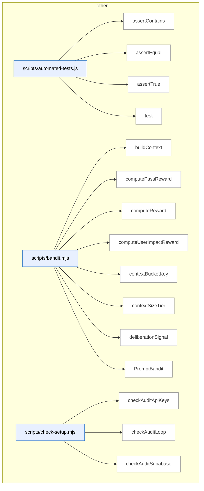

<!-- audit-loop:architectural-map -->
# Architecture Map — Lbstrydom/ai-organiser

- Generated: 2026-05-03T08:53:09.918Z   commit: 3a1315c9d5eb   refresh_id: 925a6c29-baca-45b0-8a91-58029205c5a0
- Drift score: 0 / threshold 20   status: `INSUFFICIENT_DATA`
- Domains: 1   Symbols: 2394   Layering violations: 0

## Contents
- [_other](#-other) — 2394 symbols

---

## _other



_Domain has 2394 symbols (>50). Diagram shows top-15 by file order; see flat table below for the full list._

### Symbols in this domain

| Symbol | Kind | Path | Lines | Purpose |
|---|---|---|---|---|
| [`assertContains`](../scripts/automated-tests.js#L48) | function | `scripts/automated-tests.js` | 48-52 | Throws an error if a string doesn't contain an expected substring. |
| [`assertEqual`](../scripts/automated-tests.js#L36) | function | `scripts/automated-tests.js` | 36-40 | Throws an error if actual value doesn't match expected value. |
| [`assertTrue`](../scripts/automated-tests.js#L42) | function | `scripts/automated-tests.js` | 42-46 | Throws an error if a value is not truthy. |
| [`test`](../scripts/automated-tests.js#L23) | function | `scripts/automated-tests.js` | 23-34 | Executes a test function, tracks pass/fail, and logs results with error details. |
| [`buildContext`](../scripts/bandit.mjs#L28) | function | `scripts/bandit.mjs` | 28-34 | Returns a context object with size tier and dominant language from a repo profile. |
| [`computePassReward`](../scripts/bandit.mjs#L409) | function | `scripts/bandit.mjs` | 409-415 | Averages individual finding rewards to produce a pass-level reward score. |
| [`computeReward`](../scripts/bandit.mjs#L309) | function | `scripts/bandit.mjs` | 309-347 | Calculates a multi-signal reward score for prompt variants based on procedural outcomes, substantive changes, deliberation quality, and user impact. |
| [`computeUserImpactReward`](../scripts/bandit.mjs#L358) | function | `scripts/bandit.mjs` | 358-378 | Computes a user-impact reward factor weighted by correlation type and persona severity. |
| [`contextBucketKey`](../scripts/bandit.mjs#L43) | function | `scripts/bandit.mjs` | 43-45 | Creates a bucket key combining size tier and dominant language. |
| [`contextSizeTier`](../scripts/bandit.mjs#L36) | function | `scripts/bandit.mjs` | 36-41 | Categorizes character count into size tiers (small, medium, large, xlarge). |
| [`deliberationSignal`](../scripts/bandit.mjs#L385) | function | `scripts/bandit.mjs` | 385-402 | Scores deliberation quality based on challenge positions, rulings, and rationale length. |
| [`PromptBandit`](../scripts/bandit.mjs#L49) | class | `scripts/bandit.mjs` | 49-292 | <no body> |
| [`checkAuditApiKeys`](../scripts/check-setup.mjs#L157) | function | `scripts/check-setup.mjs` | 157-174 | Validates that required API keys for OpenAI/Gemini/Anthropic are configured. |
| [`checkAuditLoop`](../scripts/check-setup.mjs#L233) | function | `scripts/check-setup.mjs` | 233-237 | Runs audit-loop checks (API keys and Supabase configuration). |
| [`checkAuditSupabase`](../scripts/check-setup.mjs#L180) | function | `scripts/check-setup.mjs` | 180-231 | Checks Supabase audit configuration, tables, and views; reports missing setup. |
| [`checkPersonaTest`](../scripts/check-setup.mjs#L241) | function | `scripts/check-setup.mjs` | 241-297 | <no body> |
| [`checkTables`](../scripts/check-setup.mjs#L71) | function | `scripts/check-setup.mjs` | 71-78 | Checks whether specified tables exist in Supabase by querying them. |
| [`getSupabaseClient`](../scripts/check-setup.mjs#L61) | function | `scripts/check-setup.mjs` | 61-64 | Creates and returns a Supabase client using provided URL and key. |
| [`loadEnv`](../scripts/check-setup.mjs#L42) | function | `scripts/check-setup.mjs` | 42-57 | Parses a .env file into a key-value object, skipping comments and malformed lines. |
| [`main`](../scripts/check-setup.mjs#L374) | function | `scripts/check-setup.mjs` | 374-385 | Loads environment, runs checks, and exits with appropriate code. |
| [`printJsonReport`](../scripts/check-setup.mjs#L360) | function | `scripts/check-setup.mjs` | 360-370 | Outputs the report as JSON to stdout. |
| [`printReport`](../scripts/check-setup.mjs#L328) | function | `scripts/check-setup.mjs` | 328-358 | Prints a formatted setup check report with sections and colored output. |
| [`Report`](../scripts/check-setup.mjs#L118) | class | `scripts/check-setup.mjs` | 118-153 | <no body> |
| [`shortUrl`](../scripts/check-setup.mjs#L176) | function | `scripts/check-setup.mjs` | 176-178 | Truncates a URL by removing protocol and limiting to 30 characters. |
| [`statusIcon`](../scripts/check-setup.mjs#L304) | function | `scripts/check-setup.mjs` | 304-313 | Returns a colored status icon (PASS, FAIL, WARN, INFO, FIX). |
| [`verdictLine`](../scripts/check-setup.mjs#L315) | function | `scripts/check-setup.mjs` | 315-326 | Formats a summary line of test failures and warnings. |
| [`checkSync`](../scripts/check-sync.mjs#L25) | function | `scripts/check-sync.mjs` | 25-157 | <no body> |
| [`fail`](../scripts/check-sync.mjs#L20) | function | `scripts/check-sync.mjs` | 20-20 | Logs a failed check. |
| [`finish`](../scripts/check-sync.mjs#L159) | function | `scripts/check-sync.mjs` | 159-182 | Prints or outputs a sync-check report and exits with appropriate code. |
| [`info`](../scripts/check-sync.mjs#L21) | function | `scripts/check-sync.mjs` | 21-21 | Logs an informational message. |
| [`log`](../scripts/check-sync.mjs#L17) | function | `scripts/check-sync.mjs` | 17-17 | Logs a message to stdout unless in JSON mode. |
| [`pass`](../scripts/check-sync.mjs#L19) | function | `scripts/check-sync.mjs` | 19-19 | Logs a passed check. |
| [`argOption`](../scripts/cross-skill.mjs#L96) | function | `scripts/cross-skill.mjs` | 96-100 | Retrieves the value of a named command-line option. |
| [`cmdAbortRefreshRun`](../scripts/cross-skill.mjs#L511) | function | `scripts/cross-skill.mjs` | 511-521 | Cancels an in-progress refresh run with an optional reason. |
| [`cmdAddPersona`](../scripts/cross-skill.mjs#L348) | function | `scripts/cross-skill.mjs` | 348-360 | Creates or updates a persona with name, description, and app URL in the cloud. |
| [`cmdAuditEffectiveness`](../scripts/cross-skill.mjs#L311) | function | `scripts/cross-skill.mjs` | 311-318 | Reads audit effectiveness metrics for a repo and emits them. |
| [`cmdComputeDriftScore`](../scripts/cross-skill.mjs#L615) | function | `scripts/cross-skill.mjs` | 615-626 | Computes an architectural drift score comparing current and previous snapshots. |
| [`cmdDetectStack`](../scripts/cross-skill.mjs#L399) | function | `scripts/cross-skill.mjs` | 399-415 | Detects the tech stack and optional environment manager of a repository. |
| [`cmdGetActiveRefreshId`](../scripts/cross-skill.mjs#L431) | function | `scripts/cross-skill.mjs` | 431-447 | Retrieves the active refresh ID and embedding model metadata for a given repository UUID. |
| [`cmdGetNeighbourhood`](../scripts/cross-skill.mjs#L449) | function | `scripts/cross-skill.mjs` | 449-477 | Finds similar code symbols (neighborhood) matching an intent query from the cloud index. |
| [`cmdListLayeringViolationsForSnapshot`](../scripts/cross-skill.mjs#L602) | function | `scripts/cross-skill.mjs` | 602-613 | Lists architectural layering violations for a snapshot. |
| [`cmdListPersonas`](../scripts/cross-skill.mjs#L326) | function | `scripts/cross-skill.mjs` | 326-337 | Fetches personas for a given app URL from the cloud persona service. |
| [`cmdListSymbolsForSnapshot`](../scripts/cross-skill.mjs#L589) | function | `scripts/cross-skill.mjs` | 589-600 | Lists all symbol definitions recorded in a snapshot. |
| [`cmdListUnlockedFixes`](../scripts/cross-skill.mjs#L303) | function | `scripts/cross-skill.mjs` | 303-309 | Retrieves unlocked fix records and emits them. |
| [`cmdOpenRefreshRun`](../scripts/cross-skill.mjs#L479) | function | `scripts/cross-skill.mjs` | 479-497 | Opens a new code-refresh run for a repository, creating the repo if it doesn't exist. |
| [`cmdPlanSatisfaction`](../scripts/cross-skill.mjs#L268) | function | `scripts/cross-skill.mjs` | 268-278 | Reads plan satisfaction data and persistent failures, then emits them. |
| [`cmdPublishRefreshRun`](../scripts/cross-skill.mjs#L499) | function | `scripts/cross-skill.mjs` | 499-509 | Marks a refresh run as complete and publishes its results to the cloud. |
| [`cmdRecordCorrelation`](../scripts/cross-skill.mjs#L216) | function | `scripts/cross-skill.mjs` | 216-233 | Records a correlation between a persona finding and audit finding. |
| [`cmdRecordLayeringViolations`](../scripts/cross-skill.mjs#L563) | function | `scripts/cross-skill.mjs` | 563-575 | Records architectural layering violations detected during a refresh run. |
| [`cmdRecordPersonaSession`](../scripts/cross-skill.mjs#L384) | function | `scripts/cross-skill.mjs` | 384-397 | Records a persona session with optional commit SHA and returns session metadata. |
| [`cmdRecordPlanVerifyItems`](../scripts/cross-skill.mjs#L257) | function | `scripts/cross-skill.mjs` | 257-266 | Records individual verification items from a plan test run. |
| [`cmdRecordPlanVerifyRun`](../scripts/cross-skill.mjs#L235) | function | `scripts/cross-skill.mjs` | 235-255 | Records a plan verification run with criterion counts and emits its ID. |
| [`cmdRecordRegressionSpec`](../scripts/cross-skill.mjs#L177) | function | `scripts/cross-skill.mjs` | 177-196 | Records a regression spec and emits its ID. |
| [`cmdRecordRegressionSpecRun`](../scripts/cross-skill.mjs#L198) | function | `scripts/cross-skill.mjs` | 198-214 | Records a regression spec test run with pass/fail status. |
| [`cmdRecordShipEvent`](../scripts/cross-skill.mjs#L280) | function | `scripts/cross-skill.mjs` | 280-301 | Records a ship event with outcome, block reasons, and metadata. |
| [`cmdRecordSymbolDefinitions`](../scripts/cross-skill.mjs#L523) | function | `scripts/cross-skill.mjs` | 523-533 | Stores symbol definitions (names, signatures, locations) for a repository. |
| [`cmdRecordSymbolEmbedding`](../scripts/cross-skill.mjs#L549) | function | `scripts/cross-skill.mjs` | 549-561 | Saves a vector embedding for a symbol definition. |
| [`cmdRecordSymbolIndex`](../scripts/cross-skill.mjs#L535) | function | `scripts/cross-skill.mjs` | 535-547 | Bulk records symbol index rows (locations and references) for a refresh snapshot. |
| [`cmdResolveRepoIdentity`](../scripts/cross-skill.mjs#L628) | function | `scripts/cross-skill.mjs` | 628-634 | Derives or persists a stable repository UUID based on Git origin and codebase. |
| [`cmdSetActiveEmbeddingModel`](../scripts/cross-skill.mjs#L577) | function | `scripts/cross-skill.mjs` | 577-587 | Sets the active embedding model and dimension for a repository's snapshots. |
| [`cmdUpdatePlanStatus`](../scripts/cross-skill.mjs#L168) | function | `scripts/cross-skill.mjs` | 168-175 | Updates an existing plan's status in the cloud. |
| [`cmdUpsertPlan`](../scripts/cross-skill.mjs#L150) | function | `scripts/cross-skill.mjs` | 150-166 | Upserts a remediation plan record and emits its ID. |
| [`cmdWhoami`](../scripts/cross-skill.mjs#L417) | function | `scripts/cross-skill.mjs` | 417-427 | Reports system status including cloud enablement, commit SHA, branch, and Supabase configuration. |
| [`currentBranch`](../scripts/cross-skill.mjs#L125) | function | `scripts/cross-skill.mjs` | 125-130 | Returns the current Git branch name. |
| [`currentCommitSha`](../scripts/cross-skill.mjs#L118) | function | `scripts/cross-skill.mjs` | 118-123 | Returns the current Git commit SHA. |
| [`emit`](../scripts/cross-skill.mjs#L102) | function | `scripts/cross-skill.mjs` | 102-104 | Outputs a JSON object to stdout. |
| [`emitError`](../scripts/cross-skill.mjs#L111) | function | `scripts/cross-skill.mjs` | 111-114 | Emits a JSON error and exits with a specified code. |
| [`main`](../scripts/cross-skill.mjs#L672) | function | `scripts/cross-skill.mjs` | 672-695 | Routes CLI subcommands to their handlers, displaying usage or executing the command. |
| [`parsePayload`](../scripts/cross-skill.mjs#L79) | function | `scripts/cross-skill.mjs` | 79-94 | Parses a JSON payload from --json, --stdin, or bare JSON argument. |
| [`resolveRepoId`](../scripts/cross-skill.mjs#L140) | function | `scripts/cross-skill.mjs` | 140-146 | Returns the repo ID from payload or null if not provided. |
| [`checkBaselineValidity`](../scripts/evolve-prompts.mjs#L340) | function | `scripts/evolve-prompts.mjs` | 340-348 | Checks if an active experiment's parent baseline has changed and marks it stale if so. |
| [`evolveWorstPass`](../scripts/evolve-prompts.mjs#L92) | function | `scripts/evolve-prompts.mjs` | 92-234 | <no body> |
| [`formatExample`](../scripts/evolve-prompts.mjs#L336) | function | `scripts/evolve-prompts.mjs` | 336-338 | Formats a finding example as a human-readable bullet point with severity and file. |
| [`getExperimentManifestStore`](../scripts/evolve-prompts.mjs#L64) | function | `scripts/evolve-prompts.mjs` | 64-66 | Returns a file-backed mutex store for experiment manifest persistence. |
| [`killExperiment`](../scripts/evolve-prompts.mjs#L306) | function | `scripts/evolve-prompts.mjs` | 306-317 | Marks a revision as abandoned and updates the experiment status to killed. |
| [`main`](../scripts/evolve-prompts.mjs#L373) | function | `scripts/evolve-prompts.mjs` | 373-469 | <no body> |
| [`promoteExperiment`](../scripts/evolve-prompts.mjs#L289) | function | `scripts/evolve-prompts.mjs` | 289-301 | Promotes a revision to active status and marks its experiment as promoted. |
| [`reconcileOrphanedExperiments`](../scripts/evolve-prompts.mjs#L353) | function | `scripts/evolve-prompts.mjs` | 353-369 | Scans for incomplete experiment manifests and logs cleanup opportunities. |
| [`reviewExperiments`](../scripts/evolve-prompts.mjs#L239) | function | `scripts/evolve-prompts.mjs` | 239-284 | <no body> |
| [`showStats`](../scripts/evolve-prompts.mjs#L322) | function | `scripts/evolve-prompts.mjs` | 322-332 | Aggregates pass statistics, active experiments, and bandit arm performance data. |
| [`_collectMaxLengths`](../scripts/gemini-review.mjs#L100) | function | `scripts/gemini-review.mjs` | 100-118 | Recursively collects maximum string lengths from a JSON schema for truncation. |
| [`addSemanticIds`](../scripts/gemini-review.mjs#L805) | function | `scripts/gemini-review.mjs` | 805-813 | Assigns semantic IDs and hashes to new findings and marks their source provider. |
| [`applyDebtSuppression`](../scripts/gemini-review.mjs#L768) | function | `scripts/gemini-review.mjs` | 768-803 | Suppresses new findings that match pre-filtered debt via Jaccard similarity scoring. |
| [`buildClient`](../scripts/gemini-review.mjs#L734) | function | `scripts/gemini-review.mjs` | 734-741 | Creates and returns an authenticated client for the selected AI provider. |
| [`callClaudeOpus`](../scripts/gemini-review.mjs#L386) | function | `scripts/gemini-review.mjs` | 386-449 | <no body> |
| [`callGemini`](../scripts/gemini-review.mjs#L278) | function | `scripts/gemini-review.mjs` | 278-372 | <no body> |
| [`emitReviewOutput`](../scripts/gemini-review.mjs#L815) | function | `scripts/gemini-review.mjs` | 815-830 | Outputs the review result as JSON (with optional file save) or formatted markdown. |
| [`formatReviewResult`](../scripts/gemini-review.mjs#L574) | function | `scripts/gemini-review.mjs` | 574-637 | Formats a review result object into human-readable markdown with verdict, deliberation quality, and findings. |
| [`getReviewPrompt`](../scripts/gemini-review.mjs#L259) | function | `scripts/gemini-review.mjs` | 259-261 | Retrieves the active gemini-review prompt or falls back to the default system prompt. |
| [`isJsonTruncationError`](../scripts/gemini-review.mjs#L743) | function | `scripts/gemini-review.mjs` | 743-747 | Detects whether an error is due to JSON response truncation. |
| [`main`](../scripts/gemini-review.mjs#L901) | function | `scripts/gemini-review.mjs` | 901-937 | Main entry point that parses arguments, runs code/plan review with Gemini, and saves results. |
| [`parseReviewArgs`](../scripts/gemini-review.mjs#L693) | function | `scripts/gemini-review.mjs` | 693-704 | Parses CLI arguments for final review, extracting file paths, output mode, and provider override. |
| [`recordGeminiOutcomes`](../scripts/gemini-review.mjs#L877) | function | `scripts/gemini-review.mjs` | 877-899 | Records Gemini review outcomes, false positives, and bandit learning rewards to persistent storage. |
| [`recordNewFindings`](../scripts/gemini-review.mjs#L832) | function | `scripts/gemini-review.mjs` | 832-851 | Records new findings from the review into outcomes.jsonl and updates the false-positive tracker. |
| [`recordWronglyDismissed`](../scripts/gemini-review.mjs#L853) | function | `scripts/gemini-review.mjs` | 853-875 | Logs wrongly-dismissed findings from Gemini review to audit outcomes file. |
| [`refreshCatalogAndWarn`](../scripts/gemini-review.mjs#L643) | function | `scripts/gemini-review.mjs` | 643-654 | Refreshes the live Gemini model catalog and warns if the session model is outdated. |
| [`runFinalReview`](../scripts/gemini-review.mjs#L462) | function | `scripts/gemini-review.mjs` | 462-570 | <no body> |
| [`runPing`](../scripts/gemini-review.mjs#L686) | function | `scripts/gemini-review.mjs` | 686-691 | Pings both Gemini and Claude APIs to verify credentials and availability. |
| [`runPingClaude`](../scripts/gemini-review.mjs#L668) | function | `scripts/gemini-review.mjs` | 668-684 | Tests connectivity to Claude Opus by sending a simple request. |
| [`runPingGemini`](../scripts/gemini-review.mjs#L656) | function | `scripts/gemini-review.mjs` | 656-666 | Tests connectivity to Gemini by sending a simple request. |
| [`runReviewWithRetry`](../scripts/gemini-review.mjs#L749) | function | `scripts/gemini-review.mjs` | 749-766 | Retries final review with conciseness hints if JSON truncation occurs. |
| [`selectProvider`](../scripts/gemini-review.mjs#L706) | function | `scripts/gemini-review.mjs` | 706-732 | Selects the AI provider (Gemini or Claude) based on environment variables and CLI override. |
| [`truncateToSchema`](../scripts/gemini-review.mjs#L132) | function | `scripts/gemini-review.mjs` | 132-152 | Truncates object field values to schema-defined max lengths, logging what was cut. |
| [`askYesNo`](../scripts/install-ffmpeg.js#L48) | function | `scripts/install-ffmpeg.js` | 48-60 | Prompts user for yes/no input via stdin and returns boolean result. |
| [`checkFFmpegAtPath`](../scripts/install-ffmpeg.js#L108) | function | `scripts/install-ffmpeg.js` | 108-121 | Verifies ffmpeg exists at a specific file path and extracts its version. |
| [`checkFFprobe`](../scripts/install-ffmpeg.js#L93) | function | `scripts/install-ffmpeg.js` | 93-103 | Checks if ffprobe command is available by running its version command. |
| [`detectPlatform`](../scripts/install-ffmpeg.js#L126) | function | `scripts/install-ffmpeg.js` | 126-138 | Detects the current operating system, architecture, and platform properties. |
| [`downloadFile`](../scripts/install-ffmpeg.js#L321) | function | `scripts/install-ffmpeg.js` | 321-367 | Downloads a file from URL to destination path with progress reporting and redirect handling. |
| [`extractZip`](../scripts/install-ffmpeg.js#L372) | function | `scripts/install-ffmpeg.js` | 372-383 | Extracts a zip archive using PowerShell on Windows or unzip on Unix systems. |
| [`findAllFFmpegInstallations`](../scripts/install-ffmpeg.js#L143) | function | `scripts/install-ffmpeg.js` | 143-197 | Searches for all ffmpeg installations across system PATH and common installation directories. |
| [`getFFmpegInfo`](../scripts/install-ffmpeg.js#L65) | function | `scripts/install-ffmpeg.js` | 65-88 | Executes ffmpeg version command and extracts version and path information. |
| [`hasPackageManager`](../scripts/install-ffmpeg.js#L309) | function | `scripts/install-ffmpeg.js` | 309-316 | Tests if a package manager command (apt, brew, etc.) is available on the system. |
| [`installLinux`](../scripts/install-ffmpeg.js#L541) | function | `scripts/install-ffmpeg.js` | 541-631 | <no body> |
| [`installMac`](../scripts/install-ffmpeg.js#L500) | function | `scripts/install-ffmpeg.js` | 500-536 | Installs ffmpeg on macOS using Homebrew, MacPorts, or provides installation instructions. |
| [`installWindows`](../scripts/install-ffmpeg.js#L388) | function | `scripts/install-ffmpeg.js` | 388-495 | <no body> |
| [`isInstallationProblematic`](../scripts/install-ffmpeg.js#L202) | function | `scripts/install-ffmpeg.js` | 202-232 | Evaluates whether an ffmpeg installation is problematic based on missing ffprobe or outdated version. |
| [`log`](../scripts/install-ffmpeg.js#L36) | function | `scripts/install-ffmpeg.js` | 36-38 | Outputs a colored log message to console. |
| [`logError`](../scripts/install-ffmpeg.js#L42) | function | `scripts/install-ffmpeg.js` | 42-42 | Logs an error message with red X symbol. |
| [`logInfo`](../scripts/install-ffmpeg.js#L43) | function | `scripts/install-ffmpeg.js` | 43-43 | Logs an info message with cyan information symbol. |
| [`logSuccess`](../scripts/install-ffmpeg.js#L40) | function | `scripts/install-ffmpeg.js` | 40-40 | Logs a success message with green checkmark. |
| [`logWarning`](../scripts/install-ffmpeg.js#L41) | function | `scripts/install-ffmpeg.js` | 41-41 | Logs a warning message with yellow warning symbol. |
| [`main`](../scripts/install-ffmpeg.js#L636) | function | `scripts/install-ffmpeg.js` | 636-785 | <no body> |
| [`removeInstallation`](../scripts/install-ffmpeg.js#L237) | function | `scripts/install-ffmpeg.js` | 237-304 | Attempts to remove an existing ffmpeg installation directory or guides user toward package manager uninstall. |
| [`_resetClassificationColumnCache`](../scripts/learning-store.mjs#L217) | function | `scripts/learning-store.mjs` | 217-217 | Resets the classification column cache to force re-detection on next check. |
| [`abortRefreshRun`](../scripts/learning-store.mjs#L1598) | function | `scripts/learning-store.mjs` | 1598-1605 | Marks a refresh run as aborted with an optional error reason. |
| [`appendDebtEventsCloud`](../scripts/learning-store.mjs#L495) | function | `scripts/learning-store.mjs` | 495-523 | Appends debt lifecycle events (e.g., raised, resolved) to cloud event log with idempotent upsert. |
| [`callNeighbourhoodRpc`](../scripts/learning-store.mjs#L1807) | function | `scripts/learning-store.mjs` | 1807-1823 | Calls a database RPC to find neighboring symbols by semantic similarity and kind. |
| [`chunk`](../scripts/learning-store.mjs#L1644) | function | `scripts/learning-store.mjs` | 1644-1648 | Splits an array into fixed-size chunks. |
| [`computeDriftScore`](../scripts/learning-store.mjs#L1829) | function | `scripts/learning-store.mjs` | 1829-1843 | Calls a database RPC to compute a drift score measuring codebase volatility. |
| [`copyForwardUntouchedFiles`](../scripts/learning-store.mjs#L1905) | function | `scripts/learning-store.mjs` | 1905-1942 | Copies symbol index entries from a prior refresh to a new one, excluding touched files. |
| [`detectClassificationColumns`](../scripts/learning-store.mjs#L198) | function | `scripts/learning-store.mjs` | 198-214 | Checks if Supabase has classification columns by querying the schema and caches result. |
| [`getActiveEmbeddingModel`](../scripts/learning-store.mjs#L1790) | function | `scripts/learning-store.mjs` | 1790-1799 | Retrieves the currently active embedding model and dimension for a repository. |
| [`getActiveSnapshot`](../scripts/learning-store.mjs#L1622) | function | `scripts/learning-store.mjs` | 1622-1635 | Fetches the active refresh snapshot ID and embedding model for a repository. |
| [`getFalsePositivePatterns`](../scripts/learning-store.mjs#L836) | function | `scripts/learning-store.mjs` | 836-850 | Retrieves auto-suppressed false positive patterns for a repository from the database. |
| [`getPassEffectiveness`](../scripts/learning-store.mjs#L806) | function | `scripts/learning-store.mjs` | 806-831 | Retrieves pass effectiveness metrics (findings raised/accepted/dismissed) for a repository from all audit runs. |
| [`getPassTimings`](../scripts/learning-store.mjs#L306) | function | `scripts/learning-store.mjs` | 306-337 | Retrieves historical token usage and latency data for all audit passes to compute averages. |
| [`getPersonaSupabase`](../scripts/learning-store.mjs#L1275) | function | `scripts/learning-store.mjs` | 1275-1294 | Lazily initializes and returns a Supabase client for persona tests, or null if unconfigured. |
| [`getReadClient`](../scripts/learning-store.mjs#L1489) | function | `scripts/learning-store.mjs` | 1489-1489 | Returns the read-only Supabase client. |
| [`getRepoIdByUuid`](../scripts/learning-store.mjs#L1498) | function | `scripts/learning-store.mjs` | 1498-1513 | Looks up a repository by UUID and returns its ID, name, and active embedding metadata. |
| [`getUnlockedFixes`](../scripts/learning-store.mjs#L994) | function | `scripts/learning-store.mjs` | 994-1006 | Fetches up to 20 unlocked fixes, optionally filtered by repository. |
| [`getWriteClient`](../scripts/learning-store.mjs#L1468) | function | `scripts/learning-store.mjs` | 1468-1486 | Obtains or initializes a write-capable Supabase client using service-role credentials. |
| [`heartbeatRefreshRun`](../scripts/learning-store.mjs#L1608) | function | `scripts/learning-store.mjs` | 1608-1613 | Updates the heartbeat timestamp of an in-flight refresh run. |
| [`initLearningStore`](../scripts/learning-store.mjs#L27) | function | `scripts/learning-store.mjs` | 27-55 | Initializes Supabase client for cloud-based learning store, falling back to local mode on failure. |
| [`isCloudEnabled`](../scripts/learning-store.mjs#L58) | function | `scripts/learning-store.mjs` | 58-60 | Returns whether cloud learning store is currently enabled and connected. |
| [`isPersonaCloudEnabled`](../scripts/learning-store.mjs#L1297) | function | `scripts/learning-store.mjs` | 1297-1300 | Returns true if persona cloud is enabled via environment configuration. |
| [`listLayeringViolationsForSnapshot`](../scripts/learning-store.mjs#L1883) | function | `scripts/learning-store.mjs` | 1883-1898 | Lists all layering violations detected in a refresh snapshot. |
| [`listPersonasForApp`](../scripts/learning-store.mjs#L1310) | function | `scripts/learning-store.mjs` | 1310-1324 | Lists all personas associated with a given app URL. |
| [`listSymbolsForSnapshot`](../scripts/learning-store.mjs#L1849) | function | `scripts/learning-store.mjs` | 1849-1881 | Lists symbols from a snapshot with optional filtering by kind, domain, or file prefix. |
| [`loadBanditArms`](../scripts/learning-store.mjs#L625) | function | `scripts/learning-store.mjs` | 625-653 | Loads bandit arm statistics from cloud database organized by pass and context bucket. |
| [`loadFalsePositivePatterns`](../scripts/learning-store.mjs#L779) | function | `scripts/learning-store.mjs` | 779-799 | Loads repository-specific and global false positive patterns with auto-suppress flags from cloud. |
| [`openRefreshRun`](../scripts/learning-store.mjs#L1552) | function | `scripts/learning-store.mjs` | 1552-1575 | Opens a new refresh run and returns a refresh ID plus cancellation token. |
| [`publishRefreshRun`](../scripts/learning-store.mjs#L1585) | function | `scripts/learning-store.mjs` | 1585-1595 | Publishes a completed refresh run and activates it as the current snapshot. |
| [`readAuditEffectiveness`](../scripts/learning-store.mjs#L1087) | function | `scripts/learning-store.mjs` | 1087-1099 | Fetches audit effectiveness metrics for a repository. |
| [`readCorrelationsForFinding`](../scripts/learning-store.mjs#L1070) | function | `scripts/learning-store.mjs` | 1070-1081 | Retrieves all persona-audit correlations for a specific audit finding. |
| [`readCorrelationsForRun`](../scripts/learning-store.mjs#L1051) | function | `scripts/learning-store.mjs` | 1051-1062 | Retrieves all persona-audit correlations for a specific audit run. |
| [`readDebtEntriesCloud`](../scripts/learning-store.mjs#L429) | function | `scripts/learning-store.mjs` | 429-466 | Loads all technical debt entries for a repository from cloud storage. |
| [`readDebtEventsCloud`](../scripts/learning-store.mjs#L530) | function | `scripts/learning-store.mjs` | 530-551 | Retrieves chronologically ordered debt events for a repository from cloud storage. |
| [`readPersistentPlanFailures`](../scripts/learning-store.mjs#L1210) | function | `scripts/learning-store.mjs` | 1210-1221 | Fetches persistent failure records associated with a plan. |
| [`readPlanSatisfaction`](../scripts/learning-store.mjs#L1192) | function | `scripts/learning-store.mjs` | 1192-1204 | Retrieves plan satisfaction metrics for a given plan. |
| [`recordAdjudicationEvent`](../scripts/learning-store.mjs#L560) | function | `scripts/learning-store.mjs` | 560-590 | Records finding adjudication outcomes and remediation state changes to cloud database. |
| [`recordFindings`](../scripts/learning-store.mjs#L222) | function | `scripts/learning-store.mjs` | 222-249 | Inserts finding records from an audit pass into the cloud database with optional classification data. |
| [`recordLayeringViolations`](../scripts/learning-store.mjs#L1750) | function | `scripts/learning-store.mjs` | 1750-1773 | Batch upserts detected layering violations in the codebase. |
| [`recordPassStats`](../scripts/learning-store.mjs#L254) | function | `scripts/learning-store.mjs` | 254-274 | Records aggregated statistics for a single audit pass into the cloud database. |
| [`recordPersonaAuditCorrelation`](../scripts/learning-store.mjs#L1025) | function | `scripts/learning-store.mjs` | 1025-1043 | Records a correlation between a persona finding and an audit finding. |
| [`recordPersonaSession`](../scripts/learning-store.mjs#L1387) | function | `scripts/learning-store.mjs` | 1387-1452 | Records a persona test session with findings and returns session metadata with stats update flag. |
| [`recordPlanVerificationItems`](../scripts/learning-store.mjs#L1166) | function | `scripts/learning-store.mjs` | 1166-1186 | Batch inserts individual verification criteria results for a plan run. |
| [`recordPlanVerificationRun`](../scripts/learning-store.mjs#L1122) | function | `scripts/learning-store.mjs` | 1122-1147 | Creates a new plan verification run record and returns its ID. |
| [`recordRegressionSpec`](../scripts/learning-store.mjs#L931) | function | `scripts/learning-store.mjs` | 931-957 | Records a regression test specification and returns its database ID. |
| [`recordRegressionSpecRun`](../scripts/learning-store.mjs#L971) | function | `scripts/learning-store.mjs` | 971-987 | Logs the result of running a regression specification. |
| [`recordRunComplete`](../scripts/learning-store.mjs#L153) | function | `scripts/learning-store.mjs` | 153-175 | Updates a completed audit run with final statistics, costs, and metadata. |
| [`recordRunStart`](../scripts/learning-store.mjs#L106) | function | `scripts/learning-store.mjs` | 106-133 | Creates a new audit run record in cloud database and returns its ID. |
| [`recordShipEvent`](../scripts/learning-store.mjs#L1241) | function | `scripts/learning-store.mjs` | 1241-1264 | Records a ship event (deployment decision) with outcome and context. |
| [`recordSuppressionEvents`](../scripts/learning-store.mjs#L342) | function | `scripts/learning-store.mjs` | 342-367 | Records suppression and reopening events for findings into cloud event log. |
| [`recordSymbolDefinitions`](../scripts/learning-store.mjs#L1680) | function | `scripts/learning-store.mjs` | 1680-1705 | Batch upserts symbol definitions and returns a map of definition IDs by canonical path. |
| [`recordSymbolEmbedding`](../scripts/learning-store.mjs#L1734) | function | `scripts/learning-store.mjs` | 1734-1748 | Upserts a vector embedding for a symbol definition. |
| [`recordSymbolIndex`](../scripts/learning-store.mjs#L1707) | function | `scripts/learning-store.mjs` | 1707-1732 | Batch inserts symbol index entries linking definitions to file locations. |
| [`removeDebtEntryCloud`](../scripts/learning-store.mjs#L472) | function | `scripts/learning-store.mjs` | 472-484 | Deletes a specific technical debt entry from cloud storage. |
| [`setActiveEmbeddingModel`](../scripts/learning-store.mjs#L1779) | function | `scripts/learning-store.mjs` | 1779-1787 | Updates the active embedding model and dimension for a repository. |
| [`syncBanditArms`](../scripts/learning-store.mjs#L598) | function | `scripts/learning-store.mjs` | 598-619 | Syncs multi-armed bandit algorithm arm statistics to cloud for persistent learning. |
| [`syncExperiments`](../scripts/learning-store.mjs#L717) | function | `scripts/learning-store.mjs` | 717-743 | Inserts or updates prompt experiment metadata and results to cloud database. |
| [`syncFalsePositivePatterns`](../scripts/learning-store.mjs#L686) | function | `scripts/learning-store.mjs` | 686-709 | Syncs false positive patterns with auto-suppression flags to cloud storage. |
| [`syncPromptRevision`](../scripts/learning-store.mjs#L753) | function | `scripts/learning-store.mjs` | 753-770 | Syncs a prompt revision with its text and checksum to cloud database. |
| [`updatePassStatsPostDeliberation`](../scripts/learning-store.mjs#L283) | function | `scripts/learning-store.mjs` | 283-299 | Updates pass statistics after deliberation round with accepted/dismissed/compromised counts. |
| [`updatePlanStatus`](../scripts/learning-store.mjs#L905) | function | `scripts/learning-store.mjs` | 905-912 | Updates the status of an existing plan record. |
| [`updateRunMeta`](../scripts/learning-store.mjs#L182) | function | `scripts/learning-store.mjs` | 182-190 | Updates specific metadata fields on an existing audit run record. |
| [`upsertDebtEntries`](../scripts/learning-store.mjs#L380) | function | `scripts/learning-store.mjs` | 380-421 | Inserts or updates technical debt entries in cloud database with classification and deferral metadata. |
| [`upsertPersona`](../scripts/learning-store.mjs#L1339) | function | `scripts/learning-store.mjs` | 1339-1374 | Upserts a persona record and returns its ID plus whether it already existed. |
| [`upsertPlan`](../scripts/learning-store.mjs#L875) | function | `scripts/learning-store.mjs` | 875-900 | Inserts or updates a learning plan with metadata and returns its ID. |
| [`upsertPromptVariant`](../scripts/learning-store.mjs#L660) | function | `scripts/learning-store.mjs` | 660-677 | Inserts or updates prompt variant performance metrics in cloud database. |
| [`upsertRepo`](../scripts/learning-store.mjs#L69) | function | `scripts/learning-store.mjs` | 69-90 | Inserts or updates a repository profile record in cloud database by fingerprint. |
| [`upsertRepoByUuid`](../scripts/learning-store.mjs#L1521) | function | `scripts/learning-store.mjs` | 1521-1543 | Upserts a repository by UUID (or fingerprint) and returns its ID. |
| [`withRetry`](../scripts/learning-store.mjs#L1661) | function | `scripts/learning-store.mjs` | 1661-1677 | Executes a function with exponential backoff retry on network errors. |
| [`escapeMarkdown`](../scripts/lib/arch-render.mjs#L22) | function | `scripts/lib/arch-render.mjs` | 22-28 | Escapes pipe characters and whitespace for Markdown table rendering. |
| [`escapeMermaidLabel`](../scripts/lib/arch-render.mjs#L31) | function | `scripts/lib/arch-render.mjs` | 31-37 | Escapes quotes and special characters for Mermaid diagram labels. |
| [`groupByDomain`](../scripts/lib/arch-render.mjs#L45) | function | `scripts/lib/arch-render.mjs` | 45-63 | Groups symbols by domain tag and sorts them alphabetically by domain then file. |
| [`mermaidId`](../scripts/lib/arch-render.mjs#L40) | function | `scripts/lib/arch-render.mjs` | 40-42 | Generates a sanitized Mermaid-compatible identifier from a key with prefix. |
| [`renderArchitectureMap`](../scripts/lib/arch-render.mjs#L135) | function | `scripts/lib/arch-render.mjs` | 135-209 | <no body> |
| [`renderDriftIssue`](../scripts/lib/arch-render.mjs#L278) | function | `scripts/lib/arch-render.mjs` | 278-340 | Generates a markdown report of detected code duplication clusters with similarity scores and member symbols. |
| [`renderHeader`](../scripts/lib/arch-render.mjs#L121) | function | `scripts/lib/arch-render.mjs` | 121-132 | Renders the header section of an architecture map with metadata and status. |
| [`renderMermaidContainer`](../scripts/lib/arch-render.mjs#L69) | function | `scripts/lib/arch-render.mjs` | 69-103 | Renders symbols in a domain as a Mermaid flowchart showing file-to-symbol hierarchy. |
| [`renderNeighbourhoodCallout`](../scripts/lib/arch-render.mjs#L212) | function | `scripts/lib/arch-render.mjs` | 212-275 | Renders a callout section showing how many similar symbols exist in the architectural memory store and their recommendations. |
| [`renderSymbolTable`](../scripts/lib/arch-render.mjs#L106) | function | `scripts/lib/arch-render.mjs` | 106-118 | Renders symbols as a Markdown table with kind, path, line range, and purpose. |
| [`classifyFiles`](../scripts/lib/audit-scope.mjs#L149) | function | `scripts/lib/audit-scope.mjs` | 149-168 | Classifies code files into backend, frontend, and shared categories based on path patterns. |
| [`isAuditInfraFile`](../scripts/lib/audit-scope.mjs#L62) | function | `scripts/lib/audit-scope.mjs` | 62-69 | Determines whether a file belongs to the audit infrastructure scripts (scripts/ directory only). |
| [`isSensitiveFile`](../scripts/lib/audit-scope.mjs#L22) | function | `scripts/lib/audit-scope.mjs` | 22-25 | Checks if a file path matches patterns for sensitive files like environment variables or secrets. |
| [`readFilesAsContext`](../scripts/lib/audit-scope.mjs#L112) | function | `scripts/lib/audit-scope.mjs` | 112-140 | Converts a list of file paths into a markdown context block with language-specific syntax highlighting and truncation handling. |
| [`safeReadFile`](../scripts/lib/audit-scope.mjs#L84) | function | `scripts/lib/audit-scope.mjs` | 84-98 | Safely reads a file with bounds checking, symlink validation, and sensitive-file filtering. |
| [`buildRecord`](../scripts/lib/backfill-parser.mjs#L178) | function | `scripts/lib/backfill-parser.mjs` | 178-204 | Constructs a structured finding record with inferred file paths, suggested topic ID, and confidence metadata. |
| [`extractFilesFromText`](../scripts/lib/backfill-parser.mjs#L65) | function | `scripts/lib/backfill-parser.mjs` | 65-78 | Extracts file paths from backtick-quoted text, filtering out single-word identifiers to reduce noise. |
| [`extractPhaseTag`](../scripts/lib/backfill-parser.mjs#L86) | function | `scripts/lib/backfill-parser.mjs` | 86-92 | Extracts a phase tag from the filename (e.g., "phase-a") or falls back to the base name without "-audit-summary.md". |
| [`parseSummaryContent`](../scripts/lib/backfill-parser.mjs#L120) | function | `scripts/lib/backfill-parser.mjs` | 120-176 | Parses markdown audit-summary content by finding deferred sections and extracting findings from bullet or table formats. |
| [`parseSummaryFile`](../scripts/lib/backfill-parser.mjs#L105) | function | `scripts/lib/backfill-parser.mjs` | 105-111 | Loads and parses an audit-summary markdown file, delegating to content parser. |
| [`parseSummaryFiles`](../scripts/lib/backfill-parser.mjs#L211) | function | `scripts/lib/backfill-parser.mjs` | 211-220 | Parses multiple audit-summary files and aggregates their findings with per-file diagnostics. |
| [`severityFromPrefix`](../scripts/lib/backfill-parser.mjs#L49) | function | `scripts/lib/backfill-parser.mjs` | 49-57 | Maps single-letter severity prefix codes (H/M/L/T) to standardized severity levels. |
| [`buildAuditUnits`](../scripts/lib/code-analysis.mjs#L201) | function | `scripts/lib/code-analysis.mjs` | 201-239 | Partitions a file list into audit units respecting token and file count limits, with per-file chunking for oversized files. |
| [`buildDependencyGraph`](../scripts/lib/code-analysis.mjs#L161) | function | `scripts/lib/code-analysis.mjs` | 161-188 | Builds a directed dependency graph showing which files import which other files. |
| [`chunkLargeFile`](../scripts/lib/code-analysis.mjs#L98) | function | `scripts/lib/code-analysis.mjs` | 98-132 | Divides a large file into token-bounded chunks, either by function boundaries or fixed line counts. |
| [`estimateTokens`](../scripts/lib/code-analysis.mjs#L32) | function | `scripts/lib/code-analysis.mjs` | 32-34 | Estimates token count from text length using a rough 4:1 character-to-token ratio. |
| [`extractExportsOnly`](../scripts/lib/code-analysis.mjs#L142) | function | `scripts/lib/code-analysis.mjs` | 142-151 | Extracts only export statements from a file using language-specific regex patterns. |
| [`extractImportBlock`](../scripts/lib/code-analysis.mjs#L46) | function | `scripts/lib/code-analysis.mjs` | 46-57 | Extracts the import block at the top of a source file up to the first function boundary. |
| [`measureContextChars`](../scripts/lib/code-analysis.mjs#L272) | function | `scripts/lib/code-analysis.mjs` | 272-282 | Sums the character count of specified files capped at a per-file maximum. |
| [`splitAtFunctionBoundaries`](../scripts/lib/code-analysis.mjs#L66) | function | `scripts/lib/code-analysis.mjs` | 66-84 | Splits source code into chunks at function boundaries, preserving start line numbers. |
| [`discoverDotenv`](../scripts/lib/config.mjs#L21) | function | `scripts/lib/config.mjs` | 21-55 | Discovers and caches the .env file path by walking up the directory tree or checking git root. |
| [`normalizeLanguage`](../scripts/lib/config.mjs#L148) | function | `scripts/lib/config.mjs` | 148-161 | Normalizes language names to a canonical set (js, ts, py, go, etc.), treating unknowns as "other". |
| [`validatedEnum`](../scripts/lib/config.mjs#L66) | function | `scripts/lib/config.mjs` | 66-73 | Returns a config value from an enum set, falling back to a default if invalid. |
| [`_extractRegexFacts`](../scripts/lib/context.mjs#L89) | function | `scripts/lib/context.mjs` | 89-136 | Extracts structured facts from markdown instruction content using regex patterns for stack, dependencies, and metadata. |
| [`_getClaudeMd`](../scripts/lib/context.mjs#L58) | function | `scripts/lib/context.mjs` | 58-69 | Loads the Claude.md instruction file from disk, checking multiple candidate filenames and caching the result. |
| [`_getClaudeMdPath`](../scripts/lib/context.mjs#L75) | function | `scripts/lib/context.mjs` | 75-81 | Finds and returns the file path of the Claude.md instruction file if it exists. |
| [`_getPassAddendum`](../scripts/lib/context.mjs#L247) | function | `scripts/lib/context.mjs` | 247-261 | Extracts pass-specific instruction sections (e.g., "Wiring," "Sustainability") from Claude.md up to 800 characters. |
| [`_llmCondense`](../scripts/lib/context.mjs#L175) | function | `scripts/lib/context.mjs` | 175-226 | Uses Claude or Gemini to condense developer guidelines into a concise audit brief. |
| [`_quickFingerprint`](../scripts/lib/context.mjs#L330) | function | `scripts/lib/context.mjs` | 330-340 | Computes a lightweight SHA256 fingerprint of package.json and Claude.md to detect repo changes. |
| [`buildHistoryContext`](../scripts/lib/context.mjs#L637) | function | `scripts/lib/context.mjs` | 637-683 | Reads audit history from a JSON file and formats it as context preventing re-raising of resolved findings. |
| [`extractPlanForPass`](../scripts/lib/context.mjs#L606) | function | `scripts/lib/context.mjs` | 606-630 | Extracts sections of a plan matching keywords relevant to a specific audit pass. |
| [`generateRepoProfile`](../scripts/lib/context.mjs#L350) | function | `scripts/lib/context.mjs` | 350-469 | Generates a high-level profile of the repository including file inventory, tech stack, and directory breakdown. |
| [`getAuditBriefCache`](../scripts/lib/context.mjs#L27) | function | `scripts/lib/context.mjs` | 27-29 | Returns the cached audit brief text. |
| [`getClaudeMdCache`](../scripts/lib/context.mjs#L32) | function | `scripts/lib/context.mjs` | 32-34 | Returns the cached Claude.md instruction file contents. |
| [`getRepoProfileCache`](../scripts/lib/context.mjs#L22) | function | `scripts/lib/context.mjs` | 22-24 | Returns the cached repository profile object. |
| [`initAuditBrief`](../scripts/lib/context.mjs#L479) | function | `scripts/lib/context.mjs` | 479-509 | Initializes the audit brief by combining regex-extracted facts with optional LLM condensation of project guidelines. |
| [`loadKnownFpContext`](../scripts/lib/context.mjs#L558) | function | `scripts/lib/context.mjs` | 558-591 | Loads and formats known false-positive patterns from a JSON file, filtered by pass name. |
| [`loadSessionCache`](../scripts/lib/context.mjs#L275) | function | `scripts/lib/context.mjs` | 275-301 | Loads cached repo profile and audit brief from disk if fingerprint matches current repo state. |
| [`readProjectContext`](../scripts/lib/context.mjs#L594) | function | `scripts/lib/context.mjs` | 594-598 | Returns the audit brief or raw Claude.md content if brief is unavailable. |
| [`readProjectContextForPass`](../scripts/lib/context.mjs#L518) | function | `scripts/lib/context.mjs` | 518-536 | Reads and returns the audit brief for a specific pass, injecting pass-specific context and known false positives. |
| [`saveSessionCache`](../scripts/lib/context.mjs#L309) | function | `scripts/lib/context.mjs` | 309-324 | Writes the current audit brief and repo profile to a session cache file with a fingerprint checksum. |
| [`buildDebtEntry`](../scripts/lib/debt-capture.mjs#L84) | function | `scripts/lib/debt-capture.mjs` | 84-158 | Constructs a persisted debt entry from a finding with redaction, sensitivity flagging, and operator metadata. |
| [`computeSensitivity`](../scripts/lib/debt-capture.mjs#L32) | function | `scripts/lib/debt-capture.mjs` | 32-54 | Scans a finding for sensitive content in paths and free-text fields, returning reasons if detected. |
| [`suggestDeferralCandidate`](../scripts/lib/debt-capture.mjs#L171) | function | `scripts/lib/debt-capture.mjs` | 171-183 | Determines whether a finding is a candidate for deferral based on scope and severity rules. |
| [`appendDebtEventsLocal`](../scripts/lib/debt-events.mjs#L34) | function | `scripts/lib/debt-events.mjs` | 34-56 | Appends validated debt events to a local NDJSON log file atomically. |
| [`deriveMetricsFromEvents`](../scripts/lib/debt-events.mjs#L107) | function | `scripts/lib/debt-events.mjs` | 107-154 | Derives metrics (occurrence counts, escalation status) from a time-sorted sequence of debt events per topic. |
| [`readDebtEventsLocal`](../scripts/lib/debt-events.mjs#L65) | function | `scripts/lib/debt-events.mjs` | 65-87 | Reads and parses debt events from a local NDJSON log file, skipping malformed lines. |
| [`buildCommitUrl`](../scripts/lib/debt-git-history.mjs#L142) | function | `scripts/lib/debt-git-history.mjs` | 142-144 | Constructs a full commit URL from a repository URL and commit SHA. |
| [`countCommitsTouchingTopic`](../scripts/lib/debt-git-history.mjs#L42) | function | `scripts/lib/debt-git-history.mjs` | 42-63 | Counts how many git commits touched a topic ID in the debt ledger using git log -S. |
| [`deriveOccurrencesFromGit`](../scripts/lib/debt-git-history.mjs#L154) | function | `scripts/lib/debt-git-history.mjs` | 154-161 | Maps debt topic IDs to their commit touch counts derived from git history. |
| [`detectGitHubRepoUrl`](../scripts/lib/debt-git-history.mjs#L119) | function | `scripts/lib/debt-git-history.mjs` | 119-134 | Extracts and normalizes a GitHub repository URL from git remote configuration. |
| [`findFirstDeferCommit`](../scripts/lib/debt-git-history.mjs#L76) | function | `scripts/lib/debt-git-history.mjs` | 76-108 | Finds the earliest git commit that introduced a deferred debt topic by searching commit history. |
| [`findDebtByAlias`](../scripts/lib/debt-ledger.mjs#L273) | function | `scripts/lib/debt-ledger.mjs` | 273-280 | Searches debt entries for an exact topic ID match or content alias match. |
| [`mergeLedgers`](../scripts/lib/debt-ledger.mjs#L252) | function | `scripts/lib/debt-ledger.mjs` | 252-262 | Merges debt and session ledgers by topic ID, with session ledger entries overwriting debt ledger on collision. |
| [`readDebtLedger`](../scripts/lib/debt-ledger.mjs#L42) | function | `scripts/lib/debt-ledger.mjs` | 42-89 | Loads a debt ledger from JSON file, returning empty ledger if missing, and enriches entries with event-derived metrics. |
| [`removeDebtEntry`](../scripts/lib/debt-ledger.mjs#L207) | function | `scripts/lib/debt-ledger.mjs` | 207-236 | Removes a debt entry from the ledger file under file lock, returning success status. |
| [`writeDebtEntries`](../scripts/lib/debt-ledger.mjs#L107) | function | `scripts/lib/debt-ledger.mjs` | 107-197 | <no body> |
| [`appendEvents`](../scripts/lib/debt-memory.mjs#L113) | function | `scripts/lib/debt-memory.mjs` | 113-126 | Appends debt events to the selected source, returning count of written events. |
| [`loadDebtLedger`](../scripts/lib/debt-memory.mjs#L83) | function | `scripts/lib/debt-memory.mjs` | 83-100 | Loads the debt ledger and associated events from the selected source (cloud or local). |
| [`persistDebtEntries`](../scripts/lib/debt-memory.mjs#L140) | function | `scripts/lib/debt-memory.mjs` | 140-154 | Persists debt entries to local JSON and optionally mirrors to cloud, returning operation summary. |
| [`reconcileLocalToCloud`](../scripts/lib/debt-memory.mjs#L189) | function | `scripts/lib/debt-memory.mjs` | 189-226 | Syncs unreconciled local debt events to cloud by finding events after the last reconciliation marker. |
| [`removeDebt`](../scripts/lib/debt-memory.mjs#L159) | function | `scripts/lib/debt-memory.mjs` | 159-168 | Removes a debt entry from both local and cloud sources, returning success for each. |
| [`selectEventSource`](../scripts/lib/debt-memory.mjs#L59) | function | `scripts/lib/debt-memory.mjs` | 59-70 | Selects the event source (disabled, cloud, or local) based on configuration and availability. |
| [`buildLocalClusters`](../scripts/lib/debt-review-helpers.mjs#L164) | function | `scripts/lib/debt-review-helpers.mjs` | 164-204 | Builds file, principle, and recurrence-based debt clusters meeting minimum size thresholds. |
| [`computeLeverage`](../scripts/lib/debt-review-helpers.mjs#L45) | function | `scripts/lib/debt-review-helpers.mjs` | 45-57 | Calculates a leverage score for a refactor by dividing sonar-weighted impact by effort estimate. |
| [`countDebtByFile`](../scripts/lib/debt-review-helpers.mjs#L213) | function | `scripts/lib/debt-review-helpers.mjs` | 213-221 | Counts debt entries per primary affected file. |
| [`findBudgetViolations`](../scripts/lib/debt-review-helpers.mjs#L238) | function | `scripts/lib/debt-review-helpers.mjs` | 238-264 | Identifies budget violations by comparing actual debt counts per file pattern against configured limits. |
| [`findRecurringEntries`](../scripts/lib/debt-review-helpers.mjs#L148) | function | `scripts/lib/debt-review-helpers.mjs` | 148-152 | Filters and sorts debt entries by minimum occurrence count. |
| [`findStaleEntries`](../scripts/lib/debt-review-helpers.mjs#L83) | function | `scripts/lib/debt-review-helpers.mjs` | 83-92 | Finds debt entries older than the given TTL in days. |
| [`getDefaultMatcher`](../scripts/lib/debt-review-helpers.mjs#L269) | function | `scripts/lib/debt-review-helpers.mjs` | 269-280 | Returns a glob pattern matcher, falling back to exact-match if micromatch unavailable. |
| [`groupByFile`](../scripts/lib/debt-review-helpers.mjs#L116) | function | `scripts/lib/debt-review-helpers.mjs` | 116-124 | Groups debt entries by their primary affected file. |
| [`groupByPrinciple`](../scripts/lib/debt-review-helpers.mjs#L131) | function | `scripts/lib/debt-review-helpers.mjs` | 131-139 | Groups debt entries by their primary affected principle. |
| [`oldestEntryDays`](../scripts/lib/debt-review-helpers.mjs#L97) | function | `scripts/lib/debt-review-helpers.mjs` | 97-106 | Calculates the age in days of the oldest debt entry in the collection. |
| [`rankRefactorsByLeverage`](../scripts/lib/debt-review-helpers.mjs#L65) | function | `scripts/lib/debt-review-helpers.mjs` | 65-70 | Ranks refactors by their leverage scores in descending order. |
| [`_annotateBlockStyle`](../scripts/lib/diff-annotation.mjs#L79) | function | `scripts/lib/diff-annotation.mjs` | 79-113 | Annotates source code hunks with block-style comments marking changed and unchanged sections. |
| [`_annotateHeaderOnlyStyle`](../scripts/lib/diff-annotation.mjs#L115) | function | `scripts/lib/diff-annotation.mjs` | 115-125 | Annotates source code as numbered lines with a header showing changed line ranges. |
| [`_buildFileBlock`](../scripts/lib/diff-annotation.mjs#L154) | function | `scripts/lib/diff-annotation.mjs` | 154-178 | Creates a single annotated file block with syntax highlighting and diff markers. |
| [`getCommentStyle`](../scripts/lib/diff-annotation.mjs#L72) | function | `scripts/lib/diff-annotation.mjs` | 72-77 | Determines comment style (block or header-only) for a file based on extension. |
| [`parseDiffFile`](../scripts/lib/diff-annotation.mjs#L23) | function | `scripts/lib/diff-annotation.mjs` | 23-60 | Parses a unified diff file into a map of file paths to hunks with line ranges. |
| [`readFilesAsAnnotatedContext`](../scripts/lib/diff-annotation.mjs#L138) | function | `scripts/lib/diff-annotation.mjs` | 138-152 | Builds annotated file blocks within total and per-file size budgets from diff information. |
| [`atomicWriteFileSync`](../scripts/lib/file-io.mjs#L16) | function | `scripts/lib/file-io.mjs` | 16-30 | Atomically writes data to a file using a temporary file and rename operation. |
| [`normalizePath`](../scripts/lib/file-io.mjs#L39) | function | `scripts/lib/file-io.mjs` | 39-43 | Normalizes a file path to forward slashes, relative, and lowercase. |
| [`readFileOrDie`](../scripts/lib/file-io.mjs#L55) | function | `scripts/lib/file-io.mjs` | 55-62 | Reads a file or exits with error if the file does not exist. |
| [`safeInt`](../scripts/lib/file-io.mjs#L48) | function | `scripts/lib/file-io.mjs` | 48-51 | Safely parses an integer with a fallback default value. |
| [`writeOutput`](../scripts/lib/file-io.mjs#L72) | function | `scripts/lib/file-io.mjs` | 72-83 | Writes JSON output to a file or stdout with optional summary logging. |
| [`_acquireLockSync`](../scripts/lib/file-store.mjs#L38) | function | `scripts/lib/file-store.mjs` | 38-70 | Acquires an exclusive file lock using O_EXCL, with stale lock detection and breaking. |
| [`_quarantineRecord`](../scripts/lib/file-store.mjs#L18) | function | `scripts/lib/file-store.mjs` | 18-34 | Quarantines corrupted records to a timestamped JSON file for debugging. |
| [`_releaseLock`](../scripts/lib/file-store.mjs#L72) | function | `scripts/lib/file-store.mjs` | 72-74 | Releases a file lock by deleting the lock file. |
| [`acquireLock`](../scripts/lib/file-store.mjs#L80) | function | `scripts/lib/file-store.mjs` | 80-82 | Acquires a file lock synchronously. |
| [`AppendOnlyStore`](../scripts/lib/file-store.mjs#L208) | class | `scripts/lib/file-store.mjs` | 208-243 | <no body> |
| [`MutexFileStore`](../scripts/lib/file-store.mjs#L117) | class | `scripts/lib/file-store.mjs` | 117-200 | <no body> |
| [`readJsonlFile`](../scripts/lib/file-store.mjs#L94) | function | `scripts/lib/file-store.mjs` | 94-109 | Reads a JSONL file line-by-line, parsing valid JSON and skipping invalid lines. |
| [`releaseLock`](../scripts/lib/file-store.mjs#L84) | function | `scripts/lib/file-store.mjs` | 84-86 | Releases a file lock. |
| [`formatFindings`](../scripts/lib/findings-format.mjs#L12) | function | `scripts/lib/findings-format.mjs` | 12-33 | Formats findings grouped by severity with markdown headers and detail sections. |
| [`appendOutcome`](../scripts/lib/findings-outcomes.mjs#L38) | function | `scripts/lib/findings-outcomes.mjs` | 38-50 | Appends a single outcome record to a JSONL log with timestamp and repo fingerprint. |
| [`batchAppendOutcomes`](../scripts/lib/findings-outcomes.mjs#L58) | function | `scripts/lib/findings-outcomes.mjs` | 58-75 | Appends multiple outcome records to a JSONL log atomically, preserving existing entries. |
| [`compactOutcomes`](../scripts/lib/findings-outcomes.mjs#L100) | function | `scripts/lib/findings-outcomes.mjs` | 100-138 | Removes stale outcome records older than a threshold and backfills missing timestamps for legacy entries. |
| [`computePassEffectiveness`](../scripts/lib/findings-outcomes.mjs#L149) | function | `scripts/lib/findings-outcomes.mjs` | 149-187 | Calculates acceptance rate and signal score for findings using exponential decay weighted by age. |
| [`computePassEWR`](../scripts/lib/findings-outcomes.mjs#L196) | function | `scripts/lib/findings-outcomes.mjs` | 196-216 | Computes effective weighted reward (EWR) for a pass outcome using exponential decay weighting. |
| [`loadOutcomes`](../scripts/lib/findings-outcomes.mjs#L82) | function | `scripts/lib/findings-outcomes.mjs` | 82-93 | Loads all outcomes from a JSONL log, adding import timestamps to records lacking timestamps. |
| [`setRepoProfileCache`](../scripts/lib/findings-outcomes.mjs#L27) | function | `scripts/lib/findings-outcomes.mjs` | 27-29 | Caches a repository profile for use in outcome logging. |
| [`createRemediationTask`](../scripts/lib/findings-tasks.mjs#L34) | function | `scripts/lib/findings-tasks.mjs` | 34-48 | Creates a new remediation task record from a finding with initial pending state. |
| [`getTaskStore`](../scripts/lib/findings-tasks.mjs#L17) | function | `scripts/lib/findings-tasks.mjs` | 17-22 | Returns or initializes a singleton append-only store for remediation tasks. |
| [`loadTasks`](../scripts/lib/findings-tasks.mjs#L75) | function | `scripts/lib/findings-tasks.mjs` | 75-81 | Loads all remediation tasks, deduplicates by ID, and optionally filters by run. |
| [`persistTask`](../scripts/lib/findings-tasks.mjs#L72) | function | `scripts/lib/findings-tasks.mjs` | 72-72 | Writes a task to persistent storage. |
| [`trackEdit`](../scripts/lib/findings-tasks.mjs#L53) | function | `scripts/lib/findings-tasks.mjs` | 53-57 | Appends an edit to a task and marks it as fixed. |
| [`updateTask`](../scripts/lib/findings-tasks.mjs#L84) | function | `scripts/lib/findings-tasks.mjs` | 84-87 | Updates a task's timestamp and persists it. |
| [`verifyTask`](../scripts/lib/findings-tasks.mjs#L62) | function | `scripts/lib/findings-tasks.mjs` | 62-67 | Updates a task's verification status and sets verified metadata. |
| [`applyLazyDecay`](../scripts/lib/findings-tracker.mjs#L21) | function | `scripts/lib/findings-tracker.mjs` | 21-46 | Applies exponential decay to acceptance/dismissal counts and recomputes exponential moving average. |
| [`buildPatternKey`](../scripts/lib/findings-tracker.mjs#L95) | function | `scripts/lib/findings-tracker.mjs` | 95-97 | Builds a hierarchical pattern key from dimensions for grouping false positive statistics. |
| [`effectiveSampleSize`](../scripts/lib/findings-tracker.mjs#L51) | function | `scripts/lib/findings-tracker.mjs` | 51-53 | Sums decayed acceptance and dismissal counts to estimate effective sample size. |
| [`extractDimensions`](../scripts/lib/findings-tracker.mjs#L82) | function | `scripts/lib/findings-tracker.mjs` | 82-90 | Extracts normalized category, principle, severity, repo, and file extension dimensions from a finding. |
| [`FalsePositiveTracker`](../scripts/lib/findings-tracker.mjs#L105) | class | `scripts/lib/findings-tracker.mjs` | 105-226 | <no body> |
| [`recordWithDecay`](../scripts/lib/findings-tracker.mjs#L59) | function | `scripts/lib/findings-tracker.mjs` | 59-75 | Records a new acceptance/dismissal outcome with exponential decay applied to pattern state. |
| [`semanticId`](../scripts/lib/findings.mjs#L27) | function | `scripts/lib/findings.mjs` | 27-40 | Generates a stable semantic hash for a finding based on file, rule, and content. |
| [`buildFileReferenceRegex`](../scripts/lib/language-profiles.mjs#L302) | function | `scripts/lib/language-profiles.mjs` | 302-308 | Builds a regex to match file paths in text, supporting all known file extensions. |
| [`buildLanguageContext`](../scripts/lib/language-profiles.mjs#L317) | function | `scripts/lib/language-profiles.mjs` | 317-322 | Creates context object with repo files set and Python package root directories. |
| [`countFilesByLanguage`](../scripts/lib/language-profiles.mjs#L247) | function | `scripts/lib/language-profiles.mjs` | 247-254 | Counts files by language profile. |
| [`detectDominantLanguage`](../scripts/lib/language-profiles.mjs#L260) | function | `scripts/lib/language-profiles.mjs` | 260-265 | Identifies the most common language in a file list. |
| [`detectPythonPackageRoots`](../scripts/lib/language-profiles.mjs#L333) | function | `scripts/lib/language-profiles.mjs` | 333-356 | Detects Python package roots by finding directories containing `__init__.py` with no parent packages. |
| [`freezeProfile`](../scripts/lib/language-profiles.mjs#L80) | function | `scripts/lib/language-profiles.mjs` | 80-89 | <no body> |
| [`getAllProfiles`](../scripts/lib/language-profiles.mjs#L228) | function | `scripts/lib/language-profiles.mjs` | 228-230 | Returns all registered language profiles. |
| [`getProfile`](../scripts/lib/language-profiles.mjs#L232) | function | `scripts/lib/language-profiles.mjs` | 232-234 | Returns a specific language profile by ID or the unknown profile. |
| [`getProfileForFile`](../scripts/lib/language-profiles.mjs#L236) | function | `scripts/lib/language-profiles.mjs` | 236-242 | Determines language profile for a file by matching its extension. |
| [`jsResolveImport`](../scripts/lib/language-profiles.mjs#L367) | function | `scripts/lib/language-profiles.mjs` | 367-389 | Resolves JavaScript/TypeScript relative imports to local files, with language-aware extension ordering. |
| [`makeRegexBoundaries`](../scripts/lib/language-profiles.mjs#L40) | function | `scripts/lib/language-profiles.mjs` | 40-48 | Creates a boundary detector function from a regex that finds matching line indices. |
| [`pyResolveImport`](../scripts/lib/language-profiles.mjs#L402) | function | `scripts/lib/language-profiles.mjs` | 402-457 | Resolves Python imports (absolute and relative) to module files or package `__init__.py`. |
| [`pythonBoundaryScanner`](../scripts/lib/language-profiles.mjs#L56) | function | `scripts/lib/language-profiles.mjs` | 56-76 | Detects function/class boundaries in Python code, handling decorators specially. |
| [`batchWriteLedger`](../scripts/lib/ledger.mjs#L181) | function | `scripts/lib/ledger.mjs` | 181-205 | Batch upserts entries into ledger and optionally merges metadata, reporting insert/update/reject counts. |
| [`buildR2SystemPrompt`](../scripts/lib/ledger.mjs#L486) | function | `scripts/lib/ledger.mjs` | 486-488 | Combines R2 round modifier and rulings context into a system prompt with pass rubric. |
| [`buildRulingsBlock`](../scripts/lib/ledger.mjs#L391) | function | `scripts/lib/ledger.mjs` | 391-456 | Generates a formatted markdown block summarizing prior rulings (dismissed, adjusted, fixed) scoped to a pass. |
| [`computeImpactSet`](../scripts/lib/ledger.mjs#L498) | function | `scripts/lib/ledger.mjs` | 498-520 | Computes set of files impacted by changes, including transitive dependents via import scanning. |
| [`generateTopicId`](../scripts/lib/ledger.mjs#L30) | function | `scripts/lib/ledger.mjs` | 30-40 | Generates a deterministic 12-character topic ID from finding's file, principle, category, pass, and semantic hash. |
| [`getFileRegex`](../scripts/lib/ledger.mjs#L21) | function | `scripts/lib/ledger.mjs` | 21-21 | Returns a shared regex for extracting file references from text. |
| [`jaccardSimilarity`](../scripts/lib/ledger.mjs#L243) | function | `scripts/lib/ledger.mjs` | 243-251 | Computes Jaccard similarity between two strings using lowercase alphanumeric tokens. |
| [`mergeMetaLocked`](../scripts/lib/ledger.mjs#L160) | function | `scripts/lib/ledger.mjs` | 160-179 | Merges metadata into a locked metadata file, creating it if absent. |
| [`populateFindingMetadata`](../scripts/lib/ledger.mjs#L215) | function | `scripts/lib/ledger.mjs` | 215-233 | Extracts primary and affected files from finding text, assigns pass name, and ensures stable semantic hash. |
| [`readLedgerJson`](../scripts/lib/ledger.mjs#L118) | function | `scripts/lib/ledger.mjs` | 118-130 | Reads and parses the ledger JSON file, returning empty structure if missing. |
| [`suppressReRaises`](../scripts/lib/ledger.mjs#L262) | function | `scripts/lib/ledger.mjs` | 262-380 | <no body> |
| [`upsertEntry`](../scripts/lib/ledger.mjs#L133) | function | `scripts/lib/ledger.mjs` | 133-157 | Validates and upserts a single entry into a topic-keyed map, preserving adjudication state. |
| [`writeLedgerEntry`](../scripts/lib/ledger.mjs#L47) | function | `scripts/lib/ledger.mjs` | 47-93 | Writes or updates a finding entry in the ledger, validating schema and handling file corruption gracefully. |
| [`computeMaxBuffer`](../scripts/lib/linter.mjs#L56) | function | `scripts/lib/linter.mjs` | 56-58 | Calculates tool buffer size based on file count to prevent output truncation. |
| [`executeTools`](../scripts/lib/linter.mjs#L156) | function | `scripts/lib/linter.mjs` | 156-174 | Organizes audited files by language profile and runs all applicable tools. |
| [`formatLintSummary`](../scripts/lib/linter.mjs#L324) | function | `scripts/lib/linter.mjs` | 324-358 | Formats detected static analysis findings into a markdown summary, either listing all findings or grouping by rule when space-constrained. |
| [`isToolAvailable`](../scripts/lib/linter.mjs#L77) | function | `scripts/lib/linter.mjs` | 77-84 | Tests if a tool command is available by attempting to execute its availability probe. |
| [`normalizeExternalFinding`](../scripts/lib/linter.mjs#L272) | function | `scripts/lib/linter.mjs` | 272-294 | Converts raw linter findings into normalized audit findings with metadata, severity, and remediation guidance. |
| [`normalizeToolResults`](../scripts/lib/linter.mjs#L301) | function | `scripts/lib/linter.mjs` | 301-311 | Aggregates tool results by filtering for successful runs and flattening findings with auto-incrementing IDs. |
| [`parseEslintOutput`](../scripts/lib/linter.mjs#L178) | function | `scripts/lib/linter.mjs` | 178-205 | Parses ESLint JSON output into findings, treating fatal parse errors as a distinct rule. |
| [`parseFlake8PylintOutput`](../scripts/lib/linter.mjs#L239) | function | `scripts/lib/linter.mjs` | 239-254 | Parses Pylint/Flake8 error output using regex to extract file, line, rule code, and message. |
| [`parseRuffOutput`](../scripts/lib/linter.mjs#L207) | function | `scripts/lib/linter.mjs` | 207-219 | Extracts linter findings from Ruff JSON output and normalizes them into a standard format. |
| [`parseTscOutput`](../scripts/lib/linter.mjs#L221) | function | `scripts/lib/linter.mjs` | 221-237 | Parses TypeScript compiler error output using regex to extract file, line, column, error code, and message. |
| [`resetExecFileSync`](../scripts/lib/linter.mjs#L67) | function | `scripts/lib/linter.mjs` | 67-67 | Restores the original execFileSync function. |
| [`runTool`](../scripts/lib/linter.mjs#L96) | function | `scripts/lib/linter.mjs` | 96-146 | Executes a single linter tool against files, parsing output and filtering to audited files. |
| [`setExecFileSync`](../scripts/lib/linter.mjs#L65) | function | `scripts/lib/linter.mjs` | 65-65 | Injects a mock execution function for testing. |
| [`incrementRunCounter`](../scripts/lib/llm-auditor.mjs#L19) | function | `scripts/lib/llm-auditor.mjs` | 19-29 | Increments and persists a run counter and timestamp to track execution history in a state file. |
| [`callClaude`](../scripts/lib/llm-wrappers.mjs#L96) | function | `scripts/lib/llm-wrappers.mjs` | 96-125 | Calls Anthropic's Claude API, extracts JSON from response, validates against schema, and returns with usage metrics. |
| [`callGemini`](../scripts/lib/llm-wrappers.mjs#L53) | function | `scripts/lib/llm-wrappers.mjs` | 53-85 | Calls Google Gemini's generative API with schema validation and JSON response parsing. |
| [`createLearningAdapter`](../scripts/lib/llm-wrappers.mjs#L133) | function | `scripts/lib/llm-wrappers.mjs` | 133-163 | Provides a unified interface to call available LLM providers (Gemini, Claude, GPT) in priority order with fallback. |
| [`safeCallGPT`](../scripts/lib/llm-wrappers.mjs#L22) | function | `scripts/lib/llm-wrappers.mjs` | 22-42 | Calls OpenAI's structured response API with timeout handling and returns parsed result with token usage metrics. |
| [`_cli`](../scripts/lib/model-resolver.mjs#L447) | function | `scripts/lib/model-resolver.mjs` | 447-495 | CLI tool to resolve sentinel names to actual models or display live vs static model catalogs. |
| [`_resetCatalogCache`](../scripts/lib/model-resolver.mjs#L263) | function | `scripts/lib/model-resolver.mjs` | 263-268 | Clears all cached model catalogs and deprecation warnings. |
| [`compareVersions`](../scripts/lib/model-resolver.mjs#L166) | function | `scripts/lib/model-resolver.mjs` | 166-176 | Compares two parsed model versions by major/minor, preferring GA over preview and rolling aliases over snapshots. |
| [`deprecatedRemap`](../scripts/lib/model-resolver.mjs#L221) | function | `scripts/lib/model-resolver.mjs` | 221-233 | Remaps deprecated model IDs to current equivalents with optional warning notification. |
| [`fetchAnthropicModels`](../scripts/lib/model-resolver.mjs#L322) | function | `scripts/lib/model-resolver.mjs` | 322-329 | Fetches available model IDs from Anthropic's /v1/models endpoint. |
| [`fetchGoogleModels`](../scripts/lib/model-resolver.mjs#L310) | function | `scripts/lib/model-resolver.mjs` | 310-320 | Fetches available model IDs from Google's generative language API, stripping model prefix. |
| [`fetchOpenAIModels`](../scripts/lib/model-resolver.mjs#L301) | function | `scripts/lib/model-resolver.mjs` | 301-308 | Fetches available model IDs from OpenAI's /v1/models endpoint. |
| [`fetchWithTimeout`](../scripts/lib/model-resolver.mjs#L288) | function | `scripts/lib/model-resolver.mjs` | 288-299 | Fetches a URL with configurable timeout via AbortController. |
| [`getLiveCatalog`](../scripts/lib/model-resolver.mjs#L277) | function | `scripts/lib/model-resolver.mjs` | 277-282 | Retrieves cached model IDs for a provider if still within TTL. |
| [`isSentinel`](../scripts/lib/model-resolver.mjs#L93) | function | `scripts/lib/model-resolver.mjs` | 93-95 | Checks if a model ID is a recognized sentinel value mapping to a specific tier and provider. |
| [`mergedPool`](../scripts/lib/model-resolver.mjs#L241) | function | `scripts/lib/model-resolver.mjs` | 241-247 | Merges live fetched model catalog with static fallback pool, deduplicating results. |
| [`parseClaudeModel`](../scripts/lib/model-resolver.mjs#L100) | function | `scripts/lib/model-resolver.mjs` | 100-113 | Parses Claude model ID strings into structured provider, family, tier, and version components. |
| [`parseGeminiModel`](../scripts/lib/model-resolver.mjs#L116) | function | `scripts/lib/model-resolver.mjs` | 116-145 | Parses Gemini model ID strings (including aliases) into provider, family, tier, version, and preview status. |
| [`parseOpenAIModel`](../scripts/lib/model-resolver.mjs#L148) | function | `scripts/lib/model-resolver.mjs` | 148-162 | Parses OpenAI model ID strings (GPT and o-series) into family, version, variant, and lite/preview flags. |
| [`pickNewestClaude`](../scripts/lib/model-resolver.mjs#L189) | function | `scripts/lib/model-resolver.mjs` | 189-195 | Returns the newest available Claude model of a given tier by parsing and comparing versions. |
| [`pickNewestGemini`](../scripts/lib/model-resolver.mjs#L178) | function | `scripts/lib/model-resolver.mjs` | 178-187 | Returns the newest available Gemini model of a given tier, prioritizing Google's official alias if present. |
| [`pickNewestOpenAI`](../scripts/lib/model-resolver.mjs#L201) | function | `scripts/lib/model-resolver.mjs` | 201-211 | Returns the newest available OpenAI model matching a family and optional variant. |
| [`pricingKey`](../scripts/lib/model-resolver.mjs#L432) | function | `scripts/lib/model-resolver.mjs` | 432-440 | Returns a simplified pricing key for a model based on provider and tier. |
| [`refreshModelCatalog`](../scripts/lib/model-resolver.mjs#L339) | function | `scripts/lib/model-resolver.mjs` | 339-365 | Concurrently fetches live catalogs from OpenAI, Google, and Anthropic APIs with graceful fallback. |
| [`resolveModel`](../scripts/lib/model-resolver.mjs#L379) | function | `scripts/lib/model-resolver.mjs` | 379-411 | Resolves a sentinel model name to an actual model ID by looking up in live/static pools with fallback error handling. |
| [`setCatalog`](../scripts/lib/model-resolver.mjs#L255) | function | `scripts/lib/model-resolver.mjs` | 255-260 | Stores a provider's model list in cache with fetch timestamp for TTL validation. |
| [`supportsReasoningEffort`](../scripts/lib/model-resolver.mjs#L419) | function | `scripts/lib/model-resolver.mjs` | 419-426 | Determines if a model supports reasoning effort parameters (o-series and future GPT-5+). |
| [`cacheKey`](../scripts/lib/neighbourhood-query.mjs#L29) | function | `scripts/lib/neighbourhood-query.mjs` | 29-35 | Generates a 24-character SHA256-based cache key from intent description, model, and embedding dimension. |
| [`generateIntentEmbedding`](../scripts/lib/neighbourhood-query.mjs#L91) | function | `scripts/lib/neighbourhood-query.mjs` | 91-128 | Generates a vector embedding for intent description via Gemini API with dimensionality validation and error handling. |
| [`getCached`](../scripts/lib/neighbourhood-query.mjs#L54) | function | `scripts/lib/neighbourhood-query.mjs` | 54-60 | Retrieves a cached embedding if present and not expired by TTL. |
| [`getGeminiClient`](../scripts/lib/neighbourhood-query.mjs#L70) | function | `scripts/lib/neighbourhood-query.mjs` | 70-76 | Returns cached Gemini client or initializes one from GEMINI_API_KEY environment variable. |
| [`getNeighbourhoodForIntent`](../scripts/lib/neighbourhood-query.mjs#L141) | function | `scripts/lib/neighbourhood-query.mjs` | 141-235 | Queries neighbourhood for a repository intent by resolving repo UUID, checking active snapshot, generating/caching embedding, and returning nearby records. |
| [`loadCache`](../scripts/lib/neighbourhood-query.mjs#L37) | function | `scripts/lib/neighbourhood-query.mjs` | 37-45 | Loads embedding cache from disk, returning empty structure if file doesn't exist or is malformed. |
| [`putCached`](../scripts/lib/neighbourhood-query.mjs#L62) | function | `scripts/lib/neighbourhood-query.mjs` | 62-66 | Stores a new embedding in cache and persists to disk. |
| [`saveCache`](../scripts/lib/neighbourhood-query.mjs#L47) | function | `scripts/lib/neighbourhood-query.mjs` | 47-52 | Writes embedding cache to disk atomically with pretty-printed JSON. |
| [`computeOutcomeReward`](../scripts/lib/outcome-sync.mjs#L161) | function | `scripts/lib/outcome-sync.mjs` | 161-167 | Computes numeric reward for an adjudicated finding based on severity and outcome type. |
| [`computePassCounts`](../scripts/lib/outcome-sync.mjs#L50) | function | `scripts/lib/outcome-sync.mjs` | 50-60 | Counts accepted, dismissed, and compromised findings grouped by pass identifier. |
| [`enrichFindings`](../scripts/lib/outcome-sync.mjs#L28) | function | `scripts/lib/outcome-sync.mjs` | 28-43 | Enriches findings with topic IDs and adjudication/remediation state from a ledger. |
| [`recordTriageOutcomes`](../scripts/lib/outcome-sync.mjs#L113) | function | `scripts/lib/outcome-sync.mjs` | 113-152 | Records triage outcomes locally (and optionally to cloud) with atomicity and graceful degradation. |
| [`writeCloudOutcomes`](../scripts/lib/outcome-sync.mjs#L71) | function | `scripts/lib/outcome-sync.mjs` | 71-99 | Writes adjudication events and pass statistics to cloud store if available. |
| [`_resetCache`](../scripts/lib/owner-resolver.mjs#L75) | function | `scripts/lib/owner-resolver.mjs` | 75-78 | Clears the CODEOWNERS cache and path reference. |
| [`findCodeownersFile`](../scripts/lib/owner-resolver.mjs#L38) | function | `scripts/lib/owner-resolver.mjs` | 38-44 | Searches for CODEOWNERS file in standard locations (.github, docs, root). |
| [`loadCodeownersEntries`](../scripts/lib/owner-resolver.mjs#L51) | function | `scripts/lib/owner-resolver.mjs` | 51-69 | Loads and caches CODEOWNERS entries from file, returning null if not found or on parse error. |
| [`resolveOwner`](../scripts/lib/owner-resolver.mjs#L90) | function | `scripts/lib/owner-resolver.mjs` | 90-106 | Resolves file owner from CODEOWNERS using pattern matching, returning explicit owner or first matched entry. |
| [`resolveOwners`](../scripts/lib/owner-resolver.mjs#L114) | function | `scripts/lib/owner-resolver.mjs` | 114-120 | Maps file paths to their owners by calling resolveOwner for each path. |
| [`PlanFpTracker`](../scripts/lib/plan-fp-tracker.mjs#L26) | class | `scripts/lib/plan-fp-tracker.mjs` | 26-140 | <no body> |
| [`_extractPlanKeywords`](../scripts/lib/plan-paths.mjs#L101) | function | `scripts/lib/plan-paths.mjs` | 101-143 | Extracts keywords from plan content by parsing PascalCase identifiers, backtick identifiers, headings, and filtering noise words. |
| [`_scanRepoFiles`](../scripts/lib/plan-paths.mjs#L145) | function | `scripts/lib/plan-paths.mjs` | 145-171 | Recursively walks the repository directory tree to collect source files with supported extensions. |
| [`extractPlanPaths`](../scripts/lib/plan-paths.mjs#L22) | function | `scripts/lib/plan-paths.mjs` | 22-97 | Extracts file paths from plan content using regex patterns for backtick paths, inline paths, and heading filenames. |
| [`PredictiveStrategy`](../scripts/lib/predictive-strategy.mjs#L18) | class | `scripts/lib/predictive-strategy.mjs` | 18-200 | <no body> |
| [`_transitionState`](../scripts/lib/prompt-registry.mjs#L140) | function | `scripts/lib/prompt-registry.mjs` | 140-151 | Updates the lifecycle state of a revision file and timestamps promotions/retirements. |
| [`abandonRevision`](../scripts/lib/prompt-registry.mjs#L161) | function | `scripts/lib/prompt-registry.mjs` | 161-176 | Marks a revision as abandoned if it has no active references in the bandit strategy. |
| [`bootstrapFromConstants`](../scripts/lib/prompt-registry.mjs#L185) | function | `scripts/lib/prompt-registry.mjs` | 185-198 | Bootstraps the prompt registry by saving all built-in prompts and promoting the first of each. |
| [`getActivePrompt`](../scripts/lib/prompt-registry.mjs#L104) | function | `scripts/lib/prompt-registry.mjs` | 104-109 | Retrieves the prompt text of the currently active revision for a pass. |
| [`getActiveRevisionId`](../scripts/lib/prompt-registry.mjs#L88) | function | `scripts/lib/prompt-registry.mjs` | 88-97 | Reads the default.json alias file to get the currently active revision ID for a pass. |
| [`listRevisions`](../scripts/lib/prompt-registry.mjs#L71) | function | `scripts/lib/prompt-registry.mjs` | 71-79 | Lists all saved revision IDs for a given pass by reading the revision directory. |
| [`loadRevision`](../scripts/lib/prompt-registry.mjs#L58) | function | `scripts/lib/prompt-registry.mjs` | 58-64 | Loads a specific prompt revision from disk by path, returning null if not found. |
| [`promoteRevision`](../scripts/lib/prompt-registry.mjs#L117) | function | `scripts/lib/prompt-registry.mjs` | 117-136 | Promotes a revision to active status by updating the default.json alias and marking old/new states. |
| [`revisionId`](../scripts/lib/prompt-registry.mjs#L24) | function | `scripts/lib/prompt-registry.mjs` | 24-27 | Generates a 12-character SHA256-based revision ID for prompt text. |
| [`saveRevision`](../scripts/lib/prompt-registry.mjs#L38) | function | `scripts/lib/prompt-registry.mjs` | 38-50 | Saves a prompt revision to disk as JSON with metadata and lifecycle state. |
| [`buildClassificationRubric`](../scripts/lib/prompt-seeds.mjs#L81) | function | `scripts/lib/prompt-seeds.mjs` | 81-101 | Generates a markdown section documenting how to classify findings by sonarType, effort, and source. |
| [`canonicaliseRemoteUrl`](../scripts/lib/repo-identity.mjs#L61) | function | `scripts/lib/repo-identity.mjs` | 61-78 | Normalizes git remote URLs to a canonical lowercase form (SSH or HTTPS). |
| [`deriveName`](../scripts/lib/repo-identity.mjs#L108) | function | `scripts/lib/repo-identity.mjs` | 108-116 | Derives a human-readable repository name from canonical remote or fallback to directory basename. |
| [`gitOriginUrl`](../scripts/lib/repo-identity.mjs#L80) | function | `scripts/lib/repo-identity.mjs` | 80-89 | Retrieves the git origin URL for a repository via git config. |
| [`gitTopLevel`](../scripts/lib/repo-identity.mjs#L91) | function | `scripts/lib/repo-identity.mjs` | 91-100 | Retrieves the top-level git repository path via git rev-parse. |
| [`persistRepoIdentity`](../scripts/lib/repo-identity.mjs#L171) | function | `scripts/lib/repo-identity.mjs` | 171-179 | Persists the repository UUID to a committed file if not already present. |
| [`resolveRepoIdentity`](../scripts/lib/repo-identity.mjs#L122) | function | `scripts/lib/repo-identity.mjs` | 122-162 | Resolves repository identity by checking committed file, computing from origin URL, or falling back to path-based UUID. |
| [`uuidv5`](../scripts/lib/repo-identity.mjs#L37) | function | `scripts/lib/repo-identity.mjs` | 37-48 | Generates a UUID version 5 from a namespace and name using SHA1 hashing per RFC 4122. |
| [`detectPythonEnvironmentManager`](../scripts/lib/repo-stack.mjs#L90) | function | `scripts/lib/repo-stack.mjs` | 90-96 | Detects Python environment manager (poetry, uv, pipenv, venv, or none) by checking lock files and directories. |
| [`detectPythonFramework`](../scripts/lib/repo-stack.mjs#L67) | function | `scripts/lib/repo-stack.mjs` | 67-82 | Detects Python framework (Django, FastAPI, Flask, or none) by scanning dependency files. |
| [`detectRepoStack`](../scripts/lib/repo-stack.mjs#L25) | function | `scripts/lib/repo-stack.mjs` | 25-57 | Detects the tech stack (js-ts, python, mixed, or unknown) based on marker files and validates package dependencies. |
| [`createRNG`](../scripts/lib/rng.mjs#L43) | function | `scripts/lib/rng.mjs` | 43-66 | Creates a seeded or unseeded RNG object with random() and beta() methods. |
| [`randnWith`](../scripts/lib/rng.mjs#L10) | function | `scripts/lib/rng.mjs` | 10-15 | Generates a normally-distributed random number using the Box-Muller transform. |
| [`randomBetaWith`](../scripts/lib/rng.mjs#L32) | function | `scripts/lib/rng.mjs` | 32-36 | Generates a beta-distributed random number as the ratio of two gamma-distributed values. |
| [`randomGammaWith`](../scripts/lib/rng.mjs#L18) | function | `scripts/lib/rng.mjs` | 18-29 | Generates a gamma-distributed random number using the Marsaglia-Tsang algorithm. |
| [`reservoirSample`](../scripts/lib/rng.mjs#L75) | function | `scripts/lib/rng.mjs` | 75-86 | Selects k random items from a list using the reservoir sampling algorithm. |
| [`buildReducePayload`](../scripts/lib/robustness.mjs#L64) | function | `scripts/lib/robustness.mjs` | 64-100 | Builds a JSON payload of findings sorted by severity while staying within a token budget. |
| [`classifyLlmError`](../scripts/lib/robustness.mjs#L46) | function | `scripts/lib/robustness.mjs` | 46-55 | Classifies LLM errors as retryable or permanent based on status code, error type, or network conditions. |
| [`computePassLimits`](../scripts/lib/robustness.mjs#L237) | function | `scripts/lib/robustness.mjs` | 237-265 | Computes maximum output tokens and timeout for an LLM call based on reasoning level and context size. |
| [`LlmError`](../scripts/lib/robustness.mjs#L32) | class | `scripts/lib/robustness.mjs` | 32-40 | <no body> |
| [`normalizeFindingsForOutput`](../scripts/lib/robustness.mjs#L108) | function | `scripts/lib/robustness.mjs` | 108-122 | Deduplicates findings by semantic hash, then sorts by severity and ID. |
| [`resolveLedgerPath`](../scripts/lib/robustness.mjs#L182) | function | `scripts/lib/robustness.mjs` | 182-212 | Resolves the ledger file path based on session ID, round number, explicit path, or output file. |
| [`tryRepairJson`](../scripts/lib/robustness.mjs#L134) | function | `scripts/lib/robustness.mjs` | 134-171 | Attempts to parse malformed JSON by trimming, balancing brackets, and closing unterminated strings. |
| [`getRuleMetadata`](../scripts/lib/rule-metadata.mjs#L82) | function | `scripts/lib/rule-metadata.mjs` | 82-86 | Retrieves rule metadata from a registry by tool ID and rule ID, falling back to defaults. |
| [`backfillPrimaryFile`](../scripts/lib/sanitizer.mjs#L75) | function | `scripts/lib/sanitizer.mjs` | 75-85 | Backfills the primaryFile field in outcomes by matching against evaluation records. |
| [`recencyBucket`](../scripts/lib/sanitizer.mjs#L31) | function | `scripts/lib/sanitizer.mjs` | 31-37 | Categorizes a timestamp as recent (< 7 days), mid (< 30 days), or old. |
| [`redactSecrets`](../scripts/lib/sanitizer.mjs#L58) | function | `scripts/lib/sanitizer.mjs` | 58-67 | Redacts secrets and long tokens from text while preserving safe internal identifiers. |
| [`sanitizeOutcomes`](../scripts/lib/sanitizer.mjs#L95) | function | `scripts/lib/sanitizer.mjs` | 95-134 | Filters and sanitizes outcomes by removing sensitive files and validating against schema. |
| [`sanitizePath`](../scripts/lib/sanitizer.mjs#L42) | function | `scripts/lib/sanitizer.mjs` | 42-46 | Sanitizes a file path to its last two path segments or filename. |
| [`enforceDeferredReasonRequiredFields`](../scripts/lib/schemas.mjs#L229) | function | `scripts/lib/schemas.mjs` | 229-245 | Validates that deferred-reason entries have all required fields based on their deferral type. |
| [`stripJsonSchemaExtras`](../scripts/lib/schemas.mjs#L89) | function | `scripts/lib/schemas.mjs` | 89-98 | Recursively removes Gemini-unsupported JSON schema keys from an object. |
| [`zodToGeminiSchema`](../scripts/lib/schemas.mjs#L107) | function | `scripts/lib/schemas.mjs` | 107-110 | Converts a Zod schema to a Gemini-compatible JSON schema. |
| [`redactFields`](../scripts/lib/secret-patterns.mjs#L111) | function | `scripts/lib/secret-patterns.mjs` | 111-124 | Redacts specified fields in an object by detecting and masking secret patterns, returning the sanitized object and a list of redacted fields. |
| [`redactSecrets`](../scripts/lib/secret-patterns.mjs#L80) | function | `scripts/lib/secret-patterns.mjs` | 80-103 | Redacts matched secrets in text while preserving context outside the secret value. |
| [`scanForSecrets`](../scripts/lib/secret-patterns.mjs#L54) | function | `scripts/lib/secret-patterns.mjs` | 54-67 | Scans text for matches against secret patterns and returns matched pattern names. |
| [`containsSecrets`](../scripts/lib/sensitive-egress-gate.mjs#L79) | function | `scripts/lib/sensitive-egress-gate.mjs` | 79-89 | Detects whether text body contains secret patterns, defaulting to true on scan errors for safety. |
| [`gateSymbolForEgress`](../scripts/lib/sensitive-egress-gate.mjs#L117) | function | `scripts/lib/sensitive-egress-gate.mjs` | 117-128 | Routes file egress decisions based on path sensitivity, file extension, and secret content, returning action and reason. |
| [`isExtensionAllowlisted`](../scripts/lib/sensitive-egress-gate.mjs#L68) | function | `scripts/lib/sensitive-egress-gate.mjs` | 68-72 | Returns true if a file's extension is in the allowlisted set of safe file types for egress. |
| [`isPathSensitive`](../scripts/lib/sensitive-egress-gate.mjs#L56) | function | `scripts/lib/sensitive-egress-gate.mjs` | 56-61 | Checks if a file path matches sensitive patterns on a denylist using glob matching with case-insensitive rules. |
| [`redactSecrets`](../scripts/lib/sensitive-egress-gate.mjs#L98) | function | `scripts/lib/sensitive-egress-gate.mjs` | 98-108 | Safely redacts secrets from a string or JSON payload, catching errors and returning the original if redaction fails. |
| [`buildLedgerExclusions`](../scripts/lib/suppression-policy.mjs#L27) | function | `scripts/lib/suppression-policy.mjs` | 27-39 | Builds a list of exclusions from ledger entries marked as dismissed, extracting key dimensions. |
| [`deduplicateExclusions`](../scripts/lib/suppression-policy.mjs#L86) | function | `scripts/lib/suppression-policy.mjs` | 86-116 | Deduplicates exclusions from ledger and FP patterns using a threshold-based filter for high-confidence patterns. |
| [`effectiveSampleSize`](../scripts/lib/suppression-policy.mjs#L18) | function | `scripts/lib/suppression-policy.mjs` | 18-20 | Calculates the effective sample size of a false-positive pattern by summing decayed accepted and dismissed counts. |
| [`formatPolicyForPrompt`](../scripts/lib/suppression-policy.mjs#L164) | function | `scripts/lib/suppression-policy.mjs` | 164-170 | Formats suppression policy exclusions into a system-prompt section listing categories to avoid re-raising. |
| [`matchesFinding`](../scripts/lib/suppression-policy.mjs#L121) | function | `scripts/lib/suppression-policy.mjs` | 121-128 | Checks if a finding matches a suppression pattern by comparing normalized category, severity, and principle. |
| [`resolveFpPatterns`](../scripts/lib/suppression-policy.mjs#L45) | function | `scripts/lib/suppression-policy.mjs` | 45-81 | Merges local and cloud false-positive patterns while deduplicating by category/severity/principle and mapping field names. |
| [`resolveSuppressionPolicy`](../scripts/lib/suppression-policy.mjs#L139) | function | `scripts/lib/suppression-policy.mjs` | 139-157 | Orchestrates ledger and FP pattern resolution to produce a complete suppression policy with deduplicated topics. |
| [`shouldSuppressFinding`](../scripts/lib/suppression-policy.mjs#L179) | function | `scripts/lib/suppression-policy.mjs` | 179-210 | Determines whether to suppress a finding by hierarchically checking FP patterns (repo+fileType → repo → global) and ledger exclusions. |
| [`chunkBatches`](../scripts/lib/symbol-index.mjs#L69) | function | `scripts/lib/symbol-index.mjs` | 69-76 | Splits an array into fixed-size batches, returning an array of subarrays. |
| [`cosineSimilarity`](../scripts/lib/symbol-index.mjs#L86) | function | `scripts/lib/symbol-index.mjs` | 86-97 | Computes cosine similarity between two numeric vectors, handling edge cases. |
| [`normaliseBody`](../scripts/lib/symbol-index.mjs#L33) | function | `scripts/lib/symbol-index.mjs` | 33-43 | Normalizes code bodies by stripping comments and collapsing whitespace for consistent hashing. |
| [`normaliseSignature`](../scripts/lib/symbol-index.mjs#L18) | function | `scripts/lib/symbol-index.mjs` | 18-24 | Normalizes function/method signatures by collapsing whitespace and removing spaces around punctuation. |
| [`rankNeighbourhood`](../scripts/lib/symbol-index.mjs#L110) | function | `scripts/lib/symbol-index.mjs` | 110-125 | Ranks records by a weighted combination of target-path match (40%) and embedding similarity (60%), then sorts by score and name. |
| [`recommendationFromSimilarity`](../scripts/lib/symbol-index.mjs#L132) | function | `scripts/lib/symbol-index.mjs` | 132-137 | Returns a code-reuse recommendation ('reuse', 'extend', 'justify-divergence', or 'review') based on similarity thresholds. |
| [`signatureHash`](../scripts/lib/symbol-index.mjs#L52) | function | `scripts/lib/symbol-index.mjs` | 52-60 | Computes a SHA256 hash of a symbol using its normalized signature, name, and body hash. |
| [`computeAssessmentMetrics`](../scripts/meta-assess.mjs#L48) | function | `scripts/meta-assess.mjs` | 48-150 | <no body> |
| [`emptyMetrics`](../scripts/meta-assess.mjs#L152) | function | `scripts/meta-assess.mjs` | 152-162 | Returns an empty assessment metrics object with zero values and no window data. |
| [`formatAssessmentReport`](../scripts/meta-assess.mjs#L353) | function | `scripts/meta-assess.mjs` | 353-398 | <no body> |
| [`main`](../scripts/meta-assess.mjs#L402) | function | `scripts/meta-assess.mjs` | 402-475 | <no body> |
| [`markAssessmentComplete`](../scripts/meta-assess.mjs#L190) | function | `scripts/meta-assess.mjs` | 190-198 | Updates the assessment state file to record the current run count as the time of last assessment. |
| [`runLLMAssessment`](../scripts/meta-assess.mjs#L249) | function | `scripts/meta-assess.mjs` | 249-326 | <no body> |
| [`sampleOutcomes`](../scripts/meta-assess.mjs#L202) | function | `scripts/meta-assess.mjs` | 202-214 | Samples up to maxPerCategory recently dismissed and accepted outcomes, truncating strings for conciseness. |
| [`shouldRunAssessment`](../scripts/meta-assess.mjs#L174) | function | `scripts/meta-assess.mjs` | 174-184 | Checks whether enough runs have elapsed since the last assessment to trigger a new one based on configured interval. |
| [`storeAssessment`](../scripts/meta-assess.mjs#L337) | function | `scripts/meta-assess.mjs` | 337-344 | Appends an assessment result record (with timestamp) to a JSON Lines log file. |
| [`_callGPTOnce`](../scripts/openai-audit.mjs#L328) | function | `scripts/openai-audit.mjs` | 328-419 | <no body> |
| [`applyExclusions`](../scripts/openai-audit.mjs#L108) | function | `scripts/openai-audit.mjs` | 108-117 | Filters files using glob patterns from an exclusion list, logging excluded file count. |
| [`cachePassResult`](../scripts/openai-audit.mjs#L504) | function | `scripts/openai-audit.mjs` | 504-512 | Caches a single pass result to a JSON file in the cache directory. |
| [`cacheWaveResults`](../scripts/openai-audit.mjs#L514) | function | `scripts/openai-audit.mjs` | 514-519 | Writes all pass results to cache files and logs the operation. |
| [`callGPT`](../scripts/openai-audit.mjs#L425) | function | `scripts/openai-audit.mjs` | 425-464 | <no body> |
| [`cleanupCache`](../scripts/openai-audit.mjs#L521) | function | `scripts/openai-audit.mjs` | 521-524 | Removes the temporary audit cache directory. |
| [`getPassPrompt`](../scripts/openai-audit.mjs#L307) | function | `scripts/openai-audit.mjs` | 307-311 | Returns the registered prompt for a pass name, falling back to a default prompt if not found. |
| [`initResultCache`](../scripts/openai-audit.mjs#L494) | function | `scripts/openai-audit.mjs` | 494-502 | Creates a temporary cache directory for storing pass results during the current audit run. |
| [`loadExcludePatterns`](../scripts/openai-audit.mjs#L89) | function | `scripts/openai-audit.mjs` | 89-100 | Loads exclude patterns from CLI arguments and .auditignore file, returning a merged list. |
| [`main`](../scripts/openai-audit.mjs#L1840) | function | `scripts/openai-audit.mjs` | 1840-2272 | <no body> |
| [`normalizeFindingsForOutput`](../scripts/openai-audit.mjs#L528) | function | `scripts/openai-audit.mjs` | 528-530 | Delegates to internal normalization function for finding output formatting. |
| [`runMapReducePass`](../scripts/openai-audit.mjs#L576) | function | `scripts/openai-audit.mjs` | 576-734 | <no body> |
| [`runMultiPassCodeAudit`](../scripts/openai-audit.mjs#L743) | function | `scripts/openai-audit.mjs` | 743-1834 | <no body> |
| [`safeCallGPT`](../scripts/openai-audit.mjs#L470) | function | `scripts/openai-audit.mjs` | 470-483 | Wraps callGPT with error handling, returning an empty result on failure and logging graceful degradation. |
| [`shouldMapReduce`](../scripts/openai-audit.mjs#L134) | function | `scripts/openai-audit.mjs` | 134-138 | Returns true if file count exceeds threshold or total character size exceeds map-reduce token limit. |
| [`shouldMapReduceHighReasoning`](../scripts/openai-audit.mjs#L145) | function | `scripts/openai-audit.mjs` | 145-149 | Returns true if file count exceeds high-reasoning threshold or character size exceeds high-reasoning token limit. |
| [`validateLedgerForR2`](../scripts/openai-audit.mjs#L540) | function | `scripts/openai-audit.mjs` | 540-559 | Validates that a ledger file exists and is parseable for use in round 2+, returning validity status. |
| [`closeAll`](../scripts/persona-harness/command-picker-redesign.mjs#L51) | function | `scripts/persona-harness/command-picker-redesign.mjs` | 51-61 | Iteratively closes all open modals on the page by clicking close buttons or pressing Escape up to 4 times. |
| [`idMatches`](../scripts/persona-harness/command-picker-redesign.mjs#L111) | function | `scripts/persona-harness/command-picker-redesign.mjs` | 111-111 | Filters tree elements whose IDs start with a picker option prefix. |
| [`pass`](../scripts/persona-harness/command-picker-redesign.mjs#L34) | function | `scripts/persona-harness/command-picker-redesign.mjs` | 34-34 | Logs a pass label to console. |
| [`record`](../scripts/persona-harness/command-picker-redesign.mjs#L30) | function | `scripts/persona-harness/command-picker-redesign.mjs` | 30-33 | Records a finding (severity, summary, detail) to a findings array and logs it. |
| [`shotPath`](../scripts/persona-harness/command-picker-redesign.mjs#L26) | function | `scripts/persona-harness/command-picker-redesign.mjs` | 26-26 | Constructs the output file path for a screenshot by name. |
| [`closeAll`](../scripts/persona-harness/command-picker-subgroups.mjs#L48) | function | `scripts/persona-harness/command-picker-subgroups.mjs` | 48-58 | Attempts to close all open modals by clicking close buttons or pressing Escape up to 4 times. |
| [`pass`](../scripts/persona-harness/command-picker-subgroups.mjs#L32) | function | `scripts/persona-harness/command-picker-subgroups.mjs` | 32-32 | Logs a pass result with a label to console. |
| [`record`](../scripts/persona-harness/command-picker-subgroups.mjs#L28) | function | `scripts/persona-harness/command-picker-subgroups.mjs` | 28-31 | Records a finding with severity and detail, then logs it to console. |
| [`shotPath`](../scripts/persona-harness/command-picker-subgroups.mjs#L24) | function | `scripts/persona-harness/command-picker-subgroups.mjs` | 24-24 | Constructs the output file path for a screenshot by name. |
| [`dismissModal`](../scripts/persona-harness/driver.mjs#L302) | function | `scripts/persona-harness/driver.mjs` | 302-305 | Dismisses the current modal by pressing Escape. |
| [`dumpCommandPickerStructure`](../scripts/persona-harness/driver.mjs#L315) | function | `scripts/persona-harness/driver.mjs` | 315-328 | Extracts all AI Organiser plugin commands from the app's command registry. |
| [`ensureVaultOpen`](../scripts/persona-harness/driver.mjs#L128) | function | `scripts/persona-harness/driver.mjs` | 128-177 | Waits for a vault to open by clicking its entry on the starter page and polling for the vault window. |
| [`findMainPage`](../scripts/persona-harness/driver.mjs#L106) | function | `scripts/persona-harness/driver.mjs` | 106-117 | Finds the main Obsidian app page by searching for the app:// URL across all browser contexts. |
| [`isObsidianRunning`](../scripts/persona-harness/driver.mjs#L24) | function | `scripts/persona-harness/driver.mjs` | 24-34 | Checks if Obsidian.exe is currently running on Windows. |
| [`launchOrAttach`](../scripts/persona-harness/driver.mjs#L63) | function | `scripts/persona-harness/driver.mjs` | 63-99 | Launches Obsidian with remote debugging enabled or attaches to an already-running instance via CDP. |
| [`openPaletteAndType`](../scripts/persona-harness/driver.mjs#L295) | function | `scripts/persona-harness/driver.mjs` | 295-299 | Opens the command palette with Ctrl+P and types a query if provided. |
| [`openPluginCommandPicker`](../scripts/persona-harness/driver.mjs#L208) | function | `scripts/persona-harness/driver.mjs` | 208-214 | Opens the plugin's command picker modal by running a ready command. |
| [`openPluginCommandPickerViaRibbon`](../scripts/persona-harness/driver.mjs#L224) | function | `scripts/persona-harness/driver.mjs` | 224-228 | Opens the plugin's command picker via a ribbon button with the given tooltip. |
| [`openVaultFile`](../scripts/persona-harness/driver.mjs#L271) | function | `scripts/persona-harness/driver.mjs` | 271-282 | Opens a vault file by its path and waits for it to display. |
| [`readVisibleMenuItems`](../scripts/persona-harness/driver.mjs#L285) | function | `scripts/persona-harness/driver.mjs` | 285-292 | Reads all visible menu items and returns their text and submenu status. |
| [`rightClickEditor`](../scripts/persona-harness/driver.mjs#L244) | function | `scripts/persona-harness/driver.mjs` | 244-248 | Right-clicks in the editor body to open its context menu. |
| [`rightClickEditorWithSelection`](../scripts/persona-harness/driver.mjs#L255) | function | `scripts/persona-harness/driver.mjs` | 255-261 | Double-clicks to select text in the editor, then right-clicks to open the context menu. |
| [`rightClickFileInTree`](../scripts/persona-harness/driver.mjs#L234) | function | `scripts/persona-harness/driver.mjs` | 234-238 | Right-clicks a file in the vault tree to open its context menu. |
| [`runCommand`](../scripts/persona-harness/driver.mjs#L198) | function | `scripts/persona-harness/driver.mjs` | 198-205 | Executes a plugin command by ID and returns success or failure. |
| [`stampedName`](../scripts/persona-harness/driver.mjs#L331) | function | `scripts/persona-harness/driver.mjs` | 331-333 | Creates a timestamped screenshot filename. |
| [`waitForPluginReady`](../scripts/persona-harness/driver.mjs#L183) | function | `scripts/persona-harness/driver.mjs` | 183-192 | Waits for a plugin command to be registered and ready in the app's command registry. |
| [`waitForPort`](../scripts/persona-harness/driver.mjs#L37) | function | `scripts/persona-harness/driver.mjs` | 37-54 | Polls a network port until it becomes available or times out. |
| [`closeAllModals`](../scripts/persona-harness/explore-audio-narration.mjs#L78) | function | `scripts/persona-harness/explore-audio-narration.mjs` | 78-90 | Closes all open modals by attempting close buttons and Escape presses up to 6 times. |
| [`record`](../scripts/persona-harness/explore-audio-narration.mjs#L39) | function | `scripts/persona-harness/explore-audio-narration.mjs` | 39-48 | Records an observation with a severity emoji and logs it to console. |
| [`shotPath`](../scripts/persona-harness/explore-audio-narration.mjs#L36) | function | `scripts/persona-harness/explore-audio-narration.mjs` | 36-36 | Constructs the output file path for a screenshot by name. |
| [`sortBySev`](../scripts/persona-harness/explore-audio-narration.mjs#L363) | function | `scripts/persona-harness/explore-audio-narration.mjs` | 363-366 | Sorts findings by severity level (P0 through PASS). |
| [`captureModalState`](../scripts/persona-harness/explore-errors.mjs#L105) | function | `scripts/persona-harness/explore-errors.mjs` | 105-115 | Captures the title, text, and button count of the currently visible modal. |
| [`captureNotices`](../scripts/persona-harness/explore-errors.mjs#L117) | function | `scripts/persona-harness/explore-errors.mjs` | 117-121 | Extracts text content from all visible notice elements. |
| [`classifyEmptyResponse`](../scripts/persona-harness/explore-errors.mjs#L135) | function | `scripts/persona-harness/explore-errors.mjs` | 135-162 | Classifies whether an empty-state response provides helpful guidance or is a silent failure. |
| [`closeAllModals`](../scripts/persona-harness/explore-errors.mjs#L49) | function | `scripts/persona-harness/explore-errors.mjs` | 49-61 | Closes all open modals by attempting close buttons and Escape presses up to 8 times. |
| [`prepareEmptyFile`](../scripts/persona-harness/explore-errors.mjs#L70) | function | `scripts/persona-harness/explore-errors.mjs` | 70-86 | Creates or clears a vault file and opens it in the editor. |
| [`prepareTextOnlyFile`](../scripts/persona-harness/explore-errors.mjs#L88) | function | `scripts/persona-harness/explore-errors.mjs` | 88-103 | Creates or overwrites a vault file with text content and opens it in the editor. |
| [`record`](../scripts/persona-harness/explore-errors.mjs#L35) | function | `scripts/persona-harness/explore-errors.mjs` | 35-43 | Records a finding and logs it with a severity icon and feature/condition labels. |
| [`shotPath`](../scripts/persona-harness/explore-errors.mjs#L32) | function | `scripts/persona-harness/explore-errors.mjs` | 32-32 | Constructs the output file path for a screenshot by name. |
| [`snapshotAfterCommand`](../scripts/persona-harness/explore-errors.mjs#L123) | function | `scripts/persona-harness/explore-errors.mjs` | 123-132 | Runs a command and captures any resulting modal or notice messages. |
| [`classifyResponse`](../scripts/persona-harness/explore-onboarding.mjs#L114) | function | `scripts/persona-harness/explore-onboarding.mjs` | 114-130 | Classifies onboarding responses based on whether they guide users to configure an API key. |
| [`closeAllModals`](../scripts/persona-harness/explore-onboarding.mjs#L41) | function | `scripts/persona-harness/explore-onboarding.mjs` | 41-53 | Closes all open modals by attempting close buttons and Escape presses up to 6 times. |
| [`prepareNote`](../scripts/persona-harness/explore-onboarding.mjs#L97) | function | `scripts/persona-harness/explore-onboarding.mjs` | 97-111 | Creates or updates a test note with sample content and opens it in the editor. |
| [`record`](../scripts/persona-harness/explore-onboarding.mjs#L27) | function | `scripts/persona-harness/explore-onboarding.mjs` | 27-35 | Records a finding and logs it with a severity icon and feature label. |
| [`shotPath`](../scripts/persona-harness/explore-onboarding.mjs#L24) | function | `scripts/persona-harness/explore-onboarding.mjs` | 24-24 | Constructs the output file path for a screenshot by name. |
| [`snapshotAfterCommand`](../scripts/persona-harness/explore-onboarding.mjs#L132) | function | `scripts/persona-harness/explore-onboarding.mjs` | 132-149 | Runs a command and captures resulting notices and modal state. |
| [`captureModalState`](../scripts/persona-harness/explore-r6.mjs#L57) | function | `scripts/persona-harness/explore-r6.mjs` | 57-87 | Captures detailed modal state including title, buttons, inputs, error messages, and body text. |
| [`captureNotices`](../scripts/persona-harness/explore-r6.mjs#L89) | function | `scripts/persona-harness/explore-r6.mjs` | 89-93 | Extracts text content from all visible notice elements. |
| [`closeAllModals`](../scripts/persona-harness/explore-r6.mjs#L42) | function | `scripts/persona-harness/explore-r6.mjs` | 42-54 | Closes all open modals by attempting close buttons and Escape presses up to 6 times. |
| [`openFirstMarkdownFile`](../scripts/persona-harness/explore-r6.mjs#L95) | function | `scripts/persona-harness/explore-r6.mjs` | 95-109 | Opens the first Markdown file in the vault and returns its path. |
| [`record`](../scripts/persona-harness/explore-r6.mjs#L28) | function | `scripts/persona-harness/explore-r6.mjs` | 28-36 | Records a finding and logs it with a severity icon, feature, and persona labels. |
| [`shotPath`](../scripts/persona-harness/explore-r6.mjs#L25) | function | `scripts/persona-harness/explore-r6.mjs` | 25-25 | Constructs the output file path for a screenshot by name. |
| [`captureModalState`](../scripts/persona-harness/explore.mjs#L87) | function | `scripts/persona-harness/explore.mjs` | 87-112 | Extracts and returns the title, buttons, headings, inputs, and size of the current modal. |
| [`closeAllModals`](../scripts/persona-harness/explore.mjs#L67) | function | `scripts/persona-harness/explore.mjs` | 67-84 | Repeatedly clicks the modal close button (X) or presses Escape until all modals are dismissed. |
| [`closeModal`](../scripts/persona-harness/explore.mjs#L85) | function | `scripts/persona-harness/explore.mjs` | 85-85 | Closes all open modals. |
| [`initialCleanup`](../scripts/persona-harness/explore.mjs#L54) | function | `scripts/persona-harness/explore.mjs` | 54-64 | Closes all open modals by attempting to click close buttons up to 6 times. |
| [`record`](../scripts/persona-harness/explore.mjs#L39) | function | `scripts/persona-harness/explore.mjs` | 39-47 | Logs a test finding with severity-based emoji and adds it to the observations array. |
| [`shotPath`](../scripts/persona-harness/explore.mjs#L36) | function | `scripts/persona-harness/explore.mjs` | 36-36 | Constructs a screenshot file path from a name in the output directory. |
| [`elapsed`](../scripts/persona-harness/fix01-extend.mjs#L52) | function | `scripts/persona-harness/fix01-extend.mjs` | 52-52 | Returns elapsed seconds since a start timestamp. |
| [`log`](../scripts/persona-harness/fix01-extend.mjs#L17) | function | `scripts/persona-harness/fix01-extend.mjs` | 17-17 | Logs arguments to the console. |
| [`shotPath`](../scripts/persona-harness/fix01-extend.mjs#L15) | function | `scripts/persona-harness/fix01-extend.mjs` | 15-15 | Constructs a screenshot file path from a name in the output directory. |
| [`bail`](../scripts/persona-harness/fix01-retest.mjs#L56) | function | `scripts/persona-harness/fix01-retest.mjs` | 56-64 | Records the test outcome, writes findings to JSON, logs the result, and exits with an appropriate status code. |
| [`closeAll`](../scripts/persona-harness/fix01-retest.mjs#L87) | function | `scripts/persona-harness/fix01-retest.mjs` | 87-99 | Repeatedly clicks the modal close button or presses Escape until all modals are gone. |
| [`elapsed`](../scripts/persona-harness/fix01-retest.mjs#L215) | function | `scripts/persona-harness/fix01-retest.mjs` | 215-215 | Returns elapsed seconds since a start timestamp. |
| [`log`](../scripts/persona-harness/fix01-retest.mjs#L50) | function | `scripts/persona-harness/fix01-retest.mjs` | 50-54 | Logs arguments to console and appends the line to a findings notes array. |
| [`shotPath`](../scripts/persona-harness/fix01-retest.mjs#L28) | function | `scripts/persona-harness/fix01-retest.mjs` | 28-28 | Constructs a screenshot file path from a name in the output directory. |
| [`shot`](../scripts/persona-harness/inspect-entry-points.mjs#L34) | function | `scripts/persona-harness/inspect-entry-points.mjs` | 34-34 | Constructs a screenshot path with a timestamp and name in a designated directory. |
| [`log`](../scripts/persona-harness/menu-audit-walkthrough.mjs#L30) | function | `scripts/persona-harness/menu-audit-walkthrough.mjs` | 30-30 | Logs arguments with a [menu-audit] prefix. |
| [`shot`](../scripts/persona-harness/menu-audit-walkthrough.mjs#L31) | function | `scripts/persona-harness/menu-audit-walkthrough.mjs` | 31-31 | Constructs a screenshot file path from a name in the output directory. |
| [`gradeFlashcards`](../scripts/persona-harness/output-quality-matrix.mjs#L112) | function | `scripts/persona-harness/output-quality-matrix.mjs` | 112-123 | Grades flashcard content based on Q/A pair count and whether questions are testable. |
| [`gradeSummary`](../scripts/persona-harness/output-quality-matrix.mjs#L99) | function | `scripts/persona-harness/output-quality-matrix.mjs` | 99-110 | Grades a summary based on fact density (95, 2018, locations, costs) and length constraints. |
| [`gradeTag`](../scripts/persona-harness/output-quality-matrix.mjs#L76) | function | `scripts/persona-harness/output-quality-matrix.mjs` | 76-97 | Grades tag quality based on count, format, relevance to farming/agriculture topics, and hallucinations. |
| [`gradeTranslation`](../scripts/persona-harness/output-quality-matrix.mjs#L125) | function | `scripts/persona-harness/output-quality-matrix.mjs` | 125-137 | Grades a French translation based on French language markers and fact preservation. |
| [`swapProvider`](../scripts/persona-harness/output-quality-matrix.mjs#L53) | function | `scripts/persona-harness/output-quality-matrix.mjs` | 53-73 | Switches the AI plugin's provider, model, and service type, then reloads the plugin. |
| [`score`](../scripts/persona-harness/output-quality.mjs#L58) | function | `scripts/persona-harness/output-quality.mjs` | 58-65 | Records a quality finding with a letter grade and logs it with a color-coded emoji. |
| [`closeAllModals`](../scripts/persona-harness/pres-create-panel.mjs#L61) | function | `scripts/persona-harness/pres-create-panel.mjs` | 61-73 | Repeatedly clicks the modal close button or presses Escape until all modals are closed. |
| [`pass`](../scripts/persona-harness/pres-create-panel.mjs#L41) | function | `scripts/persona-harness/pres-create-panel.mjs` | 41-43 | Logs a passing test label. |
| [`record`](../scripts/persona-harness/pres-create-panel.mjs#L37) | function | `scripts/persona-harness/pres-create-panel.mjs` | 37-40 | Records a finding with severity level and logs it. |
| [`shotPath`](../scripts/persona-harness/pres-create-panel.mjs#L27) | function | `scripts/persona-harness/pres-create-panel.mjs` | 27-27 | Constructs a screenshot file path from a name in the output directory. |
| [`closeAll`](../scripts/persona-harness/pres-e2e.mjs#L46) | function | `scripts/persona-harness/pres-e2e.mjs` | 46-58 | Repeatedly clicks the modal close button or presses Escape until all modals are gone. |
| [`elapsed`](../scripts/persona-harness/pres-e2e.mjs#L319) | function | `scripts/persona-harness/pres-e2e.mjs` | 319-319 | Returns elapsed seconds since a start timestamp. |
| [`shotPath`](../scripts/persona-harness/pres-e2e.mjs#L25) | function | `scripts/persona-harness/pres-e2e.mjs` | 25-25 | Constructs a screenshot file path from a name in the output directory. |
| [`assert`](../scripts/persona-harness/pres-progress-ux.mjs#L43) | function | `scripts/persona-harness/pres-progress-ux.mjs` | 43-46 | Records an assertion result and logs it with a checkmark or X. |
| [`closeAll`](../scripts/persona-harness/pres-progress-ux.mjs#L64) | function | `scripts/persona-harness/pres-progress-ux.mjs` | 64-76 | Repeatedly clicks the modal close button or presses Escape until all modals are dismissed. |
| [`shotPath`](../scripts/persona-harness/pres-progress-ux.mjs#L35) | function | `scripts/persona-harness/pres-progress-ux.mjs` | 35-35 | Constructs a screenshot file path from a name in the output directory. |
| [`loadDotenv`](../scripts/persona-harness/register-personas.mjs#L26) | function | `scripts/persona-harness/register-personas.mjs` | 26-35 | Reads a .env file and loads KEY=VALUE pairs into process.env if not already set. |
| [`upsertPersona`](../scripts/persona-harness/register-personas.mjs#L88) | function | `scripts/persona-harness/register-personas.mjs` | 88-109 | POSTs a persona to Supabase with merge-duplicates resolution and returns the created record. |
| [`clickPickerRow`](../scripts/persona-harness/reverify.mjs#L52) | function | `scripts/persona-harness/reverify.mjs` | 52-55 | Clicks the first picker row matching the given label text. |
| [`closeModal`](../scripts/persona-harness/reverify.mjs#L58) | function | `scripts/persona-harness/reverify.mjs` | 58-60 | Dismisses a modal by calling dismissModal. |
| [`record`](../scripts/persona-harness/reverify.mjs#L41) | function | `scripts/persona-harness/reverify.mjs` | 41-45 | Records a reverify result with status and logs it with an emoji. |
| [`shotPath`](../scripts/persona-harness/reverify.mjs#L38) | function | `scripts/persona-harness/reverify.mjs` | 38-38 | Constructs a screenshot file path from a name in the output directory. |
| [`takeShot`](../scripts/persona-harness/session-step.mjs#L62) | function | `scripts/persona-harness/session-step.mjs` | 62-66 | Takes a screenshot and saves it to the session directory. |
| [`shotPath`](../scripts/persona-harness/smoke.mjs#L48) | function | `scripts/persona-harness/smoke.mjs` | 48-48 | Constructs a timestamped screenshot file path. |
| [`waitForPort`](../scripts/persona-harness/smoke.mjs#L50) | function | `scripts/persona-harness/smoke.mjs` | 50-67 | Polls a TCP port until it opens or times out. |
| [`digestHasAudioEmbed`](../scripts/persona-harness/verify-audio-recovery.mjs#L36) | function | `scripts/persona-harness/verify-audio-recovery.mjs` | 36-40 | Checks if the digest file contains an audio embed regex pattern. |
| [`findAudioFile`](../scripts/persona-harness/verify-audio-recovery.mjs#L42) | function | `scripts/persona-harness/verify-audio-recovery.mjs` | 42-46 | Returns the first audio file in the target folder matching a naming pattern or null. |
| [`log`](../scripts/persona-harness/verify-audio-recovery.mjs#L34) | function | `scripts/persona-harness/verify-audio-recovery.mjs` | 34-34 | Logs a message with a [verify] prefix. |
| [`checkReadiness`](../scripts/phase7-check.mjs#L12) | function | `scripts/phase7-check.mjs` | 12-64 | <no body> |
| [`analyzePass`](../scripts/refine-prompts.mjs#L38) | function | `scripts/refine-prompts.mjs` | 38-68 | Loads outcomes, filters by pass name, computes effectiveness stats and EWR, and displays results and top dismissed categories. |
| [`main`](../scripts/refine-prompts.mjs#L192) | function | `scripts/refine-prompts.mjs` | 192-231 | Parses command-line arguments, refreshes model catalog, and routes to analysis or suggestion based on flags. |
| [`suggestRefinements`](../scripts/refine-prompts.mjs#L74) | function | `scripts/refine-prompts.mjs` | 74-190 | <no body> |
| [`atomicWrite`](../scripts/symbol-index/drift.mjs#L40) | function | `scripts/symbol-index/drift.mjs` | 40-46 | Atomically writes content to a file using a temporary file and rename. |
| [`classify`](../scripts/symbol-index/drift.mjs#L48) | function | `scripts/symbol-index/drift.mjs` | 48-52 | Maps a drift score to a status color (GREEN/AMBER/RED) based on threshold. |
| [`main`](../scripts/symbol-index/drift.mjs#L73) | function | `scripts/symbol-index/drift.mjs` | 73-114 | Computes repository drift score, classifies status, and outputs result as JSON or markdown with exit code based on severity. |
| [`parseArgs`](../scripts/symbol-index/drift.mjs#L31) | function | `scripts/symbol-index/drift.mjs` | 31-38 | Parses --out and --json command-line flags into an options object. |
| [`renderMarkdownViaShared`](../scripts/symbol-index/drift.mjs#L58) | function | `scripts/symbol-index/drift.mjs` | 58-71 | Renders drift issue data as markdown via shared formatting utilities. |
| [`compose`](../scripts/symbol-index/embed.mjs#L82) | function | `scripts/symbol-index/embed.mjs` | 82-88 | Composes a stable text representation of a symbol combining kind, name, file path, summary, and signature for embedding. |
| [`embedBatch`](../scripts/symbol-index/embed.mjs#L35) | function | `scripts/symbol-index/embed.mjs` | 35-80 | Embeds a batch of texts via Gemini API with retry/backoff logic for rate limits and transient errors. |
| [`emit`](../scripts/symbol-index/embed.mjs#L17) | function | `scripts/symbol-index/embed.mjs` | 17-17 | Writes a JSON object to stdout followed by a newline. |
| [`getGeminiClient`](../scripts/symbol-index/embed.mjs#L22) | function | `scripts/symbol-index/embed.mjs` | 22-28 | Returns a cached or newly initialized Gemini API client, or null if API key is missing. |
| [`logProgress`](../scripts/symbol-index/embed.mjs#L18) | function | `scripts/symbol-index/embed.mjs` | 18-18 | Writes a progress message to stderr with [embed] prefix. |
| [`main`](../scripts/symbol-index/embed.mjs#L90) | function | `scripts/symbol-index/embed.mjs` | 90-132 | Reads JSON symbols from stdin, batches them for embedding via Gemini, and emits enriched records with embedding vectors. |
| [`emit`](../scripts/symbol-index/extract.mjs#L47) | function | `scripts/symbol-index/extract.mjs` | 47-49 | Writes a JSON object to stdout followed by a newline. |
| [`emitProgress`](../scripts/symbol-index/extract.mjs#L51) | function | `scripts/symbol-index/extract.mjs` | 51-53 | Writes a progress message to stderr with [extract] prefix. |
| [`enumerateFiles`](../scripts/symbol-index/extract.mjs#L282) | function | `scripts/symbol-index/extract.mjs` | 282-300 | Enumerates all source files in a repository via recursive walk, optionally filtered to specific files. |
| [`extractGraphAndViolations`](../scripts/symbol-index/extract.mjs#L206) | function | `scripts/symbol-index/extract.mjs` | 206-253 | Analyzes dependency graph via dep-cruiser to extract inter-file violations and outputs them as records. |
| [`extractSymbols`](../scripts/symbol-index/extract.mjs#L62) | function | `scripts/symbol-index/extract.mjs` | 62-199 | <no body> |
| [`main`](../scripts/symbol-index/extract.mjs#L302) | function | `scripts/symbol-index/extract.mjs` | 302-311 | Orchestrates symbol extraction, dependency analysis, and summarization statistics output. |
| [`parseArgs`](../scripts/symbol-index/extract.mjs#L35) | function | `scripts/symbol-index/extract.mjs` | 35-45 | Parses command-line arguments for root directory, file filter, extraction mode, and commit threshold. |
| [`main`](../scripts/symbol-index/prune.mjs#L39) | function | `scripts/symbol-index/prune.mjs` | 39-120 | <no body> |
| [`parseArgs`](../scripts/symbol-index/prune.mjs#L26) | function | `scripts/symbol-index/prune.mjs` | 26-32 | Parses command-line arguments for dry-run flag. |
| [`gitCommitSha`](../scripts/symbol-index/refresh.mjs#L67) | function | `scripts/symbol-index/refresh.mjs` | 67-70 | Returns the current HEAD commit SHA via git, or null if unavailable. |
| [`gitDiffWithWorkingTree`](../scripts/symbol-index/refresh.mjs#L91) | function | `scripts/symbol-index/refresh.mjs` | 91-124 | Retrieves added/modified/deleted/renamed files between a commit and working tree via git diff and ls-files. |
| [`isSafeGitRevision`](../scripts/symbol-index/refresh.mjs#L78) | function | `scripts/symbol-index/refresh.mjs` | 78-82 | Validates that a git revision string is safe for shell execution (alphanumeric and safe punctuation only). |
| [`logErr`](../scripts/symbol-index/refresh.mjs#L64) | function | `scripts/symbol-index/refresh.mjs` | 64-64 | Writes an error message to stderr with [refresh] prefix. |
| [`logOk`](../scripts/symbol-index/refresh.mjs#L65) | function | `scripts/symbol-index/refresh.mjs` | 65-65 | Writes a success message to stderr with [refresh] prefix. |
| [`main`](../scripts/symbol-index/refresh.mjs#L156) | function | `scripts/symbol-index/refresh.mjs` | 156-377 | <no body> |
| [`parseArgs`](../scripts/symbol-index/refresh.mjs#L53) | function | `scripts/symbol-index/refresh.mjs` | 53-62 | Parses command-line arguments for full refresh, commit threshold, and force flag. |
| [`runJsonLines`](../scripts/symbol-index/refresh.mjs#L130) | function | `scripts/symbol-index/refresh.mjs` | 130-145 | Spawns a subprocess, captures JSON-line output, parses records, and returns non-null results. |
| [`runWithHeartbeat`](../scripts/symbol-index/refresh.mjs#L147) | function | `scripts/symbol-index/refresh.mjs` | 147-154 | Executes an async function while periodically sending heartbeat updates to refresh tracking. |
| [`classify`](../scripts/symbol-index/render-mermaid.mjs#L44) | function | `scripts/symbol-index/render-mermaid.mjs` | 44-48 | Maps a drift score to a status color (GREEN/AMBER/RED) based on threshold. |
| [`commitSha`](../scripts/symbol-index/render-mermaid.mjs#L39) | function | `scripts/symbol-index/render-mermaid.mjs` | 39-42 | Returns the first 12 characters of the current HEAD commit SHA via git, or null if unavailable. |
| [`main`](../scripts/symbol-index/render-mermaid.mjs#L50) | function | `scripts/symbol-index/render-mermaid.mjs` | 50-133 | <no body> |
| [`parseArgs`](../scripts/symbol-index/render-mermaid.mjs#L31) | function | `scripts/symbol-index/render-mermaid.mjs` | 31-37 | Parses command-line arguments for output file path. |
| [`emit`](../scripts/symbol-index/summarise.mjs#L26) | function | `scripts/symbol-index/summarise.mjs` | 26-26 | Writes a JSON object to stdout followed by a newline. |
| [`logProgress`](../scripts/symbol-index/summarise.mjs#L27) | function | `scripts/symbol-index/summarise.mjs` | 27-27 | Writes a progress message to stderr with [summarise] prefix. |
| [`main`](../scripts/symbol-index/summarise.mjs#L70) | function | `scripts/symbol-index/summarise.mjs` | 70-113 | Reads symbols from stdin, batches them for summarization, emits enriched records, and outputs summary statistics. |
| [`summariseBatch`](../scripts/symbol-index/summarise.mjs#L33) | function | `scripts/symbol-index/summarise.mjs` | 33-68 | Summarizes a batch of symbols via Anthropic API with fallback to null summaries if API key missing. |
| [`formatBytes`](../src/commands/audioNarrationCommands.ts#L85) | function | `src/commands/audioNarrationCommands.ts` | 85-91 | Formats a byte count as a human-readable string with appropriate units (B/KB/MB/GB). |
| [`formatDurationDisplay`](../src/commands/audioNarrationCommands.ts#L93) | function | `src/commands/audioNarrationCommands.ts` | 93-97 | Formats seconds as a mm:ss display string. |
| [`handleNarrateActiveNote`](../src/commands/audioNarrationCommands.ts#L141) | function | `src/commands/audioNarrationCommands.ts` | 141-262 | <no body> |
| [`mapErrorToNotice`](../src/commands/audioNarrationCommands.ts#L43) | function | `src/commands/audioNarrationCommands.ts` | 43-72 | Maps audio narration error codes to user-facing notice messages with appropriate durations. |
| [`openAudioPlayer`](../src/commands/audioNarrationCommands.ts#L268) | function | `src/commands/audioNarrationCommands.ts` | 268-278 | Opens the audio player modal for a given MP3 file or the currently active MP3. |
| [`registerAudioNarrationCommands`](../src/commands/audioNarrationCommands.ts#L280) | function | `src/commands/audioNarrationCommands.ts` | 280-319 | Registers narrate-note and play-narration commands plus file-menu context actions for markdown and audio files. |
| [`showErrorNotice`](../src/commands/audioNarrationCommands.ts#L75) | function | `src/commands/audioNarrationCommands.ts` | 75-83 | Displays an error notice, with special handling for missing API key via settings link. |
| [`showSuccessNotice`](../src/commands/audioNarrationCommands.ts#L99) | function | `src/commands/audioNarrationCommands.ts` | 99-135 | Shows a sticky success notice with playback, open, and dismiss buttons after audio narration completion. |
| [`getCurrentNoteFolder`](../src/commands/canvasCommands.ts#L20) | function | `src/commands/canvasCommands.ts` | 20-26 | Returns the folder path of the active note or the canvas output folder as fallback. |
| [`getFilesWithTag`](../src/commands/canvasCommands.ts#L257) | function | `src/commands/canvasCommands.ts` | 257-269 | Filters markdown files in the vault to those matching a specific tag (with optional hierarchy). |
| [`registerCanvasCommands`](../src/commands/canvasCommands.ts#L28) | function | `src/commands/canvasCommands.ts` | 28-255 | <no body> |
| [`resolveCanvasLanguage`](../src/commands/canvasCommands.ts#L15) | function | `src/commands/canvasCommands.ts` | 15-17 | Returns the user's configured summary language or defaults to English. |
| [`notify`](../src/commands/chatCommands.ts#L14) | function | `src/commands/chatCommands.ts` | 14-16 | Creates and returns a Notice with the given message and optional duration. |
| [`openAIChat`](../src/commands/chatCommands.ts#L40) | function | `src/commands/chatCommands.ts` | 40-53 | Opens a unified chat modal populated with the active editor's content and selection. |
| [`openChatWithSelection`](../src/commands/chatCommands.ts#L22) | function | `src/commands/chatCommands.ts` | 22-33 | Opens a unified chat modal populated with the active editor's content and selection. |
| [`registerChatCommands`](../src/commands/chatCommands.ts#L58) | function | `src/commands/chatCommands.ts` | 58-167 | Registers a unified AI chat command that auto-selects the best mode based on context, plus a presentation-mode chat command and a slide-picker for the presentation builder. |
| [`clearTagsForCurrentFolder`](../src/commands/clearCommands.ts#L42) | function | `src/commands/clearCommands.ts` | 42-81 | Clears tags from all markdown files in the current file's parent folder after confirmation, with progress feedback. |
| [`clearTagsForCurrentNote`](../src/commands/clearCommands.ts#L32) | function | `src/commands/clearCommands.ts` | 32-40 | Clears all tags from the currently active note and ensures the note structure is maintained if configured. |
| [`clearTagsForVault`](../src/commands/clearCommands.ts#L83) | function | `src/commands/clearCommands.ts` | 83-89 | Clears tags from all markdown files in the vault and refreshes the active editor's note structure if enabled. |
| [`registerClearCommands`](../src/commands/clearCommands.ts#L6) | function | `src/commands/clearCommands.ts` | 6-30 | Registers a command to clear tags with a scope modal that lets users choose between clearing tags from the current note, folder, or entire vault. |
| [`registerDashboardCommands`](../src/commands/dashboardCommands.ts#L13) | function | `src/commands/dashboardCommands.ts` | 13-59 | Registers a command to create a bases dashboard in the current folder (or root), plus adds a folder context menu item for creating dashboards. |
| [`digitiseImageCommand`](../src/commands/digitisationCommands.ts#L34) | function | `src/commands/digitisationCommands.ts` | 34-72 | Digitises selected images by finding them in the note, confirming privacy consent, and processing them sequentially with progress feedback. |
| [`digitiseSingleImage`](../src/commands/digitisationCommands.ts#L77) | function | `src/commands/digitisationCommands.ts` | 77-127 | Processes a single image through vision analysis with progress reporting, then shows a preview modal and optionally offers compression. |
| [`findTargetImages`](../src/commands/digitisationCommands.ts#L214) | function | `src/commands/digitisationCommands.ts` | 214-246 | Finds all embedded images in the current note and returns them, or shows a multi-image picker if multiple are found. |
| [`loadImageDataUrl`](../src/commands/digitisationCommands.ts#L377) | function | `src/commands/digitisationCommands.ts` | 377-394 | Converts an image file to a base64 data URL for preview display. |
| [`offerImageCompression`](../src/commands/digitisationCommands.ts#L170) | function | `src/commands/digitisationCommands.ts` | 170-201 | Presents a compression confirmation modal to the user and replaces the original image file if they approve. |
| [`registerDigitisationCommands`](../src/commands/digitisationCommands.ts#L15) | function | `src/commands/digitisationCommands.ts` | 15-29 | Registers a command to digitise images in a note using vision AI capabilities. |
| [`shouldOfferCompression`](../src/commands/digitisationCommands.ts#L145) | function | `src/commands/digitisationCommands.ts` | 145-165 | Determines whether to offer image compression based on savings percentage, file size threshold, and user settings. |
| [`showMultiImagePicker`](../src/commands/digitisationCommands.ts#L258) | function | `src/commands/digitisationCommands.ts` | 258-372 | Displays a modal with checkboxes to select multiple images for batch digitisation, with select-all/deselect-all controls. |
| [`showVisionPreview`](../src/commands/digitisationCommands.ts#L132) | function | `src/commands/digitisationCommands.ts` | 132-140 | Opens a modal showing the vision preview result and waits for the user's action choice. |
| [`executeScan`](../src/commands/embedScanCommands.ts#L33) | function | `src/commands/embedScanCommands.ts` | 33-143 | Executes an embed scan across the specified scope, displays progress for multi-file scans, and presents results in a modal. |
| [`registerEmbedScanCommands`](../src/commands/embedScanCommands.ts#L17) | function | `src/commands/embedScanCommands.ts` | 17-31 | Registers a command to scan for embedded content (images and links) across the current note, folder, or vault. |
| [`registerExportCommands`](../src/commands/exportCommands.ts#L5) | function | `src/commands/exportCommands.ts` | 5-22 | Registers a command to export the current note in various formats via an export modal. |
| [`assembleMultiNoteContent`](../src/commands/flashcardCommands.ts#L446) | function | `src/commands/flashcardCommands.ts` | 446-477 | Assembles content from multiple notes into a single text block, respecting provider token limits and tracking truncation. |
| [`callLLMForFlashcards`](../src/commands/flashcardCommands.ts#L610) | function | `src/commands/flashcardCommands.ts` | 610-619 | Calls the LLM (dedicated or main) to generate flashcards from a text prompt. |
| [`cleanCSVResponse`](../src/commands/flashcardCommands.ts#L579) | function | `src/commands/flashcardCommands.ts` | 579-585 | Cleans a CSV response by removing markdown code fence formatting. |
| [`deliverFlashcards`](../src/commands/flashcardCommands.ts#L482) | function | `src/commands/flashcardCommands.ts` | 482-507 | Delivers generated flashcards to the user via a save dialog on desktop or clipboard on web. |
| [`exportFlashcards`](../src/commands/flashcardCommands.ts#L48) | function | `src/commands/flashcardCommands.ts` | 48-70 | Opens a modal to select the flashcard source (current note, multiple notes, or screenshot) and delegates to the appropriate handler. |
| [`generateAndExportFlashcards`](../src/commands/flashcardCommands.ts#L155) | function | `src/commands/flashcardCommands.ts` | 155-221 | Generates flashcards from text content in the specified format and style, with validation and progress reporting. |
| [`generateFlashcardsFromScreenshot`](../src/commands/flashcardCommands.ts#L317) | function | `src/commands/flashcardCommands.ts` | 317-386 | Generates flashcards from a screenshot image file, processing it and sending it to the LLM with appropriate prompts. |
| [`generateFlashcardsWithImages`](../src/commands/flashcardCommands.ts#L227) | function | `src/commands/flashcardCommands.ts` | 227-312 | Generates flashcards from text and embedded images using multimodal AI, with privacy consent and progress tracking. |
| [`getEditorContent`](../src/commands/flashcardCommands.ts#L393) | function | `src/commands/flashcardCommands.ts` | 393-399 | Retrieves the content of the given file, preferring the active editor if the file is currently open. |
| [`getFlashcardService`](../src/commands/flashcardCommands.ts#L591) | function | `src/commands/flashcardCommands.ts` | 591-604 | Retrieves or creates a dedicated LLM service for flashcard generation from configured provider settings. |
| [`handleCurrentNoteSource`](../src/commands/flashcardCommands.ts#L78) | function | `src/commands/flashcardCommands.ts` | 78-101 | Generates flashcards from the current note's content, using multimodal processing if vision is available. |
| [`handleMultiNoteSource`](../src/commands/flashcardCommands.ts#L106) | function | `src/commands/flashcardCommands.ts` | 106-124 | Assembles content from multiple selected notes with truncation handling and generates flashcards from the combined text. |
| [`handleScreenshotSource`](../src/commands/flashcardCommands.ts#L129) | function | `src/commands/flashcardCommands.ts` | 129-148 | Generates flashcards from a screenshot after verifying vision support and obtaining privacy consent. |
| [`isVisionAvailable`](../src/commands/flashcardCommands.ts#L416) | function | `src/commands/flashcardCommands.ts` | 416-420 | Checks if the plugin's LLM service supports multimodal (vision) capabilities. |
| [`looksLikeProse`](../src/commands/flashcardCommands.ts#L569) | function | `src/commands/flashcardCommands.ts` | 569-574 | Detects whether text looks like prose rather than CSV by checking if the first line contains a comma separator. |
| [`registerFlashcardCommands`](../src/commands/flashcardCommands.ts#L36) | function | `src/commands/flashcardCommands.ts` | 36-43 | Registers a command to export flashcards from the current note. |
| [`resolveEmbeddedImages`](../src/commands/flashcardCommands.ts#L404) | function | `src/commands/flashcardCommands.ts` | 404-411 | Detects and returns all embedded images found in the given note content. |
| [`saveFlashcardWithDialog`](../src/commands/flashcardCommands.ts#L514) | function | `src/commands/flashcardCommands.ts` | 514-563 | Shows a system save dialog to let the user choose a location for the flashcard file, falling back to the Downloads folder. |
| [`sendMultimodalForFlashcards`](../src/commands/flashcardCommands.ts#L625) | function | `src/commands/flashcardCommands.ts` | 625-641 | Sends multimodal content (text and images) to the LLM (dedicated or main) for flashcard generation. |
| [`showCSVValidationError`](../src/commands/flashcardCommands.ts#L426) | function | `src/commands/flashcardCommands.ts` | 426-441 | Displays an error notice when flashcard CSV validation fails, distinguishing between prose responses and invalid CSV. |
| [`registerGenerateCommands`](../src/commands/generateCommands.ts#L7) | function | `src/commands/generateCommands.ts` | 7-69 | Registers commands to tag notes with AI-generated tags at note, folder, or vault scope, plus file menu items for batch tagging. |
| [`tagCurrentFolder`](../src/commands/generateCommands.ts#L139) | function | `src/commands/generateCommands.ts` | 139-173 | Tags all markdown files in the current folder after confirmation, gathering taxonomy and applying tags. |
| [`tagCurrentNote`](../src/commands/generateCommands.ts#L71) | function | `src/commands/generateCommands.ts` | 71-137 | Tags the current note or selected text by analyzing content, gathering tags, and applying them with progress reporting. |
| [`tagVault`](../src/commands/generateCommands.ts#L175) | function | `src/commands/generateCommands.ts` | 175-196 | Tags all markdown files in the vault after confirmation, gathering taxonomy and applying tags. |
| [`applyHighlight`](../src/commands/highlightCommands.ts#L78) | function | `src/commands/highlightCommands.ts` | 78-92 | Applies a colored highlight to selected text using HTML mark tags with custom CSS classes. |
| [`registerHighlightCommands`](../src/commands/highlightCommands.ts#L10) | function | `src/commands/highlightCommands.ts` | 10-73 | Registers a highlight command with a color picker modal, plus quick-highlight commands for each preset color. |
| [`removeHighlight`](../src/commands/highlightCommands.ts#L97) | function | `src/commands/highlightCommands.ts` | 97-100 | Removes highlight formatting from selected text. |
| [`stripExistingHighlight`](../src/commands/highlightCommands.ts#L105) | function | `src/commands/highlightCommands.ts` | 105-116 | Strips existing highlight markup (both custom mark tags and native Obsidian syntax) from text. |
| [`registerCommands`](../src/commands/index.ts#L30) | function | `src/commands/index.ts` | 30-58 | Registers all command modules by calling their individual registration functions. |
| [`AddContentModal`](../src/commands/integrationCommands.ts#L967) | class | `src/commands/integrationCommands.ts` | 967-1076 | Modal for adding new content sources with type selection and metadata input fields. |
| [`buildEnrichedContent`](../src/commands/integrationCommands.ts#L550) | function | `src/commands/integrationCommands.ts` | 550-575 | Replaces detected content references with their extracted text in the pending content. |
| [`buildIntegrationPrompt`](../src/commands/integrationCommands.ts#L761) | function | `src/commands/integrationCommands.ts` | 761-809 | Constructs a multi-section prompt for integrating pending content into existing notes with placement and format instructions. |
| [`callLLMForIntegration`](../src/commands/integrationCommands.ts#L751) | function | `src/commands/integrationCommands.ts` | 751-756 | Calls the LLM summarization service with a formatted prompt. |
| [`detectContentType`](../src/commands/integrationCommands.ts#L698) | function | `src/commands/integrationCommands.ts` | 698-746 | Detects content type from text (URL, wikilink, embed) and identifies YouTube, web, PDF, image, video, and audio formats. |
| [`dropSelectionToPending`](../src/commands/integrationCommands.ts#L50) | function | `src/commands/integrationCommands.ts` | 50-86 | Extracts selected text, detects its content type, and adds it to the pending integration section with optional source references. |
| [`extractPendingEmbedText`](../src/commands/integrationCommands.ts#L668) | function | `src/commands/integrationCommands.ts` | 668-693 | Resolves embedded file references and extracts their text using the document extraction service. |
| [`getDefaultSourceTitle`](../src/commands/integrationCommands.ts#L605) | function | `src/commands/integrationCommands.ts` | 605-608 | Returns the localized label for a given note source type. |
| [`IntegrationConfirmModal`](../src/commands/integrationCommands.ts#L814) | class | `src/commands/integrationCommands.ts` | 814-962 | Modal for confirming content integration with persona, placement, format, detail, and auto-tag selections. |
| [`movePendingSourcesToReferences`](../src/commands/integrationCommands.ts#L411) | function | `src/commands/integrationCommands.ts` | 411-420 | Moves source links from the pending integration section to the references section, avoiding duplicates. |
| [`QuickTextModal`](../src/commands/integrationCommands.ts#L1081) | class | `src/commands/integrationCommands.ts` | 1081-1129 | Modal for quick text entry with a textarea and submit/cancel buttons. |
| [`QuickUrlModal`](../src/commands/integrationCommands.ts#L1134) | class | `src/commands/integrationCommands.ts` | 1134-1183 | Modal for quick URL entry with validation and submit/cancel buttons. |
| [`registerIntegrationCommands`](../src/commands/integrationCommands.ts#L88) | function | `src/commands/integrationCommands.ts` | 88-405 | Registers commands to add content to pending integration via modal and to integrate pending content into the note. |
| [`resolveAllPendingContent`](../src/commands/integrationCommands.ts#L429) | function | `src/commands/integrationCommands.ts` | 429-548 | Detects embedded content types, checks provider availability, and collects required service consent. |
| [`resolvePendingEmbeds`](../src/commands/integrationCommands.ts#L610) | function | `src/commands/integrationCommands.ts` | 610-666 | Extracts text from detected documents and PDFs, then inserts them into pending content with formatted headers. |
| [`truncatePendingContentForIntegration`](../src/commands/integrationCommands.ts#L577) | function | `src/commands/integrationCommands.ts` | 577-603 | Truncates pending content to fit within token limits after accounting for main content and overhead. |
| [`registerKindleCommands`](../src/commands/kindleCommands.ts#L9) | function | `src/commands/kindleCommands.ts` | 9-20 | Registers the Kindle synchronization command that opens a sync modal. |
| [`registerMigrationCommands`](../src/commands/migrationCommands.ts#L13) | function | `src/commands/migrationCommands.ts` | 13-48 | Registers metadata upgrade commands for individual notes and entire folder hierarchies. |
| [`exportMinutesToDocx`](../src/commands/minutesCommands.ts#L36) | function | `src/commands/minutesCommands.ts` | 36-66 | Extracts meeting minutes JSON from a note and exports it as a Word document with system or vault save. |
| [`registerMinutesCommands`](../src/commands/minutesCommands.ts#L9) | function | `src/commands/minutesCommands.ts` | 9-34 | Registers meeting minutes creation and Word export commands with validation checks. |
| [`saveDocxToVault`](../src/commands/minutesCommands.ts#L104) | function | `src/commands/minutesCommands.ts` | 104-116 | Saves a DOCX buffer to the vault in the configured minutes output folder with conflict handling. |
| [`saveDocxWithDialog`](../src/commands/minutesCommands.ts#L72) | function | `src/commands/minutesCommands.ts` | 72-99 | Shows a system file save dialog and writes the DOCX buffer to the selected path on desktop. |
| [`registerNewsletterCommands`](../src/commands/newsletterCommands.ts#L71) | function | `src/commands/newsletterCommands.ts` | 71-134 | Registers newsletter fetch and audio regeneration commands with progress tracking and validation. |
| [`runRegenerateAudio`](../src/commands/newsletterCommands.ts#L41) | function | `src/commands/newsletterCommands.ts` | 41-69 | Regenerates audio podcast for today's newsletter and shows success notification with file path. |
| [`showNewsletterFetchResultNotice`](../src/commands/newsletterCommands.ts#L16) | function | `src/commands/newsletterCommands.ts` | 16-35 | Displays fetch result notifications for newsletter operations including error messages and rate limit warnings. |
| [`generateExportFolderName`](../src/commands/notebookLMCommands.ts#L257) | function | `src/commands/notebookLMCommands.ts` | 257-278 | Generates a timestamped export folder name using AI to create a slug from file titles. |
| [`registerNotebookLMCommands`](../src/commands/notebookLMCommands.ts#L20) | function | `src/commands/notebookLMCommands.ts` | 20-242 | Registers NotebookLM source pack export and update commands with preview and progress handling. |
| [`sanitizeFolderName`](../src/commands/notebookLMCommands.ts#L245) | function | `src/commands/notebookLMCommands.ts` | 245-254 | Sanitizes folder names by removing special characters and converting to lowercase with length limits. |
| [`quickPeekFromSelection`](../src/commands/quickPeekCommands.ts#L42) | function | `src/commands/quickPeekCommands.ts` | 42-48 | <no body> |
| [`registerQuickPeekCommands`](../src/commands/quickPeekCommands.ts#L7) | function | `src/commands/quickPeekCommands.ts` | 7-36 | Registers quick peek command that detects embedded content and opens a modal to preview selected sources. |
| [`registerResearchCommands`](../src/commands/researchCommands.ts#L11) | function | `src/commands/researchCommands.ts` | 11-31 | Registers research command that opens a unified chat modal in research mode with note context. |
| [`buildQueryExpansionPrompt`](../src/commands/semanticSearchCommands.ts#L24) | function | `src/commands/semanticSearchCommands.ts` | 24-40 | Builds a prompt for expanding search queries with synonyms and related terms. |
| [`ExportSearchResultsModal`](../src/commands/semanticSearchCommands.ts#L455) | class | `src/commands/semanticSearchCommands.ts` | 455-675 | Modal for exporting semantic search results to a new note or appending to an existing note with excerpt inclusion. |
| [`registerSemanticSearchCommands`](../src/commands/semanticSearchCommands.ts#L680) | function | `src/commands/semanticSearchCommands.ts` | 680-762 | Registers semantic search, index management, and related notes discovery commands. |
| [`SemanticSearchResultsModal`](../src/commands/semanticSearchCommands.ts#L45) | class | `src/commands/semanticSearchCommands.ts` | 45-450 | Modal for searching the vault semantically with query expansion, result selection, and batch export functionality. |
| [`registerSketchCommands`](../src/commands/sketchCommands.ts#L5) | function | `src/commands/sketchCommands.ts` | 5-19 | Registers sketch command that opens a SketchPad modal for drawing within active notes. |
| [`applyImprovement`](../src/commands/smartNoteCommands.ts#L352) | function | `src/commands/smartNoteCommands.ts` | 352-387 | Applies the improved content to the note by replacing, inserting at cursor, or creating a new file. |
| [`buildImprovePrompt`](../src/commands/smartNoteCommands.ts#L392) | function | `src/commands/smartNoteCommands.ts` | 392-442 | Builds a detailed prompt for improving note content with persona context and placement-specific instructions. |
| [`buildSearchTermsPrompt`](../src/commands/smartNoteCommands.ts#L503) | function | `src/commands/smartNoteCommands.ts` | 503-529 | Builds a prompt for generating 3-5 specific search terms from note content and user request. |
| [`executeEditMermaidDiagram`](../src/commands/smartNoteCommands.ts#L183) | function | `src/commands/smartNoteCommands.ts` | 183-216 | Detects Mermaid blocks at the cursor position and opens an editor, or prompts selection if multiple blocks exist. |
| [`executeFindResources`](../src/commands/smartNoteCommands.ts#L129) | function | `src/commands/smartNoteCommands.ts` | 129-155 | Opens a find resources modal to search for educational content related to note content. |
| [`executeGenerateMermaidDiagram`](../src/commands/smartNoteCommands.ts#L157) | function | `src/commands/smartNoteCommands.ts` | 157-178 | Opens a Mermaid diagram generation modal with diagram type and instruction options. |
| [`executeImproveNote`](../src/commands/smartNoteCommands.ts#L92) | function | `src/commands/smartNoteCommands.ts` | 92-127 | Opens an improve note modal with persona and placement options, then processes the improvement. |
| [`findAndShowResources`](../src/commands/smartNoteCommands.ts#L447) | function | `src/commands/smartNoteCommands.ts` | 447-498 | Generates search terms via AI and searches for educational resources matching the note and query. |
| [`generateMermaidDiagram`](../src/commands/smartNoteCommands.ts#L221) | function | `src/commands/smartNoteCommands.ts` | 221-267 | Generates a Mermaid diagram from note content using an AI prompt and inserts it into the editor. |
| [`getActiveMarkdownView`](../src/commands/smartNoteCommands.ts#L88) | function | `src/commands/smartNoteCommands.ts` | 88-90 | Returns the currently active Markdown view or null if none is open. |
| [`improveNoteWithQuery`](../src/commands/smartNoteCommands.ts#L272) | function | `src/commands/smartNoteCommands.ts` | 272-347 | Improves note content based on user query and persona, with placement options for the result. |
| [`openEnhanceModal`](../src/commands/smartNoteCommands.ts#L53) | function | `src/commands/smartNoteCommands.ts` | 53-86 | Opens an enhanced note modal with improvement, diagram, resources, and flashcard action options. |
| [`parseSearchTerms`](../src/commands/smartNoteCommands.ts#L534) | function | `src/commands/smartNoteCommands.ts` | 534-541 | Parses multi-line response into clean search terms, filtering invalid and duplicate entries. |
| [`registerSmartNoteCommands`](../src/commands/smartNoteCommands.ts#L33) | function | `src/commands/smartNoteCommands.ts` | 33-51 | Registers enhance note action menu and Mermaid diagram editing commands. |
| [`applyMultiSourceTruncation`](../src/commands/summarizeCommands.ts#L1867) | function | `src/commands/summarizeCommands.ts` | 1867-1888 | Applies per-document character limit with full/truncate/confirm behavior options. |
| [`buildSynthesisPrompt`](../src/commands/summarizeCommands.ts#L1175) | function | `src/commands/summarizeCommands.ts` | 1175-1207 | Combines multiple source summaries into unified output with persona and context integration. |
| [`callSummarizeService`](../src/commands/summarizeCommands.ts#L1122) | function | `src/commands/summarizeCommands.ts` | 1122-1170 | Routes text content to chunking or direct summarization based on quality assessment and prompt type. |
| [`canSummarizePdf`](../src/commands/summarizeCommands.ts#L176) | function | `src/commands/summarizeCommands.ts` | 176-178 | Checks if a PDF provider is configured that supports text extraction. |
| [`detectTargetFromText`](../src/commands/summarizeCommands.ts#L1372) | function | `src/commands/summarizeCommands.ts` | 1372-1403 | Detects content type (external PDF, internal PDF, URL, or text) from selected text. |
| [`executeSmartSummarize`](../src/commands/summarizeCommands.ts#L226) | function | `src/commands/summarizeCommands.ts` | 226-246 | Checks web summarization is enabled, validates active note, and opens multi-source modal. |
| [`extractBodyContentFromRawJson`](../src/commands/summarizeCommands.ts#L2734) | function | `src/commands/summarizeCommands.ts` | 2734-2766 | Extracts body_content string value from raw JSON by character-walking with escape handling. |
| [`extractDocumentTextForMultiSource`](../src/commands/summarizeCommands.ts#L1819) | function | `src/commands/summarizeCommands.ts` | 1819-1865 | Extracts text from vault or external documents with truncation policy application. |
| [`extractExternalPdfPath`](../src/commands/summarizeCommands.ts#L1458) | function | `src/commands/summarizeCommands.ts` | 1458-1479 | Extracts external PDF file:// or Windows/Unix paths from text. |
| [`extractInternalPdfFile`](../src/commands/summarizeCommands.ts#L1405) | function | `src/commands/summarizeCommands.ts` | 1405-1434 | Extracts internal PDF file references from wiki links or direct paths with vault resolution. |
| [`extractUrl`](../src/commands/summarizeCommands.ts#L1481) | function | `src/commands/summarizeCommands.ts` | 1481-1493 | Extracts HTTP(S) URLs from markdown links or plain text. |
| [`findEmbeddedPdfLinks`](../src/commands/summarizeCommands.ts#L1440) | function | `src/commands/summarizeCommands.ts` | 1440-1456 | Finds all embedded PDF wiki links in note content. |
| [`getExternalLinks`](../src/commands/summarizeCommands.ts#L3203) | function | `src/commands/summarizeCommands.ts` | 3203-3219 | Filters links to exclude same-domain references. |
| [`handleAudioSummarization`](../src/commands/summarizeCommands.ts#L1893) | function | `src/commands/summarizeCommands.ts` | 1893-2089 | <no body> |
| [`handleDocumentSummarization`](../src/commands/summarizeCommands.ts#L1789) | function | `src/commands/summarizeCommands.ts` | 1789-1817 | Extracts document text, applies truncation rules, and delegates to chunking or direct summarization. |
| [`handleExternalPdfSummarization`](../src/commands/summarizeCommands.ts#L1733) | function | `src/commands/summarizeCommands.ts` | 1733-1784 | Reads external PDF file, summarizes with context, displays preview, and updates note metadata. |
| [`handleMultiSourceResult`](../src/commands/summarizeCommands.ts#L296) | function | `src/commands/summarizeCommands.ts` | 296-1099 | Processes multiple summarization sources (note, URLs, YouTube, PDFs, documents, audio, images) with persona selection and single-source optimization. |
| [`handlePdfSummarization`](../src/commands/summarizeCommands.ts#L1675) | function | `src/commands/summarizeCommands.ts` | 1675-1728 | Reads PDF from vault, summarizes with context, displays preview, and updates note metadata. |
| [`handleTextSummarization`](../src/commands/summarizeCommands.ts#L1627) | function | `src/commands/summarizeCommands.ts` | 1627-1670 | Validates LLM configuration, applies privacy consent, handles content size with truncation or chunking options. |
| [`handleUrlSummarization`](../src/commands/summarizeCommands.ts#L1502) | function | `src/commands/summarizeCommands.ts` | 1502-1622 | Validates LLM configuration, checks privacy consent, handles PDF downloads, and delegates to appropriate handler. |
| [`handleYouTubeSummarization`](../src/commands/summarizeCommands.ts#L2314) | function | `src/commands/summarizeCommands.ts` | 2314-2443 | <no body> |
| [`insertAudioSummary`](../src/commands/summarizeCommands.ts#L2270) | function | `src/commands/summarizeCommands.ts` | 2270-2309 | Formats audio summary with metadata, transcript link, and references section entry. |
| [`insertPdfSummary`](../src/commands/summarizeCommands.ts#L3225) | function | `src/commands/summarizeCommands.ts` | 3225-3257 | Formats PDF summary with metadata, adds source reference, and handles preview/insertion. |
| [`insertTextSummary`](../src/commands/summarizeCommands.ts#L3176) | function | `src/commands/summarizeCommands.ts` | 3176-3198 | Formats text summary with optional title metadata and inserts with structure handling. |
| [`insertWebSummary`](../src/commands/summarizeCommands.ts#L3120) | function | `src/commands/summarizeCommands.ts` | 3120-3171 | Formats web summary with title, content, external links, and adds source reference. |
| [`insertYouTubeSummary`](../src/commands/summarizeCommands.ts#L2454) | function | `src/commands/summarizeCommands.ts` | 2454-2494 | Formats YouTube summary with metadata, transcript link, and references section entry. |
| [`isPdfPageLimitError`](../src/commands/summarizeCommands.ts#L2896) | function | `src/commands/summarizeCommands.ts` | 2896-2901 | Checks if PDF error indicates page limit (100-page max) or base64 encoding failure. |
| [`looksLikeRawJson`](../src/commands/summarizeCommands.ts#L2706) | function | `src/commands/summarizeCommands.ts` | 2706-2711 | Detects if text is raw JSON with body_content and summary_hook keys. |
| [`openAudioSummarizeModal`](../src/commands/summarizeCommands.ts#L1340) | function | `src/commands/summarizeCommands.ts` | 1340-1367 | Validates audio transcription API key availability and opens audio selection modal. |
| [`openMultiSourceModal`](../src/commands/summarizeCommands.ts#L269) | function | `src/commands/summarizeCommands.ts` | 269-290 | Creates and opens MultiSourceModal, handling results through async callback. |
| [`openPdfSummarizeModal`](../src/commands/summarizeCommands.ts#L1253) | function | `src/commands/summarizeCommands.ts` | 1253-1317 | Collects embedded and vault PDFs, filters by location preference, opens modal with selections. |
| [`openQuickPeekFullSummary`](../src/commands/summarizeCommands.ts#L252) | function | `src/commands/summarizeCommands.ts` | 252-264 | Opens multi-source modal with active editor and note content. |
| [`openUrlSummarizeModal`](../src/commands/summarizeCommands.ts#L1232) | function | `src/commands/summarizeCommands.ts` | 1232-1250 | Opens modal for URL input with persona selection and executes URL summarization. |
| [`openYouTubeSummarizeModal`](../src/commands/summarizeCommands.ts#L1320) | function | `src/commands/summarizeCommands.ts` | 1320-1337 | Opens modal for YouTube URL input with persona selection and executes YouTube summarization. |
| [`registerSummarizeCommands`](../src/commands/summarizeCommands.ts#L194) | function | `src/commands/summarizeCommands.ts` | 194-224 | Registers smart summarize and audio recording commands with the plugin. |
| [`removeSourceFromEditor`](../src/commands/summarizeCommands.ts#L1105) | function | `src/commands/summarizeCommands.ts` | 1105-1117 | Removes a processed source URL from editor content while preserving cursor position. |
| [`saveTranscriptToFile`](../src/commands/summarizeCommands.ts#L94) | function | `src/commands/summarizeCommands.ts` | 94-168 | Saves a transcript to the vault with metadata header, conflict resolution, and configurable folder location. |
| [`showContentSizeModal`](../src/commands/summarizeCommands.ts#L2501) | function | `src/commands/summarizeCommands.ts` | 2501-2512 | Shows modal prompting user choice for oversized content (truncate/chunk/cancel). |
| [`showSummaryPreviewOrInsert`](../src/commands/summarizeCommands.ts#L65) | function | `src/commands/summarizeCommands.ts` | 65-88 | Shows a preview modal for summary output with copy and cursor insertion actions, or inserts directly. |
| [`stripJsonWrapperIfPresent`](../src/commands/summarizeCommands.ts#L2718) | function | `src/commands/summarizeCommands.ts` | 2718-2728 | Strips JSON wrapper by extracting body_content value or removing code fence. |
| [`summarizeAndInsert`](../src/commands/summarizeCommands.ts#L2517) | function | `src/commands/summarizeCommands.ts` | 2517-2622 | <no body> |
| [`summarizeAudioAndInsert`](../src/commands/summarizeCommands.ts#L2094) | function | `src/commands/summarizeCommands.ts` | 2094-2136 | Builds summary prompt from transcript, calls LLM, and inserts audio summary with metadata. |
| [`summarizeAudioInChunks`](../src/commands/summarizeCommands.ts#L2241) | function | `src/commands/summarizeCommands.ts` | 2241-2264 | Summarizes audio transcript in chunks and inserts result without error markers. |
| [`summarizeContentInChunks`](../src/commands/summarizeCommands.ts#L2142) | function | `src/commands/summarizeCommands.ts` | 2142-2236 | Orchestrates hierarchical chunked summarization with progress tracking and continuation context. |
| [`summarizeCurrentNote`](../src/commands/summarizeCommands.ts#L1211) | function | `src/commands/summarizeCommands.ts` | 1211-1229 | Reads current note content and delegates to text summarization handler. |
| [`summarizeInChunks`](../src/commands/summarizeCommands.ts#L2627) | function | `src/commands/summarizeCommands.ts` | 2627-2642 | Summarizes web content in chunks and inserts result with references. |
| [`summarizePdfByTextFallback`](../src/commands/summarizeCommands.ts#L2903) | function | `src/commands/summarizeCommands.ts` | 2903-2975 | Extracts text from PDF (vault or external) as fallback when multimodal API fails, then summarizes in chunks. |
| [`summarizePdfWithFullWorkflow`](../src/commands/summarizeCommands.ts#L3020) | function | `src/commands/summarizeCommands.ts` | 3020-3114 | Reads PDF file, builds summary prompt with options, calls LLM, and returns structured result. |
| [`summarizePdfWithLLM`](../src/commands/summarizeCommands.ts#L2840) | function | `src/commands/summarizeCommands.ts` | 2840-2894 | <no body> |
| [`summarizePlainTextAndInsert`](../src/commands/summarizeCommands.ts#L2647) | function | `src/commands/summarizeCommands.ts` | 2647-2677 | Builds summary prompt, calls LLM, and inserts plain text summary. |
| [`summarizePlainTextInChunks`](../src/commands/summarizeCommands.ts#L2682) | function | `src/commands/summarizeCommands.ts` | 2682-2699 | Summarizes plain text in chunks and inserts result with combined notice. |
| [`summarizeTextWithLLM`](../src/commands/summarizeCommands.ts#L2771) | function | `src/commands/summarizeCommands.ts` | 2771-2835 | <no body> |
| [`trimTrailingPunctuation`](../src/commands/summarizeCommands.ts#L1495) | function | `src/commands/summarizeCommands.ts` | 1495-1497 | Removes trailing punctuation from URLs and file paths. |
| [`assembleTranslatedOutput`](../src/commands/translateCommands.ts#L1165) | function | `src/commands/translateCommands.ts` | 1165-1311 | Combines translated content from multiple sources (note + external) and appends them to the editor with translated titles. |
| [`extractAndTranslateAudio`](../src/commands/translateCommands.ts#L1044) | function | `src/commands/translateCommands.ts` | 1044-1158 | Transcribes audio file using configured API, translates the transcript, and returns the result. |
| [`extractAndTranslateDocument`](../src/commands/translateCommands.ts#L946) | function | `src/commands/translateCommands.ts` | 946-1039 | Extracts text from Office documents in vault, translates it, and returns the result. |
| [`extractAndTranslatePdf`](../src/commands/translateCommands.ts#L783) | function | `src/commands/translateCommands.ts` | 783-941 | Extracts text from PDF (via document service or multimodal), translates it, and returns the result. |
| [`extractAndTranslateUrl`](../src/commands/translateCommands.ts#L652) | function | `src/commands/translateCommands.ts` | 652-691 | Fetches web article content and translates it, returning the result or error. |
| [`extractAndTranslateYouTube`](../src/commands/translateCommands.ts#L697) | function | `src/commands/translateCommands.ts` | 697-778 | Transcribes YouTube video via Gemini API, translates the transcript, and returns the result. |
| [`handleMultiSourceTranslate`](../src/commands/translateCommands.ts#L273) | function | `src/commands/translateCommands.ts` | 273-537 | Orchestrates multi-source translation (URLs, YouTube, PDFs, documents, audio, images) with privacy consent and persistent progress updates. |
| [`isPdfPageLimitError`](../src/commands/translateCommands.ts#L56) | function | `src/commands/translateCommands.ts` | 56-61 | Checks if an error message indicates the PDF page limit (100 pages) has been exceeded. |
| [`registerTranslateCommands`](../src/commands/translateCommands.ts#L84) | function | `src/commands/translateCommands.ts` | 84-171 | Registers the main smart-translate command that routes to either selection or multi-source translation based on content. |
| [`translateNote`](../src/commands/translateCommands.ts#L176) | function | `src/commands/translateCommands.ts` | 176-223 | Translates the full note content and replaces it, with optional review step before applying changes. |
| [`translateSelection`](../src/commands/translateCommands.ts#L228) | function | `src/commands/translateCommands.ts` | 228-255 | Translates selected text and replaces it inline with the translated version. |
| [`translateSelectionFromMenu`](../src/commands/translateCommands.ts#L67) | function | `src/commands/translateCommands.ts` | 67-82 | Opens a modal to select translation language, then translates the selected text. |
| [`translateSourceContent`](../src/commands/translateCommands.ts#L544) | function | `src/commands/translateCommands.ts` | 544-580 | Translates text by chunking if necessary, building translation prompts, and reassembling chunks. |
| [`translateTitleSafely`](../src/commands/translateCommands.ts#L608) | function | `src/commands/translateCommands.ts` | 608-647 | Translates a title with caching and graceful fallback to original if translation fails or exceeds length limits. |
| [`translateWithLLM`](../src/commands/translateCommands.ts#L260) | function | `src/commands/translateCommands.ts` | 260-265 | Delegates translation to the LLM with a busy indicator and returns the response. |
| [`registerUtilityCommands`](../src/commands/utilityCommands.ts#L5) | function | `src/commands/utilityCommands.ts` | 5-26 | Registers commands to collect all vault tags and display tag network visualization. |
| [`confirmLargeUrlSet`](../src/commands/webReaderCommands.ts#L56) | function | `src/commands/webReaderCommands.ts` | 56-80 | Shows a confirmation dialog for processing large URL sets before proceeding with web reader. |
| [`registerWebReaderCommands`](../src/commands/webReaderCommands.ts#L15) | function | `src/commands/webReaderCommands.ts` | 15-54 | Registers web-reader command that detects URLs in current note and opens a modal to fetch and translate them. |
| [`err`](../src/core/result.ts#L6) | function | `src/core/result.ts` | 6-6 | Wraps an error in a failure result object. |
| [`ok`](../src/core/result.ts#L5) | function | `src/core/result.ts` | 5-5 | Wraps a value in a success result object. |
| [`collapseDuplicatePrefix`](../src/core/settings.ts#L633) | function | `src/core/settings.ts` | 633-643 | Removes duplicate plugin folder prefixes from a full path. |
| [`getAudioNarrationFullPath`](../src/core/settings.ts#L724) | function | `src/core/settings.ts` | 724-726 | Returns the full path to the audio narration output folder. |
| [`getCanvasOutputFullPath`](../src/core/settings.ts#L732) | function | `src/core/settings.ts` | 732-734 | Returns the full path to the canvas output folder. |
| [`getChatExportFullPath`](../src/core/settings.ts#L728) | function | `src/core/settings.ts` | 728-730 | Returns the full path to the chat export output folder. |
| [`getChatRootFullPath`](../src/core/settings.ts#L794) | function | `src/core/settings.ts` | 794-798 | Returns the full path to the AI chat root folder. |
| [`getConfigFolderFullPath`](../src/core/settings.ts#L700) | function | `src/core/settings.ts` | 700-702 | Returns the full path to the configuration folder. |
| [`getDefaultTimezone`](../src/core/settings.ts#L352) | function | `src/core/settings.ts` | 352-358 | Returns the system's current timezone or 'UTC' as a fallback. |
| [`getDictionariesFolderFullPath`](../src/core/settings.ts#L708) | function | `src/core/settings.ts` | 708-710 | Returns the full path to the dictionaries subfolder within the config folder. |
| [`getEffectiveOutputRoot`](../src/core/settings.ts#L662) | function | `src/core/settings.ts` | 662-668 | Returns the effective output root folder, defaulting to the plugin folder if not set. |
| [`getExportOutputFullPath`](../src/core/settings.ts#L716) | function | `src/core/settings.ts` | 716-718 | Returns the full path to the general exports output folder. |
| [`getFlashcardFullPath`](../src/core/settings.ts#L720) | function | `src/core/settings.ts` | 720-722 | Returns the full path to the flashcards output folder. |
| [`getKindleOutputFullPath`](../src/core/settings.ts#L740) | function | `src/core/settings.ts` | 740-742 | Returns the full path to the Kindle output folder. |
| [`getMinutesOutputFullPath`](../src/core/settings.ts#L712) | function | `src/core/settings.ts` | 712-714 | Returns the full path to the meeting minutes output folder. |
| [`getNewsletterOutputFullPath`](../src/core/settings.ts#L744) | function | `src/core/settings.ts` | 744-746 | Returns the full path to the newsletter inbox output folder. |
| [`getNotebookLMExportFullPath`](../src/core/settings.ts#L704) | function | `src/core/settings.ts` | 704-706 | Returns the full path to the NotebookLM export folder. |
| [`getOutputSubfolderPath`](../src/core/settings.ts#L696) | function | `src/core/settings.ts` | 696-698 | Constructs an output subfolder's full path using the effective output root. |
| [`getPluginManagedFolders`](../src/core/settings.ts#L765) | function | `src/core/settings.ts` | 765-791 | Lists all plugin-managed folder paths to exclude from vault backups and sync operations. |
| [`getPluginSubfolderPath`](../src/core/settings.ts#L620) | function | `src/core/settings.ts` | 620-622 | Combines plugin folder and subfolder paths with a forward slash. |
| [`getResearchOutputFullPath`](../src/core/settings.ts#L756) | function | `src/core/settings.ts` | 756-758 | Returns the full path to the research output folder. |
| [`getSketchOutputFullPath`](../src/core/settings.ts#L752) | function | `src/core/settings.ts` | 752-754 | Returns the full path to the sketches output folder. |
| [`getTranscriptFullPath`](../src/core/settings.ts#L748) | function | `src/core/settings.ts` | 748-750 | Returns the full path to the transcripts output folder. |
| [`getWebReaderOutputFullPath`](../src/core/settings.ts#L736) | function | `src/core/settings.ts` | 736-738 | Returns the full path to the web reader output folder. |
| [`migrateDeprecatedGeminiIds`](../src/core/settings.ts#L899) | function | `src/core/settings.ts` | 899-914 | Remaps deprecated Gemini model identifiers to their current aliases. |
| [`migrateOldSettings`](../src/core/settings.ts#L805) | function | `src/core/settings.ts` | 805-875 | <no body> |
| [`normalizeFolderSegment`](../src/core/settings.ts#L624) | function | `src/core/settings.ts` | 624-631 | Normalizes a folder name by trimming whitespace, converting backslashes, and removing leading/trailing slashes. |
| [`resolveOutputPath`](../src/core/settings.ts#L674) | function | `src/core/settings.ts` | 674-691 | Resolves a subfolder value to a full output path, handling legacy prefix migrations. |
| [`resolvePluginPath`](../src/core/settings.ts#L645) | function | `src/core/settings.ts` | 645-656 | Resolves a subfolder value to a full plugin path, handling legacy full-path inputs. |
| [`getLanguageOptions`](../src/i18n/index.ts#L38) | function | `src/i18n/index.ts` | 38-43 | Returns a map of all supported language codes to their display names. |
| [`getTranslations`](../src/i18n/index.ts#L30) | function | `src/i18n/index.ts` | 30-32 | Returns the translation object for a given language code, defaulting to English. |
| [`isSupportedLanguage`](../src/i18n/index.ts#L50) | function | `src/i18n/index.ts` | 50-52 | Checks whether a language code is supported by the plugin's translation system. |
| [`AIOrganiserPlugin`](../src/main.ts#L54) | class | `src/main.ts` | 54-1234 | Main plugin class that orchestrates AI-powered organization features, managing settings, services, and UI elements. |
| [`formatElapsedForNotice`](../src/main.ts#L1236) | function | `src/main.ts` | 1236-1241 | Converts milliseconds to a human-readable elapsed time format (e.g., "2m 30s" or "45s"). |
| [`AliyunAdapter`](../src/services/adapters/aliyunAdapter.ts#L5) | class | `src/services/adapters/aliyunAdapter.ts` | 5-137 | Adapter for Aliyun's Qwen LLM, formatting requests and parsing responses in Aliyun's expected format. |
| [`BaseAdapter`](../src/services/adapters/baseAdapter.ts#L7) | class | `src/services/adapters/baseAdapter.ts` | 7-280 | Base class for LLM adapters that provides request formatting and response parsing utilities for cloud service providers. |
| [`BedrockAdapter`](../src/services/adapters/bedrockAdapter.ts#L5) | class | `src/services/adapters/bedrockAdapter.ts` | 5-126 | Adapter for AWS Bedrock, supporting multiple model types (Claude, Titan) with model-specific request formatting. |
| [`ClaudeAdapter`](../src/services/adapters/claudeAdapter.ts#L14) | class | `src/services/adapters/claudeAdapter.ts` | 14-199 | Adapter for Anthropic's Claude API, implementing adaptive thinking parameters and message-based API interactions. |
| [`supportsAdaptiveThinking`](../src/services/adapters/claudeAdapter.ts#L10) | function | `src/services/adapters/claudeAdapter.ts` | 10-12 | Checks whether a Claude model supports adaptive thinking mode based on its version. |
| [`CohereAdapter`](../src/services/adapters/cohereAdapter.ts#L6) | class | `src/services/adapters/cohereAdapter.ts` | 6-102 | Adapter for Cohere's v2 API, using OpenAI-compatible message format with Cohere-specific response paths. |
| [`DeepseekAdapter`](../src/services/adapters/deepseekAdapter.ts#L5) | class | `src/services/adapters/deepseekAdapter.ts` | 5-83 | Adapter for Deepseek models, parsing JSON responses and handling structured data extraction. |
| [`__resetDynamicModelCache`](../src/services/adapters/dynamicModelService.ts#L46) | function | `src/services/adapters/dynamicModelService.ts` | 46-48 | Clears the live model cache for all providers. |
| [`fetchAnthropic`](../src/services/adapters/dynamicModelService.ts#L119) | function | `src/services/adapters/dynamicModelService.ts` | 119-140 | Fetches available models from Anthropic's API and maps them to a standardized format. |
| [`fetchGemini`](../src/services/adapters/dynamicModelService.ts#L161) | function | `src/services/adapters/dynamicModelService.ts` | 161-187 | Fetches available Gemini models from Google's API, filtering for generative capabilities and extracting context windows. |
| [`fetchLiveModels`](../src/services/adapters/dynamicModelService.ts#L59) | function | `src/services/adapters/dynamicModelService.ts` | 59-68 | Fetches live model lists from a provider's API using the registered fetcher function. |
| [`fetchOpenAICompat`](../src/services/adapters/dynamicModelService.ts#L142) | function | `src/services/adapters/dynamicModelService.ts` | 142-159 | Creates a reusable fetcher function for OpenAI-compatible model list endpoints. |
| [`getCachedModels`](../src/services/adapters/dynamicModelService.ts#L51) | function | `src/services/adapters/dynamicModelService.ts` | 51-53 | Retrieves cached models for a specific provider if available. |
| [`getLiveModels`](../src/services/adapters/dynamicModelService.ts#L78) | function | `src/services/adapters/dynamicModelService.ts` | 78-101 | Returns live models for a provider, using cache when fresh, falling back to static models if fetch fails. |
| [`providerSupportsLiveFetch`](../src/services/adapters/dynamicModelService.ts#L191) | function | `src/services/adapters/dynamicModelService.ts` | 191-193 | Checks if a provider supports live model fetching. |
| [`GeminiAdapter`](../src/services/adapters/geminiAdapter.ts#L5) | class | `src/services/adapters/geminiAdapter.ts` | 5-78 | Adapter for Google Gemini API, supporting multimodal (image + document) content. |
| [`GrokAdapter`](../src/services/adapters/grokAdapter.ts#L6) | class | `src/services/adapters/grokAdapter.ts` | 6-102 | Adapter for xAI's Grok API, formatting requests and extracting JSON from responses. |
| [`GroqAdapter`](../src/services/adapters/groqAdapter.ts#L6) | class | `src/services/adapters/groqAdapter.ts` | 6-102 | Adapter for Groq's fast inference API, using OpenAI-compatible format with Groq-specific defaults. |
| [`createAdapter`](../src/services/adapters/index.ts#L28) | function | `src/services/adapters/index.ts` | 28-100 | Factory function that creates the appropriate adapter instance based on provider type. |
| [`MistralAdapter`](../src/services/adapters/mistralAdapter.ts#L5) | class | `src/services/adapters/mistralAdapter.ts` | 5-44 | Adapter for Mistral AI, supporting streaming with OpenAI-compatible endpoints and safe mode. |
| [`claudeHas1MContext`](../src/services/adapters/modelCapabilities.ts#L69) | function | `src/services/adapters/modelCapabilities.ts` | 69-71 | Checks if a Claude model has 1M context window support. |
| [`claudeSupportsAdaptiveThinking`](../src/services/adapters/modelCapabilities.ts#L52) | function | `src/services/adapters/modelCapabilities.ts` | 52-57 | Determines if a Claude model supports adaptive thinking (Opus/Sonnet 4.6+). |
| [`claudeSupportsDynamicWebSearch`](../src/services/adapters/modelCapabilities.ts#L78) | function | `src/services/adapters/modelCapabilities.ts` | 78-80 | Checks if a Claude model supports dynamic web search capability. |
| [`geminiSupportsThinking`](../src/services/adapters/modelCapabilities.ts#L178) | function | `src/services/adapters/modelCapabilities.ts` | 178-184 | Checks if a Gemini model supports thinking mode (2.5+ Pro/Flash). |
| [`openaiIsReasoningModel`](../src/services/adapters/modelCapabilities.ts#L129) | function | `src/services/adapters/modelCapabilities.ts` | 129-132 | Determines if an OpenAI model is a reasoning model (O-series). |
| [`parseClaudeModel`](../src/services/adapters/modelCapabilities.ts#L30) | function | `src/services/adapters/modelCapabilities.ts` | 30-39 | Parses a Claude model ID into version components (tier, major, minor). |
| [`parseGeminiModel`](../src/services/adapters/modelCapabilities.ts#L162) | function | `src/services/adapters/modelCapabilities.ts` | 162-175 | Parses a Gemini model ID into version, tier, and capability flags. |
| [`parseOpenAIModel`](../src/services/adapters/modelCapabilities.ts#L103) | function | `src/services/adapters/modelCapabilities.ts` | 103-126 | Parses an OpenAI model ID into family, version, and variant components (GPT or O-series). |
| [`pickNewestClaude`](../src/services/adapters/modelCapabilities.ts#L203) | function | `src/services/adapters/modelCapabilities.ts` | 203-213 | Selects the newest Claude model of a specified tier from available IDs. |
| [`pickNewestGemini`](../src/services/adapters/modelCapabilities.ts#L219) | function | `src/services/adapters/modelCapabilities.ts` | 219-232 | Selects the newest Gemini model of a specified tier, preferring GA over preview versions. |
| [`pickNewestOpenAI`](../src/services/adapters/modelCapabilities.ts#L235) | function | `src/services/adapters/modelCapabilities.ts` | 235-253 | Selects the newest OpenAI model matching a specified tier (GPT, mini, nano, or O-series). |
| [`resolveLatestModel`](../src/services/adapters/modelCapabilities.ts#L267) | function | `src/services/adapters/modelCapabilities.ts` | 267-303 | Resolves "latest-" sentinel model IDs to actual model IDs using available model pools and version parsing. |
| [`resolveSpecialistModel`](../src/services/adapters/modelCapabilities.ts#L318) | function | `src/services/adapters/modelCapabilities.ts` | 318-328 | Resolves specialist model IDs to concrete models, preferring live IDs when available. |
| [`versionAtLeast`](../src/services/adapters/modelCapabilities.ts#L42) | function | `src/services/adapters/modelCapabilities.ts` | 42-45 | Checks if a parsed Claude version is at least a specified major.minor version. |
| [`getFirstModel`](../src/services/adapters/modelRegistry.ts#L163) | function | `src/services/adapters/modelRegistry.ts` | 163-167 | Returns the first (default) model ID for a provider. |
| [`getProviderModels`](../src/services/adapters/modelRegistry.ts#L149) | function | `src/services/adapters/modelRegistry.ts` | 149-151 | Returns all models registered for a specific provider. |
| [`hasModelList`](../src/services/adapters/modelRegistry.ts#L156) | function | `src/services/adapters/modelRegistry.ts` | 156-158 | Checks if a provider has any registered models in the model registry. |
| [`isValidModel`](../src/services/adapters/modelRegistry.ts#L172) | function | `src/services/adapters/modelRegistry.ts` | 172-176 | Validates whether a model ID is registered for a given provider. |
| [`OpenAIAdapter`](../src/services/adapters/openaiAdapter.ts#L6) | class | `src/services/adapters/openaiAdapter.ts` | 6-87 | Adapter for OpenAI's Chat API, supporting image multimodal content with hard error for unsupported documents. |
| [`OpenAICompatibleAdapter`](../src/services/adapters/openaiCompatibleAdapter.ts#L5) | class | `src/services/adapters/openaiCompatibleAdapter.ts` | 5-115 | Generic adapter for OpenAI-compatible endpoints, allowing custom configurations beyond standard parameters. |
| [`OpenRouterAdapter`](../src/services/adapters/openRouterAdapter.ts#L5) | class | `src/services/adapters/openRouterAdapter.ts` | 5-86 | Adapter for OpenRouter, parsing responses and extracting matched/suggested tags from JSON content. |
| [`buildProviderOptions`](../src/services/adapters/providerRegistry.ts#L68) | function | `src/services/adapters/providerRegistry.ts` | 68-85 | Builds a localized provider options object mapping provider names to their display labels. |
| [`RequestyAdapter`](../src/services/adapters/requestyAdapter.ts#L6) | class | `src/services/adapters/requestyAdapter.ts` | 6-103 | Adapter for Requesty service, using OpenAI-compatible format with customizable temperature and token limits. |
| [`SiliconflowAdapter`](../src/services/adapters/siliconflowAdapter.ts#L6) | class | `src/services/adapters/siliconflowAdapter.ts` | 6-92 | Adapter for Siliconflow's chat API with bearer token authentication and connection testing. |
| [`VertexAdapter`](../src/services/adapters/vertexAdapter.ts#L6) | class | `src/services/adapters/vertexAdapter.ts` | 6-131 | Adapter for Google Vertex AI, formatting requests with Vertex-specific instance/parameter structure. |
| [`checkMainProviderConfigured`](../src/services/apiKeyHelpers.ts#L273) | function | `src/services/apiKeyHelpers.ts` | 273-298 | Validates that the main AI provider (local or cloud) has a configured endpoint or API key. |
| [`getAudioNarrationProviderConfig`](../src/services/apiKeyHelpers.ts#L128) | function | `src/services/apiKeyHelpers.ts` | 128-134 | Retrieves the audio narration provider configuration from plugin settings. |
| [`getAudioTranscriptionApiKey`](../src/services/apiKeyHelpers.ts#L179) | function | `src/services/apiKeyHelpers.ts` | 179-215 | Fetches audio transcription API key, trying OpenAI first then Groq, with fallback chains for each. |
| [`getAuditProviderConfig`](../src/services/apiKeyHelpers.ts#L107) | function | `src/services/apiKeyHelpers.ts` | 107-116 | Returns the audit provider configuration by resolving its settings through the specialist provider helper. |
| [`getClaudeWebSearchKey`](../src/services/apiKeyHelpers.ts#L249) | function | `src/services/apiKeyHelpers.ts` | 249-263 | Fetches Claude web search API key from dedicated storage or main cloud key if service type is Claude. |
| [`getFlashcardProviderConfig`](../src/services/apiKeyHelpers.ts#L221) | function | `src/services/apiKeyHelpers.ts` | 221-229 | Retrieves the flashcard generation provider configuration with model settings. |
| [`getQuickPeekProviderConfig`](../src/services/apiKeyHelpers.ts#L235) | function | `src/services/apiKeyHelpers.ts` | 235-243 | Retrieves the quick peek provider configuration with model settings. |
| [`getYouTubeGeminiApiKey`](../src/services/apiKeyHelpers.ts#L150) | function | `src/services/apiKeyHelpers.ts` | 150-173 | Resolves YouTube Gemini API key from secure storage or fallback settings with provider precedence. |
| [`resolvePlainTextKey`](../src/services/apiKeyHelpers.ts#L39) | function | `src/services/apiKeyHelpers.ts` | 39-54 | Resolves an API key from settings, checking plain text storage, provider-specific settings, and cloud defaults in order. |
| [`resolveSpecialistProvider`](../src/services/apiKeyHelpers.ts#L60) | function | `src/services/apiKeyHelpers.ts` | 60-101 | Resolves a specialist LLM provider configuration (API key, model, endpoint) with guard conditions and fallback logic. |
| [`deleteAudioFile`](../src/services/audioCleanupService.ts#L108) | function | `src/services/audioCleanupService.ts` | 108-119 | Moves audio file to trash with error handling and user notification. |
| [`offerPostTranscriptionCleanup`](../src/services/audioCleanupService.ts#L30) | function | `src/services/audioCleanupService.ts` | 30-83 | Determines post-transcription audio file policy (keep, compress, or delete) based on settings and file size savings. |
| [`replaceWithCompressed`](../src/services/audioCleanupService.ts#L86) | function | `src/services/audioCleanupService.ts` | 86-105 | Replaces original audio file with compressed MP3 version and updates backlinks. |
| [`calculateBitrate`](../src/services/audioCompressionService.ts#L145) | function | `src/services/audioCompressionService.ts` | 145-150 | Calculates optimal MP3 bitrate for target file size, clamped between 24–96 kbps for speech. |
| [`cleanupChunks`](../src/services/audioCompressionService.ts#L910) | function | `src/services/audioCompressionService.ts` | 910-918 | Removes temporary chunk output directory and temp files with error suppression. |
| [`cleanupOrphanedChunks`](../src/services/audioCompressionService.ts#L925) | function | `src/services/audioCompressionService.ts` | 925-959 | Cleans up orphaned chunk directories older than 1 hour from system temp directory. |
| [`compressAndChunkAudio`](../src/services/audioCompressionService.ts#L625) | function | `src/services/audioCompressionService.ts` | 625-751 | Compresses and splits audio into overlapping chunks for large files, with progress reporting. |
| [`compressAndSplitWithOverlap`](../src/services/audioCompressionService.ts#L788) | function | `src/services/audioCompressionService.ts` | 788-905 | Compresses full audio then segments it with overlap using two-pass FFmpeg processing. |
| [`compressAudio`](../src/services/audioCompressionService.ts#L271) | function | `src/services/audioCompressionService.ts` | 271-424 | Compresses audio file to MP3 format using FFmpeg, with fallback duration estimation and error handling. |
| [`compressWithFFmpeg`](../src/services/audioCompressionService.ts#L197) | function | `src/services/audioCompressionService.ts` | 197-265 | Compresses audio to MP3 using FFmpeg with progress tracking and bitrate limiting. |
| [`disposeFFmpeg`](../src/services/audioCompressionService.ts#L444) | function | `src/services/audioCompressionService.ts` | 444-446 | <no body> |
| [`findFFmpegPath`](../src/services/audioCompressionService.ts#L78) | function | `src/services/audioCompressionService.ts` | 78-109 | Searches for FFmpeg executable in common installation paths on Windows and Unix systems. |
| [`getAudioDuration`](../src/services/audioCompressionService.ts#L155) | function | `src/services/audioCompressionService.ts` | 155-192 | Extracts audio duration in seconds using FFprobe with timeout protection. |
| [`getChunkDurations`](../src/services/audioCompressionService.ts#L757) | function | `src/services/audioCompressionService.ts` | 757-774 | Reads chunk durations from output directory using FFprobe for each MP3 file. |
| [`getCompressionEstimate`](../src/services/audioCompressionService.ts#L436) | function | `src/services/audioCompressionService.ts` | 436-439 | Estimates compressed file size reduction using 30% ratio capped at target size. |
| [`isFFmpegAvailable`](../src/services/audioCompressionService.ts#L114) | function | `src/services/audioCompressionService.ts` | 114-140 | Checks if FFmpeg is available and executable by running a version check. |
| [`needsChunking`](../src/services/audioCompressionService.ts#L547) | function | `src/services/audioCompressionService.ts` | 547-613 | Analyzes audio duration to decide if chunking is needed (>20 minutes or estimated compressed size exceeds target). |
| [`needsCompression`](../src/services/audioCompressionService.ts#L429) | function | `src/services/audioCompressionService.ts` | 429-431 | Determines if audio file exceeds maximum allowed size threshold. |
| [`replaceAudioFile`](../src/services/audioCompressionService.ts#L464) | function | `src/services/audioCompressionService.ts` | 464-505 | Replaces original audio file with compressed bytes, handles extension changes with collision-safe rename, and counts updated backlinks. |
| [`requireFs`](../src/services/audioCompressionService.ts#L21) | function | `src/services/audioCompressionService.ts` | 21-25 | Returns the fs module or throws if unavailable on desktop. |
| [`requireOs`](../src/services/audioCompressionService.ts#L31) | function | `src/services/audioCompressionService.ts` | 31-35 | Returns the os module or throws if unavailable on desktop. |
| [`requirePath`](../src/services/audioCompressionService.ts#L26) | function | `src/services/audioCompressionService.ts` | 26-30 | Returns the path module or throws if unavailable on desktop. |
| [`requireSpawn`](../src/services/audioCompressionService.ts#L36) | function | `src/services/audioCompressionService.ts` | 36-40 | Returns the spawn function from child_process or throws if unavailable on desktop. |
| [`buildOutputPath`](../src/services/audioNarration/audioNarrationService.ts#L86) | function | `src/services/audioNarration/audioNarrationService.ts` | 86-95 | Constructs full output path for narration MP3 using note basename and fingerprint prefix. |
| [`describeError`](../src/services/audioNarration/audioNarrationService.ts#L310) | function | `src/services/audioNarration/audioNarrationService.ts` | 310-313 | Returns error message from Error object or string coercion. |
| [`executeNarration`](../src/services/audioNarration/audioNarrationService.ts#L198) | function | `src/services/audioNarration/audioNarrationService.ts` | 198-301 | Synthesizes audio narration by calling TTS provider in chunks with retry logic and cancellation support. |
| [`isAbort`](../src/services/audioNarration/audioNarrationService.ts#L315) | function | `src/services/audioNarration/audioNarrationService.ts` | 315-319 | Checks if error is an AbortError (DOM or standard Error variant). |
| [`parentFolder`](../src/services/audioNarration/audioNarrationService.ts#L305) | function | `src/services/audioNarration/audioNarrationService.ts` | 305-308 | Returns parent directory path by finding last forward slash. |
| [`prepareNarration`](../src/services/audioNarration/audioNarrationService.ts#L99) | function | `src/services/audioNarration/audioNarrationService.ts` | 99-189 | Transforms note content to spoken prose by parsing markdown, validating provider/voice, and preparing text. |
| [`sanitiseFilename`](../src/services/audioNarration/audioNarrationService.ts#L68) | function | `src/services/audioNarration/audioNarrationService.ts` | 68-84 | Sanitizes note title to valid filename by removing special characters, trimming, and handling Windows reserved names. |
| [`capitalize`](../src/services/audioNarration/markdownToProseTransformer.ts#L334) | function | `src/services/audioNarration/markdownToProseTransformer.ts` | 334-337 | Capitalizes first character and lowercases rest of string. |
| [`computeStats`](../src/services/audioNarration/markdownToProseTransformer.ts#L343) | function | `src/services/audioNarration/markdownToProseTransformer.ts` | 343-348 | Calculates character/word count and estimated speaking duration for given text. |
| [`dedupe`](../src/services/audioNarration/markdownToProseTransformer.ts#L339) | function | `src/services/audioNarration/markdownToProseTransformer.ts` | 339-341 | Returns unique array elements using Set. |
| [`isTableAlignmentRow`](../src/services/audioNarration/markdownToProseTransformer.ts#L291) | function | `src/services/audioNarration/markdownToProseTransformer.ts` | 291-293 | Tests if row is markdown table alignment separator (colons and dashes). |
| [`splitTableRow`](../src/services/audioNarration/markdownToProseTransformer.ts#L287) | function | `src/services/audioNarration/markdownToProseTransformer.ts` | 287-289 | Splits pipe-delimited table row into trimmed cell values. |
| [`stripInlineFormatting`](../src/services/audioNarration/markdownToProseTransformer.ts#L228) | function | `src/services/audioNarration/markdownToProseTransformer.ts` | 228-283 | Strips markdown syntax (links, embeds, formatting) from text while preserving semantic content. |
| [`stripInlineFormattingMinimal`](../src/services/audioNarration/markdownToProseTransformer.ts#L320) | function | `src/services/audioNarration/markdownToProseTransformer.ts` | 320-330 | Strips inline markdown formatting (links, bold, italic, code) while preserving readable text. |
| [`tableToProse`](../src/services/audioNarration/markdownToProseTransformer.ts#L295) | function | `src/services/audioNarration/markdownToProseTransformer.ts` | 295-317 | Converts markdown table to prose description using headers and selected verbosity mode. |
| [`transformToSpokenProse`](../src/services/audioNarration/markdownToProseTransformer.ts#L28) | function | `src/services/audioNarration/markdownToProseTransformer.ts` | 28-224 | Transforms markdown note to spoken prose by stripping formatting, handling code/math blocks, and converting tables. |
| [`estimateNarrationCost`](../src/services/audioNarration/narrationCostEstimator.ts#L14) | function | `src/services/audioNarration/narrationCostEstimator.ts` | 14-34 | Estimates narration cost and duration for text using provider rates and TTS chunk splitting. |
| [`buildBlock`](../src/services/audioNarration/narrationEmbedManager.ts#L36) | function | `src/services/audioNarration/narrationEmbedManager.ts` | 36-38 | Builds narration embed block markdown with audio file reference. |
| [`describeError`](../src/services/audioNarration/narrationEmbedManager.ts#L159) | function | `src/services/audioNarration/narrationEmbedManager.ts` | 159-162 | Extracts error message from Error objects, falling back to string conversion for unknown error types. |
| [`findEmbedBlock`](../src/services/audioNarration/narrationEmbedManager.ts#L30) | function | `src/services/audioNarration/narrationEmbedManager.ts` | 30-34 | Finds and returns start/end position of existing narration embed block in content. |
| [`syncEmbed`](../src/services/audioNarration/narrationEmbedManager.ts#L54) | function | `src/services/audioNarration/narrationEmbedManager.ts` | 54-157 | Syncs narration MP3 embed into note after frontmatter, replacing existing embed or removing if disabled. |
| [`JobInFlightError`](../src/services/audioNarration/narrationJobRegistry.ts#L6) | class | `src/services/audioNarration/narrationJobRegistry.ts` | 6-12 | Custom error class thrown when a narration job is already running for a given file path. |
| [`NarrationJobRegistry`](../src/services/audioNarration/narrationJobRegistry.ts#L14) | class | `src/services/audioNarration/narrationJobRegistry.ts` | 14-74 | Registry that tracks in-flight narration jobs using AbortControllers and provides cancellation and cleanup utilities. |
| [`decodeError`](../src/services/audioNarration/narrationTypes.ts#L43) | function | `src/services/audioNarration/narrationTypes.ts` | 43-50 | Decodes a colon-separated error string back into a structured error object with validation. |
| [`encodeError`](../src/services/audioNarration/narrationTypes.ts#L38) | function | `src/services/audioNarration/narrationTypes.ts` | 38-40 | Encodes a narration error into a string by concatenating code and message with a colon separator. |
| [`errFrom`](../src/services/audioNarration/narrationTypes.ts#L63) | function | `src/services/audioNarration/narrationTypes.ts` | 63-65 | Wraps a narration error by encoding it and returning a failure result. |
| [`isNarrationErrorCode`](../src/services/audioNarration/narrationTypes.ts#L58) | function | `src/services/audioNarration/narrationTypes.ts` | 58-60 | Validates whether a string is a recognized narration error code. |
| [`makeError`](../src/services/audioNarration/narrationTypes.ts#L33) | function | `src/services/audioNarration/narrationTypes.ts` | 33-35 | Returns an object containing error code, message, and optional cause. |
| [`AudioRecordingService`](../src/services/audioRecordingService.ts#L76) | class | `src/services/audioRecordingService.ts` | 76-259 | <no body> |
| [`getMaxRecordingMinutes`](../src/services/audioRecordingService.ts#L71) | function | `src/services/audioRecordingService.ts` | 71-74 | Calculates maximum recordable duration in minutes based on bitrate and file size limits. |
| [`isRecordingSupported`](../src/services/audioRecordingService.ts#L39) | function | `src/services/audioRecordingService.ts` | 39-45 | Checks if the browser supports audio recording via MediaRecorder and getUserMedia APIs. |
| [`mapMimeToExtension`](../src/services/audioRecordingService.ts#L28) | function | `src/services/audioRecordingService.ts` | 28-33 | Maps audio MIME types to file extensions, defaulting to WebM. |
| [`selectMime`](../src/services/audioRecordingService.ts#L52) | function | `src/services/audioRecordingService.ts` | 52-65 | Selects the best supported audio MIME type and extension from a priority list of candidates. |
| [`buildMultipartFormData`](../src/services/audioTranscriptionService.ts#L315) | function | `src/services/audioTranscriptionService.ts` | 315-374 | Builds a multipart form data request body for Whisper API with file, model, and optional language/prompt parameters. |
| [`combineArrayBuffers`](../src/services/audioTranscriptionService.ts#L380) | function | `src/services/audioTranscriptionService.ts` | 380-409 | Combines multiple strings and ArrayBuffers into a single contiguous ArrayBuffer. |
| [`formatFileSize`](../src/services/audioTranscriptionService.ts#L108) | function | `src/services/audioTranscriptionService.ts` | 108-112 | Formats a byte size into human-readable units (B, KB, or MB). |
| [`getAllAudioFiles`](../src/services/audioTranscriptionService.ts#L93) | function | `src/services/audioTranscriptionService.ts` | 93-96 | Retrieves all audio files from the entire vault. |
| [`getAudioFilesFromFolder`](../src/services/audioTranscriptionService.ts#L83) | function | `src/services/audioTranscriptionService.ts` | 83-88 | Retrieves all audio files within a specific folder from the vault. |
| [`getAudioMimeType`](../src/services/audioTranscriptionService.ts#L117) | function | `src/services/audioTranscriptionService.ts` | 117-130 | Maps audio file extensions to their corresponding MIME types. |
| [`getAvailableTranscriptionProvider`](../src/services/audioTranscriptionService.ts#L524) | function | `src/services/audioTranscriptionService.ts` | 524-538 | Returns an available transcription provider (OpenAI or Groq) based on configuration, or null if none available. |
| [`getWhisperEndpoint`](../src/services/audioTranscriptionService.ts#L301) | function | `src/services/audioTranscriptionService.ts` | 301-303 | Returns the API endpoint URL for the specified Whisper provider. |
| [`getWhisperModel`](../src/services/audioTranscriptionService.ts#L308) | function | `src/services/audioTranscriptionService.ts` | 308-310 | Returns the model identifier for the specified Whisper provider. |
| [`isAudioFile`](../src/services/audioTranscriptionService.ts#L75) | function | `src/services/audioTranscriptionService.ts` | 75-78 | Determines if a file is audio by checking its extension against supported formats. |
| [`isFileSizeValid`](../src/services/audioTranscriptionService.ts#L101) | function | `src/services/audioTranscriptionService.ts` | 101-103 | Validates that a file size does not exceed the maximum allowed limit. |
| [`parseWhisperSegments`](../src/services/audioTranscriptionService.ts#L544) | function | `src/services/audioTranscriptionService.ts` | 544-564 | Parses raw Whisper segment data into typed WhisperSegment objects with fallback defaults. |
| [`transcribeAudio`](../src/services/audioTranscriptionService.ts#L135) | function | `src/services/audioTranscriptionService.ts` | 135-213 | <no body> |
| [`transcribeAudioFromData`](../src/services/audioTranscriptionService.ts#L218) | function | `src/services/audioTranscriptionService.ts` | 218-296 | <no body> |
| [`transcribeAudioWithFullWorkflow`](../src/services/audioTranscriptionService.ts#L845) | function | `src/services/audioTranscriptionService.ts` | 845-1029 | <no body> |
| [`transcribeChunkedAudio`](../src/services/audioTranscriptionService.ts#L596) | function | `src/services/audioTranscriptionService.ts` | 596-790 | <no body> |
| [`transcribeChunkedAudioWithCleanup`](../src/services/audioTranscriptionService.ts#L796) | function | `src/services/audioTranscriptionService.ts` | 796-809 | Transcribes chunked audio while ensuring temporary files are cleaned up afterward. |
| [`transcribeExternalAudio`](../src/services/audioTranscriptionService.ts#L414) | function | `src/services/audioTranscriptionService.ts` | 414-519 | <no body> |
| [`BaseLLMService`](../src/services/baseService.ts#L12) | class | `src/services/baseService.ts` | 12-968 | <no body> |
| [`BasesService`](../src/services/basesService.ts#L24) | class | `src/services/basesService.ts` | 24-79 | <no body> |
| [`buildCanvasEdge`](../src/services/canvas/canvasUtils.ts#L54) | function | `src/services/canvas/canvasUtils.ts` | 54-75 | Constructs a CanvasEdge object with computed connection sides based on node positions. |
| [`buildCanvasNode`](../src/services/canvas/canvasUtils.ts#L29) | function | `src/services/canvas/canvasUtils.ts` | 29-52 | Constructs a CanvasNode object from a descriptor with position and optional dimensions. |
| [`ensureCanvasExtension`](../src/services/canvas/canvasUtils.ts#L148) | function | `src/services/canvas/canvasUtils.ts` | 148-150 | Ensures a filename has the .canvas extension, adding it if missing. |
| [`ensureFolderExists`](../src/services/canvas/canvasUtils.ts#L117) | function | `src/services/canvas/canvasUtils.ts` | 117-135 | Recursively creates nested folders if they don't already exist. |
| [`generateId`](../src/services/canvas/canvasUtils.ts#L19) | function | `src/services/canvas/canvasUtils.ts` | 19-27 | Generates a cryptographically random or fallback pseudorandom ID string. |
| [`getAvailableCanvasPath`](../src/services/canvas/canvasUtils.ts#L152) | function | `src/services/canvas/canvasUtils.ts` | 152-182 | Finds an available canvas file path by appending a counter if the base name already exists. |
| [`normalizeFolderPath`](../src/services/canvas/canvasUtils.ts#L137) | function | `src/services/canvas/canvasUtils.ts` | 137-146 | Normalizes and trims folder path separators for consistent path formatting. |
| [`openCanvasFile`](../src/services/canvas/canvasUtils.ts#L113) | function | `src/services/canvas/canvasUtils.ts` | 113-115 | Opens a canvas file in the Obsidian workspace. |
| [`sanitizeCanvasName`](../src/services/canvas/canvasUtils.ts#L81) | function | `src/services/canvas/canvasUtils.ts` | 81-87 | Sanitizes a canvas name by removing invalid characters and normalizing whitespace. |
| [`serializeCanvas`](../src/services/canvas/canvasUtils.ts#L77) | function | `src/services/canvas/canvasUtils.ts` | 77-79 | Serializes canvas data to a formatted JSON string. |
| [`writeCanvasFile`](../src/services/canvas/canvasUtils.ts#L89) | function | `src/services/canvas/canvasUtils.ts` | 89-111 | Writes canvas data to a file in the vault, creating folders and handling naming conflicts. |
| [`buildClusterBoard`](../src/services/canvas/clusterBoard.ts#L30) | function | `src/services/canvas/clusterBoard.ts` | 30-116 | <no body> |
| [`computeMaxNotes`](../src/services/canvas/clusterBoard.ts#L161) | function | `src/services/canvas/clusterBoard.ts` | 161-165 | Calculates the maximum number of notes that fit within token budget for LLM clustering. |
| [`deterministicClustering`](../src/services/canvas/clusterBoard.ts#L118) | function | `src/services/canvas/clusterBoard.ts` | 118-159 | Groups files into clusters by folder, subtag, or fixed-size chunks if no semantic grouping available. |
| [`extractIndexes`](../src/services/canvas/clusterBoard.ts#L188) | function | `src/services/canvas/clusterBoard.ts` | 188-197 | Extracts and validates note indexes from various possible object key names, filtering by count bounds. |
| [`getClusterColor`](../src/services/canvas/clusterBoard.ts#L26) | function | `src/services/canvas/clusterBoard.ts` | 26-28 | Returns a cluster color from a fixed palette based on index modulo. |
| [`groupBySubtag`](../src/services/canvas/clusterBoard.ts#L231) | function | `src/services/canvas/clusterBoard.ts` | 231-249 | Groups files by subtag hierarchy within a parent tag, returning a map of subtag labels to file indices. |
| [`parseClusterResponse`](../src/services/canvas/clusterBoard.ts#L167) | function | `src/services/canvas/clusterBoard.ts` | 167-186 | Parses JSON cluster response from LLM and validates that clusters contain valid labels and note indexes. |
| [`remapClusterIds`](../src/services/canvas/clusterBoard.ts#L199) | function | `src/services/canvas/clusterBoard.ts` | 199-229 | Converts cluster node indices to file IDs and groups unassigned nodes into an "Other" cluster. |
| [`buildContextBoard`](../src/services/canvas/contextBoard.ts#L14) | function | `src/services/canvas/contextBoard.ts` | 14-73 | Detects embedded content in a file, creates a canvas with the file at center and content items as satellites, then writes and optionally opens it. |
| [`buildFileOrMissingNode`](../src/services/canvas/contextBoard.ts#L116) | function | `src/services/canvas/contextBoard.ts` | 116-128 | Returns a file node if the item resolves to a vault file, otherwise a missing text node. |
| [`buildMissingNode`](../src/services/canvas/contextBoard.ts#L106) | function | `src/services/canvas/contextBoard.ts` | 106-114 | Creates a text node marked as missing for unresolved content items. |
| [`mapContentTypeToNode`](../src/services/canvas/contextBoard.ts#L75) | function | `src/services/canvas/contextBoard.ts` | 75-104 | Maps embedded content types (YouTube, PDF, links, audio) to canvas node descriptors with appropriate colors and node types. |
| [`buildInvestigationBoard`](../src/services/canvas/investigationBoard.ts#L50) | function | `src/services/canvas/investigationBoard.ts` | 50-154 | Queries RAG for related notes, ranks them by relevance score, positions them around a central file node, generates edge labels via LLM, and creates a canvas. |
| [`extractLabelArray`](../src/services/canvas/investigationBoard.ts#L195) | function | `src/services/canvas/investigationBoard.ts` | 195-210 | Extracts labels from a parsed object's labels array, validating indices and returning a padded array of labels. |
| [`getFallbackEdgeLabel`](../src/services/canvas/investigationBoard.ts#L189) | function | `src/services/canvas/investigationBoard.ts` | 189-193 | Returns a relatedness label (closely/related/loosely) based on the semantic similarity score threshold. |
| [`parseEdgeLabelResponse`](../src/services/canvas/investigationBoard.ts#L156) | function | `src/services/canvas/investigationBoard.ts` | 156-181 | Attempts to parse edge labels from LLM response via JSON, code fence, or regex fallback, returning an array padded to pair count. |
| [`adaptiveLayout`](../src/services/canvas/layouts.ts#L89) | function | `src/services/canvas/layouts.ts` | 89-98 | Selects and applies the appropriate layout (radial or grid) to a set of nodes. |
| [`chooseLayout`](../src/services/canvas/layouts.ts#L26) | function | `src/services/canvas/layouts.ts` | 26-28 | Chooses radial layout for small node counts, grid layout for larger ones. |
| [`clusteredLayout`](../src/services/canvas/layouts.ts#L100) | function | `src/services/canvas/layouts.ts` | 100-141 | Arranges clusters as horizontally stacked groups, each with internal grid layout and a group boundary. |
| [`computeEdgeSides`](../src/services/canvas/layouts.ts#L143) | function | `src/services/canvas/layouts.ts` | 143-159 | Determines edge connection sides (top/bottom/left/right) based on relative positions of two nodes. |
| [`gridLayout`](../src/services/canvas/layouts.ts#L70) | function | `src/services/canvas/layouts.ts` | 70-87 | Arranges nodes in a grid with configurable columns based on node count. |
| [`radialLayout`](../src/services/canvas/layouts.ts#L30) | function | `src/services/canvas/layouts.ts` | 30-68 | Positions nodes in a circle around a center node, with radius computed to prevent overlap. |
| [`AttachmentIndexService`](../src/services/chat/attachmentIndexService.ts#L17) | class | `src/services/chat/attachmentIndexService.ts` | 17-146 | Chunks and embeds document text in batches, tracking progress and enforcing mobile chunk limits. |
| [`cosineSimilarity`](../src/services/chat/attachmentIndexService.ts#L6) | function | `src/services/chat/attachmentIndexService.ts` | 6-15 | Computes cosine similarity between two vectors by calculating dot product and magnitudes. |
| [`buildCssFromColors`](../src/services/chat/brandThemeService.ts#L176) | function | `src/services/chat/brandThemeService.ts` | 176-263 | Builds comprehensive CSS for slide presentation styling including slide types, typography, and color theming. |
| [`buildIconCss`](../src/services/chat/brandThemeService.ts#L107) | function | `src/services/chat/brandThemeService.ts` | 107-131 | Generates CSS rules for inline SVG icons with stroke styling and mask-based rendering at multiple sizes. |
| [`buildIconReference`](../src/services/chat/brandThemeService.ts#L134) | function | `src/services/chat/brandThemeService.ts` | 134-139 | Returns a formatted list of icon names grouped by category for template reference. |
| [`extractSection`](../src/services/chat/brandThemeService.ts#L321) | function | `src/services/chat/brandThemeService.ts` | 321-325 | Extracts markdown section content between level-2 headings using regex. |
| [`getBrandPath`](../src/services/chat/brandThemeService.ts#L312) | function | `src/services/chat/brandThemeService.ts` | 312-317 | Constructs the full path to the brand guidelines file, using custom or default locations. |
| [`getDefaultTheme`](../src/services/chat/brandThemeService.ts#L267) | function | `src/services/chat/brandThemeService.ts` | 267-273 | Returns default theme CSS, prompt rules, and audit checklist when custom branding is unavailable. |
| [`isBrandAvailable`](../src/services/chat/brandThemeService.ts#L275) | function | `src/services/chat/brandThemeService.ts` | 275-278 | Checks if a brand guidelines file exists at the configured path. |
| [`loadBrandTheme`](../src/services/chat/brandThemeService.ts#L280) | function | `src/services/chat/brandThemeService.ts` | 280-298 | Loads and parses a brand guidelines markdown file from the vault, with error handling for missing or malformed files. |
| [`parseAuditChecklist`](../src/services/chat/brandThemeService.ts#L407) | function | `src/services/chat/brandThemeService.ts` | 407-414 | Converts markdown bullet points into audit checklist items with sequential IDs and descriptions. |
| [`parseBrandFile`](../src/services/chat/brandThemeService.ts#L327) | function | `src/services/chat/brandThemeService.ts` | 327-342 | Parses brand guidelines file into CSS, composition rules, and audit checklist by extracting and processing sections. |
| [`parseColors`](../src/services/chat/brandThemeService.ts#L345) | function | `src/services/chat/brandThemeService.ts` | 345-388 | Extracts hex colors from markdown table and maps role keywords to color properties, filling defaults as needed. |
| [`parseFont`](../src/services/chat/brandThemeService.ts#L390) | function | `src/services/chat/brandThemeService.ts` | 390-395 | Parses font name from markdown list item and wraps it in a font-family stack. |
| [`parseRules`](../src/services/chat/brandThemeService.ts#L397) | function | `src/services/chat/brandThemeService.ts` | 397-405 | Extracts bullet-point rules from markdown, stripping bullets and joining into newline-separated text. |
| [`resolveTheme`](../src/services/chat/brandThemeService.ts#L300) | function | `src/services/chat/brandThemeService.ts` | 300-308 | Returns custom brand theme if enabled and available, otherwise the default theme. |
| [`ChatSearchService`](../src/services/chat/chatSearchService.ts#L114) | class | `src/services/chat/chatSearchService.ts` | 114-265 | Searches conversation files by query and filters (mode, project, date range), returning ranked matches with metadata. |
| [`countMessages`](../src/services/chat/chatSearchService.ts#L92) | function | `src/services/chat/chatSearchService.ts` | 92-95 | Counts the number of message headers in searchable content. |
| [`extractTitle`](../src/services/chat/chatSearchService.ts#L99) | function | `src/services/chat/chatSearchService.ts` | 99-108 | Extracts title from first markdown heading or falls back to filename without extension. |
| [`isWithinDateRange`](../src/services/chat/chatSearchService.ts#L42) | function | `src/services/chat/chatSearchService.ts` | 42-49 | Checks if a file's creation date falls within a specified date range filter. |
| [`parseFrontmatter`](../src/services/chat/chatSearchService.ts#L66) | function | `src/services/chat/chatSearchService.ts` | 66-86 | Extracts chat metadata (mode, project ID, creation date, tags) from frontmatter using lightweight regex. |
| [`ConversationCompactionService`](../src/services/chat/conversationCompactionService.ts#L15) | class | `src/services/chat/conversationCompactionService.ts` | 15-100 | Manages conversation history compaction by detecting when to summarize old messages and formatting them for LLM injection. |
| [`ConversationPersistenceService`](../src/services/chat/conversationPersistenceService.ts#L11) | class | `src/services/chat/conversationPersistenceService.ts` | 11-228 | Persists and loads conversation state to/from markdown files with debounced saves and retrieval of recent conversations. |
| [`extractSlideCount`](../src/services/chat/conversationPersistenceService.ts#L231) | function | `src/services/chat/conversationPersistenceService.ts` | 231-237 | Extracts slide count from presentation snapshot HTML by counting slide class elements. |
| [`collectFolderMdPaths`](../src/services/chat/creationSourceController.ts#L364) | function | `src/services/chat/creationSourceController.ts` | 364-376 | Recursively collects markdown file paths from a folder tree by walking children. |
| [`CreationSourceController`](../src/services/chat/creationSourceController.ts#L52) | class | `src/services/chat/creationSourceController.ts` | 52-357 | Manages selected creation sources, tracks status/errors per source, listens for stale auto-detection, and notifies listeners of changes. |
| [`isTFile`](../src/services/chat/creationSourceController.ts#L359) | function | `src/services/chat/creationSourceController.ts` | 359-362 | Type guard checking if an object is a TFile by inspecting stat and md extension properties. |
| [`nextId`](../src/services/chat/creationSourceController.ts#L48) | function | `src/services/chat/creationSourceController.ts` | 48-50 | Generates a unique stable ID for a creation source row. |
| [`GenerationProgressController`](../src/services/chat/generationProgressController.ts#L50) | class | `src/services/chat/generationProgressController.ts` | 50-74 | Wraps a LongRunningOpController to track presentation generation progress and budget constraints per slide. |
| [`parseExpectedSlideCount`](../src/services/chat/generationProgressController.ts#L80) | function | `src/services/chat/generationProgressController.ts` | 80-88 | Parses expected slide count from prompt text, defaulting to a fallback and clamping to valid range. |
| [`GlobalMemoryService`](../src/services/chat/globalMemoryService.ts#L9) | class | `src/services/chat/globalMemoryService.ts` | 9-69 | Loads, adds, removes, and persists memory items (facts) from a vault file, enforcing deduplication and capacity limits. |
| [`getExtendDisplayMs`](../src/services/chat/presentationConstants.ts#L69) | function | `src/services/chat/presentationConstants.ts` | 69-76 | Computes the time window available to extend generation before the hard budget fires. |
| [`assessStructure`](../src/services/chat/presentationDiff.ts#L186) | function | `src/services/chat/presentationDiff.ts` | 186-195 | Determines whether slide count, classes, or element paths changed between versions, returning a severity classification. |
| [`attributesMatch`](../src/services/chat/presentationDiff.ts#L96) | function | `src/services/chat/presentationDiff.ts` | 96-113 | Compares two HTML elements' attributes, treating CSS class tokens as unordered sets while other attributes must match exactly. |
| [`buildScopeDiff`](../src/services/chat/presentationDiff.ts#L297) | function | `src/services/chat/presentationDiff.ts` | 297-307 | Extracts the HTML fragment for the scoped region, computes a text diff, and strips instrumentation attributes for display. |
| [`buildSiblingDrift`](../src/services/chat/presentationDiff.ts#L348) | function | `src/services/chat/presentationDiff.ts` | 348-386 | Detects sibling element mutations within a scope by finding siblings of the target element and comparing their combined HTML. |
| [`classifyDiff`](../src/services/chat/presentationDiff.ts#L156) | function | `src/services/chat/presentationDiff.ts` | 156-184 | Parses old and new HTML, identifies slides, and classifies differences into scope changes, out-of-scope drift, sibling mutations, and structural integrity status. |
| [`collectAttrs`](../src/services/chat/presentationDiff.ts#L121) | function | `src/services/chat/presentationDiff.ts` | 121-130 | Extracts and normalizes a DOM element's attributes, excluding instrumentation markers and sorting by name. |
| [`collectElementPaths`](../src/services/chat/presentationDiff.ts#L198) | function | `src/services/chat/presentationDiff.ts` | 198-210 | Walks a slide's DOM tree and collects all unique paths from `data-element` attributes. |
| [`collectOutOfScopeDrift`](../src/services/chat/presentationDiff.ts#L226) | function | `src/services/chat/presentationDiff.ts` | 226-240 | Compares slides outside the edit scope and records detailed drift for those that changed. |
| [`compareSlides`](../src/services/chat/presentationDiff.ts#L39) | function | `src/services/chat/presentationDiff.ts` | 39-58 | Compares two slide HTML strings, detecting identical, whitespace-only, text, or structural changes. |
| [`countTextChangedLocations`](../src/services/chat/presentationDiff.ts#L321) | function | `src/services/chat/presentationDiff.ts` | 321-325 | Counts whether text content changed between old and new scope fragments by normalizing whitespace. |
| [`describeSlideDrift`](../src/services/chat/presentationDiff.ts#L242) | function | `src/services/chat/presentationDiff.ts` | 242-254 | Compares two slides' HTML and produces a structured diff record if they differ meaningfully. |
| [`directTextContent`](../src/services/chat/presentationDiff.ts#L133) | function | `src/services/chat/presentationDiff.ts` | 133-139 | Collects direct text node content from an element without recursing into children. |
| [`findSiblingHtmls`](../src/services/chat/presentationDiff.ts#L391) | function | `src/services/chat/presentationDiff.ts` | 391-406 | Finds all sibling elements (same parent path) and returns their concatenated outer HTML, sorted by element path. |
| [`normaliseTextOfHtml`](../src/services/chat/presentationDiff.ts#L327) | function | `src/services/chat/presentationDiff.ts` | 327-333 | Parses HTML, strips it of wrapper, normalizes all whitespace, and trims to produce a comparable text representation. |
| [`parentPathOf`](../src/services/chat/presentationDiff.ts#L408) | function | `src/services/chat/presentationDiff.ts` | 408-411 | Extracts the parent path by removing the last dot-separated segment from an element path. |
| [`scopedSlideIndices`](../src/services/chat/presentationDiff.ts#L286) | function | `src/services/chat/presentationDiff.ts` | 286-295 | Returns a Set of slide indices that fall within the given scope (single slide, range, or point). |
| [`slidesClassesChanged`](../src/services/chat/presentationDiff.ts#L256) | function | `src/services/chat/presentationDiff.ts` | 256-265 | Checks if any slide's CSS class list changed between old and new versions, ignoring token order. |
| [`slidesElementPathsRemoved`](../src/services/chat/presentationDiff.ts#L213) | function | `src/services/chat/presentationDiff.ts` | 213-224 | Checks whether any `data-element` paths present in old slides are missing from corresponding new slides. |
| [`stripInstrumentationAttrs`](../src/services/chat/presentationDiff.ts#L312) | function | `src/services/chat/presentationDiff.ts` | 312-314 | Removes `data-element`, `data-bg-hover-label`, and `data-pres-*` attributes from HTML using regex replacement. |
| [`walkCompare`](../src/services/chat/presentationDiff.ts#L61) | function | `src/services/chat/presentationDiff.ts` | 61-93 | Recursively walks two DOM trees in lockstep, returning the highest-severity change detected (structural > text > whitespace > identical). |
| [`buildDeckContextSummary`](../src/services/chat/presentationDomDecorator.ts#L260) | function | `src/services/chat/presentationDomDecorator.ts` | 260-280 | Summarizes the deck's structure: slide count, title, and section headings. |
| [`buildDesignSummary`](../src/services/chat/presentationDomDecorator.ts#L290) | function | `src/services/chat/presentationDomDecorator.ts` | 290-330 | Analyzes the deck's design: layout classes, component counts, and reminds the user to match existing CSS patterns. |
| [`cssAttrEscape`](../src/services/chat/presentationDomDecorator.ts#L249) | function | `src/services/chat/presentationDomDecorator.ts` | 249-251 | Escapes double-quotes and backslashes in a CSS attribute value string for safe selector use. |
| [`decorateByKind`](../src/services/chat/presentationDomDecorator.ts#L116) | function | `src/services/chat/presentationDomDecorator.ts` | 116-131 | Finds undecorated elements matching a CSS selector within a slide and assigns them sequential `data-element` identifiers by kind. |
| [`decorateSlideElements`](../src/services/chat/presentationDomDecorator.ts#L68) | function | `src/services/chat/presentationDomDecorator.ts` | 68-114 | <no body> |
| [`estimateScopedPromptChars`](../src/services/chat/presentationDomDecorator.ts#L351) | function | `src/services/chat/presentationDomDecorator.ts` | 351-369 | Estimates the total character count for a scoped edit prompt, including system overhead, canonical HTML (doubled), and extra references. |
| [`extractScopedFragment`](../src/services/chat/presentationDomDecorator.ts#L207) | function | `src/services/chat/presentationDomDecorator.ts` | 207-246 | <no body> |
| [`projectForEditor`](../src/services/chat/presentationDomDecorator.ts#L50) | function | `src/services/chat/presentationDomDecorator.ts` | 50-65 | Parses canonical HTML, assigns `data-element` identifiers to the deck and each slide, decorates slide children, and re-serializes. |
| [`serializePreservingWrapper`](../src/services/chat/presentationDomDecorator.ts#L172) | function | `src/services/chat/presentationDomDecorator.ts` | 172-184 | Returns the full serialized document with doctype if the input was a full document, otherwise returns just the body innerHTML. |
| [`stripEditorAnnotations`](../src/services/chat/presentationDomDecorator.ts#L147) | function | `src/services/chat/presentationDomDecorator.ts` | 147-155 | Removes all `data-element` attributes from the given HTML, preserving document structure and wrapper. |
| [`buildScopedPrompt`](../src/services/chat/presentationHtmlService.ts#L463) | function | `src/services/chat/presentationHtmlService.ts` | 463-488 | Routes to either design or content scoped edit prompt builder based on mode. |
| [`gatherScopedContext`](../src/services/chat/presentationHtmlService.ts#L426) | function | `src/services/chat/presentationHtmlService.ts` | 426-449 | Fetches references and web research in parallel (only for content mode), returns empty strings for design mode, handles signals. |
| [`generateHtml`](../src/services/chat/presentationHtmlService.ts#L113) | function | `src/services/chat/presentationHtmlService.ts` | 113-136 | Builds a generation prompt with theme and language settings and calls `runHtmlTask`. |
| [`generateHtmlStream`](../src/services/chat/presentationHtmlService.ts#L153) | function | `src/services/chat/presentationHtmlService.ts` | 153-225 | <no body> |
| [`processExtractedHtml`](../src/services/chat/presentationHtmlService.ts#L88) | function | `src/services/chat/presentationHtmlService.ts` | 88-100 | Extracts HTML from LLM response, sanitizes it, validates deck structure, wraps in document, and injects CSP. |
| [`refineHtml`](../src/services/chat/presentationHtmlService.ts#L238) | function | `src/services/chat/presentationHtmlService.ts` | 238-260 | Builds a refinement prompt with the current HTML and calls `runHtmlTask` with a separate hard budget timeout. |
| [`refineHtmlScoped`](../src/services/chat/presentationHtmlService.ts#L356) | function | `src/services/chat/presentationHtmlService.ts` | 356-423 | <no body> |
| [`runBrandAudit`](../src/services/chat/presentationHtmlService.ts#L264) | function | `src/services/chat/presentationHtmlService.ts` | 264-324 | <no body> |
| [`runHtmlTask`](../src/services/chat/presentationHtmlService.ts#L57) | function | `src/services/chat/presentationHtmlService.ts` | 57-83 | Combines system and user prompts, calls the LLM via `summarizeText`, aborts on signal, and processes the extracted HTML response. |
| [`deduplicateFindings`](../src/services/chat/presentationQualityService.ts#L67) | function | `src/services/chat/presentationQualityService.ts` | 67-82 | Deduplicates findings from two scan passes by merging into a Map keyed on slide/category/issue, with pass 2 overwriting collisions. |
| [`findingKey`](../src/services/chat/presentationQualityService.ts#L266) | function | `src/services/chat/presentationQualityService.ts` | 266-271 | Generates a deduplication key from a finding's slide index, category, and truncated issue text. |
| [`parseFindings`](../src/services/chat/presentationQualityService.ts#L230) | function | `src/services/chat/presentationQualityService.ts` | 230-264 | Parses the LLM's JSON response to extract structured quality findings, validating required fields and optional metadata. |
| [`runDeepScan`](../src/services/chat/presentationQualityService.ts#L57) | function | `src/services/chat/presentationQualityService.ts` | 57-64 | Delegates to `runScan` with 'deep' mode. |
| [`runFastScan`](../src/services/chat/presentationQualityService.ts#L47) | function | `src/services/chat/presentationQualityService.ts` | 47-54 | Delegates to `runScan` with 'fast' mode. |
| [`runScan`](../src/services/chat/presentationQualityService.ts#L163) | function | `src/services/chat/presentationQualityService.ts` | 163-223 | <no body> |
| [`sampleLargeDeck`](../src/services/chat/presentationQualityService.ts#L96) | function | `src/services/chat/presentationQualityService.ts` | 96-159 | <no body> |
| [`decodeEntities`](../src/services/chat/presentationSanitizer.ts#L273) | function | `src/services/chat/presentationSanitizer.ts` | 273-277 | Decodes HTML numeric character entities (both hex and decimal) into Unicode characters. |
| [`filterAttribute`](../src/services/chat/presentationSanitizer.ts#L215) | function | `src/services/chat/presentationSanitizer.ts` | 215-238 | Validates and escapes individual HTML attributes based on tag context and security rules. |
| [`filterAttributes`](../src/services/chat/presentationSanitizer.ts#L241) | function | `src/services/chat/presentationSanitizer.ts` | 241-270 | Parses attribute strings using regex, filters each via `filterAttribute`, and counts rejected security-sensitive attributes. |
| [`injectCSP`](../src/services/chat/presentationSanitizer.ts#L350) | function | `src/services/chat/presentationSanitizer.ts` | 350-365 | Adds a Content-Security-Policy meta tag to HTML if not already present. |
| [`isAllowedCssUrl`](../src/services/chat/presentationSanitizer.ts#L145) | function | `src/services/chat/presentationSanitizer.ts` | 145-148 | Validates a CSS `url()` reference by checking for allowed data: image URIs. |
| [`isAllowedDataImageUri`](../src/services/chat/presentationSanitizer.ts#L136) | function | `src/services/chat/presentationSanitizer.ts` | 136-138 | Checks if a trimmed lowercase URL is a non-SVG data: image URI. |
| [`isAllowedHref`](../src/services/chat/presentationSanitizer.ts#L129) | function | `src/services/chat/presentationSanitizer.ts` | 129-133 | Validates that a URL is HTTP(S), a fragment anchor, or a mailto: link. |
| [`isAllowedImgSrc`](../src/services/chat/presentationSanitizer.ts#L140) | function | `src/services/chat/presentationSanitizer.ts` | 140-143 | Validates an `img` src attribute by checking for allowed data: image URIs. |
| [`sanitizeCssValue`](../src/services/chat/presentationSanitizer.ts#L152) | function | `src/services/chat/presentationSanitizer.ts` | 152-163 | Rejects CSS values matching dangerous patterns or containing unsafe `url()` references via global matching. |
| [`sanitizePresentation`](../src/services/chat/presentationSanitizer.ts#L286) | function | `src/services/chat/presentationSanitizer.ts` | 286-340 | Removes blocked tags entirely, filters allowed tags' attributes for safety, injects CSP meta tag, and returns sanitized HTML with violation counts. |
| [`sanitizeStyleAttribute`](../src/services/chat/presentationSanitizer.ts#L190) | function | `src/services/chat/presentationSanitizer.ts` | 190-205 | Filters and reassembles CSS declarations, keeping only whitelisted properties with sanitized values. |
| [`splitCssDeclarations`](../src/services/chat/presentationSanitizer.ts#L170) | function | `src/services/chat/presentationSanitizer.ts` | 170-188 | Splits a CSS style string by semicolons while respecting parenthesis nesting (for `url()` and function calls). |
| [`allocateBudget`](../src/services/chat/presentationSourceBudget.ts#L34) | function | `src/services/chat/presentationSourceBudget.ts` | 34-97 | Distributes a character budget across note, web-search, and folder-file sources with per-category caps and proportional sharing. |
| [`PresentationSourceService`](../src/services/chat/presentationSourceService.ts#L54) | class | `src/services/chat/presentationSourceService.ts` | 54-220 | Resolves user-selected sources (notes, folders, web searches) into usable content with deduplication and per-source error tracking. |
| [`validateCreationConfig`](../src/services/chat/presentationSourceService.ts#L238) | function | `src/services/chat/presentationSourceService.ts` | 238-246 | Validates that a presentation creation request has at least one source, a positive length within bounds. |
| [`classifyReliability`](../src/services/chat/presentationTypes.ts#L116) | function | `src/services/chat/presentationTypes.ts` | 116-134 | Classifies presentation HTML reliability as one of: ok, warning, structurally-damaged, or unreliable based on rejection count and structure flags. |
| [`computeQualityScore`](../src/services/chat/presentationTypes.ts#L205) | function | `src/services/chat/presentationTypes.ts` | 205-221 | Computes an overall quality score by penalizing structure findings and audit violations. |
| [`extractSlideInfo`](../src/services/chat/presentationTypes.ts#L146) | function | `src/services/chat/presentationTypes.ts` | 146-168 | Extracts metadata (headings, text length, speaker notes, type) from slide elements in parsed HTML. |
| [`migratePresentationSession`](../src/services/chat/presentationTypes.ts#L225) | function | `src/services/chat/presentationTypes.ts` | 225-267 | Migrates persisted presentation session data, validating schema version and required fields for versions and messages. |
| [`runStructureChecks`](../src/services/chat/presentationTypes.ts#L170) | function | `src/services/chat/presentationTypes.ts` | 170-203 | Audits slide deck structure and returns quality findings (missing content, overcrowding, duplicate headings, missing speaker notes). |
| [`buildProjectMd`](../src/services/chat/projectService.ts#L100) | function | `src/services/chat/projectService.ts` | 100-128 | Generates markdown frontmatter and sections for a project configuration file. |
| [`extractWikilinks`](../src/services/chat/projectService.ts#L46) | function | `src/services/chat/projectService.ts` | 46-49 | Extracts all wikilink references from markdown text. |
| [`parseProjectMd`](../src/services/chat/projectService.ts#L55) | function | `src/services/chat/projectService.ts` | 55-98 | Parses a project markdown file to extract metadata, instructions, memory items, and pinned file references. |
| [`ProjectService`](../src/services/chat/projectService.ts#L139) | class | `src/services/chat/projectService.ts` | 139-616 | <no body> |
| [`slugify`](../src/services/chat/projectService.ts#L51) | function | `src/services/chat/projectService.ts` | 51-53 | Converts project names to URL-safe slugs by replacing problematic characters. |
| [`collectMarkdownFiles`](../src/services/chat/slideContextProvider.ts#L194) | function | `src/services/chat/slideContextProvider.ts` | 194-204 | Recursively collects all markdown files from a folder and its subfolders. |
| [`DefaultSlideContextProvider`](../src/services/chat/slideContextProvider.ts#L73) | class | `src/services/chat/slideContextProvider.ts` | 73-190 | <no body> |
| [`escapeAttr`](../src/services/chat/slideContextProvider.ts#L221) | function | `src/services/chat/slideContextProvider.ts` | 221-223 | Escapes double quotes in attribute values for safe HTML re-serialization. |
| [`truncateAtSentence`](../src/services/chat/slideContextProvider.ts#L207) | function | `src/services/chat/slideContextProvider.ts` | 207-219 | Truncates text at sentence boundaries within a budget, appending a truncation notice. |
| [`buildSlideRuntimeCode`](../src/services/chat/slideRuntime.ts#L22) | function | `src/services/chat/slideRuntime.ts` | 22-272 | Generates JavaScript runtime code for slide navigation, notes toggling, and inter-window messaging with nonce-based security. |
| [`StreamingHtmlAssembler`](../src/services/chat/streamingHtmlAssembler.ts#L95) | class | `src/services/chat/streamingHtmlAssembler.ts` | 95-360 | <no body> |
| [`capString`](../src/services/chunkingOrchestrator.ts#L318) | function | `src/services/chunkingOrchestrator.ts` | 318-324 | Truncates a string at the last sentence boundary within a limit, or at the limit if no boundary found. |
| [`executeMapPhase`](../src/services/chunkingOrchestrator.ts#L170) | function | `src/services/chunkingOrchestrator.ts` | 170-199 | Executes the map phase by processing each chunk independently, tracking errors and optional continuation context. |
| [`hierarchicalReduce`](../src/services/chunkingOrchestrator.ts#L221) | function | `src/services/chunkingOrchestrator.ts` | 221-248 | Recursively collapses many partial summaries into groups, then reduces the final batch to prevent prompt overflow. |
| [`mergeBatch`](../src/services/chunkingOrchestrator.ts#L279) | function | `src/services/chunkingOrchestrator.ts` | 279-296 | Merges a batch of partial summaries into fewer partials, falling back to originals on error. |
| [`orchestrateChunked`](../src/services/chunkingOrchestrator.ts#L71) | function | `src/services/chunkingOrchestrator.ts` | 71-128 | Splits text into chunks and orchestrates map-reduce or hierarchical summarization via an LLM service. |
| [`parseMapOutput`](../src/services/chunkingOrchestrator.ts#L307) | function | `src/services/chunkingOrchestrator.ts` | 307-316 | Extracts optional continuation context from map output, defaulting to the entire raw response as summary. |
| [`reduceOneLayer`](../src/services/chunkingOrchestrator.ts#L254) | function | `src/services/chunkingOrchestrator.ts` | 254-274 | Batches partials into groups and merges each batch, passing through single items unchanged. |
| [`runSingleChunk`](../src/services/chunkingOrchestrator.ts#L142) | function | `src/services/chunkingOrchestrator.ts` | 142-165 | Summarizes a single chunk directly without splitting via the map prompt builder. |
| [`singleReduce`](../src/services/chunkingOrchestrator.ts#L201) | function | `src/services/chunkingOrchestrator.ts` | 201-217 | Reduces partial summaries to a final summary via a single LLM call. |
| [`CloudLLMService`](../src/services/cloudService.ts#L13) | class | `src/services/cloudService.ts` | 13-784 | <no body> |
| [`ConfigurationService`](../src/services/configurationService.ts#L530) | class | `src/services/configurationService.ts` | 530-1824 | <no body> |
| [`personaVersionMarker`](../src/services/configurationService.ts#L523) | function | `src/services/configurationService.ts` | 523-525 | Generates an HTML comment marker for a persona configuration version. |
| [`ContentExtractionService`](../src/services/contentExtractionService.ts#L52) | class | `src/services/contentExtractionService.ts` | 52-804 | <no body> |
| [`serviceSupportsMultimodal`](../src/services/contentExtractionService.ts#L809) | function | `src/services/contentExtractionService.ts` | 809-812 | Returns true if a service type (claude or gemini) supports multimodal inputs. |
| [`assessContent`](../src/services/contentSizePolicy.ts#L124) | function | `src/services/contentSizePolicy.ts` | 124-161 | Analyzes content size and recommends a chunking strategy (direct, chunk, or hierarchical) with cost warnings. |
| [`estimateCharsPerToken`](../src/services/contentSizePolicy.ts#L101) | function | `src/services/contentSizePolicy.ts` | 101-113 | Estimates characters per token for a text sample by detecting CJK, code patterns, or returning a Latin default. |
| [`exceedsProviderHardLimit`](../src/services/contentSizePolicy.ts#L203) | function | `src/services/contentSizePolicy.ts` | 203-205 | Returns true if content exceeds the provider's hard character limit. |
| [`getHierarchicalThreshold`](../src/services/contentSizePolicy.ts#L89) | function | `src/services/contentSizePolicy.ts` | 89-93 | Returns the hierarchical reduction threshold for the given content type. |
| [`getQualityChunkThreshold`](../src/services/contentSizePolicy.ts#L69) | function | `src/services/contentSizePolicy.ts` | 69-86 | Returns the chunk size threshold for quality assessment based on content type and user settings. |
| [`resolveFastModel`](../src/services/contentSizePolicy.ts#L175) | function | `src/services/contentSizePolicy.ts` | 175-195 | Returns a fast (Haiku) model override if settings enable it and context windows are sufficient. |
| [`DashboardService`](../src/services/dashboardService.ts#L25) | class | `src/services/dashboardService.ts` | 25-251 | <no body> |
| [`DictionaryService`](../src/services/dictionaryService.ts#L35) | class | `src/services/dictionaryService.ts` | 35-655 | <no body> |
| [`DocumentExtractionService`](../src/services/documentExtractionService.ts#L25) | class | `src/services/documentExtractionService.ts` | 25-380 | <no body> |
| [`CohereEmbeddingService`](../src/services/embeddings/cohereEmbeddingService.ts#L36) | class | `src/services/embeddings/cohereEmbeddingService.ts` | 36-193 | <no body> |
| [`getEmbeddingModelOptions`](../src/services/embeddings/embeddingRegistry.ts#L75) | function | `src/services/embeddings/embeddingRegistry.ts` | 75-121 | <no body> |
| [`createEmbeddingService`](../src/services/embeddings/embeddingServiceFactory.ts#L22) | function | `src/services/embeddings/embeddingServiceFactory.ts` | 22-86 | Creates and returns an embedding service instance based on the specified provider configuration. |
| [`createEmbeddingServiceFromSettings`](../src/services/embeddings/embeddingServiceFactory.ts#L95) | function | `src/services/embeddings/embeddingServiceFactory.ts` | 95-135 | Constructs an embedding service from user settings, falling back to local ONNX if API key is unavailable. |
| [`getAvailableEmbeddingModels`](../src/services/embeddings/embeddingServiceFactory.ts#L147) | function | `src/services/embeddings/embeddingServiceFactory.ts` | 147-149 | Returns the list of available embedding models for a given provider. |
| [`getDefaultEmbeddingModel`](../src/services/embeddings/embeddingServiceFactory.ts#L140) | function | `src/services/embeddings/embeddingServiceFactory.ts` | 140-142 | Returns the default embedding model name for a given provider. |
| [`requiresApiKey`](../src/services/embeddings/embeddingServiceFactory.ts#L154) | function | `src/services/embeddings/embeddingServiceFactory.ts` | 154-156 | Determines whether a provider requires an API key. |
| [`GeminiEmbeddingService`](../src/services/embeddings/geminiEmbeddingService.ts#L34) | class | `src/services/embeddings/geminiEmbeddingService.ts` | 34-179 | Calls Google's Gemini API to generate text embeddings. |
| [`LocalOnnxEmbeddingService`](../src/services/embeddings/localOnnxEmbeddingService.ts#L11) | class | `src/services/embeddings/localOnnxEmbeddingService.ts` | 11-85 | Generates embeddings locally using ONNX models without requiring API keys. |
| [`OllamaEmbeddingService`](../src/services/embeddings/ollamaEmbeddingService.ts#L28) | class | `src/services/embeddings/ollamaEmbeddingService.ts` | 28-233 | Calls Ollama's local API to generate text embeddings. |
| [`OpenAIEmbeddingService`](../src/services/embeddings/openaiEmbeddingService.ts#L29) | class | `src/services/embeddings/openaiEmbeddingService.ts` | 29-211 | Calls OpenAI's API to generate text embeddings with token limit handling. |
| [`getEmbeddingDimensions`](../src/services/embeddings/types.ts#L123) | function | `src/services/embeddings/types.ts` | 123-125 | Looks up and returns the vector dimension size for a given embedding model. |
| [`VoyageEmbeddingService`](../src/services/embeddings/voyageEmbeddingService.ts#L39) | class | `src/services/embeddings/voyageEmbeddingService.ts` | 39-195 | Calls Voyage's API to generate text embeddings. |
| [`classifyExtension`](../src/services/embedScanService.ts#L96) | function | `src/services/embedScanService.ts` | 96-106 | Classifies a file extension into types like image, pdf, audio, video, document, or other. |
| [`extractReferencesFromLine`](../src/services/embedScanService.ts#L150) | function | `src/services/embedScanService.ts` | 150-170 | Extracts markdown embeds and links from a single line, returning normalized file references. |
| [`findPossiblyOrphanedFiles`](../src/services/embedScanService.ts#L285) | function | `src/services/embedScanService.ts` | 285-297 | Finds vault files that are embed-type but not referenced anywhere. |
| [`formatFileSize`](../src/services/embedScanService.ts#L321) | function | `src/services/embedScanService.ts` | 321-327 | Formats a byte size into human-readable units (B, KB, MB, GB). |
| [`getEmbedTypeIcon`](../src/services/embedScanService.ts#L332) | function | `src/services/embedScanService.ts` | 332-341 | Maps embed type classifications to their corresponding icon names. |
| [`getExtensionFromPath`](../src/services/embedScanService.ts#L310) | function | `src/services/embedScanService.ts` | 310-314 | Extracts and returns the file extension from a path in lowercase. |
| [`getMarkdownFilesInFolder`](../src/services/embedScanService.ts#L346) | function | `src/services/embedScanService.ts` | 346-356 | Recursively collects all markdown files within a folder and its subfolders. |
| [`hasEmbedTypeExtension`](../src/services/embedScanService.ts#L302) | function | `src/services/embedScanService.ts` | 302-305 | Checks if a filename has an embed-compatible extension. |
| [`isExternalUrl`](../src/services/embedScanService.ts#L175) | function | `src/services/embedScanService.ts` | 175-177 | Checks whether a path is an external HTTP(S) URL. |
| [`normalizeEmbedPath`](../src/services/embedScanService.ts#L114) | function | `src/services/embedScanService.ts` | 114-126 | Strips wiki-link aliases, anchors, and query parameters from file paths. |
| [`scanNotes`](../src/services/embedScanService.ts#L185) | function | `src/services/embedScanService.ts` | 185-275 | Scans markdown notes to find all embedded and linked files, returning embed targets and orphaned files. |
| [`defaultTheme`](../src/services/export/exportService.ts#L17) | function | `src/services/export/exportService.ts` | 17-19 | Returns the default navy-gold theme for presentations. |
| [`ExportService`](../src/services/export/exportService.ts#L52) | class | `src/services/export/exportService.ts` | 52-166 | Exports multiple notes to PDF, DOCX, or PPTX format. |
| [`buildDocxTable`](../src/services/export/markdownDocxGenerator.ts#L165) | function | `src/services/export/markdownDocxGenerator.ts` | 165-194 | Renders a markdown table as a DOCX table with styled headers and data rows. |
| [`generateDocx`](../src/services/export/markdownDocxGenerator.ts#L21) | function | `src/services/export/markdownDocxGenerator.ts` | 21-163 | Converts markdown content into a DOCX document with formatting and table of contents. |
| [`darkenHex`](../src/services/export/markdownPptxGenerator.ts#L42) | function | `src/services/export/markdownPptxGenerator.ts` | 42-45 | Darkens a hex color by reducing its RGB components. |
| [`generatePptx`](../src/services/export/markdownPptxGenerator.ts#L100) | function | `src/services/export/markdownPptxGenerator.ts` | 100-279 | Generates a PowerPoint presentation from markdown content, splitting on headings into slides. |
| [`generatePptxFromDeck`](../src/services/export/markdownPptxGenerator.ts#L288) | function | `src/services/export/markdownPptxGenerator.ts` | 288-411 | Generates a PowerPoint presentation from structured slide objects with support for section dividers and title slides. |
| [`generatePptxFromHtml`](../src/services/export/markdownPptxGenerator.ts#L425) | function | `src/services/export/markdownPptxGenerator.ts` | 425-435 | Converts HTML content to a PowerPoint presentation using a rich slide parser. |
| [`hexToRgb`](../src/services/export/markdownPptxGenerator.ts#L35) | function | `src/services/export/markdownPptxGenerator.ts` | 35-38 | Converts a hex color code to an RGB array. |
| [`lightenHex`](../src/services/export/markdownPptxGenerator.ts#L46) | function | `src/services/export/markdownPptxGenerator.ts` | 46-49 | Lightens a hex color by increasing its RGB components toward white. |
| [`resolveTheme`](../src/services/export/markdownPptxGenerator.ts#L52) | function | `src/services/export/markdownPptxGenerator.ts` | 52-72 | Resolves a color theme from a preset or custom configuration. |
| [`rgbToHex`](../src/services/export/markdownPptxGenerator.ts#L39) | function | `src/services/export/markdownPptxGenerator.ts` | 39-41 | Converts RGB values to a hex color code string. |
| [`boldLabel`](../src/services/export/minutesDocxGenerator.ts#L583) | function | `src/services/export/minutesDocxGenerator.ts` | 583-589 | Creates a bold label paragraph for DOCX documents. |
| [`deepStripConfidence`](../src/services/export/minutesDocxGenerator.ts#L616) | function | `src/services/export/minutesDocxGenerator.ts` | 616-636 | Recursively removes confidence annotation markers from all strings in a JSON object. |
| [`extractMinutesJsonFromNote`](../src/services/export/minutesDocxGenerator.ts#L554) | function | `src/services/export/minutesDocxGenerator.ts` | 554-568 | Extracts embedded meeting minutes JSON from a note's HTML comment. |
| [`generateMinutesDocx`](../src/services/export/minutesDocxGenerator.ts#L31) | function | `src/services/export/minutesDocxGenerator.ts` | 31-389 | Generates a DOCX document from meeting minutes JSON with metadata, agenda, decisions, and actions. |
| [`heading2`](../src/services/export/minutesDocxGenerator.ts#L574) | function | `src/services/export/minutesDocxGenerator.ts` | 574-581 | Creates a bold heading 2 paragraph for DOCX documents. |
| [`renderDocxAgendaGrouped`](../src/services/export/minutesDocxGenerator.ts#L393) | function | `src/services/export/minutesDocxGenerator.ts` | 393-546 | Renders agenda items with associated discussion points, decisions, and action items in DOCX format. |
| [`spacer`](../src/services/export/minutesDocxGenerator.ts#L570) | function | `src/services/export/minutesDocxGenerator.ts` | 570-572 | Creates an empty spacing paragraph for DOCX layout. |
| [`tableDataRow`](../src/services/export/minutesDocxGenerator.ts#L604) | function | `src/services/export/minutesDocxGenerator.ts` | 604-613 | Creates a table data row for DOCX documents. |
| [`tableHeaderRow`](../src/services/export/minutesDocxGenerator.ts#L591) | function | `src/services/export/minutesDocxGenerator.ts` | 591-602 | Creates a styled table header row for DOCX documents. |
| [`ImageProcessorService`](../src/services/imageProcessorService.ts#L46) | class | `src/services/imageProcessorService.ts` | 46-641 | Processes vault images by converting, resizing, compressing, and encoding them to base64. |
| [`BookmarkletAuthMethod`](../src/services/kindle/kindleAuthMethods.ts#L109) | class | `src/services/kindle/kindleAuthMethods.ts` | 109-179 | Provides bookmarklet-based cookie extraction for Kindle authentication. |
| [`buildAuthMethodChain`](../src/services/kindle/kindleAuthMethods.ts#L247) | function | `src/services/kindle/kindleAuthMethods.ts` | 247-264 | Builds an ordered chain of available authentication methods for Kindle sync. |
| [`ConsoleAuthMethod`](../src/services/kindle/kindleAuthMethods.ts#L185) | class | `src/services/kindle/kindleAuthMethods.ts` | 185-235 | Provides browser console-based cookie extraction instructions for Kindle authentication. |
| [`renderCookieTextarea`](../src/services/kindle/kindleAuthMethods.ts#L56) | function | `src/services/kindle/kindleAuthMethods.ts` | 56-103 | Renders a textarea UI element for manual cookie paste with real-time validation. |
| [`buildRequestHeaders`](../src/services/kindle/kindleAuthService.ts#L59) | function | `src/services/kindle/kindleAuthService.ts` | 59-70 | Builds HTTP headers with cookies and user agent for Kindle API requests. |
| [`clearCookies`](../src/services/kindle/kindleAuthService.ts#L186) | function | `src/services/kindle/kindleAuthService.ts` | 186-188 | Deletes stored Kindle cookies from secure storage. |
| [`detectAuthExpiry`](../src/services/kindle/kindleAuthService.ts#L108) | function | `src/services/kindle/kindleAuthService.ts` | 108-132 | Detects if an HTTP response is a login page by searching for Amazon sign-in form elements and patterns. |
| [`getCookieAgeDays`](../src/services/kindle/kindleAuthService.ts#L292) | function | `src/services/kindle/kindleAuthService.ts` | 292-296 | Calculates the age of stored cookies in days, returning -1 if no capture timestamp exists. |
| [`getNotebookUrl`](../src/services/kindle/kindleAuthService.ts#L51) | function | `src/services/kindle/kindleAuthService.ts` | 51-54 | Returns the Kindle notebook URL for a given region. |
| [`getStoredAmazonEmail`](../src/services/kindle/kindleAuthService.ts#L197) | function | `src/services/kindle/kindleAuthService.ts` | 197-199 | Retrieves the stored Amazon email from secure storage. |
| [`getStoredAmazonPassword`](../src/services/kindle/kindleAuthService.ts#L204) | function | `src/services/kindle/kindleAuthService.ts` | 204-206 | Retrieves the stored Amazon password from secure storage. |
| [`getStoredCookies`](../src/services/kindle/kindleAuthService.ts#L163) | function | `src/services/kindle/kindleAuthService.ts` | 163-171 | Retrieves parsed Kindle cookies from secure storage, returning null if absent or invalid JSON. |
| [`isAuthenticated`](../src/services/kindle/kindleAuthService.ts#L154) | function | `src/services/kindle/kindleAuthService.ts` | 154-158 | Returns true if valid Kindle cookies exist and match the configured region. |
| [`isEnhancedPayload`](../src/services/kindle/kindleAuthService.ts#L401) | function | `src/services/kindle/kindleAuthService.ts` | 401-403 | Returns true if the input string is a JSON-formatted enhanced payload. |
| [`openAmazonInBrowser`](../src/services/kindle/kindleAuthService.ts#L142) | function | `src/services/kindle/kindleAuthService.ts` | 142-145 | Opens the Kindle notebook URL in the default browser. |
| [`parseEnhancedPayload`](../src/services/kindle/kindleAuthService.ts#L365) | function | `src/services/kindle/kindleAuthService.ts` | 365-395 | Extracts cookies and scraped books from a JSON payload containing compressed cookie and book list data. |
| [`parseManualCookies`](../src/services/kindle/kindleAuthService.ts#L308) | function | `src/services/kindle/kindleAuthService.ts` | 308-340 | Parses a semicolon-delimited cookie string into structured CDP cookie objects for a given region. |
| [`storeAmazonEmail`](../src/services/kindle/kindleAuthService.ts#L211) | function | `src/services/kindle/kindleAuthService.ts` | 211-217 | Stores or clears the Amazon email in secure storage based on whether the input is empty. |
| [`storeAmazonPassword`](../src/services/kindle/kindleAuthService.ts#L222) | function | `src/services/kindle/kindleAuthService.ts` | 222-228 | Stores or clears the Amazon password in secure storage based on whether the input is provided. |
| [`storeCookies`](../src/services/kindle/kindleAuthService.ts#L176) | function | `src/services/kindle/kindleAuthService.ts` | 176-181 | Saves a Kindle cookie payload to secure storage as JSON. |
| [`validateCookieFormat`](../src/services/kindle/kindleAuthService.ts#L252) | function | `src/services/kindle/kindleAuthService.ts` | 252-287 | Validates a cookie string format by checking for required session-id and ubid cookies, optionally parsing JSON wrapper. |
| [`validateCookies`](../src/services/kindle/kindleAuthService.ts#L80) | function | `src/services/kindle/kindleAuthService.ts` | 80-95 | Checks whether stored Kindle cookies are still valid by attempting a request to the notebook URL. |
| [`buildExtractionScript`](../src/services/kindle/kindleBookmarklet.ts#L29) | function | `src/services/kindle/kindleBookmarklet.ts` | 29-75 | <no body> |
| [`generateConsoleScript`](../src/services/kindle/kindleBookmarklet.ts#L94) | function | `src/services/kindle/kindleBookmarklet.ts` | 94-96 | Outputs a console script for manually extracting Kindle books in the browser developer tools. |
| [`generateCookieBookmarklet`](../src/services/kindle/kindleBookmarklet.ts#L86) | function | `src/services/kindle/kindleBookmarklet.ts` | 86-88 | Generates a bookmarklet URL that extracts Kindle books and highlights to the clipboard when executed. |
| [`attachNoteToHighlight`](../src/services/kindle/kindleClippingsParser.ts#L245) | function | `src/services/kindle/kindleClippingsParser.ts` | 245-264 | Attempts to attach a note entry to a highlight with matching location or page number. |
| [`groupEntriesByBook`](../src/services/kindle/kindleClippingsParser.ts#L143) | function | `src/services/kindle/kindleClippingsParser.ts` | 143-227 | Groups parsed clippings entries by book, deduplicates highlights, attaches notes, and tracks latest dates. |
| [`isLaterDate`](../src/services/kindle/kindleClippingsParser.ts#L237) | function | `src/services/kindle/kindleClippingsParser.ts` | 237-243 | Compares two date strings and returns true if the first is later than the second. |
| [`parseClippings`](../src/services/kindle/kindleClippingsParser.ts#L51) | function | `src/services/kindle/kindleClippingsParser.ts` | 51-62 | Parses Kindle clippings file content into grouped books with deduplicated highlights and notes. |
| [`parseEntry`](../src/services/kindle/kindleClippingsParser.ts#L81) | function | `src/services/kindle/kindleClippingsParser.ts` | 81-136 | Parses a single clippings entry into title, author, type, location, and content fields. |
| [`splitIntoEntries`](../src/services/kindle/kindleClippingsParser.ts#L67) | function | `src/services/kindle/kindleClippingsParser.ts` | 67-75 | Splits clippings content by the standard delimiter and normalizes line endings. |
| [`booksFromSnapshot`](../src/services/kindle/kindleEmbeddedAuth.ts#L202) | function | `src/services/kindle/kindleEmbeddedAuth.ts` | 202-205 | Returns DOM-parsed books if available, otherwise parses the HTML snapshot. |
| [`EmbeddedAuthMethod`](../src/services/kindle/kindleEmbeddedAuth.ts#L428) | class | `src/services/kindle/kindleEmbeddedAuth.ts` | 428-455 | Implements the AuthMethod interface for embedded Kindle login using Electron BrowserWindow. |
| [`expandAllHighlights`](../src/services/kindle/kindleEmbeddedAuth.ts#L919) | function | `src/services/kindle/kindleEmbeddedAuth.ts` | 919-1002 | <no body> |
| [`fetchHighlightsEmbedded`](../src/services/kindle/kindleEmbeddedAuth.ts#L1013) | function | `src/services/kindle/kindleEmbeddedAuth.ts` | 1013-1097 | <no body> |
| [`harvestBooksFromDom`](../src/services/kindle/kindleEmbeddedAuth.ts#L212) | function | `src/services/kindle/kindleEmbeddedAuth.ts` | 212-415 | <no body> |
| [`isEmbeddedAvailable`](../src/services/kindle/kindleEmbeddedAuth.ts#L801) | function | `src/services/kindle/kindleEmbeddedAuth.ts` | 801-808 | Returns true if embedded authentication is available on the current desktop platform. |
| [`isPostLoginUrl`](../src/services/kindle/kindleEmbeddedAuth.ts#L420) | function | `src/services/kindle/kindleEmbeddedAuth.ts` | 420-426 | Determines if a URL represents a post-login Kindle page (notebook or reader, not signin). |
| [`loadPageSnapshot`](../src/services/kindle/kindleEmbeddedAuth.ts#L696) | function | `src/services/kindle/kindleEmbeddedAuth.ts` | 696-771 | Creates a hidden browser window, loads a URL, and harvests the DOM snapshot and rendered book list. |
| [`mergeBookLists`](../src/services/kindle/kindleEmbeddedAuth.ts#L176) | function | `src/services/kindle/kindleEmbeddedAuth.ts` | 176-200 | Merges multiple book lists by ASIN, preferring populated fields and maximum highlight counts. |
| [`navigateAndWait`](../src/services/kindle/kindleEmbeddedAuth.ts#L813) | function | `src/services/kindle/kindleEmbeddedAuth.ts` | 813-826 | Navigates a browser window to a URL and waits for the page to finish loading. |
| [`performEmbeddedLogin`](../src/services/kindle/kindleEmbeddedAuth.ts#L465) | function | `src/services/kindle/kindleEmbeddedAuth.ts` | 465-654 | <no body> |
| [`requireElectronRemote`](../src/services/kindle/kindleEmbeddedAuth.ts#L71) | function | `src/services/kindle/kindleEmbeddedAuth.ts` | 71-73 | Dynamically imports the Electron remote module for controlling the main process from a renderer. |
| [`scrapeBookListHidden`](../src/services/kindle/kindleEmbeddedAuth.ts#L666) | function | `src/services/kindle/kindleEmbeddedAuth.ts` | 666-687 | Loads the Kindle library page, optionally retrying with the BOOKS parameter to ensure sufficient book count. |
| [`waitForHighlightRender`](../src/services/kindle/kindleEmbeddedAuth.ts#L832) | function | `src/services/kindle/kindleEmbeddedAuth.ts` | 832-913 | <no body> |
| [`waitForLibraryRender`](../src/services/kindle/kindleEmbeddedAuth.ts#L122) | function | `src/services/kindle/kindleEmbeddedAuth.ts` | 122-174 | Polls the DOM to detect when book elements have rendered in the Kindle library page. |
| [`appendHighlightsToExisting`](../src/services/kindle/kindleNoteBuilder.ts#L222) | function | `src/services/kindle/kindleNoteBuilder.ts` | 222-244 | Inserts newly formatted highlights into existing note content, positioning them before a "## Notes" section if present, otherwise appending at the end. |
| [`buildBookNote`](../src/services/kindle/kindleNoteBuilder.ts#L21) | function | `src/services/kindle/kindleNoteBuilder.ts` | 21-61 | Constructs a complete Markdown note for a Kindle book including frontmatter, highlights, and notes. |
| [`buildFrontmatter`](../src/services/kindle/kindleNoteBuilder.ts#L66) | function | `src/services/kindle/kindleNoteBuilder.ts` | 66-94 | Generates YAML frontmatter with book metadata and sync timestamp. |
| [`capitalize`](../src/services/kindle/kindleNoteBuilder.ts#L282) | function | `src/services/kindle/kindleNoteBuilder.ts` | 282-284 | Capitalizes the first character of a string. |
| [`formatBlockquote`](../src/services/kindle/kindleNoteBuilder.ts#L172) | function | `src/services/kindle/kindleNoteBuilder.ts` | 172-182 | Wraps highlight text in blockquote format with location and optional note. |
| [`formatBullet`](../src/services/kindle/kindleNoteBuilder.ts#L200) | function | `src/services/kindle/kindleNoteBuilder.ts` | 200-207 | Formats highlight as a bullet point with inline location and indented note. |
| [`formatCallout`](../src/services/kindle/kindleNoteBuilder.ts#L187) | function | `src/services/kindle/kindleNoteBuilder.ts` | 187-195 | Wraps highlight text in an Obsidian callout with location and optional note. |
| [`formatHighlight`](../src/services/kindle/kindleNoteBuilder.ts#L99) | function | `src/services/kindle/kindleNoteBuilder.ts` | 99-117 | Formats a single highlight according to the specified style (blockquote, callout, or bullet). |
| [`formatHighlightList`](../src/services/kindle/kindleNoteBuilder.ts#L122) | function | `src/services/kindle/kindleNoteBuilder.ts` | 122-127 | Formats a list of highlights into joined Markdown, skipping note-only entries. |
| [`formatHighlightsGroupedByColor`](../src/services/kindle/kindleNoteBuilder.ts#L132) | function | `src/services/kindle/kindleNoteBuilder.ts` | 132-157 | Groups highlights by color and formats each group as a separate Markdown section. |
| [`formatLocation`](../src/services/kindle/kindleNoteBuilder.ts#L162) | function | `src/services/kindle/kindleNoteBuilder.ts` | 162-167 | Formats page and location information as a readable location string. |
| [`formatNote`](../src/services/kindle/kindleNoteBuilder.ts#L212) | function | `src/services/kindle/kindleNoteBuilder.ts` | 212-216 | Formats a standalone note as an Obsidian callout with location. |
| [`updateFrontmatterInContent`](../src/services/kindle/kindleNoteBuilder.ts#L250) | function | `src/services/kindle/kindleNoteBuilder.ts` | 250-280 | Updates YAML frontmatter key-value pairs in markdown content, properly quoting special characters and creating keys if they don't exist. |
| [`appendHighlightCandidate`](../src/services/kindle/kindleScraperService.ts#L763) | function | `src/services/kindle/kindleScraperService.ts` | 763-796 | Deduplicates and appends a highlight candidate to the list using a composite ID generated from ASIN, location, and text. |
| [`buildHighlightCandidate`](../src/services/kindle/kindleScraperService.ts#L744) | function | `src/services/kindle/kindleScraperService.ts` | 744-761 | Builds a highlight candidate object by extracting text, note, color, location, page, and source ID from a context element. |
| [`buildHighlightsUrl`](../src/services/kindle/kindleScraperService.ts#L511) | function | `src/services/kindle/kindleScraperService.ts` | 511-516 | Constructs the Amazon highlights URL for a specific book using region, ASIN, and pagination state. |
| [`consumePreScrapedBooks`](../src/services/kindle/kindleScraperService.ts#L53) | function | `src/services/kindle/kindleScraperService.ts` | 53-60 | Returns and clears the cached pre-scraped books, logging the consumption. |
| [`extractColor`](../src/services/kindle/kindleScraperService.ts#L711) | function | `src/services/kindle/kindleScraperService.ts` | 711-727 | Extracts highlight color by matching class names against color patterns. |
| [`extractHighlightCount`](../src/services/kindle/kindleScraperService.ts#L283) | function | `src/services/kindle/kindleScraperService.ts` | 283-340 | Extracts highlight count from element attributes or text content by checking multiple attribute names and keyword patterns in multiple languages. |
| [`extractHighlightText`](../src/services/kindle/kindleScraperService.ts#L651) | function | `src/services/kindle/kindleScraperService.ts` | 651-668 | Extracts highlight text from either an explicit parameter or DOM selectors, with row container fallback. |
| [`extractLocation`](../src/services/kindle/kindleScraperService.ts#L681) | function | `src/services/kindle/kindleScraperService.ts` | 681-697 | Extracts location metadata from multiple selector sources and metadata nodes. |
| [`extractNote`](../src/services/kindle/kindleScraperService.ts#L670) | function | `src/services/kindle/kindleScraperService.ts` | 670-679 | Extracts note text from designated note elements, removing the "Note:" prefix. |
| [`extractPage`](../src/services/kindle/kindleScraperService.ts#L699) | function | `src/services/kindle/kindleScraperService.ts` | 699-709 | Extracts page number from designated page element selectors. |
| [`fetchAllHighlights`](../src/services/kindle/kindleScraperService.ts#L839) | function | `src/services/kindle/kindleScraperService.ts` | 839-874 | Fetches highlights for multiple books in sequence, isolating per-book failures and reporting progress. |
| [`fetchBookList`](../src/services/kindle/kindleScraperService.ts#L96) | function | `src/services/kindle/kindleScraperService.ts` | 96-143 | Iterates through paginated Kindle library pages, collecting all unique books by ASIN and stopping when no next page exists. |
| [`fetchHighlightsForBook`](../src/services/kindle/kindleScraperService.ts#L522) | function | `src/services/kindle/kindleScraperService.ts` | 522-569 | Fetches all highlights for a book across multiple pages, deduplicating by highlight ID and detecting repeated pagination states. |
| [`fetchPageHTML`](../src/services/kindle/kindleScraperService.ts#L69) | function | `src/services/kindle/kindleScraperService.ts` | 69-85 | Fetches raw HTML from a URL with custom headers, detects authentication expiry, and returns both the HTML and expiry status. |
| [`findHighlightContext`](../src/services/kindle/kindleScraperService.ts#L729) | function | `src/services/kindle/kindleScraperService.ts` | 729-742 | Finds the closest row or highlight container element surrounding a text node. |
| [`firstNonEmptyValue`](../src/services/kindle/kindleScraperService.ts#L455) | function | `src/services/kindle/kindleScraperService.ts` | 455-463 | Returns the first non-empty value extracted from elements matching any of the provided CSS selectors. |
| [`normalizeWhitespace`](../src/services/kindle/kindleScraperService.ts#L349) | function | `src/services/kindle/kindleScraperService.ts` | 349-351 | Normalizes whitespace by replacing non-breaking spaces and collapsing multiple spaces into single spaces. |
| [`parseBookListHTML`](../src/services/kindle/kindleScraperService.ts#L156) | function | `src/services/kindle/kindleScraperService.ts` | 156-268 | Parses HTML to extract book metadata using multiple fallback selector strategies to locate book elements in the Kindle library. |
| [`parseHighlightsHTML`](../src/services/kindle/kindleScraperService.ts#L802) | function | `src/services/kindle/kindleScraperService.ts` | 802-833 | Parses highlights from HTML by finding text nodes and extracting metadata from their context, with fallback to row containers. |
| [`parseLibraryNextPage`](../src/services/kindle/kindleScraperService.ts#L357) | function | `src/services/kindle/kindleScraperService.ts` | 357-374 | Extracts the next page pagination token from link href, hidden input, or data attribute. |
| [`parseLocationFromText`](../src/services/kindle/kindleScraperService.ts#L628) | function | `src/services/kindle/kindleScraperService.ts` | 628-633 | Extracts location information from text using a regex pattern and normalizes dash characters. |
| [`parseNextPageState`](../src/services/kindle/kindleScraperService.ts#L393) | function | `src/services/kindle/kindleScraperService.ts` | 393-453 | <no body> |
| [`parsePageFromText`](../src/services/kindle/kindleScraperService.ts#L635) | function | `src/services/kindle/kindleScraperService.ts` | 635-649 | Extracts page number from text using direct pattern matching or trailing pattern matching. |
| [`parsePageStateFromUrl`](../src/services/kindle/kindleScraperService.ts#L480) | function | `src/services/kindle/kindleScraperService.ts` | 480-492 | Parses a URL to extract pagination token and content limit state from query parameters. |
| [`parsePositiveInt`](../src/services/kindle/kindleScraperService.ts#L342) | function | `src/services/kindle/kindleScraperService.ts` | 342-347 | Extracts and returns the first positive integer found in a string, or null if none exists. |
| [`parseStateBlob`](../src/services/kindle/kindleScraperService.ts#L494) | function | `src/services/kindle/kindleScraperService.ts` | 494-506 | Parses a JSON blob to extract pagination token and content limit state, handling both string and nested object values. |
| [`pickLongestText`](../src/services/kindle/kindleScraperService.ts#L618) | function | `src/services/kindle/kindleScraperService.ts` | 618-626 | Returns the longest text content from a list of DOM elements after normalizing whitespace. |
| [`readElementValue`](../src/services/kindle/kindleScraperService.ts#L465) | function | `src/services/kindle/kindleScraperService.ts` | 465-478 | Reads a value from an element's input property, data attributes, or text content, returning the first non-empty result. |
| [`setPreScrapedBooks`](../src/services/kindle/kindleScraperService.ts#L43) | function | `src/services/kindle/kindleScraperService.ts` | 43-46 | Caches a collection of pre-scraped Kindle books for later retrieval. |
| [`setScraperDebugMode`](../src/services/kindle/kindleScraperService.ts#L25) | function | `src/services/kindle/kindleScraperService.ts` | 25-27 | <no body> |
| [`stripAuthorPrefix`](../src/services/kindle/kindleScraperService.ts#L274) | function | `src/services/kindle/kindleScraperService.ts` | 274-277 | Removes common language-specific prefixes (by, von, de, etc.) from author names. |
| [`buildBookFileName`](../src/services/kindle/kindleSyncService.ts#L33) | function | `src/services/kindle/kindleSyncService.ts` | 33-40 | Sanitizes and combines book title and author into a filename, omitting author if it's unknown. |
| [`createOrUpdateBookNote`](../src/services/kindle/kindleSyncService.ts#L166) | function | `src/services/kindle/kindleSyncService.ts` | 166-217 | Creates a new book note or appends highlights to an existing one, updating frontmatter with highlight count and sync date. |
| [`findExistingBookNote`](../src/services/kindle/kindleSyncService.ts#L46) | function | `src/services/kindle/kindleSyncService.ts` | 46-67 | Locates an existing book note using the current filename format, then checks the legacy format for backwards compatibility. |
| [`getNewHighlights`](../src/services/kindle/kindleSyncService.ts#L150) | function | `src/services/kindle/kindleSyncService.ts` | 150-161 | Returns only highlights that haven't been previously imported, filtering by ASIN or book key. |
| [`processAmazonBook`](../src/services/kindle/kindleSyncService.ts#L369) | function | `src/services/kindle/kindleSyncService.ts` | 369-394 | Processes a scraped Amazon book by converting it to a KindleBook, importing new highlights, and updating sync state. |
| [`syncFromAmazon`](../src/services/kindle/kindleSyncService.ts#L249) | function | `src/services/kindle/kindleSyncService.ts` | 249-364 | <no body> |
| [`syncFromClippings`](../src/services/kindle/kindleSyncService.ts#L72) | function | `src/services/kindle/kindleSyncService.ts` | 72-144 | Syncs highlights from a clippings file by creating or updating book notes only for books with new highlights. |
| [`updateSyncState`](../src/services/kindle/kindleSyncService.ts#L223) | function | `src/services/kindle/kindleSyncService.ts` | 223-239 | Records imported highlight IDs in sync state for both book key and ASIN to prevent re-importing. |
| [`generateAmazonHighlightId`](../src/services/kindle/kindleTypes.ts#L214) | function | `src/services/kindle/kindleTypes.ts` | 214-217 | Generates an Amazon-specific highlight ID by hashing ASIN, location, and text with 'ka-' prefix. |
| [`generateBookKey`](../src/services/kindle/kindleTypes.ts#L149) | function | `src/services/kindle/kindleTypes.ts` | 149-152 | Generates a normalized book identifier by hashing the combined title and author with 'kb-' prefix. |
| [`generateHighlightId`](../src/services/kindle/kindleTypes.ts#L134) | function | `src/services/kindle/kindleTypes.ts` | 134-143 | Generates a stable numeric hash from text and returns it as an 8-character hex string prefixed with 'kh-'. |
| [`toKindleBook`](../src/services/kindle/kindleTypes.ts#L222) | function | `src/services/kindle/kindleTypes.ts` | 222-232 | Converts a scraped Amazon book and its highlights into a KindleBook object. |
| [`getLanguageByCode`](../src/services/languages.ts#L61) | function | `src/services/languages.ts` | 61-63 | Looks up a language object by its code from the common languages list. |
| [`getLanguageDisplayName`](../src/services/languages.ts#L48) | function | `src/services/languages.ts` | 48-56 | Returns language display name using native name in parentheses if different from English name. |
| [`getLanguageNameForPrompt`](../src/services/languages.ts#L68) | function | `src/services/languages.ts` | 68-74 | Returns the language name for use in prompts, returning undefined for auto or invalid codes. |
| [`getLanguageName`](../src/services/languageUtils.ts#L38) | function | `src/services/languageUtils.ts` | 38-43 | Returns the display name for a language code, defaulting to 'Default' if code is empty. |
| [`getServiceType`](../src/services/llmFacade.ts#L28) | function | `src/services/llmFacade.ts` | 28-40 | Returns service configuration indicating whether the LLM is cloud-based or local with its provider identifier. |
| [`isMultimodalService`](../src/services/llmFacade.ts#L23) | function | `src/services/llmFacade.ts` | 23-26 | Checks if a service implements multimodal capabilities by verifying presence of `sendMultimodal` and `getMultimodalCapability` methods. |
| [`pluginContext`](../src/services/llmFacade.ts#L46) | function | `src/services/llmFacade.ts` | 46-48 | Extracts and returns the llmService and settings from a plugin context object. |
| [`sendMultimodal`](../src/services/llmFacade.ts#L116) | function | `src/services/llmFacade.ts` | 116-137 | Sends multimodal content to a cloud LLM provider, validating that the service supports multimodal analysis. |
| [`summarizeText`](../src/services/llmFacade.ts#L50) | function | `src/services/llmFacade.ts` | 50-61 | Calls the LLM service to summarize text, catching and returning errors as failed results. |
| [`summarizeTextStream`](../src/services/llmFacade.ts#L65) | function | `src/services/llmFacade.ts` | 65-114 | Streams text summarization from the LLM service with fallback prevention when chunks have already been emitted to avoid duplication. |
| [`extractAuthFromUrl`](../src/services/localModelFetcher.ts#L103) | function | `src/services/localModelFetcher.ts` | 103-129 | Extracts HTTP Basic authentication credentials from a URL and constructs appropriate Authorization headers. |
| [`fetchLocalModels`](../src/services/localModelFetcher.ts#L4) | function | `src/services/localModelFetcher.ts` | 4-100 | Fetches available models from a local LLM endpoint, with special handling for Ollama's API endpoints. |
| [`normalizeEndpoint`](../src/services/localModelFetcher.ts#L131) | function | `src/services/localModelFetcher.ts` | 131-144 | Normalizes a local LLM endpoint URL by removing trailing slashes and standard path components. |
| [`LocalLLMService`](../src/services/localService.ts#L8) | class | `src/services/localService.ts` | 8-370 | <no body> |
| [`LongRunningOpController`](../src/services/longRunningOp/progressController.ts#L29) | class | `src/services/longRunningOp/progressController.ts` | 29-197 | <no body> |
| [`parseCountFromPrompt`](../src/services/longRunningOp/progressController.ts#L209) | function | `src/services/longRunningOp/progressController.ts` | 209-219 | Parses an integer count from a prompt using a regex pattern, returning a value clamped between 1 and a maximum. |
| [`MermaidChangeDetector`](../src/services/mermaidChangeDetector.ts#L50) | class | `src/services/mermaidChangeDetector.ts` | 50-169 | <no body> |
| [`MermaidContextService`](../src/services/mermaidContextService.ts#L27) | class | `src/services/mermaidContextService.ts` | 27-164 | <no body> |
| [`MermaidExportService`](../src/services/mermaidExportService.ts#L20) | class | `src/services/mermaidExportService.ts` | 20-319 | <no body> |
| [`MermaidTemplateService`](../src/services/mermaidTemplateService.ts#L45) | class | `src/services/mermaidTemplateService.ts` | 45-179 | <no body> |
| [`markNoteProcessed`](../src/services/metadataPostOp.ts#L56) | function | `src/services/metadataPostOp.ts` | 56-107 | Updates a note's metadata to mark it as processed, optionally updating status and word count. |
| [`MigrationService`](../src/services/migrationService.ts#L48) | class | `src/services/migrationService.ts` | 48-318 | <no body> |
| [`computeMinutesBudget`](../src/services/minutesBudgets.ts#L29) | function | `src/services/minutesBudgets.ts` | 29-46 | Computes soft and hard time budgets for a long operation based on chunk count, with floor and ceiling constraints. |
| [`MinutesService`](../src/services/minutesService.ts#L170) | class | `src/services/minutesService.ts` | 170-966 | <no body> |
| [`describeError`](../src/services/newsletter/newsletterAudioService.ts#L161) | function | `src/services/newsletter/newsletterAudioService.ts` | 161-163 | Converts an error to its string message representation. |
| [`generateAudioPodcast`](../src/services/newsletter/newsletterAudioService.ts#L66) | function | `src/services/newsletter/newsletterAudioService.ts` | 66-146 | Synthesizes audio from a script using Gemini TTS, splitting text into chunks and writing MP3 output with idempotency and retry logic. |
| [`pruneStaleAudioFiles`](../src/services/newsletter/newsletterAudioService.ts#L169) | function | `src/services/newsletter/newsletterAudioService.ts` | 169-195 | Removes stale or legacy audio files (WAV format or outdated fingerprints) from an output folder. |
| [`splitScriptForTts`](../src/services/newsletter/newsletterAudioService.ts#L155) | function | `src/services/newsletter/newsletterAudioService.ts` | 155-157 | Splits a script into TTS-compatible chunks using predefined size targets. |
| [`extractBriefFromDigest`](../src/services/newsletter/newsletterService.ts#L1207) | function | `src/services/newsletter/newsletterService.ts` | 1207-1212 | Extracts the Daily Brief section from digest content and removes any prior audio embeds. |
| [`extractFrontmatterField`](../src/services/newsletter/newsletterService.ts#L1229) | function | `src/services/newsletter/newsletterService.ts` | 1229-1240 | Extracts a YAML frontmatter field value from note content using regex. |
| [`extractNewsletterLinks`](../src/services/newsletter/newsletterService.ts#L1166) | function | `src/services/newsletter/newsletterService.ts` | 1166-1174 | Extracts up to 10 non-skipped links from newsletter HTML body content with minimum text length. |
| [`extractSenderName`](../src/services/newsletter/newsletterService.ts#L1215) | function | `src/services/newsletter/newsletterService.ts` | 1215-1223 | Parses a sender name from an email address or "Name <email>" format. |
| [`extractTriageFromNote`](../src/services/newsletter/newsletterService.ts#L1246) | function | `src/services/newsletter/newsletterService.ts` | 1246-1255 | Strips frontmatter and the Key Links section from newsletter note content. |
| [`formatLocalYmd`](../src/services/newsletter/newsletterService.ts#L1186) | function | `src/services/newsletter/newsletterService.ts` | 1186-1191 | Formats a Date object as a local YYYY-MM-DD string. |
| [`getBriefDateStr`](../src/services/newsletter/newsletterService.ts#L1095) | function | `src/services/newsletter/newsletterService.ts` | 1095-1097 | Gets the current bucket date string using a cutoff hour. |
| [`getBucketDateStr`](../src/services/newsletter/newsletterService.ts#L1137) | function | `src/services/newsletter/newsletterService.ts` | 1137-1151 | Converts a date to a bucket date string in YYYY-MM-DD format, adjusting backward if before the cutoff hour. |
| [`getDigestPath`](../src/services/newsletter/newsletterService.ts#L1177) | function | `src/services/newsletter/newsletterService.ts` | 1177-1179 | Constructs the vault path for a digest file using the date string. |
| [`hasAudioEmbed`](../src/services/newsletter/newsletterService.ts#L1197) | function | `src/services/newsletter/newsletterService.ts` | 1197-1199 | Tests whether digest content contains an audio embed using a regex pattern for WAV or MP3 brief files. |
| [`isBucketClosed`](../src/services/newsletter/newsletterService.ts#L1114) | function | `src/services/newsletter/newsletterService.ts` | 1114-1121 | Determines whether a newsletter bucket is closed by comparing its boundary date to the current time. |
| [`isExpiredNewsletterEntry`](../src/services/newsletter/newsletterService.ts#L1157) | function | `src/services/newsletter/newsletterService.ts` | 1157-1162 | Checks if a newsletter entry folder or file is expired by comparing its date string to a cutoff. |
| [`NewsletterService`](../src/services/newsletter/newsletterService.ts#L29) | class | `src/services/newsletter/newsletterService.ts` | 29-1088 | <no body> |
| [`autoSelectExportMode`](../src/services/notebooklm/chunking.ts#L15) | function | `src/services/notebooklm/chunking.ts` | 15-17 | <no body> |
| [`checkModuleLimits`](../src/services/notebooklm/chunking.ts#L23) | function | `src/services/notebooklm/chunking.ts` | 23-25 | <no body> |
| [`checkModuleWordLimit`](../src/services/notebooklm/chunking.ts#L27) | function | `src/services/notebooklm/chunking.ts` | 27-29 | <no body> |
| [`estimateModuleCount`](../src/services/notebooklm/chunking.ts#L11) | function | `src/services/notebooklm/chunking.ts` | 11-13 | <no body> |
| [`validateExportParameters`](../src/services/notebooklm/chunking.ts#L19) | function | `src/services/notebooklm/chunking.ts` | 19-21 | <no body> |
| [`bytesToHex`](../src/services/notebooklm/hashing.ts#L13) | function | `src/services/notebooklm/hashing.ts` | 13-19 | Converts a byte array to a lowercase hexadecimal string. |
| [`computeBinarySHA256`](../src/services/notebooklm/hashing.ts#L97) | function | `src/services/notebooklm/hashing.ts` | 97-103 | Computes the SHA-256 hash of binary data using the Web Crypto API. |
| [`computePackHash`](../src/services/notebooklm/hashing.ts#L64) | function | `src/services/notebooklm/hashing.ts` | 64-71 | Creates a deterministic hash of multiple entry hashes by sorting and concatenating them. |
| [`computeSHA256`](../src/services/notebooklm/hashing.ts#L26) | function | `src/services/notebooklm/hashing.ts` | 26-30 | Computes the SHA-256 hash of text content using the Web Crypto API. |
| [`generateShortId`](../src/services/notebooklm/hashing.ts#L38) | function | `src/services/notebooklm/hashing.ts` | 38-40 | Returns the first N characters of a SHA-256 hash as a short identifier. |
| [`hashesMatch`](../src/services/notebooklm/hashing.ts#L79) | function | `src/services/notebooklm/hashing.ts` | 79-81 | Compares two hashes for equality using case-insensitive comparison. |
| [`hashNoteContent`](../src/services/notebooklm/hashing.ts#L47) | function | `src/services/notebooklm/hashing.ts` | 47-51 | Computes both full SHA-256 and short ID for note content. |
| [`isValidSHA256`](../src/services/notebooklm/hashing.ts#L88) | function | `src/services/notebooklm/hashing.ts` | 88-90 | Validates that a string is a valid 64-character hexadecimal SHA-256 hash. |
| [`formatBytes`](../src/services/notebooklm/notebooklmUtils.ts#L10) | function | `src/services/notebooklm/notebooklmUtils.ts` | 10-14 | Converts byte counts to human-readable file size strings (B, KB, MB). |
| [`resolveOutputName`](../src/services/notebooklm/notebooklmUtils.ts#L38) | function | `src/services/notebooklm/notebooklmUtils.ts` | 38-48 | Generates unique output filenames by appending numeric suffixes to avoid collisions. |
| [`sanitizeFilename`](../src/services/notebooklm/notebooklmUtils.ts#L20) | function | `src/services/notebooklm/notebooklmUtils.ts` | 20-27 | Sanitizes filenames by replacing invalid characters, collapsing whitespace, and enforcing length limits. |
| [`MarkdownPdfGenerator`](../src/services/notebooklm/pdf/MarkdownPdfGenerator.ts#L21) | class | `src/services/notebooklm/pdf/MarkdownPdfGenerator.ts` | 21-253 | Converts markdown content to PDF using jsPDF with configurable fonts, margins, and pagination. |
| [`normalizePackEntry`](../src/services/notebooklm/registry.ts#L35) | function | `src/services/notebooklm/registry.ts` | 35-48 | Normalizes raw pack entries with type coercion, supporting legacy pdfName field. |
| [`normalizeRegistryEntry`](../src/services/notebooklm/registry.ts#L17) | function | `src/services/notebooklm/registry.ts` | 17-29 | Normalizes raw registry entries with type coercion and default fallbacks. |
| [`RegistryService`](../src/services/notebooklm/registry.ts#L53) | class | `src/services/notebooklm/registry.ts` | 53-211 | Manages persistent storage and loading of NotebookLM export metadata, with fallback on parse failures. |
| [`SelectionService`](../src/services/notebooklm/selectionService.ts#L16) | class | `src/services/notebooklm/selectionService.ts` | 16-254 | Selects notes for export by tag or folder, with recursive subfolder support. |
| [`computeConfigHash`](../src/services/notebooklm/sourcePackService.ts#L731) | function | `src/services/notebooklm/sourcePackService.ts` | 731-740 | Generates a deterministic hash of export configuration for change detection. |
| [`sleep`](../src/services/notebooklm/sourcePackService.ts#L34) | function | `src/services/notebooklm/sourcePackService.ts` | 34-34 | Returns a promise that resolves after a specified delay in milliseconds. |
| [`SourcePackService`](../src/services/notebooklm/sourcePackService.ts#L49) | class | `src/services/notebooklm/sourcePackService.ts` | 49-719 | Orchestrates collection, preprocessing, and export of markdown notes to NotebookLM source packs. |
| [`getExtension`](../src/services/notebooklm/textPreprocessor.ts#L50) | function | `src/services/notebooklm/textPreprocessor.ts` | 50-54 | Extracts file extension from a path or filename, handling query parameters. |
| [`htmlBlockTag`](../src/services/notebooklm/textPreprocessor.ts#L91) | function | `src/services/notebooklm/textPreprocessor.ts` | 91-98 | Detects HTML block-level tags to identify raw HTML sections. |
| [`isImageExtension`](../src/services/notebooklm/textPreprocessor.ts#L46) | function | `src/services/notebooklm/textPreprocessor.ts` | 46-48 | Checks if a file extension belongs to recognized image formats. |
| [`parseFence`](../src/services/notebooklm/textPreprocessor.ts#L79) | function | `src/services/notebooklm/textPreprocessor.ts` | 79-88 | Parses fence markers (```` or ````~````) and extracts language identifier. |
| [`preprocessNoteForNotebookLM`](../src/services/notebooklm/textPreprocessor.ts#L105) | function | `src/services/notebooklm/textPreprocessor.ts` | 105-234 | Preprocesses note content by handling frontmatter, fenced code blocks, HTML blocks, and image embeds. |
| [`replaceImageEmbeds`](../src/services/notebooklm/textPreprocessor.ts#L57) | function | `src/services/notebooklm/textPreprocessor.ts` | 57-76 | Replaces image embeds (both wiki and markdown syntax) with descriptive text placeholders. |
| [`WriterService`](../src/services/notebooklm/writer.ts#L11) | class | `src/services/notebooklm/writer.ts` | 11-125 | Writes pack metadata files (README, manifest, changelog) to the export folder. |
| [`ParticipantListService`](../src/services/participantListService.ts#L20) | class | `src/services/participantListService.ts` | 20-159 | Manages participant list files stored in a dedicated vault subfolder. |
| [`PdfService`](../src/services/pdfService.ts#L27) | class | `src/services/pdfService.ts` | 27-293 | Reads PDF files and converts them to base64 for multimodal LLM consumption, with size validation. |
| [`serviceCanSummarizePdf`](../src/services/pdfService.ts#L298) | function | `src/services/pdfService.ts` | 298-301 | Returns true if a cloud service type supports PDF summarization (Claude/Gemini only). |
| [`getPdfProviderConfig`](../src/services/pdfTranslationService.ts#L10) | function | `src/services/pdfTranslationService.ts` | 10-96 | Resolves which cloud provider and API key to use for PDF translation based on plugin settings. |
| [`translatePdfWithLLM`](../src/services/pdfTranslationService.ts#L104) | function | `src/services/pdfTranslationService.ts` | 104-158 | Translates PDF content using Claude or Gemini, creating a temporary service if needed. |
| [`detectSlideType`](../src/services/pptxExport/htmlToRichSlideParser.ts#L87) | function | `src/services/pptxExport/htmlToRichSlideParser.ts` | 87-92 | Determines slide type (title, section, content, or closing) from CSS classes. |
| [`extractElements`](../src/services/pptxExport/htmlToRichSlideParser.ts#L107) | function | `src/services/pptxExport/htmlToRichSlideParser.ts` | 107-203 | Walks the DOM to extract slide elements (headings, paragraphs, lists, tables, stat cards). |
| [`firstText`](../src/services/pptxExport/htmlToRichSlideParser.ts#L94) | function | `src/services/pptxExport/htmlToRichSlideParser.ts` | 94-97 | Extracts text content from the first matching element selector. |
| [`htmlToRichSlides`](../src/services/pptxExport/htmlToRichSlideParser.ts#L25) | function | `src/services/pptxExport/htmlToRichSlideParser.ts` | 25-30 | Parses HTML slide markup into structured slide objects with metadata. |
| [`isSemanticBlock`](../src/services/pptxExport/htmlToRichSlideParser.ts#L228) | function | `src/services/pptxExport/htmlToRichSlideParser.ts` | 228-233 | Checks if an element is a semantic block (heading, list, table, etc.) or stat card. |
| [`parseSlide`](../src/services/pptxExport/htmlToRichSlideParser.ts#L32) | function | `src/services/pptxExport/htmlToRichSlideParser.ts` | 32-85 | Extracts slide content including title, subtitle, layout, and speaker notes. |
| [`toStatCard`](../src/services/pptxExport/htmlToRichSlideParser.ts#L254) | function | `src/services/pptxExport/htmlToRichSlideParser.ts` | 254-264 | Extracts value, label, and icon from stat card elements. |
| [`toTable`](../src/services/pptxExport/htmlToRichSlideParser.ts#L235) | function | `src/services/pptxExport/htmlToRichSlideParser.ts` | 235-252 | Converts HTML table structure into a structured table object with headers and rows. |
| [`walkBlockChildren`](../src/services/pptxExport/htmlToRichSlideParser.ts#L209) | function | `src/services/pptxExport/htmlToRichSlideParser.ts` | 209-220 | Recursively descends through transparent wrapper divs to collect semantic block elements. |
| [`estimateTextHeight`](../src/services/pptxExport/richPptxRenderer.ts#L297) | function | `src/services/pptxExport/richPptxRenderer.ts` | 297-303 | Estimates text height by calculating character wrap and line count. |
| [`lightenedFill`](../src/services/pptxExport/richPptxRenderer.ts#L305) | function | `src/services/pptxExport/richPptxRenderer.ts` | 305-313 | Lightens a hex color by blending with white (10% tint). |
| [`renderClosingSlide`](../src/services/pptxExport/richPptxRenderer.ts#L110) | function | `src/services/pptxExport/richPptxRenderer.ts` | 110-124 | Renders the closing/thank-you slide with primary color background. |
| [`renderColumn`](../src/services/pptxExport/richPptxRenderer.ts#L155) | function | `src/services/pptxExport/richPptxRenderer.ts` | 155-171 | Renders a column of slide elements, stacking them vertically with height constraints. |
| [`renderContentSlide`](../src/services/pptxExport/richPptxRenderer.ts#L126) | function | `src/services/pptxExport/richPptxRenderer.ts` | 126-151 | Renders a content slide with title accent bar, optional two-column layout, or stats grid. |
| [`renderElement`](../src/services/pptxExport/richPptxRenderer.ts#L177) | function | `src/services/pptxExport/richPptxRenderer.ts` | 177-197 | Dispatches rendering based on element type (text, list, table, stat card, image, spacer). |
| [`renderImage`](../src/services/pptxExport/richPptxRenderer.ts#L268) | function | `src/services/pptxExport/richPptxRenderer.ts` | 268-272 | Renders an embedded image with aspect ratio preservation. |
| [`renderList`](../src/services/pptxExport/richPptxRenderer.ts#L217) | function | `src/services/pptxExport/richPptxRenderer.ts` | 217-230 | Renders a bulleted or numbered list with automatic line height estimation. |
| [`renderRichPptx`](../src/services/pptxExport/richPptxRenderer.ts#L37) | function | `src/services/pptxExport/richPptxRenderer.ts` | 37-79 | Renders rich slides into a PPTX presentation with title, section, closing, and content slides. |
| [`renderSectionSlide`](../src/services/pptxExport/richPptxRenderer.ts#L98) | function | `src/services/pptxExport/richPptxRenderer.ts` | 98-108 | Renders the section divider slide with centered title. |
| [`renderStatCard`](../src/services/pptxExport/richPptxRenderer.ts#L251) | function | `src/services/pptxExport/richPptxRenderer.ts` | 251-266 | Renders a stat card as a rounded rectangle with value, label, and optional icon. |
| [`renderStatsGrid`](../src/services/pptxExport/richPptxRenderer.ts#L274) | function | `src/services/pptxExport/richPptxRenderer.ts` | 274-293 | Arranges stat cards in a grid layout with automatic column wrapping. |
| [`renderTable`](../src/services/pptxExport/richPptxRenderer.ts#L232) | function | `src/services/pptxExport/richPptxRenderer.ts` | 232-249 | Renders a table with styled headers and body rows. |
| [`renderText`](../src/services/pptxExport/richPptxRenderer.ts#L199) | function | `src/services/pptxExport/richPptxRenderer.ts` | 199-215 | Renders text with level-based font sizing (headings, body, captions). |
| [`renderTitleSlide`](../src/services/pptxExport/richPptxRenderer.ts#L83) | function | `src/services/pptxExport/richPptxRenderer.ts` | 83-96 | Renders the title slide with colored background, title, and optional subtitle. |
| [`isRichSlide`](../src/services/pptxExport/richSlideTypes.ts#L52) | function | `src/services/pptxExport/richSlideTypes.ts` | 52-59 | Type guard that validates a slide object has required structure and element array. |
| [`isRichSlideArray`](../src/services/pptxExport/richSlideTypes.ts#L47) | function | `src/services/pptxExport/richSlideTypes.ts` | 47-50 | Type guard that validates an array contains only RichSlide objects. |
| [`isSlideElement`](../src/services/pptxExport/richSlideTypes.ts#L61) | function | `src/services/pptxExport/richSlideTypes.ts` | 61-75 | Type guard that validates a slide element matches one of the defined kinds. |
| [`ensurePrivacyConsent`](../src/services/privacyNotice.ts#L57) | function | `src/services/privacyNotice.ts` | 57-73 | Displays a privacy consent modal for cloud providers and returns a promise resolving to the user's consent decision. |
| [`isCloudProvider`](../src/services/privacyNotice.ts#L38) | function | `src/services/privacyNotice.ts` | 38-51 | Checks if a given service type is a cloud-based provider. |
| [`markPrivacyNoticeShown`](../src/services/privacyNotice.ts#L31) | function | `src/services/privacyNotice.ts` | 31-33 | Marks the privacy notice as shown in the current session. |
| [`resetPrivacyNotice`](../src/services/privacyNotice.ts#L15) | function | `src/services/privacyNotice.ts` | 15-17 | Resets the session flag that tracks whether the privacy notice has been shown. |
| [`shouldShowPrivacyNotice`](../src/services/privacyNotice.ts#L22) | function | `src/services/privacyNotice.ts` | 22-26 | Determines whether the privacy notice should be displayed based on provider type and session state. |
| [`formatDuration`](../src/services/progress/progressReporter.ts#L532) | function | `src/services/progress/progressReporter.ts` | 532-537 | Formats milliseconds into a human-readable duration string in MM:SS format. |
| [`neverAbortSignal`](../src/services/progress/progressReporter.ts#L539) | function | `src/services/progress/progressReporter.ts` | 539-541 | Returns an AbortSignal that will never fire. |
| [`normalizeError`](../src/services/progress/progressReporter.ts#L39) | function | `src/services/progress/progressReporter.ts` | 39-48 | Converts various error types into a normalized error message string. |
| [`ProgressReporter`](../src/services/progress/progressReporter.ts#L50) | class | `src/services/progress/progressReporter.ts` | 50-510 | Manages progress tracking, reporting, and UI updates for long-running operations with cancellation and timeout support. |
| [`__resetStatusBarBroker`](../src/services/progress/statusBarBroker.ts#L146) | function | `src/services/progress/statusBarBroker.ts` | 146-148 | Resets the global status bar broker to its initial state. |
| [`Broker`](../src/services/progress/statusBarBroker.ts#L38) | class | `src/services/progress/statusBarBroker.ts` | 38-141 | Manages a stack of status bar tickets, displaying the topmost active operation and handling watchdog timeouts. |
| [`isAbortError`](../src/services/progress/withProgress.ts#L83) | function | `src/services/progress/withProgress.ts` | 83-87 | Detects if an error is an abort/cancellation error from either DOM or native Error sources. |
| [`isCancelSentinel`](../src/services/progress/withProgress.ts#L89) | function | `src/services/progress/withProgress.ts` | 89-91 | Checks if an error message matches a cancellation sentinel pattern (cancelled/canceled). |
| [`isTerminalState`](../src/services/progress/withProgress.ts#L93) | function | `src/services/progress/withProgress.ts` | 93-101 | Returns false as a conservative placeholder check for terminal state (actual state managed internally by reporter). |
| [`withProgress`](../src/services/progress/withProgress.ts#L28) | function | `src/services/progress/withProgress.ts` | 28-47 | Wraps an async operation with progress reporting, handling errors and abort signals gracefully. |
| [`withProgressResult`](../src/services/progress/withProgress.ts#L54) | function | `src/services/progress/withProgress.ts` | 54-81 | Wraps an async operation that returns a Result, handling both exceptions and error results with progress reporting. |
| [`buildIntegrationAuditPrompt`](../src/services/prompts/auditPrompts.ts#L74) | function | `src/services/prompts/auditPrompts.ts` | 74-116 | Builds a prompt for auditing note content integration quality and accuracy. |
| [`buildMinutesAuditPrompt`](../src/services/prompts/auditPrompts.ts#L17) | function | `src/services/prompts/auditPrompts.ts` | 17-67 | Builds a prompt for auditing AI-generated meeting minutes against the original transcript. |
| [`buildClusterPrompt`](../src/services/prompts/canvasPrompts.ts#L38) | function | `src/services/prompts/canvasPrompts.ts` | 38-69 | Builds a prompt for clustering tagged notes into meaningful groups with labels. |
| [`buildEdgeLabelPrompt`](../src/services/prompts/canvasPrompts.ts#L1) | function | `src/services/prompts/canvasPrompts.ts` | 1-36 | Builds a prompt requesting relationship labels between pairs of notes for canvas visualization. |
| [`buildChatFileNamePrompt`](../src/services/prompts/chatPrompts.ts#L50) | function | `src/services/prompts/chatPrompts.ts` | 50-61 | Builds a prompt for generating a short descriptive file name for a saved chat conversation. |
| [`buildCompactionPrompt`](../src/services/prompts/chatPrompts.ts#L63) | function | `src/services/prompts/chatPrompts.ts` | 63-89 | Builds a prompt for summarizing conversation history into a structured context briefing. |
| [`buildNoteChatPrompt`](../src/services/prompts/chatPrompts.ts#L3) | function | `src/services/prompts/chatPrompts.ts` | 3-30 | Builds a prompt for answering questions about a specific note's content. |
| [`buildVaultFallbackPrompt`](../src/services/prompts/chatPrompts.ts#L32) | function | `src/services/prompts/chatPrompts.ts` | 32-48 | Builds a fallback prompt for answering questions when no matching vault content was found. |
| [`buildDiagramPrompt`](../src/services/prompts/diagramPrompts.ts#L92) | function | `src/services/prompts/diagramPrompts.ts` | 92-127 | Builds a prompt for generating a Mermaid diagram from note content and user instruction. |
| [`cleanMermaidOutput`](../src/services/prompts/diagramPrompts.ts#L132) | function | `src/services/prompts/diagramPrompts.ts` | 132-178 | Cleans Mermaid diagram output by removing markdown fences and ensuring valid diagram syntax. |
| [`wrapInCodeFence`](../src/services/prompts/diagramPrompts.ts#L183) | function | `src/services/prompts/diagramPrompts.ts` | 183-185 | Wraps Mermaid code in a markdown code fence. |
| [`buildTermExtractionPrompt`](../src/services/prompts/dictionaryPrompts.ts#L15) | function | `src/services/prompts/dictionaryPrompts.ts` | 15-50 | Builds a prompt for extracting key terminology and people names from documents with categorization. |
| [`buildDigitisePrompt`](../src/services/prompts/digitisePrompts.ts#L12) | function | `src/services/prompts/digitisePrompts.ts` | 12-100 | Builds a prompt for converting images into structured markdown text and Mermaid diagrams. |
| [`getModeHint`](../src/services/prompts/digitisePrompts.ts#L105) | function | `src/services/prompts/digitisePrompts.ts` | 105-123 | Returns mode-specific guidance text to help the VLM understand the image content type. |
| [`buildFlashcardPrompt`](../src/services/prompts/flashcardPrompts.ts#L293) | function | `src/services/prompts/flashcardPrompts.ts` | 293-325 | Builds a complete flashcard generation prompt with style, language, context, and content. |
| [`buildScreenshotFlashcardPrompt`](../src/services/prompts/flashcardPrompts.ts#L331) | function | `src/services/prompts/flashcardPrompts.ts` | 331-408 | Builds a prompt for transcribing and answering multiple-choice exam questions from a screenshot image. |
| [`cardsToCSV`](../src/services/prompts/flashcardPrompts.ts#L546) | function | `src/services/prompts/flashcardPrompts.ts` | 546-552 | Converts an array of flashcard objects into CSV format with proper escaping. |
| [`escapeCSVField`](../src/services/prompts/flashcardPrompts.ts#L557) | function | `src/services/prompts/flashcardPrompts.ts` | 557-565 | Escapes a CSV field by wrapping it in quotes and doubling internal quotes if needed. |
| [`getFlashcardFormat`](../src/services/prompts/flashcardPrompts.ts#L243) | function | `src/services/prompts/flashcardPrompts.ts` | 243-245 | Retrieves a flashcard format configuration by its ID. |
| [`getStyleInstructions`](../src/services/prompts/flashcardPrompts.ts#L250) | function | `src/services/prompts/flashcardPrompts.ts` | 250-288 | Returns style-specific instructions (standard Q&A or multiple-choice) for flashcard generation with format-aware examples. |
| [`parseCSVLine`](../src/services/prompts/flashcardPrompts.ts#L513) | function | `src/services/prompts/flashcardPrompts.ts` | 513-541 | Parses a single CSV line into fields while respecting quoted field boundaries and escaped quotes. |
| [`parseCSVLines`](../src/services/prompts/flashcardPrompts.ts#L473) | function | `src/services/prompts/flashcardPrompts.ts` | 473-508 | Parses CSV text into individual lines while respecting quoted fields and handling escaped quotes. |
| [`validateFlashcardCSV`](../src/services/prompts/flashcardPrompts.ts#L414) | function | `src/services/prompts/flashcardPrompts.ts` | 414-468 | Validates flashcard CSV output and parses it into card objects with error reporting. |
| [`buildHighlightChatPrompt`](../src/services/prompts/highlightChatPrompts.ts#L21) | function | `src/services/prompts/highlightChatPrompts.ts` | 21-44 | Builds a prompt for answering questions about highlighted passages from a note. |
| [`buildInsertAnswerPrompt`](../src/services/prompts/highlightChatPrompts.ts#L69) | function | `src/services/prompts/highlightChatPrompts.ts` | 69-94 | Builds a prompt for converting the last assistant answer into insertable note prose. |
| [`buildInsertSummaryPrompt`](../src/services/prompts/highlightChatPrompts.ts#L46) | function | `src/services/prompts/highlightChatPrompts.ts` | 46-67 | Builds a prompt for converting a conversation about passages into insertable note prose. |
| [`formatHistory`](../src/services/prompts/highlightChatPrompts.ts#L12) | function | `src/services/prompts/highlightChatPrompts.ts` | 12-19 | Formats conversation history (either string or message array) into readable text. |
| [`formatPassages`](../src/services/prompts/highlightChatPrompts.ts#L6) | function | `src/services/prompts/highlightChatPrompts.ts` | 6-10 | Formats passages into a numbered list with label prefixes. |
| [`buildPdfExtractionPrompt`](../src/services/prompts/integrationPrompts.ts#L71) | function | `src/services/prompts/integrationPrompts.ts` | 71-98 | Builds a prompt for extracting and describing all content from a PDF document. |
| [`getDetailInstructions`](../src/services/prompts/integrationPrompts.ts#L51) | function | `src/services/prompts/integrationPrompts.ts` | 51-60 | Returns detail-level instructions (full, concise, summary) for content depth and verbosity. |
| [`getFormatInstructions`](../src/services/prompts/integrationPrompts.ts#L35) | function | `src/services/prompts/integrationPrompts.ts` | 35-46 | Returns format-specific instructions (prose, bullets, tasks, table) for content presentation. |
| [`getPlacementInstructions`](../src/services/prompts/integrationPrompts.ts#L6) | function | `src/services/prompts/integrationPrompts.ts` | 6-30 | Returns placement-specific instructions (cursor, append, callout, merge) for note integration. |
| [`buildBookSummaryPrompt`](../src/services/prompts/kindlePrompts.ts#L15) | function | `src/services/prompts/kindlePrompts.ts` | 15-55 | Builds a prompt for writing a concise one-sentence summary of a book based on reader highlights. |
| [`buildHighlightThemePrompt`](../src/services/prompts/kindlePrompts.ts#L61) | function | `src/services/prompts/kindlePrompts.ts` | 61-95 | Builds a prompt for grouping book highlights into 3-7 thematic clusters. |
| [`buildDiagramAltTextPrompt`](../src/services/prompts/mermaidChatPrompts.ts#L140) | function | `src/services/prompts/mermaidChatPrompts.ts` | 140-151 | Builds a prompt asking an LLM to write a concise alt-text description of a Mermaid diagram for accessibility. |
| [`buildMermaidChatSystemPrompt`](../src/services/prompts/mermaidChatPrompts.ts#L25) | function | `src/services/prompts/mermaidChatPrompts.ts` | 25-57 | Builds a system prompt for a Mermaid diagram editor LLM with rules for diagram generation, format, language, and supported diagram types. |
| [`buildMermaidChatUserPrompt`](../src/services/prompts/mermaidChatPrompts.ts#L62) | function | `src/services/prompts/mermaidChatPrompts.ts` | 62-114 | Constructs a user prompt for Mermaid editing that manages token budget across diagram code, conversation history, note content, and optional context. |
| [`buildTypeConversionInstruction`](../src/services/prompts/mermaidChatPrompts.ts#L127) | function | `src/services/prompts/mermaidChatPrompts.ts` | 127-134 | Generates an instruction to convert one Mermaid diagram type to another while preserving concepts and relationships. |
| [`formatConversationTurn`](../src/services/prompts/mermaidChatPrompts.ts#L119) | function | `src/services/prompts/mermaidChatPrompts.ts` | 119-122 | Formats a single conversation turn by labeling it as "User" or "Assistant" followed by the message content. |
| [`buildAgendaExtractionPrompt`](../src/services/prompts/minutesPrompts.ts#L1047) | function | `src/services/prompts/minutesPrompts.ts` | 1047-1078 | Builds a prompt for extracting meeting metadata (title, date, time, location, participants, agenda) from a document with ISO date and 24-hour time formatting requirements. |
| [`buildChunkExtractionPrompt`](../src/services/prompts/minutesPrompts.ts#L783) | function | `src/services/prompts/minutesPrompts.ts` | 783-840 | Builds a prompt for extracting actions, decisions, risks, and notable points from a transcript chunk with awareness of meeting context, agenda, and participant names. |
| [`buildContextExtractionPrompt`](../src/services/prompts/minutesPrompts.ts#L1157) | function | `src/services/prompts/minutesPrompts.ts` | 1157-1196 | Builds a prompt for creating a reference sheet from context documents that extracts people, dates, figures, acronyms, and decisions for fact verification. |
| [`buildDetailedStyleCore`](../src/services/prompts/minutesPrompts.ts#L244) | function | `src/services/prompts/minutesPrompts.ts` | 244-273 | Constructs a system prompt for Detailed meeting minutes suitable for governance with narrative paragraphs, tables for decisions/actions, and formal third-person voice. |
| [`buildGuidedStyleCore`](../src/services/prompts/minutesPrompts.ts#L275) | function | `src/services/prompts/minutesPrompts.ts` | 275-298 | Constructs a system prompt for meeting minutes guided by a style reference document that extracts and applies voice, formatting, and structural patterns. |
| [`buildIntermediateMergePrompt`](../src/services/prompts/minutesPrompts.ts#L847) | function | `src/services/prompts/minutesPrompts.ts` | 847-879 | Builds a prompt for merging and deduplicating extracted meeting items from multiple chunks while normalizing names and compressing related points. |
| [`buildMinutesUserPrompt`](../src/services/prompts/minutesPrompts.ts#L731) | function | `src/services/prompts/minutesPrompts.ts` | 731-771 | Assembles meeting metadata (title, date, time, attendees, agenda) and transcript into a JSON payload with optional terminology dictionary and context documents. |
| [`buildSharedPromptSuffix`](../src/services/prompts/minutesPrompts.ts#L300) | function | `src/services/prompts/minutesPrompts.ts` | 300-600 | <no body> |
| [`buildSmartBrevityStyleCore`](../src/services/prompts/minutesPrompts.ts#L192) | function | `src/services/prompts/minutesPrompts.ts` | 192-214 | Constructs a system prompt for Smart Brevity meeting minutes with structure (big thing, why it matters, decisions, actions, go deeper) and word targets. |
| [`buildSpeakerLabellingPrompt`](../src/services/prompts/minutesPrompts.ts#L1229) | function | `src/services/prompts/minutesPrompts.ts` | 1229-1285 | Builds a prompt for adding speaker labels to an unlabelled transcript using participant list, conversational cues, and continuity hints. |
| [`buildStandardStyleCore`](../src/services/prompts/minutesPrompts.ts#L216) | function | `src/services/prompts/minutesPrompts.ts` | 216-242 | Constructs a system prompt for Standard meeting minutes with brief sections (summary, per-item bullets, opportunities, next meeting) and active voice rules. |
| [`buildStyleConsolidationPrompt`](../src/services/prompts/minutesPrompts.ts#L606) | function | `src/services/prompts/minutesPrompts.ts` | 606-729 | <no body> |
| [`buildStyleExtractionPrompt`](../src/services/prompts/minutesPrompts.ts#L1119) | function | `src/services/prompts/minutesPrompts.ts` | 1119-1149 | Builds a prompt for extracting a reusable style guide from a reference document that captures formatting conventions and tone without reproducing specific content. |
| [`extractJsonByBraceMatching`](../src/services/prompts/minutesPrompts.ts#L932) | function | `src/services/prompts/minutesPrompts.ts` | 932-1003 | Extracts a JSON object from text by matching braces, handling escaped characters and strings, and gracefully recovering from truncated responses. |
| [`getStyleCore`](../src/services/prompts/minutesPrompts.ts#L178) | function | `src/services/prompts/minutesPrompts.ts` | 178-190 | Routes to the appropriate minutes style core builder (smart-brevity, detailed, guided, or standard) based on the selected style option. |
| [`getStyleSystemPrompt`](../src/services/prompts/minutesPrompts.ts#L172) | function | `src/services/prompts/minutesPrompts.ts` | 172-176 | Returns a style system prompt for meeting minutes by combining style-specific core instructions with a shared suffix. |
| [`parseAgendaExtractionResponse`](../src/services/prompts/minutesPrompts.ts#L1084) | function | `src/services/prompts/minutesPrompts.ts` | 1084-1105 | Parses an agenda extraction response by type-checking JSON fields and filtering empty participant/agenda entries. |
| [`parseJsonWithRepair`](../src/services/prompts/minutesPrompts.ts#L1005) | function | `src/services/prompts/minutesPrompts.ts` | 1005-1028 | Parses JSON with fallback repairs for literal newlines in strings, trailing commas, and unquoted keys. |
| [`parseMinutesResponse`](../src/services/prompts/minutesPrompts.ts#L881) | function | `src/services/prompts/minutesPrompts.ts` | 881-930 | Parses an LLM response containing JSON minutes data and optional dual markdown outputs (internal and external variants). |
| [`tryParseAgendaJson`](../src/services/prompts/minutesPrompts.ts#L1199) | function | `src/services/prompts/minutesPrompts.ts` | 1199-1216 | Attempts to parse JSON from a response through direct parsing, code fence extraction, and object pattern matching. |
| [`buildDailyBriefPrompt`](../src/services/prompts/newsletterPrompts.ts#L45) | function | `src/services/prompts/newsletterPrompts.ts` | 45-74 | Builds a prompt for synthesizing multiple newsletter summaries into a daily brief grouped under thematic headings with merged duplicate stories. |
| [`buildPodcastScriptPrompt`](../src/services/prompts/newsletterPrompts.ts#L154) | function | `src/services/prompts/newsletterPrompts.ts` | 154-180 | Builds a prompt for rewriting a daily news brief as a spoken podcast script with natural transitions, contractions, and time-based word limit. |
| [`capAtSentenceBoundary`](../src/services/prompts/newsletterPrompts.ts#L240) | function | `src/services/prompts/newsletterPrompts.ts` | 240-247 | Caps text at a sentence boundary by finding the last period within a character limit and respecting minimum length thresholds. |
| [`fitToTokenBudget`](../src/services/prompts/newsletterPrompts.ts#L201) | function | `src/services/prompts/newsletterPrompts.ts` | 201-237 | Fits newsletter source blocks to a token budget by proportionally trimming largest sources first, then dropping shortest sources if needed while preserving original order. |
| [`insertBriefContent`](../src/services/prompts/newsletterPrompts.ts#L111) | function | `src/services/prompts/newsletterPrompts.ts` | 111-143 | Inserts newsletter content into a prompt template by trimming sources to fit token budget, preserving all stories per subscription, and avoiding unsafe string interpolation. |
| [`insertPodcastContent`](../src/services/prompts/newsletterPrompts.ts#L186) | function | `src/services/prompts/newsletterPrompts.ts` | 186-189 | Inserts stripped brief content into a podcast script template while avoiding unsafe JavaScript pattern evaluation from untrusted content. |
| [`isGarbageSource`](../src/services/prompts/newsletterPrompts.ts#L82) | function | `src/services/prompts/newsletterPrompts.ts` | 82-89 | Determines if newsletter source text is garbage by checking length, HTML entity density, and whitespace-to-content ratio. |
| [`stripStructuralTags`](../src/services/prompts/newsletterPrompts.ts#L19) | function | `src/services/prompts/newsletterPrompts.ts` | 19-31 | Removes all structural markdown tags (bold, italic, headings, etc.) from text through iterative regex matching. |
| [`buildFolderNamePrompt`](../src/services/prompts/notebookLMPrompts.ts#L7) | function | `src/services/prompts/notebookLMPrompts.ts` | 7-17 | Builds a prompt for generating a short kebab-case folder name from a sample of document titles using 2-4 descriptive words. |
| [`buildBrandAuditPrompt`](../src/services/prompts/presentationChatPrompts.ts#L187) | function | `src/services/prompts/presentationChatPrompts.ts` | 187-220 | Builds a prompt for auditing presentation HTML against brand rules and returning JSON with violation details and CSS fixes. |
| [`buildCreationPromptWithStyle`](../src/services/prompts/presentationChatPrompts.ts#L468) | function | `src/services/prompts/presentationChatPrompts.ts` | 468-499 | Builds a prompt for creating a new presentation from user query and sources with audience-specific design language and conversation history. |
| [`buildGenerationPrompt`](../src/services/prompts/presentationChatPrompts.ts#L142) | function | `src/services/prompts/presentationChatPrompts.ts` | 142-162 | Builds a user prompt for presentation generation that includes conversation history, note content, and the user's query with sanitization. |
| [`buildPresentationSystemPrompt`](../src/services/prompts/presentationChatPrompts.ts#L85) | function | `src/services/prompts/presentationChatPrompts.ts` | 85-140 | Builds a system prompt for a presentation designer LLM with design principles, brand rules, language specification, and icon reference. |
| [`buildRefinementPrompt`](../src/services/prompts/presentationChatPrompts.ts#L166) | function | `src/services/prompts/presentationChatPrompts.ts` | 166-183 | Builds a prompt for refining an existing presentation according to user feedback while maintaining the current HTML structure. |
| [`buildScopedContentEditPrompt`](../src/services/prompts/presentationChatPrompts.ts#L366) | function | `src/services/prompts/presentationChatPrompts.ts` | 366-413 | Builds a prompt for a content-only edit to specified slides that preserves all other slides byte-for-byte and returns complete updated HTML. |
| [`buildScopedDesignEditPrompt`](../src/services/prompts/presentationChatPrompts.ts#L423) | function | `src/services/prompts/presentationChatPrompts.ts` | 423-460 | Builds a prompt for a design-only edit to specified slides that changes layout and visual emphasis without altering text or data. |
| [`countSlides`](../src/services/prompts/presentationChatPrompts.ts#L310) | function | `src/services/prompts/presentationChatPrompts.ts` | 310-313 | Counts the number of slide elements in deck HTML by matching class="slide" selectors. |
| [`defangDelimiter`](../src/services/prompts/presentationChatPrompts.ts#L61) | function | `src/services/prompts/presentationChatPrompts.ts` | 61-63 | Escapes HTML delimiter characters in a tag string by wrapping them with spaces to prevent prompt injection. |
| [`describeScope`](../src/services/prompts/presentationChatPrompts.ts#L346) | function | `src/services/prompts/presentationChatPrompts.ts` | 346-357 | Describes the scope of a presentation edit in human-readable form indicating which slide(s) or element path are affected. |
| [`escapeAttrValue`](../src/services/prompts/presentationChatPrompts.ts#L501) | function | `src/services/prompts/presentationChatPrompts.ts` | 501-503 | Escapes special XML/HTML characters in attribute values for safe prompt injection. |
| [`extractDeckTitle`](../src/services/prompts/presentationChatPrompts.ts#L297) | function | `src/services/prompts/presentationChatPrompts.ts` | 297-305 | Extracts the presentation deck title from HTML by checking data-title attribute or h1 tag, defaulting to "Presentation". |
| [`extractHtmlFromResponse`](../src/services/prompts/presentationChatPrompts.ts#L228) | function | `src/services/prompts/presentationChatPrompts.ts` | 228-260 | Extracts HTML deck content from an LLM response by trying multiple extraction strategies (markers, code fences, tag patterns). |
| [`mapLanguageToHtmlLang`](../src/services/prompts/presentationChatPrompts.ts#L282) | function | `src/services/prompts/presentationChatPrompts.ts` | 282-292 | Maps language names to ISO 639-1 HTML lang codes with fallbacks for unmapped languages. |
| [`sanitizeHtmlForPrompt`](../src/services/prompts/presentationChatPrompts.ts#L65) | function | `src/services/prompts/presentationChatPrompts.ts` | 65-70 | Sanitizes HTML for safe prompt inclusion by truncating if needed and escaping dangerous delimiters. |
| [`sanitizeTextForPrompt`](../src/services/prompts/presentationChatPrompts.ts#L79) | function | `src/services/prompts/presentationChatPrompts.ts` | 79-81 | Sanitizes plain text for safe prompt inclusion by escaping dangerous delimiters. |
| [`wrapInDocument`](../src/services/prompts/presentationChatPrompts.ts#L266) | function | `src/services/prompts/presentationChatPrompts.ts` | 266-280 | Wraps deck HTML in a complete HTML document with DOCTYPE, language attribute, and embedded CSS theme. |
| [`buildDeepScanPrompt`](../src/services/prompts/presentationQualityPrompts.ts#L88) | function | `src/services/prompts/presentationQualityPrompts.ts` | 88-114 | Generates a prompt for deep spatial and contrast analysis of presentation slides covering spacing, contrast, alignment, and visual balance. |
| [`buildFastScanPrompt`](../src/services/prompts/presentationQualityPrompts.ts#L57) | function | `src/services/prompts/presentationQualityPrompts.ts` | 57-85 | Generates a prompt for fast visual quality scanning of presentation slides across color, typography, overflow, density, gestalt, and consistency categories. |
| [`buildSamplingNote`](../src/services/prompts/presentationQualityPrompts.ts#L47) | function | `src/services/prompts/presentationQualityPrompts.ts` | 47-54 | Appends a note to sampling prompts when analyzing a subset of slides from a larger deck. |
| [`sanitizeHtmlForPrompt`](../src/services/prompts/presentationQualityPrompts.ts#L22) | function | `src/services/prompts/presentationQualityPrompts.ts` | 22-28 | Truncates HTML to a character limit and defangs closing tags to prevent prompt injection. |
| [`buildContextualAnswerPrompt`](../src/services/prompts/researchPrompts.ts#L174) | function | `src/services/prompts/researchPrompts.ts` | 174-196 | Determines if a follow-up question can be answered from existing search snippets or requires a new search. |
| [`buildQueryDecompositionPrompt`](../src/services/prompts/researchPrompts.ts#L25) | function | `src/services/prompts/researchPrompts.ts` | 25-89 | Generates 3–5 targeted web search queries via LLM, with support for academic mode, preferred sites, and multiple perspectives. |
| [`buildResultTriagePrompt`](../src/services/prompts/researchPrompts.ts#L96) | function | `src/services/prompts/researchPrompts.ts` | 96-127 | Scores search results 0–10 for relevance and pre-selects the top 3 for deep reading. |
| [`buildSourceExtractionPrompt`](../src/services/prompts/researchPrompts.ts#L133) | function | `src/services/prompts/researchPrompts.ts` | 133-168 | Extracts 3–5 key findings from untrusted web content relevant to a research question. |
| [`buildSynthesisPrompt`](../src/services/prompts/researchPrompts.ts#L203) | function | `src/services/prompts/researchPrompts.ts` | 203-296 | Synthesizes research findings from multiple sources with configurable citation styles (numeric, author-year, or none). |
| [`buildStructuredSummaryPrompt`](../src/services/prompts/structuredPrompts.ts#L43) | function | `src/services/prompts/structuredPrompts.ts` | 43-114 | Generates structured summaries in brief/standard/detailed lengths with optional companion "explain like a friend" sections. |
| [`insertContentIntoStructuredPrompt`](../src/services/prompts/structuredPrompts.ts#L119) | function | `src/services/prompts/structuredPrompts.ts` | 119-124 | Replaces the content placeholder in a structured summary template. |
| [`getAllPersonas`](../src/services/prompts/summaryPersonas.ts#L233) | function | `src/services/prompts/summaryPersonas.ts` | 233-241 | Returns all available personas, with custom personas overriding built-in ones of the same ID. |
| [`getPersonaById`](../src/services/prompts/summaryPersonas.ts#L226) | function | `src/services/prompts/summaryPersonas.ts` | 226-228 | Retrieves a persona by ID from the built-in persona library. |
| [`buildBasicPrompt`](../src/services/prompts/summaryPrompts.ts#L121) | function | `src/services/prompts/summaryPrompts.ts` | 121-148 | Generates a basic summary prompt without persona guidance. |
| [`buildChunkCombinePrompt`](../src/services/prompts/summaryPrompts.ts#L150) | function | `src/services/prompts/summaryPrompts.ts` | 150-206 | Generates a prompt for combining multiple section summaries into a coherent whole, optionally with a companion section. |
| [`buildChunkContextBlock`](../src/services/prompts/summaryPrompts.ts#L30) | function | `src/services/prompts/summaryPrompts.ts` | 30-39 | Inserts chunk position context (e.g., "part 1 of 3") into prompts for multi-part document summarization. |
| [`buildPersonaPrompt`](../src/services/prompts/summaryPrompts.ts#L93) | function | `src/services/prompts/summaryPrompts.ts` | 93-119 | Generates a persona-driven summary prompt with optional companion instructions and chunk context. |
| [`buildSummaryPrompt`](../src/services/prompts/summaryPrompts.ts#L83) | function | `src/services/prompts/summaryPrompts.ts` | 83-91 | Routes summary generation to either persona-based or basic prompt depending on configuration. |
| [`insertContentIntoPrompt`](../src/services/prompts/summaryPrompts.ts#L208) | function | `src/services/prompts/summaryPrompts.ts` | 208-210 | Replaces the content placeholder in a summary prompt. |
| [`insertSectionsIntoPrompt`](../src/services/prompts/summaryPrompts.ts#L212) | function | `src/services/prompts/summaryPrompts.ts` | 212-217 | Formats sections with labels and joins them for insertion into a combine prompt. |
| [`buildTagPrompt`](../src/services/prompts/tagPrompts.ts#L174) | function | `src/services/prompts/tagPrompts.ts` | 174-196 | Generates a tag prompt using candidate tags as available themes and disciplines. |
| [`buildTaxonomyRepairPrompt`](../src/services/prompts/tagPrompts.ts#L205) | function | `src/services/prompts/tagPrompts.ts` | 205-222 | Generates a prompt to repair a rejected tag by selecting the closest match or marking it novel. |
| [`buildTaxonomyTagPrompt`](../src/services/prompts/tagPrompts.ts#L16) | function | `src/services/prompts/tagPrompts.ts` | 16-168 | Generates a prompt for assigning taxonomy tags (themes, disciplines, folders) to content with optional language and folder-scope constraints. |
| [`buildTitleTranslationPrompt`](../src/services/prompts/translatePrompts.ts#L90) | function | `src/services/prompts/translatePrompts.ts` | 90-114 | Generates a prompt for translating a title into a target language with defanged output format. |
| [`buildTranslatePrompt`](../src/services/prompts/translatePrompts.ts#L14) | function | `src/services/prompts/translatePrompts.ts` | 14-55 | Generates a translation prompt with context (document type, chunk position) and critical instructions against prompt injection. |
| [`escapePromptValue`](../src/services/prompts/translatePrompts.ts#L75) | function | `src/services/prompts/translatePrompts.ts` | 75-77 | Removes angle brackets from a value to prevent XML/HTML injection in prompts. |
| [`insertContentIntoTranslatePrompt`](../src/services/prompts/translatePrompts.ts#L57) | function | `src/services/prompts/translatePrompts.ts` | 57-61 | Replaces the content placeholder in a translation prompt using a replacer function to avoid regex backreference corruption. |
| [`buildTriagePrompt`](../src/services/prompts/triagePrompts.ts#L26) | function | `src/services/prompts/triagePrompts.ts` | 26-87 | Generates a prompt for triaging newsletters into key stories or other content into key takeaways. |
| [`getTypeLabel`](../src/services/prompts/triagePrompts.ts#L14) | function | `src/services/prompts/triagePrompts.ts` | 14-24 | Maps content type codes (web, pdf, youtube, etc.) to human-readable labels. |
| [`insertContentIntoTriagePrompt`](../src/services/prompts/triagePrompts.ts#L89) | function | `src/services/prompts/triagePrompts.ts` | 89-91 | Replaces the content placeholder in a triage prompt. |
| [`QuickPeekService`](../src/services/quickPeekService.ts#L34) | class | `src/services/quickPeekService.ts` | 34-192 | Parallelizes triage processing of detected content sources and returns results in input order with progress callbacks. |
| [`RAGService`](../src/services/ragService.ts#L36) | class | `src/services/ragService.ts` | 36-271 | Retrieves relevant context from a vector store for a query, with optional folder scope and similarity filtering. |
| [`buildAcademicQueries`](../src/services/research/academicUtils.ts#L97) | function | `src/services/research/academicUtils.ts` | 97-108 | Builds academic-focused search queries including arXiv, PubMed, and systematic review variations. |
| [`buildAuthorYearRef`](../src/services/research/academicUtils.ts#L163) | function | `src/services/research/academicUtils.ts` | 163-176 | Builds a short author-year parenthetical citation (e.g., "Smith, 2024" or "Smith et al., n.d."). |
| [`enrichWithAcademicMetadata`](../src/services/research/academicUtils.ts#L114) | function | `src/services/research/academicUtils.ts` | 114-130 | Enriches search results with extracted DOI, year, and author metadata. |
| [`extractAuthors`](../src/services/research/academicUtils.ts#L82) | function | `src/services/research/academicUtils.ts` | 82-94 | Extracts author names (up to 5) from snippet text using pattern matching. |
| [`extractDOI`](../src/services/research/academicUtils.ts#L39) | function | `src/services/research/academicUtils.ts` | 39-64 | Extracts a DOI from text, decoding HTML entities and stripping URL parameters and malformed remnants. |
| [`extractYear`](../src/services/research/academicUtils.ts#L67) | function | `src/services/research/academicUtils.ts` | 67-79 | Extracts a publication year from a search result's date or snippet. |
| [`formatAcademicCitation`](../src/services/research/academicUtils.ts#L137) | function | `src/services/research/academicUtils.ts` | 137-157 | Formats a source citation in author-year or numeric style with DOI and link. |
| [`BrightDataSerpAdapter`](../src/services/research/adapters/brightdataSerpAdapter.ts#L12) | class | `src/services/research/adapters/brightdataSerpAdapter.ts` | 12-64 | Adapts Bright Data SERP API for web search with configurable country, date range, and result count. |
| [`ClaudeWebSearchAdapter`](../src/services/research/adapters/claudeWebSearchAdapter.ts#L55) | class | `src/services/research/adapters/claudeWebSearchAdapter.ts` | 55-650 | Adapts Claude API's web_search tool for search and synthesis with pause/resume support. |
| [`TavilyAdapter`](../src/services/research/adapters/tavilyAdapter.ts#L13) | class | `src/services/research/adapters/tavilyAdapter.ts` | 13-58 | Adapts Tavily API for web search with configurable depth, result count, and date range. |
| [`CDPClient`](../src/services/research/brightdata/cdpClient.ts#L8) | class | `src/services/research/brightdata/cdpClient.ts` | 8-119 | Manages Chrome DevTools Protocol (CDP) WebSocket communication for remote browser automation. |
| [`ScrapingBrowser`](../src/services/research/brightdata/scrapingBrowser.ts#L11) | class | `src/services/research/brightdata/scrapingBrowser.ts` | 11-47 | Automates browser navigation and HTML extraction via CDP, with guaranteed cleanup. |
| [`WebUnlocker`](../src/services/research/brightdata/webUnlocker.ts#L10) | class | `src/services/research/brightdata/webUnlocker.ts` | 10-48 | Fetches page HTML through Bright Data's Web Unlocker anti-bot bypass service. |
| [`ResearchOrchestrator`](../src/services/research/researchOrchestrator.ts#L79) | class | `src/services/research/researchOrchestrator.ts` | 79-966 | Orchestrates multi-phase research (decompose, search, triage, extract, synthesize) with optional usage and quality tracking. |
| [`ResearchSearchService`](../src/services/research/researchSearchService.ts#L18) | class | `src/services/research/researchSearchService.ts` | 18-214 | Manages multiple search provider adapters and executes queries in parallel with deduplication and site filtering. |
| [`createEmptyLedger`](../src/services/research/researchUsageService.ts#L25) | function | `src/services/research/researchUsageService.ts` | 25-34 | Creates an empty monthly usage ledger with zero costs and operation counts. |
| [`getCurrentMonth`](../src/services/research/researchUsageService.ts#L36) | function | `src/services/research/researchUsageService.ts` | 36-39 | Returns the current month in YYYY-MM format for usage tracking. |
| [`getTodayKey`](../src/services/research/researchUsageService.ts#L41) | function | `src/services/research/researchUsageService.ts` | 41-44 | Returns today's date in ISO format (YYYY-MM-DD). |
| [`ResearchUsageService`](../src/services/research/researchUsageService.ts#L46) | class | `src/services/research/researchUsageService.ts` | 46-229 | Manages research usage tracking, recording paid API operations and persisting to disk with monthly rollover logic. |
| [`computeDepth`](../src/services/research/sourceQualityService.ts#L87) | function | `src/services/research/sourceQualityService.ts` | 87-91 | Estimates content depth as a normalized ratio of token count to a baseline of 500 tokens. |
| [`computeFreshness`](../src/services/research/sourceQualityService.ts#L70) | function | `src/services/research/sourceQualityService.ts` | 70-81 | Scores source freshness on a scale based on how recently it was published. |
| [`lookupAuthority`](../src/services/research/sourceQualityService.ts#L97) | function | `src/services/research/sourceQualityService.ts` | 97-113 | Looks up domain authority tier from a static registry, with fallback checks for parent domains and institutional suffixes. |
| [`SourceQualityService`](../src/services/research/sourceQualityService.ts#L115) | class | `src/services/research/sourceQualityService.ts` | 115-184 | Assigns quality scores to search results using weighted signals (relevance, authority, freshness, depth, diversity) and sorts by score. |
| [`ZoteroBridgeService`](../src/services/research/zoteroBridgeService.ts#L18) | class | `src/services/research/zoteroBridgeService.ts` | 18-106 | Converts research sources to CSL-JSON format for export to Zotero and checks if the Zotero connector plugin is available. |
| [`escapeRegex`](../src/services/resourceSearchService.ts#L230) | function | `src/services/resourceSearchService.ts` | 230-232 | Escapes special regex characters in a string. |
| [`removeDuplicates`](../src/services/resourceSearchService.ts#L237) | function | `src/services/resourceSearchService.ts` | 237-245 | Removes duplicate results by normalizing and tracking seen URLs. |
| [`searchDuckDuckGo`](../src/services/resourceSearchService.ts#L166) | function | `src/services/resourceSearchService.ts` | 166-225 | Scrapes DuckDuckGo HTML search results and extracts title, URL, and description while filtering out YouTube links. |
| [`searchResources`](../src/services/resourceSearchService.ts#L21) | function | `src/services/resourceSearchService.ts` | 21-65 | Searches YouTube and web (DuckDuckGo) for resources based on user query intent, deduplicates results, and returns top 10. |
| [`searchYouTube`](../src/services/resourceSearchService.ts#L71) | function | `src/services/resourceSearchService.ts` | 71-161 | Scrapes YouTube search results by parsing initial data JSON embedded in the HTML response. |
| [`SecretStorageService`](../src/services/secretStorageService.ts#L54) | class | `src/services/secretStorageService.ts` | 54-381 | Provides access to Obsidian's SecretStorage API for encrypted secret storage with fallback support. |
| [`buildSketchEmbed`](../src/services/sketch/sketchExport.ts#L58) | function | `src/services/sketch/sketchExport.ts` | 58-60 | Builds a markdown embed syntax for a sketch file. |
| [`canvasToBlob`](../src/services/sketch/sketchExport.ts#L7) | function | `src/services/sketch/sketchExport.ts` | 7-17 | Converts a canvas element to a blob in the configured export MIME type. |
| [`cropCanvasToContent`](../src/services/sketch/sketchExport.ts#L20) | function | `src/services/sketch/sketchExport.ts` | 20-40 | Crops a canvas to content bounds with padding and fills the background white. |
| [`exportSketchToVault`](../src/services/sketch/sketchExport.ts#L42) | function | `src/services/sketch/sketchExport.ts` | 42-56 | Exports a canvas sketch to the vault as a binary file with a timestamp filename. |
| [`clampPressure`](../src/services/sketch/strokeManager.ts#L38) | function | `src/services/sketch/strokeManager.ts` | 38-41 | Clamps pressure value to valid range [0.05, 1.0], treating invalid values as 0.5. |
| [`distToSegmentSq`](../src/services/sketch/strokeManager.ts#L21) | function | `src/services/sketch/strokeManager.ts` | 21-36 | Computes squared distance from a point to a line segment. |
| [`StrokeManager`](../src/services/sketch/strokeManager.ts#L43) | class | `src/services/sketch/strokeManager.ts` | 43-183 | Manages undo/redo stacks and stroke lifecycle (start, add point, commit) with bounds tracking. |
| [`computeSmartTagBudget`](../src/services/smartTagBudgets.ts#L24) | function | `src/services/smartTagBudgets.ts` | 24-33 | Computes soft and hard time budgets for smart tagging based on item count with ceiling caps. |
| [`extractSpeakerNames`](../src/services/speakerLabellingService.ts#L217) | function | `src/services/speakerLabellingService.ts` | 217-235 | Extracts speaker names from a transcript by pattern-matching labeled lines. |
| [`hasExistingSpeakerLabels`](../src/services/speakerLabellingService.ts#L42) | function | `src/services/speakerLabellingService.ts` | 42-55 | Detects if a transcript already has speaker labels by checking line prefix patterns. |
| [`labelSegment`](../src/services/speakerLabellingService.ts#L119) | function | `src/services/speakerLabellingService.ts` | 119-164 | Processes a single transcript segment to add speaker labels via LLM, with graceful fallback on error. |
| [`labelSpeakers`](../src/services/speakerLabellingService.ts#L64) | function | `src/services/speakerLabellingService.ts` | 64-114 | Labels speakers in a transcript by splitting long text into segments and calling an LLM per segment with context continuity. |
| [`splitIntoSegments`](../src/services/speakerLabellingService.ts#L169) | function | `src/services/speakerLabellingService.ts` | 169-211 | Splits text into segments at paragraph and sentence boundaries, respecting a character limit. |
| [`resolveForProvider`](../src/services/specialistModelResolver.ts#L33) | function | `src/services/specialistModelResolver.ts` | 33-41 | Resolves a specialist model ID for a provider using cached live models and static fallbacks. |
| [`resolveSlideTierModel`](../src/services/specialistModelResolver.ts#L78) | function | `src/services/specialistModelResolver.ts` | 78-89 | Returns a fast-tier sentinel model or the main model based on tier selection. |
| [`escapeCell`](../src/services/spreadsheetService.ts#L312) | function | `src/services/spreadsheetService.ts` | 312-315 | Escapes pipe characters and collapses newlines for safe markdown table cells. |
| [`escapeMd`](../src/services/spreadsheetService.ts#L317) | function | `src/services/spreadsheetService.ts` | 317-319 | Escapes markdown special characters (*, _, backtick) with backslashes. |
| [`extractSheet`](../src/services/spreadsheetService.ts#L122) | function | `src/services/spreadsheetService.ts` | 122-161 | Extracts a single worksheet as headers and rows array, capping rows and columns. |
| [`extractSpreadsheet`](../src/services/spreadsheetService.ts#L59) | function | `src/services/spreadsheetService.ts` | 59-111 | Parses a spreadsheet buffer with size validation, reads worksheets, and renders markdown output with row/column/sheet caps. |
| [`failResult`](../src/services/spreadsheetService.ts#L115) | function | `src/services/spreadsheetService.ts` | 115-117 | Returns a failed extraction result with error message. |
| [`padHeaders`](../src/services/spreadsheetService.ts#L276) | function | `src/services/spreadsheetService.ts` | 276-281 | Pads header array to match max column count across rows, adding synthetic column labels. |
| [`renderMarkdown`](../src/services/spreadsheetService.ts#L192) | function | `src/services/spreadsheetService.ts` | 192-236 | Renders multiple sheets as markdown with per-sheet char budget and truncation markers. |
| [`renderSheetBlock`](../src/services/spreadsheetService.ts#L283) | function | `src/services/spreadsheetService.ts` | 283-295 | Renders a sheet as markdown with size metadata and empty-sheet detection. |
| [`renderSheetBlockCapped`](../src/services/spreadsheetService.ts#L241) | function | `src/services/spreadsheetService.ts` | 241-274 | Renders a single sheet as markdown, progressively dropping rows to fit char budget while preserving headers. |
| [`renderTable`](../src/services/spreadsheetService.ts#L297) | function | `src/services/spreadsheetService.ts` | 297-310 | Renders headers and rows as a markdown table with column alignment. |
| [`stringifyRow`](../src/services/spreadsheetService.ts#L164) | function | `src/services/spreadsheetService.ts` | 164-185 | Converts spreadsheet cells to strings, handling dates, objects, and null values. |
| [`TaxonomyGuardrailService`](../src/services/taxonomyGuardrailService.ts#L45) | class | `src/services/taxonomyGuardrailService.ts` | 45-417 | Normalizes tags to kebab-case and matches them against a taxonomy, building lookup maps for canonical names. |
| [`TaxonomySuggestionService`](../src/services/taxonomySuggestionService.ts#L38) | class | `src/services/taxonomySuggestionService.ts` | 38-1042 | Analyzes vault folder structure for PARA patterns and suggests taxonomy tags based on folder organization and note titles. |
| [`estimateTokens`](../src/services/tokenLimits.ts#L80) | function | `src/services/tokenLimits.ts` | 80-83 | Estimates token count from character length using provider's chars-per-token ratio. |
| [`findBoundaryPosition`](../src/services/tokenLimits.ts#L108) | function | `src/services/tokenLimits.ts` | 108-136 | Finds a safe text break position (paragraph, sentence, or word boundary) within a char limit. |
| [`getMaxContentChars`](../src/services/tokenLimits.ts#L47) | function | `src/services/tokenLimits.ts` | 47-51 | Calculates maximum content characters by subtracting overhead and reserve from provider token limits. |
| [`getMaxContentCharsForModel`](../src/services/tokenLimits.ts#L57) | function | `src/services/tokenLimits.ts` | 57-63 | Calculates max content chars for a specific model, applying model-level overrides to base limits. |
| [`getModelInputTokens`](../src/services/tokenLimits.ts#L33) | function | `src/services/tokenLimits.ts` | 33-42 | Returns the input token limit for a model if it exceeds standard provider limits (e.g., Claude 1M context). |
| [`getProviderLimits`](../src/services/tokenLimits.ts#L96) | function | `src/services/tokenLimits.ts` | 96-98 | Returns the provider's token and character limits. |
| [`getTranslationChunkChars`](../src/services/tokenLimits.ts#L71) | function | `src/services/tokenLimits.ts` | 71-75 | Calculates safe chunk size for translation by taking 80% of output token budget capped at 32K chars. |
| [`isContentTooLarge`](../src/services/tokenLimits.ts#L88) | function | `src/services/tokenLimits.ts` | 88-91 | Checks if content exceeds provider's maximum allowed characters. |
| [`truncateAtBoundary`](../src/services/tokenLimits.ts#L142) | function | `src/services/tokenLimits.ts` | 142-156 | Truncates text at a natural boundary (paragraph/sentence/word) while appending a suffix. |
| [`truncateContent`](../src/services/tokenLimits.ts#L161) | function | `src/services/tokenLimits.ts` | 161-164 | Truncates text content to the maximum character limit allowed by a provider. |
| [`preprocessTranscript`](../src/services/transcriptPreprocessor.ts#L35) | function | `src/services/transcriptPreprocessor.ts` | 35-81 | Cleans raw transcript by normalizing whitespace, removing corrupt tail, counting words, and validating completeness against meeting duration. |
| [`analyzeWindow`](../src/services/transcriptQualityService.ts#L142) | function | `src/services/transcriptQualityService.ts` | 142-184 | Analyzes a text window to determine if it contains excessive single-character ASCII tokens indicating corruption. |
| [`countWords`](../src/services/transcriptQualityService.ts#L227) | function | `src/services/transcriptQualityService.ts` | 227-229 | Counts the number of words in text by splitting on whitespace. |
| [`detectRepetitionLoop`](../src/services/transcriptQualityService.ts#L96) | function | `src/services/transcriptQualityService.ts` | 96-136 | Detects repetition loops in text by sliding a window and analyzing token composition for corruption patterns. |
| [`findLongestCommonSubstring`](../src/services/transcriptQualityService.ts#L396) | function | `src/services/transcriptQualityService.ts` | 396-425 | Finds the longest common contiguous subsequence of words between two arrays using dynamic programming. |
| [`findSubarrayIndex`](../src/services/transcriptQualityService.ts#L431) | function | `src/services/transcriptQualityService.ts` | 431-444 | Locates the index of a subarray within an array using case-insensitive word matching. |
| [`isAsciiChar`](../src/services/transcriptQualityService.ts#L80) | function | `src/services/transcriptQualityService.ts` | 80-82 | Checks if a character is a single-byte ASCII character. |
| [`mergeOverlappingPair`](../src/services/transcriptQualityService.ts#L352) | function | `src/services/transcriptQualityService.ts` | 352-390 | Merges two transcript segments by finding their longest common word subsequence and combining them without duplication. |
| [`stitchOverlappingTranscripts`](../src/services/transcriptQualityService.ts#L329) | function | `src/services/transcriptQualityService.ts` | 329-345 | Merges multiple overlapping transcript segments by stitching them together at detected overlap boundaries. |
| [`stripCorruptTail`](../src/services/transcriptQualityService.ts#L194) | function | `src/services/transcriptQualityService.ts` | 194-218 | Removes corrupt repetition patterns from the end of a transcript and returns the clean text with a warning. |
| [`validateChunkQuality`](../src/services/transcriptQualityService.ts#L235) | function | `src/services/transcriptQualityService.ts` | 235-254 | Validates a transcript chunk by measuring word count, words-per-minute ratio, and detecting repetition corruption. |
| [`validateTranscriptCompleteness`](../src/services/transcriptQualityService.ts#L268) | function | `src/services/transcriptQualityService.ts` | 268-314 | Calculates transcript coverage percentage against expected meeting duration and returns a severity verdict. |
| [`CryptoUnavailableError`](../src/services/tts/fingerprint.ts#L11) | class | `src/services/tts/fingerprint.ts` | 11-17 | Error class raised when the Web Crypto API is unavailable on the runtime platform. |
| [`sha256Hex`](../src/services/tts/fingerprint.ts#L29) | function | `src/services/tts/fingerprint.ts` | 29-53 | Computes a SHA-256 hash of length-prefixed input parts using the Web Crypto API. |
| [`Mp3Writer`](../src/services/tts/mp3Writer.ts#L22) | class | `src/services/tts/mp3Writer.ts` | 22-121 | <no body> |
| [`base64ToUint8Array`](../src/services/tts/pcmUtils.ts#L63) | function | `src/services/tts/pcmUtils.ts` | 63-70 | Decodes a base64-encoded string into a Uint8Array of bytes. |
| [`downsamplePcm16`](../src/services/tts/pcmUtils.ts#L26) | function | `src/services/tts/pcmUtils.ts` | 26-57 | Downsamples PCM audio from one sample rate to another using averaging. |
| [`pcmBytesToInt16`](../src/services/tts/pcmUtils.ts#L14) | function | `src/services/tts/pcmUtils.ts` | 14-18 | Converts raw PCM bytes to a typed Int16Array representing 16-bit audio samples. |
| [`hardSplit`](../src/services/tts/ttsChunker.ts#L25) | function | `src/services/tts/ttsChunker.ts` | 25-40 | Splits text longer than max length by finding word boundaries in the last 10% of the window. |
| [`normaliseNewlines`](../src/services/tts/ttsChunker.ts#L18) | function | `src/services/tts/ttsChunker.ts` | 18-20 | Normalizes line endings (CRLF and CR) to LF in text. |
| [`splitForTts`](../src/services/tts/ttsChunker.ts#L49) | function | `src/services/tts/ttsChunker.ts` | 49-85 | Chunks text for TTS by respecting paragraph breaks and sentence boundaries up to target/max sizes. |
| [`splitParagraphIntoSentences`](../src/services/tts/ttsChunker.ts#L92) | function | `src/services/tts/ttsChunker.ts` | 92-129 | Splits a paragraph into sentences and groups them into chunks respecting target and maximum length constraints. |
| [`createGeminiTtsEngine`](../src/services/tts/ttsEngine.ts#L133) | function | `src/services/tts/ttsEngine.ts` | 133-147 | Creates a GeminiTtsEngine instance if a Gemini provider is configured, otherwise returns null. |
| [`GeminiTtsEngine`](../src/services/tts/ttsEngine.ts#L55) | class | `src/services/tts/ttsEngine.ts` | 55-127 | <no body> |
| [`makeGeminiError`](../src/services/tts/ttsEngine.ts#L47) | function | `src/services/tts/ttsEngine.ts` | 47-53 | Constructs a GeminiHttpError from an HTTP status code and response body. |
| [`getProvider`](../src/services/tts/ttsProviderRegistry.ts#L53) | function | `src/services/tts/ttsProviderRegistry.ts` | 53-59 | Retrieves a narration provider definition by ID, throwing an error if not found. |
| [`listProviders`](../src/services/tts/ttsProviderRegistry.ts#L61) | function | `src/services/tts/ttsProviderRegistry.ts` | 61-63 | Returns all available audio narration providers. |
| [`abortableSleep`](../src/services/tts/ttsRetry.ts#L50) | function | `src/services/tts/ttsRetry.ts` | 50-66 | Sleeps for a duration while respecting an AbortSignal for early cancellation. |
| [`computeDelay`](../src/services/tts/ttsRetry.ts#L69) | function | `src/services/tts/ttsRetry.ts` | 69-72 | Computes exponential backoff delay with jitter capped at maximum delay. |
| [`isAbort`](../src/services/tts/ttsRetry.ts#L43) | function | `src/services/tts/ttsRetry.ts` | 43-47 | Checks if an error is an abort/cancellation error. |
| [`isRetryable`](../src/services/tts/ttsRetry.ts#L32) | function | `src/services/tts/ttsRetry.ts` | 32-41 | Determines if an error is retryable based on custom retryable flag, HTTP status codes, or error type. |
| [`retryWithBackoff`](../src/services/tts/ttsRetry.ts#L74) | function | `src/services/tts/ttsRetry.ts` | 74-99 | Retries an async operation with exponential backoff, respecting abort signals and retryability rules. |
| [`auditIntegrationWithLLM`](../src/services/validators/integrationAuditor.ts#L39) | function | `src/services/validators/integrationAuditor.ts` | 39-82 | Audits LLM integration output against original content using an LLM to flag quality issues. |
| [`resolveAuditService`](../src/services/validators/integrationAuditor.ts#L90) | function | `src/services/validators/integrationAuditor.ts` | 90-104 | Resolves which LLM service to use for auditing—a dedicated cloud provider or the main service. |
| [`checkContentPreservation`](../src/services/validators/integrationValidator.ts#L74) | function | `src/services/validators/integrationValidator.ts` | 74-98 | Checks that headings and embedded content from the original are preserved in the output. |
| [`checkEmbedPreservation`](../src/services/validators/integrationValidator.ts#L100) | function | `src/services/validators/integrationValidator.ts` | 100-113 | Verifies that embedded content (images, links) count has not dropped below a threshold. |
| [`checkFormatCompliance`](../src/services/validators/integrationValidator.ts#L117) | function | `src/services/validators/integrationValidator.ts` | 117-148 | Validates that output matches the requested format (tasks with checkboxes, table, bullets, or prose). |
| [`checkLengthSanity`](../src/services/validators/integrationValidator.ts#L152) | function | `src/services/validators/integrationValidator.ts` | 152-178 | Checks that output length is within reasonable bounds relative to input length to detect data loss or hallucination. |
| [`stripPreamble`](../src/services/validators/integrationValidator.ts#L58) | function | `src/services/validators/integrationValidator.ts` | 58-70 | Strips LLM preambles (e.g. "Here's the summary:") from output and records the removal. |
| [`validateIntegrationOutput`](../src/services/validators/integrationValidator.ts#L26) | function | `src/services/validators/integrationValidator.ts` | 26-54 | Validates LLM-generated integration output by checking for instruction leakage, content preservation, format compliance, and length sanity. |
| [`auditMinutesWithLLM`](../src/services/validators/minutesAuditor.ts#L38) | function | `src/services/validators/minutesAuditor.ts` | 38-98 | Audits generated minutes JSON against transcript and validation issues using an LLM to optimize or flag problems. |
| [`makeSkipResult`](../src/services/validators/minutesAuditor.ts#L122) | function | `src/services/validators/minutesAuditor.ts` | 122-132 | Returns a pass result indicating the LLM audit was skipped. |
| [`resolveAuditService`](../src/services/validators/minutesAuditor.ts#L106) | function | `src/services/validators/minutesAuditor.ts` | 106-120 | Resolves which LLM service to use for auditing—a dedicated cloud provider or the main service. |
| [`auditConfidence`](../src/services/validators/minutesValidator.ts#L326) | function | `src/services/validators/minutesValidator.ts` | 326-346 | Audits confidence levels across all item types and warns if low-confidence items exceed a threshold. |
| [`crossRefOwners`](../src/services/validators/minutesValidator.ts#L258) | function | `src/services/validators/minutesValidator.ts` | 258-286 | Cross-references action owners and GTD waiting_on persons against participant names to warn of mismatches. |
| [`isParseableDate`](../src/services/validators/minutesValidator.ts#L350) | function | `src/services/validators/minutesValidator.ts` | 350-355 | Checks whether a date string can be parsed into a valid Date object. |
| [`validateActions`](../src/services/validators/minutesValidator.ts#L112) | function | `src/services/validators/minutesValidator.ts` | 112-162 | <no body> |
| [`validateDecisions`](../src/services/validators/minutesValidator.ts#L166) | function | `src/services/validators/minutesValidator.ts` | 166-194 | Validates decisions by auto-generating IDs and detecting duplicate IDs and missing text. |
| [`validateDeferredItems`](../src/services/validators/minutesValidator.ts#L243) | function | `src/services/validators/minutesValidator.ts` | 243-254 | Ensures deferred_items array exists and generates missing IDs with P-prefixed labels. |
| [`validateGTD`](../src/services/validators/minutesValidator.ts#L290) | function | `src/services/validators/minutesValidator.ts` | 290-322 | Validates GTD next_actions contexts against allowed values and checks waiting_for items for empty waiting_on fields. |
| [`validateMetadata`](../src/services/validators/minutesValidator.ts#L75) | function | `src/services/validators/minutesValidator.ts` | 75-94 | Validates meeting metadata fields including title, date, and time for completeness and parseability. |
| [`validateMinutesJSON`](../src/services/validators/minutesValidator.ts#L22) | function | `src/services/validators/minutesValidator.ts` | 22-71 | Validates a minutes JSON structure by checking metadata, participants, actions, decisions, risks, and cross-references. |
| [`validateNotablePoints`](../src/services/validators/minutesValidator.ts#L213) | function | `src/services/validators/minutesValidator.ts` | 213-224 | Ensures notable_points array exists and generates missing IDs with N-prefixed labels. |
| [`validateOpenQuestions`](../src/services/validators/minutesValidator.ts#L228) | function | `src/services/validators/minutesValidator.ts` | 228-239 | Ensures open_questions array exists and generates missing IDs with Q-prefixed labels. |
| [`validateParticipants`](../src/services/validators/minutesValidator.ts#L98) | function | `src/services/validators/minutesValidator.ts` | 98-108 | Validates that participants array exists and contains entries with non-empty names. |
| [`validateRisks`](../src/services/validators/minutesValidator.ts#L198) | function | `src/services/validators/minutesValidator.ts` | 198-209 | Validates risks by auto-generating IDs for any missing ones. |
| [`createContentHash`](../src/services/vector/hashUtils.ts#L10) | function | `src/services/vector/hashUtils.ts` | 10-19 | Computes SHA-256 hash of content as a hex string. |
| [`SimpleFileChangeTracker`](../src/services/vector/simpleVectorStore.ts#L14) | class | `src/services/vector/simpleVectorStore.ts` | 14-37 | In-memory tracker that stores and compares file content hashes to detect changes. |
| [`SimpleVectorStore`](../src/services/vector/simpleVectorStore.ts#L43) | class | `src/services/vector/simpleVectorStore.ts` | 43-211 | <no body> |
| [`cosineSimilarity`](../src/services/vector/vectorMath.ts#L6) | function | `src/services/vector/vectorMath.ts` | 6-24 | Calculates cosine similarity between two numeric vectors. |
| [`SearchCache`](../src/services/vector/vectorStoreService.ts#L29) | class | `src/services/vector/vectorStoreService.ts` | 29-108 | LRU cache with TTL for storing and retrieving search query results. |
| [`VectorStoreService`](../src/services/vector/vectorStoreService.ts#L113) | class | `src/services/vector/vectorStoreService.ts` | 113-739 | <no body> |
| [`ensureVoyWasmReady`](../src/services/vector/voyVectorStore.ts#L24) | function | `src/services/vector/voyVectorStore.ts` | 24-44 | Ensures Voy WASM module is initialized and ready before use. |
| [`SimpleFileChangeTracker`](../src/services/vector/voyVectorStore.ts#L49) | class | `src/services/vector/voyVectorStore.ts` | 49-72 | In-memory tracker that stores and compares file content hashes to detect changes. |
| [`VoyVectorStore`](../src/services/vector/voyVectorStore.ts#L78) | class | `src/services/vector/voyVectorStore.ts` | 78-441 | <no body> |
| [`VisionService`](../src/services/visionService.ts#L33) | class | `src/services/visionService.ts` | 33-316 | <no body> |
| [`attemptDirectFetch`](../src/services/webContentService.ts#L208) | function | `src/services/webContentService.ts` | 208-223 | Fetches a URL with standard headers and checks content-type before parsing. |
| [`buildSuccessResult`](../src/services/webContentService.ts#L85) | function | `src/services/webContentService.ts` | 85-99 | Wraps extracted article metadata and content into a standardized success result. |
| [`checkContentType`](../src/services/webContentService.ts#L130) | function | `src/services/webContentService.ts` | 130-142 | Validates HTTP content-type header to reject non-HTML responses or flag PDFs. |
| [`chunkContent`](../src/services/webContentService.ts#L382) | function | `src/services/webContentService.ts` | 382-384 | Chunks content into fixed-size pieces using sync utility. |
| [`extractContent`](../src/services/webContentService.ts#L147) | function | `src/services/webContentService.ts` | 147-186 | Attempts Readability extraction with fallback to semantic container or stripped body extraction. |
| [`fallbackExtract`](../src/services/webContentService.ts#L105) | function | `src/services/webContentService.ts` | 105-124 | Extracts readable text from semantic HTML containers or falls back to stripped body content. |
| [`fetchArticle`](../src/services/webContentService.ts#L324) | function | `src/services/webContentService.ts` | 324-358 | Validates URL and attempts fetching via direct fetch, retry, then Jina Reader fallback. |
| [`fetchViaJina`](../src/services/webContentService.ts#L284) | function | `src/services/webContentService.ts` | 284-310 | Calls Jina Reader API as fallback for JavaScript-heavy or anti-bot sites. |
| [`isRetryableError`](../src/services/webContentService.ts#L199) | function | `src/services/webContentService.ts` | 199-203 | Determines if a fetch error is retryable based on network timeouts or HTTP 403/429/5xx codes. |
| [`looksLikeBlockerPage`](../src/services/webContentService.ts#L239) | function | `src/services/webContentService.ts` | 239-243 | Detects blocker pages by matching multiple anti-bot patterns in text. |
| [`openInBrowser`](../src/services/webContentService.ts#L363) | function | `src/services/webContentService.ts` | 363-375 | Opens URL in native browser or falls back to window.open. |
| [`parseHTML`](../src/services/webContentService.ts#L70) | function | `src/services/webContentService.ts` | 70-80 | Parses HTML string into a DOM document with base URL set for relative links. |
| [`parseJinaResponse`](../src/services/webContentService.ts#L250) | function | `src/services/webContentService.ts` | 250-277 | Parses Jina Reader markdown response to extract title and clean content. |
| [`createNoteFromArticles`](../src/services/webReaderService.ts#L128) | function | `src/services/webReaderService.ts` | 128-151 | Creates a note file with links to fetched articles and returns the created file. |
| [`fetchAndTriageArticles`](../src/services/webReaderService.ts#L36) | function | `src/services/webReaderService.ts` | 36-122 | <no body> |
| [`callGeminiWithVideo`](../src/services/youtubeService.ts#L319) | function | `src/services/youtubeService.ts` | 319-391 | <no body> |
| [`extractCaptionTracksFromHtml`](../src/services/youtubeService.ts#L576) | function | `src/services/youtubeService.ts` | 576-620 | Extracts caption track data from YouTube HTML using multiple regex patterns and fallbacks. |
| [`extractYouTubeVideoId`](../src/services/youtubeService.ts#L117) | function | `src/services/youtubeService.ts` | 117-141 | Extracts 11-character video IDs from various YouTube URL formats. |
| [`fetchVideoInfo`](../src/services/youtubeService.ts#L164) | function | `src/services/youtubeService.ts` | 164-197 | Fetches YouTube page and extracts video title and channel name via regex parsing. |
| [`fetchYouTubeTranscript`](../src/services/youtubeService.ts#L648) | function | `src/services/youtubeService.ts` | 648-704 | <no body> |
| [`formatTranscript`](../src/services/youtubeService.ts#L285) | function | `src/services/youtubeService.ts` | 285-309 | Groups transcript segments into paragraphs separated by significant gaps or time intervals. |
| [`getYouTubeUrl`](../src/services/youtubeService.ts#L153) | function | `src/services/youtubeService.ts` | 153-155 | Constructs a standard YouTube watch URL from a video ID. |
| [`isYouTubeUrl`](../src/services/youtubeService.ts#L146) | function | `src/services/youtubeService.ts` | 146-148 | Checks if a URL is a valid YouTube link by attempting video ID extraction. |
| [`parseGeminiTranscriptResponse`](../src/services/youtubeService.ts#L206) | function | `src/services/youtubeService.ts` | 206-248 | Parses Gemini JSON response into an array of transcript segments with text, start, and duration. |
| [`parseTranscriptXml`](../src/services/youtubeService.ts#L253) | function | `src/services/youtubeService.ts` | 253-280 | Parses YouTube caption XML format to extract text segments with timing information. |
| [`processYouTubeWithGemini`](../src/services/youtubeService.ts#L416) | function | `src/services/youtubeService.ts` | 416-515 | <no body> |
| [`selectBestCaptionTrack`](../src/services/youtubeService.ts#L626) | function | `src/services/youtubeService.ts` | 626-641 | Selects the best English or auto-generated caption track from available options. |
| [`summarizeYouTubeWithGemini`](../src/services/youtubeService.ts#L541) | function | `src/services/youtubeService.ts` | 541-560 | Calls processYouTubeWithGemini in summarization mode with custom prompt and maps result to legacy type. |
| [`transcribeYouTubeWithGemini`](../src/services/youtubeService.ts#L525) | function | `src/services/youtubeService.ts` | 525-535 | Calls processYouTubeWithGemini in transcription mode to extract transcript. |
| [`FreeChatModeHandler`](../src/ui/chat/FreeChatModeHandler.ts#L38) | class | `src/ui/chat/FreeChatModeHandler.ts` | 38-736 | <no body> |
| [`HighlightModeHandler`](../src/ui/chat/HighlightModeHandler.ts#L6) | class | `src/ui/chat/HighlightModeHandler.ts` | 6-253 | <no body> |
| [`NoteModeHandler`](../src/ui/chat/NoteModeHandler.ts#L5) | class | `src/ui/chat/NoteModeHandler.ts` | 5-49 | <no body> |
| [`addAudiencePill`](../src/ui/chat/presentation/CreatePanel.ts#L128) | function | `src/ui/chat/presentation/CreatePanel.ts` | 128-159 | Creates an interactive audience-selection button that updates config and manages active state across siblings. |
| [`addLengthPill`](../src/ui/chat/presentation/CreatePanel.ts#L203) | function | `src/ui/chat/presentation/CreatePanel.ts` | 203-232 | Creates a clickable length-preset button that syncs the custom input and toggles active state across siblings. |
| [`addSourceButton`](../src/ui/chat/presentation/CreatePanel.ts#L430) | function | `src/ui/chat/presentation/CreatePanel.ts` | 430-451 | Creates an add-source button that opens a picker and preloads the selected source. |
| [`addSpeedPill`](../src/ui/chat/presentation/CreatePanel.ts#L247) | function | `src/ui/chat/presentation/CreatePanel.ts` | 247-277 | Creates an interactive speed-tier button that updates config and manages active state across siblings. |
| [`describeFailure`](../src/ui/chat/presentation/CreatePanel.ts#L410) | function | `src/ui/chat/presentation/CreatePanel.ts` | 410-428 | Maps failure codes to localized error messages with template variable replacement. |
| [`describeSource`](../src/ui/chat/presentation/CreatePanel.ts#L378) | function | `src/ui/chat/presentation/CreatePanel.ts` | 378-385 | Returns a display label for a source, including auto-detected flag if applicable. |
| [`handleChange`](../src/ui/chat/presentation/CreatePanel.ts#L496) | function | `src/ui/chat/presentation/CreatePanel.ts` | 496-523 | Rebuilds UI sections in response to source list changes, status updates, or redetection. |
| [`kindIconChar`](../src/ui/chat/presentation/CreatePanel.ts#L372) | function | `src/ui/chat/presentation/CreatePanel.ts` | 372-376 | Returns a single-character emoji icon matching the source kind (note/folder/web). |
| [`rebuildSourcesList`](../src/ui/chat/presentation/CreatePanel.ts#L322) | function | `src/ui/chat/presentation/CreatePanel.ts` | 322-340 | Empties and rebuilds the sources list, displaying either selected sources or an empty-state message. |
| [`renderAudienceRow`](../src/ui/chat/presentation/CreatePanel.ts#L116) | function | `src/ui/chat/presentation/CreatePanel.ts` | 116-126 | Renders a labeled radio-group row for selecting presentation audience (analyst/executive/general). |
| [`renderCreatePanel`](../src/ui/chat/presentation/CreatePanel.ts#L79) | function | `src/ui/chat/presentation/CreatePanel.ts` | 79-112 | Renders presentation creation panel with audience, length, speed, sources, and validation controls. |
| [`renderLengthRow`](../src/ui/chat/presentation/CreatePanel.ts#L163) | function | `src/ui/chat/presentation/CreatePanel.ts` | 163-201 | Renders a row with preset length pills and a custom numeric input field for slide count. |
| [`renderRedetectButton`](../src/ui/chat/presentation/CreatePanel.ts#L304) | function | `src/ui/chat/presentation/CreatePanel.ts` | 304-315 | Creates a redetect button that triggers auto-detection of active note and reflects stale status visibility. |
| [`renderSourceRow`](../src/ui/chat/presentation/CreatePanel.ts#L342) | function | `src/ui/chat/presentation/CreatePanel.ts` | 342-370 | Renders a single source row with icon, label, status indicator, and remove button. |
| [`renderSourcesSection`](../src/ui/chat/presentation/CreatePanel.ts#L281) | function | `src/ui/chat/presentation/CreatePanel.ts` | 281-302 | Builds the sources section with header, redetect button, sources list, and add-source action buttons. |
| [`renderSpeedRow`](../src/ui/chat/presentation/CreatePanel.ts#L236) | function | `src/ui/chat/presentation/CreatePanel.ts` | 236-245 | Renders a labeled radio-group row for selecting presentation speed tier (fast/quality). |
| [`renderValidationRow`](../src/ui/chat/presentation/CreatePanel.ts#L455) | function | `src/ui/chat/presentation/CreatePanel.ts` | 455-462 | Creates a hidden validation status container with live-region announcements. |
| [`runValidation`](../src/ui/chat/presentation/CreatePanel.ts#L464) | function | `src/ui/chat/presentation/CreatePanel.ts` | 464-492 | Validates presentation config and sources, displaying appropriate error or warning messages. |
| [`setStatusContent`](../src/ui/chat/presentation/CreatePanel.ts#L387) | function | `src/ui/chat/presentation/CreatePanel.ts` | 387-408 | Updates status element content with loading/resolved/error indicators and optional failure tooltips. |
| [`syncRedetectVisibility`](../src/ui/chat/presentation/CreatePanel.ts#L317) | function | `src/ui/chat/presentation/CreatePanel.ts` | 317-320 | Toggles redetect button visibility based on whether auto-detected sources are stale. |
| [`updateRowInPlace`](../src/ui/chat/presentation/CreatePanel.ts#L525) | function | `src/ui/chat/presentation/CreatePanel.ts` | 525-535 | Updates a source row in-place with fresh status and label without rebuilding the entire list. |
| [`addModePill`](../src/ui/chat/presentation/EditAccessories.ts#L146) | function | `src/ui/chat/presentation/EditAccessories.ts` | 146-187 | Creates an interactive mode-selection button with arrow-key navigation and auto-focus on mode change. |
| [`describeScope`](../src/ui/chat/presentation/EditAccessories.ts#L111) | function | `src/ui/chat/presentation/EditAccessories.ts` | 111-125 | Generates a human-readable description of a selected slide scope (range/slide/element). |
| [`handleModeKeydown`](../src/ui/chat/presentation/EditAccessories.ts#L189) | function | `src/ui/chat/presentation/EditAccessories.ts` | 189-203 | Handles arrow-key and space navigation across mode radio pills. |
| [`renderEditAccessories`](../src/ui/chat/presentation/EditAccessories.ts#L41) | function | `src/ui/chat/presentation/EditAccessories.ts` | 41-72 | Renders edit accessories (selection pill, mode pills, edit flags) conditionally based on selection state. |
| [`renderEditFlags`](../src/ui/chat/presentation/EditAccessories.ts#L207) | function | `src/ui/chat/presentation/EditAccessories.ts` | 207-222 | Renders a checkbox flag for toggling web-search inclusion in content-edit mode. |
| [`renderModePills`](../src/ui/chat/presentation/EditAccessories.ts#L129) | function | `src/ui/chat/presentation/EditAccessories.ts` | 129-138 | Renders a radio-group row with mode-selection pills (content/design). |
| [`renderSelectionPill`](../src/ui/chat/presentation/EditAccessories.ts#L76) | function | `src/ui/chat/presentation/EditAccessories.ts` | 76-109 | Creates a dismissible selection pill showing the currently-selected scope with keyboard support (Esc/Delete). |
| [`getAvailablePath`](../src/ui/chat/PresentationModeHandler.ts#L1569) | function | `src/ui/chat/PresentationModeHandler.ts` | 1569-1583 | Returns an available file path in the vault, auto-incrementing if the base path exists. |
| [`PresentationModeHandler`](../src/ui/chat/PresentationModeHandler.ts#L74) | class | `src/ui/chat/PresentationModeHandler.ts` | 74-1561 | <no body> |
| [`sanitizeFileName`](../src/ui/chat/PresentationModeHandler.ts#L1565) | function | `src/ui/chat/PresentationModeHandler.ts` | 1565-1567 | Strips invalid filename characters and collapses runs of hyphens. |
| [`extractHighlightSpans`](../src/ui/chat/ResearchModeHandler.ts#L44) | function | `src/ui/chat/ResearchModeHandler.ts` | 44-59 | Extracts highlighted text spans from content blocks using markdown and HTML highlight patterns. |
| [`ResearchModeHandler`](../src/ui/chat/ResearchModeHandler.ts#L61) | class | `src/ui/chat/ResearchModeHandler.ts` | 61-1444 | <no body> |
| [`VaultModeHandler`](../src/ui/chat/VaultModeHandler.ts#L9) | class | `src/ui/chat/VaultModeHandler.ts` | 9-216 | <no body> |
| [`createSpeedControls`](../src/ui/components/audioPlayerEnhancer.ts#L39) | function | `src/ui/components/audioPlayerEnhancer.ts` | 39-80 | Creates a wrapper div with speed-control buttons that set audio playback rate and track ratechange events. |
| [`enhanceAudioPlayersIn`](../src/ui/components/audioPlayerEnhancer.ts#L25) | function | `src/ui/components/audioPlayerEnhancer.ts` | 25-37 | Enhances audio elements in a container by adding playback-speed controls after each. |
| [`formatSpeedLabel`](../src/ui/components/audioPlayerEnhancer.ts#L82) | function | `src/ui/components/audioPlayerEnhancer.ts` | 82-85 | Formats a numeric playback speed as a string with the × multiplier symbol. |
| [`generateNonce`](../src/ui/components/SlideIframePreview.ts#L66) | function | `src/ui/components/SlideIframePreview.ts` | 66-70 | Generates a cryptographically random hex nonce for iframe content-security-policy. |
| [`isAllowedCssProperty`](../src/ui/components/SlideIframePreview.ts#L48) | function | `src/ui/components/SlideIframePreview.ts` | 48-50 | Checks if a CSS property name is in the allowed-properties whitelist. |
| [`isSafeCssValue`](../src/ui/components/SlideIframePreview.ts#L52) | function | `src/ui/components/SlideIframePreview.ts` | 52-54 | Checks if a CSS value string matches dangerous patterns that could enable injection. |
| [`sanitizeCssSelector`](../src/ui/components/SlideIframePreview.ts#L19) | function | `src/ui/components/SlideIframePreview.ts` | 19-27 | Validates a CSS selector string, rejecting injection patterns and enforcing length limits. |
| [`SlideIframePreview`](../src/ui/components/SlideIframePreview.ts#L98) | class | `src/ui/components/SlideIframePreview.ts` | 98-581 | <no body> |
| [`createNoticeFallback`](../src/ui/components/TagProgressStatusBar.ts#L92) | function | `src/ui/components/TagProgressStatusBar.ts` | 92-126 | Creates a mobile-friendly persistent notice fallback for progress updates when status bar unavailable. |
| [`createTagProgressStatusBar`](../src/ui/components/TagProgressStatusBar.ts#L32) | function | `src/ui/components/TagProgressStatusBar.ts` | 32-85 | Creates a status-bar item (or notice fallback on mobile) that displays tagging progress with a cancel button. |
| [`formatElapsed`](../src/ui/components/TagProgressStatusBar.ts#L128) | function | `src/ui/components/TagProgressStatusBar.ts` | 128-135 | Formats elapsed milliseconds as a human-readable "Xm Ys" or "Xs" string. |
| [`createBulkTruncationControls`](../src/ui/components/TruncationControls.ts#L197) | function | `src/ui/components/TruncationControls.ts` | 197-261 | Renders bulk truncation controls (count message, buttons) when multiple documents exceed size limits. |
| [`createTruncationDropdown`](../src/ui/components/TruncationControls.ts#L53) | function | `src/ui/components/TruncationControls.ts` | 53-95 | Creates a dropdown select element for choosing document truncation behavior (truncate/full/skip). |
| [`createTruncationWarning`](../src/ui/components/TruncationControls.ts#L123) | function | `src/ui/components/TruncationControls.ts` | 123-159 | Creates a warning container with character-count display, truncation dropdown, and full-document warning. |
| [`addQuickPeekCursorItem`](../src/ui/contextMenu.ts#L92) | function | `src/ui/contextMenu.ts` | 92-109 | Adds a context menu item to quick peek at embedded content sources on the cursor's current line. |
| [`addQuickPeekSelectionItem`](../src/ui/contextMenu.ts#L72) | function | `src/ui/contextMenu.ts` | 72-90 | Adds a context menu item to quick peek at embedded content sources within the current selection. |
| [`applyHighlightFromMenu`](../src/ui/contextMenu.ts#L43) | function | `src/ui/contextMenu.ts` | 43-52 | Applies or clears HTML highlight markup around selected text based on chosen color. |
| [`cursorOnImageEmbed`](../src/ui/contextMenu.ts#L57) | function | `src/ui/contextMenu.ts` | 57-61 | Returns true if the editor cursor is positioned on a line containing an image embed. |
| [`lineHasImageEmbed`](../src/ui/contextMenu.ts#L24) | function | `src/ui/contextMenu.ts` | 24-38 | Checks if a line contains a wiki-link or markdown image embed with an image extension. |
| [`openHighlightModal`](../src/ui/contextMenu.ts#L63) | function | `src/ui/contextMenu.ts` | 63-68 | Opens a modal for selecting a highlight color and applies it to selected text in the editor. |
| [`registerContextMenu`](../src/ui/contextMenu.ts#L115) | function | `src/ui/contextMenu.ts` | 115-196 | Registers editor context menu with items for highlighting, removing highlight, asking AI, and translating selected text. |
| [`AudioController`](../src/ui/controllers/AudioController.ts#L69) | class | `src/ui/controllers/AudioController.ts` | 69-425 | Manages a collection of detected audio files with methods to retrieve, clear, and detect audio items from document content. |
| [`DictionaryController`](../src/ui/controllers/DictionaryController.ts#L24) | class | `src/ui/controllers/DictionaryController.ts` | 24-473 | Loads and manages dictionary data, providing access to entries, current dictionary state, and available dictionaries. |
| [`DocumentHandlingController`](../src/ui/controllers/DocumentHandlingController.ts#L39) | class | `src/ui/controllers/DocumentHandlingController.ts` | 39-476 | Handles document extraction and caching for vault files and external URLs, computing stable IDs for deduplication. |
| [`buildDecorations`](../src/ui/editor/mermaidStalenessGutter.ts#L33) | function | `src/ui/editor/mermaidStalenessGutter.ts` | 33-54 | Builds CodeMirror decorations marking stale Mermaid diagrams in the editor gutter. |
| [`mermaidStalenessGutterExtension`](../src/ui/editor/mermaidStalenessGutter.ts#L66) | function | `src/ui/editor/mermaidStalenessGutter.ts` | 66-83 | Creates a CodeMirror extension that renders stale Mermaid diagram indicators and updates them on document or viewport changes. |
| [`AudioPlayerModal`](../src/ui/modals/AudioPlayerModal.ts#L26) | class | `src/ui/modals/AudioPlayerModal.ts` | 26-116 | Displays an audio player modal with native controls, playback rate adjustment, and skip buttons. |
| [`AudioRecorderModal`](../src/ui/modals/AudioRecorderModal.ts#L40) | class | `src/ui/modals/AudioRecorderModal.ts` | 40-679 | Modal for recording audio with transcription, compression confirmation, and output format selection options. |
| [`AudioSelectModal`](../src/ui/modals/AudioSelectModal.ts#L30) | class | `src/ui/modals/AudioSelectModal.ts` | 30-415 | Modal for selecting an audio file with language choice, context prompt, and optional study companion persona. |
| [`ChatResumePickerModal`](../src/ui/modals/ChatResumePickerModal.ts#L24) | class | `src/ui/modals/ChatResumePickerModal.ts` | 24-307 | Modal presenting recent projects and conversations for resuming or starting a new chat session. |
| [`ChatSearchModal`](../src/ui/modals/ChatSearchModal.ts#L41) | class | `src/ui/modals/ChatSearchModal.ts` | 41-339 | Modal for searching through chat conversations with filters, keyboard navigation, and result selection. |
| [`ClearTagsScopeModal`](../src/ui/modals/ClearTagsScopeModal.ts#L13) | class | `src/ui/modals/ClearTagsScopeModal.ts` | 13-108 | Modal for selecting the scope (note, folder, or vault) where tags should be cleared. |
| [`buildCommandCategories`](../src/ui/modals/CommandPickerModal.ts#L671) | function | `src/ui/modals/CommandPickerModal.ts` | 671-966 | <no body> |
| [`CommandPickerModal`](../src/ui/modals/CommandPickerModal.ts#L53) | class | `src/ui/modals/CommandPickerModal.ts` | 53-630 | Modal interface for browsing and searching plugin commands with expandable categories and fuzzy matching. |
| [`findLeafByIdInCategories`](../src/ui/modals/CommandPickerModal.ts#L655) | function | `src/ui/modals/CommandPickerModal.ts` | 655-669 | Searches for a command by ID across all categories and their subcommands. |
| [`buildBrowseTree`](../src/ui/modals/commandPickerViewModel.ts#L110) | function | `src/ui/modals/commandPickerViewModel.ts` | 110-130 | Builds a hierarchical list of visible items for browse mode with optional category headers. |
| [`buildCategoryHeader`](../src/ui/modals/commandPickerViewModel.ts#L132) | function | `src/ui/modals/commandPickerViewModel.ts` | 132-147 | Creates a synthetic category header row with expansion state and leaf count. |
| [`buildSearchResults`](../src/ui/modals/commandPickerViewModel.ts#L199) | function | `src/ui/modals/commandPickerViewModel.ts` | 199-224 | Builds a ranked list of search results by matching commands against a fuzzy matcher and deduplicating cross-listed commands. |
| [`buildSearchText`](../src/ui/modals/commandPickerViewModel.ts#L66) | function | `src/ui/modals/commandPickerViewModel.ts` | 66-77 | Combines command name, aliases, description, and category names into a searchable text string. |
| [`buildVisibleItems`](../src/ui/modals/commandPickerViewModel.ts#L88) | function | `src/ui/modals/commandPickerViewModel.ts` | 88-98 | Returns either fuzzy search results or a browse tree depending on whether a query is active. |
| [`collectMatches`](../src/ui/modals/commandPickerViewModel.ts#L227) | function | `src/ui/modals/commandPickerViewModel.ts` | 227-240 | Recursively collects matching subcommands and parent groups for a given command. |
| [`countCategoryLeaves`](../src/ui/modals/commandPickerViewModel.ts#L179) | function | `src/ui/modals/commandPickerViewModel.ts` | 179-186 | Counts the total number of leaf commands within a category, expanding groups. |
| [`flattenSingleChildGroups`](../src/ui/modals/commandPickerViewModel.ts#L42) | function | `src/ui/modals/commandPickerViewModel.ts` | 42-60 | Flattens single-child command groups by promoting their child and merging aliases. |
| [`pushCategoryEntry`](../src/ui/modals/commandPickerViewModel.ts#L149) | function | `src/ui/modals/commandPickerViewModel.ts` | 149-177 | Adds a command entry (leaf or group) to the visible items list, expanding subcommands if the group is open. |
| [`reducePlacements`](../src/ui/modals/commandPickerViewModel.ts#L277) | function | `src/ui/modals/commandPickerViewModel.ts` | 277-292 | Deduplicates multiple placements of the same command by selecting the highest-scoring placement and applying canonical category metadata. |
| [`tryMatchLeaf`](../src/ui/modals/commandPickerViewModel.ts#L242) | function | `src/ui/modals/commandPickerViewModel.ts` | 242-271 | Tests a single leaf command against the fuzzy matcher and adds it to results if matched. |
| [`CompressionConfirmModal`](../src/ui/modals/CompressionConfirmModal.ts#L14) | class | `src/ui/modals/CompressionConfirmModal.ts` | 14-116 | Modal confirming whether to replace an audio file with a compressed version or apply a format change. |
| [`ConfirmationModal`](../src/ui/modals/ConfirmationModal.ts#L4) | class | `src/ui/modals/ConfirmationModal.ts` | 4-43 | Simple confirmation dialog with title, message, and cancel/confirm buttons. |
| [`ContentSizeModal`](../src/ui/modals/ContentSizeModal.ts#L11) | class | `src/ui/modals/ContentSizeModal.ts` | 11-95 | Modal warning the user that content exceeds the maximum length and offering truncation or abort. |
| [`CostConfirmModal`](../src/ui/modals/CostConfirmModal.ts#L19) | class | `src/ui/modals/CostConfirmModal.ts` | 19-113 | Modal displaying cost estimates for a text-to-speech narration with speaker, word count, and pricing details. |
| [`DashboardCreationModal`](../src/ui/modals/DashboardCreationModal.ts#L13) | class | `src/ui/modals/DashboardCreationModal.ts` | 13-183 | Modal for creating a new dashboard with folder selection and configuration options. |
| [`DeleteConfirmModal`](../src/ui/modals/EmbedScanResultsModal.ts#L784) | class | `src/ui/modals/EmbedScanResultsModal.ts` | 784-856 | Confirmation dialog for deleting selected embedded files with size summary and file list preview. |
| [`EmbedScanResultsModal`](../src/ui/modals/EmbedScanResultsModal.ts#L91) | class | `src/ui/modals/EmbedScanResultsModal.ts` | 91-780 | Modal showing embedded files found in a vault scan with filtering, sorting, selection, and batch deletion. |
| [`getTypeLabel`](../src/ui/modals/EmbedScanResultsModal.ts#L51) | function | `src/ui/modals/EmbedScanResultsModal.ts` | 51-71 | Helper function mapping embed types to localized or fallback English type labels. |
| [`EmbedScanScopeModal`](../src/ui/modals/EmbedScanScopeModal.ts#L19) | class | `src/ui/modals/EmbedScanScopeModal.ts` | 19-157 | Modal for selecting the scope (note, folder, or vault) where embedded files should be scanned. |
| [`EnhanceNoteModal`](../src/ui/modals/EnhanceNoteModal.ts#L13) | class | `src/ui/modals/EnhanceNoteModal.ts` | 13-64 | Modal displaying a list of enhancement actions with icons and descriptions for the user to choose. |
| [`ExcludedFilesModal`](../src/ui/modals/ExcludedFilesModal.ts#L5) | class | `src/ui/modals/ExcludedFilesModal.ts` | 5-606 | Modal for viewing and managing excluded folders with search, autocomplete, and persistent storage. |
| [`ExportModal`](../src/ui/modals/ExportModal.ts#L8) | class | `src/ui/modals/ExportModal.ts` | 8-189 | Modal for exporting notes in PDF, Word, or PowerPoint format with layout and table-of-contents options. |
| [`FindResourcesModal`](../src/ui/modals/FindResourcesModal.ts#L12) | class | `src/ui/modals/FindResourcesModal.ts` | 12-140 | Modal prompting the user to enter a query for finding learning resources or study materials. |
| [`FlashcardExportModal`](../src/ui/modals/FlashcardExportModal.ts#L63) | class | `src/ui/modals/FlashcardExportModal.ts` | 63-404 | Modal for exporting flashcards from notes or images in Anki or Quizlet format with style options. |
| [`validateFlashcardExportForm`](../src/ui/modals/FlashcardExportModal.ts#L42) | function | `src/ui/modals/FlashcardExportModal.ts` | 42-61 | Validates flashcard export form state by checking source-specific requirements (active file, selections, image, vision support). |
| [`FolderScopePickerModal`](../src/ui/modals/FolderScopePickerModal.ts#L57) | class | `src/ui/modals/FolderScopePickerModal.ts` | 57-430 | Modal for selecting a folder from a tree with search, optional folder creation, and skip capability. |
| [`normalizeCreatePath`](../src/ui/modals/FolderScopePickerModal.ts#L16) | function | `src/ui/modals/FolderScopePickerModal.ts` | 16-21 | Normalizes a search term by trimming whitespace and removing leading/trailing slashes for folder path creation. |
| [`shouldShowCreateFolder`](../src/ui/modals/FolderScopePickerModal.ts#L28) | function | `src/ui/modals/FolderScopePickerModal.ts` | 28-36 | Determines whether a "create new folder" option should be shown based on search term and folder match count. |
| [`GlobalMemoryModal`](../src/ui/modals/GlobalMemoryModal.ts#L5) | class | `src/ui/modals/GlobalMemoryModal.ts` | 5-89 | Modal for viewing, editing, and saving global memory items shared across all chat conversations. |
| [`HighlightColorModal`](../src/ui/modals/HighlightColorModal.ts#L25) | class | `src/ui/modals/HighlightColorModal.ts` | 25-103 | Modal for selecting a highlight color from a grid of options and applying it to selected text. |
| [`ImproveNoteModal`](../src/ui/modals/ImproveNoteModal.ts#L29) | class | `src/ui/modals/ImproveNoteModal.ts` | 29-212 | Modal prompting the user to refine or improve note content with persona selection and placement choice. |
| [`ImprovePreviewModal`](../src/ui/modals/ImprovePreviewModal.ts#L13) | class | `src/ui/modals/ImprovePreviewModal.ts` | 13-113 | Modal previewing improved note content with options to replace, append, prepend, or discard changes. |
| [`IndexingChoiceModal`](../src/ui/modals/IndexingChoiceModal.ts#L6) | class | `src/ui/modals/IndexingChoiceModal.ts` | 6-82 | Modal asking user to choose indexing method (embeddings or context) or skip indexing for a file. |
| [`getUserAgent`](../src/ui/modals/KindleLoginModal.ts#L32) | function | `src/ui/modals/KindleLoginModal.ts` | 32-36 | Returns the user agent string from the global navigator object with a fallback value. |
| [`KindleLoginModal`](../src/ui/modals/KindleLoginModal.ts#L42) | class | `src/ui/modals/KindleLoginModal.ts` | 42-371 | Modal that prompts users to log into Kindle and returns a boolean promise when login completes or is cancelled. |
| [`KindleSyncModal`](../src/ui/modals/KindleSyncModal.ts#L59) | class | `src/ui/modals/KindleSyncModal.ts` | 59-991 | Modal for syncing Kindle books, selecting which to import, and displaying import results. |
| [`VaultTextFilePicker`](../src/ui/modals/KindleSyncModal.ts#L35) | class | `src/ui/modals/KindleSyncModal.ts` | 35-57 | Fuzzy picker for selecting a text file from the vault. |
| [`getApproximateRAM`](../src/ui/modals/LocalSetupWizardModal.ts#L223) | function | `src/ui/modals/LocalSetupWizardModal.ts` | 223-232 | Estimates device RAM by checking navigator.deviceMemory and falling back to 8GB. |
| [`LocalSetupWizardModal`](../src/ui/modals/LocalSetupWizardModal.ts#L237) | class | `src/ui/modals/LocalSetupWizardModal.ts` | 237-694 | Multi-step wizard that checks for local AI installations (Ollama, Whisper) and guides users through model selection. |
| [`ManageIndexModal`](../src/ui/modals/ManageIndexModal.ts#L6) | class | `src/ui/modals/ManageIndexModal.ts` | 6-181 | Modal for managing vector index status, version, and rebuilding. |
| [`MermaidBlockPickerModal`](../src/ui/modals/MermaidBlockPickerModal.ts#L10) | class | `src/ui/modals/MermaidBlockPickerModal.ts` | 10-44 | Fuzzy picker for selecting a Mermaid diagram block from a note by type and preview. |
| [`CanvasPickerModal`](../src/ui/modals/MermaidChatModal.ts#L1016) | class | `src/ui/modals/MermaidChatModal.ts` | 1016-1037 | Fuzzy picker for selecting a canvas file from the vault. |
| [`DiagramTypePickerModal`](../src/ui/modals/MermaidChatModal.ts#L60) | class | `src/ui/modals/MermaidChatModal.ts` | 60-82 | Fuzzy picker for selecting a diagram type from a predefined list. |
| [`MermaidChatModal`](../src/ui/modals/MermaidChatModal.ts#L84) | class | `src/ui/modals/MermaidChatModal.ts` | 84-958 | Modal for editing Mermaid diagrams with chat, version history, and export functionality. |
| [`TemplateNameModal`](../src/ui/modals/MermaidChatModal.ts#L965) | class | `src/ui/modals/MermaidChatModal.ts` | 965-1009 | Modal that prompts for a template name input and calls onSubmit with the result. |
| [`MermaidDiagramModal`](../src/ui/modals/MermaidDiagramModal.ts#L39) | class | `src/ui/modals/MermaidDiagramModal.ts` | 39-152 | Modal for generating a Mermaid diagram with type and instruction input options. |
| [`MermaidTemplatePickerModal`](../src/ui/modals/MermaidTemplatePickerModal.ts#L13) | class | `src/ui/modals/MermaidTemplatePickerModal.ts` | 13-79 | Fuzzy picker for selecting a saved Mermaid template with icon and description preview. |
| [`MigrationConfirmModal`](../src/ui/modals/MigrationConfirmModal.ts#L14) | class | `src/ui/modals/MigrationConfirmModal.ts` | 14-77 | Modal confirming migration to secure credential storage with benefits and warnings. |
| [`MigrationModal`](../src/ui/modals/MigrationModal.ts#L20) | class | `src/ui/modals/MigrationModal.ts` | 20-344 | Multi-stage modal for analyzing and migrating old-format data with progress tracking. |
| [`DocumentPickerModal`](../src/ui/modals/MinutesCreationModal.ts#L2954) | class | `src/ui/modals/MinutesCreationModal.ts` | 2954-2978 | Fuzzy picker for selecting a document file, designed not to close after selection to allow Promise resolution. |
| [`MinutesCreationModal`](../src/ui/modals/MinutesCreationModal.ts#L102) | class | `src/ui/modals/MinutesCreationModal.ts` | 102-2949 | Comprehensive modal for creating meeting minutes with transcript, agenda, participants, audio, documents, and style options. |
| [`MultiSourceModal`](../src/ui/modals/MultiSourceModal.ts#L80) | class | `src/ui/modals/MultiSourceModal.ts` | 80-901 | Modal for detecting and selecting multiple content sources (URLs, YouTube, PDFs, documents, audio, images) with persona and language options. |
| [`NotebookLMExportModal`](../src/ui/modals/NotebookLMExportModal.ts#L27) | class | `src/ui/modals/NotebookLMExportModal.ts` | 27-424 | Modal for configuring and exporting a source pack to NotebookLM with progress tracking and abort support. |
| [`PdfSelectModal`](../src/ui/modals/PdfSelectModal.ts#L18) | class | `src/ui/modals/PdfSelectModal.ts` | 18-183 | Modal for selecting PDF files with persona and context configuration for study companion features. |
| [`createPersonaButton`](../src/ui/modals/PersonaSelectModal.ts#L87) | function | `src/ui/modals/PersonaSelectModal.ts` | 87-110 | Helper function that creates a button displaying a persona name with user icon and click handler. |
| [`PersonaSelectModal`](../src/ui/modals/PersonaSelectModal.ts#L10) | class | `src/ui/modals/PersonaSelectModal.ts` | 10-81 | Modal for selecting a persona from a list with current selection highlighting. |
| [`assertNever`](../src/ui/modals/pickerRequirements.ts#L107) | function | `src/ui/modals/pickerRequirements.ts` | 107-109 | <no body> |
| [`buildContext`](../src/ui/modals/pickerRequirements.ts#L118) | function | `src/ui/modals/pickerRequirements.ts` | 118-134 | Builds context object from editor arguments for requirement checking. |
| [`checkRequirement`](../src/ui/modals/pickerRequirements.ts#L54) | function | `src/ui/modals/pickerRequirements.ts` | 54-105 | Checks if command requirements are met and returns details about why they failed if not. |
| [`legacyHomeAliases`](../src/ui/modals/pickerRequirements.ts#L152) | function | `src/ui/modals/pickerRequirements.ts` | 152-154 | Returns legacy home folder aliases for a given home path. |
| [`PrivacyNoticeModal`](../src/ui/modals/PrivacyNoticeModal.ts#L9) | class | `src/ui/modals/PrivacyNoticeModal.ts` | 9-88 | Modal displaying privacy notice and data handling warnings for a specific AI provider with confirm/cancel buttons. |
| [`ProjectSettingsModal`](../src/ui/modals/ProjectSettingsModal.ts#L8) | class | `src/ui/modals/ProjectSettingsModal.ts` | 8-159 | Modal for editing project settings including instructions and memory files. |
| [`ProjectTreePickerModal`](../src/ui/modals/ProjectTreePickerModal.ts#L11) | class | `src/ui/modals/ProjectTreePickerModal.ts` | 11-241 | Modal displaying a tree of projects with expand/collapse, new project, and selection callbacks. |
| [`QuickPeekModal`](../src/ui/modals/QuickPeekModal.ts#L28) | class | `src/ui/modals/QuickPeekModal.ts` | 28-327 | Modal that detects sources in content and extracts information with progress indication and abort support. |
| [`RelatedNotesModal`](../src/ui/modals/RelatedNotesModal.ts#L7) | class | `src/ui/modals/RelatedNotesModal.ts` | 7-187 | Modal showing semantically related notes with folder scoping and search functionality. |
| [`ResourceResultsModal`](../src/ui/modals/ResourceResultsModal.ts#L10) | class | `src/ui/modals/ResourceResultsModal.ts` | 10-172 | Modal displaying search results grouped by source type (YouTube, web) with click-to-open links. |
| [`ReviewEditsModal`](../src/ui/modals/ReviewEditsModal.ts#L13) | class | `src/ui/modals/ReviewEditsModal.ts` | 13-120 | Modal showing diff statistics and line-by-line changes with accept/reject/edit actions. |
| [`SketchPadModal`](../src/ui/modals/SketchPadModal.ts#L26) | class | `src/ui/modals/SketchPadModal.ts` | 26-366 | Canvas-based drawing modal for sketching with pen, eraser, and color/width tools. |
| [`describeIntegrity`](../src/ui/modals/SlideDiffModal.ts#L258) | function | `src/ui/modals/SlideDiffModal.ts` | 258-269 | Generates human-readable description of structural integrity issues found in slide changes. |
| [`describeScope`](../src/ui/modals/SlideDiffModal.ts#L238) | function | `src/ui/modals/SlideDiffModal.ts` | 238-256 | Generates human-readable description of which slides or elements changed based on diff scope. |
| [`diffPrefix`](../src/ui/modals/SlideDiffModal.ts#L232) | function | `src/ui/modals/SlideDiffModal.ts` | 232-236 | Returns the diff prefix character (+, −, or space) based on change type. |
| [`SlideDiffModal`](../src/ui/modals/SlideDiffModal.ts#L36) | class | `src/ui/modals/SlideDiffModal.ts` | 36-230 | Modal displaying a diff of slide changes with scope, integrity warnings, and accept/reject actions. |
| [`parseSlideEntries`](../src/ui/modals/SlidePickerModal.ts#L24) | function | `src/ui/modals/SlidePickerModal.ts` | 24-34 | Parses HTML slide sections to extract headings and line numbers for slide picker display. |
| [`SlidePickerModal`](../src/ui/modals/SlidePickerModal.ts#L36) | class | `src/ui/modals/SlidePickerModal.ts` | 36-62 | Fuzzy picker for selecting a slide by heading text and line range. |
| [`FolderSourcePickerModal`](../src/ui/modals/SourcePickerModal.ts#L77) | class | `src/ui/modals/SourcePickerModal.ts` | 77-119 | Fuzzy picker for selecting a folder to use as a presentation source. |
| [`NoteSourcePickerModal`](../src/ui/modals/SourcePickerModal.ts#L45) | class | `src/ui/modals/SourcePickerModal.ts` | 45-75 | Fuzzy picker for selecting a note to use as a presentation source. |
| [`openSourcePicker`](../src/ui/modals/SourcePickerModal.ts#L30) | function | `src/ui/modals/SourcePickerModal.ts` | 30-43 | Opens the appropriate source picker modal (note, folder, or web) based on kind. |
| [`WebSourcePickerModal`](../src/ui/modals/SourcePickerModal.ts#L121) | class | `src/ui/modals/SourcePickerModal.ts` | 121-186 | Modal for manually entering a web URL as a presentation source with validation. |
| [`SuggestionModal`](../src/ui/modals/SuggestionModal.ts#L16) | class | `src/ui/modals/SuggestionModal.ts` | 16-125 | Modal for reviewing and selectively applying AI suggestions for note title and folder. |
| [`SummarizeSourceModal`](../src/ui/modals/SummarizeSourceModal.ts#L13) | class | `src/ui/modals/SummarizeSourceModal.ts` | 13-159 | Modal for selecting the source to summarize (current note, URL, or file) with preset options. |
| [`SummaryResultModal`](../src/ui/modals/SummaryResultModal.ts#L11) | class | `src/ui/modals/SummaryResultModal.ts` | 11-109 | Modal displaying summary results with options to copy, insert, or discard. |
| [`TagPickerModal`](../src/ui/modals/TagPickerModal.ts#L4) | class | `src/ui/modals/TagPickerModal.ts` | 4-40 | Fuzzy picker for selecting a tag from vault tags. |
| [`TagScopeModal`](../src/ui/modals/TagScopeModal.ts#L13) | class | `src/ui/modals/TagScopeModal.ts` | 13-156 | Modal for selecting scope (note, folder, or vault) for applying tags. |
| [`TranslateModal`](../src/ui/modals/TranslateModal.ts#L16) | class | `src/ui/modals/TranslateModal.ts` | 16-90 | Modal for selecting target language and insertion mode for note translation. |
| [`createHistoryMap`](../src/ui/modals/UnifiedChatModal.ts#L38) | function | `src/ui/modals/UnifiedChatModal.ts` | 38-47 | Initializes a map of chat modes to empty message arrays for conversation history tracking. |
| [`firstAvailableMode`](../src/ui/modals/UnifiedChatModal.ts#L49) | function | `src/ui/modals/UnifiedChatModal.ts` | 49-59 | Returns the first available chat mode from a prioritized list based on handler availability. |
| [`isStaleGeneration`](../src/ui/modals/UnifiedChatModal.ts#L92) | function | `src/ui/modals/UnifiedChatModal.ts` | 92-94 | Checks whether a generation counter matches the expected value to detect stale operations. |
| [`nextGeneration`](../src/ui/modals/UnifiedChatModal.ts#L88) | function | `src/ui/modals/UnifiedChatModal.ts` | 88-90 | Increments and returns the next generation counter value. |
| [`selectInitialMode`](../src/ui/modals/UnifiedChatModal.ts#L61) | function | `src/ui/modals/UnifiedChatModal.ts` | 61-86 | Selects the initial chat mode based on user options, editor selection, note content, or falls back to available modes. |
| [`UnifiedChatModal`](../src/ui/modals/UnifiedChatModal.ts#L96) | class | `src/ui/modals/UnifiedChatModal.ts` | 96-1624 | Main modal component managing unified chat interface with mode switching, message history, conversation persistence, and AI interactions. |
| [`UrlInputModal`](../src/ui/modals/UrlInputModal.ts#L17) | class | `src/ui/modals/UrlInputModal.ts` | 17-131 | Modal for entering a URL to summarize, with persona selection and optional study companion context. |
| [`VisionPreviewModal`](../src/ui/modals/VisionPreviewModal.ts#L20) | class | `src/ui/modals/VisionPreviewModal.ts` | 20-327 | Modal displaying vision API results with edit/preview tabs, markdown rendering, and action callbacks for insert/copy operations. |
| [`WebReaderModal`](../src/ui/modals/WebReaderModal.ts#L16) | class | `src/ui/modals/WebReaderModal.ts` | 16-355 | Modal for loading and triaging multiple URLs into articles, with selection and note creation in two phases. |
| [`YouTubeInputModal`](../src/ui/modals/YouTubeInputModal.ts#L17) | class | `src/ui/modals/YouTubeInputModal.ts` | 17-143 | Modal for entering a YouTube video URL to summarize with persona and companion context options. |
| [`AIChatSettingsSection`](../src/ui/settings/AIChatSettingsSection.ts#L8) | class | `src/ui/settings/AIChatSettingsSection.ts` | 8-139 | Settings section configuring chat storage folder, persistence, and smart message compaction. |
| [`AIOrganiserSettingTab`](../src/ui/settings/AIOrganiserSettingTab.ts#L26) | class | `src/ui/settings/AIOrganiserSettingTab.ts` | 26-264 | Main settings tab with expandable sections, sub-section navigation, and deep-linking support. |
| [`AudioNarrationSettingsSection`](../src/ui/settings/AudioNarrationSettingsSection.ts#L10) | class | `src/ui/settings/AudioNarrationSettingsSection.ts` | 10-62 | Settings section for audio narration voice selection and output folder configuration. |
| [`AudioTranscriptionSettingsSection`](../src/ui/settings/AudioTranscriptionSettingsSection.ts#L11) | class | `src/ui/settings/AudioTranscriptionSettingsSection.ts` | 11-76 | Settings section for audio transcription, recording auto-transcription, and audio embedding preferences. |
| [`BaseSettingSection`](../src/ui/settings/BaseSettingSection.ts#L19) | class | `src/ui/settings/BaseSettingSection.ts` | 19-225 | Abstract base class providing common utilities for settings sections including native SettingGroup support. |
| [`BasesSettingsSection`](../src/ui/settings/BasesSettingsSection.ts#L9) | class | `src/ui/settings/BasesSettingsSection.ts` | 9-67 | Settings section for Obsidian Bases metadata inclusion and content-type detection. |
| [`CanvasSettingsSection`](../src/ui/settings/CanvasSettingsSection.ts#L6) | class | `src/ui/settings/CanvasSettingsSection.ts` | 6-60 | Settings section for canvas output folder and auto-open behavior after creation. |
| [`AnalysisChoiceModal`](../src/ui/settings/ConfigurationSettingsSection.ts#L451) | class | `src/ui/settings/ConfigurationSettingsSection.ts` | 451-516 | Modal offering choice between letting AI analyze first or providing user context first. |
| [`ConfigurationSettingsSection`](../src/ui/settings/ConfigurationSettingsSection.ts#L857) | class | `src/ui/settings/ConfigurationSettingsSection.ts` | 857-1761 | Settings section for output root folder, taxonomy configuration (disciplines/themes), and import/export functionality. |
| [`DisciplineSuggestionModal`](../src/ui/settings/ConfigurationSettingsSection.ts#L599) | class | `src/ui/settings/ConfigurationSettingsSection.ts` | 599-855 | Modal displaying and editing AI-suggested disciplines with inline name editing and comment fields. |
| [`ReviewComparisonModal`](../src/ui/settings/ConfigurationSettingsSection.ts#L22) | class | `src/ui/settings/ConfigurationSettingsSection.ts` | 22-287 | Modal for reviewing and confirming taxonomy changes (themes/disciplines) with action selection. |
| [`ReviewContextModal`](../src/ui/settings/ConfigurationSettingsSection.ts#L371) | class | `src/ui/settings/ConfigurationSettingsSection.ts` | 371-446 | Modal for selecting between AI-driven vault analysis or user context for improving taxonomy suggestions. |
| [`ReviewOrFreshModal`](../src/ui/settings/ConfigurationSettingsSection.ts#L293) | class | `src/ui/settings/ConfigurationSettingsSection.ts` | 293-366 | Modal prompting user to review existing items or start fresh when configuring taxonomy. |
| [`UserContextModal`](../src/ui/settings/ConfigurationSettingsSection.ts#L521) | class | `src/ui/settings/ConfigurationSettingsSection.ts` | 521-577 | Modal for collecting user-provided context about profession, interests, and focus areas. |
| [`DigitisationSettingsSection`](../src/ui/settings/DigitisationSettingsSection.ts#L8) | class | `src/ui/settings/DigitisationSettingsSection.ts` | 8-137 | Settings section for digitisation default mode selection and preview options. |
| [`ExportSettingsSection`](../src/ui/settings/ExportSettingsSection.ts#L8) | class | `src/ui/settings/ExportSettingsSection.ts` | 8-199 | Settings section for document export output folder and format preferences. |
| [`EssentialsPickerModal`](../src/ui/settings/InterfaceSettingsSection.ts#L250) | class | `src/ui/settings/InterfaceSettingsSection.ts` | 250-281 | Fuzzy search modal for selecting from a list of commands with typed filtering. |
| [`InterfaceSettingsSection`](../src/ui/settings/InterfaceSettingsSection.ts#L14) | class | `src/ui/settings/InterfaceSettingsSection.ts` | 14-244 | Settings section for interface language selection with restart notice on change. |
| [`KindleSettingsSection`](../src/ui/settings/KindleSettingsSection.ts#L20) | class | `src/ui/settings/KindleSettingsSection.ts` | 20-261 | Settings section for Amazon Kindle integration including region, authentication, and book import options. |
| [`LLMSettingsSection`](../src/ui/settings/LLMSettingsSection.ts#L15) | class | `src/ui/settings/LLMSettingsSection.ts` | 15-605 | Settings section for LLM provider selection (local or cloud), model configuration, and API key management. |
| [`MermaidChatSettingsSection`](../src/ui/settings/MermaidChatSettingsSection.ts#L6) | class | `src/ui/settings/MermaidChatSettingsSection.ts` | 6-152 | Settings section for Mermaid chat context sources and inclusion preferences. |
| [`MinutesSettingsSection`](../src/ui/settings/MinutesSettingsSection.ts#L7) | class | `src/ui/settings/MinutesSettingsSection.ts` | 7-134 | Settings section for meeting minutes output folder and default timezone configuration. |
| [`MobileSettingsSection`](../src/ui/settings/MobileSettingsSection.ts#L6) | class | `src/ui/settings/MobileSettingsSection.ts` | 6-122 | Settings section for mobile-specific provider mode (auto, cloud-only, custom). |
| [`formatRelativeTime`](../src/ui/settings/NewsletterSettingsSection.ts#L457) | function | `src/ui/settings/NewsletterSettingsSection.ts` | 457-466 | Helper function computing relative time strings (e.g., "5 minutes ago") from timestamps. |
| [`NewsletterSettingsSection`](../src/ui/settings/NewsletterSettingsSection.ts#L67) | class | `src/ui/settings/NewsletterSettingsSection.ts` | 67-455 | Settings section for newsletter digest feature toggle, Gmail connection, and digest scheduling. |
| [`NotebookLMSettingsSection`](../src/ui/settings/NotebookLMSettingsSection.ts#L12) | class | `src/ui/settings/NotebookLMSettingsSection.ts` | 12-223 | Settings section for NotebookLM selection tagging and export folder configuration. |
| [`ResearchSettingsSection`](../src/ui/settings/ResearchSettingsSection.ts#L16) | class | `src/ui/settings/ResearchSettingsSection.ts` | 16-447 | Settings section for web research provider selection and API key configuration. |
| [`SemanticSearchSettingsSection`](../src/ui/settings/SemanticSearchSettingsSection.ts#L7) | class | `src/ui/settings/SemanticSearchSettingsSection.ts` | 7-472 | Settings section for semantic search/RAG enablement, embedding model, and vector store configuration. |
| [`SketchSettingsSection`](../src/ui/settings/SketchSettingsSection.ts#L4) | class | `src/ui/settings/SketchSettingsSection.ts` | 4-63 | Settings section for sketch output folder and auto-digitisation toggle. |
| [`SpecialistProvidersSettingsSection`](../src/ui/settings/SpecialistProvidersSettingsSection.ts#L14) | class | `src/ui/settings/SpecialistProvidersSettingsSection.ts` | 14-607 | Settings section for specialist provider API keys (YouTube, PDF, audio transcription, flashcard, audit). |
| [`SummarizationSettingsSection`](../src/ui/settings/SummarizationSettingsSection.ts#L11) | class | `src/ui/settings/SummarizationSettingsSection.ts` | 11-208 | Settings section for summarization feature toggle, output options, and default persona selection. |
| [`SupportSection`](../src/ui/settings/SupportSection.ts#L4) | class | `src/ui/settings/SupportSection.ts` | 4-19 | Settings section displaying support/donation link. |
| [`TaggingSettingsSection`](../src/ui/settings/TaggingSettingsSection.ts#L5) | class | `src/ui/settings/TaggingSettingsSection.ts` | 5-117 | Settings section for maximum tag generation limit and note structure auto-ensure settings. |
| [`listen`](../src/ui/utils/domUtils.ts#L5) | function | `src/ui/utils/domUtils.ts` | 5-13 | Helper function adding an event listener and returning a cleanup function to remove it. |
| [`getTruncationOptions`](../src/ui/utils/truncation.ts#L43) | function | `src/ui/utils/truncation.ts` | 43-58 | Returns a configuration object with truncation options (truncate, full, skip) and their labels/tooltips. |
| [`RelatedNotesView`](../src/ui/views/RelatedNotesView.ts#L31) | class | `src/ui/views/RelatedNotesView.ts` | 31-699 | View displaying semantically related notes based on current note content with folder scoping and RAG search. |
| [`computeFilterSets`](../src/ui/views/TagNetworkView.ts#L37) | function | `src/ui/views/TagNetworkView.ts` | 37-48 | Computes set of neighboring tag nodes connected to selected tags via edges. |
| [`filterSuggestions`](../src/ui/views/TagNetworkView.ts#L21) | function | `src/ui/views/TagNetworkView.ts` | 21-35 | Filters suggestion list by search term, excluding selected items, and limits results. |
| [`TagNetworkView`](../src/ui/views/TagNetworkView.ts#L152) | class | `src/ui/views/TagNetworkView.ts` | 152-853 | ItemView rendering an interactive network graph of tags with filtering and selection controls. |
| [`abortableRequestUrl`](../src/utils/abortableRequestUrl.ts#L25) | function | `src/utils/abortableRequestUrl.ts` | 25-53 | Wraps requestUrl to support AbortSignal cancellation by racing the request against an abort promise. |
| [`extractTextFromParts`](../src/utils/adapterUtils.ts#L9) | function | `src/utils/adapterUtils.ts` | 9-16 | Extracts text content from either a string or array of content parts. |
| [`BatchProcessor`](../src/utils/batchProcessor.ts#L16) | class | `src/utils/batchProcessor.ts` | 16-99 | Processes files in configurable batches with concurrency control, progress tracking, and cancellation support. |
| [`hideBusy`](../src/utils/busyIndicator.ts#L70) | function | `src/utils/busyIndicator.ts` | 70-97 | Decrements the reference counter and hides the spinner after a minimum display duration. |
| [`resetBusyState`](../src/utils/busyIndicator.ts#L119) | function | `src/utils/busyIndicator.ts` | 119-131 | Clears all busy state timers and counters to reset the indicator. |
| [`showBusy`](../src/utils/busyIndicator.ts#L34) | function | `src/utils/busyIndicator.ts` | 34-63 | Increments a reference counter and displays a busy spinner with a watchdog timer to prevent leaks. |
| [`withBusyIndicator`](../src/utils/busyIndicator.ts#L103) | function | `src/utils/busyIndicator.ts` | 103-114 | Shows a busy indicator while executing an async operation, then hides it in a finally block. |
| [`base64ToUtf8`](../src/utils/chatExportUtils.ts#L120) | function | `src/utils/chatExportUtils.ts` | 120-124 | Decodes a base64 string back to UTF-8. |
| [`extractConversationState`](../src/utils/chatExportUtils.ts#L155) | function | `src/utils/chatExportUtils.ts` | 155-165 | Extracts and decodes a serialized conversation state from markdown note content. |
| [`formatConversationHistory`](../src/utils/chatExportUtils.ts#L20) | function | `src/utils/chatExportUtils.ts` | 20-33 | Formats recent conversation messages into a bounded history string for context. |
| [`formatExportMarkdown`](../src/utils/chatExportUtils.ts#L39) | function | `src/utils/chatExportUtils.ts` | 39-60 | Converts a conversation into markdown with timestamps, speaker labels, and source citations. |
| [`serializeConversationNote`](../src/utils/chatExportUtils.ts#L126) | function | `src/utils/chatExportUtils.ts` | 126-153 | Serializes a conversation state into a markdown note with frontmatter and an embedded base64 state marker. |
| [`utf8ToBase64`](../src/utils/chatExportUtils.ts#L114) | function | `src/utils/chatExportUtils.ts` | 114-118 | Encodes a UTF-8 string to base64. |
| [`processCompanionOutput`](../src/utils/companionUtils.ts#L42) | function | `src/utils/companionUtils.ts` | 42-78 | Creates a companion study note from AI output linked back to the original file. |
| [`shouldIncludeCompanion`](../src/utils/companionUtils.ts#L23) | function | `src/utils/companionUtils.ts` | 23-30 | Determines whether to include study companion content based on settings and persona. |
| [`desktopRequire`](../src/utils/desktopRequire.ts#L7) | function | `src/utils/desktopRequire.ts` | 7-10 | Safely requires a module using globalThis.require if available. |
| [`getElectron`](../src/utils/desktopRequire.ts#L38) | function | `src/utils/desktopRequire.ts` | 38-40 | Gets the Electron module (desktop only). |
| [`getFs`](../src/utils/desktopRequire.ts#L19) | function | `src/utils/desktopRequire.ts` | 19-21 | Gets the Node.js fs module (desktop only). |
| [`getOs`](../src/utils/desktopRequire.ts#L27) | function | `src/utils/desktopRequire.ts` | 27-29 | Gets the Node.js os module (desktop only). |
| [`getPath`](../src/utils/desktopRequire.ts#L23) | function | `src/utils/desktopRequire.ts` | 23-25 | Gets the Node.js path module (desktop only). |
| [`buildDigitiseMarkdown`](../src/utils/digitiseUtils.ts#L13) | function | `src/utils/digitiseUtils.ts` | 13-32 | Formats digitized text, diagrams, and uncertainties into markdown sections. |
| [`extractImageText`](../src/utils/digitiseUtils.ts#L54) | function | `src/utils/digitiseUtils.ts` | 54-65 | Extracts and formats text from an image file in the vault. |
| [`resolveImageFile`](../src/utils/digitiseUtils.ts#L38) | function | `src/utils/digitiseUtils.ts` | 38-48 | Resolves an image file path using wiki-link resolution or direct vault lookup. |
| [`appendAsNewSections`](../src/utils/editorUtils.ts#L16) | function | `src/utils/editorUtils.ts` | 16-24 | Appends content before References or Pending Integration sections, or at the end of the file. |
| [`insertAtCursor`](../src/utils/editorUtils.ts#L6) | function | `src/utils/editorUtils.ts` | 6-10 | Inserts content at the current editor cursor position with padding. |
| [`insertOrReplaceQuickPeekSection`](../src/utils/editorUtils.ts#L30) | function | `src/utils/editorUtils.ts` | 30-48 | Replaces an existing "Quick Peek" section or appends it as a new section. |
| [`classifyInternalFile`](../src/utils/embeddedContentDetector.ts#L289) | function | `src/utils/embeddedContentDetector.ts` | 289-326 | Classifies an internal vault file reference by resolving and checking its extension. |
| [`classifyUrl`](../src/utils/embeddedContentDetector.ts#L208) | function | `src/utils/embeddedContentDetector.ts` | 208-284 | Determines the content type (YouTube, image, PDF, document, or web link) from an external URL. |
| [`createContentItem`](../src/utils/embeddedContentDetector.ts#L185) | function | `src/utils/embeddedContentDetector.ts` | 185-203 | Classifies a URL or file path into appropriate content type. |
| [`detectBareUrls`](../src/utils/embeddedContentDetector.ts#L161) | function | `src/utils/embeddedContentDetector.ts` | 161-180 | Finds bare HTTP/HTTPS URLs not inside other markdown syntax. |
| [`detectEmbeddedAudio`](../src/utils/embeddedContentDetector.ts#L436) | function | `src/utils/embeddedContentDetector.ts` | 436-439 | Detects audio content in markdown. |
| [`detectEmbeddedContent`](../src/utils/embeddedContentDetector.ts#L49) | function | `src/utils/embeddedContentDetector.ts` | 49-80 | Detects embedded and linked content (images, PDFs, URLs, files) in markdown text. |
| [`detectEmbeddedDocuments`](../src/utils/embeddedContentDetector.ts#L445) | function | `src/utils/embeddedContentDetector.ts` | 445-448 | Detects document and PDF content in markdown. |
| [`detectEmbeddedSyntax`](../src/utils/embeddedContentDetector.ts#L85) | function | `src/utils/embeddedContentDetector.ts` | 85-112 | Finds and extracts embedded markdown and wiki-style image syntax. |
| [`detectLinkSyntax`](../src/utils/embeddedContentDetector.ts#L117) | function | `src/utils/embeddedContentDetector.ts` | 117-156 | Finds and extracts non-embedded markdown and wiki-style link syntax. |
| [`getContentTypeDisplayName`](../src/utils/embeddedContentDetector.ts#L403) | function | `src/utils/embeddedContentDetector.ts` | 403-414 | Returns a human-readable display name for a content type. |
| [`getContentTypeIcon`](../src/utils/embeddedContentDetector.ts#L419) | function | `src/utils/embeddedContentDetector.ts` | 419-430 | Returns an icon identifier for a content type. |
| [`getExtractableContent`](../src/utils/embeddedContentDetector.ts#L375) | function | `src/utils/embeddedContentDetector.ts` | 375-384 | Filters content items to those that can be extracted (PDFs, documents, YouTube, web links, images). |
| [`getFileName`](../src/utils/embeddedContentDetector.ts#L352) | function | `src/utils/embeddedContentDetector.ts` | 352-355 | Extracts the file name from a vault file path. |
| [`getFileNameFromUrl`](../src/utils/embeddedContentDetector.ts#L338) | function | `src/utils/embeddedContentDetector.ts` | 338-347 | Extracts and decodes a file name from a URL. |
| [`getQuickPeekSources`](../src/utils/embeddedContentDetector.ts#L390) | function | `src/utils/embeddedContentDetector.ts` | 390-398 | Filters content items suitable for quick peek display (web links, YouTube, PDFs, documents, audio). |
| [`isExternalUrl`](../src/utils/embeddedContentDetector.ts#L331) | function | `src/utils/embeddedContentDetector.ts` | 331-333 | Checks if a URL is external (http or https). |
| [`removeDuplicates`](../src/utils/embeddedContentDetector.ts#L360) | function | `src/utils/embeddedContentDetector.ts` | 360-370 | Removes duplicate content items based on type and URL. |
| [`EventHandlers`](../src/utils/eventHandlers.ts#L4) | class | `src/utils/eventHandlers.ts` | 4-52 | Registers and manages vault and workspace event handlers with debouncing for file changes. |
| [`executeWithNotice`](../src/utils/executeWithNotice.ts#L72) | function | `src/utils/executeWithNotice.ts` | 72-123 | Executes an async operation with error handling, logging, and customizable success/error callbacks. |
| [`showErrorNotice`](../src/utils/executeWithNotice.ts#L143) | function | `src/utils/executeWithNotice.ts` | 143-146 | Shows an error notice with optional context prefix. |
| [`showNotice`](../src/utils/executeWithNotice.ts#L133) | function | `src/utils/executeWithNotice.ts` | 133-135 | Shows a dismissable notice message with optional duration. |
| [`showSuccessNotice`](../src/utils/executeWithNotice.ts#L154) | function | `src/utils/executeWithNotice.ts` | 154-157 | Shows a success notice with optional context prefix. |
| [`buildFolderContext`](../src/utils/folderContextUtils.ts#L123) | function | `src/utils/folderContextUtils.ts` | 123-130 | Builds an object containing folder metadata including subfolders, tags, and note count. |
| [`buildFolderTree`](../src/utils/folderContextUtils.ts#L181) | function | `src/utils/folderContextUtils.ts` | 181-217 | Builds a hierarchical tree structure of all folders with depth tracking and alphabetical sorting. |
| [`countNotesInScope`](../src/utils/folderContextUtils.ts#L113) | function | `src/utils/folderContextUtils.ts` | 113-115 | Returns the count of notes found in a given folder path. |
| [`getAllFolders`](../src/utils/folderContextUtils.ts#L155) | function | `src/utils/folderContextUtils.ts` | 155-166 | Retrieves all folders in the vault except root, sorted alphabetically. |
| [`getNotesInScope`](../src/utils/folderContextUtils.ts#L85) | function | `src/utils/folderContextUtils.ts` | 85-105 | Recursively collects all markdown files in a folder and its subfolders. |
| [`getSubfolders`](../src/utils/folderContextUtils.ts#L28) | function | `src/utils/folderContextUtils.ts` | 28-47 | Recursively collects all subfolders under a given vault folder path. |
| [`getTagsInScope`](../src/utils/folderContextUtils.ts#L55) | function | `src/utils/folderContextUtils.ts` | 55-77 | Collects all unique tags from frontmatter of markdown files in a folder scope. |
| [`getTopLevelFolders`](../src/utils/folderContextUtils.ts#L137) | function | `src/utils/folderContextUtils.ts` | 137-148 | Retrieves all top-level folders in the vault sorted alphabetically. |
| [`countWords`](../src/utils/frontmatterUtils.ts#L172) | function | `src/utils/frontmatterUtils.ts` | 172-186 | Counts words in text while excluding frontmatter and code blocks. |
| [`createSummaryHook`](../src/utils/frontmatterUtils.ts#L82) | function | `src/utils/frontmatterUtils.ts` | 82-138 | Cleans and truncates an LLM-generated summary by removing preamble patterns and formatting, keeping it under character limit. |
| [`detectLanguage`](../src/utils/frontmatterUtils.ts#L191) | function | `src/utils/frontmatterUtils.ts` | 191-207 | Detects whether text is primarily in CJK languages or defaults to English based on character ratio. |
| [`getAIOMetadata`](../src/utils/frontmatterUtils.ts#L57) | function | `src/utils/frontmatterUtils.ts` | 57-76 | Extracts AIO-specific metadata properties from a file's frontmatter. |
| [`getNotesWithStatus`](../src/utils/frontmatterUtils.ts#L151) | function | `src/utils/frontmatterUtils.ts` | 151-167 | Returns markdown files filtered by folder and matching a specific AIO status. |
| [`isAIOProcessed`](../src/utils/frontmatterUtils.ts#L143) | function | `src/utils/frontmatterUtils.ts` | 143-146 | Checks whether a file has been processed by AIO based on its metadata status. |
| [`updateAIOMetadata`](../src/utils/frontmatterUtils.ts#L31) | function | `src/utils/frontmatterUtils.ts` | 31-52 | Updates a file's frontmatter with AIO metadata using Obsidian's processFrontMatter API. |
| [`buildDisplayText`](../src/utils/highlightExtractor.ts#L137) | function | `src/utils/highlightExtractor.ts` | 137-155 | Generates a compact display preview of a content block appropriate to its type. |
| [`isCalloutLine`](../src/utils/highlightExtractor.ts#L198) | function | `src/utils/highlightExtractor.ts` | 198-200 | Tests whether a line is part of a callout block (starts with >). |
| [`isCalloutStart`](../src/utils/highlightExtractor.ts#L194) | function | `src/utils/highlightExtractor.ts` | 194-196 | Tests whether a line starts an Obsidian callout block. |
| [`isCodeFence`](../src/utils/highlightExtractor.ts#L190) | function | `src/utils/highlightExtractor.ts` | 190-192 | Tests whether a line is a code fence marker. |
| [`isHeading`](../src/utils/highlightExtractor.ts#L186) | function | `src/utils/highlightExtractor.ts` | 186-188 | Tests whether a line is a markdown heading. |
| [`isListContinuation`](../src/utils/highlightExtractor.ts#L206) | function | `src/utils/highlightExtractor.ts` | 206-211 | Tests whether a line continues a list item (is a list item or indented continuation). |
| [`isListLine`](../src/utils/highlightExtractor.ts#L202) | function | `src/utils/highlightExtractor.ts` | 202-204 | Tests whether a line is a list item (unordered or ordered). |
| [`isTableLine`](../src/utils/highlightExtractor.ts#L213) | function | `src/utils/highlightExtractor.ts` | 213-215 | Tests whether a line is part of a markdown table. |
| [`pushBlock`](../src/utils/highlightExtractor.ts#L114) | function | `src/utils/highlightExtractor.ts` | 114-135 | Adds a content block to the blocks array with metadata about its type, location, and highlight status. |
| [`replaceNonTextElements`](../src/utils/highlightExtractor.ts#L157) | function | `src/utils/highlightExtractor.ts` | 157-166 | Replaces embedded images and embeds in text with descriptive placeholders. |
| [`splitIntoBlocks`](../src/utils/highlightExtractor.ts#L32) | function | `src/utils/highlightExtractor.ts` | 32-112 | Splits markdown content into semantic blocks (headings, code, lists, tables, etc.) tracking line numbers. |
| [`stripFrontmatter`](../src/utils/highlightExtractor.ts#L173) | function | `src/utils/highlightExtractor.ts` | 173-184 | Removes YAML frontmatter from the beginning of content. |
| [`stripHighlightMarkup`](../src/utils/highlightExtractor.ts#L26) | function | `src/utils/highlightExtractor.ts` | 26-30 | Removes highlight markup (== and ==) from text, extracting the inner content. |
| [`truncate`](../src/utils/highlightExtractor.ts#L168) | function | `src/utils/highlightExtractor.ts` | 168-171 | Truncates text to a character limit, adding ellipsis if needed. |
| [`cleanMarkdown`](../src/utils/htmlToMarkdown.ts#L138) | function | `src/utils/htmlToMarkdown.ts` | 138-148 | Cleans markdown by removing excessive newlines and trailing whitespace while preserving structure. |
| [`cleanNewsletterMarkdown`](../src/utils/htmlToMarkdown.ts#L209) | function | `src/utils/htmlToMarkdown.ts` | 209-245 | Cleans newsletter markdown by removing invisible characters, entity encodings, tracking pixels, and metadata lines. |
| [`extractLinks`](../src/utils/htmlToMarkdown.ts#L299) | function | `src/utils/htmlToMarkdown.ts` | 299-317 | Extracts all unique links from HTML, deduplicating and filtering out anchors and empty links. |
| [`extractNewsletterText`](../src/utils/htmlToMarkdown.ts#L258) | function | `src/utils/htmlToMarkdown.ts` | 258-289 | Extracts plain text from newsletter markdown by removing tables, images, links, and metadata while preserving meaningful content. |
| [`htmlToMarkdown`](../src/utils/htmlToMarkdown.ts#L15) | function | `src/utils/htmlToMarkdown.ts` | 15-28 | Converts HTML to markdown by parsing the DOM and processing each element type appropriately. |
| [`processBlockquote`](../src/utils/htmlToMarkdown.ts#L104) | function | `src/utils/htmlToMarkdown.ts` | 104-106 | Converts a blockquote element to markdown blockquote syntax with > prefix on each line. |
| [`processImage`](../src/utils/htmlToMarkdown.ts#L108) | function | `src/utils/htmlToMarkdown.ts` | 108-116 | Converts an image element to markdown image syntax, skipping tracking pixels with no alt text in newsletter mode. |
| [`processLink`](../src/utils/htmlToMarkdown.ts#L91) | function | `src/utils/htmlToMarkdown.ts` | 91-97 | Converts an HTML link element to markdown link syntax with href and text. |
| [`processListItem`](../src/utils/htmlToMarkdown.ts#L99) | function | `src/utils/htmlToMarkdown.ts` | 99-102 | Converts an HTML list item to markdown list syntax, using ordered or unordered format. |
| [`processNode`](../src/utils/htmlToMarkdown.ts#L46) | function | `src/utils/htmlToMarkdown.ts` | 46-58 | Recursively processes DOM nodes, delegating tag-specific formatting to processTag. |
| [`processTableCell`](../src/utils/htmlToMarkdown.ts#L124) | function | `src/utils/htmlToMarkdown.ts` | 124-133 | Converts a table cell to markdown, preserving internal newlines in flattened mode or using pipe separators. |
| [`processTableRow`](../src/utils/htmlToMarkdown.ts#L118) | function | `src/utils/htmlToMarkdown.ts` | 118-122 | Converts a table row to markdown table syntax, with special handling for flattened newsletter tables. |
| [`processTag`](../src/utils/htmlToMarkdown.ts#L60) | function | `src/utils/htmlToMarkdown.ts` | 60-89 | Converts HTML tags to their markdown equivalents, handling links, headings, formatting, and special elements. |
| [`stripEmailFooter`](../src/utils/htmlToMarkdown.ts#L184) | function | `src/utils/htmlToMarkdown.ts` | 184-202 | Strips email footer sections by detecting common footer trigger text in the lower portion of content. |
| [`stripHiddenElements`](../src/utils/htmlToMarkdown.ts#L31) | function | `src/utils/htmlToMarkdown.ts` | 31-44 | Removes hidden elements from DOM that use common CSS tricks for invisible spacing or tracking. |
| [`LanguageUtils`](../src/utils/languageUtils.ts#L6) | class | `src/utils/languageUtils.ts` | 6-55 | Utility class providing language code to display name mapping and language option retrieval. |
| [`Logger`](../src/utils/logger.ts#L7) | class | `src/utils/logger.ts` | 7-26 | Logger class that outputs debug, warning, and error messages with optional debug mode toggling. |
| [`extractTables`](../src/utils/markdownParser.ts#L226) | function | `src/utils/markdownParser.ts` | 226-250 | Extracts table structures from parsed markdown lines by identifying header rows and their data rows. |
| [`parseMarkdown`](../src/utils/markdownParser.ts#L96) | function | `src/utils/markdownParser.ts` | 96-220 | Parses markdown into an array of typed line objects, skipping frontmatter, code blocks, and HTML. |
| [`preprocessMarkdown`](../src/utils/markdownParser.ts#L35) | function | `src/utils/markdownParser.ts` | 35-48 | Removes comments, embeds, and blockquote prefixes from markdown to prepare it for parsing. |
| [`sanitizeText`](../src/utils/markdownParser.ts#L58) | function | `src/utils/markdownParser.ts` | 58-90 | Strips markdown and wiki formatting (links, bold, italic, code, etc.) leaving only plain text content. |
| [`computeLineDiff`](../src/utils/mermaidDiff.ts#L25) | function | `src/utils/mermaidDiff.ts` | 25-66 | Computes line-by-line differences between two Mermaid code blocks using longest common subsequence algorithm. |
| [`getDiffStats`](../src/utils/mermaidDiff.ts#L71) | function | `src/utils/mermaidDiff.ts` | 71-79 | Counts the number of added, removed, and unchanged lines in a diff. |
| [`hasMeaningfulChanges`](../src/utils/mermaidDiff.ts#L84) | function | `src/utils/mermaidDiff.ts` | 84-86 | Checks whether a diff contains any meaningful changes beyond unchanged lines. |
| [`buildBlockFingerprint`](../src/utils/mermaidUtils.ts#L274) | function | `src/utils/mermaidUtils.ts` | 274-276 | Extracts the first 80 characters of a mermaid block's code as a unique fingerprint. |
| [`checkBracketBalance`](../src/utils/mermaidUtils.ts#L198) | function | `src/utils/mermaidUtils.ts` | 198-215 | Verifies that parentheses, square brackets, and curly braces are balanced throughout the code. |
| [`checkClassDiagramRules`](../src/utils/mermaidUtils.ts#L251) | function | `src/utils/mermaidUtils.ts` | 251-269 | Detects duplicate class definitions in class diagram syntax. |
| [`checkDiagramType`](../src/utils/mermaidUtils.ts#L191) | function | `src/utils/mermaidUtils.ts` | 191-196 | Checks if the first line declares a recognized mermaid diagram type. |
| [`checkFlowchartRules`](../src/utils/mermaidUtils.ts#L217) | function | `src/utils/mermaidUtils.ts` | 217-249 | Checks flowchart-specific rules including arrow presence, subgraph nesting depth, and classDef completeness. |
| [`cursorInsideMermaidFence`](../src/utils/mermaidUtils.ts#L281) | function | `src/utils/mermaidUtils.ts` | 281-284 | Returns true if the cursor is positioned between the opening and closing fences of a mermaid block. |
| [`extractMermaidNodeLabels`](../src/utils/mermaidUtils.ts#L291) | function | `src/utils/mermaidUtils.ts` | 291-309 | Extracts all node labels from mermaid flowchart code using pattern matching. |
| [`findAllMermaidBlocks`](../src/utils/mermaidUtils.ts#L27) | function | `src/utils/mermaidUtils.ts` | 27-83 | Extracts all mermaid diagram blocks from content and returns their positions and code. |
| [`findNearestMermaidBlock`](../src/utils/mermaidUtils.ts#L91) | function | `src/utils/mermaidUtils.ts` | 91-113 | Finds the mermaid block containing or nearest to the cursor position. |
| [`replaceMermaidBlock`](../src/utils/mermaidUtils.ts#L119) | function | `src/utils/mermaidUtils.ts` | 119-124 | Replaces a mermaid block's code while preserving surrounding content. |
| [`resolveBlockByFingerprint`](../src/utils/mermaidUtils.ts#L133) | function | `src/utils/mermaidUtils.ts` | 133-159 | Locates a mermaid block by matching its code fingerprint and proximity to an original line number. |
| [`validateMermaidSyntax`](../src/utils/mermaidUtils.ts#L166) | function | `src/utils/mermaidUtils.ts` | 166-189 | Validates mermaid diagram syntax and returns a list of warnings. |
| [`buildMinutesFrontmatter`](../src/utils/minutesUtils.ts#L92) | function | `src/utils/minutesUtils.ts` | 92-139 | <no body> |
| [`buildMinutesJsonComment`](../src/utils/minutesUtils.ts#L746) | function | `src/utils/minutesUtils.ts` | 746-748 | Embeds the meeting JSON as an HTML comment in the document. |
| [`buildMinutesMarkdown`](../src/utils/minutesUtils.ts#L160) | function | `src/utils/minutesUtils.ts` | 160-181 | Combines internal and external meeting content into separate callout blocks if external content exists. |
| [`ensureFolderExists`](../src/utils/minutesUtils.ts#L42) | function | `src/utils/minutesUtils.ts` | 42-63 | Creates folder hierarchy recursively, handling race conditions gracefully. |
| [`formatActionsAsObsidianTasks`](../src/utils/minutesUtils.ts#L152) | function | `src/utils/minutesUtils.ts` | 152-158 | Formats meeting actions as Obsidian task checkboxes with owner and due date metadata. |
| [`formatMinutesCallout`](../src/utils/minutesUtils.ts#L141) | function | `src/utils/minutesUtils.ts` | 141-150 | Wraps content in an Obsidian callout block with a specified type and title. |
| [`formatParticipant`](../src/utils/minutesUtils.ts#L280) | function | `src/utils/minutesUtils.ts` | 280-283 | Formats a participant's name with role and organisation in parentheses if available. |
| [`getAvailableFilePath`](../src/utils/minutesUtils.ts#L65) | function | `src/utils/minutesUtils.ts` | 65-90 | Returns an available file path by appending counters if the base name already exists. |
| [`getFileFromVault`](../src/utils/minutesUtils.ts#L757) | function | `src/utils/minutesUtils.ts` | 757-759 | Retrieves an abstract file from the vault by path. |
| [`groupPointsBySubTopic`](../src/utils/minutesUtils.ts#L197) | function | `src/utils/minutesUtils.ts` | 197-218 | Groups discussion points by keywords (financial/operational/general) for hierarchical organization. |
| [`hasAnyAgendaRef`](../src/utils/minutesUtils.ts#L414) | function | `src/utils/minutesUtils.ts` | 414-418 | Checks if any notable points, decisions, or actions reference specific agenda items. |
| [`isMarkdownFile`](../src/utils/minutesUtils.ts#L761) | function | `src/utils/minutesUtils.ts` | 761-763 | Checks if a file is a markdown file (TFile instance). |
| [`isUsableMarkdown`](../src/utils/minutesUtils.ts#L23) | function | `src/utils/minutesUtils.ts` | 23-28 | Checks if markdown is substantial enough (200+ chars, contains headers) to be usable. |
| [`renderAppendix`](../src/utils/minutesUtils.ts#L335) | function | `src/utils/minutesUtils.ts` | 335-370 | Builds an appendix section with formatted risks, deferred items, and open questions. |
| [`renderDetailed`](../src/utils/minutesUtils.ts#L609) | function | `src/utils/minutesUtils.ts` | 609-652 | Renders minutes in detailed format with header, quorum info, and agenda-grouped content including an appendix. |
| [`renderDetailedAgendaGrouped`](../src/utils/minutesUtils.ts#L654) | function | `src/utils/minutesUtils.ts` | 654-732 | Groups decisions, actions, and points under their corresponding agenda items for detailed layout. |
| [`renderGTDSection`](../src/utils/minutesUtils.ts#L372) | function | `src/utils/minutesUtils.ts` | 372-412 | Renders GTD (Getting Things Done) sections including next actions by context, waiting-for items, projects, and someday/maybe. |
| [`renderGuided`](../src/utils/minutesUtils.ts#L736) | function | `src/utils/minutesUtils.ts` | 736-744 | Returns LLM-generated markdown if usable, otherwise falls back to standard rendering. |
| [`renderHeaderBlock`](../src/utils/minutesUtils.ts#L285) | function | `src/utils/minutesUtils.ts` | 285-326 | Renders the header section containing title, metadata, attendees, and apologies. |
| [`renderMinutesFromJson`](../src/utils/minutesUtils.ts#L231) | function | `src/utils/minutesUtils.ts` | 231-265 | Routes JSON to the appropriate rendering function based on style, then strips confidence annotations and file references. |
| [`renderRisksAsOpportunities`](../src/utils/minutesUtils.ts#L328) | function | `src/utils/minutesUtils.ts` | 328-333 | Returns a formatted section listing risks as opportunities and obstacles, limited to max items. |
| [`renderSmartBrevity`](../src/utils/minutesUtils.ts#L422) | function | `src/utils/minutesUtils.ts` | 422-459 | Renders minutes in smart-brevity format with the big thing, why it matters, decisions, actions, and deeper details. |
| [`renderStandard`](../src/utils/minutesUtils.ts#L463) | function | `src/utils/minutesUtils.ts` | 463-514 | Renders minutes in standard format with header, summary, and agenda-grouped or flat layout for decisions and actions. |
| [`renderStandardAgendaGrouped`](../src/utils/minutesUtils.ts#L516) | function | `src/utils/minutesUtils.ts` | 516-605 | Groups decisions, actions, and points under their corresponding agenda items for standard layout. |
| [`sanitizeFileName`](../src/utils/minutesUtils.ts#L38) | function | `src/utils/minutesUtils.ts` | 38-40 | Removes invalid filename characters and returns a sanitized name. |
| [`stripConfidenceAnnotations`](../src/utils/minutesUtils.ts#L11) | function | `src/utils/minutesUtils.ts` | 11-16 | Removes confidence annotations like "(low confidence)" from text. |
| [`stripLocalFileImageRefs`](../src/utils/minutesUtils.ts#L270) | function | `src/utils/minutesUtils.ts` | 270-276 | Removes local file:// image references and clipboard image artifacts from content. |
| [`yamlEscape`](../src/utils/minutesUtils.ts#L750) | function | `src/utils/minutesUtils.ts` | 750-755 | Escapes and quotes a YAML value, replacing newlines with spaces. |
| [`addToPendingIntegration`](../src/utils/noteStructure.ts#L395) | function | `src/utils/noteStructure.ts` | 395-411 | Inserts formatted source content into the Pending Integration section at its start line. |
| [`addToReferencesSection`](../src/utils/noteStructure.ts#L230) | function | `src/utils/noteStructure.ts` | 230-246 | Ensures the References section exists, then adds a formatted source reference to it. |
| [`analyzeNoteStructure`](../src/utils/noteStructure.ts#L139) | function | `src/utils/noteStructure.ts` | 139-165 | Analyzes document structure by locating References and Pending Integration sections and calculating main content bounds. |
| [`clearPendingIntegration`](../src/utils/noteStructure.ts#L473) | function | `src/utils/noteStructure.ts` | 473-491 | Deletes all content within the Pending Integration section, leaving only the header and divider. |
| [`detectSourceTypeFromLink`](../src/utils/noteStructure.ts#L251) | function | `src/utils/noteStructure.ts` | 251-260 | Detects the source type (youtube, pdf, audio, video, etc.) based on the link URL. |
| [`ensureNoteStructureIfEnabled`](../src/utils/noteStructure.ts#L507) | function | `src/utils/noteStructure.ts` | 507-514 | Conditionally calls ensureStandardStructure if the auto-structure setting is enabled. |
| [`ensurePendingIntegrationExists`](../src/utils/noteStructure.ts#L532) | function | `src/utils/noteStructure.ts` | 532-544 | Creates a Pending Integration section at document end if it doesn't already exist, returning success status. |
| [`ensureReferencesExists`](../src/utils/noteStructure.ts#L562) | function | `src/utils/noteStructure.ts` | 562-588 | Creates a References section before Pending Integration (if present) or at document end if missing. |
| [`ensureStandardStructure`](../src/utils/noteStructure.ts#L497) | function | `src/utils/noteStructure.ts` | 497-502 | Ensures both Pending Integration and References sections exist in the note. |
| [`extractSourcesFromPending`](../src/utils/noteStructure.ts#L268) | function | `src/utils/noteStructure.ts` | 268-320 | Extracts source references from pending integration content using structured blocks and raw URL patterns. |
| [`extractTitleFromUrl`](../src/utils/noteStructure.ts#L326) | function | `src/utils/noteStructure.ts` | 326-354 | Extracts a human-readable title from a URL by parsing the domain and path segments. |
| [`findSectionInEditor`](../src/utils/noteStructure.ts#L58) | function | `src/utils/noteStructure.ts` | 58-93 | Finds a section header and its content boundaries within a CodeMirror editor instance. |
| [`findSectionInText`](../src/utils/noteStructure.ts#L99) | function | `src/utils/noteStructure.ts` | 99-134 | Finds a section header and its content boundaries within a plain text string. |
| [`formatDuration`](../src/utils/noteStructure.ts#L681) | function | `src/utils/noteStructure.ts` | 681-690 | Formats seconds into HH:MM:SS or MM:SS display string. |
| [`formatPendingContent`](../src/utils/noteStructure.ts#L384) | function | `src/utils/noteStructure.ts` | 384-389 | Formats a source with title, optional date, and optional link into a markdown section header. |
| [`formatSourceReference`](../src/utils/noteStructure.ts#L198) | function | `src/utils/noteStructure.ts` | 198-224 | Formats a source reference as a blockquote with link, author, duration, and date. |
| [`getHeaderPattern`](../src/utils/noteStructure.ts#L43) | function | `src/utils/noteStructure.ts` | 43-52 | Returns a regex pattern to match a section header, with special handling for References and Pending Integration. |
| [`getMainContent`](../src/utils/noteStructure.ts#L459) | function | `src/utils/noteStructure.ts` | 459-468 | Extracts and returns all document lines up to the end of main content as trimmed text. |
| [`getPendingIntegrationContent`](../src/utils/noteStructure.ts#L416) | function | `src/utils/noteStructure.ts` | 416-430 | Retrieves all text lines from the Pending Integration section and returns them joined, or null if section missing. |
| [`getReferencesContent`](../src/utils/noteStructure.ts#L359) | function | `src/utils/noteStructure.ts` | 359-368 | Returns the text content of the References section by reading lines from the editor. |
| [`getTodayDate`](../src/utils/noteStructure.ts#L674) | function | `src/utils/noteStructure.ts` | 674-676 | Returns today's date in ISO format (YYYY-MM-DD). |
| [`hasPendingIntegrationSection`](../src/utils/noteStructure.ts#L520) | function | `src/utils/noteStructure.ts` | 520-523 | Checks whether a Pending Integration section header exists in the editor. |
| [`hasReferencesSection`](../src/utils/noteStructure.ts#L550) | function | `src/utils/noteStructure.ts` | 550-553 | Checks whether a References section header exists in the editor. |
| [`replaceMainContent`](../src/utils/noteStructure.ts#L634) | function | `src/utils/noteStructure.ts` | 634-669 | Replaces the main document content while preserving References and Pending Integration sections at the end. |
| [`setPendingIntegrationContent`](../src/utils/noteStructure.ts#L435) | function | `src/utils/noteStructure.ts` | 435-454 | Replaces the entire Pending Integration section content with new text, preserving structure. |
| [`stripTrailingSections`](../src/utils/noteStructure.ts#L598) | function | `src/utils/noteStructure.ts` | 598-629 | Strips References and Pending Integration sections from content by removing them and preceding dividers. |
| [`noticeWithSettingsLink`](../src/utils/noticeUtils.ts#L34) | function | `src/utils/noticeUtils.ts` | 34-73 | Creates a styled notice with an embedded button that opens the plugin settings, with timeout fallback. |
| [`createFallbackResponse`](../src/utils/responseParser.ts#L307) | function | `src/utils/responseParser.ts` | 307-342 | Creates a fallback StructuredResponse from plain text by inferring type and extracting hashtags. |
| [`extractJsonStringValue`](../src/utils/responseParser.ts#L150) | function | `src/utils/responseParser.ts` | 150-184 | Extracts a string value for a given JSON key, handling escape sequences and literal newlines. |
| [`extractPlainText`](../src/utils/responseParser.ts#L347) | function | `src/utils/responseParser.ts` | 347-349 | Extracts plain text body content from a StructuredResponse object. |
| [`isValidStructuredResponse`](../src/utils/responseParser.ts#L218) | function | `src/utils/responseParser.ts` | 218-250 | Validates a StructuredResponse object, coercing optional fields to defaults rather than rejecting. |
| [`parseStructuredResponse`](../src/utils/responseParser.ts#L190) | function | `src/utils/responseParser.ts` | 190-212 | Orchestrates multiple parsing strategies to extract a valid StructuredResponse from text. |
| [`repairJsonStrings`](../src/utils/responseParser.ts#L55) | function | `src/utils/responseParser.ts` | 55-71 | Escapes literal newlines, carriage returns, and tabs inside JSON strings for valid parsing. |
| [`sanitizeBodyContent`](../src/utils/responseParser.ts#L288) | function | `src/utils/responseParser.ts` | 288-302 | Removes leading markdown links from body content if present. |
| [`sanitizeSummaryHook`](../src/utils/responseParser.ts#L378) | function | `src/utils/responseParser.ts` | 378-384 | Sanitizes and optionally truncates a summary hook to a maximum length. |
| [`sanitizeSummaryHookContent`](../src/utils/responseParser.ts#L255) | function | `src/utils/responseParser.ts` | 255-282 | Cleans summary hook by removing markdown, links, URLs, and truncating to max length. |
| [`splitCompanionContent`](../src/utils/responseParser.ts#L359) | function | `src/utils/responseParser.ts` | 359-372 | Splits text at a delimiter into summary and optional companion content sections. |
| [`tryExtractJson`](../src/utils/responseParser.ts#L39) | function | `src/utils/responseParser.ts` | 39-47 | Attempts multiple strategies to extract JSON from text, including repair of literal newlines. |
| [`tryExtractStructuredFields`](../src/utils/responseParser.ts#L117) | function | `src/utils/responseParser.ts` | 117-144 | Extracts field-level values from malformed JSON text, returning null if required fields missing. |
| [`tryParseJson`](../src/utils/responseParser.ts#L14) | function | `src/utils/responseParser.ts` | 14-20 | Attempts to parse text as JSON and returns parsed object or null on failure. |
| [`tryParseJsonFromFence`](../src/utils/responseParser.ts#L23) | function | `src/utils/responseParser.ts` | 23-28 | Extracts and parses JSON from a markdown code fence, returning parsed object or null. |
| [`tryParseJsonFromObject`](../src/utils/responseParser.ts#L31) | function | `src/utils/responseParser.ts` | 31-36 | Extracts and parses the first JSON object found in text, returning parsed object or null. |
| [`tryParseStructured`](../src/utils/responseParser.ts#L75) | function | `src/utils/responseParser.ts` | 75-80 | Parses text as JSON and validates it as a StructuredResponse, returning null if invalid. |
| [`tryParseStructuredFromFence`](../src/utils/responseParser.ts#L82) | function | `src/utils/responseParser.ts` | 82-87 | Extracts JSON from a non-greedy markdown fence and validates as StructuredResponse. |
| [`tryParseStructuredFromFenceGreedy`](../src/utils/responseParser.ts#L91) | function | `src/utils/responseParser.ts` | 91-95 | Extracts JSON from a greedy markdown fence and validates as StructuredResponse. |
| [`tryParseStructuredFromObject`](../src/utils/responseParser.ts#L97) | function | `src/utils/responseParser.ts` | 97-101 | Extracts the first JSON object from text and validates as StructuredResponse. |
| [`tryParseStructuredRepaired`](../src/utils/responseParser.ts#L103) | function | `src/utils/responseParser.ts` | 103-110 | Repairs literal newlines in text and retries all structured parsing strategies. |
| [`showReviewOrApply`](../src/utils/reviewEditsHelper.ts#L19) | function | `src/utils/reviewEditsHelper.ts` | 19-60 | Shows a review modal if edits are enabled and changes are meaningful, otherwise applies directly. |
| [`detectSourcesFromContent`](../src/utils/sourceDetection.ts#L61) | function | `src/utils/sourceDetection.ts` | 61-251 | Detects URLs, YouTube links, PDFs, audio files, documents, and images in content, tracking line context. |
| [`escapeRegex`](../src/utils/sourceDetection.ts#L432) | function | `src/utils/sourceDetection.ts` | 432-434 | Escapes special regex characters in a string for safe use in regex patterns. |
| [`extractFileName`](../src/utils/sourceDetection.ts#L285) | function | `src/utils/sourceDetection.ts` | 285-301 | Extracts the filename from a URL or file path, handling URL parsing and decoding. |
| [`extractPdfPath`](../src/utils/sourceDetection.ts#L460) | function | `src/utils/sourceDetection.ts` | 460-471 | Extracts a PDF file path or URL from text. |
| [`extractUrl`](../src/utils/sourceDetection.ts#L445) | function | `src/utils/sourceDetection.ts` | 445-449 | Extracts the first HTTP(S) URL from text or returns null. |
| [`getTotalSourceCount`](../src/utils/sourceDetection.ts#L325) | function | `src/utils/sourceDetection.ts` | 325-327 | Returns total count of all source types in a DetectedSources object. |
| [`hasAnySources`](../src/utils/sourceDetection.ts#L332) | function | `src/utils/sourceDetection.ts` | 332-334 | Checks whether a DetectedSources object contains any sources. |
| [`isAudioUrl`](../src/utils/sourceDetection.ts#L271) | function | `src/utils/sourceDetection.ts` | 271-273 | Determines whether a URL points to an audio file by extension. |
| [`isDocumentUrl`](../src/utils/sourceDetection.ts#L278) | function | `src/utils/sourceDetection.ts` | 278-280 | Determines whether a URL points to an extractable document by extension. |
| [`isPdfLink`](../src/utils/sourceDetection.ts#L452) | function | `src/utils/sourceDetection.ts` | 452-457 | Detects if text contains a PDF link (wiki-format or URL). |
| [`isPdfUrl`](../src/utils/sourceDetection.ts#L264) | function | `src/utils/sourceDetection.ts` | 264-266 | Determines whether a URL points to a PDF file. |
| [`isUrl`](../src/utils/sourceDetection.ts#L439) | function | `src/utils/sourceDetection.ts` | 439-442 | Checks if text contains an HTTP(S) URL pattern. |
| [`isYouTubeUrl`](../src/utils/sourceDetection.ts#L257) | function | `src/utils/sourceDetection.ts` | 257-259 | Determines whether a URL is a YouTube video. |
| [`removeProcessedSources`](../src/utils/sourceDetection.ts#L351) | function | `src/utils/sourceDetection.ts` | 351-394 | Removes lines containing processed URLs and wikilinks from content, preserving References section. |
| [`shouldRemoveLine`](../src/utils/sourceDetection.ts#L399) | function | `src/utils/sourceDetection.ts` | 399-427 | Determines whether a line should be removed by matching it against URL and wikilink patterns. |
| [`truncateUrl`](../src/utils/sourceDetection.ts#L306) | function | `src/utils/sourceDetection.ts` | 306-320 | Truncates a URL display to max length by showing hostname and pathname. |
| [`TagNetworkManager`](../src/utils/tagNetworkUtils.ts#L29) | class | `src/utils/tagNetworkUtils.ts` | 29-113 | Builds a network graph of tag co-occurrences and frequencies from vault files. |
| [`TagOperations`](../src/utils/tagOperations.ts#L5) | class | `src/utils/tagOperations.ts` | 5-76 | Provides batch operations for clearing tags from single notes or directories. |
| [`debugLog`](../src/utils/tagUtils.ts#L15) | function | `src/utils/tagUtils.ts` | 15-17 | Logs debug messages through the plugin logger. |
| [`extractTagsFromCache`](../src/utils/tagUtils.ts#L780) | function | `src/utils/tagUtils.ts` | 780-794 | Extracts tag arrays from Obsidian metadata cache with fallback to frontmatter. |
| [`setGlobalDebugMode`](../src/utils/tagUtils.ts#L11) | function | `src/utils/tagUtils.ts` | 11-13 | <no body> |
| [`TagError`](../src/utils/tagUtils.ts#L22) | class | `src/utils/tagUtils.ts` | 22-27 | Custom error class for tag-related exceptions. |
| [`TagUtils`](../src/utils/tagUtils.ts#L45) | class | `src/utils/tagUtils.ts` | 45-773 | Static utility class for tag extraction, merging, validation, and manipulation operations. |
| [`chunkContentSync`](../src/utils/textChunker.ts#L205) | function | `src/utils/textChunker.ts` | 205-231 | Splits text by paragraphs into chunks without exceeding character limits. |
| [`chunkPlainTextAsync`](../src/utils/textChunker.ts#L40) | function | `src/utils/textChunker.ts` | 40-78 | Splits text into chunks with overlap, preferring sentence boundaries. |
| [`chunkSegmentsAsync`](../src/utils/textChunker.ts#L84) | function | `src/utils/textChunker.ts` | 84-123 | Groups text segments into chunks while maintaining overlap between consecutive chunks. |
| [`findBestBreak`](../src/utils/textChunker.ts#L126) | function | `src/utils/textChunker.ts` | 126-143 | Finds the best break point (sentence or word boundary) within a text range. |
| [`findOverlapStart`](../src/utils/textChunker.ts#L233) | function | `src/utils/textChunker.ts` | 233-247 | Finds the index where overlap should start in a segment array. |
| [`flushChunk`](../src/utils/textChunker.ts#L195) | function | `src/utils/textChunker.ts` | 195-198 | Trims and adds non-empty chunk to results array. |
| [`getMaxChars`](../src/utils/textChunker.ts#L14) | function | `src/utils/textChunker.ts` | 14-20 | Returns maximum characters per chunk, defaulting to token limit converted to characters. |
| [`getOverlapChars`](../src/utils/textChunker.ts#L22) | function | `src/utils/textChunker.ts` | 22-28 | Returns overlap size between chunks, allowing explicit zero value. |
| [`getYieldEvery`](../src/utils/textChunker.ts#L30) | function | `src/utils/textChunker.ts` | 30-34 | Returns how many chunks to process before yielding to UI. |
| [`splitAtBoundaries`](../src/utils/textChunker.ts#L150) | function | `src/utils/textChunker.ts` | 150-165 | Splits text at sentence or word boundaries up to a maximum character limit. |
| [`splitOversizedParagraph`](../src/utils/textChunker.ts#L171) | function | `src/utils/textChunker.ts` | 171-192 | Recursively breaks oversized paragraphs into chunks respecting sentence structure. |
| [`yieldToUi`](../src/utils/textChunker.ts#L36) | function | `src/utils/textChunker.ts` | 36-38 | Yields control back to the browser to prevent UI freezing. |
| [`sanitizeTranscriptPaste`](../src/utils/transcriptSanitizer.ts#L24) | function | `src/utils/transcriptSanitizer.ts` | 24-35 | Removes embedded image files and embedded image references from pasted transcript text. |
| [`enableAutoExpand`](../src/utils/uiUtils.ts#L13) | function | `src/utils/uiUtils.ts` | 13-19 | Auto-expands textarea height on input up to a maximum. |
| [`classifyUrlSource`](../src/utils/urlUtils.ts#L57) | function | `src/utils/urlUtils.ts` | 57-76 | Classifies URL type (youtube, pdf, academic, or generic web). |
| [`extractDomain`](../src/utils/urlUtils.ts#L45) | function | `src/utils/urlUtils.ts` | 45-52 | Extracts the domain name from a URL, removing www prefix. |
| [`normalizeUrl`](../src/utils/urlUtils.ts#L20) | function | `src/utils/urlUtils.ts` | 20-39 | Normalizes URL by lowercasing domain and removing tracking parameters. |
| [`extractFilenameFromUrl`](../src/utils/urlValidator.ts#L98) | function | `src/utils/urlValidator.ts` | 98-110 | Extracts filename from URL path or returns null. |
| [`isPdfUrl`](../src/utils/urlValidator.ts#L85) | function | `src/utils/urlValidator.ts` | 85-93 | Checks if a URL points to a PDF file. |
| [`validateUrl`](../src/utils/urlValidator.ts#L31) | function | `src/utils/urlValidator.ts` | 31-80 | Validates URL format, scheme, and blocks local/private network URLs. |
| [`collectAllPaths`](../src/utils/vaultPathFetcher.ts#L34) | function | `src/utils/vaultPathFetcher.ts` | 34-60 | Recursively collects all files and folders in the vault. |
| [`getAllFolders`](../src/utils/vaultPathFetcher.ts#L65) | function | `src/utils/vaultPathFetcher.ts` | 65-83 | Recursively gathers all folders in the vault starting from root. |
| [`getPathStrings`](../src/utils/vaultPathFetcher.ts#L88) | function | `src/utils/vaultPathFetcher.ts` | 88-96 | Returns list of vault paths, optionally filtered to folders only. |
| [`getVaultItems`](../src/utils/vaultPathFetcher.ts#L13) | function | `src/utils/vaultPathFetcher.ts` | 13-29 | Returns filtered vault files and folders matching optional search term. |
| [`isPathExcluded`](../src/utils/vaultPathFetcher.ts#L101) | function | `src/utils/vaultPathFetcher.ts` | 101-129 | Tests if a path matches any exclusion pattern (regex, glob, or literal). |
| [`generateReport`](../test-nested-tags-implementation.js#L302) | function | `test-nested-tags-implementation.js` | 302-331 | Generates formatted test report with pass rate and exit code. |
| [`log`](../test-nested-tags-implementation.js#L30) | function | `test-nested-tags-implementation.js` | 30-32 | Logs colored message to console. |
| [`runAllTests`](../test-nested-tags-implementation.js#L334) | function | `test-nested-tags-implementation.js` | 334-356 | Executes all test suites and generates final report. |
| [`testBuildOutput`](../test-nested-tags-implementation.js#L243) | function | `test-nested-tags-implementation.js` | 243-263 | Validates that build output file exists and has reasonable size. |
| [`testChineseTranslations`](../test-nested-tags-implementation.js#L188) | function | `test-nested-tags-implementation.js` | 188-216 | Verifies required Chinese translation keys and character presence. |
| [`testConsistency`](../test-nested-tags-implementation.js#L266) | function | `test-nested-tags-implementation.js` | 266-299 | Cross-references nested tags implementation across settings, translations, and types. |
| [`testEnglishTranslations`](../test-nested-tags-implementation.js#L164) | function | `test-nested-tags-implementation.js` | 164-185 | Verifies required English translation keys for nested tags feature. |
| [`testFailed`](../test-nested-tags-implementation.js#L40) | function | `test-nested-tags-implementation.js` | 40-45 | Records failed test with error and logs failure message. |
| [`testPassed`](../test-nested-tags-implementation.js#L34) | function | `test-nested-tags-implementation.js` | 34-38 | Records passed test and logs success message. |
| [`testPromptEnhancements`](../test-nested-tags-implementation.js#L90) | function | `test-nested-tags-implementation.js` | 90-125 | Checks for nested tag instructions in tag generation prompts. |
| [`testSettingsSchema`](../test-nested-tags-implementation.js#L55) | function | `test-nested-tags-implementation.js` | 55-87 | Validates nested tags settings schema fields and defaults. |
| [`testTranslationTypes`](../test-nested-tags-implementation.js#L219) | function | `test-nested-tags-implementation.js` | 219-240 | Checks type definitions for all nested tags translation keys. |
| [`testUISettings`](../test-nested-tags-implementation.js#L128) | function | `test-nested-tags-implementation.js` | 128-161 | Verifies nested tags UI controls exist in settings panel. |
| [`testWarning`](../test-nested-tags-implementation.js#L47) | function | `test-nested-tags-implementation.js` | 47-52 | Records test warning and logs warning message. |
| [`makeResult`](../tests/academicUtils.test.ts#L21) | function | `tests/academicUtils.test.ts` | 21-30 | Creates a test academic search result with customizable overrides. |
| [`makePlugin`](../tests/apiKeyHelpersAudioNarration.test.ts#L14) | function | `tests/apiKeyHelpersAudioNarration.test.ts` | 14-35 | Creates a test plugin configuration with audio narration and API key settings. |
| [`makeEmbeddingService`](../tests/attachmentIndexService.test.ts#L13) | function | `tests/attachmentIndexService.test.ts` | 13-32 | Creates a mock embedding service that generates deterministic vector embeddings for testing. |
| [`makeMockFile`](../tests/audioNarrationService.test.ts#L86) | function | `tests/audioNarrationService.test.ts` | 86-92 | Creates a mock Markdown file object with specified path and basename. |
| [`makeMockPlugin`](../tests/audioNarrationService.test.ts#L102) | function | `tests/audioNarrationService.test.ts` | 102-129 | Creates a mock plugin instance with vault operations, settings, and narration job tracking. |
| [`makeMp3File`](../tests/audioNarrationService.test.ts#L94) | function | `tests/audioNarrationService.test.ts` | 94-100 | Creates a mock MP3 narration file object with standard naming convention. |
| [`makeFile`](../tests/audioPlayerModal.test.ts#L87) | function | `tests/audioPlayerModal.test.ts` | 87-93 | Creates a mock MP3 file object for audio player testing. |
| [`createMockPlugin`](../tests/busyIndicator.test.ts#L3) | function | `tests/busyIndicator.test.ts` | 3-12 | Creates a minimal mock plugin with busy status bar and localization. |
| [`overlaps`](../tests/canvasLayouts.test.ts#L14) | function | `tests/canvasLayouts.test.ts` | 14-16 | Checks if two rectangular bounding boxes overlap in 2D space. |
| [`createMockApp`](../tests/canvasUtils.test.ts#L5) | function | `tests/canvasUtils.test.ts` | 5-24 | Creates a mock Obsidian app with vault file operations and workspace linking. |
| [`MockWebSocket`](../tests/cdpClient.test.ts#L12) | class | `tests/cdpClient.test.ts` | 12-52 | Simulates a WebSocket connection for testing Chrome DevTools Protocol client communication. |
| [`msg`](../tests/chatExport.test.ts#L16) | function | `tests/chatExport.test.ts` | 16-18 | Creates a chat message object with role, content, and timestamp. |
| [`makeState`](../tests/chatPersistenceUtils.test.ts#L11) | function | `tests/chatPersistenceUtils.test.ts` | 11-24 | Creates a mock chat session state with messages and metadata. |
| [`makeMockEl`](../tests/chatResumePicker.test.ts#L54) | function | `tests/chatResumePicker.test.ts` | 54-83 | Creates a mock DOM element with event listeners and child element creation. |
| [`makeProject`](../tests/chatResumePicker.test.ts#L85) | function | `tests/chatResumePicker.test.ts` | 85-98 | Creates a test project object with folder structure and metadata. |
| [`makeRecentConversation`](../tests/chatResumePicker.test.ts#L100) | function | `tests/chatResumePicker.test.ts` | 100-109 | Creates a test recent conversation metadata object. |
| [`makeState`](../tests/chatResumePicker.test.ts#L111) | function | `tests/chatResumePicker.test.ts` | 111-124 | Creates a mock chat state for conversation picker testing. |
| [`createMockApp`](../tests/chatSearchService.test.ts#L129) | function | `tests/chatSearchService.test.ts` | 129-138 | Creates a mock Obsidian app with vault file reading capabilities. |
| [`createMockSettings`](../tests/chatSearchService.test.ts#L140) | function | `tests/chatSearchService.test.ts` | 140-147 | Creates mock plugin settings with folder paths. |
| [`makeMockFile`](../tests/chatSearchService.test.ts#L118) | function | `tests/chatSearchService.test.ts` | 118-127 | Creates a mock TFile object representing a markdown file with metadata. |
| [`baseAssessment`](../tests/chunkingOrchestrator.test.ts#L37) | function | `tests/chunkingOrchestrator.test.ts` | 37-44 | Creates a base assessment object defining chunking strategy metrics. |
| [`baseOptions`](../tests/chunkingOrchestrator.test.ts#L24) | function | `tests/chunkingOrchestrator.test.ts` | 24-35 | Creates base options for text chunking and orchestration with prompt builders. |
| [`makeLLM`](../tests/chunkingOrchestrator.test.ts#L12) | function | `tests/chunkingOrchestrator.test.ts` | 12-22 | Creates a mock LLM service that tracks summarization calls. |
| [`buildMockResponse`](../tests/claudeWebSearchAdapter.test.ts#L23) | function | `tests/claudeWebSearchAdapter.test.ts` | 23-81 | <no body> |
| [`buildApiResponse`](../tests/claudeWebSearchIntegration.test.ts#L85) | function | `tests/claudeWebSearchIntegration.test.ts` | 85-120 | Builds a mock Claude API response with web search results, citations, and token usage. |
| [`buildPausedResponse`](../tests/claudeWebSearchIntegration.test.ts#L122) | function | `tests/claudeWebSearchIntegration.test.ts` | 122-124 | Builds a paused Claude API response for multi-turn search interactions. |
| [`makePlugin`](../tests/claudeWebSearchIntegration.test.ts#L56) | function | `tests/claudeWebSearchIntegration.test.ts` | 56-68 | Creates a mock plugin with Claude cloud service and research quality settings. |
| [`makeSearchService`](../tests/claudeWebSearchIntegration.test.ts#L70) | function | `tests/claudeWebSearchIntegration.test.ts` | 70-75 | Creates a mock web search service with provider adapter. |
| [`makeUsageService`](../tests/claudeWebSearchIntegration.test.ts#L77) | function | `tests/claudeWebSearchIntegration.test.ts` | 77-82 | Creates a mock usage tracking service with budget checking. |
| [`buildTypicalSSEStream`](../tests/claudeWebSearchStreaming.test.ts#L87) | function | `tests/claudeWebSearchStreaming.test.ts` | 87-145 | <no body> |
| [`makeAdapter`](../tests/claudeWebSearchStreaming.test.ts#L161) | function | `tests/claudeWebSearchStreaming.test.ts` | 161-165 | Creates a Claude web search adapter instance with configuration. |
| [`makePlugin`](../tests/claudeWebSearchStreaming.test.ts#L167) | function | `tests/claudeWebSearchStreaming.test.ts` | 167-180 | Creates a mock plugin with Claude streaming and research quality settings. |
| [`makeSearchService`](../tests/claudeWebSearchStreaming.test.ts#L182) | function | `tests/claudeWebSearchStreaming.test.ts` | 182-187 | Creates a mock web search service for streaming tests. |
| [`makeUsageService`](../tests/claudeWebSearchStreaming.test.ts#L189) | function | `tests/claudeWebSearchStreaming.test.ts` | 189-194 | Creates a mock usage service for streaming response budget tracking. |
| [`mockFetchResponse`](../tests/claudeWebSearchStreaming.test.ts#L148) | function | `tests/claudeWebSearchStreaming.test.ts` | 148-157 | Creates a mock fetch response with server-sent events stream. |
| [`sse`](../tests/claudeWebSearchStreaming.test.ts#L54) | function | `tests/claudeWebSearchStreaming.test.ts` | 54-56 | Formats JSON data as a server-sent event string. |
| [`sseBlockDelta`](../tests/claudeWebSearchStreaming.test.ts#L66) | function | `tests/claudeWebSearchStreaming.test.ts` | 66-68 | Creates an SSE content_block_delta event with partial content updates. |
| [`sseBlockStart`](../tests/claudeWebSearchStreaming.test.ts#L62) | function | `tests/claudeWebSearchStreaming.test.ts` | 62-64 | Creates an SSE content_block_start event for a specific block type. |
| [`sseBlockStop`](../tests/claudeWebSearchStreaming.test.ts#L70) | function | `tests/claudeWebSearchStreaming.test.ts` | 70-72 | Creates an SSE content_block_stop event marking block completion. |
| [`sseMessageDelta`](../tests/claudeWebSearchStreaming.test.ts#L74) | function | `tests/claudeWebSearchStreaming.test.ts` | 74-80 | Creates an SSE message_delta event with stop reason and token usage. |
| [`sseMessageStart`](../tests/claudeWebSearchStreaming.test.ts#L58) | function | `tests/claudeWebSearchStreaming.test.ts` | 58-60 | Creates an SSE message_start event with input token usage. |
| [`sseMessageStop`](../tests/claudeWebSearchStreaming.test.ts#L82) | function | `tests/claudeWebSearchStreaming.test.ts` | 82-84 | Creates an SSE message_stop event signaling response completion. |
| [`createClaudeService`](../tests/cloudService.defaults.test.ts#L168) | function | `tests/cloudService.defaults.test.ts` | 168-177 | Creates a Claude cloud LLM service instance for testing. |
| [`createGeminiService`](../tests/cloudService.defaults.test.ts#L179) | function | `tests/cloudService.defaults.test.ts` | 179-187 | Creates a Gemini cloud LLM service instance for testing. |
| [`createOpenAIService`](../tests/cloudService.defaults.test.ts#L189) | function | `tests/cloudService.defaults.test.ts` | 189-197 | Creates an OpenAI cloud LLM service instance for testing. |
| [`createFile`](../tests/clusterBoard.test.ts#L4) | function | `tests/clusterBoard.test.ts` | 4-10 | Creates a mock TFile object with path, basename, and folder information. |
| [`createMockApp`](../tests/clusterBoard.test.ts#L12) | function | `tests/clusterBoard.test.ts` | 12-21 | Creates a mock Obsidian app with metadata cache for file tag retrieval. |
| [`collectLeafCommands`](../tests/commandPicker.test.ts#L20) | function | `tests/commandPicker.test.ts` | 20-27 | Recursively flattens a command tree into a flat array of leaf commands. |
| [`countLeafCommands`](../tests/commandPicker.test.ts#L11) | function | `tests/commandPicker.test.ts` | 11-18 | Recursively counts the total number of leaf commands in a command tree. |
| [`makeCategories`](../tests/commandPickerViewModel.test.ts#L5) | function | `tests/commandPickerViewModel.test.ts` | 5-27 | Constructs a test fixture with two categories containing groups and leaves for testing the command picker. |
| [`simpleMatcher`](../tests/commandPickerViewModel.test.ts#L29) | function | `tests/commandPickerViewModel.test.ts` | 29-35 | Creates a simple fuzzy matcher function that scores based on substring position within text. |
| [`createMockFile`](../tests/companionUtils.test.ts#L76) | function | `tests/companionUtils.test.ts` | 76-82 | Creates a mock file object with path, basename, and optional parent folder reference. |
| [`createMockPlugin`](../tests/companionUtils.test.ts#L49) | function | `tests/companionUtils.test.ts` | 49-73 | Creates a mock plugin with vault file creation tracking and configurable failure modes for testing. |
| [`makeCtx`](../tests/conversationCompaction.test.ts#L32) | function | `tests/conversationCompaction.test.ts` | 32-38 | Creates a mock context object with OpenAI provider settings and optional summarization function. |
| [`makeLongConversation`](../tests/conversationCompaction.test.ts#L21) | function | `tests/conversationCompaction.test.ts` | 21-30 | Creates a long conversation with 20 message pairs of 15k characters each plus a final user message. |
| [`makeLongMessage`](../tests/conversationCompaction.test.ts#L16) | function | `tests/conversationCompaction.test.ts` | 16-18 | Creates a message with a role and specified character count of repeated 'x' characters. |
| [`msg`](../tests/conversationCompaction.test.ts#L12) | function | `tests/conversationCompaction.test.ts` | 12-14 | Creates a message object with role, content, and current timestamp. |
| [`buildMockApp`](../tests/conversationPersistence.test.ts#L61) | function | `tests/conversationPersistence.test.ts` | 61-104 | Builds a mock app with in-memory vault implementation supporting file creation, modification, reading, and lookup operations. |
| [`buildSettings`](../tests/conversationPersistence.test.ts#L106) | function | `tests/conversationPersistence.test.ts` | 106-111 | Returns minimal settings object with chat and output folder paths. |
| [`makeEmptyState`](../tests/conversationPersistence.test.ts#L49) | function | `tests/conversationPersistence.test.ts` | 49-59 | Creates an empty conversation state object with no messages, mergeable with overrides. |
| [`makeState`](../tests/conversationPersistence.test.ts#L34) | function | `tests/conversationPersistence.test.ts` | 34-47 | Creates a conversation state object with default messages and timestamps, mergeable with overrides. |
| [`buildApp`](../tests/creationSourceController.test.ts#L20) | function | `tests/creationSourceController.test.ts` | 20-36 | Builds a mock app with customizable file/folder maps and mocked workspace/vault methods. |
| [`buildController`](../tests/creationSourceController.test.ts#L38) | function | `tests/creationSourceController.test.ts` | 38-43 | Creates a presentation source controller with mocked app and service dependencies. |
| [`createTestDict`](../tests/dictionaryController.test.ts#L53) | function | `tests/dictionaryController.test.ts` | 53-55 | Returns a deep copy of a test dictionary object. |
| [`createTestDict2`](../tests/dictionaryController.test.ts#L57) | function | `tests/dictionaryController.test.ts` | 57-59 | Returns a deep copy of a second test dictionary object. |
| [`makeMockApp`](../tests/digitiseUtils.test.ts#L20) | function | `tests/digitiseUtils.test.ts` | 20-29 | Creates a mock app with mocked metadata cache and vault link resolution methods. |
| [`makeMockTFile`](../tests/digitiseUtils.test.ts#L16) | function | `tests/digitiseUtils.test.ts` | 16-18 | Creates a mock TFile object with the specified path. |
| [`makeMockVisionService`](../tests/digitiseUtils.test.ts#L31) | function | `tests/digitiseUtils.test.ts` | 31-35 | Creates a mock vision service with a mocked digitise method returning specified result. |
| [`createTestFile`](../tests/documentExtractionService.test.ts#L14) | function | `tests/documentExtractionService.test.ts` | 14-23 | Creates a TFile object with path, name, basename, extension, and stat properties populated. |
| [`makeOpts`](../tests/editAccessories.test.ts#L67) | function | `tests/editAccessories.test.ts` | 67-79 | Returns editor options object with null selection, content edit mode, and mocked callback functions. |
| [`createMockEditor`](../tests/editorUtils.test.ts#L7) | function | `tests/editorUtils.test.ts` | 7-18 | Creates a mock editor with cursor position, content, and range replacement capabilities. |
| [`createResolver`](../tests/embeddedContentDetector.test.ts#L8) | function | `tests/embeddedContentDetector.test.ts` | 8-10 | Sets up file link resolution in app metadata cache from a file map. |
| [`makePlugin`](../tests/escalation.test.ts#L78) | function | `tests/escalation.test.ts` | 78-94 | Creates a mock plugin with vault operations and secret storage for escalation testing. |
| [`makeResult`](../tests/escalation.test.ts#L100) | function | `tests/escalation.test.ts` | 100-109 | Creates a mock search result object with title, URL, snippet, and domain fields. |
| [`makeSearchService`](../tests/escalation.test.ts#L96) | function | `tests/escalation.test.ts` | 96-98 | Creates a mock search service with a mocked search method. |
| [`setupReadability`](../tests/escalation.test.ts#L111) | function | `tests/escalation.test.ts` | 111-115 | Mocks the Readability parser to return text content and title or null. |
| [`createMockPlugin`](../tests/flashcardCommands.test.ts#L12) | function | `tests/flashcardCommands.test.ts` | 12-48 | Creates a mock plugin with vault file reading and flashcard-related settings and services. |
| [`makeContext`](../tests/freeChatModeHandler.test.ts#L62) | function | `tests/freeChatModeHandler.test.ts` | 62-69 | Creates a mock context object wrapping a plugin instance for free chat mode testing. |
| [`makePlugin`](../tests/freeChatModeHandler.test.ts#L33) | function | `tests/freeChatModeHandler.test.ts` | 33-60 | Creates a mock plugin with vault, file manager, cloud service settings, and translation stubs. |
| [`makeEl`](../tests/globalMemoryModal.test.ts#L11) | function | `tests/globalMemoryModal.test.ts` | 11-65 | <no body> |
| [`makeServiceMock`](../tests/globalMemoryModal.test.ts#L85) | function | `tests/globalMemoryModal.test.ts` | 85-92 | Creates a mock global memory service with mocked load, save, add, and remove operations. |
| [`makeTranslations`](../tests/globalMemoryModal.test.ts#L69) | function | `tests/globalMemoryModal.test.ts` | 69-81 | Returns translation strings for global memory modal UI elements. |
| [`ModalLogicHarness`](../tests/globalMemoryModal.test.ts#L98) | class | `tests/globalMemoryModal.test.ts` | 98-140 | Class that mirrors GlobalMemoryModal logic for testing memory item management, addition, removal, and persistence. |
| [`makeApp`](../tests/globalMemoryService.test.ts#L15) | function | `tests/globalMemoryService.test.ts` | 15-32 | Creates a mock app with in-memory file system supporting read, create, modify, and folder operations. |
| [`makeSettings`](../tests/globalMemoryService.test.ts#L11) | function | `tests/globalMemoryService.test.ts` | 11-13 | Returns settings object with chat root folder and plugin folder paths. |
| [`memoryPath`](../tests/globalMemoryService.test.ts#L35) | function | `tests/globalMemoryService.test.ts` | 35-37 | Returns the full path for the global memory file in the chat root folder. |
| [`wrapDeck`](../tests/htmlToRichSlideParser.test.ts#L7) | function | `tests/htmlToRichSlideParser.test.ts` | 7-9 | Wraps slide HTML strings in a complete HTML document with a deck container. |
| [`createMockApp`](../tests/imageProcessorService.test.ts#L14) | function | `tests/imageProcessorService.test.ts` | 14-18 | Creates a mock app with vault readBinary method returning an ArrayBuffer. |
| [`createMockFile`](../tests/imageProcessorService.test.ts#L21) | function | `tests/imageProcessorService.test.ts` | 21-26 | Creates a mock file object with specified extension, size, path, and name. |
| [`mockCanvas`](../tests/imageProcessorService.test.ts#L29) | function | `tests/imageProcessorService.test.ts` | 29-46 | Creates a mock canvas object with toDataURL, toBlob, getContext methods and dimension properties. |
| [`mockImage`](../tests/imageProcessorService.test.ts#L49) | function | `tests/imageProcessorService.test.ts` | 49-64 | Creates a mock image object with dimensions and simulated async onload callback. |
| [`collectText`](../tests/indexingChoiceModal.test.ts#L46) | function | `tests/indexingChoiceModal.test.ts` | 46-53 | Recursively collects all text content from an element and its children into a flat array. |
| [`makeModal`](../tests/indexingChoiceModal.test.ts#L28) | function | `tests/indexingChoiceModal.test.ts` | 28-43 | Creates an IndexingChoiceModal instance with default test parameters and translations. |
| [`makeT`](../tests/indexingChoiceModal.test.ts#L9) | function | `tests/indexingChoiceModal.test.ts` | 9-26 | Returns translation strings for indexing choice modal UI elements and progress indicators. |
| [`makeMockLLM`](../tests/integrationAuditor.test.ts#L14) | function | `tests/integrationAuditor.test.ts` | 14-21 | Creates a mock LLM service that resolves to a summarized JSON response. |
| [`makeMockLLMFailing`](../tests/integrationAuditor.test.ts#L32) | function | `tests/integrationAuditor.test.ts` | 32-36 | Creates a mock LLM service that rejects with a network timeout error. |
| [`makeMockLLMRaw`](../tests/integrationAuditor.test.ts#L23) | function | `tests/integrationAuditor.test.ts` | 23-30 | Creates a mock LLM service that resolves to raw text content without parsing. |
| [`makeMockLLMUnsuccessful`](../tests/integrationAuditor.test.ts#L38) | function | `tests/integrationAuditor.test.ts` | 38-46 | Creates a mock LLM service that resolves with a failed status and rate limit error. |
| [`buildExtractionResult`](../tests/integrationResolve.test.ts#L66) | function | `tests/integrationResolve.test.ts` | 66-73 | Creates an extraction result object partitioning items by success status and content type (text vs binary). |
| [`createPlugin`](../tests/integrationResolve.test.ts#L50) | function | `tests/integrationResolve.test.ts` | 50-64 | Creates a mock plugin with app, translations, cloud service settings, and PDF/document services. |
| [`opts`](../tests/integrationValidator.test.ts#L10) | function | `tests/integrationValidator.test.ts` | 10-18 | Creates a default test configuration object for content integration with override support. |
| [`makeMockPlugin`](../tests/kindleAuthService.test.ts#L29) | function | `tests/kindleAuthService.test.ts` | 29-42 | Creates a mock plugin with fake Kindle settings and secret storage for authentication testing. |
| [`makeBook`](../tests/kindleNoteBuilder.test.ts#L32) | function | `tests/kindleNoteBuilder.test.ts` | 32-40 | Creates a test book object containing highlights for Kindle note builder testing. |
| [`makeHighlight`](../tests/kindleNoteBuilder.test.ts#L22) | function | `tests/kindleNoteBuilder.test.ts` | 22-30 | Creates a test highlight object with standard Kindle metadata fields. |
| [`makeBook`](../tests/kindlePrompts.test.ts#L21) | function | `tests/kindlePrompts.test.ts` | 21-33 | Creates a test book with three predefined highlights for prompt testing. |
| [`makeHighlight`](../tests/kindlePrompts.test.ts#L11) | function | `tests/kindlePrompts.test.ts` | 11-19 | Creates a test highlight object for Kindle prompt generation testing. |
| [`loadFixture`](../tests/kindleScraperService.test.ts#L33) | function | `tests/kindleScraperService.test.ts` | 33-35 | Reads and returns fixture file content from the test fixtures directory. |
| [`makeBook`](../tests/kindleSyncService.test.ts#L59) | function | `tests/kindleSyncService.test.ts` | 59-67 | Creates a test book object for Kindle sync service testing. |
| [`makeHighlight`](../tests/kindleSyncService.test.ts#L49) | function | `tests/kindleSyncService.test.ts` | 49-57 | Creates a test highlight object for Kindle sync service testing. |
| [`makeMockPlugin`](../tests/kindleSyncService.test.ts#L76) | function | `tests/kindleSyncService.test.ts` | 76-89 | Creates a mock plugin with Kindle sync settings and configuration for testing. |
| [`makeState`](../tests/kindleSyncService.test.ts#L69) | function | `tests/kindleSyncService.test.ts` | 69-74 | Creates a minimal sync state object with imported highlights tracking. |
| [`createMockPlugin`](../tests/llmFacade.test.ts#L3) | function | `tests/llmFacade.test.ts` | 3-16 | Creates a mock plugin with LLM service and cloud configuration for facade testing. |
| [`makeContext`](../tests/llmFacadeStream.test.ts#L13) | function | `tests/llmFacadeStream.test.ts` | 13-18 | Creates a context object pairing an LLM service with cloud settings for streaming tests. |
| [`transform`](../tests/markdownToProseTransformer.test.ts#L10) | function | `tests/markdownToProseTransformer.test.ts` | 10-12 | Transforms Markdown to spoken prose format for output testing. |
| [`makeFile`](../tests/mermaidContextService.test.ts#L48) | function | `tests/mermaidContextService.test.ts` | 48-53 | Creates a mock TFile object with path and basename properties. |
| [`makeMockApp`](../tests/mermaidContextService.test.ts#L80) | function | `tests/mermaidContextService.test.ts` | 80-95 | Creates a mock Obsidian app with vault and metadata cache for file resolution. |
| [`makeMockPlugin`](../tests/mermaidContextService.test.ts#L61) | function | `tests/mermaidContextService.test.ts` | 61-77 | Creates a mock plugin with LLM and Mermaid chat settings for context service testing. |
| [`mdWithMermaid`](../tests/mermaidContextService.test.ts#L56) | function | `tests/mermaidContextService.test.ts` | 56-58 | Wraps Mermaid code blocks in markdown fences with separator text. |
| [`makeApp`](../tests/mermaidExportService.test.ts#L49) | function | `tests/mermaidExportService.test.ts` | 49-62 | Creates a mock Obsidian app with mocked vault and workspace methods for export testing. |
| [`makePlugin`](../tests/mermaidExportService.test.ts#L29) | function | `tests/mermaidExportService.test.ts` | 29-47 | Creates a mock plugin with export folder paths and translation strings for Mermaid export. |
| [`createMockPlugin`](../tests/mermaidTemplateService.test.ts#L15) | function | `tests/mermaidTemplateService.test.ts` | 15-28 | Creates a mock plugin with config service for Mermaid template resolution. |
| [`createService`](../tests/mermaidTemplateService.test.ts#L30) | function | `tests/mermaidTemplateService.test.ts` | 30-35 | Creates a service instance with mocked app and plugin for template testing. |
| [`makeFile`](../tests/metadataPostOp.test.ts#L31) | function | `tests/metadataPostOp.test.ts` | 31-35 | Creates a mock TFile object with path, name, and extension properties. |
| [`makePlugin`](../tests/metadataPostOp.test.ts#L37) | function | `tests/metadataPostOp.test.ts` | 37-65 | Creates a mock plugin with frontmatter processor and vault read functionality for metadata operations. |
| [`makeMinimalMinutesJSON`](../tests/minutesAuditor.test.ts#L15) | function | `tests/minutesAuditor.test.ts` | 15-41 | Creates a minimal meeting minutes JSON structure with metadata, participants, and agenda items. |
| [`makeMockLLM`](../tests/minutesAuditor.test.ts#L43) | function | `tests/minutesAuditor.test.ts` | 43-50 | Creates a mock LLM returning a successful summarization response as JSON. |
| [`makeMockLLMFailing`](../tests/minutesAuditor.test.ts#L61) | function | `tests/minutesAuditor.test.ts` | 61-65 | Creates a mock LLM that rejects with a timeout error. |
| [`makeMockLLMRaw`](../tests/minutesAuditor.test.ts#L52) | function | `tests/minutesAuditor.test.ts` | 52-59 | Creates a mock LLM returning raw successful summarization content without parsing. |
| [`makeMockLLMUnsuccessful`](../tests/minutesAuditor.test.ts#L67) | function | `tests/minutesAuditor.test.ts` | 67-75 | Creates a mock LLM returning an unsuccessful response with rate limit error. |
| [`createModal`](../tests/minutesAutoFill.test.ts#L41) | function | `tests/minutesAutoFill.test.ts` | 41-46 | Creates a minutes creation modal with app and plugin for testing. |
| [`createPlugin`](../tests/minutesAutoFill.test.ts#L13) | function | `tests/minutesAutoFill.test.ts` | 13-39 | Creates a plugin with minutes settings, audio config, and translation strings for modal testing. |
| [`makeAgendaGroupedJson`](../tests/minutesDocxGenerator.test.ts#L303) | function | `tests/minutesDocxGenerator.test.ts` | 303-347 | Creates a board meeting minutes JSON with decisions and actions linked to agenda items. |
| [`makeMinutesJson`](../tests/minutesDocxGenerator.test.ts#L10) | function | `tests/minutesDocxGenerator.test.ts` | 10-52 | Creates a comprehensive minutes JSON structure with all meeting components and metadata. |
| [`makeMinimalJson`](../tests/minutesGTDRendering.test.ts#L9) | function | `tests/minutesGTDRendering.test.ts` | 9-35 | Creates a minimal meeting minutes JSON for GTD rendering test setup. |
| [`makeMinimalJson`](../tests/minutesRendering.test.ts#L17) | function | `tests/minutesRendering.test.ts` | 17-46 | Creates a minimal meeting minutes JSON with participants and metadata for rendering tests. |
| [`issuesForField`](../tests/minutesValidator.test.ts#L41) | function | `tests/minutesValidator.test.ts` | 41-43 | Filters validation issues by field name for targeted assertion checking. |
| [`makeMinimalJson`](../tests/minutesValidator.test.ts#L12) | function | `tests/minutesValidator.test.ts` | 12-38 | Creates a minimal meeting minutes JSON with all required fields for validation testing. |
| [`MockSecretStorage`](../tests/mocks/mockSecretStorage.ts#L6) | class | `tests/mocks/mockSecretStorage.ts` | 6-65 | Provides a mock implementation of Obsidian's SecretStorage API with in-memory store. |
| [`App`](../tests/mocks/obsidian.ts#L85) | class | `tests/mocks/obsidian.ts` | 85-123 | Represents a mock Obsidian application with vault, metadata cache, and workspace APIs. |
| [`clearMockNotices`](../tests/mocks/obsidian.ts#L81) | function | `tests/mocks/obsidian.ts` | 81-83 | Clears the array of mock notice messages for test isolation. |
| [`createTFile`](../tests/mocks/obsidian.ts#L20) | function | `tests/mocks/obsidian.ts` | 20-28 | Creates a mock TFile with realistic path, name, basename, and extension properties. |
| [`createTFolder`](../tests/mocks/obsidian.ts#L43) | function | `tests/mocks/obsidian.ts` | 43-48 | Creates a mock TFolder with path and name properties. |
| [`FuzzySuggestModal`](../tests/mocks/obsidian.ts#L268) | class | `tests/mocks/obsidian.ts` | 268-279 | Mock class for Obsidian's fuzzy search modal with selectable items. |
| [`ItemView`](../tests/mocks/obsidian.ts#L253) | class | `tests/mocks/obsidian.ts` | 253-266 | Mock class for Obsidian's ItemView that displays content in a workspace leaf. |
| [`MockButton`](../tests/mocks/obsidian.ts#L397) | class | `tests/mocks/obsidian.ts` | 397-413 | Mock button control that stores text and executes click callbacks. |
| [`MockDropdown`](../tests/mocks/obsidian.ts#L372) | class | `tests/mocks/obsidian.ts` | 372-395 | Mock dropdown selector that manages options and tracks selected value. |
| [`MockHTMLElement`](../tests/mocks/obsidian.ts#L126) | class | `tests/mocks/obsidian.ts` | 126-210 | Represents a mock DOM element with class list, children, styles, and element creation methods. |
| [`MockTextAreaComponent`](../tests/mocks/obsidian.ts#L368) | class | `tests/mocks/obsidian.ts` | 368-370 | Mock textarea component extending text input with customizable row height. |
| [`MockTextComponent`](../tests/mocks/obsidian.ts#L349) | class | `tests/mocks/obsidian.ts` | 349-366 | Mock text input component that stores string values with onChange support. |
| [`MockToggle`](../tests/mocks/obsidian.ts#L326) | class | `tests/mocks/obsidian.ts` | 326-347 | Mock toggle control that stores a boolean value and triggers change callbacks. |
| [`Modal`](../tests/mocks/obsidian.ts#L212) | class | `tests/mocks/obsidian.ts` | 212-237 | Represents a mock modal dialog with open/closed state tracking. |
| [`normalizePath`](../tests/mocks/obsidian.ts#L415) | function | `tests/mocks/obsidian.ts` | 415-417 | Normalizes file paths by converting backslashes to forward slashes and removing duplicates. |
| [`Notice`](../tests/mocks/obsidian.ts#L52) | class | `tests/mocks/obsidian.ts` | 52-78 | Represents a mock notification toast with message, elements, and visibility control. |
| [`Plugin`](../tests/mocks/obsidian.ts#L430) | class | `tests/mocks/obsidian.ts` | 430-444 | Mock plugin base class with app reference, manifest, and data persistence methods. |
| [`PluginSettingTab`](../tests/mocks/obsidian.ts#L446) | class | `tests/mocks/obsidian.ts` | 446-456 | Mock settings tab base class for organizing plugin configuration UI. |
| [`setIcon`](../tests/mocks/obsidian.ts#L419) | function | `tests/mocks/obsidian.ts` | 419-421 | <no body> |
| [`Setting`](../tests/mocks/obsidian.ts#L281) | class | `tests/mocks/obsidian.ts` | 281-324 | Builder for creating configurable settings UI with various input types. |
| [`TFile`](../tests/mocks/obsidian.ts#L9) | class | `tests/mocks/obsidian.ts` | 9-17 | Represents a mock file object with path, basename, extension, and stat metadata. |
| [`TFolder`](../tests/mocks/obsidian.ts#L30) | class | `tests/mocks/obsidian.ts` | 30-40 | Represents a mock folder object with path, name, children, and root detection. |
| [`WorkspaceLeaf`](../tests/mocks/obsidian.ts#L239) | class | `tests/mocks/obsidian.ts` | 239-251 | Represents a mock workspace leaf that can hold views and manage view state. |
| [`concat`](../tests/mp3Writer.test.ts#L21) | function | `tests/mp3Writer.test.ts` | 21-31 | Concatenates multiple Int16Array buffers into a single combined array. |
| [`makeSine`](../tests/mp3Writer.test.ts#L13) | function | `tests/mp3Writer.test.ts` | 13-19 | Generates a sine wave as a 16-bit audio sample array at specified frequency. |
| [`getMessages`](../tests/multimodal.test.ts#L18) | function | `tests/multimodal.test.ts` | 18-20 | Extracts the messages array from an API request object with multimodal content. |
| [`makeMockApp`](../tests/narrationEmbedManager.test.ts#L14) | function | `tests/narrationEmbedManager.test.ts` | 14-25 | Creates a mock Obsidian vault with file read/modify operations for testing. |
| [`paragraph`](../tests/newsletterAudioChunking.test.ts#L15) | function | `tests/newsletterAudioChunking.test.ts` | 15-17 | Generates a paragraph of repeated words ending with a period. |
| [`createMockPlugin`](../tests/newsletterServiceIntegration.test.ts#L105) | function | `tests/newsletterServiceIntegration.test.ts` | 105-129 | Creates a mock plugin instance with settings, app, and data persistence methods. |
| [`createMockVault`](../tests/newsletterServiceIntegration.test.ts#L74) | function | `tests/newsletterServiceIntegration.test.ts` | 74-103 | Creates a mock Obsidian vault with file management and caching capabilities. |
| [`makeRaw`](../tests/newsletterServiceIntegration.test.ts#L61) | function | `tests/newsletterServiceIntegration.test.ts` | 61-71 | Creates a mock email object with headers, HTML body, and plain text content. |
| [`mockFetchResponse`](../tests/newsletterServiceIntegration.test.ts#L132) | function | `tests/newsletterServiceIntegration.test.ts` | 132-140 | Mocks HTTP requests to return email data or confirmation responses. |
| [`makeConfig`](../tests/notebooklmIncrementalExport.test.ts#L11) | function | `tests/notebooklmIncrementalExport.test.ts` | 11-29 | Creates a configuration object for NotebookLM export with PDF formatting options. |
| [`makeApp`](../tests/notebooklmWriter.test.ts#L9) | function | `tests/notebooklmWriter.test.ts` | 9-27 | Creates a mock Obsidian app with vault file/folder management operations. |
| [`makeManifest`](../tests/notebooklmWriter.test.ts#L29) | function | `tests/notebooklmWriter.test.ts` | 29-75 | Creates a manifest describing exported notes with metadata and configuration details. |
| [`makePlugin`](../tests/noticeUtils.test.ts#L30) | function | `tests/noticeUtils.test.ts` | 30-44 | Creates a mock plugin with settings API and translation strings for testing. |
| [`cloneSettings`](../tests/pathUtils.test.ts#L17) | function | `tests/pathUtils.test.ts` | 17-19 | Clones default settings with optional override properties. |
| [`createArrayBuffer`](../tests/pdfService.test.ts#L42) | function | `tests/pdfService.test.ts` | 42-44 | Creates an empty ArrayBuffer of specified byte size. |
| [`createMockApp`](../tests/pdfService.test.ts#L32) | function | `tests/pdfService.test.ts` | 32-40 | Creates a mock Obsidian app with vault configuration and file system methods. |
| [`TWO_SLIDE_DECK`](../tests/presentationDiff.test.ts#L13) | function | `tests/presentationDiff.test.ts` | 13-14 | Wraps HTML slide content in a container div with deck styling. |
| [`buildCtx`](../tests/presentationDispatch.test.ts#L60) | function | `tests/presentationDispatch.test.ts` | 60-89 | Builds a context object with plugin, app, settings, and translation data for presentations. |
| [`makeHandler`](../tests/presentationDispatch.test.ts#L51) | function | `tests/presentationDispatch.test.ts` | 51-58 | Creates a PresentationModeHandler instance with stub HTML for testing. |
| [`makeFinding`](../tests/presentationQualityService.test.ts#L28) | function | `tests/presentationQualityService.test.ts` | 28-35 | Creates a finding object describing a presentation quality issue with severity level. |
| [`makeSlideHtml`](../tests/presentationQualityService.test.ts#L38) | function | `tests/presentationQualityService.test.ts` | 38-43 | Generates HTML with multiple slides containing headings and paragraph content. |
| [`mockLLMResponse`](../tests/presentationQualityService.test.ts#L45) | function | `tests/presentationQualityService.test.ts` | 45-50 | Mocks the summarizeText function to return findings as JSON-stringified data. |
| [`note`](../tests/presentationSourceBudget.test.ts#L16) | function | `tests/presentationSourceBudget.test.ts` | 16-21 | Creates a note-type prompt source with content length and optional folder. |
| [`web`](../tests/presentationSourceBudget.test.ts#L22) | function | `tests/presentationSourceBudget.test.ts` | 22-26 | Creates a web-search-type prompt source with content length. |
| [`buildApp`](../tests/presentationSourceService.test.ts#L16) | function | `tests/presentationSourceService.test.ts` | 16-30 | Creates a mock Obsidian app with vault file/folder lookup and read operations. |
| [`makeSlides`](../tests/presentationTypes.test.ts#L13) | function | `tests/presentationTypes.test.ts` | 13-23 | Creates an array of SlideInfo objects describing presentation slides. |
| [`baseOptions`](../tests/progressReporter.test.ts#L134) | function | `tests/progressReporter.test.ts` | 134-141 | Creates default options for a progress reporter with plugin, phase resolution, and overrides. |
| [`makeEl`](../tests/progressReporter.test.ts#L74) | function | `tests/progressReporter.test.ts` | 74-132 | Creates a mock DOM element with children, event listeners, and CSS/attribute management. |
| [`makeHost`](../tests/progressReporter.test.ts#L57) | function | `tests/progressReporter.test.ts` | 57-72 | Creates a mock host object for progress UI with container and detach callbacks. |
| [`makePlugin`](../tests/progressReporter.test.ts#L34) | function | `tests/progressReporter.test.ts` | 34-55 | Creates a mock plugin with status bar element and translated progress messages. |
| [`makeApp`](../tests/projectServicePersistence.test.ts#L12) | function | `tests/projectServicePersistence.test.ts` | 12-41 | Creates a mock app with vault operations for file and folder management. |
| [`makeSettings`](../tests/projectServicePersistence.test.ts#L8) | function | `tests/projectServicePersistence.test.ts` | 8-10 | Creates settings with chat root folder and plugin folder paths. |
| [`makeApp`](../tests/projectTree.test.ts#L13) | function | `tests/projectTree.test.ts` | 13-98 | Creates a mock app with hierarchical folder/file structure and lookup methods. |
| [`makeSettings`](../tests/projectTree.test.ts#L8) | function | `tests/projectTree.test.ts` | 8-10 | Creates settings with chat root folder and plugin folder paths. |
| [`projectMd`](../tests/projectTree.test.ts#L100) | function | `tests/projectTree.test.ts` | 100-122 | Generates markdown frontmatter and structure for a project file. |
| [`makeExtractResult`](../tests/quickPeekService.test.ts#L87) | function | `tests/quickPeekService.test.ts` | 87-91 | Creates an extraction result object with success/content/error states. |
| [`makeItem`](../tests/quickPeekService.test.ts#L75) | function | `tests/quickPeekService.test.ts` | 75-85 | Creates a detected content item representing a URL for Quick Peek analysis. |
| [`makePlugin`](../tests/quickPeekService.test.ts#L56) | function | `tests/quickPeekService.test.ts` | 56-73 | Creates a mock plugin with QuickPeek settings and provider fallback message. |
| [`createMockFile`](../tests/ragService.test.ts#L366) | function | `tests/ragService.test.ts` | 366-369 | Creates a mock file object with path and basename properties. |
| [`createMockSettings`](../tests/ragService.test.ts#L354) | function | `tests/ragService.test.ts` | 354-361 | Creates mock RAG service settings with context chunk count and metadata options. |
| [`MockEmbeddingService`](../tests/ragService.test.ts#L22) | class | `tests/ragService.test.ts` | 22-64 | Generates deterministic test embeddings based on text length and provides mock embedding service methods. |
| [`TestVectorStore`](../tests/ragService.test.ts#L70) | class | `tests/ragService.test.ts` | 70-349 | In-memory vector store implementation that stores documents and embeddings for testing RAG functionality. |
| [`buildLLMResponse`](../tests/refineHtmlScoped.test.ts#L54) | function | `tests/refineHtmlScoped.test.ts` | 54-56 | Wraps HTML content with start and end markers for deck parsing. |
| [`makeMockProvider`](../tests/refineHtmlScoped.test.ts#L45) | function | `tests/refineHtmlScoped.test.ts` | 45-52 | Creates a mock provider with stubbed web research, reference, and folder reading methods. |
| [`makePlugin`](../tests/researchOrchestrator.test.ts#L68) | function | `tests/researchOrchestrator.test.ts` | 68-87 | Creates a mock plugin with vault operations, file management, and secret storage for testing. |
| [`makeResult`](../tests/researchOrchestrator.test.ts#L95) | function | `tests/researchOrchestrator.test.ts` | 95-104 | Builds a test search result object with customizable fields. |
| [`makeSearchService`](../tests/researchOrchestrator.test.ts#L89) | function | `tests/researchOrchestrator.test.ts` | 89-93 | Creates a mock search service with a mocked search method. |
| [`makeSessionState`](../tests/researchOrchestrator.test.ts#L106) | function | `tests/researchOrchestrator.test.ts` | 106-118 | Creates a test research session state with default question, results, and metadata. |
| [`makeMockPlugin`](../tests/researchSearchService.test.ts#L36) | function | `tests/researchSearchService.test.ts` | 36-43 | Creates a mock plugin with research provider settings and secret storage. |
| [`makeMockProvider`](../tests/researchSearchService.test.ts#L27) | function | `tests/researchSearchService.test.ts` | 27-34 | Creates a mock search provider with tavily type and configurable search behavior. |
| [`makeResult`](../tests/researchSearchService.test.ts#L16) | function | `tests/researchSearchService.test.ts` | 16-25 | Builds a test search result with title, URL, snippet, and domain. |
| [`createMockApp`](../tests/researchUsageService.test.ts#L13) | function | `tests/researchUsageService.test.ts` | 13-26 | Creates a mock Obsidian app with vault and file operations. |
| [`createMockSettings`](../tests/researchUsageService.test.ts#L29) | function | `tests/researchUsageService.test.ts` | 29-39 | Creates mock AI Organiser settings with budget and guardrail configuration. |
| [`makePlugin`](../tests/reviewEditsHelper.test.ts#L63) | function | `tests/reviewEditsHelper.test.ts` | 63-72 | Creates a mock plugin with review edits settings and translation strings. |
| [`makeDiff`](../tests/reviewEditsModal.test.ts#L44) | function | `tests/reviewEditsModal.test.ts` | 44-54 | Builds a test diff object with added, removed, and unchanged line changes. |
| [`mockEmbeddingService`](../tests/semanticSearchPlan.test.ts#L21) | function | `tests/semanticSearchPlan.test.ts` | 21-31 | Creates a mock embedding service with stubbed methods for dimension and model info. |
| [`makeOptions`](../tests/slideDiffModal.test.ts#L37) | function | `tests/slideDiffModal.test.ts` | 37-53 | Creates test options for slide diff modal with scope and integrity configuration. |
| [`makeResult`](../tests/sourceQualityService.test.ts#L19) | function | `tests/sourceQualityService.test.ts` | 19-28 | Builds a test search result for quality assessment testing. |
| [`buildCsv`](../tests/spreadsheetService.test.ts#L28) | function | `tests/spreadsheetService.test.ts` | 28-31 | Converts CSV text into a binary ArrayBuffer for testing CSV export. |
| [`buildXlsx`](../tests/spreadsheetService.test.ts#L14) | function | `tests/spreadsheetService.test.ts` | 14-26 | Converts sheet data into an XLSX binary ArrayBuffer for testing spreadsheet export. |
| [`createAssembler`](../tests/streamingHtmlAssembler.test.ts#L22) | function | `tests/streamingHtmlAssembler.test.ts` | 22-31 | Instantiates a StreamingHtmlAssembler with CSS theme and checkpoint callback. |
| [`wrapDeck`](../tests/streamingHtmlAssembler.test.ts#L39) | function | `tests/streamingHtmlAssembler.test.ts` | 39-41 | Wraps slide HTML with deck markers for streaming assembly testing. |
| [`adapterConfig`](../tests/streamingSynthesis.test.ts#L75) | function | `tests/streamingSynthesis.test.ts` | 75-79 | Returns adapter configuration with endpoint, API key, and model name. |
| [`makePlugin`](../tests/streamingSynthesis.test.ts#L81) | function | `tests/streamingSynthesis.test.ts` | 81-95 | Creates a mock plugin with cloud LLM settings and vault operations. |
| [`makeSearchService`](../tests/streamingSynthesis.test.ts#L97) | function | `tests/streamingSynthesis.test.ts` | 97-99 | Creates a mock search service for streaming synthesis testing. |
| [`makeLLMService`](../tests/taxonomyGuardrailService.test.ts#L26) | function | `tests/taxonomyGuardrailService.test.ts` | 26-30 | Creates a mock LLM service that returns successful text summaries. |
| [`makeLLMServiceFailing`](../tests/taxonomyGuardrailService.test.ts#L32) | function | `tests/taxonomyGuardrailService.test.ts` | 32-36 | Creates a mock LLM service that rejects with an unavailable error. |
| [`makeTaxonomy`](../tests/taxonomyGuardrailService.test.ts#L16) | function | `tests/taxonomyGuardrailService.test.ts` | 16-24 | Creates a mock taxonomy with themes and disciplines containing metadata. |
| [`makePlugin`](../tests/translateTitleSafely.test.ts#L28) | function | `tests/translateTitleSafely.test.ts` | 28-30 | Creates a minimal mock plugin for safe title translation testing. |
| [`createMockContext`](../tests/unifiedChat.test.ts#L84) | function | `tests/unifiedChat.test.ts` | 84-104 | Creates a mock context with app, plugin, and chat configuration for modal testing. |
| [`createMockTranslations`](../tests/unifiedChat.test.ts#L18) | function | `tests/unifiedChat.test.ts` | 18-82 | Creates comprehensive mock translation strings for unified chat modal interface. |
| [`createStubHandler`](../tests/unifiedChat.test.ts#L106) | function | `tests/unifiedChat.test.ts` | 106-118 | Creates a stub chat mode handler with all required methods for handler testing. |
| [`makeArticle`](../tests/webContentService.test.ts#L57) | function | `tests/webContentService.test.ts` | 57-66 | Creates a mock article object with parsed content metadata. |
| [`makeHtmlResponse`](../tests/webContentService.test.ts#L49) | function | `tests/webContentService.test.ts` | 49-54 | Builds a mock HTTP response with HTML content and headers. |
| [`makeFetchFailure`](../tests/webReaderService.test.ts#L91) | function | `tests/webReaderService.test.ts` | 91-97 | Creates a failed web content fetch result with error message. |
| [`makeFetchSuccess`](../tests/webReaderService.test.ts#L77) | function | `tests/webReaderService.test.ts` | 77-89 | Creates a successful web content fetch result with article metadata. |
| [`makePlugin`](../tests/webReaderService.test.ts#L55) | function | `tests/webReaderService.test.ts` | 55-75 | Creates a mock plugin with web reader settings and LLM service. |
| [`makePlugin`](../tests/withProgress.test.ts#L32) | function | `tests/withProgress.test.ts` | 32-48 | Creates a mock plugin with progress UI elements and localization strings. |
| [`opts`](../tests/withProgress.test.ts#L50) | function | `tests/withProgress.test.ts` | 50-56 | Creates options for progress tracking with plugin and phase configuration. |
| [`makeSource`](../tests/zoteroBridgeService.test.ts#L23) | function | `tests/zoteroBridgeService.test.ts` | 23-33 | Builds a mock web source with URL, title, domain, and extraction metadata. |
| [`markdownTextPlugin`](../vitest.config.ts#L9) | function | `vitest.config.ts` | 9-18 | Vite plugin that transforms markdown imports into exported string constants. |

---

## Layering violations

_No violations detected on this snapshot._

---

## How to regenerate

```bash
npm run arch:refresh   # update the index
npm run arch:render    # regenerate this file
```

## How to interpret

- Each domain has a Mermaid diagram (containers → components → symbols) and a flat table.
- **Duplication clusters** appear with `[DUP]` in the table and the `dup` class in Mermaid.
- Layering violations appear in the dedicated section above.
- Anchor links remain stable across regenerations as long as symbol names don't change.
