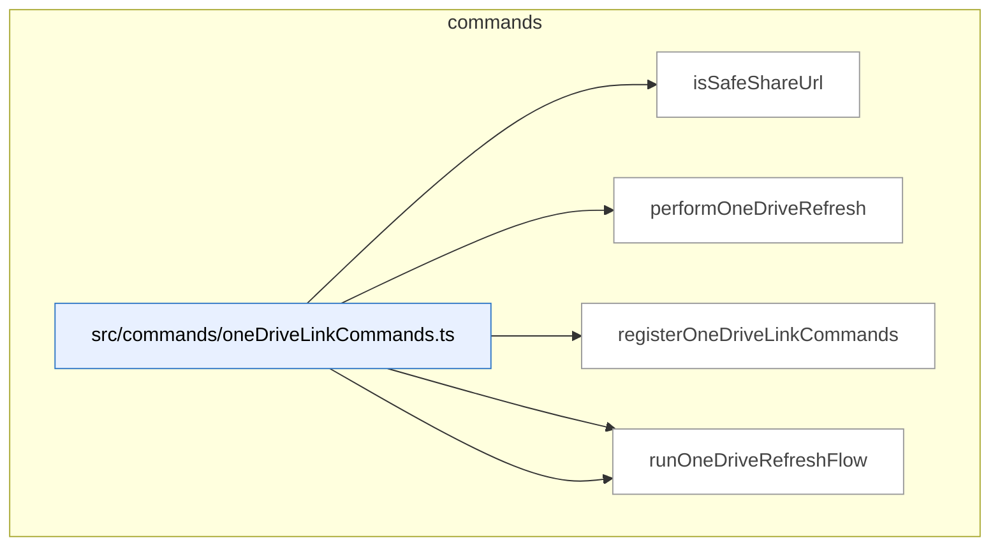
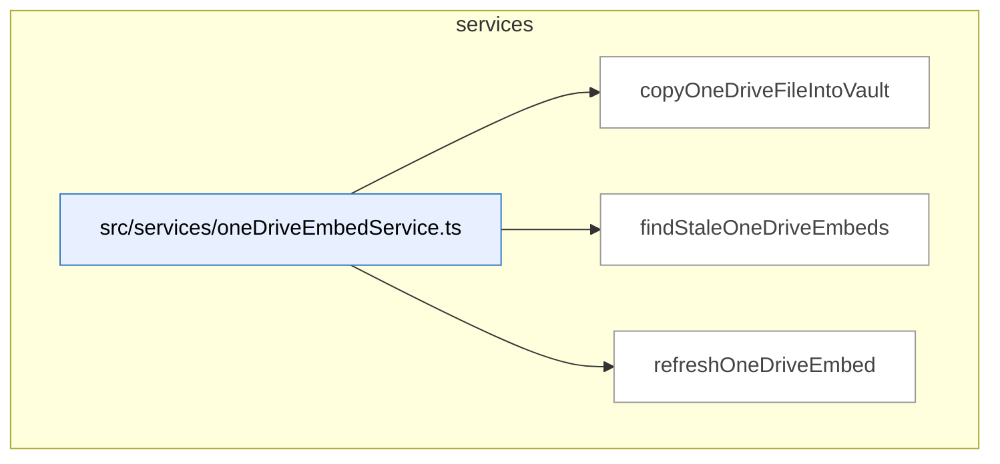
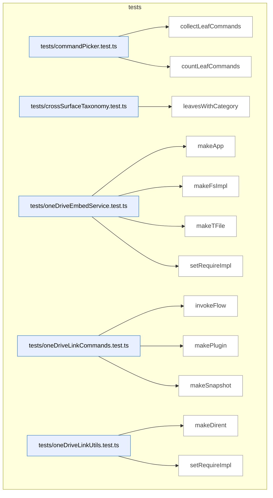
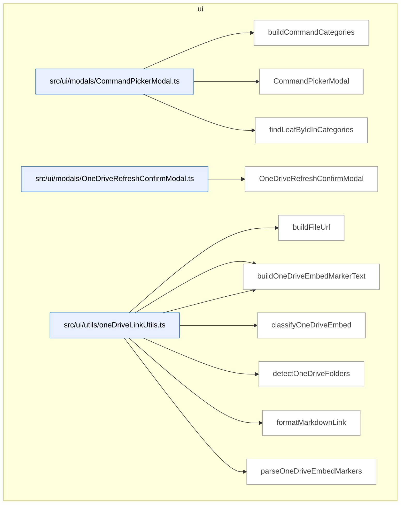

<!-- audit-loop:architectural-map -->
# Architecture Map — Lbstrydom/ai-organiser

- Generated: 2026-07-15T06:18:32.910Z   commit: 07e206e14621   refresh_id: e992f3b5-f5bd-4440-ae68-5ac583aa08ec
- Drift score: 1 / threshold 20   status: `GREEN`
- Domains: 4   Symbols: 31   Layering violations: 0

## Contents
- [commands](#commands) — 5 symbols
- [services](#services) — 3 symbols
- [tests](#tests) — 12 symbols
- [ui](#ui) — 11 symbols

---

## commands

> The `commands` domain handles OneDrive file linking and embed management, including inserting secure OneDrive links into notes and refreshing stale embedded files from disk.


```mermaid
flowchart TB
subgraph dom_commands ["commands"]
  file_src_commands_oneDriveLinkCommands_ts["src/commands/oneDriveLinkCommands.ts"]:::component
  sym_src_commands_oneDriveLinkCommands_ts_isS["isSafeShareUrl"]:::symbol
  file_src_commands_oneDriveLinkCommands_ts --> sym_src_commands_oneDriveLinkCommands_ts_isS
  sym_src_commands_oneDriveLinkCommands_ts_per["performOneDriveRefresh"]:::symbol
  file_src_commands_oneDriveLinkCommands_ts --> sym_src_commands_oneDriveLinkCommands_ts_per
  sym_src_commands_oneDriveLinkCommands_ts_reg["registerOneDriveLinkCommands"]:::symbol
  file_src_commands_oneDriveLinkCommands_ts --> sym_src_commands_oneDriveLinkCommands_ts_reg
  sym_src_commands_oneDriveLinkCommands_ts_run["runOneDriveLinkFlow"]:::symbol
  file_src_commands_oneDriveLinkCommands_ts --> sym_src_commands_oneDriveLinkCommands_ts_run
  sym_src_commands_oneDriveLinkCommands_ts_run["runOneDriveRefreshFlow"]:::symbol
  file_src_commands_oneDriveLinkCommands_ts --> sym_src_commands_oneDriveLinkCommands_ts_run
end
classDef container fill:#f5f5f5,stroke:#333,stroke-width:2px,color:#000
classDef component fill:#e8f0ff,stroke:#3178c6,color:#000
classDef symbol fill:#fff,stroke:#999,color:#444
classDef dup fill:#ffe8d8,stroke:#c0392b,stroke-width:2px,color:#000
classDef violation fill:#ffd6d6,stroke:#c0392b,stroke-width:2px,color:#000
```

### Symbols in this domain

| Symbol | Kind | Path | Lines | Purpose | File imported by |
|---|---|---|---|---|---|
| [`isSafeShareUrl`](../src/commands/oneDriveLinkCommands.ts#L26) | function | `src/commands/oneDriveLinkCommands.ts` | 26-33 | Validates that a URL is HTTPS with a non-empty host. | `src/commands/index.ts` |
| [`performOneDriveRefresh`](../src/commands/oneDriveLinkCommands.ts#L200) | function | `src/commands/oneDriveLinkCommands.ts` | 200-262 | Re-reads stale OneDrive files from disk and updates their vault copies and embed markers. | `src/commands/index.ts` |
| [`registerOneDriveLinkCommands`](../src/commands/oneDriveLinkCommands.ts#L264) | function | `src/commands/oneDriveLinkCommands.ts` | 264-316 | Registers two commands: one to insert OneDrive links and one to refresh OneDrive embeds. | `src/commands/index.ts` |
| [`runOneDriveLinkFlow`](../src/commands/oneDriveLinkCommands.ts#L41) | function | `src/commands/oneDriveLinkCommands.ts` | 41-165 | Prompts user to select a local file via native dialog, handling picker availability and dialog failures. | `src/commands/index.ts` |
| [`runOneDriveRefreshFlow`](../src/commands/oneDriveLinkCommands.ts#L174) | function | `src/commands/oneDriveLinkCommands.ts` | 174-198 | Finds stale OneDrive embeds in a note and opens a confirmation modal before refreshing them. | `src/commands/index.ts` |

---

## services

> The `services` domain handles syncing OneDrive files into a vault by copying files, detecting when source files become stale, and refreshing vault copies with updated content from disk.


```mermaid
flowchart TB
subgraph dom_services ["services"]
  file_src_services_oneDriveEmbedService_ts["src/services/oneDriveEmbedService.ts"]:::component
  sym_src_services_oneDriveEmbedService_ts_cop["copyOneDriveFileIntoVault"]:::symbol
  file_src_services_oneDriveEmbedService_ts --> sym_src_services_oneDriveEmbedService_ts_cop
  sym_src_services_oneDriveEmbedService_ts_fin["findStaleOneDriveEmbeds"]:::symbol
  file_src_services_oneDriveEmbedService_ts --> sym_src_services_oneDriveEmbedService_ts_fin
  sym_src_services_oneDriveEmbedService_ts_ref["refreshOneDriveEmbed"]:::symbol
  file_src_services_oneDriveEmbedService_ts --> sym_src_services_oneDriveEmbedService_ts_ref
end
classDef container fill:#f5f5f5,stroke:#333,stroke-width:2px,color:#000
classDef component fill:#e8f0ff,stroke:#3178c6,color:#000
classDef symbol fill:#fff,stroke:#999,color:#444
classDef dup fill:#ffe8d8,stroke:#c0392b,stroke-width:2px,color:#000
classDef violation fill:#ffd6d6,stroke:#c0392b,stroke-width:2px,color:#000
```

### Symbols in this domain

| Symbol | Kind | Path | Lines | Purpose | File imported by |
|---|---|---|---|---|---|
| [`copyOneDriveFileIntoVault`](../src/services/oneDriveEmbedService.ts#L42) | function | `src/services/oneDriveEmbedService.ts` | 42-77 | Copies a OneDrive file into the vault, validating size and handling disk read/write errors. | `src/commands/oneDriveLinkCommands.ts` |
| [`findStaleOneDriveEmbeds`](../src/services/oneDriveEmbedService.ts#L92) | function | `src/services/oneDriveEmbedService.ts` | 92-108 | Identifies embed markers whose source files have been modified since last insertion. | `src/commands/oneDriveLinkCommands.ts` |
| [`refreshOneDriveEmbed`](../src/services/oneDriveEmbedService.ts#L116) | function | `src/services/oneDriveEmbedService.ts` | 116-139 | Re-reads a stale OneDrive file from disk and overwrites its vault copy. | `src/commands/oneDriveLinkCommands.ts` |

---

## tests

> The `tests` domain provides utilities for unit testing, including helpers to construct mock objects (App, TFile, plugin, snapshots), recursively analyze command trees, and simulate OneDrive embed and link insertion flows.


```mermaid
flowchart TB
subgraph dom_tests ["tests"]
  file_tests_commandPicker_test_ts["tests/commandPicker.test.ts"]:::component
  sym_tests_commandPicker_test_ts_collectLeafC["collectLeafCommands"]:::symbol
  file_tests_commandPicker_test_ts --> sym_tests_commandPicker_test_ts_collectLeafC
  sym_tests_commandPicker_test_ts_countLeafCom["countLeafCommands"]:::symbol
  file_tests_commandPicker_test_ts --> sym_tests_commandPicker_test_ts_countLeafCom
  file_tests_crossSurfaceTaxonomy_test_ts["tests/crossSurfaceTaxonomy.test.ts"]:::component
  sym_tests_crossSurfaceTaxonomy_test_ts_leave["leavesWithCategory"]:::symbol
  file_tests_crossSurfaceTaxonomy_test_ts --> sym_tests_crossSurfaceTaxonomy_test_ts_leave
  file_tests_oneDriveEmbedService_test_ts["tests/oneDriveEmbedService.test.ts"]:::component
  sym_tests_oneDriveEmbedService_test_ts_makeA["makeApp"]:::symbol
  file_tests_oneDriveEmbedService_test_ts --> sym_tests_oneDriveEmbedService_test_ts_makeA
  sym_tests_oneDriveEmbedService_test_ts_makeF["makeFsImpl"]:::symbol
  file_tests_oneDriveEmbedService_test_ts --> sym_tests_oneDriveEmbedService_test_ts_makeF
  sym_tests_oneDriveEmbedService_test_ts_makeT["makeTFile"]:::symbol
  file_tests_oneDriveEmbedService_test_ts --> sym_tests_oneDriveEmbedService_test_ts_makeT
  sym_tests_oneDriveEmbedService_test_ts_setRe["setRequireImpl"]:::symbol
  file_tests_oneDriveEmbedService_test_ts --> sym_tests_oneDriveEmbedService_test_ts_setRe
  file_tests_oneDriveLinkCommands_test_ts["tests/oneDriveLinkCommands.test.ts"]:::component
  sym_tests_oneDriveLinkCommands_test_ts_invok["invokeFlow"]:::symbol
  file_tests_oneDriveLinkCommands_test_ts --> sym_tests_oneDriveLinkCommands_test_ts_invok
  sym_tests_oneDriveLinkCommands_test_ts_makeP["makePlugin"]:::symbol
  file_tests_oneDriveLinkCommands_test_ts --> sym_tests_oneDriveLinkCommands_test_ts_makeP
  sym_tests_oneDriveLinkCommands_test_ts_makeS["makeSnapshot"]:::symbol
  file_tests_oneDriveLinkCommands_test_ts --> sym_tests_oneDriveLinkCommands_test_ts_makeS
  file_tests_oneDriveLinkUtils_test_ts["tests/oneDriveLinkUtils.test.ts"]:::component
  sym_tests_oneDriveLinkUtils_test_ts_makeDire["makeDirent"]:::symbol
  file_tests_oneDriveLinkUtils_test_ts --> sym_tests_oneDriveLinkUtils_test_ts_makeDire
  sym_tests_oneDriveLinkUtils_test_ts_setRequi["setRequireImpl"]:::symbol
  file_tests_oneDriveLinkUtils_test_ts --> sym_tests_oneDriveLinkUtils_test_ts_setRequi
end
classDef container fill:#f5f5f5,stroke:#333,stroke-width:2px,color:#000
classDef component fill:#e8f0ff,stroke:#3178c6,color:#000
classDef symbol fill:#fff,stroke:#999,color:#444
classDef dup fill:#ffe8d8,stroke:#c0392b,stroke-width:2px,color:#000
classDef violation fill:#ffd6d6,stroke:#c0392b,stroke-width:2px,color:#000
```

### Symbols in this domain

| Symbol | Kind | Path | Lines | Purpose | File imported by |
|---|---|---|---|---|---|
| [`collectLeafCommands`](../tests/commandPicker.test.ts#L20) | function | `tests/commandPicker.test.ts` | 20-27 | Recursively collects all leaf commands from a command tree into a flat array. | _(unknown — run `npm run arch:refresh:full`)_ |
| [`countLeafCommands`](../tests/commandPicker.test.ts#L11) | function | `tests/commandPicker.test.ts` | 11-18 | Recursively counts the total number of leaf commands (those without sub-commands) in a command tree. | _(unknown — run `npm run arch:refresh:full`)_ |
| [`leavesWithCategory`](../tests/crossSurfaceTaxonomy.test.ts#L22) | function | `tests/crossSurfaceTaxonomy.test.ts` | 22-33 | Maps each leaf command to its containing category ID across all categories. | _(unknown — run `npm run arch:refresh:full`)_ |
| [`makeApp`](../tests/oneDriveEmbedService.test.ts#L55) | function | `tests/oneDriveEmbedService.test.ts` | 55-71 | Creates a mock Obsidian App object with vault methods for testing file operations. | _(unknown — run `npm run arch:refresh:full`)_ |
| [`makeFsImpl`](../tests/oneDriveEmbedService.test.ts#L40) | function | `tests/oneDriveEmbedService.test.ts` | 40-53 | Returns a mock `require` function that provides fake fs module methods for testing. | _(unknown — run `npm run arch:refresh:full`)_ |
| [`makeTFile`](../tests/oneDriveEmbedService.test.ts#L34) | function | `tests/oneDriveEmbedService.test.ts` | 34-38 | Creates a mock TFile object with a given vault path. | _(unknown — run `npm run arch:refresh:full`)_ |
| [`setRequireImpl`](../tests/oneDriveEmbedService.test.ts#L26) | function | `tests/oneDriveEmbedService.test.ts` | 26-32 | Sets or clears the global `require` function for testing in embed service tests. | _(unknown — run `npm run arch:refresh:full`)_ |
| [`invokeFlow`](../tests/oneDriveLinkCommands.test.ts#L139) | function | `tests/oneDriveLinkCommands.test.ts` | 139-144 | Invokes the OneDrive link insertion flow with test fixtures. | _(unknown — run `npm run arch:refresh:full`)_ |
| [`makePlugin`](../tests/oneDriveLinkCommands.test.ts#L114) | function | `tests/oneDriveLinkCommands.test.ts` | 114-137 | Creates a mock plugin object with translations for testing OneDrive link flows. | _(unknown — run `npm run arch:refresh:full`)_ |
| [`makeSnapshot`](../tests/oneDriveLinkCommands.test.ts#L105) | function | `tests/oneDriveLinkCommands.test.ts` | 105-112 | Creates a mock snapshot object for testing note state. | _(unknown — run `npm run arch:refresh:full`)_ |
| [`makeDirent`](../tests/oneDriveLinkUtils.test.ts#L32) | function | `tests/oneDriveLinkUtils.test.ts` | 32-38 | Creates a mock fs.Dirent object with name and type predicates. | _(unknown — run `npm run arch:refresh:full`)_ |
| [`setRequireImpl`](../tests/oneDriveLinkUtils.test.ts#L18) | function | `tests/oneDriveLinkUtils.test.ts` | 18-24 | Sets or clears the global `require` function for testing Node.js module availability. | _(unknown — run `npm run arch:refresh:full`)_ |

---

## ui

> The `ui` domain handles modal interfaces for command discovery and OneDrive embed management, along with utilities for converting OneDrive file paths to vault links and embeds with proper URL encoding and metadata tracking.


```mermaid
flowchart TB
subgraph dom_ui ["ui"]
  file_src_ui_modals_CommandPickerModal_ts["src/ui/modals/CommandPickerModal.ts"]:::component
  sym_src_ui_modals_CommandPickerModal_ts_buil["buildCommandCategories"]:::symbol
  file_src_ui_modals_CommandPickerModal_ts --> sym_src_ui_modals_CommandPickerModal_ts_buil
  sym_src_ui_modals_CommandPickerModal_ts_Comm["CommandPickerModal"]:::symbol
  file_src_ui_modals_CommandPickerModal_ts --> sym_src_ui_modals_CommandPickerModal_ts_Comm
  sym_src_ui_modals_CommandPickerModal_ts_find["findLeafByIdInCategories"]:::symbol
  file_src_ui_modals_CommandPickerModal_ts --> sym_src_ui_modals_CommandPickerModal_ts_find
  file_src_ui_modals_OneDriveRefreshConfirmModa["src/ui/modals/OneDriveRefreshConfirmModal.ts"]:::component
  sym_src_ui_modals_OneDriveRefreshConfirmModa["OneDriveRefreshConfirmModal"]:::symbol
  file_src_ui_modals_OneDriveRefreshConfirmModa --> sym_src_ui_modals_OneDriveRefreshConfirmModa
  file_src_ui_utils_oneDriveLinkUtils_ts["src/ui/utils/oneDriveLinkUtils.ts"]:::component
  sym_src_ui_utils_oneDriveLinkUtils_ts_buildF["buildFileUrl"]:::symbol
  file_src_ui_utils_oneDriveLinkUtils_ts --> sym_src_ui_utils_oneDriveLinkUtils_ts_buildF
  sym_src_ui_utils_oneDriveLinkUtils_ts_buildO["buildOneDriveEmbedBlock"]:::symbol
  file_src_ui_utils_oneDriveLinkUtils_ts --> sym_src_ui_utils_oneDriveLinkUtils_ts_buildO
  sym_src_ui_utils_oneDriveLinkUtils_ts_buildO["buildOneDriveEmbedMarkerText"]:::symbol
  file_src_ui_utils_oneDriveLinkUtils_ts --> sym_src_ui_utils_oneDriveLinkUtils_ts_buildO
  sym_src_ui_utils_oneDriveLinkUtils_ts_classi["classifyOneDriveEmbed"]:::symbol
  file_src_ui_utils_oneDriveLinkUtils_ts --> sym_src_ui_utils_oneDriveLinkUtils_ts_classi
  sym_src_ui_utils_oneDriveLinkUtils_ts_detect["detectOneDriveFolders"]:::symbol
  file_src_ui_utils_oneDriveLinkUtils_ts --> sym_src_ui_utils_oneDriveLinkUtils_ts_detect
  sym_src_ui_utils_oneDriveLinkUtils_ts_format["formatMarkdownLink"]:::symbol
  file_src_ui_utils_oneDriveLinkUtils_ts --> sym_src_ui_utils_oneDriveLinkUtils_ts_format
  sym_src_ui_utils_oneDriveLinkUtils_ts_parseO["parseOneDriveEmbedMarkers"]:::symbol
  file_src_ui_utils_oneDriveLinkUtils_ts --> sym_src_ui_utils_oneDriveLinkUtils_ts_parseO
end
classDef container fill:#f5f5f5,stroke:#333,stroke-width:2px,color:#000
classDef component fill:#e8f0ff,stroke:#3178c6,color:#000
classDef symbol fill:#fff,stroke:#999,color:#444
classDef dup fill:#ffe8d8,stroke:#c0392b,stroke-width:2px,color:#000
classDef violation fill:#ffd6d6,stroke:#c0392b,stroke-width:2px,color:#000
```

### Symbols in this domain

| Symbol | Kind | Path | Lines | Purpose | File imported by |
|---|---|---|---|---|---|
| [`buildCommandCategories`](../src/ui/modals/CommandPickerModal.ts#L694) | function | `src/ui/modals/CommandPickerModal.ts` | 694-972 | Builds a categorized taxonomy of all available commands with aliases and metadata for the command picker. | `src/main.ts`, `src/ui/settings/QuickCommandsSettingsSection.ts` |
| [`CommandPickerModal`](../src/ui/modals/CommandPickerModal.ts#L72) | class | `src/ui/modals/CommandPickerModal.ts` | 72-653 | Modal interface for browsing and executing commands, managing expanded categories and keyboard navigation. | `src/main.ts`, `src/ui/settings/QuickCommandsSettingsSection.ts` |
| [`findLeafByIdInCategories`](../src/ui/modals/CommandPickerModal.ts#L678) | function | `src/ui/modals/CommandPickerModal.ts` | 678-692 | Searches categories and their sub-commands recursively for a command by ID. | `src/main.ts`, `src/ui/settings/QuickCommandsSettingsSection.ts` |
| [`OneDriveRefreshConfirmModal`](../src/ui/modals/OneDriveRefreshConfirmModal.ts#L22) | class | `src/ui/modals/OneDriveRefreshConfirmModal.ts` | 22-54 | Modal dialog for confirming refresh of modified OneDrive embeds before applying changes. | `src/commands/oneDriveLinkCommands.ts` |
| [`buildFileUrl`](../src/ui/utils/oneDriveLinkUtils.ts#L85) | function | `src/ui/utils/oneDriveLinkUtils.ts` | 85-106 | Converts absolute file paths (UNC, Windows drive, or Unix) into properly-encoded file:// URLs. | `src/commands/oneDriveLinkCommands.ts` |
| [`buildOneDriveEmbedBlock`](../src/ui/utils/oneDriveLinkUtils.ts#L200) | function | `src/ui/utils/oneDriveLinkUtils.ts` | 200-210 | Combines an embed marker and Markdown embed/link syntax into a complete embed block. | `src/commands/oneDriveLinkCommands.ts` |
| [`buildOneDriveEmbedMarkerText`](../src/ui/utils/oneDriveLinkUtils.ts#L182) | function | `src/ui/utils/oneDriveLinkUtils.ts` | 182-191 | Builds the HTML comment marker that stores OneDrive embed metadata (source, vault path, modification time). | `src/commands/oneDriveLinkCommands.ts` |
| [`classifyOneDriveEmbed`](../src/ui/utils/oneDriveLinkUtils.ts#L154) | function | `src/ui/utils/oneDriveLinkUtils.ts` | 154-160 | Determines whether a file should be embedded, vault-linked, or exposed as a plain file URL based on extension. | `src/commands/oneDriveLinkCommands.ts` |
| [`detectOneDriveFolders`](../src/ui/utils/oneDriveLinkUtils.ts#L22) | function | `src/ui/utils/oneDriveLinkUtils.ts` | 22-76 | Scans the user's filesystem to find folders matching OneDrive naming patterns. | `src/commands/oneDriveLinkCommands.ts` |
| [`formatMarkdownLink`](../src/ui/utils/oneDriveLinkUtils.ts#L127) | function | `src/ui/utils/oneDriveLinkUtils.ts` | 127-136 | Formats a URL and display text into a safe Markdown link, escaping special characters. | `src/commands/oneDriveLinkCommands.ts` |
| [`parseOneDriveEmbedMarkers`](../src/ui/utils/oneDriveLinkUtils.ts#L218) | function | `src/ui/utils/oneDriveLinkUtils.ts` | 218-225 | Extracts all OneDrive embed markers from note content via regex matching. | `src/commands/oneDriveLinkCommands.ts` |

---

## Layering violations

_No violations detected on this snapshot._

---

## How to regenerate

```bash
npm run arch:refresh   # update the index
npm run arch:render    # regenerate this file
```

## How to interpret

- Each domain has a Mermaid diagram (containers → components → symbols) and a flat table.
- **Duplication clusters** appear with `[DUP]` in the table and the `dup` class in Mermaid.
- Layering violations appear in the dedicated section above.
- Anchor links remain stable across regenerations as long as symbol names don't change.
- The "File imported by" column lists the top files that import the file each symbol lives in (alphabetical, top 3, suffix `, +N more` if more exist). All symbols in the same file share the same list — the data is **file-level, not per-symbol** (Plan v6 §2.6).

---

## Plan a change in this area

- **Quick**: `/plan <task description>` — auto-detects scope + consults this index for near-duplicates
- **Onboarding / refactor safety**: `/explain <file:line>` — shows domain + git history + principles
- **Drift triage**: `npm run arch:duplicates` — top cross-file duplicate clusters worth refactoring
- **Full cycle**: `/cycle <task>` — runs plan → audit-plan → impl gate → audit-code → ship end-to-end
