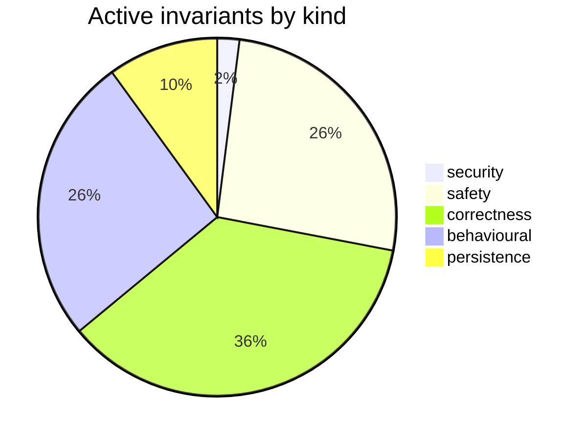

# Requirements Map — ai-organiser

_Generated from `.requirements/ledger.json` — 394 requirement(s) across 13 file(s). Do not hand-edit; regenerate with `node scripts/requirements.mjs render`._

## At a glance

| Status | Count |
|---|---|
| 🟢 active — enforced by /audit-code | 50 |
| 🟡 needs-review — awaiting your call | 7 |
| ⚪ inferred-only — refine backlog | 337 |

## 🟡 Needs review (7)

| Gap | Assertion | Files |
|---|---|---|
| contradictory | Adapter response parsing must fail if provider.responseFormat.path is absent and must wrap all parsing failures in an error message prefixed with 'Failed to parse response:'. | src/services/adapters/baseAdapter.ts |
| contradictory | Adapter response parsing must detect provider error responses via provider.responseFormat.errorPath and throw the extracted string error message or 'Unknown error' before normal result extraction. | src/services/adapters/baseAdapter.ts |
| observed-but-unintended | A successful migrateFromPlainText run sets settings.secretStorageMigrated to true, saves settings, and may report migrated true even when individual entry migrations failed. | src/services/secretStorageService.ts |
| contradictory | Taxonomy loading must fall back to DEFAULT_TAXONOMY when the taxonomy file is missing, is not a TFile, cannot be read, or yields no parsed entries for a section. | src/services/configurationService.ts |
| contradictory | Taxonomy parsing must fall back independently to default themes or default disciplines when the corresponding parsed section produces no entries. | src/services/configurationService.ts |
| untested | Reading a secret must return null when SecretStorage is unavailable, when the stored value is falsy, or when the underlying get operation throws. | src/services/secretStorageService.ts |
| untested | SecretStorageService.getSecret returns null when SecretStorage is unavailable, when the stored value is empty or otherwise falsy, or when reading the secret throws. | src/services/secretStorageService.ts |

## 🟢 Active invariants — by kind

### security (1)

| ID | Assertion | Governs |
|---|---|---|
| `REQ-security-5e55e6ee` | external document URL extraction rejects any URL that does not start with https:// before performing a network request. | src/services/documentExtractionService.ts |

### safety (13)

| ID | Assertion | Governs |
|---|---|---|
| `REQ-safety-15359f86` | Multimodal PDF extraction falls back to PDF text extraction when configuration is absent, base64 PDF loading fails, the multimodal LLM response is unsuccessful or empty, or an exception is thrown. | src/services/contentExtractionService.ts |
| `REQ-safety-1a327ddb` | failed intermediate hierarchical merges preserve and return the original batch inputs rather than dropping that batch's content. | src/services/chunkingOrchestrator.ts |
| `REQ-safety-1a8940c2` | Multimodal requests must fail before sending any provider request when image content is used with a text-only provider or document content is used with a provider that lacks document support. | src/services/cloudService.ts |
| `REQ-safety-3059579a` | BaseAdapter.makeRequest must never perform network I/O and must reject with an error directing callers to use CloudLLMService instead. | src/services/adapters/baseAdapter.ts |
| `REQ-safety-5c15fa03` | Disposing an LLM service must clear every registered request timeout, abort every registered AbortController with 'Service disposed', clear the active request set, and resolve without throwing. | src/services/baseService.ts |
| `REQ-safety-5dd3364f` | Cloud request retry logic must retry transient network errors and HTTP 429, 502, 503, 504, and 529 up to three attempts, while never retrying HTTP 401 or 403 responses. | src/services/cloudService.ts |
| `REQ-safety-6170f8e2` | Reviewed edits are enabled by default so note-modifying features show a diff preview before applying changes unless the user disables the setting. | src/core/settings.ts |
| `REQ-safety-684cd339` | Vault-wide migration must exclude every markdown file whose path starts with any configured excluded folder string before migration begins. | src/services/migrationService.ts |
| `REQ-safety-7d7f80f3` | Optional LLM audit calls are disabled by default and, when enabled without overrides, use the main provider with no audit model override. | src/core/settings.ts |
| `REQ-safety-a2b170af` | Single-note migration must catch any thrown error, log it with the file path, and return false rather than propagating the exception. | src/services/migrationService.ts |
| `REQ-safety-b363bbd9` | RTF extraction returns failure when parsed text is shorter than 10 characters or less than or equal to 80 percent readable printable characters. | src/services/documentExtractionService.ts |
| `REQ-safety-b45dcd21` | Research usage guardrails are enabled by default with a monthly budget of 10 USD, warning threshold of 80 percent, and blocking enabled at the limit. | src/core/settings.ts |
| `REQ-safety-ffe5fba5` | A note with existing AIO status metadata is skipped and not rewritten when overwriteExisting is false. | src/services/migrationService.ts |

### correctness (18)

| ID | Assertion | Governs |
|---|---|---|
| `REQ-correctness-0956203c` | Changing the configuration folder via setConfigFolder must invalidate the cached configuration immediately. | src/services/configurationService.ts |
| `REQ-correctness-098a3506` | serviceSupportsMultimodal returns true only for service types claude and gemini, compared case-insensitively. | src/services/contentExtractionService.ts |
| `REQ-correctness-0fa35d8d` | Tag validation fails with success=false and error 'No tags to validate' when given an empty tag array. | src/services/taxonomyGuardrailService.ts |
| `REQ-correctness-119c9100` | Persona prompt extraction must use the content between the first and last code fence in a persona section so nested fenced code blocks inside prompts are preserved. | src/services/configurationService.ts |
| `REQ-correctness-384fdde5` | spreadsheet files are extracted through the dynamically imported spreadsheetService and returned as markdown rather than being parsed through officeparser. | src/services/documentExtractionService.ts |
| `REQ-correctness-55b4ade0` | CloudLLMService resolves symbolic latest-* model IDs to concrete model IDs using the live cached model list when available and otherwise the static registry, after substituting the provider default fo | src/services/cloudService.ts |
| `REQ-correctness-600bcb27` | Output path resolution strips a legacy plugin-folder prefix from the configured subfolder when the effective output root differs from the plugin folder. | src/core/settings.ts |
| `REQ-correctness-6a376cc6` | Parsed persona IDs are derived from the persona header by lowercasing the display name, replacing non-alphanumeric runs with hyphens, and trimming leading or trailing hyphens, while '(default)' and '[ | src/services/configurationService.ts |
| `REQ-correctness-a39a7d53` | OpenAI-compatible SSE parsing must ignore lines not starting with 'data: ', ignore '[DONE]', return choices[0].delta.content for valid JSON data lines, and return null for malformed JSON. | src/services/adapters/baseAdapter.ts |
| `REQ-correctness-a68c6de8` | successful extracted items with a base64 field are classified into binaryContent while successful extracted items without base64 are classified into textContent. | src/services/contentExtractionService.ts |
| `REQ-correctness-c05c3c4d` | if the final reduce phase returns no summary, orchestrateChunked returns ok false and appends a synthetic ChunkError with chunkIndex -1 and error "Reduce phase returned empty". | src/services/chunkingOrchestrator.ts |
| `REQ-correctness-c58ef6d4` | Provider-specific secret reads and writes must use `PROVIDER_TO_SECRET_ID`, with unmapped provider reads returning null and unmapped provider writes throwing an error. | src/services/secretStorageService.ts |
| `REQ-correctness-cb85e505` | Folder path resolution trims whitespace, converts backslashes to forward slashes, strips leading and trailing slashes, and substitutes the provided fallback when the resulting segment is empty. | src/core/settings.ts |
| `REQ-correctness-cf4448ae` | Claude summarization enables adaptive thinking only when the adapter config requests adaptive thinking, the selected Claude model supports adaptive thinking, and the per-call options do not disable th | src/services/cloudService.ts |
| `REQ-correctness-d037cc1f` | LLM service construction must trim leading and trailing whitespace from configured endpoint and modelName before storing them. | src/services/baseService.ts |
| `REQ-correctness-d83fc716` | Adapter response parsing normalizes non-array matchedTags and newTags fields to empty arrays and returns matchedExistingTags and suggestedTags as trimmed strings. | src/services/adapters/baseAdapter.ts |
| `REQ-correctness-fc17bd1e` | validateTags reconstructs successful tag arrays with the resolved theme at index 0, the resolved discipline at index 1 when present, and all non-theme/non-discipline original tags after them as topics | src/services/taxonomyGuardrailService.ts |
| `REQ-correctness-fda0acb7` | Taxonomy parsing must only populate themes from markdown sections whose level-two heading contains "theme" and disciplines from sections whose level-two heading contains "discipline". | src/services/configurationService.ts |

### behavioural (13)

| ID | Assertion | Governs |
|---|---|---|
| `REQ-behavioural-18fd3176` | Provider-specific adapter request formatting must preserve the provider requestFormat.body fields while replacing messages with exactly the shared SYSTEM_PROMPT system message followed by the caller p | src/services/adapters/baseAdapter.ts |
| `REQ-behavioural-2bbfa626` | Hierarchical reduction is used only when assessment.strategy is 'hierarchical' and the number of successful map results exceeds HIERARCHICAL_CHUNK_THRESHOLD. | src/services/chunkingOrchestrator.ts |
| `REQ-behavioural-2c33f82b` | getPersonaPrompt wraps the selected or default writing persona prompt in <persona> tags, while getSummaryPersonaPrompt and getMinutesPersonaPrompt return the selected or default prompt text without XM | src/services/configurationService.ts |
| `REQ-behavioural-330472f2` | Default writing, summary, and minutes persona getters return the first persona marked isDefault, otherwise the first configured persona, otherwise the corresponding built-in default persona. | src/services/configurationService.ts |
| `REQ-behavioural-48aacabb` | PDF text extraction tries officeparser first and falls back to byte-level parenthesized-string extraction only when officeparser is unavailable, throws, or returns empty text. | src/services/documentExtractionService.ts |
| `REQ-behavioural-4a900adf` | New installations default to cloud Claude service using endpoint https://api.anthropic.com/v1/messages, cloudServiceType claude, and cloudModel claude-sonnet-4-6 with an empty cloudApiKey. | src/core/settings.ts |
| `REQ-behavioural-54c1b721` | Connection tests classify AbortError as timeout, Failed to fetch as network, authentication failures as auth, and 404 endpoint or model errors as network errors with a refresh-models recommendation. | src/services/cloudService.ts |
| `REQ-behavioural-92677265` | PDF items use multimodal extraction only when pdfExtractionConfig is set and textOnly is false; otherwise they use text extraction. | src/services/contentExtractionService.ts |
| `REQ-behavioural-a04b92e4` | orchestrateChunked returns a successful empty summary without invoking chunking or LLM services when the input text is empty or whitespace-only. | src/services/chunkingOrchestrator.ts |
| `REQ-behavioural-bd8c5513` | Configuration loading must return a cached ConfigContent without reading vault files when forceReload is false, a cached value exists, and the cache age is under 30 seconds. | src/services/configurationService.ts |
| `REQ-behavioural-dfaf7f0d` | Specialist provider resolution must return null when its required settings flag is false or when the selected provider equals the configured skip provider. | src/services/apiKeyHelpers.ts |
| `REQ-behavioural-e630333c` | Audio transcription key resolution must try the selected provider first, then fall back to the other provider between OpenAI and Groq, and must return the provider that supplied the key. | src/services/apiKeyHelpers.ts |
| `REQ-behavioural-fdaee53f` | Summary extraction must ignore leading YAML frontmatter and prefer a Summary section over a TL;DR section over the first paragraph, returning the first paragraph only when its length is greater than 5 | src/services/migrationService.ts |

### persistence (5)

| ID | Assertion | Governs |
|---|---|---|
| `REQ-persistence-002f9bfb` | Migration must persist an AIO language value only when detectLanguage returns a value other than unknown. | src/services/migrationService.ts |
| `REQ-persistence-4e29b5d5` | Legacy sketch output folder value `AI-Organiser/Sketches` is migrated to the subfolder-only value `Sketches`. | src/core/settings.ts |
| `REQ-persistence-77302bb4` | Settings with legacy `serviceType` value `ollama` are migrated to `local`, copy `ollamaEndpoint` to `localEndpoint`, copy `ollamaModel` to `localModel`, and delete the legacy Ollama keys. | src/core/settings.ts |
| `REQ-persistence-93829a7c` | Generated writing, summary, and minutes persona configuration files begin with a persona schema version marker generated from CURRENT_PERSONA_SCHEMA_VERSION. | src/services/configurationService.ts |
| `REQ-persistence-b020add6` | Persona configuration migration is a no-op when oldVersion is greater than or equal to CURRENT_PERSONA_SCHEMA_VERSION. | src/services/configurationService.ts |

## By file

| File | 🟢 | 🟡 | ⚪ |
|---|--:|--:|--:|
| `src/core/settings.ts` | 8 | 0 | 63 |
| `src/services/adapters/baseAdapter.ts` | 4 | 2 | 17 |
| `src/services/adapters/providerRegistry.ts` | 0 | 0 | 4 |
| `src/services/apiKeyHelpers.ts` | 2 | 0 | 11 |
| `src/services/baseService.ts` | 2 | 0 | 38 |
| `src/services/chunkingOrchestrator.ts` | 4 | 0 | 27 |
| `src/services/cloudService.ts` | 5 | 0 | 24 |
| `src/services/configurationService.ts` | 9 | 2 | 49 |
| `src/services/contentExtractionService.ts` | 4 | 0 | 16 |
| `src/services/documentExtractionService.ts` | 4 | 0 | 10 |
| `src/services/migrationService.ts` | 5 | 0 | 39 |
| `src/services/secretStorageService.ts` | 1 | 3 | 18 |
| `src/services/taxonomyGuardrailService.ts` | 2 | 0 | 22 |
