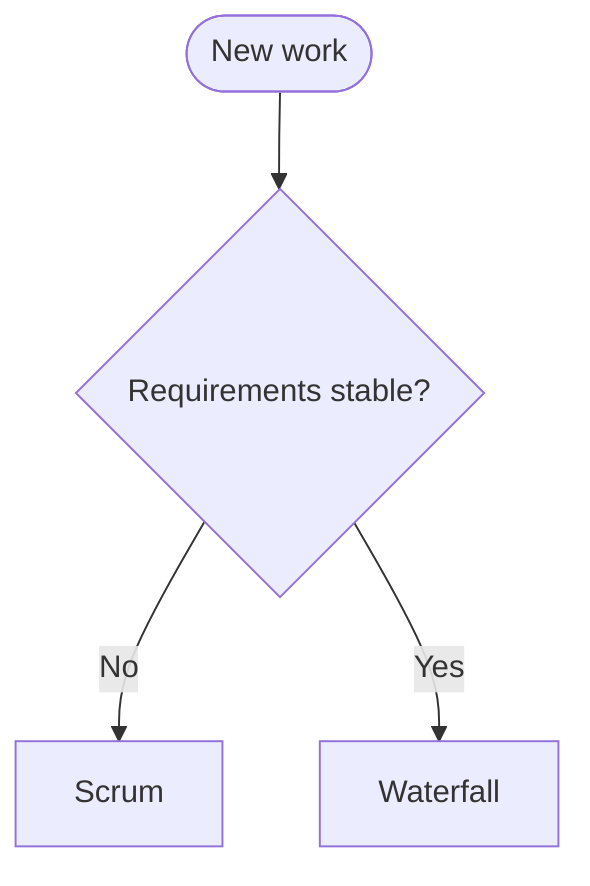

---
tags:
  - test
---

# Test note: process selection

## Introduction

When choosing a software process model, weigh the trade-offs.

## Decision tree

> [!important] Key Insight
> No silver bullet — context matters.

## Maturity table

| Level | Name | Key trait |
|-------|------|-----------|
| 1 | Initial | Chaotic |
| 2 | Managed | Repeatable |
| 3 | Defined | Standardised |
| 4 | Managed | Quantitative |
| 5 | Optimising | Continuous |
